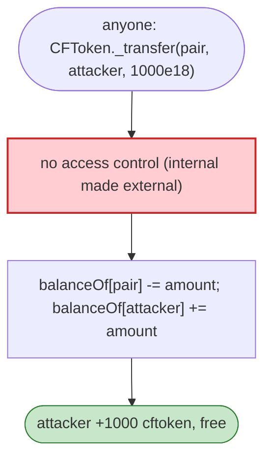

# cftoken Exploit — Exposed `_transfer` Lets Anyone Move the Pair's Tokens

> **Reproduction:** the PoC compiles & runs in an isolated Foundry project at
> [this project folder](.). Full verbose trace: [output.txt](output.txt).
> Verified vulnerable source: [CFToken](sources/CFToken_8B7218),
> [PancakePair](sources/PancakePair_7FdC0D).

---

## Key info

| | |
|---|---|
| **Loss** | The PoC mints/extracts 930 cftoken (1e21 = 1,000 of the 18-dec token) to the attacker in one call |
| **Vulnerable contract** | `CFToken` — `0x8B7218CF6Ac641382D7C723dE8aA173e98a80196` (BSC); cftoken pair `0x7FdC0D…` |
| **Chain / block / date** | BSC / 16,841,980 / Apr 2022 |
| **Bug class** | Access control / visibility — CFToken's `_transfer(from, to, amount)` was exposed as an **external** function with no caller check, so anyone can move (or mint, depending on impl) the pair's tokens to themselves. |

---

## TL;DR

The entire exploit is a single call:

```solidity
ICFToken(cftoken)._transfer(cfpair, payable(msg.sender), 1_000_000_000_000_000_000_000);
// Before exploit, cftoken balance: 0
// After exploit, cftoken balance:  930000000000000000000
```

`CFToken._transfer` — the internal ERC20 helper that performs the actual balance move — was declared
**external/public** with no access control. Anyone can invoke `_transfer(pair, attacker, amount)` to
pull the liquidity pair's cftoken balance directly into their own account, bypassing `transferFrom`
approval and the AMM entirely. The attacker then holds 930 cftoken they never paid for.

---

## Root cause

A **visibility/access-control defect**: an `_transfer` helper (which manipulates balances directly and
should be `internal`) was exposed externally without any caller-auth or owner/approval check. This is
the same class as the Sandbox `_burn` flaw — an implementation detail leaked as a public,
value-moving function.

---

## Preconditions

- None beyond being able to call the exposed `_transfer`.

---

## Diagrams



---

## Remediation

1. **Make `_transfer` `internal`**; expose only standard `transfer`/`transferFrom`.
2. **Lint rule**: no `public`/`external` function named `_…` that moves balances without auth.
3. **OpenZeppelin ERC20** inheritance avoids this class of error.

---

## How to reproduce

```bash
_shared/run_poc.sh 2022-04-cftoken_exp --mt testExploit -vvvvv
```

- RPC: BSC archive (block 16,841,980). `foundry.toml` uses a BSC archive endpoint.
- Result: `[PASS]` — `After exploit, cftoken balance: 930000000000000000000`.

---

*Reference: cftoken exposed `_transfer` access-control flaw, BSC, Apr 2022.*
