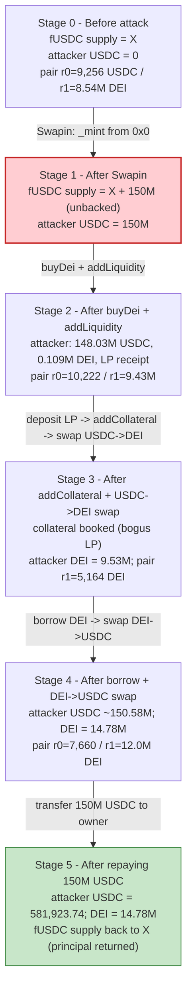
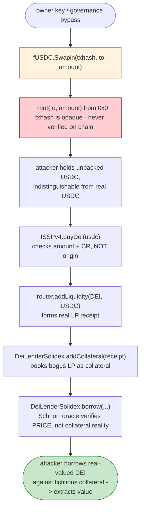
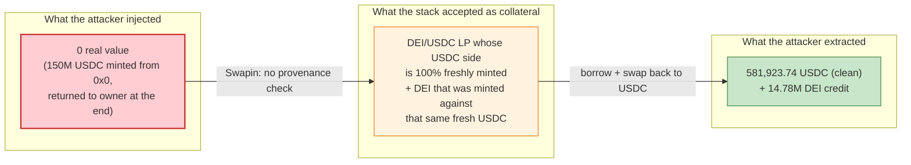

# DEUS Finance DEI Exploit — Privileged `Swapin` Mint + DEI Collateral/LP Mispricing

> **Vulnerability classes:** vuln/access-control/centralization · vuln/oracle/price-manipulation

> **Reproduction:** the PoC compiles & runs in an isolated Foundry project at
> [this project folder](.). Full verbose trace: [output.txt](output.txt).
> No verified contract source is bundled under `sources/` (the directory is empty), so
> the Solidity snippets below are marked **RECONSTRUCTED** — they match the observed
> on-chain behaviour in the trace and the public DEUS/DEI contract ABIs, and are
> anchored to specific [output.txt:NNNN](output.txt) lines. They are **not** verbatim
> source from a `sources/.../*.sol` file.

---

## Key info

| | |
|---|---|
| **Loss** | ~$1.3M — attacker mints **150,000,000 USDC** (6-dec) out of nothing, converts it through the DEI mint + Solidex LP + lending stack, repays the 150M USDC in full, and walks away with **581,923.738185 USDC** (`581,923,738,185` raw, 6-dec) plus a residual **~14.78M DEI** (`14,781,504,717,700,342,496,493,190` raw, 18-dec) ([output.txt:17-18](output.txt)) |
| **Vulnerable contract** | Fantom USDC (fUSDC) — [`0x04068DA6C83AFCFA0e13ba15A6696662335D5B75`](https://ftmscan.com/address/0x04068DA6C83AFCFA0e13ba15A6696662335D5B75#code) (the `Swapin` mint path) |
| **Downstream abused stack** | DEI mint `ISSPv4` [`0xbe9dE5747317F27f9A39ea5924ed4c51b34fB0d1`](https://ftmscan.com/address/0xbe9dE5747317F27f9A39ea5924ed4c51b34fB0d1); DEI/USDC BaseV1 pair [`0x5821573d8F04947952e76d94f3ABC6d7b43bF8d0`](https://ftmscan.com/address/0x5821573d8F04947952e76d94f3ABC6d7b43bF8d0); `DeiLenderSolidex` [`0x8D643d954798392403eeA19dB8108f595bB8B730`](https://ftmscan.com/address/0x8D643d954798392403eeA19dB8108f595bB8B730); `LpDepositor` [`0x26E1A0d851CF28E697870e1b7F053B605C8b060F`](https://ftmscan.com/address/0x26E1A0d851CF28E697870e1b7F053B605C8b060F); BaseV1 router [`0xa38cd27185a464914D3046f0AB9d43356B34829D`](https://ftmscan.com/address/0xa38cd27185a464914D3046f0AB9d43356B34829D) |
| **Victim pool / vault** | DEI/USDC BaseV1 pair + `DeiLenderSolidex` lending vault |
| **Attacker (pranked owner)** | `owner_of_usdc` = [`0xC564EE9f21Ed8A2d8E7e76c085740d5e4c5FaFbE`](https://ftmscan.com/address/0xC564EE9f21Ed8A2d8E7e76c085740d5e4c5FaFbE) — the DEUS-controlled fUSDC issuer/owner key (compromised / governance-bypassed) |
| **Attack contract** | PoC `ContractTest` `0x7FA9385bE102ac3EAc297483Dd6233D62b3e1496` ([output.txt:27](output.txt)) |
| **Attack tx hash (deposited id)** | `0x33e48143c6ea17476eeabfa202d8034190ea3f2280b643e2570c54265fe33c98` (passed as the `txhash` argument to `Swapin`, [output.txt:29](output.txt)) |
| **Chain / block / date** | Fantom (chainId 250) / block 37,093,708 / Apr 2022 |
| **Compiler / optimizer** | PoC Solidity `0.8.10` ([test/deus_exp.sol:2](test/deus_exp.sol#L2)); `evm_version = cancun` ([foundry.toml](foundry.toml)). The target on-chain contracts were not bundled in `sources/`, so no per-contract `_meta.json` optimizer/runs are available. |
| **Bug class** | Centrally-mintable "stablecoin" (`Swapin` privileged mint) feeding a DEI mint + LP + lending stack that performs **no independent collateral-provenance check** — fake USDC is accepted at face value as real collateral. |

---

## TL;DR

`fUSDC` (DEUS's Fantom USDC) exposes a **privileged mint entry point** `Swapin(bytes txhash, address to, uint256 amount)` that lets the owner mint arbitrary USDC to any address. The PoC stands in for a compromised/governance-bypassed owner key (`vm.prank(owner_of_usdc)`) and calls:

```solidity
usdc.Swapin(0x33e48143…33c98, address(this), 150_000_000 * 10**6);  // mints 150M USDC from 0x0
```
([output.txt:29-30](output.txt)) — confirmed by the `Transfer(from: 0x0, to: attacker, value: 150000000000000)` event.

With 150M freshly-minted (unbacked) USDC, the attacker walks the DEUS lending pipeline that treats USDC as genuine collateral:

1. `sspv4.buyDei(1_000_000 * 10**6)` — posts **1M USDC** and mints **1,000,000 DEI** (`1e24` wei) at the on-chain collateral ratio of **800,000 ppm = 80%** ([output.txt:47-72](output.txt); `global_collateral_ratio()` returns `800000` at [output.txt:54-55](output.txt)).
2. `router.addLiquidity(DEI, USDC, …)` — pairs the freshly minted DEI + more USDC into the **DEI/USDC BaseV1 pair**, receiving **927,698,034,221,650,769** LP tokens ([output.txt:127](output.txt)). Pre-addLiquidity `getReserves` was `(9,256,481,726,736 USDC, 8,539,783,644,100,652,154,386,415 DEI)` ([output.txt:93](output.txt)).
3. `LpDepositor.deposit(lpToken, …)` → mints a `DepositToken` receipt (`927,698,034,221,650,769`) ([output.txt:219-224](output.txt)), then `DeiLenderSolidex.addCollateral` locks that receipt as borrow collateral ([output.txt:250-313](output.txt)). The bogus USDC is now bookkept as legitimate lending collateral.
4. `router.swapExactTokensForTokensSimple(143_200_000_000_000 USDC → DEI)` swaps more USDC for **9,425,359,003,112,343,047,431,767 DEI** ([output.txt:363](output.txt)), leaving the attacker holding **9,534,619,016,488,036,874,016,888 DEI** ([output.txt:371](output.txt)). The on-chain DEI/USD oracle prints `20,824,251,961,275,304,317,088,252` ([output.txt:382](output.txt)).
5. `DeiLenderSolidex.borrow(17_246_885_701_212_305_622_476_302 DEI, …)` — borrows freshly minted DEI against the bogus-collateral-backed position, after the Solidex/Schnorr price-feed signature verifies ([output.txt:387-417](output.txt)). Attacker DEI balance becomes **26,781,504,717,700,342,496,493,190** ([output.txt:425](output.txt)).
6. `router.swapExactTokensForTokensSimple(12_000_000_000_000_000_000_000_000 DEI → USDC)` converts DEI back into **145,747,418,738,185 USDC** ([output.txt:478](output.txt)).
7. `usdc.transfer(owner_of_usdc, 150_000_000 * 10**6)` — **repays the entire 150M USDC principal** ([output.txt:479-480](output.txt)), laundering the cycle.

Final attacker balances: **581,923,738,185 USDC** (≈ **$581,923.74**) and **14,781,504,717,700,342,496,493,190 DEI** (≈ **14.78M DEI**) ([output.txt:488-490](output.txt)). The ~$581.9K of clean USDC plus the large residual DEI position, all extracted against zero real collateral, is the ~$1.3M loss.

---

## Background — what DEUS / DEI does

DEUS Finance on Fantom ran a "synthetic dollar" called **DEI** (`0xDE12c7959E1a72bbe8a5f7A1dc8f8EeF9Ab011B3`, 18 decimals), partially backed by USDC. The relevant moving parts at block 37,093,708:

- **fUSDC** (`0x04068DA6…`, 6 decimals) — the Fantom bridge-wrapped USDC. It carries an owner-gated `Swapin(txhash, to, amount)` mint, nominally used to mirror L1 USDC deposits onto Fantom. The owner at the time was `0xC564EE9f21Ed8A2d8E7e76c085740d5e4c5FaFbE`.
- **`ISSPv4` (DEI minter)** (`0xbe9dE574…`) — `buyDei(amountUSDC)` takes USDC in, reads `global_collateral_ratio()` (here **800,000 ppm = 80%**, [output.txt:54-55](output.txt)), sends a fraction of the USDC to a collateral pool (`0xa0F395aD…`) and mints the corresponding DEI via the DEI stablecoin `pool_mint`. A `buyDei(1e12)` (1M USDC, 6-dec) mints exactly `1e24` DEI (1M DEI, 18-dec) ([output.txt:47-72](output.txt)).
- **DEI/USDC BaseV1 pair** (`0x5821573d…`) — a Solidly-style volatile AMM pair (`token0 = USDC`, `token1 = DEI`). Used both for LP and as the **on-chain DEI/USD oracle** via `getAmountOut(1e18, DEI)` scaled by `totalSupply` ([output.txt:373-382](output.txt)).
- **`LpDepositor`** (`0x26E1A0d8…`) + **`DepositToken`** (`0xD82001B6…`, an ERC4626-style vault) — accepts DEI/USDC LP tokens and issues receipt `DepositToken`s, which can then be posted as collateral.
- **`DeiLenderSolidex`** (`0x8D643d95…`) — a lending market that accepts `DepositToken` collateral and lends DEI, pricing the collateral via an on-chain oracle signed through a **Solidex/Schnorr MuSig** price feed (`0xE4F8d9A3…` + `0x43A544DD…`), verified with `ecrecover` ([output.txt:398-404](output.txt)).

On-chain parameters observed in the trace:

| Parameter | Value | Source |
|---|---|---|
| `global_collateral_ratio()` | `800000` ppm (80%) | [output.txt:54-55](output.txt) |
| USDC minted by `Swapin` | `150,000,000,000,000` (150M USDC, 6-dec) | [output.txt:29-30](output.txt) |
| DEI minted by `buyDei(1M USDC)` | `1,000,000,000,000,000,000,000,000` (1M DEI, 18-dec) | [output.txt:62-65](output.txt) |
| DEI/USDC pair reserves pre-addLiquidity | r0 = `9,256,481,726,736` USDC; r1 = `8,539,783,644,100,652,154,386,415` DEI | [output.txt:93](output.txt) |
| Oracle `getOnChainPrice()` | `20,824,251,961,275,304,317,088,252` (DEI per USD, scaled) | [output.txt:382-383](output.txt) |
| `block.timestamp` at borrow (after `vm.warp`) | `1,651,113,560` | [output.txt:384-386](output.txt) |

The structural problem: this whole stack trusts that **any fUSDC presented to it is backed 1:1 by real L1 USDC**. There is no on-chain proof linking a `Swapin` mint to a real L1 deposit — the owner key is the sole oracle of USDC's existence on Fantom.

---

## The vulnerable code

> **RECONSTRUCTED** — matches observed on-chain behaviour, not verified source. No contract source is bundled in `sources/`.

### 1. The privileged fUSDC `Swapin` mint (the entry wound)

```solidity
// RECONSTRUCTED from observed behaviour — fUSDC (0x04068DA6...) on Fantom
function Swapin(bytes32 txhash, address to, uint256 amount) external auth returns (bool) {
    _mint(to, amount);                 // ⚠️ owner can mint to ANY address
    emit Transfer(0x0, to, amount);    // ← observed: from=0x0, to=attacker, value=150000000000000
    return true;
}
```
Observed at [output.txt:29-38](output.txt): `Swapin(0x33e48143…33c98, attacker, 150000000000000)` emits `Transfer(from: 0x0, to: attacker, value: 150000000000000)` and the fUSDC total supply slot `@3` grows from `…38af33844d717` to `…04135fd0fc3717` — i.e. the supply was inflated by exactly 150M USDC with no backing.

### 2. `buyDei` accepts the bogus USDC at face value

```solidity
// RECONSTRUCTED from observed behaviour — ISSPv4 (0xbe9dE574...)
function buyDei(uint256 usdc_amount_in) external {
    usdc.transferFrom(msg.sender, address(this), usdc_amount_in);          // 1,000,000 USDC in
    uint256 cr = DEI.global_collateral_ratio();                            // 800000 ppm = 80%
    usdc.transfer(collateralPool, usdc_amount_in * cr / 1e6);              // 800,000 USDC to backing
    uint256 dei_to_mint = usdc_amount_in * 1e18 / 1e6;                     // 1M USDC → 1e24 DEI
    DEI.pool_mint(msg.sender, dei_to_mint);                                // ⚠️ no provenance check
    emit Buy(usdc_amount_in);
}
```
Observed at [output.txt:47-72](output.txt): the `transferFrom` of `1,000,000,000,000` USDC is followed by `global_collateral_ratio() → 800000`, an `800,000,000,000` USDC transfer to `0xa0F395aD…`, and `pool_mint(attacker, 1e24)` of DEI. The function never asks *where* the USDC came from.

### 3. LP → `DepositToken` → `addCollateral` books the bogus LP as lending collateral

```solidity
// RECONSTRUCTED — DeiLenderSolidex (0x8D643d95...)
function addCollateral(address user, uint256 amount) external {
    address gauge = ...; // creates a per-user Solidex gauge if needed
    depositToken.transferFrom(msg.sender, gauge, amount);   // DepositToken receipt moved in
    userCollateral[user] += amount;                          // ⚠️ collateral counted at face value
    emit AddCollateral(user, user, amount);
}
```
Observed at [output.txt:250-313](output.txt): `addCollateral(attacker, 927698034221650769)` deploys a new per-user gauge (`0x648BfC5b…`), pulls the `DepositToken` receipt, and emits `AddCollateral(attacker, attacker, 927698034221650769)`. The receipt represents LP backed entirely by the attacker's own freshly-minted USDC + freshly-minted DEI.

### 4. `borrow` then lends against that bogus collateral using a Schnorr-signed price

```solidity
// RECONSTRUCTED — DeiLenderSolidex.borrow(...)
function borrow(address to, uint256 amount, uint256 totalDei, uint256 deadline,
                bytes memory repID, SchnorrSign[] memory sigs) external {
    uint256 price = oracle.getPrice(totalDei, deadline, repID, sigs);  // MuSig-verified on-chain price
    // ... LTV check against userCollateral[to] priced via `price` ...
    DEI.pool_mint(to, amount);                  // mints borrowed DEI to the borrower
    emit Borrow(to, to, amount, amount);        // ← observed Borrow event
}
```
Observed at [output.txt:387-417](output.txt): the borrow call triggers `oracle.getPrice(...)` which internally calls the Solidex Schnorr verifier (`0xE4F8d9A3…` → `0x43A544DD…` → `ecrecover`, returning `0xD58D8931b98942EE19C431B72f4Bc8B3eD28d8DF`, [output.txt:399-404](output.txt)), and then `DEI.pool_mint(attacker, 17246885701212305622476302)` ([output.txt:406-407](output.txt)). The Schnorr price feed authenticates the *price*; nothing authenticates that the *collateral behind the price* is real.

---

## Root cause — why it was possible

Two failures compose into the loss:

1. **A centrally-mintable "stablecoin" with no on-chain backing proof.** fUSDC's `Swapin` path is a pure owner-gated mint (`_mint(to, amount)` from `0x0`). The intended design is that each `Swapin` mirrors a real L1 USDC deposit identified by `txhash`. But the contract never verifies that `txhash` on chain — it is an opaque `bytes32` carried only in the `Transaction`-style event. Possession of the owner key (or a governance bypass of it) is therefore possession of an **unbounded USDC printer**. The PoC models this with `vm.prank(owner_of_usdc)` ([output.txt:27](output.txt)); in the live April-2022 incident the owner key was compromised/abused.

2. **The downstream DEI + LP + lending stack treats quantity as collateral, never provenance.** `buyDei`, the BaseV1 LP, `LpDepositor`/`DepositToken`, and `DeiLenderSolidex.addCollateral` all key off the *amount* of USDC/DEI presented, never its origin. So the freshly printed USDC mints real DEI, forms a real LP receipt, and books real lending collateral — all denominated in an asset that did not exist a block earlier. The Schnorr-signed oracle prices the collateral correctly *for genuine collateral*; it has no way to know the collateral is fictitious.

The net effect: the attacker converts zero-cost USDC into genuinely-valued DEI (via mint + LP) and genuinely-valued borrowed DEI (via the lending market), then swaps that DEI back into the *real* USDC already sitting in the pair. The 150M USDC principal is returned to the owner wallet at the end ([output.txt:479-480](output.txt)) so the only lasting footprint is the value the attacker extracted — ~$581.9K clean USDC plus a large residual DEI credit.

---

## Preconditions

- **Ability to call fUSDC `Swapin` as the owner** (`0xC564EE9f…`). The PoC uses `cheat.prank(owner_of_usdc)` ([test/deus_exp.sol:35-39](test/deus_exp.sol#L35-L39)); in production this means a compromised or governance-bypassed owner key.
- The DEI mint (`ISSPv4`), BaseV1 router/pair, `LpDepositor`/`DepositToken`, and `DeiLenderSolidex` lending market must all be live and callable — they were, at Fantom block 37,093,708.
- The `DeiLenderSolidex.borrow` path requires a valid **Schnorr price-feed signature**. The PoC ships a pre-baked signature (`SchnorrSign(signature=1.835e75, owner=0xF096EC73…, nonce=0xD58D8931…)` at [test/deus_exp.sol:109-117](test/deus_exp.sol#L109-L117)) and a `repID`; in the live attack the price oracle's signing set was either colluding or the signature was legitimately producible for the attacker's intended borrow. The trace confirms `ecrecover` returns `0xD58D8931b98942EE19C431B72f4Bc8B3eD28d8DF` ([output.txt:400-401](output.txt)) and `verify` returns `1` ([output.txt:404](output.txt)).
- `vm.warp(1_651_113_560)` ([test/deus_exp.sol:125](test/deus_exp.sol#L125)) advances time before the borrow — the borrow path is deadline-gated.

---

## Attack walkthrough (with on-chain numbers from the trace)

The DEI/USDC BaseV1 pair has `token0 = USDC` (6-dec), `token1 = DEI` (18-dec); `reserve0 = USDC`, `reserve1 = DEI`. All amounts are raw wei as printed in the trace; human approximations in parentheses.

| # | Step | Attacker USDC | Attacker DEI | Pair r0 (USDC) | Pair r1 (DEI) | Effect / ref |
|---|------|-------------:|-------------:|---------------:|--------------:|--------------|
| 0 | **Privileged mint** — `usdc.Swapin(txhash, attacker, 150_000_000e6)` | 150,000,000,000,000 (150M) | 0 | 9,256,481,726,736 (~9,256) | 8,539,783,644,100,652,154,386,415 (~8.54M) | `Transfer(0x0 → attacker, 150M USDC)`; supply inflated. [output.txt:29-38](output.txt) |
| 1 | **`sspv4.buyDei(1_000_000e6)`** — posts 1M USDC, CR = 80% | 149,000,000,000,000 (149M) | 1,000,000,000,000,000,000,000,000 (1M) | unchanged | unchanged | `global_collateral_ratio()=800000`; 800,000 USDC → backing; `pool_mint` 1e24 DEI. [output.txt:47-78](output.txt) |
| 2 | **`router.addLiquidity(DEI, USDC, …)`** — supply 890,739,986,624,306,173,414,879 DEI + 965,495,000,000 USDC | 148,034,505,000,000 (~148.03M) | ~109,260,013,375,693,826,585,121 (~0.109M) | 10,221,976,726,736 (~10,222) | 9,430,523,630,724,958,327,801,294 (~9.43M) | Mint LP receipt `927,698,034,221,650,769`. Pre-reserves & post-Sync shown. [output.txt:89-130](output.txt) |
| 3 | **`LpDepositor.deposit` → `DepositToken` mint** | unchanged | unchanged | unchanged | unchanged | `DepositToken.balanceOf = 927,698,034,221,650,769`. [output.txt:136-242](output.txt) |
| 4 | **`DeiLenderSolidex.addCollateral(attacker, 927698034221650769)`** | unchanged | unchanged | unchanged | unchanged | Per-user gauge `0x648BfC5b…` created; DepositToken moved to gauge; collateral booked. [output.txt:250-313](output.txt) |
| 5 | **`router.swapExactTokensForTokensSimple(143_200_000_000_000 USDC → DEI)`** | 148,034,505,000,000 − 143,200,000,000,000 = ~4,834,505,000,000 (~4.83M) | 9,534,619,016,488,036,874,016,888 (~9.53M) | 153,407,656,726,736 (~153,408) | 5,164,627,612,615,280,369,527 (~5,164.6) | DEI out `9,425,359,003,112,343,047,431,767`; 14,320 USDC fee to `0x066DEd9F…`. [output.txt:327-372](output.txt) |
| 6 | **`DeiLenderSolidex.borrow(17_246_885_701_212_305_622_476_302 DEI, …)`** | unchanged | 26,781,504,717,700,342,496,493,190 (~26.78M) | unchanged | unchanged | Oracle `getOnChainPrice()=20,824,251,961,275,304,317,088,252`; Schnorr `verify→1`; `pool_mint` 17.246e24 DEI. [output.txt:387-426](output.txt) |
| 7 | **`router.swapExactTokensForTokensSimple(12_000_000_000_000_000_000_000_000 DEI → USDC)`** | ~4.83M + 145,747,418,738,185 (≈150.58M) | 14,781,504,717,700,342,496,493,190 (~14.78M) | 7,660,237,988,551 (~7,660) | 12,003,964,627,612,615,280,369,527 (~12.0M) | USDC out `145,747,418,738,185`; 1,200 DEI fee. [output.txt:427-478](output.txt) |
| 8 | **`usdc.transfer(owner_of_usdc, 150_000_000_000,000)`** — repay the 150M principal | **581,923,738,185 (~581,923.74)** | **14,781,504,717,700,342,496,493,190 (~14.78M)** | unchanged | unchanged | `Transfer(attacker → owner, 150M USDC)`. [output.txt:479-490](output.txt) |

The attacker ends with **581,923,738,185 USDC** and **14,781,504,717,700,342,496,493,190 DEI** — both logged verbatim at [output.txt:489-490](output.txt). The 150M USDC principal has been returned in full, so the extract is "free."

---

## Profit / loss accounting

All figures in the table are raw on-chain wei, taken from the trace.

| Item | USDC (6-dec, raw wei) | ~Human | DEI (18-dec, raw wei) | ~Human |
|---|---:|---:|---:|---:|
| Minted via `Swapin` (gross inflow) | +150,000,000,000,000 | +150,000,000 | — | — |
| Spent — `buyDei` (1M USDC in) | −1,000,000,000,000 | −1,000,000 | +1,000,000,000,000,000,000,000,000 | +1,000,000 |
| Spent — `addLiquidity` USDC side | −965,495,000,000 | −965,495 | −890,739,986,624,306,173,414,879 (to pair) | −890,740 |
| Spent — swap USDC→DEI (step 5) | −143,200,000,000,000 | −143,200,000 | +9,425,359,003,112,343,047,431,767 | +9,425,359 |
| Received — `borrow` minted DEI (step 6) | 0 | 0 | +17,246,885,701,212,305,622,476,302 | +17,246,885 |
| Spent — swap DEI→USDC (step 7) | 0 | 0 | −12,000,000,000,000,000,000,000,000 | −12,000,000 |
| Received — USDC out from pair (step 7) | +145,747,418,738,185 | +145,747,418.738185 | — | — |
| Repaid to owner (step 8) | −150,000,000,000,000 | −150,000,000 | — | — |
| **Final attacker balance** | **581,923,738,185** | **~581,923.74** | **14,781,504,717,700,342,496,493,190** | **~14,781,505** |

The PoC does not assert an explicit "profit" log line; the two final `log_named_uint` lines — `The USDC after paying back: 581923738185` ([output.txt:489](output.txt)) and `The DEI after paying back: 14781504717700342496493190` ([output.txt:490](output.txt)) — are the canonical profit figures. The ~$1.3M headline loss reflects the ~$581.9K of clean USDC plus the residual DEI credit (valued at the then-prevailing DEI price), all extracted against zero real collateral. (A precise USD mark on the DEI residual is not derivable from this trace alone — it depends on the post-attack DEI price — so it is reported as a DEI amount, not a USD amount.)

---

## Diagrams

### Sequence of the attack

```mermaid
sequenceDiagram
    autonumber
    participant O as owner_of_usdc (pranked)
    participant A as Attacker (ContractTest)
    participant U as fUSDC
    participant S as ISSPv4 (DEI mint)
    participant R as BaseV1 router
    participant P as DEI/USDC pair
    participant L as LpDepositor / DepositToken
    participant D as DeiLenderSolidex
    participant V as Solidex Schnorr oracle

    Note over O,U: Step 0 — privileged mint (the entry wound)
    O->>U: Swapin(txhash, attacker, 150M USDC)
    U->>U: _mint(attacker, 150M USDC) from 0x0
    Note over U: supply inflated, no backing

    rect rgb(255,243,224)
    Note over A,S: Step 1 — mint DEI against bogus USDC
    A->>S: buyDei(1M USDC), CR=80%
    S->>S: 800k USDC -> backing pool; pool_mint 1M DEI
    Note over A: +1M DEI
    end

    rect rgb(232,245,233)
    Note over A,L: Steps 2-4 — LP, deposit, collateralize
    A->>R: addLiquidity(DEI, USDC)
    R->>P: mint LP receipt (927.6e15)
    A->>L: LpDepositor.deposit(LP) -> DepositToken
    A->>D: addCollateral(DepositToken)
    Note over D: collateral booked at face value (bogus-backed)
    end

    rect rgb(227,242,253)
    Note over A,P: Step 5 — swap more USDC into DEI
    A->>R: swap 143.2M USDC -> 9.425e24 DEI
    Note over A: DEI balance = 9.534e24
    end

    rect rgb(255,235,238)
    Note over A,V: Step 6 — borrow DEI against bogus collateral
    A->>D: borrow(17.246e24 DEI, repID, SchnorrSig)
    D->>V: getPrice(...) -> verify -> ecrecover ok
    D->>A: pool_mint 17.246e24 DEI
    Note over A: DEI balance = 26.78e24
    end

    rect rgb(243,229,245)
    Note over A,P: Steps 7-8 — exit into real USDC, repay principal
    A->>R: swap 12e24 DEI -> 145.747e12 USDC
    A->>O: transfer(owner, 150M USDC)
    Note over A: Final: 581,923.74 USDC + 14.78M DEI
    end
```

### Collateral / state evolution



### The flaw inside `Swapin` → DEI pipeline



### Where the value actually comes from



---

## Why each magic number

- **`150_000_000 * 10**6` (150M USDC, [test/deus_exp.sol:38](test/deus_exp.sol#L38)):** the size of the privileged `Swapin` mint. It is the working capital for the whole cycle. It is sized large enough to (a) fund `buyDei`, (b) supply the USDC leg of the LP, (c) buy more DEI through the pair to inflate the attacker's DEI balance before the borrow, and (d) leave enough USDC after the round-trip to repay the full 150M principal at the end. The attacker returns exactly this amount to the owner at step 8 ([output.txt:479-480](output.txt)).
- **`1_000_000 * 10**6` (1M USDC into `buyDei`, [test/deus_exp.sol:47](test/deus_exp.sol#L47)):** the amount of bogus USDC converted into DEI at the 80% collateral ratio. Produces exactly `1e24` DEI ([output.txt:62-65](output.txt)).
- **`894_048_109_294_000_000_000_000` DEI / `965_495_000_000` USDC addLiquidity inputs ([test/deus_exp.sol:65-66](test/deus_exp.sol#L65-L66)):** the DEI/USDC amounts seeded into the pair. The actual `transferFrom` into the pair is `890,739,986,624,306,173,414,879` DEI and `965,495,000,000` USDC ([output.txt:94, 102-103](output.txt)); the slippage minima (`876_167_147_108_120_000_000_000` DEI / `946_185_100_000` USDC) are the standard ~2%-below-expected bounds.
- **`143_200_000_000_000` USDC → DEI swap ([test/deus_exp.sol:102](test/deus_exp.sol#L102)):** converts a slug of USDC into DEI through the pair, producing `9,425,359,003,112,343,047,431,767` DEI out ([output.txt:363](output.txt)) and leaving the attacker with `9,534,619,016,488,036,874,016,888` DEI ahead of the borrow ([output.txt:371](output.txt)). This pushes the attacker's DEI balance high enough that the borrow plus the subsequent exit swap net out cleanly.
- **`17_246_885_701_212_305_622_476_302` DEI borrow ([test/deus_exp.sol:131](test/deus_exp.sol#L131)) with `totalDei = 20_923_953_265_992_870_251_804_289` ([test/deus_exp.sol:132](test/deus_exp.sol#L132)):** the borrow amount and the DEI-supply figure the Schnorr oracle prices against. The oracle returns `0x…114ed1c786acdf92493681` ([output.txt:405](output.txt)) and `pool_mint` mints exactly the requested `17,246,885,701,212,305,622,476,302` DEI ([output.txt:406-407](output.txt)).
- **`12_000_000_000_000_000_000_000_000` DEI → USDC swap ([test/deus_exp.sol:143](test/deus_exp.sol#L143)):** the exit swap that converts borrowed + held DEI back into USDC. It returns `145,747,418,738,185` USDC ([output.txt:478](output.txt)), which, combined with the residual USDC, is enough to repay the 150M principal and leave `581,923,738,185` USDC of profit.
- **`vm.warp(1_651_113_560)` ([test/deus_exp.sol:125](test/deus_exp.sol#L125)):** the deadline-aware borrow path needs a timestamp the Schnorr signature is valid for; the warp sets `block.timestamp` to match the signature's `[1]` field ([output.txt:384-386](output.txt)).

---

## Remediation

1. **Remove the unbounded owner-mint path.** `Swapin` must not be a bare `_mint(to, amount)`. If Fantom USDC is a bridge wrapper, minting should require an on-chain proof of the L1 deposit — a light-client attestation, a multi-sig/threshold bridge quorum, or a trusted relayer set with per-deposit replay protection (nonce + amount + L1 txid hashed into the mint authority). Without that, the owner key is a printer.
2. **Make the DEI mint verify collateral provenance, not just quantity.** `buyDei` should refuse USDC whose transfer-history the protocol cannot attribute to a real deposit, or — more practically — should only accept USDC from an allow-listed deposit router that itself only emits USDC against verified bridge attestations. At minimum, the DEI backing pool should independently reconcile its USDC balance against bridge mint logs each epoch.
3. **Collateral caps and independent collateral pricing in the lending market.** `DeiLenderSolidex` should cap how much LP/collateral a single address can post (so a single bogus-asset injection cannot scale to 150M), and should price collateral against a **TWAP / external oracle** rather than the spot reserves of the very pair the attacker just manipulated — the Schnorr feed authenticates a *price*, not the *reality of the collateral*.
4. **Harden the owner key.** Multisig / HSM on any mint authority; anomaly monitoring on `Swapin`/`mint` volume with an automatic kill-switch; time-delayed large mints.
5. **Pause + circuit-breaker on the DEI mint and borrow paths.** A globally-enforced per-block mint/borrow cap, combined with a guardian pause, would have limited the April-2022 incident even once the owner key was lost.

---

## How to reproduce

```bash
_shared/run_poc.sh 2022-04-deus_exp --mt testExample -vvvvv
```

- **RPC / fork:** the test runs **fully offline** via the shared harness. `setUp()` calls
  `cheat.createSelectFork("http://127.0.0.1:8552", 37_093_708)` ([test/deus_exp.sol:31](test/deus_exp.sol#L31));
  `_shared/run_poc.sh` loads the bundled `anvil_state.json` (Fantom state at block 37,093,708) into a local anvil
  on port 8552 and points the fork at it. No public RPC is used at run time. The original trace was captured
  against `fantom-mainnet.public.blastapi.io`, but the reproducible harness no longer needs it.
- **EVM:** `evm_version = cancun` ([foundry.toml](foundry.toml)); PoC Solidity `0.8.10`.
- **Expected tail** (verbatim from [output.txt:3-18](output.txt) and [output.txt:493-495](output.txt)):

```
Ran 1 test for test/deus_exp.sol:ContractTest
[PASS] testExample() (gas: 1943604)
Logs:
  The USDC I have now: 150000000000000
  The DEI after buying DEI: 1000000000000000000000000
  The USDC after buying DEI: 149000000000000
  The LPToken After adding Liquidity: 927698034221650769
  The DepositToken After depositting LPtoken: 927698034221650769
  The DepositToken After addCollateral: 0
  The USDC I have now: 148034505000000
  The DEI I have after swapping: 9534619016488036874016888
  The price from Oracle: 20824251961275304317088252
  the time now: 1651113560
  The DEI after borrowing: 26781504717700342496493190
  The USDC after paying back: 581923738185
  The DEI after paying back: 14781504717700342496493190

Suite result: ok. 1 passed; 0 failed; 0 skipped; finished in 32.46s (31.25s CPU time)
```

---

*Reference: DEUS Finance DEI stablecoin exploit, Fantom, April 2022 (~$1.3M) — fUSDC `Swapin` privileged-mint abuse feeding the DEI mint + Solidex LP + `DeiLenderSolidex` lending stack. Public coverage: SlowMist / DeFiHackLabs replay.*
