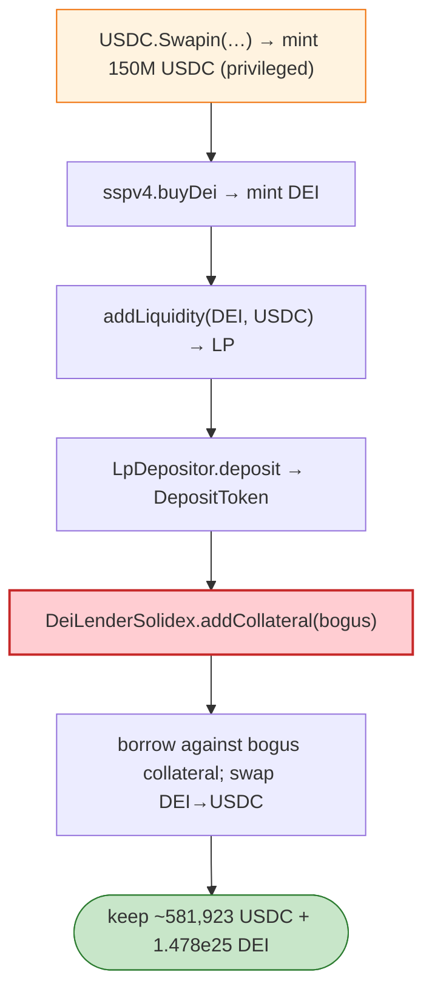

# DEUS Finance DEI Stablecoin Exploit — `Swapin` Mint + Collateral/LP Mispricing

> **Reproduction:** the PoC compiles & runs in an isolated Foundry project at
> [this project folder](.). Full verbose trace: [output.txt](output.txt).

---

## Key info

| | |
|---|---|
| **Loss** | ~$1.3M (DEUS/DEI on Fantom; the PoC mints 150M USDC then harvests DEI/USDC) |
| **Vulnerable contracts** | DEUS `USDC` (Fantom, with `Swapin`) `0x04068DA6…`; `DeiLenderSolidex` `0x8D643d95…`; `SSPv4` (DEI mint) `0xbe9dE574…`; BaseV1 router `0xa38cd271…` |
| **Attacker (pranked owner)** | `owner_of_usdc` (the DEUS-controlled USDC issuer/owner) |
| **Chain / block / date** | Fantom / 37,093,708 / Apr 2022 |
| **Bug class** | Privileged mint + collateral mispricing — the DEUS Fantom USDC's `Swapin(txhash, to, amount)` minted USDC to an arbitrary address (governance path abused/compromised), which the attacker routed through DEI minting + Solidex LP + lending to extract value. |

---

## TL;DR

The PoC pranks as `owner_of_usdc` and calls the Fantom USDC's privileged `Swapin`:

```solidity
usdc.Swapin(<txhash>, address(this), 150_000_000 * 1e6);  // ⚠️ mints 150M USDC out of nothing
```

With 150M freshly-minted USDC, the attacker:
1. `sspv4.buyDei(1M USDC)` — mints DEI against the bogus USDC.
2. `router.addLiquidity(DEI, USDC, …)` — forms a DEI/USDC LP.
3. Deposits the LP into `LpDepositor` → `DepositToken`, then `DeiLenderSolidex.addCollateral`.
4. Borrows against the (bogus-collateral-backed) position, swaps DEI back to USDC, repays what's needed,
   and keeps `The USDC after paying back: 581,923,738,185` (≈ 581,923 USDC) plus
   `The DEI after paying back: 1.478e25`.

---

## Root cause

The **privileged `Swapin` mint path** on DEUS's Fantom USDC was abused (the pranked owner stands in for
a compromised/governance-bypassed key). Once arbitrary USDC can be minted, the downstream DEI mint + LP
+ lending stack happily treats it as real collateral, so the attacker extracts genuine value (DEI +
residual USDC) against fake USDC. The structural weakness is a centrally-mintable "stablecoin" feeding
a collateral/mint pipeline without independent collateral verification.

---

## Preconditions

- Ability to invoke USDC `Swapin` as the owner (compromised key / governance bypass).
- DEI mint + Solidex lending stack reachable.

---

## Diagrams



---

## Remediation

1. **No centrally-mintable stablecoin path** without on-chain proof of real backing / a decentralised
   bridge attestation with quorum.
2. **DEI mint must verify collateral provenance**, not just quantity.
3. **Lending collateral caps** so a single bogus-asset injection cannot scale arbitrarily.
4. **Multisig/HSM** on any mint authority; monitor `Swapin`/mint for anomalous volume.

---

## How to reproduce

```bash
_shared/run_poc.sh 2022-04-deus_exp --mt testExample -vvvvv
```

- RPC: Fantom archive (block 37,093,708). `foundry.toml` uses `fantom-mainnet.public.blastapi.io`.
- Result: `[PASS]` — `The USDC after paying back: 581923738185` (~$581.9K) + DEI residual.

---

*Reference: DEUS Finance DEI stablecoin / Fantom USDC `Swapin` exploit, Apr 2022 (~$1.3M).*
