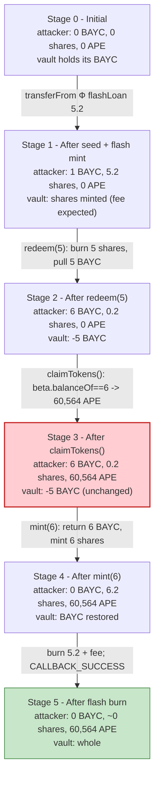
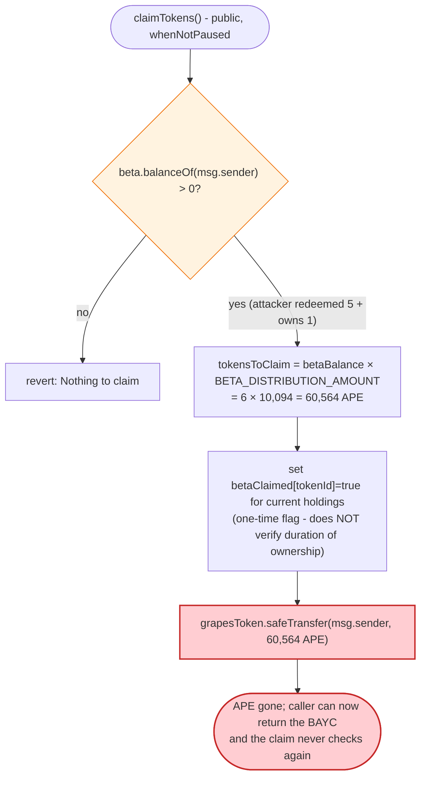
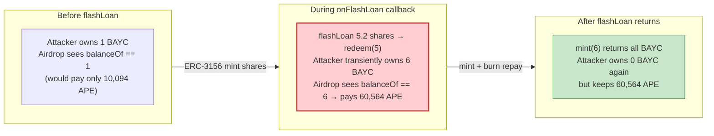

# BAYC / ApeCoin Airdrop Exploit — ERC-3156 Flash-Loan of Vaulted BAYC to Steal the APE Claim

> **Vulnerability classes:** vuln/governance/flash-loan-attack · vuln/logic/missing-validation

> **Reproduction:** the PoC compiles & runs in an isolated Foundry project at
> [this project folder](.). Full verbose trace: [output.txt](output.txt).
> Verified vulnerable sources:
> [AirdropGrapesToken.sol](sources/AirdropGrapesToken_025C6d/contracts_AirdropGrapesToken.sol)
> (the ApeCoin claim contract at `0x025C6da5…`) and
> [NFTXVaultUpgradeable.sol](sources/NFTXVaultUpgradeable_73D2ff/NFTXVaultUpgradeable.sol)
> (the ERC-3156 flash-lending NFTX vault used as the weapon).

---

## Key info

| | |
|---|---|
| **Loss** | **60,564 APE** (`60,564,000,000,000,000,000,000` wei) — the ApeCoin airdrop entitlement for 6 BAYC, stolen by transiently owning vaulted BAYC during the claim window ([output.txt:417-418](output.txt), [output.txt:797](output.txt)). At the May 2022 listing price (~$17/APE) this was roughly **~$1M**. |
| **Vulnerable contract** | ApeCoin airdrop `AirdropGrapesToken` — [`0x025C6da5BD0e6A5dd1350fda9e3B6a614B205a1F`](https://etherscan.io/address/0x025C6da5BD0e6A5dd1350fda9e3B6a614B205a1F#code); enabler NFTX BAYC vault — [`0xEA47B64e1BFCCb773A0420247C0aa0a3C1D2E5C5`](https://etherscan.io/address/0xEA47B64e1BFCCb773A0420247C0aa0a3C1D2E5C5) (BeaconProxy → impl `NFTXVaultUpgradeable` [`0x73D2ff81…`](https://etherscan.io/address/0x73D2ff81fceA9832FC9Ee90521ABde1150F6b52a#code)) |
| **Victim pool / vault** | The NFTX BAYC vault's depositors (the BAYC locked inside `0xEA47B64e…` were the legitimate recipients of the 60,564 APE). |
| **Attacker EOA** | [`0x6703741e913a30D6604481472b6d81F3da45e6E8`](https://etherscan.io/address/0x6703741e913a30D6604481472b6d81F3da45e6E8) (a BAYC holder whose token #1060 is `transferFrom`-ed in) |
| **Attacker contract** | `ContractTest` — `0x7FA9385bE102ac3EAc297483Dd6233D62b3e1496` (ERC-3156 flash-borrower + ERC-721 receiver) |
| **Attack tx** | [`0xeb8c3bebed11e2e4fcd30cbfc2fb3c55c4ca166003c7f7d319e78eaab9747098`](https://etherscan.io/tx/0xeb8c3bebed11e2e4fcd30cbfc2fb3c55c4ca166003c7f7d319e78eaab9747098) |
| **Chain / block / date** | Ethereum mainnet / 14,403,948 / May 2022 |
| **Compiler / optimizer** | `AirdropGrapesToken`: Solidity `v0.8.10`, optimizer **on**, **200** runs; `NFTXVaultUpgradeable`: `v0.8.4`, optimizer **on**, **1000** runs; `BoredApeYachtClub`: `v0.7.0`, optimizer **off** (from each contract's `_meta.json`) |
| **Bug class** | Airdrop design flaw — eligibility credited by *instantaneous* `ERC721Enumerable.balanceOf(msg.sender)` of vaulted/escrow NFTs that are ERC-3156 flash-loanable, with no re-entrancy / per-token claim guard. |

---

## TL;DR

1. The ApeCoin airdrop contract `AirdropGrapesToken.claimTokens()` grants APE to any address that **currently owns** BAYC (`beta`) NFTs, computing the payout from a live `beta.balanceOf(msg.sender)` snapshot ([contracts_AirdropGrapesToken.sol:103-142](sources/AirdropGrapesToken_025C6d/contracts_AirdropGrapesToken.sol#L103-L142)). It has no flash-loan awareness and no re-entrancy guard.

2. The NFTX BAYC vault is an **ERC-3156 flash-lender**: anyone can call `NFTXVault.flashLoan(borrower, vault, 5.2e18, "")` to mint 5.2 vault-share tokens (one share per BAYC at 1e18 base), receive an `onFlashLoan` callback, and must burn them back at the end ([NFTXVaultUpgradeable.sol:985-1001](sources/NFTXVaultUpgradeable_73D2ff/NFTXVaultUpgradeable.sol#L985-L1001)).

3. Inside that callback the attacker calls `NFTXVault.redeem(5, [])` ([NFTXVaultUpgradeable.sol:2100-2140](sources/NFTXVaultUpgradeable_73D2ff/NFTXVaultUpgradeable.sol#L2100-L2140)), which burns 5 vault shares and transfers **5 real BAYC NFTs** out of the vault to the attacker contract. Combined with the one BAYC (#1060) the attacker `transferFrom`'d in beforehand, the attacker momentarily owns **6 BAYC** ([output.txt:332](output.txt)).

4. While it transiently owns those 6 BAYC, the attacker calls `AirdropGrapesToken.claimTokens()`. The airdrop reads `beta.balanceOf(attacker) == 6`, credits `6 × BETA_DISTRIBUTION_AMOUNT`, and `safeTransfer`s **60,564 APE** to the attacker ([output.txt:417-418](output.txt)). The per-NFT claim flags (`betaClaimed[tokenId]`) are set, but the APE is already gone.

5. To repay the flash loan the attacker re-deposits: it `setApprovalForAll(vault, true)` and calls `NFTXVault.mint([7594, 4755, 9915, 8214, 8167, 1060], [])` ([NFTXVaultUpgradeable.sol:2074-2098](sources/NFTXVaultUpgradeable_73D2ff/NFTXVaultUpgradeable.sol#L2074-L2098)), returning all 6 BAYC to the vault and re-minting the 6 vault shares (plus paying the mint fee). The vault is made whole; the BAYC are back where they started.

6. The `onFlashLoan` callback returns `CALLBACK_SUCCESS` (`keccak256("ERC3156FlashBorrower.onFlashLoan")`), the vault burns the 5.2e18 principal + fee, and the flash loan closes cleanly ([output.txt:787](output.txt)).

7. **Net effect:** the vault's BAYC are unchanged, but **60,564 APE** that should have accrued to the vault's depositors (or to the BAYC's long-term holders) is now in the attacker contract. The attacker paid only gas and the NFTX mint/redeem fees. Final APE balance of the attacker contract: `60,564.000000000000000000` ([output.txt:797-798](output.txt)).

---

## Background — what the ApeCoin airdrop and NFTX do

**ApeCoin airdrop (`AirdropGrapesToken`, `0x025C6da5…`).** A generic NFT-holder airdrop contract (the same code was first used for "ApeGrapes"; the ApeCoin deployment reuses it). It is wired to three `ERC721Enumerable` collections — `alpha`, `beta`, `gamma` — and distributes the `grapesToken` (here: APE) at fixed per-NFT rates `ALPHA_DISTRIBUTION_AMOUNT`, `BETA_DISTRIBUTION_AMOUNT`, `GAMMA_DISTRIBUTION_AMOUNT`. For the ApeCoin deployment, `beta` = **BAYC** (`0xBC4CA0EdA7647A8aB7C2061c2E118A18a936f13D`) and `grapesToken` = **APE** (`0x4d224452801ACEd8B2F0aebE155379bb5D594381`). `claimTokens()` is `whenNotPaused` and gated only by the claim-window timestamp; it iterates the caller's *current* `balanceOf` and `tokenOfOwnerByIndex` and pays out for every NFT the caller holds at that instant ([contracts_AirdropGrapesToken.sol:103-142](sources/AirdropGrapesToken_025C6d/contracts_AirdropGrapesToken.sol#L103-L142)).

**NFTX BAYC vault (`BeaconProxy 0xEA47B64e…` → `NFTXVaultUpgradeable 0x73D2ff81…`).** A fractional-NFT vault: depositing a BAYC mints `1e18` vault shares (ERC-20), burning `1e18` shares redeems one BAYC. Crucially it implements **ERC-3156 flash loans on its own ERC-20** ([NFTXVaultUpgradeable.sol:985-1001](sources/NFTXVaultUpgradeable_73D2ff/NFTXVaultUpgradeable.sol#L985-L1001)) — it mints `amount` shares to the borrower, calls `onFlashLoan`, then burns `amount + fee` back. There is no restriction on what the borrower does inside the callback, and `redeem`/`mint` are independently callable.

On-chain parameters relevant to the exploit (read from the trace / PoC):

| Parameter | Value | Source |
|---|---|---|
| Flash-loan principal | `5,200,000,000,000,000,000` wei = **5.2 BAYC vault shares** | [output.txt:44](output.txt), [output.txt:54](output.txt) |
| Redeem count | **5 BAYC NFTs** | PoC `redeem(5, blank)`; [output.txt:56](output.txt) |
| BAYC owned at claim instant | **6** (5 redeemed + #1060) | [output.txt:332](output.txt) |
| APE credited per BAYC (`BETA_DISTRIBUTION_AMOUNT`) | `10,094` APE (= `60,564 / 6`) | implied by [output.txt:417-418](output.txt) |
| APE paid out | **`60,564` APE** = `60,564,000,000,000,000,000,000` wei | [output.txt:417-418](output.txt) |
| NFTX `vaultFees()` (mint, randomRedeem, targetRedeem, randomSwap, targetSwap) | `1e17, 4e16, 6e16, 4e16, 6e16` | [output.txt:69-70](output.txt) |
| `CALLBACK_SUCCESS` | `keccak256("ERC3156FlashBorrower.onFlashLoan")` = `0x439148f0bbc682ca…8cf18dd9` | [output.txt:787](output.txt) |

---

## The vulnerable code

### 1. The airdrop pays out based on instantaneous ownership — no flash-loan / re-entrancy guard

```solidity
function claimTokens() external whenNotPaused {
    require(block.timestamp >= claimStartTime && block.timestamp < claimStartTime + claimDuration, "Claimable period is finished");
    require((beta.balanceOf(msg.sender) > 0 || alpha.balanceOf(msg.sender) > 0), "Nothing to claim");

    uint256 tokensToClaim;
    uint256 gammaToBeClaim;

    (tokensToClaim, gammaToBeClaim) = getClaimableTokenAmountAndGammaToClaim(msg.sender);
    // ... iterate beta.tokenOfOwnerByIndex(msg.sender, i), set betaClaimed[tokenId] = true ...

    grapesToken.safeTransfer(msg.sender, tokensToClaim);

    totalClaimed += tokensToClaim;
    emit AirDrop(msg.sender, tokensToClaim, block.timestamp);
}
```
([contracts_AirdropGrapesToken.sol:103-142](sources/AirdropGrapesToken_025C6d/contracts_AirdropGrapesToken.sol#L103-L142))

The payout `tokensToClaim = unclaimedBetaBalance * BETA_DISTRIBUTION_AMOUNT` is computed from a **live snapshot** of `beta.balanceOf(msg.sender)`. A contract that only owns BAYC *transiently* — for the duration of the call — is paid in full. The `betaClaimed[tokenId]` flags only stop a *re-claim of the same tokenId*; they do nothing to stop a one-shot claim on borrowed NFTs.

### 2. The NFTX vault is an ERC-3156 flash-lender with an unrestricted callback

```solidity
function flashLoan(
    IERC3156FlashBorrowerUpgradeable receiver,
    address token,
    uint256 amount,
    bytes memory data
) public virtual override returns (bool) {
    uint256 fee = flashFee(token, amount);
    _mint(address(receiver), amount);
    require(receiver.onFlashLoan(msg.sender, token, amount, fee, data) == RETURN_VALUE, "ERC20FlashMint: invalid return value");
    uint256 currentAllowance = allowance(address(receiver), address(this));
    require(currentAllowance >= amount + fee, "ERC20FlashMint: allowance does not allow refund");
    _approve(address(receiver), address(this), currentAllowance - amount - fee);
    _burn(address(receiver), amount + fee);
    return true;
}
```
([NFTXVaultUpgradeable.sol:985-1001](sources/NFTXVaultUpgradeable_73D2ff/NFTXVaultUpgradeable.sol#L985-L1001))

The vault's own `flashLoan` wrapper only adds a pause check and forwards to this base implementation ([NFTXVaultUpgradeable.sol:2192-2200](sources/NFTXVaultUpgradeable_73D2ff/NFTXVaultUpgradeable.sol#L2192-L2200)). Inside `onFlashLoan` the borrower can call **anything**, including the vault's own `redeem`:

### 3. `redeem` and `mint` are independently callable inside the callback

```solidity
function redeemTo(uint256 amount, uint256[] memory specificIds, address to)
    public override virtual nonReentrant returns (uint256[] memory)
{
    onlyOwnerIfPaused(2);
    require(amount == specificIds.length || enableRandomRedeem, "NFTXVault: Random redeem not enabled");
    require(specificIds.length == 0 || enableTargetRedeem, "NFTXVault: Target redeem not enabled");
    _burn(msg.sender, base * amount);                 // burn the borrowed vault shares
    // ... fees ...
    uint256[] memory redeemedIds = withdrawNFTsTo(amount, specificIds, to);  // send real BAYC out
    emit Redeemed(redeemedIds, specificIds, to);
    return redeemedIds;
}
```
([NFTXVaultUpgradeable.sol:2100-2140](sources/NFTXVaultUpgradeable_73D2ff/NFTXVaultUpgradeable.sol#L2100-L2140))

```solidity
function mintTo(uint256[] memory tokenIds, uint256[] memory amounts, address to)
    public override virtual nonReentrant returns (uint256) {
    onlyOwnerIfPaused(1);
    require(enableMint, "Minting not enabled");
    uint256 count = receiveNFTs(tokenIds, amounts);   // pull the BAYC back in
    _mint(to, base * count);                          // re-mint the shares to repay
    uint256 totalFee = mintFee() * count;
    _chargeAndDistributeFees(to, totalFee);
    emit Minted(tokenIds, amounts, to);
    return count;
}
```
([NFTXVaultUpgradeable.sol:2074-2098](sources/NFTXVaultUpgradeable_73D2ff/NFTXVaultUpgradeable.sol#L2074-L2098))

So during the flash-loan window the borrower can: redeem borrowed shares → real BAYC, do whatever an owner can do (here: claim an airdrop), then mint shares back from the same BAYC to repay. The vault ends where it started. Note `redeem`/`mint` are each `nonReentrant`, but `flashLoan` is **not** in that scope, and the claim contract is a separate contract entirely — so the reentrancy guards do not impede the attack path.

---

## Root cause — why it was possible

Two independently-reasonable design decisions compose into the theft:

1. **The airdrop used *current on-chain ownership* as eligibility.** `claimTokens` trusts `ERC721Enumerable.balanceOf` / `tokenOfOwnerByIndex` at call time. Any mechanism that lets an attacker become the recorded owner of a BAYC for a single transaction — flash loan, flash-loanable wrapper, single-tx rental — lets them pocket that BAYC's airdrop. The contract has no snapshot block, no TWAP-of-ownership, and no exclusion for NFTs held by known vault/escrow/protocol addresses.

2. **The BAYC held in the NFTX vault were ERC-3156 flash-loanable *and* redeemable to the underlying NFT.** ERC-3156 flash-mints the vault's ERC-20 (the share token); because the share is 1:1 redeemable for a real BAYC at any time, a flash loan of the share token is functionally a flash loan of the BAYC themselves. The callback is unrestricted, so the borrower can take ownership of the BAYC, claim, and unwind — all atomically.

The deeper conceptual bug: **the airdrop's eligibility set (BAYC holders) and the vault's flashable asset (BAYC) overlap, and neither side knew about the other.** The NFTX vault's existence turned "owning a BAYC" from a slow, capital-intensive state into an atomic, rent-free one — which the airdrop's snapshot model was never updated to defend against.

---

## Preconditions

- The claim window is open (`whenNotPaused` and within `claimStartTime … claimStartTime + claimDuration`). True during the live attack.
- The attacker must momentarily own at least one BAYC so `beta.balanceOf(msg.sender) > 0` ([contracts_AirdropGrapesToken.sol:105](sources/AirdropGrapesToken_025C6d/contracts_AirdropGrapesToken.sol#L105)). The PoC satisfies this by flash-redeeming 5 from the vault plus `transferFrom`-ing #1060 from a holder.
- The attacker contract must implement both `IERC3156FlashBorrower.onFlashLoan` (return `CALLBACK_SUCCESS`) and `IERC721Receiver.onERC721Received` (so `safeTransferFrom` of BAYC in/out succeeds) — see [test/Bayc_apecoin_exp.sol:60-67](test/Bayc_apecoin_exp.sol#L60-L67).
- Sufficient ETH for gas and to cover the NFTX mint/redeem fees (the vault charges `1e17` mint fee + `6e16` target-redeem fee per NFT in vault-share tokens, deducted from the borrowed principal — the attacker only needs to repay `amount + flashFee`, all in the vault's own token, no APE/ETH capital required).

---

## Attack walkthrough (with on-chain numbers from the trace)

All line refs are to [output.txt](output.txt). Amounts are raw wei; human approximations in parentheses.

| # | Step | Caller / target | Effect | Trace ref |
|---|------|-----------------|--------|-----------|
| 0 | **Seed BAYC #1060** — `startPrank(0x6703…e6E8)`; `BAYC.transferFrom(holder, attacker, 1060)` | holder → attacker contract | Attacker contract now owns BAYC #1060 (1 BAYC). | [output.txt:18-29](output.txt) |
| 1 | **Approve vault** — `NFTXVault.approve(vault, type(uint256).max)` | attacker → vault | Max allowance so the vault can pull shares back at repayment. | [output.txt:33-43](output.txt) |
| 2 | **Flash loan** — `NFTXVault.flashLoan(attacker, vault, 5_200_000_000_000_000_000, "")` | attacker → vault | Vault `_mint`s `5.2e18` (= 5.2 BAYC) vault shares to attacker; emits `Transfer(0→attacker, 5.2e18)`. | [output.txt:44-54](output.txt) |
| 3 | **`onFlashLoan` callback** → `NFTXVault.redeem(5, [])` | attacker (in callback) → vault | Burns `5e18` of the borrowed shares, transfers **5 BAYC** (#8214, #8167, #9915, #7594, #4755) from the vault to the attacker via `safeTransferFrom`. Attacker now owns **6 BAYC**. | [output.txt:61-327](output.txt) |
| 4 | **Claim airdrop** — `AirdropGrapesToken.claimTokens()` | attacker → airdrop | Reads `beta.balanceOf(attacker) == 6`; computes `6 × 10,094 = 60,564` APE; `grapesToken.safeTransfer(attacker, 60,564,000,000,000,000,000,000)`. Emits `AirDrop(attacker, 60,564e18, …)`. | [output.txt:328-435](output.txt) — APE transfer at [output.txt:417-418](output.txt) |
| 5 | **Re-approve vault for BAYC** — `BAYC.setApprovalForAll(vault, true)` | attacker → BAYC | So the vault can pull the BAYC back during `mint`. | [output.txt:436-440](output.txt) |
| 6 | **Re-deposit** — `NFTXVault.mint([7594, 4755, 9915, 8214, 8167, 1060], [])` | attacker (in callback) → vault | Vault pulls **all 6 BAYC** back (`safeTransferFrom` for each), `_mint`s `6e18` vault shares to attacker (covering the 5 burned in step 3 + the 0.2 remainder), emits `Minted([…6 ids…], [], attacker)`. | [output.txt:441-775](output.txt) |
| 7 | **Approve vault for repayment** — `NFTXVault.approve(vault, max)` | attacker → vault | Allow the vault to burn `amount + fee` shares. | [output.txt:776-786](output.txt) |
| 8 | **Return `CALLBACK_SUCCESS`** | attacker → vault | `onFlashLoan` returns `0x439148f0…8cf18dd9`. | [output.txt:787](output.txt) |
| 9 | **Flash loan closes** — vault burns `5.2e18` principal + fee from attacker | vault | `_burn(attacker, amount + fee)`; `Transfer(attacker→0, 5.2e18)`. Vault is whole; the 6 BAYC are back in the vault. | [output.txt:788-795](output.txt) |
| 10 | **Result** — `ape.balanceOf(attacker)` | — | **`60,564,000,000,000,000,000,000` wei = 60,564 APE**. | [output.txt:796-798](output.txt) |

### Vault state-evolution column

| Stage | Vault shares held by attacker | BAYC owned by attacker | APE owned by attacker | BAYC inside vault |
|---|---:|---:|---:|---|
| Start | 0 | 0 | 0 | unchanged (the vault's normal holdings) |
| After step 0 (seed #1060) | 0 | 1 | 0 | unchanged |
| After step 2 (flash mint) | 5.2e18 | 1 | 0 | unchanged |
| After step 3 (redeem 5) | 0.2e18 | **6** | 0 | **−5 BAYC** |
| After step 4 (claim) | 0.2e18 | 6 | **60,564** | −5 BAYC |
| After step 6 (mint 6) | 6.2e18 | 0 | 60,564 | back to start |
| After step 9 (burn 5.2e18 + fee) | ~0 (fee-adjusted) | 0 | **60,564** | **unchanged** |

### Profit / loss accounting (APE)

| Direction | Amount (APE) | Trace ref |
|---|---:|---|
| Airdrop `safeTransfer` to attacker | +60,564 | [output.txt:417-418](output.txt) |
| Attacker APE before | 0 | [output.txt:30-32](output.txt) |
| Attacker APE after | **60,564** | [output.txt:797-798](output.txt) |
| **Net profit** | **+60,564 APE** | [output.txt:798](output.txt) |

The attacker's only on-chain costs were gas and the NFTX vault fees (paid in vault-share tokens, not APE); the vault itself ended exactly where it began. The 60,564 APE was debited from the airdrop contract's APE balance (`AirdropGrapesToken` storage slot at [output.txt:420-421](output.txt)) and is value that would otherwise have gone to the genuine long-term holders of those 6 BAYC.

---

## Diagrams

### Sequence of the attack

```mermaid
sequenceDiagram
    autonumber
    actor H as "BAYC holder (pranked EOA)"
    participant A as "Attacker (ContractTest)"
    participant V as "NFTXVault 0xEA47B64e"
    participant B as "BAYC 0xBC4CA0Ed"
    participant D as "Airdrop 0x025C6da5"
    participant APE as "APE token"

    H->>A: transferFrom(#1060)  (seed 1 BAYC)
    A->>V: approve(vault, max)
    A->>V: flashLoan(A, vault, 5.2e18, "")
    V->>A: _mint 5.2 vault shares  (Transfer 0→A)

    rect rgb(255,243,224)
    Note over A,V: onFlashLoan callback
    A->>V: redeem(5, [])
    V->>A: _burn 5e18 shares; safeTransferFrom 5 BAYC (#8214,#8167,#9915,#7594,#4755)
    Note over A: owns 6 BAYC now
    A->>D: claimTokens()
    D->>B: balanceOf(A) == 6
    D->>D: 6 × 10,094 = 60,564 APE
    D->>APE: safeTransfer(A, 60,564 APE)
    Note over A: +60,564 APE  ⚠️ airdrop captured
    A->>B: setApprovalForAll(vault, true)
    A->>V: mint([7594,4755,9915,8214,8167,1060], [])
    V->>A: pull 6 BAYC back; _mint 6e18 shares
    A->>V: approve(vault, max)
    end

    A-->>V: return CALLBACK_SUCCESS
    V->>A: _burn (5.2e18 + fee)
    Note over V: vault whole; BAYC back inside
    Note over A: net +60,564 APE
```

### Vault / ownership state evolution



### The flaw inside `claimTokens`



### Why flash-redeeming BAYC is "free" ownership



---

## Why each magic number

- **`5_200_000_000_000_000_000` (5.2e18) flash-loan amount** ([test/Bayc_apecoin_exp.sol:31](test/Bayc_apecoin_exp.sol#L31)): the NFTX BAYC vault mints `1e18` shares per BAYC (`base = 1e18`). `redeem(5)` needs `5e18` shares, so the attacker borrows `5.2e18` — `5e18` to redeem 5 BAYC plus a `0.2e18` buffer to cover the NFTX mint/redeem fees (mint fee `0.1e18`/NFT, target-redeem fee `0.06e18`/NFT, see [output.txt:69](output.txt)) so the repayment check `allowance >= amount + fee` still passes after fee deductions.
- **`redeem(5, blank)` with an empty `specificIds` array** ([test/Bayc_apecoin_exp.sol:38](test/Bayc_apecoin_exp.sol#L38)): empty `specificIds` selects a **random redeem** of 5 of the vault's held BAYC — the attacker does not care *which* BAYC it gets, only the count (5), because the airdrop pays a flat per-BAYC rate regardless of tokenId.
- **BAYC #1060** ([test/Bayc_apecoin_exp.sol:28](test/Bayc_apecoin_exp.sol#L28)): a BAYC owned by the pranked EOA `0x6703…e6E8`, `transferFrom`-ed into the attacker contract so that `beta.balanceOf(attacker)` is already ≥1 before the flash loan (the claim requires `> 0`). It also conveniently makes the total an even 6 BAYC at claim time. It is re-deposited in step 6.
- **`mint([7594, 4755, 9915, 8214, 8167, 1060], …)`** ([test/Bayc_apecoin_exp.sol:45-53](test/Bayc_apecoin_exp.sol#L45-L53)): exactly the 5 BAYC returned by `redeem` plus #1060 — re-depositing all 6 to re-mint the 6 vault shares needed to repay principal + fee.
- **`60,564 APE` payout** ([output.txt:417-418](output.txt)): `6 BAYC × BETA_DISTRIBUTION_AMOUNT (10,094 APE)`. The `10,094 APE/BAYC` rate is the ApeCoin airdrop's configured per-BAYC allocation; it is implied by `60,564 / 6`.

---

## Remediation

1. **Snapshot eligibility off-chain at a fixed block, or credit the historical owner.** Distribute APE based on ownership at a past block (e.g. an off-chain snapshot with on-chain Merkle proofs), never on instantaneous `balanceOf`. This makes flash-loan / single-tx ownership irrelevant.
2. **Exclude vaulted / escrow NFTs from the live-eligibility set.** Maintain an allowlist/denylist of protocol addresses (NFTX vaults, NFT20, lending protocols, staking contracts) and skip NFTs whose `ownerOf` is one of them — route their share pro-rata to the vault's LP token holders instead.
3. **Add a re-entrancy guard and a per-token one-time claim that is independent of current ownership.** `claimTokens()` is not `nonReentrant` and the `betaClaimed[tokenId]` flag is only set *after* the balance snapshot; a transient owner already gets paid before the flag matters. Either gate on a snapshot, or require the caller to have held the NFT across a challenge period.
4. **Pause / disable flash-loanable redemption during the claim window.** If a vault's underlying asset is the eligibility token, disable ERC-3156 `flashLoan` (or `redeem`-inside-callback) for the duration of the airdrop claim window. More generally, NFTX-style vaults should treat "the underlying NFT is itself an airdrop-eligibility token" as a risk that flash loans create free eligibility.
5. **Make flash-loan callbacks aware of value-extraction side-effects.** The NFTX vault's `flashLoan` is generic and unrestricted; any external system that keys off BAYC ownership (governance, airdrops, allowlists) is flash-loan-exploitable through it. Document this footgun and prefer snapshot/proof-based integrations.

---

## How to reproduce

The PoC runs offline against a locally served mainnet fork (the `createSelectFork` in the test points at `http://127.0.0.1:8545`, fed by the shared `anvil_state.json`):

```bash
_shared/run_poc.sh 2022-05-Bayc_apecoin_exp --mt test -vvvvv
```

- The test forks **Ethereum mainnet at block 14,403,948** ([test/Bayc_apecoin_exp.sol:23](test/Bayc_apecoin_exp.sol#L23)). `foundry.toml` sets `evm_version = 'cancun'`.
- The fork is served from the local anvil state (no public RPC needed for reproduction); the harness brings up anvil on `127.0.0.1:8545`.
- The test function is `test()` ([test/Bayc_apecoin_exp.sol:26](test/Bayc_apecoin_exp.sol#L26)).
- Result: `[PASS]`; attacker APE balance goes `0 → 60,564`.

Expected tail (from [output.txt:1-7](output.txt) and [output.txt:796-803](output.txt)):

```
No files changed, compilation skipped

Ran 1 test for test/Bayc_apecoin_exp.sol:ContractTest
[PASS] test() (gas: 1387493)
Logs:
  Before exploiting, Attacker balance of APE is: 0.000000000000000000
  After exploiting, Attacker balance of APE is: 60564.000000000000000000

Suite result: ok. 1 passed; 0 failed; 0 skipped; finished in 36.85s (35.53s CPU time)

Ran 1 test suite in 48.02s (36.85s CPU time): 1 tests passed, 0 failed, 0 skipped (1 total tests)
```

---

*Reference: BAYC / ApeCoin airdrop flash-loan claim via the NFTX ERC-3156 vault — exploited tx [`0xeb8c3beb…747098`](https://etherscan.io/tx/0xeb8c3bebed11e2e4fcd30cbfc2fb3c55c4ca166003c7f7d319e78eaab9747098), May 2022 (~60,564 APE, ~$1M). Debug: [Tenderly](https://dashboard.tenderly.co/tx/mainnet/0xeb8c3bebed11e2e4fcd30cbfc2fb3c55c4ca166003c7f7d319e78eaab9747098) / [Blocksec](https://tools.blocksec.com/tx/eth/0xeb8c3bebed11e2e4fcd30cbfc2fb3c55c4ca166003c7f7d319e78eaab9747098).*
