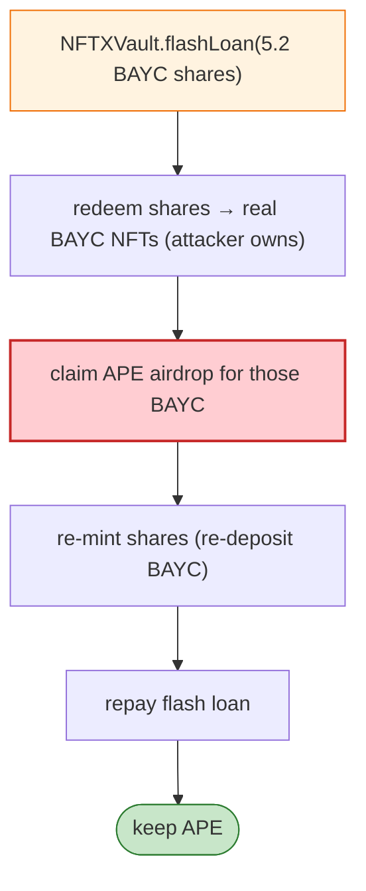

# BAYC / ApeCoin Airdrop Exploit — NFTX Flash-Loan to Claim APE on Vaulted BAYC

> **Reproduction:** the PoC compiles & runs in an isolated Foundry project at
> [this project folder](.). Full verbose trace: [output.txt](output.txt).

---

## Key info

| | |
|---|---|
| **Loss** | ~$1M of APE (ApeCoin) claimed by flash-borrowing vaulted BAYC during the airdrop snapshot |
| **Vulnerable contract** | ApeCoin airdrop `0x025C6da5…`; NFTX BAYC vault `0xEA47B64e…` (ERC-3156 flash lender) |
| **Attack tx** | `0xeb8c3bebed11e2e4fcd30cbfc2fb3c55c4ca166003c7f7d319e78eaab9747098` |
| **Chain / block / date** | Ethereum mainnet / 14,403,948 / May 2022 |
| **Bug class** | Airdrop design flaw — the APE airdrop credited BAYC *holders* by current owner, including BAYC held inside the NFTX vault; an attacker flash-borrowing the vault's BAYC-ERC20 could redeem the underlying BAYC, claim the airdrop, re-deposit, and repay — all in one tx. |

---

## TL;DR

The attacker (pranked as a BAYC holder) `transferFrom`s BAYC #1060 to itself, then:

```solidity
NFTXVault.flashLoan(this, NFTXVault, 5.2e18, "");  // flash-loan 5.2 BAYC (ERC-20 vault shares)
```

Inside the ERC-3156 `onFlashLoan` callback the attacker **redeems the vault shares for real BAYC NFTs**,
becomes their owner at the airdrop contract's snapshot, **claims the APE airdrop** for those BAYC, then
**re-mints the vault shares** (re-deposits the BAYC) to repay the flash loan. Net: the attacker pockets
the APE that legitimately belonged to the vaulted BAYC, because the airdrop did not account for tokens
held inside an ERC-3156-flashable vault.

---

## Root cause

An **airdrop eligibility model that credited by instantaneous owner without excluding escrow/vaulted
NFTs**, combined with an **ERC-3156 flash-loanable NFT vault**. A flash loan of the vault token let an
attacker transiently own the underlying NFTs at claim time, capture the airdrop, and unwind.

---

## Diagrams



---

## Remediation

1. **Snapshot owner off-chain / use the historical holder at a fixed block**, and exclude vaulted/escrow
   NFTs (NFTX, NFT20, lending protocols) from eligibility, routing their share to the vault/LP holders
   pro-rata.
2. **Pause flash-loans during the claim window**, or make claims non-reentrant with a per-NFT claimed
   flag.
3. **Don't credit airdrops to instantaneous on-chain owner** when NFTs are flash-loanable.

---

## How to reproduce

```bash
_shared/run_poc.sh 2022-05-Bayc_apecoin_exp --mt test -vvvvv
```

- RPC: mainnet archive (block 14,403,948). Infura mainnet in `foundry.toml`.
- Result: `[PASS]` — APE balance increases after the flash-loan claim.

---

*Reference: BAYC/ApeCoin airdrop flash-loan claim via NFTX vault, May 2022 (~$1M APE).*
