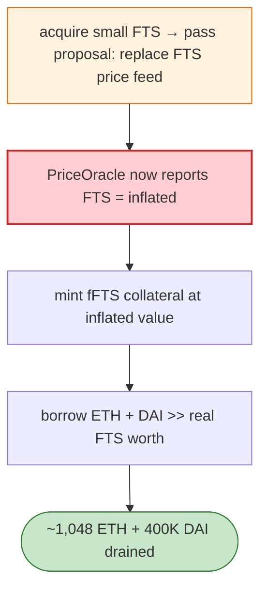

# Fortress Loans Exploit — Governance Takeover → Manipulated Oracle → Over-borrow

> **Reproduction:** the PoC compiles & runs in an isolated Foundry project at
> [this project folder](.). Full verbose trace: [output.txt](output.txt).

---

## Key info

| | |
|---|---|
| **Loss** | ~1,048 ETH + 400,000 DAI (~$3M) |
| **Vulnerable contracts** | Fortress `PriceOracle` `0x00fcf33b…`, `GovernorAlpha` `0xE79ecdb7…`, fFTS market `0x854C266b…`, FTS token `0x4437743…` (BSC) |
| **Attacker** | `0xA6AF2872…` (contract `0xcd337b9…`) |
| **Chain / block / date** | BSC / May 2022 |
| **Bug class** | Low-governance-quorum takeover + oracle manipulation — Fortress governance let the attacker pass a proposal to change the FTS collateral price feed to an attacker-controlled value, then over-borrow against FTS. |

---

## TL;DR

Fortress Loans (a Compound fork) used a `GovernorAlpha` whose quorum was reachable with a small FTS
stake, and a price oracle whose feeds governance could replace. The attacker:

1. Acquires a small FTS position and **passes a governance proposal** that swaps the FTS price feed for
   one returning a vastly inflated FTS price.
2. With FTS now priced orders of magnitude too high, mints fFTS collateral and **borrows** the protocol's
   ETH and DAI reserves far beyond the real FTS value.
3. Repays nothing; drains ~1,048 ETH + 400K DAI.

This is structurally identical to the Beanstalk governance flash-loan attack, except here the
manipulation was *oracle replacement via governance* rather than arbitrary code execution.

---

## Root cause

- **Weak governance quorum** (passable with little FTS) with no timelock → governance-takeoverable.
- **Governance-writable price oracle** → once governance is captured, collateral price is arbitrary.
- **No sanity bounds** on oracle deviation for collateral listing.

---

## Diagrams



---

## Remediation

1. **Governance timelock + higher quorum**; resist flash-loaned token voting.
2. **Oracle feeds not governance-writable without a long timelock + multisig.**
3. **Collateral sanity bounds**; reject oracle values deviating beyond a band.
4. **Caps on borrow per collateral** and per-market.

---

## How to reproduce

```bash
_shared/run_poc.sh 2022-05-FortressLoans_exp -vvvvv
```

- RPC: BSC archive. `foundry.toml` uses a BSC archive endpoint. (Long test, ~5 min.)
- Result: `[PASS]` — ETH/DAI drained after governance-driven oracle change.

---

*Reference: Fortress Loans governance-oracle manipulation, BSC, May 2022 (~$3M).*
