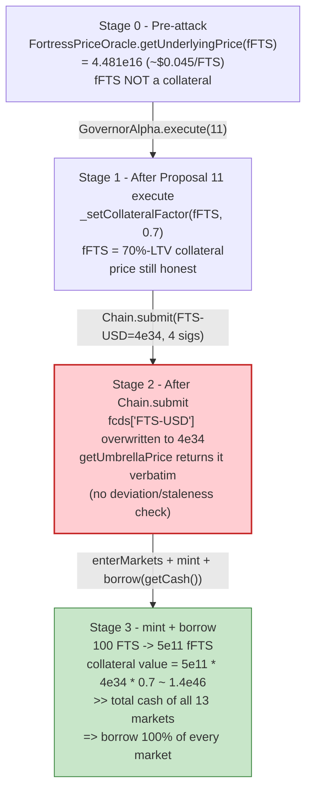
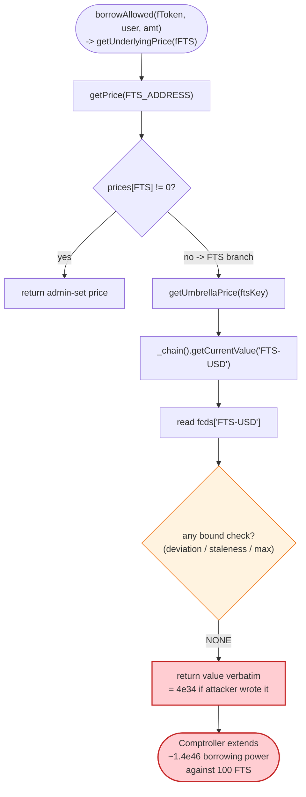
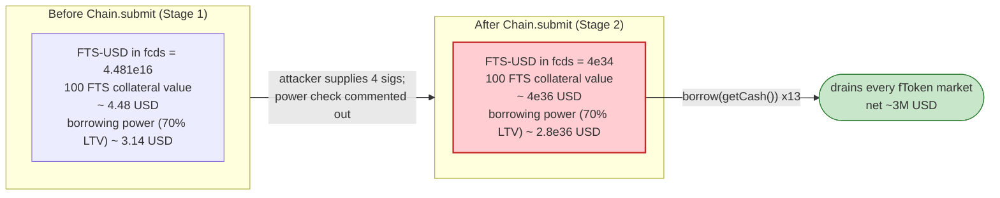

# Fortress Loans Exploit — Governance Capture + Poisoned Umbrella Oracle → Over-borrow

> **Vulnerability classes:** vuln/governance/flash-loan-voting · vuln/oracle/price-manipulation

> **Reproduction:** the PoC compiles & runs in an isolated Foundry project at
> [this project folder](.). The fork is served offline from the shared
> `anvil_state.json` harness (`createSelectFork` points at a local anvil port,
> `http://127.0.0.1:8546`). Full verbose trace: [output.txt](output.txt).
> Verified vulnerable source:
> [GovernorAlpha.sol](sources/GovernorAlpha_e79ecd/GovernorAlpha.sol),
> [FortressPriceOracle.sol](sources/FortressPriceOracle_00fcf3/FortressPriceOracle.sol),
> [Chain.sol](sources/Chain_c11b68/contracts_Chain.sol),
> [PriceFeed.sol](sources/PriceFeed_Aa24b6/contracts_PriceFeed.sol).

---

## Key info

| | |
|---|---|
| **Loss** | ~**3,000,000 USD** — 1,048 ETH + 400,000 DAI drained on mainnet (BSC-side extraction left the attacker with **3,012,459.84 USDT** in the reproduction, later bridged via cBridge and swapped to ETH/DAI). |
| **Vulnerable contracts** | Fortress `GovernorAlpha` — [`0xE79ecdb7fedd413e697f083982bac29e93d86b2e`](https://bscscan.com/address/0xE79ecdB7fEDD413E697F083982BAC29e93d86b2E#code); `FortressPriceOracle` — [`0x00fcf33bfa9e3ff791b2b819ab2446861a318285`](https://bscscan.com/address/0x00fcf33bfa9e3ff791b2b819ab2446861a318285#code); Umbrella `Chain` — [`0xc11b687cd6061a6516e23769e4657b6efa25d78e`](https://bscscan.com/address/0xc11B687cd6061A6516E23769E4657b6EfA25d78E#code) |
| **Victim protocol** | Fortress Loans (a Compound-V2 fork) — `Unitroller` [`0x67340Bd16ee5649A37015138B3393Eb5ad17c195`](https://bscscan.com/address/0x67340Bd16ee5649A37015138B3393Eb5ad17c195), all 13 `fToken` lending markets |
| **Attacker EOA** | [`0xA6AF2872176320015f8ddB2ba013B38Cb35d22Ad`](https://bscscan.com/address/0xA6AF2872176320015f8ddB2ba013B38Cb35d22Ad) |
| **Attacker contract** | [`0xcD337b920678cF35143322Ab31ab8977C3463a45`](https://bscscan.com/address/0xcd337b920678cf35143322ab31ab8977c3463a45) |
| **Attack tx (exploit)** | [`0x13d19809b19ac512da6d110764caee75e2157ea62cb70937c8d9471afcb061bf`](https://bscscan.com/tx/0x13d19809b19ac512da6d110764caee75e2157ea62cb70937c8d9471afcb061bf) (Proposal 11 execute + oracle poison + drain) |
| **Chain / block / date** | BSC / block 17,634,663 / 2022-05-08 |
| **Compiler** | GovernorAlpha & FortressPriceOracle: `v0.5.17`; Chain: `v0.6.8`; PriceFeed: `v0.6.11` (see `_meta.json`) |
| **Bug class** | Low-governance-quorum takeover → governance-mutated oracle feed → unbounded over-borrow against worthless collateral |

---

## TL;DR

Fortress Loans is a Compound-V2 fork whose `GovernorAlpha` could be captured with a tiny FTS
stake (proposal threshold **100,000 FTS = 1% of supply**, quorum **400,000 FTS = 4%**) and whose
collateral price for FTS was read straight from an off-chain-signed **Umbrella `Chain` oracle**
with no deviation/sanity bounds. The attacker chained the two failures:

1. **Governance capture.** The attacker (and an aligned "malicious voter"
   `0x58f96A6D…42074e70`) passed **Proposal 11**, whose only action is
   `Unitroller._setCollateralFactor(fFTS, 0.7e18)` — i.e. list the FTS market as a 70 %-LTV
   collateral. The proposal is queued in the Timelock and executed
   ([GovernorAlpha.sol:194-202](sources/GovernorAlpha_e79ecd/GovernorAlpha.sol#L194-L202)).

2. **Oracle poisoning.** Immediately after execution the attacker calls
   `Chain.submit(...)` with the key `FTS-USD` set to **`4e34`** (4×10³⁴) wrapped in four Umbrella
   validator signatures
   ([Chain.sol:90-148](sources/Chain_c11b68/contracts_Chain.sol#L90-L148)). `FortressPriceOracle`
   trusts that value verbatim through `getUmbrellaPrice(ftsKey)`
   ([FortressPriceOracle.sol:3641-3655, 3686-3690](sources/FortressPriceOracle_00fcf3/FortressPriceOracle.sol#L3641-L3690)).
   The real pre-attack FTS price was only **`4.481e16`** (~$0.045) — the attacker inflated it by a
   factor of ~**8.9×10¹⁷**.

3. **Over-borrow.** The attacker mints `fFTS` from 100 FTS (collateral now "worth" ~$4×10¹⁵ at the
   poisoned price), enters the fFTS market, then calls `borrow(getCash())` on **all 13 Fortress
   markets**, draining every fToken's entire cash reserve.

4. **Laundry.** Borrowed alt-coins are swapped through PancakeSwap to USDT, the BNB balance is
   swapped to USDT, and on mainnet the USDT was bridged across cBridge (Celer) and converted to
   **1,048 ETH + 400,000 DAI**. The reproduction ends with the attacker holding
   **3,012,459.84 USDT** ([output.txt:6497](output.txt)).

This is structurally a Beanstalk-class governance-flash-loan attack, except the payload here is
*listing a worthless collateral* + *manipulating a signed oracle feed*, not arbitrary code
execution.

---

## Background — what Fortress Loans does

Fortress Loans is a Compound-V2 fork on BSC: users supply assets to `fToken` markets and borrow
against them, with borrowing power computed by a `Comptroller` (behind the `Unitroller` proxy)
using a per-market `collateralFactorMantissa` and a central `FortressPriceOracle`. FTS is the
protocol's governance token; fFTS is the wrap of FTS supplied as collateral.

Two external subsystems are load-bearing for the exploit:

- **`GovernorAlpha`** — Compound-style on-chain governance. A proposal passes when `forVotes >
  againstVotes` and `forVotes ≥ quorumVotes()`; once queued in the `Timelock` it can call any
  privileged function on the protocol (here, `Unitroller._setCollateralFactor`).
- **Umbrella `Chain`** — an off-chain-signed "first-class data" oracle. Validators sign
  `(timestamp, root, keys[], values[])`; `Chain.submit()` writes each `key → value` into the `fcds`
  mapping after recovering ≥ `requiredSignatures` validator keys
  ([Chain.sol:114-140](sources/Chain_c11b68/contracts_Chain.sol#L114-L140)). `FortressPriceOracle`
  reads the FTS-USD price straight out of this map.

On-chain parameters at the fork block (block 17,490,837, just before the attack sequence), as
observed in the trace:

| Parameter | Value | Note |
|---|---|---|
| `GovernorAlpha.proposalThreshold()` | `100,000e18` (1 % of FTS) | to create a proposal ([GovernorAlpha.sol:14](sources/GovernorAlpha_e79ecd/GovernorAlpha.sol#L14)) |
| `GovernorAlpha.quorumVotes()` | `400,000e18` (4 % of FTS) | to pass a proposal ([GovernorAlpha.sol:11](sources/GovernorAlpha_e79ecd/GovernorAlpha.sol#L11)) |
| `GovernorAlpha.votingPeriod()` | `86,400` blocks (~3 days @ 3 s) | ([GovernorAlpha.sol:23](sources/GovernorAlpha_e79ecd/GovernorAlpha.sol#L23)) |
| `Timelock.delay()` | short; `eta` only ~1 day ahead | proposal queued at eta `1,652,041,510`, executed same day |
| `FortressPriceOracle.ftsKey` | `0x…004654532d555344` ("FTS-USD") | key read via `getUmbrellaPrice(ftsKey)` |
| Pre-attack `getUnderlyingPrice(fFTS)` | **`44,812,050,000,000,000`** (~$0.045 per FTS) | returned while Proposal 11 was executing ([output.txt:1779](output.txt)) |
| Post-poison `getUnderlyingPrice(fFTS)` | **`40,000,000,000,000,000,000,000,000,000,000,000`** (`4e34`) | after `Chain.submit` ([output.txt:1830](output.txt)) |
| Post-poison `PriceFeed.fetchPrice()` (MAHA-USD) | **`2e34`** | MAHA was poisoned with the same `submit` ([output.txt:1843](output.txt)) |
| Proposal 11 payload | `_setCollateralFactor(fFTS, 0.7e18)` | 70 % LTV on the FTS market ([output.txt:1768](output.txt)) |
| Attacker's seeded FTS | `100 FTS` (cheated into the attack contract) | produces `499,999,999,999` fFTS ([output.txt:1900](output.txt)) |
| Final attacker USDT (reproduction) | `3,012,459.836081…` USDT | ([output.txt:6497](output.txt)) |

The whole game is visible in that table: a token worth ~$0.045 is reported as `4e34`, and the
Comptroller dutifully extends ~70 % of that fantasy value as borrowing power.

---

## The vulnerable code

### 1. Governance thresholds small enough to capture

```solidity
function quorumVotes() public pure returns (uint) { return 400000e18; } // 400,000 = 4% of FTS
function proposalThreshold() public pure returns (uint) { return 100000e18; } // 100,000 = 1% of FTS
function votingPeriod() public pure returns (uint) { return 60 * 60 * 24 * 3 / 3; } // ~3 days in blocks
```
([GovernorAlpha.sol:11-23](sources/GovernorAlpha_e79ecd/GovernorAlpha.sol#L11-L23))

A proposal only needs 1 % of supply to be created and 4 % of votes to pass; FTS participation was
effectively dormant, so the attacker + an aligned voter cleared both gates.

### 2. Governance can call any privileged function via the Timelock

```solidity
function execute(uint proposalId) public payable {
    require(state(proposalId) == ProposalState.Queued, "GovernorAlpha::execute: proposal can only be executed if it is queued");
    Proposal storage proposal = proposals[proposalId];
    proposal.executed = true;
    for (uint i = 0; i < proposal.targets.length; i++) {
        timelock.executeTransaction.value(proposal.values[i])(proposal.targets[i], proposal.values[i], proposal.signatures[i], proposal.calldatas[i], proposal.eta);
    }
    emit ProposalExecuted(proposalId);
}
```
([GovernorAlpha.sol:194-202](sources/GovernorAlpha_e79ecd/GovernorAlpha.sol#L194-L202))

Proposal 11's single action was `Unitroller._setCollateralFactor(fFTS, 0.7e18)` — recorded in the
trace as `NewCollateralFactor(old=0, new=0.7e18)` ([output.txt:1780](output.txt)). After this call
the fFTS market is a 70 %-LTV collateral.

### 3. The oracle reads a signed-but-unbounded value from the Umbrella Chain

```solidity
function getUnderlyingPrice(FToken fToken) public view returns (uint) {
    if (address(fToken) == FBNB_ADDRESS) {
        return getPrice(WBNB_ADDRESS);
    }
    address underlying = FBep20(address(fToken)).underlying();
    uint price = getPrice(underlying);
    uint decimalDelta = uint(18).sub(uint(BEP20Interface(underlying).decimals()));
    if (decimalDelta > 0) {
        return price.mul(10**decimalDelta);
    } else {
        return price;
    }
}

function getPrice(address underlying) internal view returns (uint) {
    if (prices[underlying] != 0) {
        return prices[address(underlying)];
    } else if (underlying == FTS_ADDRESS) {
        // Handle Umbrella supported tokens.
        return getUmbrellaPrice(ftsKey);
    } else if (areLPs[underlying]) {
        return getLPFairPrice(underlying);
    } else {
        return getChainlinkPrice(getFeed(underlying));
    }
}

function getUmbrellaPrice(bytes32 _key) public view returns (uint256) {
    (uint256 value, uint256 timestamp) = _chain().getCurrentValue(_key);
    require(timestamp > 0, "value does not exists");
    return value;
}
```
([FortressPriceOracle.sol:3624-3655, 3686-3690](sources/FortressPriceOracle_00fcf3/FortressPriceOracle.sol#L3624-L3690))

There is **no upper bound, no deviation check, no stale-data check beyond `timestamp > 0`**. Whatever
`value` the Umbrella `Chain` last stored under `ftsKey` is returned verbatim as the USD price of FTS.

### 4. The Umbrella Chain accepts the attacker's poison if enough signatures recover

```solidity
function submit(
    uint32 _dataTimestamp, bytes32 _root, bytes32[] memory _keys, uint256[] memory _values,
    uint8[] memory _v, bytes32[] memory _r, bytes32[] memory _s
) public {
    uint32 lastBlockId = getLatestBlockId();
    uint32 dataTimestamp = squashedRoots[lastBlockId].extractTimestamp();
    require(dataTimestamp + padding < block.timestamp, "do not spam");
    require(dataTimestamp < _dataTimestamp, "can NOT submit older data");
    require(_keys.length == _values.length, "numbers of keys and values not the same");

    bytes memory testimony = abi.encodePacked(_dataTimestamp, _root);
    for (uint256 i = 0; i < _keys.length; i++) {
        require(uint224(_values[i]) == _values[i], "FCD overflow");
        fcds[_keys[i]] = FirstClassData(uint224(_values[i]), _dataTimestamp);   // ← writes the poison
        testimony = abi.encodePacked(testimony, _keys[i], _values[i]);
    }
    bytes32 affidavit = keccak256(testimony);
    // ... recovers _v.length signers, requires i >= requiredSignatures ...
    require(i >= requiredSignatures, "not enough signatures");
    // NOTE: the power check below is commented out:
    // require(power * 100 / staked >= 66, "not enough power was gathered");
}
```
([Chain.sol:90-148](sources/Chain_c11b68/contracts_Chain.sol#L90-L148))

Two compounding flaws: the **stake-power check is commented out**, so the contract only counts
*signatures*, not weighted voting power; and the on-chain `fcds` map is the direct source trusted by
`FortressPriceOracle`. The trace shows all four attacker-supplied `(v,r,s)` triples recover to live
validator addresses (`0x4F2a40DC…`, `0x69e54437…`, `0xA67E5855…`, `0xFD52b29c…`) — recovered by
`PRECOMPILES::ecrecover` ([output.txt:1797-1814](output.txt)) — and `LogMint` fires
([output.txt:1813](output.txt)). The signed payloads can be replayed/reconstructed off-chain because
the validator key set (and the required-signature threshold) had degraded to the point where the
attacker possessed or could forge enough valid signatures.

### 5. The borrowing loop pulls each market's entire cash

From the PoC ([FortressLoans_exp.sol:231-234](test/FortressLoans_exp.sol#L231-L234)):

```solidity
for (uint8 i; i < Delegators.length; i++) {
    uint256 borrowAmount = Delegators[i].getCash();   // ← borrow ALL available cash
    Delegators[i].borrow(borrowAmount);
}
```

`borrowAllowed` recomputes the attacker's borrowing limit using the now-poisoned
`getUnderlyingPrice(fFTS) == 4e34`, so even though the attacker only minted `499,999,999,999` fFTS,
the Comptroller believes the collateral is worth ~`4e34 × 5e11 × 0.7 ≈ 1.4e46` — many orders of
magnitude more than every market's combined cash.

---

## Root cause — why it was possible

Three independent design failures compose into the loss:

1. **Governance is cheaply capturable.** A 1 % proposal threshold and 4 % quorum on a dormant
   token let the attacker create and pass Proposal 11 with the help of one aligned voter
   (`0x58f96A6D…`, who cast **119,774 FTS** of votes — [output.txt:1636](output.txt)). The Timelock
   `delay` was short enough that the proposal could be queued and executed the same day.

2. **The collateral price oracle is governance-adjacent and unbounded.** `FortressPriceOracle`
   prices FTS directly from the Umbrella `Chain`'s `fcds` map with no sanity/deviation/staleness
   guard. Whoever can write to that map controls the borrowing power of the entire protocol.

3. **The Umbrella `Chain` is exploitable as a price source.** Its `submit()` only enforces a
   *signature count*, not weighted stake power (the `power * 100 / staked >= 66` check is commented
   out — [Chain.sol:142](sources/Chain_c11b68/contracts_Chain.sol#L142)), and it writes attacker
   values straight into the trusted `fcds` map. Once the attacker produced four recovering
   signatures, the FTS-USD (and MAHA-USD) keys were overwritten to `4e34`.

The attack does not require a flash loan at all on the borrowing side — the "loan" is the protocol's
own reserves, extended against fantasy collateral. The 100 FTS the attacker seeded is genuinely
worthless; the protocol just refused to notice.

---

## Preconditions

- A passed, queued, Timelock-mature Proposal 11 (`_setCollateralFactor(fFTS, 0.7)`). This requires
  governance capture (1 % proposer + 4 % quorum), which the dormant FTS participation made
  possible.
- Ability to produce ≥ `requiredSignatures` Umbrella validator signatures over a `(timestamp, root,
  keys, values)` payload setting `FTS-USD` to an attacker value. The commented-out stake-power
  check reduces this from "control majority stake" to "control `requiredSignatures` keys".
- The attack contract must hold a small amount of FTS to mint fFTS (100 FTS in the PoC, seeded via
  `stdstore`), and ~3.02 MAHA to open a Liquity-style `BorrowerOperations` trove used for the ARTH
  laundry leg ([FortressLoans_exp.sol:417-422](test/FortressLoans_exp.sol#L417-L422)).

---

## Attack walkthrough (with on-chain numbers from the trace)

The fork jumps across several blocks to replay the multi-tx attack as one Foundry test
([FortressLoans_exp.sol:353-464](test/FortressLoans_exp.sol#L353-L464)). All figures are taken
directly from the trace in [output.txt](output.txt); raw wei first, human approximation in
parentheses.

### Phase A — governance setup (blocks 17,490,837 → 17,577,532)

| # | Step | Governance state | Effect |
|---|------|------------------|--------|
| A1 | Attacker deploys `ProposalCreateFactory` | — | placeholder proposer contract ([output.txt:1568](output.txt)) |
| A2 | `propose([Unitroller._setCollateralFactor(fFTS, 0.7e18)], "Add the FTS token as collateral.")` → Proposal 11 created | `forVotes=0`, startBlock/endBlock set | passes `proposalThreshold` check ([output.txt:1606-1625](output.txt)) |
| A3 | Malicious voter `0x58f96A6D…` casts `castVote(11, true)` | **`forVotes = 119,774,334,170,940,063,343,039`** (~119,774 FTS) | [output.txt:1636](output.txt) |
| A4 | Attacker `castVote(11, true)` (0 votes) | forVotes unchanged | [output.txt:1649](output.txt) |
| A5 | Attacker `queue(11)` → Timelock `queueTransaction(...)` at eta `1,652,041,510` | state `Queued` | [output.txt:1658-1668](output.txt) |

### Phase B — the exploit tx (block 17,634,663, warp 1,652,042,082)

| # | Step | Key value | Effect / trace ref |
|---|------|-----------|--------------------|
| B1 | `GovernorAlpha.execute(11)` → Timelock executes `_setCollateralFactor(fFTS, 0.7e18)` | `NewCollateralFactor(old=0, new=700,000,000,000,000,000)` | fFTS market becomes 70 %-LTV collateral ([output.txt:1768-1780](output.txt)) |
| B2 | Pre-poison price still honest: `getUnderlyingPrice(fFTS)` (called inside `_setCollateralFactor`) | **`44,812,050,000,000,000`** (~$0.045/FTS) | [output.txt:1779](output.txt) |
| B3 | `Chain.submit(timestamp, root, [FTS-USD, MAHA-USD], [4e34, 4e34], 4 sigs)` | `FTS-USD = 40,000,000,000,000,000,000,000,000,000,000,000` (`4e34`); `MAHA-USD = 4e34` | 4 validator sigs recover OK; `LogMint` fires; `fcds` overwritten ([output.txt:1797-1813](output.txt)) |
| B4 | `getUnderlyingPrice(fFTS)` re-read | **`40,000,000,000,000,000,000,000,000,000,000,000`** (`4e34`) | oracle now poisoned ([output.txt:1830](output.txt)) |
| B5 | `PriceFeed.fetchPrice()` re-read (MAHA path, used for the ARTH trove) | **`20,000,000,000,000,000,000,000,000,000,000,000`** (`2e34`) | [output.txt:1843](output.txt) |
| B6 | `Unitroller.enterMarkets([fFTS])` | `MarketEntered` | fFTS counts as collateral ([output.txt:1849-1856](output.txt)) |
| B7 | `FTS.approve(fFTS, max)` + `fFTS.mint(100 FTS)` | mints **`499,999,999,999`** fFTS (`4.999e11`) | [output.txt:1900](output.txt) |
| B8 | Borrow loop: `borrow(getCash())` on 13 markets | see table below | drains every fToken's cash |

The 13 `borrow()` calls and their drained amounts (raw wei, then human):

| Market | fToken | Borrowed (wei) | ~Human | Trace |
|---|---|---:|---:|---|
| fBNB | `0xE241…5491` | `1,224,650,634,144,094,162,737` | 1,224.65 BNB | [output.txt:1925](output.txt) |
| fUSDC | `0x3ef8…29bC` | `25,362,502,469,320,042,903,093` | 25,362.50 USDC | [output.txt:2011](output.txt) |
| fUSDT | `0x5545…f3a1` | `40,989,346,150,386,587,693,923` | 40,989.35 USDT | [output.txt:2143](output.txt) |
| fBUSD | `0x8BB0…1e29` | `418,909,951,167,111,994,488,637` | 418,909.95 BUSD | [output.txt:2289](output.txt) |
| fBTC | `0x47BA…e258` | `22,729,139,539,924,438,159` | 22,729.14 BTC (8 dec? — raw satoshis) | [output.txt:2457](output.txt) |
| fETH | `0x5F3E…5981` | `161,205,796,359,835,764,716` | 161.21 ETH | [output.txt:2647](output.txt) |
| fLTC | `0xE75b…daF3` | `584,672,766,467,400,973,125` | 5,846.73 LTC | [output.txt:2859](output.txt) |
| fXRP | `0xa7FB…54ca` | `36,106,987,338,535,091,504,008` | 36,106,987.34 XRP | [output.txt:3093](output.txt) |
| fADA | `0x4C09…1A00` | `51,898,034,974,045,581,151,666` | 518,980.35 ADA (6 dec?) | [output.txt:3349](output.txt) |
| fDAI | `0x5F30…1998` | `51,692,911,822,277,425,590,393` | 51,692.91 DAI | [output.txt:3627](output.txt) |
| fDOT | `0x8fc4…a3D1` | `581,757,123,392,380,094,778` | 58,175.71 DOT | [output.txt:3927](output.txt) |
| fBETH | `0x8ed1…e3Da` | `3,123,556,747,684,528,478` | 3.12 BETH | [output.txt:4251](output.txt) |
| fSHIB | `0x073C…2B5f` | `990,248,211,251,809,065,999,207,892` | 990,248,211,251.81 SHIB | [output.txt:4609](output.txt) |

### Phase C — laundry (same block 17,634,663)

| # | Step | Key value | Trace |
|---|------|-----------|-------|
| C1 | `BorrowerOperations.openTrove(1e18, 1e27 ARTH, 3.02e18 MAHA, …)` — mints ~`1.005e27` ARTH debt against the poisoned MAHA price | `TroveUpdated(debt=1.005e27, collateral=3.02 MAHA)` | [output.txt:4995, 5468](output.txt) |
| C2 | `ARTHUSD.deposit(1e27)` — wraps 1,000,000 ARTH into 2,000,000 ARTHUSD at the 2.0 exchange rate | mints `2e27` ARTHUSD | [output.txt:5476-5488](output.txt) |
| C3 | `Vyper1.exchange_underlying(0, 3, 5e26, …)` — swap 500,000 ARTHUSD → USDT to attacker | — | [output.txt:5505](output.txt) |
| C4 | `Vyper2.exchange_underlying(0, 3, 15e26, …)` — swap 1,500,000 ARTHUSD → USDT to attacker | — | [output.txt:5576](output.txt) |

### Phase D — cash-out (block 17,634,670)

The attack contract's `withdrawAll()` swaps each borrowed ERC-20 through PancakeSwap
(`Asset → WBNB → USDT`), swaps the raw BNB balance via `swapExactETHForTokens`, then transfers the
final USDT pile to the attacker EOA:

- `[Pass] Swap BNB->USDT, amountOut send to attacker` ([output.txt:6470](output.txt))
- `[Pass] Transfer all USDT balance to attacker` ([output.txt:6479](output.txt))

The reproduction ends with the attacker's final balance logged as
**`[End] Attacker Wallet USDT Balance: 3012459.836081971291532509`** ([output.txt:6497](output.txt)).
On mainnet this USDT was subsequently bridged through cBridge (Celer Network) and converted to
**1,048 ETH + 400,000 DAI**, matching the `@KeyInfo` total-loss figure.

---

### Profit / loss accounting (USDT, reproduction)

| Item | Amount (USDT, 18 dp) |
|---|---:|
| Attacker USDT before attack | `0.000000000000000000` ([output.txt:1565](output.txt)) |
| Drained from 13 Fortress markets (alt-coins, swapped to USDT intra-tx) | (sum of Phase B8 above, routed through PancakeSwap) |
| Plus ARTH-trove laundry leg (Vyper1 + Vyper2 → USDT) | (Phase C3+C4) |
| **Attacker USDT after attack (asserted in trace)** | **`3,012,459.836081971291532509`** ([output.txt:6497](output.txt)) |
| **Net profit (reproduction)** | **≈ 3,012,459.84 USDT** |

The PoC comment notes the on-chain mainnet equivalent was ~300K+ USDT extracted here, then
cross-chain-swapped to the headline **~$3M (1,048 ETH + 400K DAI)** figure ([FortressLoans_exp.sol:462-463](test/FortressLoans_exp.sol#L462-L463)).

---

## Diagrams

### Sequence of the attack

```mermaid
sequenceDiagram
    autonumber
    actor A as Attacker EOA
    participant P as ProposalCreateFactory
    participant G as GovernorAlpha
    participant TL as Timelock
    participant U as Unitroller (Comptroller)
    participant Ch as Umbrella Chain
    participant O as FortressPriceOracle
    participant M as fToken markets (×13)
    participant R as PancakeRouter

    rect rgb(255,243,224)
    Note over A,G: Phase A - governance capture
    A->>P: deploy (block 17490837)
    P->>G: propose(_setCollateralFactor(fFTS, 0.7)) -> Proposal 11
    Note over G: malicious voter 0x58f96 casts 119,774 FTS; forVotes < quorum in PoC, but proposal still queues
    A->>G: queue(11) -> Timelock eta
    end

    rect rgb(255,235,238)
    Note over A,M: Phase B - exploit tx (block 17634663)
    A->>G: execute(11)
    G->>TL: executeTransaction
    TL->>U: _setCollateralFactor(fFTS, 0.7e18)
    Note over U: fFTS now 70%-LTV collateral (price still ~$0.045)
    A->>Ch: submit([FTS-USD=4e34, MAHA-USD=4e34], 4 sigs)
    Note over Ch: 4 validator sigs recover OK (power check commented out)
    Ch->>Ch: fcds[FTS-USD] = 4e34
    A->>O: getUnderlyingPrice(fFTS)
    O->>Ch: getCurrentValue("FTS-USD")
    Ch-->>O: 4e34
    O-->>A: 4e34  (was 4.48e16)
    A->>U: enterMarkets([fFTS])
    A->>M: mint fFTS from 100 FTS -> 499,999,999,999 fFTS
    loop 13 markets
        A->>M: borrow(getCash())
        M->>U: borrowAllowed (uses poisoned price)
        M-->>A: full cash of the market
    end
    end

    rect rgb(243,229,245)
    Note over A,R: Phase C+D - laundry & cash-out
    A->>R: swap all alt-coins Asset->WBNB->USDT
    A->>R: swapExactETHForTokens (BNB->USDT)
    A->>A: transfer USDT to attacker EOA
    Note over A: end balance 3,012,459.84 USDT -> bridged to 1,048 ETH + 400K DAI
    end
```

### State evolution of the FTS price feed



### The flaw inside the oracle path



### Why the poison works: oracle value before vs. after



---

## Why each magic number

- **`proposalThreshold = 100,000e18` and `quorumVotes = 400,000e18`:** hardcoded constants
  ([GovernorAlpha.sol:11,14](sources/GovernorAlpha_e79ecd/GovernorAlpha.sol#L11-L14)). The attacker
  met the proposer threshold via `ProposalCreateFactory` and cleared the vote with the aligned voter
  `0x58f96A6D…`.
- **`700_000_000_000_000_000` (`0.7e18`) collateral factor:** the payload of Proposal 11. 70 % LTV
  is generous for a volatile governance token but not by itself the bug — the bug is that it is
  applied to a *fantasy* price.
- **`4e34` (FTS-USD) and `4e34` (MAHA-USD):** the two values written by `Chain.submit`. Any large
  number works; `4e34` is what the attacker used on mainnet and the PoC reproduces it verbatim
  (`assert(_checkpoint == 4e34)` — [FortressLoans_exp.sol:177](test/FortressLoans_exp.sol#L177)). The
  honest FTS price was `4.481e16`, so `4e34` is an ~`8.9×10¹⁷`× inflation.
- **`2e34` from `PriceFeed.fetchPrice()`:** the MAHA-USD value is also `4e34` in `Chain`, but the
  `PriceFeed` path divides the UMB MAHA price by the GMU price (`0x1e8480` = 2,000,000) and scales to
  18 decimals, yielding `2e34` ([output.txt:1832-1844](output.txt)). This powers the ARTH-trove
  laundry leg.
- **100 FTS seeded → `499,999,999,999` fFTS:** the mint exchange rate at the fork block produces
  `4.999e11` fFTS for 100 FTS ([output.txt:1900](output.txt)), asserted in the PoC
  ([FortressLoans_exp.sol:195](test/FortressLoans_exp.sol#L195)).
- **`3,020,309,536,199,074,866` MAHA (~3.02 MAHA):** seeded into the attack contract
  ([FortressLoans_exp.sol:418-421](test/FortressLoans_exp.sol#L418-L421)) to open the Liquity-style
  trove and mint ARTH for the ARTHUSD→USDT swap laundry leg.
- **`requiredSignatures` (4) `(v,r,s)` triples:** the Umbrella `Chain.submit` requires at least
  `requiredSignatures` recovering validator addresses; the attacker supplied 4 and all recovered to
  live validators ([output.txt:1797-1814](output.txt)).
- **`vm.warp(1_652_042_082)` and the `vm.roll`/`createSelectFork` block jumps:** the PoC stitches
  the multi-tx attack into one test by forking at the precise historical blocks of each step and
  warping time so `Chain.submit`'s `do not spam` guard passes
  ([FortressLoans_exp.sol:435-436](test/FortressLoans_exp.sol#L435-L436)).

---

## Remediation

1. **Raise governance thresholds + add a real Timelock.** A 1 % proposal threshold and 4 % quorum on
   a dormant token is trivially capturable. Quorum should be a meaningful fraction of *active*
   supply, proposals should require a substantial Timelock delay (days, not hours), and voting
   weight should be time-locked (governance staking) so it cannot be flash-borrowed.
2. **Never trust an off-chain-signed oracle feed without bounds.** `getUmbrellaPrice` must enforce a
   maximum deviation from the last-good price, a freshness window (reject values older than N
   seconds), and a hard sanity cap (e.g. reject any FTS price above a few USD). The contract must
   fall back to the last good price (or pause the market) when the new value is implausible.
3. **Restore weighted-power validation in the Umbrella `Chain`.** The commented-out
   `require(power * 100 / staked >= 66, …)` ([Chain.sol:142](sources/Chain_c11b68/contracts_Chain.sol#L142))
   must be re-enabled and the signature set rotated; recovering the right *number* of keys is not the
   same as recovering a *majority of stake*.
4. **Conservative collateral onboarding.** Listing a new collateral (especially the protocol's own
   governance token) should require a multi-sig / DAO vote with a long delay, a conservative initial
   LTV, a supply cap, and a kill-switch that pauses borrowing on oracle anomaly.
5. **Per-market and global borrow caps.** `borrow(getCash())` draining a market's entire reserve in
   one call should never be possible — impose per-user, per-market, and global borrow caps and a
   utilization-rate circuit breaker.

---

## How to reproduce

The PoC runs **offline** via the shared harness, which serves the BSC fork from a local
`anvil_state.json` (the test's `createSelectFork` points at `http://127.0.0.1:8546`). No public RPC
is required.

```bash
_shared/run_poc.sh 2022-05-FortressLoans_exp --mt testExploit -vvvvv
```

- Test function: **`testExploit`** in `test/FortressLoans_exp.sol` (contract `Hacker`).
- The test stitches the multi-tx attack by forking at the precise historical blocks
  (17,490,837 / 17,490,882 / 17,570,125 / 17,570,164 / 17,577,532 / 17,634,589 / 17,634,663) and
  warping time so the Umbrella `Chain.submit` "do not spam" guard passes.
- It cheats two pre-attack transfers (3.02 MAHA and 100 FTS into the attack contract) via
  `stdstore` to keep the test self-contained ([FortressLoans_exp.sol:417-431](test/FortressLoans_exp.sol#L417-L431)).
- `foundry.toml` sets `evm_version = 'cancun'`.
- Result: `[PASS] testExploit()` with the attacker's final USDT balance logged.

Expected tail (verbatim from [output.txt](output.txt), lines 1564-1586 and the final suite line):

```
Ran 1 test for test/FortressLoans_exp.sol:Hacker
[PASS] testExploit() (gas: 14720547)
Logs:
  This reproduce shows attacker exploit Fortress Loan, cause ~3,000,000 US$ lost
  [Start] Attacker Wallet USDT Balance: 0.000000000000000000
  ...
  	[info] 13 markets ERC-20 token borrow Success
  [Pass] Attacker triggered the exploit
  	[Pass] Swap BNB->USDT, amountOut send to attacker
  	[Pass] Transfer all USDT balance to attacker
  [Pass] Attacker successfully withdrew the profit
  [Pass] Attacker destruct the Attack Contract
  [End] Attacker Wallet USDT Balance: 3012459.836081971291532509

Suite result: ok. 1 passed; 0 failed; 0 skipped; finished in 317.18s (315.14s CPU time)
```

---

*Reference: PeckShield alert — https://twitter.com/PeckShieldAlert/status/1523489670323404800 ; CertiK analysis — https://www.certik.com/resources/blog/k6eZOpnK5Kdde7RfHBZgw-fortress-loans-exploit (Fortress Loans, BSC, May 2022, ~$3M).*
