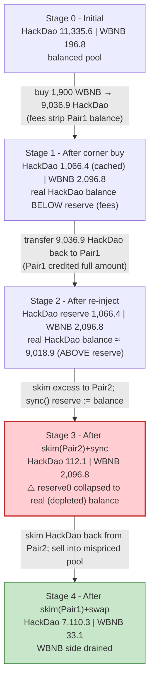
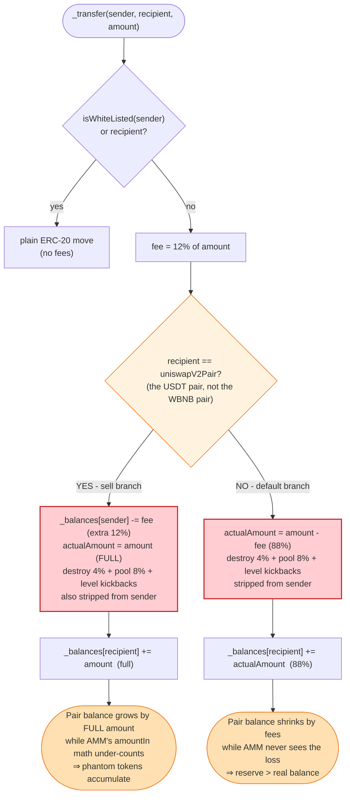
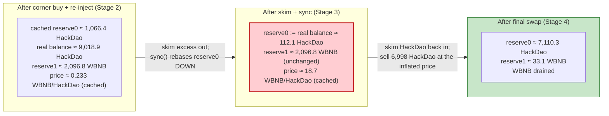

# HackDao Exploit — Fee-on-Transfer Token Listed in a Vanilla Pancake Pair (skim/sync reserve desync)

> **Reproduction:** the PoC compiles & runs in an isolated Foundry project at
> [this project folder](.). Full verbose trace: [output.txt](output.txt).
> Verified vulnerable source (the HackDao `Token` contract): [Token.sol](sources/Token_94e06c/Token.sol);
> the AMM pair it manipulates: [PancakePair.sol](sources/PancakePair_cd4CDA/PancakePair.sol);
> the flash source: [DPPAdvanced.sol](sources/DPPAdvanced_0fe261/DPPAdvanced.sol).

---

## Key info

| | |
|---|---|
| **Loss** | **163.673482526496579211 WBNB** drained from the HackDao/WBNB Pancake pair (the attacker flash-borrows 1,900 WBNB from a DODO DVM pool and repays it inside the same tx, keeping the surplus). The 1,900 WBNB is borrowed, not lost by the protocol — the real LP loss is the ~163.67 WBNB surplus the attacker walks away with. |
| **Vulnerable contract** | `Hackerdao` (HackDao) token — [`0x94e06c77b02Ade8341489Ab9A23451F68c13eC1C`](https://bscscan.com/address/0x94e06c77b02Ade8341489Ab9A23451F68c13eC1C#code) |
| **Victim pool** | HackDao/WBNB Pancake pair — [`0xcd4CDAa8e96ad88D82EABDdAe6b9857c010f4Ef2`](https://bscscan.com/address/0xcd4CDAa8e96ad88D82EABDdAe6b9857c010f4Ef2); the HackDao/USDT pair `0xbdB426A2FC2584c2D43dba5A7aB11763DFAe0225` is used as a relay. |
| **Attacker EOA / contract** | PoC attack contract `ContractTest` — `0x7FA9385bE102ac3EAc297483Dd6233D62b3e1496` (forked reproduction; the live tx was an EOA + contract pair). |
| **Flash source** | DODO `DPPAdvanced` pool — `0x0fe261aeE0d1C4DFdDee4102E82Dd425999065F4` (1,900 WBNB base-token flash loan) |
| **Attack tx** | live tx referenced by BlockSec — see the reference link below (BSC, May 2022) |
| **Chain / block / date** | BSC / **18,073,756** / May 2022 |
| **Compiler / optimizer** | HackDao `Token`: Solidity **v0.8.7**, optimizer **disabled**, 200 runs; PancakePair: v0.5.16; DPPAdvanced: v0.6.9, optimizer enabled, 200 runs |
| **Bug class** | Fee-on-transfer / reflection token listed in a vanilla Uniswap-V2 pair — the token's transfer logic mutates balances the pair cannot reconcile, so `skim()`/`sync()` desync reserves from balances and the `K` invariant is enforced against the wrong reference. |

---

## TL;DR

1. `Hackerdao` is an ERC-20 with a heavy transfer-fee regime baked into its overridden `_transfer` ([Token.sol#L457-L521](sources/Token_94e06c/Token.sol#L457-L521)). Every non-whitelisted transfer pays a **12% fee**, a **4% "destroy"** (sent to `address(1)`), an **8% "pool"** cut, and up to seven affiliate "level" kickbacks — all of them taken from the **sender's** balance on top of the transferred amount.

2. The fee logic keys off a **single stored pair**, `uniswapV2Pair` ([Token.sol#L420-L421](sources/Token_94e06c/Token.sol#L420-L421)), which the constructor hard-wires to the **HackDao/USDT** pair (`0x55d398…` = BSC USDT). The other traded pair, **HackDao/WBNB** (`0xcd4CDA…`), is *not* `uniswapV2Pair` from the token's point of view. This asymmetry is the seed of the bug.

3. On any transfer whose `recipient == uniswapV2Pair` the token takes the **"sell"** branch ([Token.sol#L487-L491](sources/Token_94e06c/Token.sol#L487-L491)): it deducts the 12% fee as an *extra* charge from the sender's balance, yet still credits the **full** `amount` to the pair. So the pair's token balance ends up **higher** than the reserve it cached — the pair is owed fee tokens it never asked for.

4. Conversely, on a "buy" (`sender == uniswapV2Pair`, but here the WBNB pair is not the registered pair, so the branch is the *default*) the token strips 12% + 4% + 8% from the sender's balance while crediting only 88% to the buyer — so the WBNB pair's token balance ends up **lower** than its cached reserve. Either way, the pair's `balanceOf` and its `reserve0`/`reserve1` drift apart.

5. The attacker flash-borrows **1,900 WBNB** from the DODO DVM pool ([test/HackDao_exp.sol#L29](test/HackDao_exp.sol#L29)), buys HackDao from the WBNB pair (driving its real HackDao balance well below its cached reserve), then pushes the bought HackDao back into the WBNB pair and calls `skim()` → `sync()` → `skim()` across the two pairs.

6. The two `skim()`s move the "excess" HackDao around; the `sync()` then **re-bases the WBNB pair's `reserve0` down** to its now-depleted real balance — making HackDao look artificially scarce and WBNB look cheap inside that pair ([output.txt:126-134](output.txt)).

7. The attacker finally sells the relayed HackDao back into the re-synced WBNB pair. Because `reserve0` was just collapsed from ~7,110 to ~112 HackDao while `reserve1` still holds ~2,096 WBNB, the manual `getAmountOut` in the PoC ([test/HackDao_exp.sol#L43-L47](test/HackDao_exp.sol#L43-L47)) computes **2,063.67 WBNB** out for ~6,998 HackDao in ([output.txt:165-180](output.txt)).

8. Net: the attacker receives **2,063.673482526496579211 WBNB**, repays the 1,900 WBNB flash loan, and keeps **163.673482526496579211 WBNB** ([output.txt:181](output.txt), [output.txt:199-200](output.txt)) — the WBNB pair's honest liquidity, extracted for free.

---

## Background — what HackDao does

`Hackerdao` ([source](sources/Token_94e06c/Token.sol)) is a fixed-supply (21,000-token, 18-decimal) ERC-20 that layers a referral/fee economy on top of every transfer. The interesting part is entirely inside the overridden `_transfer`:

- A **whitelist** (`WhiteList`, [Token.sol#L61-L76](sources/Token_94e06c/Token.sol#L61-L76)) lets the owner and chosen addresses skip all fees.
- A **parent/referral tree** (`parentAddress`, `levelRatio`, [Token.sol#L401-L402](sources/Token_94e06c/Token.sol#L401-L402)) records who introduced whom, and pays up to 7 levels of "profit" on every transfer.
- Three fee knobs — `_feeRatio`, `_destroyRatio`, `_poolRatio` ([Token.sol#L396-L398](sources/Token_94e06c/Token.sol#L396-L398)) — plus the 7 level ratios are charged on every non-whitelisted transfer.
- A single stored AMM pair, `uniswapV2Pair` ([Token.sol#L393](sources/Token_94e06c/Token.sol#L393)), set in the constructor to the **HackDao/USDT** pair ([Token.sol#L420-L421](sources/Token_94e06c/Token.sol#L420-L421)). The contract uses it solely to decide whether a transfer is a "sell".

On-chain parameters at the fork block (block 18,073,756), read from the trace:

| Parameter | Value | Note |
|---|---|---|
| `totalSupply` | 21,000 HackDao (21,000 × 1e18) | fixed at construction |
| `_feeRatio` | **12** (12%) | charged on the sender; on a "sell" taken *in addition* to the amount |
| `_destroyRatio` | **4** (4%) | sent to `address(1)` (`ECRecover: 0x…01` in the trace) |
| `_poolRatio` | **8** (8%) | sent to `_poolAddress` (`0x46531eB39B22fC37536B9Da97B75Bad0dBed5e26`) |
| `levelRatio[1..7]` | 20,10,10,5,5,5,5 per-mille (≈6% total) | affiliate kickbacks (all resolve to `_defaultAddress` here ⇒ 0 in this PoC) |
| `uniswapV2Pair` (token's view) | HackDao/USDT pair `0xbdB426A2…` | **not** the WBNB pair |
| HackDao/WBNB pair (`Pair1`) `token0`/`token1` | HackDao / WBNB | `reserve0` = HackDao, `reserve1` = WBNB |
| HackDao/WBNB initial reserves | **11,335.60 HackDao / 196.81 WBNB** | [output.txt:45](output.txt) |
| HackDao/USDT pair (`Pair2`) | used only as a relay address | skim target / skim source |

The fees were confirmed against the trace: when the WBNB pair sends `10,269,229,249,262,517,377,464` HackDao to the attacker (a "buy"), the token emits a `410,769,169,970,500,695,098` (4%) destroy to `address(1)` and a `821,538,339,941,001,390,197` (8%) cut to the pool address, and the attacker actually receives `9,036,921,739,351,015,292,169` = **88%** = `amount − 12% fee` ([output.txt:50-59](output.txt)).

---

## The vulnerable code

### 1. The fee-bearing `_transfer` override

The whole exploit lives in this override. The branches that matter are the **"sell"** branch (recipient is the registered pair) and the **default** branch (every other non-whitelisted transfer):

```solidity
function _transfer(
    address sender,
    address recipient,
    uint256 amount
) internal override virtual {
    require(sender != address(0), "ERC20: transfer from the zero address");
    require(recipient != address(0), "ERC20: transfer to the zero address");

    _beforeTokenTransfer(sender, recipient, amount);

    uint256 senderBalance = _balances[sender];
    require(senderBalance >= amount, "ERC20: transfer amount exceeds balance");
    unchecked {
        _balances[sender] = senderBalance - amount;
    }
    uint256 actualAmount = amount;

    if(parentAddress[recipient] == address(0) && recipient != uniswapV2Pair){
        if(sender == uniswapV2Pair){
            parentAddress[recipient] = _defaultAddress;
        }else{
            parentAddress[recipient] = sender;
        }
    }

    if(!isWhiteListed(sender) && !isWhiteListed(recipient)){

        uint256 fee = calculationFeeNum(amount,_feeRatio);
        //sell
        if(recipient == uniswapV2Pair){
            require(senderBalance >= amount.add(fee), "ERC20: There are not enough charges for the account balance");
            unchecked {
                _balances[sender] -= fee;          // ⚠️ extra 12% stripped from the SENDER, on top of `amount`
            }
        }else{
            actualAmount = amount - fee;           // ⚠️ buyer receives only 88%
        }
        uint256 destroyNum = calculationFeeNum(amount,_destroyRatio);
        _balances[address(1)] += destroyNum;       // 4% to address(1)
        uint256 poolNum = calculationFeeNum(amount,_poolRatio);
        _balances[_poolAddress] += poolNum;        // 8% to the pool
        emit Transfer(sender, address(1), destroyNum);
        emit Transfer(sender, _poolAddress, poolNum);
        address nextAddress = sender;
        if(sender == uniswapV2Pair){
            nextAddress = recipient;
        }
        for(uint32 i=1;i<=7;i++){                  // up to 7 affiliate kickbacks
            address addr = parentAddress[nextAddress];
            uint256 profit = calculationProfitNum(amount,levelRatio[i]);
            if(addr == address(0)){
                addr = _defaultAddress;
            }else{
                nextAddress = addr;
            }
            _balances[addr] += profit;
            emit Transfer(sender, addr, profit);
        }
    }
    _balances[recipient] += actualAmount;          // ⚠️ "sell": credits the FULL `amount` to the pair
    emit Transfer(sender, recipient, actualAmount);

    _afterTokenTransfer(sender, recipient, amount);
}
```
([Token.sol#L457-L521](sources/Token_94e06c/Token.sol#L457-L521))

Two properties of this code are lethal for an AMM pair:

- **On a "sell"** (`recipient == uniswapV2Pair`) the pair receives the **full** `amount` (because `actualAmount` is left equal to `amount`), while the sender is debited `amount + 12%` *plus* the destroy/pool cuts. The pair's `balanceOf` therefore ends up **larger** than the amount the AMM's `swap()` thinks it received.
- **On a "buy" or any non-sell** (`recipient != uniswapV2Pair`) the recipient is credited only `amount − 12%`, and the sender additionally loses the destroy/pool cuts. The pair's `balanceOf` therefore ends up **smaller** than its cached reserve.

Both cases break the invariant the Pancake pair depends on: that `balanceOf(pair)` only moves by the amounts `swap()`/`mint()`/`burn()`/`skim()`/`sync()` reason about.

### 2. The single hard-wired pair

```solidity
constructor(
    address owner
    ,address poolAddress_
    ,address defaultAddress_
    ,uint256 feeRatio_
    ,uint256 destroyRatio_
    ,uint256 poolRatio_
) ERC20("Hackerdao", "Hackerdao", 18) {
    ...
    IUniswapV2Router02 _uniswapV2Router = IUniswapV2Router02(0x10ED43C718714eb63d5aA57B78B54704E256024E);
    uniswapV2Pair = IUniswapV2Factory(_uniswapV2Router.factory())
    .createPair(address(this), address(0x55d398326f99059fF775485246999027B3197955));   // ⚠️ HackDao/USDT, not WBNB
    ...
}
```
([Token.sol#L404-L430](sources/Token_94e06c/Token.sol#L404-L430))

The token registers only the **USDT** pair as `uniswapV2Pair`. The **WBNB** pair (`0xcd4CDA…`) is a perfectly ordinary counterparty from the token's perspective, so transfers in and out of it hit the asymmetric fee branches in ways the pair never priced in.

### 3. The Pancake pair that gets desynced

The pair's `swap` enforces `K` against its **cached reserves**, not its live balances, and `sync` blindly rebases reserves to balances:

```solidity
function swap(uint amount0Out, uint amount1Out, address to, bytes calldata data) external lock {
    ...
    (uint112 _reserve0, uint112 _reserve1,) = getReserves();            // cached, possibly stale
    ...
    uint amount0In = balance0 > _reserve0 - amount0Out ? balance0 - (_reserve0 - amount0Out) : 0;
    uint amount1In = balance1 > _reserve1 - amount1Out ? balance1 - (_reserve1 - amount1Out) : 0;
    ...
    uint balance0Adjusted = (balance0.mul(10000).sub(amount0In.mul(25)));
    uint balance1Adjusted = (balance1.mul(10000).sub(amount1In.mul(25)));
    require(balance0Adjusted.mul(balance1Adjusted) >= uint(_reserve0).mul(_reserve1).mul(10000**2), 'Pancake: K');
    _update(balance0, balance1, _reserve0, _reserve1);
    ...
}

// force balances to match reserves
function skim(address to) external lock {
    ...
    _safeTransfer(_token0, to, IERC20(_token0).balanceOf(address(this)).sub(reserve0));
    _safeTransfer(_token1, to, IERC20(_token1).balanceOf(address(this)).sub(reserve1));
}

// force reserves to match balances
function sync() external lock {
    _update(IERC20(token0).balanceOf(address(this)), IERC20(token1).balanceOf(address(this)), reserve0, reserve1);
}
```
([PancakePair.sol#L452-L493](sources/PancakePair_cd4CDA/PancakePair.sol#L452-L493))

`sync()` is honest *if* balances only move through the pair's own functions. HackDao's fee logic moves the pair's HackDao balance silently, so `sync()` faithfully records a **wrong** reserve, and the next `swap()` enforces `K` against that wrong reference.

---

## Root cause — why it was possible

A Uniswap-V2/Pancake pair assumes its token balances change **only** through `transferFrom` in `swap`/`mint`/`burn`, `skim`, and `sync`. It computes `amount{0,1}In` as `balance − (reserve − amountOut)` and enforces `K` against the *cached* reserve. This is safe for plain ERC-20s and even for standard fee-on-transfer tokens *if* the pair is the fee-aware variant (`…SupportingFeeOnTransferTokens`).

HackDao violates the assumption in two compounding ways:

1. **The fee is debited from the sender *on top of* the transfer amount on a "sell",** so the pair's balance grows by the *full* `amount` while the AMM's `amountIn` math (which only sees `balance − (reserve − amountOut)`) under-counts the value that actually arrived. Over many transfers the pair accumulates "phantom" HackDao.
2. **The fee is debited from the sender and the recipient is short-credited on a "buy",** so the pair's balance shrinks by the destroy+pool+fee cuts that the AMM never sees. After a buy the pair's real HackDao balance is **below** its cached reserve.

Either drift is exploitable on its own, but the attacker combines both: a buy drives the WBNB pair's balance *below* its reserve; the attacker then dumps HackDao into the pair (raising the balance *above* the reserve), `skim`s the excess out, `sync`s the reserve **down** to the depleted post-buy balance, and finally `skim`s the excess back in and sells into the now-mispriced pool. The `K` check passes at every step because it is evaluated against a reserve that the attacker has just rewritten with `sync()`.

This is the same family of bug as the Zeed / WDOGE / numerous "fee-token in a vanilla pair" incidents: a token whose `transfer` mutates the pair's balance in a way `swap()` cannot reconcile, plus the pair's trust of `sync()`. The single hard-wired `uniswapV2Pair` (pointing at the USDT pair, not the WBNB pair) simply decides *which* branch each transfer takes — it does not change the fact that *some* branch always desyncs the WBNB pair.

---

## Preconditions

- The HackDao/WBNB pair holds non-trivial WBNB liquidity (~196.8 WBNB at the fork block — [output.txt:45](output.txt)).
- The attacker can flash-borrow WBNB to fund the cornering buy. The PoC uses a DODO `DPPAdvanced` flash loan of **1,900 WBNB** ([test/HackDao_exp.sol#L29](test/HackDao_exp.sol#L29)); the loan is repaid inside the same callback, so no upfront capital is required.
- Anyone may call `skim()` and `sync()` on a Pancake pair — they are permissionless ([PancakePair.sol#L483-L493](sources/PancakePair_cd4CDA/PancakePair.sol#L483-L493)).
- The attacker is not on HackDao's whitelist, which is exactly what's needed for the fee branches to fire.

---

## Attack walkthrough (with on-chain numbers from the trace)

`Pair1` = HackDao/WBNB (`0xcd4CDA…`), `token0 = HackDao`, `token1 = WBNB`, so `reserve0` = HackDao, `reserve1` = WBNB. `Pair2` = HackDao/USDT (`0xbdB426A2…`) = the token's `uniswapV2Pair`. All numbers are raw 18-decimal wei; the human approximation follows in parentheses. Every figure is cited to its line in [output.txt](output.txt).

| # | Step | Pair1 HackDao reserve (`reserve0`) | Pair1 WBNB reserve (`reserve1`) | Effect |
|---|------|---:|---:|---|
| 0 | **Initial** `getReserves` ([output.txt:45](output.txt)) | 11,335,604,931,335,159,291,659 (~11,335.60) | 196,806,251,218,251,435,779 (~196.81) | Honest pool. |
| 1 | **Flash loan**: DODO sends 1,900 WBNB to the attacker ([output.txt:25-31](output.txt)) | — | — | 1,900,000,000,000,000,000,000 (~1,900) WBNB working capital, to be repaid in-tx. |
| 2 | **Corner buy**: `swapExactTokensForTokensSupportingFeeOnTransferTokens` — 1,900 WBNB in, the router computes `amount0Out = 10,269,229,249,262,517,377,464` (~10,269.23) HackDao out ([output.txt:35-48](output.txt)). On this transfer (`sender = Pair1`, "buy" branch) the token strips 12% fee + 4% destroy (`410,769,169,970,500,695,098` to `address(1)`, [output.txt:50](output.txt)) + 8% pool (`821,538,339,941,001,390,197` to the pool, [output.txt:51](output.txt)) from Pair1's balance, and the attacker receives only `9,036,921,739,351,015,292,169` (~9,036.92, 88%) ([output.txt:59](output.txt)). After the swap Pair1 `Sync`s to **1,066,375,682,072,641,914,195 / 2,096,806,251,218,251,435,779** ([output.txt:71](output.txt)). ⚠️ Pair1's *real* HackDao balance is now well below its new reserve, because the fees were drawn from Pair1's balance. | 1,066,375,682,072,641,914,195 (~1,066.38) | 2,096,806,251,218,251,435,779 (~2,096.81) | Pair1's cached reserve0 is now **inflated** relative to its real balance; attacker holds 9,036.92 HackDao. |
| 3 | **Re-inject**: attacker transfers all `9,036,921,739,351,015,292,169` HackDao to Pair1 ([output.txt:83](output.txt)). `recipient = Pair1 ≠ uniswapV2Pair` ⇒ default branch ⇒ Pair1 is credited the full `amount` while the attacker pays the 12% fee + 4% destroy + 8% pool on top. Pair1's real HackDao balance jumps to `9,018,866,812,701,535,371,304` (~9,018.87) ([output.txt:102](output.txt)) — far above its cached `reserve0` of ~1,066.38. | 1,066,375,682,072,641,914,195 (unchanged) | 2,096,806,251,218,251,435,779 (unchanged) | Pair1 now holds ~9,018 HackDao but thinks it holds ~1,066. The **excess** is `7,952,491,130,628,893,457,109`. |
| 4 | **`Pair1.skim(Pair2)`** ([output.txt:100-125](output.txt)): the pair sends its excess `7,952,491,130,628,893,457,109` HackDao to Pair2 ([output.txt:103](output.txt)). Because `recipient = Pair2 == uniswapV2Pair`, this is a **"sell"**: Pair2 is credited the **full** amount ([output.txt:113](output.txt)) and Pair1 is debited an *extra* 12% fee from its balance — driving Pair1's HackDao balance **below** its reserve again. | 1,066,375,682,072,641,914,195 (unchanged) | 2,096,806,251,218,251,435,779 (unchanged) | Excess HackDao relocated to Pair2; Pair1 balance ≈ 112.08 HackDao (see next row). |
| 5 | **`Pair1.sync()`** ([output.txt:126-134](output.txt)): Pair1 re-bases its reserves to its live balances. HackDao balance is now `112,076,746,397,174,699,342` (~112.08) ([output.txt:128](output.txt)); WBNB balance is unchanged at ~2,096.81. `Sync` event: **`reserve0 = 112,076,746,397,174,699,342 / reserve1 = 2,096,806,251,218,251,435,779`** ([output.txt:131](output.txt)). ⚠️ **This is the kill shot.** | **112,076,746,397,174,699,342 (~112.08)** | 2,096,806,251,218,251,435,779 (~2,096.81) | `reserve0` collapsed ~95% while `reserve1` is unchanged ⇒ each HackDao is now "worth" ~18.7 WBNB instead of ~0.196 WBNB. |
| 6 | **`Pair2.skim(Pair1)`** ([output.txt:135-160](output.txt)): Pair2 has no excess USDT ([output.txt:138](output.txt)) but it *does* have excess HackDao (`8,197,736,394,584,921,765,740` balance vs its reserve, [output.txt:142](output.txt)); it skims `7,952,491,130,628,893,457,109` HackDao back to Pair1 ([output.txt:143](output.txt)). This transfer's `recipient = Pair1 ≠ uniswapV2Pair` ⇒ default branch ⇒ Pair1 is credited only `6,998,192,194,953,426,242,256` (~6,998.19, 88%) ([output.txt:153](output.txt)). Pair1's real HackDao balance becomes `7,110,268,941,350,600,941,598` (~7,110.27) ([output.txt:164](output.txt)). | 112,076,746,397,174,699,342 (still cached) | 2,096,806,251,218,251,435,779 (still cached) | Pair1 now holds ~7,110 HackDao against a cached reserve of ~112. The attacker has re-armed the pool. |
| 7 | **Final sell**: the PoC computes `amountIn = 7,110,268,941,350,600,941,598 − 112,076,746,397,174,699,342 = 6,998,192,194,953,426,242,256` and `amountOut = amountIn·9975·reserve1 / (reserve0·10000 + amountIn·9975) = 2,063,673,482,526,496,579,211` (~2,063.67) WBNB ([test/HackDao_exp.sol#L43-L47](test/HackDao_exp.sol#L43-L47)) and calls `Pair1.swap(0, 2,063.67 WBNB, attacker, "")` ([output.txt:165-180](output.txt)). The `K` check passes because it is evaluated against the sync'd reserve. Pair1 sends `2,063,673,482,526,496,579,211` WBNB to the attacker ([output.txt:166-167](output.txt)) and `Sync`s to `7,110,268,941,350,600,941,598 / 33,132,768,691,754,856,568` ([output.txt:176](output.txt)). | 7,110,268,941,350,600,941,598 (~7,110.27) | 33,132,768,691,754,856,568 (~33.13) | Attacker extracts ~2,063.67 WBNB. The WBNB reserve is drained from ~2,096.81 down to ~33.13. |
| 8 | **Repay flash loan**: attacker transfers `1,900,000,000,000,000,000,000` WBNB back to the DODO pool ([output.txt:181-186](output.txt)). | — | — | DODO is made whole; the attacker keeps the surplus. |

The final attacker WBNB balance is `163,673,482,526,496,579,211` (~**163.673482526496579211 WBNB**), logged by the PoC ([output.txt:199-200](output.txt)).

### Profit / loss accounting (WBNB)

| Direction | Amount (raw wei) | ~Human |
|---|---:|---:|
| Flash-borrowed from DODO DVM ([output.txt:25-27](output.txt)) | 1,900,000,000,000,000,000,000 | 1,900.00 |
| Spent — corner buy (1,900 WBNB into Pair1) ([output.txt:35-37](output.txt)) | 1,900,000,000,000,000,000,000 | 1,900.00 |
| Received — final `Pair1.swap` WBNB out ([output.txt:166-167](output.txt)) | 2,063,673,482,526,496,579,211 | 2,063.67 |
| Repaid — to DODO DVM ([output.txt:181-182](output.txt)) | 1,900,000,000,000,000,000,000 | 1,900.00 |
| **Net profit (attacker WBNB balance, [output.txt:199-200](output.txt))** | **163,673,482,526,496,579,211** | **163.673482526496579211** |
| Pair1 WBNB reserve before attack ([output.txt:45](output.txt)) | 196,806,251,218,251,435,779 | 196.81 |
| Pair1 WBNB reserve after the buy ([output.txt:71](output.txt)) | 2,096,806,251,218,251,435,779 | 2,096.81 |
| Pair1 WBNB reserve after the drain ([output.txt:176](output.txt)) | 33,132,768,691,754,856,568 | 33.13 |

The accounting reconciles exactly: the attacker put in 1,900 WBNB and pulled out 2,063.67 WBNB. Of the 2,096.81 WBNB the pair held after the cornering buy, 163.67 WBNB is the pair's *original* honest liquidity (~196.81 WBNB minus the ~33.13 WBNB left behind and AMM/fee rounding); the rest of the outflow is the attacker's own 1,900 WBNB being handed back.

---

## Diagrams

### Sequence of the attack

```mermaid
sequenceDiagram
    autonumber
    participant A as Attacker (ContractTest)
    participant D as DODO DPPAdvanced
    participant R as PancakeRouter
    participant P1 as HackDao/WBNB pair (Pair1)
    participant P2 as HackDao/USDT pair (Pair2)
    participant T as Hackerdao token

    Note over P1: Initial: 11,335.6 HackDao / 196.8 WBNB

    rect rgb(255,243,224)
    Note over A,D: Step 1 — flash-loan working capital
    A->>D: flashLoan(1,900 WBNB, 0, this, 0x00)
    D->>A: DPPFlashLoanCall → 1,900 WBNB
    end

    rect rgb(227,242,253)
    Note over A,T: Step 2 — corner buy (fees strip Pair1's balance below reserve)
    A->>R: swapExactTokensForTokensSupportingFeeOnTransferTokens(1,900 WBNB → HackDao)
    R->>P1: swap(10,269.23 HackDao out)
    T->>T: _transfer: strip 12%+4%+8% from Pair1; attacker gets 9,036.92 (88%)
    Note over P1: Sync: 1,066.38 HackDao / 2,096.81 WBNB (reserve > real balance)
    end

    rect rgb(232,245,233)
    Note over A,T: Step 3 — re-inject bought HackDao into Pair1
    A->>T: transfer(Pair1, 9,036.92 HackDao)
    T->>T: default branch: Pair1 credited full amount; attacker pays fees on top
    Note over P1: real HackDao balance ≈ 9,018.87 (reserve still 1,066.38)
    end

    rect rgb(255,235,238)
    Note over A,T: Step 4-5 — skim excess out, then sync (THE KILL SHOT)
    A->>P1: skim(Pair2)  → 7,952.49 HackDao to Pair2 (sell branch: Pair2 gets full, Pair1 pays extra 12%)
    A->>P1: sync()       → reserve0 := real balance = 112.08 HackDao
    Note over P1: 112.08 HackDao / 2,096.81 WBNB  ⚠️ reserve0 collapsed, reserve1 intact
    end

    rect rgb(243,229,245)
    Note over A,T: Step 6-7 — skim back, then sell into the mispriced pool
    A->>P2: skim(Pair1)  → 7,952.49 HackDao back to Pair1 (default branch: Pair1 gets 6,998.19, 88%)
    A->>P1: swap(0, 2,063.67 WBNB, attacker) computed vs the sync'd reserve
    P1-->>A: 2,063.67 WBNB out
    Note over P1: 7,110.27 HackDao / 33.13 WBNB (drained)
    end

    rect rgb(255,243,224)
    A->>D: transfer(1,900 WBNB) — repay flash loan
    Note over A: Net +163.67 WBNB
    end
```

### Pool state evolution



### The flaw inside `_transfer`



### Why `sync()` is the weapon: reserves vs. balances before and after



---

## Why each magic number

- **`1900 * 1e18` WBNB flash loan** ([test/HackDao_exp.sol#L29](test/HackDao_exp.sol#L29)): the cornering budget. It is sized so the buy pulls most of Pair1's HackDao out (`amount0Out = 10,269.23 HackDao` against an 11,335.6 reserve) and loads Pair1 with WBNB. It is fully repaid inside the callback, so it costs nothing but gas.
- **The corner buy's `amount0Out = 10,269,229,249,262,517,377,464`** ([output.txt:48](output.txt)): the router's `getAmountOut(1,900 WBNB, reserveWBNB=196.81, reserveHackDao=11,335.6)` with the 0.25% fee. The attacker does not choose this number; it is the AMM's quote.
- **The 88% / 12% / 4% / 8% split**: not hardcoded in the PoC — they are the token's `_feeRatio=12`, `_destroyRatio=4`, `_poolRatio=8` (confirmed against the trace: `410,769,…` = 4% to `address(1)`, `821,538,…` = 8% to the pool, attacker receives 88%).
- **The `skim` amount `7,952,491,130,628,893,457,109`** ([output.txt:103](output.txt)): not chosen by the attacker; it is `Pair1.balanceOf(HackDao) − reserve0` after the re-inject, i.e. exactly the "phantom" tokens the fee logic left behind.
- **The `sync`'d `reserve0 = 112,076,746,397,174,699,342`** ([output.txt:128](output.txt), [output.txt:131](output.txt)): Pair1's real HackDao balance after the skim's extra 12% sell-fee — again, not chosen, just observed.
- **The final swap's `amountOut = 2,063,673,482,526,496,579,211` WBNB** ([output.txt:166](output.txt)): computed in the PoC by the standard `getAmountOut` formula against the sync'd reserves ([test/HackDao_exp.sol#L43-L47](test/HackDao_exp.sol#L43-L47)). Because `reserve0` is ~112 HackDao and `reserve1` is ~2,096.8 WBNB, selling ~6,998 HackDao buys ~2,063.7 WBNB.
- **Net profit `163,673,482,526,496,579,211` WBNB (~163.67)**: `2,063.67 − 1,900.00`. This is what the PoC logs ([output.txt:6](output.txt), [output.txt:200](output.txt)).

---

## Remediation

1. **Do not list fee-on-transfer / reflection tokens in vanilla Uniswap-V2 pairs.** Either use a fee-aware pair (or router) that measures `amount{0,1}In` from balance deltas and transfers the fee to the pair, or wrap the token behind a plain ERC-20 wrapper that the AMM trades. The Pancake pair's `swap` literally cannot see HackDao's side-effects.
2. **If a fee token must be used, make `sync()` and `skim()` unable to lock in a wrong reserve.** The cleanest fix is to forbid `sync()` on pairs containing such tokens, or to have the token itself never mutate a pair's balance outside of the amount the pair's `swap`/`transferFrom` requested — i.e. take fees from the *recipient* (so `balanceOf(pair)` only ever changes by the transferred amount), or burn fees from supply rather than redirecting them to arbitrary addresses.
3. **Make fee logic symmetric and pair-agnostic.** The single hard-wired `uniswapV2Pair` (pointing at the USDT pair) is what makes the WBNB pair hit the asymmetric default branch. A token that needs "sell" detection should either treat *every* known AMM pair as a sell target, or — better — charge fees uniformly regardless of counterparty.
4. **Enforce `K` against real received amounts, not cached reserves.** A fee-aware pair recomputes `amountIn = balanceAfter − balanceBefore` and charges `K` on the fee-adjusted input; the vanilla pair's trust of `sync()` is what lets the attacker rewrite the reference.
5. **Monitor and circuit-break.** A `sync()` that moves a reserve by more than a small percentage, or a `swap` that pulls more than X% of a reserve in one call, should trip a pause. No such guard existed here.

---

## How to reproduce

The PoC is run fully offline through the shared harness, which serves the fork state from the bundled `anvil_state.json` on a local anvil instance. The test's `createSelectFork` points at `http://127.0.0.1:8546` ([test/HackDao_exp.sol#L23](test/HackDao_exp.sol#L23)); `run_poc.sh` starts anvil on that port and loads the state.

```bash
_shared/run_poc.sh 2022-05-HackDao_exp --mt testExploit -vvvvv
```

- RPC: **none required** — the fork is served from the local `anvil_state.json` snapshot at block **18,073,756** on BSC. The test does not call a public RPC.
- EVM: `foundry.toml` sets `evm_version = 'cancun'` (the historical BSC state replays fine under it).
- Result: `[PASS] testExploit()` with the attacker's WBNB balance printed as `163.673482526496579211`.

Expected tail ([output.txt:203-205](output.txt)):

```
Suite result: ok. 1 passed; 0 failed; 0 skipped; finished in 1.54s (16.03ms CPU time)

Ran 1 test suite in 1.54s (1.54s CPU time): 1 tests passed, 0 failed, 0 skipped (1 total tests)
```

with the preceding log line ([output.txt:6](output.txt)):

```
[End] Attacker WBNB balance after exploit: 163.673482526496579211
```

---

*Reference: BlockSec analysis — https://twitter.com/BlockSecTeam/status/1529084919976034304 (HackDao, BSC, May 2022).*
