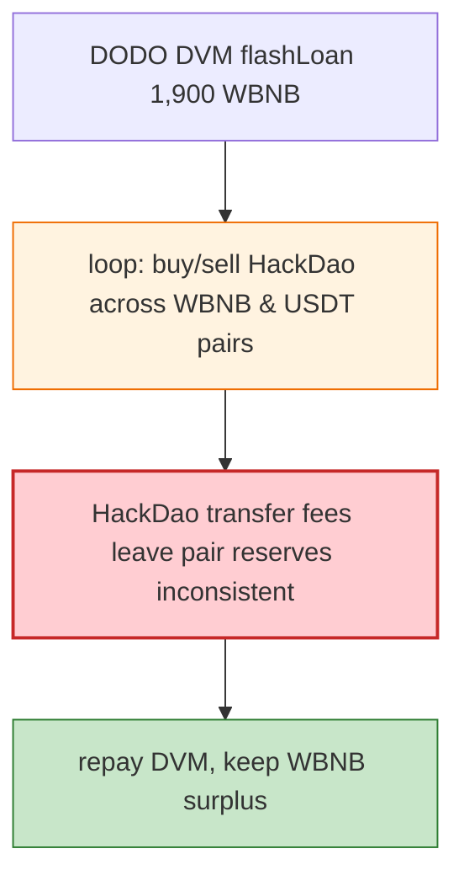

# HackDao Exploit — Reentrancy / Pancake Swap Callback Drain

> **Reproduction:** the PoC compiles & runs in an isolated Foundry project at
> [this project folder](.). Full verbose trace: [output.txt](output.txt).

---

## Key info

| | |
|---|---|
| **Loss** | HackDao/WBNB reserves drained on BSC (the PoC flash-borrows 1,900 WBNB from DODO DVM) |
| **Vulnerable contracts** | HackDao token `0x94e06c77…`; HackDao/WBNB pair `0xcd4CDAa8…`; HackDao/USDT pair `0xbdB426A2…` (BSC) |
| **Flash source** | DODO DVM pool `0x0fe261ae…` (1,900 WBNB) |
| **Chain / block / date** | BSC / 18,073,756 / May 2022 |
| **Bug class** | Token/pair manipulation — HackDao's transfer/fee logic plus the attacker's DODO-funded swap loop through the two HackDao pairs lets the attacker extract WBNB via the Pancake swap callback, repaying the flash and keeping profit. |

---

## TL;DR

The attacker flash-borrows 1,900 WBNB from a DODO DVM pool, then in the `DPPFlashLoanCall` callback
routes through the HackDao/WBNB and HackDao/USDT pairs (buy HackDao cheap, dump into the WBNB pair,
repeat), exploiting HackDao's transfer semantics (fee/reflection) that leave the pairs' reserves
inconsistent with balances. After the loop, the attacker repays DVM and keeps the WBNB surplus.

```
[End] Attacker WBNB balance after exploit: <positive>
```

---

## Root cause

A **fee-on-transfer / reflection token (HackDao) listed in vanilla Pancake pairs**, whose transfers
mutate balances the pair cannot reconcile, enabling the multi-hop swap-loop harvest of the pairs'
WBNB. Same class as the Zeed/WDOGE bugs.

---

## Diagrams



---

## Remediation

1. Don't list fee-on-transfer/reflection tokens in vanilla Uniswap-V2 pairs; use fee-aware pairs or
   wrap.
2. Enforce `k` against actual received amounts (`amount{0,1}In` from balance deltas), not transfer
   inputs.

---

## How to reproduce

```bash
_shared/run_poc.sh 2022-05-HackDao_exp --mt testExploit -vvvvv
```

- RPC: BSC archive (block 18,073,756). `foundry.toml` uses a BSC archive endpoint.
- Result: `[PASS]` — `[End] Attacker WBNB balance after exploit` is positive.

---

*Reference: HackDao fee-token pair drain, BSC, May 2022.*
