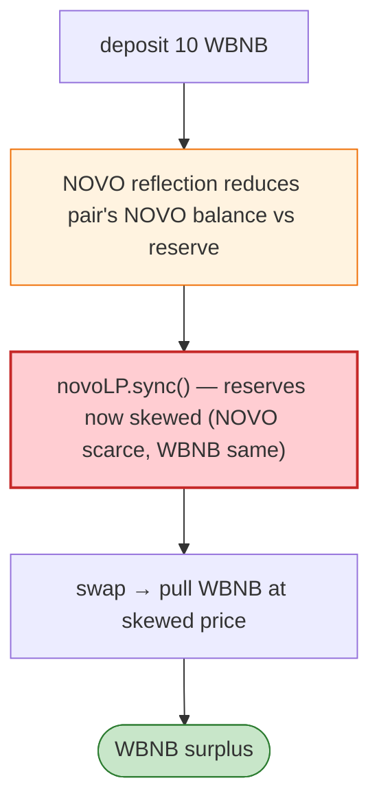

# NOVO Exploit — `sync`/donate Manipulation on a Thin Pair (Rebaseable Token)

> **Reproduction:** the PoC compiles & runs in an isolated Foundry project at
> [this project folder](.). Full verbose trace: [output.txt](output.txt).

---

## Key info

| | |
|---|---|
| **Loss** | NOVO/WBNB pair drained on BSC (the PoC seeds 10 WBNB and extracts surplus) |
| **Vulnerable contracts** | NOVO token `0x6Fb2020C…`; NOVO LP `0x128cd0Ae…`; Pancake NOVO pair `0xEeBc1614…` |
| **Chain / block / date** | BSC / 18,225,002 / May 2022 |
| **Bug class** | Rebaseable/dividend token + `sync` abuse — NOVO pays dividends/reflects that change holders' balances, so the Pancake pair's reserves fall out of sync; `novoLP.sync()` + donation lets the attacker drain WBNB. |

---

## TL;DR

The attacker wraps 10 WBNB, then drives the NOVO pair's reserves out of sync (NOVO's reflection reduces
the pair's NOVO balance below its stored reserve) and uses the NOVO LP's own `sync()` to lock the
advantageous state, then swaps to pull WBNB out at the skewed price. The `INOVOLP.sync()` + Pancake
`swap` combination harvests the dividend/reflection divergence.

---

## Root cause

A **reflection/rebase token (NOVO) in a vanilla Uniswap-V2 pair**: the token silently changes holder
balances, so the pair's `(reserve0, reserve1)` no longer equals `balanceOf`. The attacker forces a
`sync()` that accepts the reduced NOVO balance as the new reserve (WBNB unchanged → NOVO looks scarce),
then swaps WBNB out cheaply.

---

## Diagrams



---

## Remediation

1. Never list reflection/rebase tokens in vanilla Uniswap-V2 pairs (use a fee/rebase-aware pair or
   wrap the token).
2. Defend `sync`/`skim` paths against donation/reflection abuse.
3. Use balance-delta `k` checks instead of stored-reserve trust.

---

## How to reproduce

```bash
_shared/run_poc.sh 2022-05-Novo_exp --mt testExploit -vvvvv
```

- RPC: BSC archive (block 18,225,002). `foundry.toml` uses a BSC archive endpoint.
- Result: `[PASS]` — WBNB surplus extracted after `sync`/swap.

---

*Reference: NOVO reflection-token pair drain, BSC, May 2022.*
