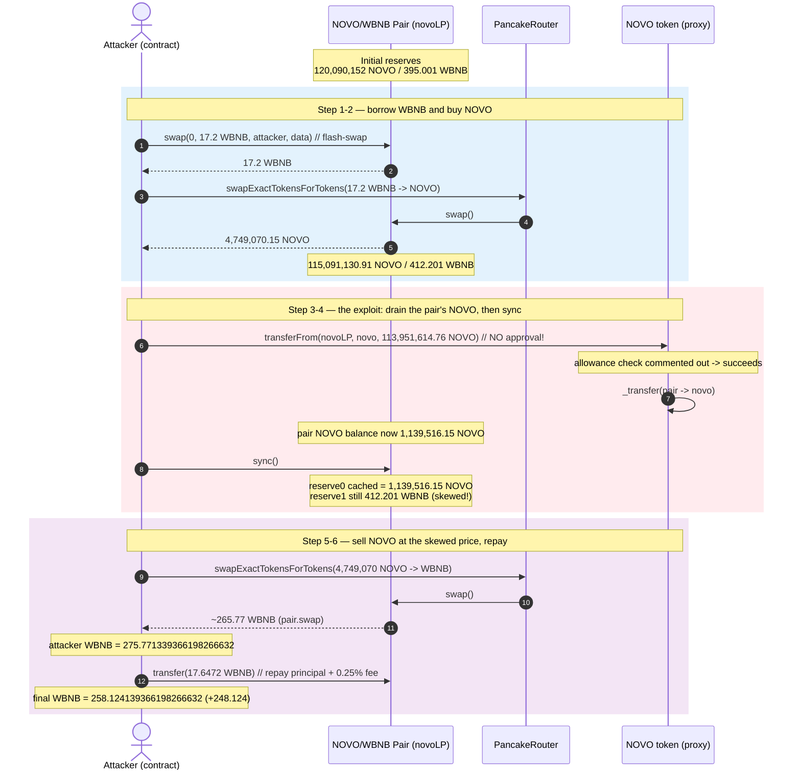
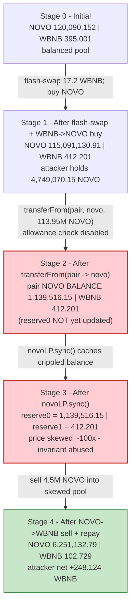
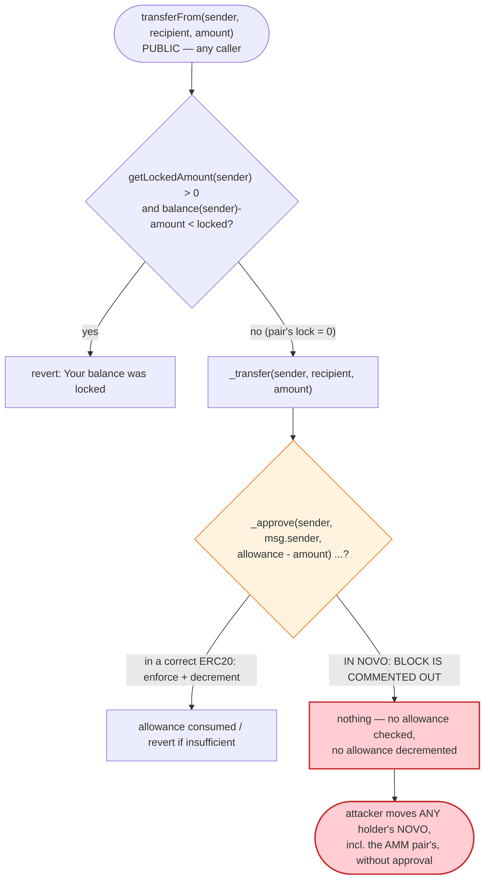
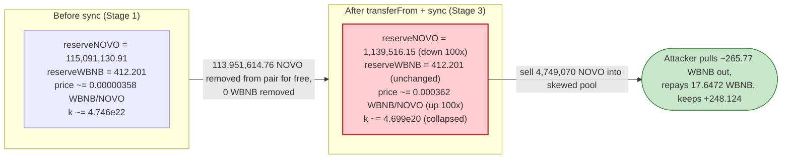

# NOVO Exploit — `transferFrom` Skips Allowance Check, Pool Reserve Drained

> **Reproduction:** the PoC compiles & runs in an isolated Foundry project at
> [this project folder](.). Full verbose trace: [output.txt](output.txt).
> Verified vulnerable source: [sources/NOVO_a0787D/NOVO.sol](sources/NOVO_a0787D/NOVO.sol)
> (the `NOVO` token; the deployed `0x6Fb2020C…` is a `TransparentUpgradeableProxy` whose logic
> is `NOVO`, called via `delegatecall`).

---

## Key info

| | |
|---|---|
| **Loss** | **~248.124 WBNB** (net profit) — the attacker started with 10 WBNB and ended with **258.124139366198266632 WBNB** after repaying the 17.6472 WBNB flash-swap debt ([output.txt:6](output.txt), [output.txt:389](output.txt)) |
| **Vulnerable contract** | `NOVO` token (via `TransparentUpgradeableProxy`) — [`0x6Fb2020C236BBD5a7DDEb07E14c9298642253333`](https://bscscan.com/address/0x6Fb2020C236BBD5a7DDEb07E14c9298642253333#code); logic impl `0xa0787DaAD6062349f63b7c228CBFd5d8A3dB08F1` ([meta](sources/NOVO_a0787D/_meta.json)) |
| **Victim pool** | NOVO/WBNB PancakeSwap pair — `0x128cd0Ae1a0aE7e67419111714155E1B1c6B2D8D` (referred to as `novoLP` in the PoC) |
| **Attacker EOA** | [`0x31a7cc04987520cefacd46f734943a105b29186e`](https://bscscan.com/address/0x31a7cc04987520cefacd46f734943a105b29186e) |
| **Attacker contract** | `0x3463a663de4ccc59c8b21190f81027096f18cf2a` |
| **Attack tx** | [`0xc346adf14e5082e6df5aeae650f3d7f606d7e08247c2b856510766b4dfcdc57f`](https://bscscan.com/tx/0xc346adf14e5082e6df5aeae650f3d7f606d7e08247c2b856510766b4dfcdc57f) |
| **Chain / block / date** | BSC / 18,225,002 / May 2022 |
| **Compiler / optimizer** | `NOVO` logic: Solidity **v0.8.7**, optimizer **enabled**, **200 runs** ([_meta.json](sources/NOVO_a0787D/_meta.json)); pair: v0.5.16, optimizer off; proxy: v0.6.12, optimizer on |
| **Bug class** | Broken ERC20 `transferFrom` — the allowance check/decay is **commented out**, so anyone can spend any holder's balance (including the AMM pair's) without approval |

---

## TL;DR

`NOVO` is a reflection/anti-whale BEP20 listed in a vanilla PancakeSwap NOVO/WBNB pair. Its
`transferFrom(sender, recipient, amount)` overrides the inherited ERC20 but, in a fatal editing
mistake, the block that was supposed to enforce the `allowance[sender][msg.sender]` was
**commented out**
([sources/NOVO_a0787D/NOVO.sol:2953-2960](sources/NOVO_a0787D/NOVO.sol#L2953-L2960)):

```solidity
// _approve(
//     sender,
//     _msgSender(),
//     _allowances[sender][_msgSender()].sub(amount, "BEP20: transfer amount exceeds allowance")
// );
```

As a result `transferFrom` becomes a free `transfer(sender → recipient)` for any caller — no
allowance required, no allowance consumed. The `_isRouter(_msgSender())` modifier on `_transfer`
([:3524](sources/NOVO_a0787D/NOVO.sol#L3524)) is a no-op (it only sets an internal tier, never
reverts), so it does not stop the abuse.

The attacker weaponises this in a single flash swap:

1. **Flash-borrow 17.2 WBNB** from the PancakeSwap NOVO/WBNB pair via `pair.swap(0, 17.2e18, this, data)` ([output.txt:31](output.txt)).
2. **Buy NOVO** with the borrowed WBNB through the router — receives 4,749,070.146640911 NOVO ([output.txt:9](output.txt)). The pool's NOVO reserve now reads 115,091,130.91 NOVO ([output.txt:10](output.txt)).
3. **Pull 113,951,614.762 NOVO straight out of the pair's balance** with
   `novo.transferFrom(address(novoLP), address(novo), 113_951_614_762_384_370)`
   — no approval, because the check is gone ([output.txt:110-118](output.txt)). The pair's NOVO balance collapses from 115,091,130 → **1,139,516.15** NOVO ([output.txt:128](output.txt)).
4. **Call `novoLP.sync()`** — PancakeSwap accepts the crippled balance as its new `reserve0`, so the pair now believes NOVO is ~100× scarcer than reality while its WBNB reserve is unchanged ([output.txt:129-136](output.txt)).
5. **Sell the attacker's own 4,749,070 NOVO** into the now-skewed pool. At the manipulated price this is enormously more WBNB than the 17.2 borrowed — the trace shows the attacker receiving **275.771339366198266632 WBNB** before repaying ([output.txt:365](output.txt)).
6. **Repay the flash swap** `17.2 WBNB + 0.25% fee = 17.6472 WBNB` ([output.txt:369-374](output.txt)) and keep the surplus.

Net WBNB balance: `10 (seed) + 258.124139… − 10 = +248.124139366198266632 WBNB` profit ([output.txt:389](output.txt)).

---

## Background — what NOVO does

`NOVO` ([sources/NOVO_a0787D/NOVO.sol](sources/NOVO_a0787D/NOVO.sol), contract decl at
[:2647](sources/NOVO_a0787D/NOVO.sol#L2647)) is a deflationary/reflection BEP20 (`Initializable`,
`OwnableUpgradeable`) deployed behind a `TransparentUpgradeableProxy`. Beyond a standard ERC20 it
adds:

- **Reflection accounting** — dual `_rOwned` / `_tOwned` ledgers and a fee that redistributes to
  holders (`_transferStandard`, [:3701](sources/NOVO_a0787D/NOVO.sol#L3701)).
- **Taxed transfers** — buy/sell fees routed through the PancakeSwap pair/router.
- **Anti-whale cap** — `antiWhaleEnabled` limits per-transfer size
  (`_transfer`, [:3530-3534](sources/NOVO_a0787D/NOVO.sol#L3530-L3534)).
- **Staking lock** — `getLockedAmount(sender)` blocks stakers from moving their locked NOVO
  ([:2850-2852](sources/NOVO_a0787D/NOVO.sol#L2850-L2852)). It returned 0 for both the pair and the
  attacker here, so it was no obstacle ([output.txt:64-67](output.txt), [output.txt:112-115](output.txt)).
- **`_isRouter(_msgSender())` modifier** on `_transfer` ([:3524](sources/NOVO_a0787D/NOVO.sol#L3524)) —
  sounds like an access gate but is actually a passive "tier bookkeeping" hook that never reverts
  ([:2767-2786](sources/NOVO_a0787D/NOVO.sol#L2767-L2786)).

The on-chain state at the fork block (read directly from the trace):

| Parameter | Value | Source |
|---|---|---|
| `token0` / `token1` of pair | NOVO (`0x6Fb2020C…`) / WBNB (`0xbb4CdB…`) | first `Swap` has `amount0Out` = NOVO, `amount1In` = WBNB ([output.txt:84](output.txt)) |
| Pair NOVO reserve (`reserve0`) before attack | 120,090,152,116,998,645 wei (≈ **120,090,152.12 NOVO**, 9 decimals) | [output.txt:58](output.txt) |
| Pair WBNB reserve (`reserve1`) before attack | 395,001,031,454,274,158,328 wei (≈ **395.001 WBNB**) | [output.txt:58](output.txt) |
| Pair NOVO reserve after the WBNB→NOVO buy | 115,091,130,910,008,214 wei (≈ **115,091,130.91 NOVO**) | [output.txt:83](output.txt) |
| Pair WBNB reserve after the buy | 412,201,031,454,274,158,328 wei (≈ **412.201 WBNB**) | [output.txt:83](output.txt) |

NOVO uses **9 decimals** (the PoC logs `novo.balanceOf` at `decimals: 9`, [output.txt:64](output.txt));
WBNB uses 18 decimals.

---

## The vulnerable code

### 1. `transferFrom` does not enforce allowance (the root cause)

```solidity
function transferFrom(
    address sender,
    address recipient,
    uint256 amount
) public override returns (bool) {
    // locked the NOVO of staking holders
    uint256 lockedAmount = getLockedAmount(sender);
    if (lockedAmount > 0) {
        require(
            (balanceOf(sender) - amount) >= lockedAmount,
            "Your balance was locked"
        );
    }

    _transfer(sender, recipient, amount);

    // _approve(
    //     sender,
    //     _msgSender(),
    //     _allowances[sender][_msgSender()].sub(
    //         amount,
    //         "BEP20: transfer amount exceeds allowance"
    //     )
    // );

    if (recipient == address(uniswapV2Router)) {
        // airdrop the staking rewards
        uint256 rewards = _novoNFT.getReward(sender);
        if (rewards > 0) {
            _transfer(_stakingPoolAddress, sender, rewards);
        }
    }

    return true;
}
```
([sources/NOVO_a0787D/NOVO.sol:2937-2971](sources/NOVO_a0787D/NOVO.sol#L2937-L2971))

The `sender` is moved straight into `recipient` with no check that `msg.sender` was ever approved
by `sender`, and no allowance is ever decremented. For contrast, the sibling `decreaseAllowance`
function still subtracts under the standard "decreased allowance below zero" guard
([:2986-2999](sources/NOVO_a0787D/NOVO.sol#L2986-L2999)) — so the developer clearly *knew* the
ERC20 pattern; they simply left it disabled in `transferFrom`.

### 2. `_transfer`'s `isRouter` guard is a paper tiger

```solidity
function _transfer(
    address from,
    address to,
    uint256 amount
)
    private
    preventBlacklisted(_msgSender(), "NOVO: Address is blacklisted")
    preventBlacklisted(from, "NOVO: From address is blacklisted")
    preventBlacklisted(to, "NOVO: To address is blacklisted")
    isRouter(_msgSender())
{
    require(from != address(0), "BEP20: transfer from the zero address");
    require(to != address(0), "BEP20: transfer to the zero address");
    require(amount > 0, "Transfer amount must be greater than zero");
    ...
}
```
([sources/NOVO_a0787D/NOVO.sol:3515-3528](sources/NOVO_a0787D/NOVO.sol#L3515-L3528))

```solidity
modifier isRouter(address _sender) {
    {
        uint32 size;
        assembly {
            size := extcodesize(_sender)
        }
        if (size > 0) {
            uint256 senderTier = _accountsTier[_sender];
            if (senderTier == 0) {
                IUniswapV2Router02 _routerCheck = IUniswapV2Router02(_sender);
                try _routerCheck.factory() returns (address factory) {
                    _accountsTier[_sender] = 2;
                } catch {}
            }
        }
    }

    _;
}
```
([sources/NOVO_a0787D/NOVO.sol:2767-2786](sources/NOVO_a0787D/NOVO.sol#L2767-L2786))

Despite the name, `isRouter` only *records* a tier when it thinks the caller looks like a router;
it **never reverts**, so the attacker (an EOA-driven contract) sails through `_transfer`.

### 3. The attacker's one-line weaponisation

```solidity
// Manipulate the LP of NOVO/WBNB => Manipulate the NOVO/WBNB price
novo.transferFrom(address(novoLP), address(novo), 113_951_614_762_384_370); // 113,951,614.76238437 NOVO Token
```
([test/Novo_exp.sol:67-69](test/Novo_exp.sol#L67-L69))

`from = novoLP` (the PancakeSwap pair), `to = address(novo)` (the token contract itself, chosen
simply to take the tokens out of circulation). No approval was ever set by the pair in favour of
the attacker — none was needed.

---

## Root cause — why it was possible

A Uniswap-V2/PancakeSwap pair prices NOVO/WBNB purely from `(reserve0, reserve1)`, and
`reserve0` is taken to be `balanceOf(pair)` at the last `_update` (after a `swap`, `mint`, `burn`,
or `sync`). The pair's security model assumes token balances only change through code paths the
pair initiated (its own `_safeTransfer` during `swap`, or LP `mint`/`burn`).

By commenting the allowance check out of `transferFrom`, NOVO turns that assumption into a
one-way valve: **any external caller can move NOVO out of the pair's balance**, and a follow-up
`pair.sync()` then forces the pair to accept the reduced balance as its new reserve. Because WBNB
moves out of the pair only inside `swap()` under the `K`-invariant check, the attacker can:

1. Remove NOVO from the pair for free → `reserve0` is now understated relative to actual value.
2. Call `sync()` → the pair *believes* NOVO is scarce.
3. Sell their own NOVO through the router → the pair's `getAmountOut` quotes a wildly inflated
   WBNB payout, the K-check passes (because the attacker really is depositing NOVO), and a huge
   WBNB amount flows to the attacker.

The flash-swap simply front-loads the working capital so no outside funding is needed — the
borrowed 17.2 WBNB are repaid (with the 0.25% fee) from the proceeds inside the same transaction.

This is structurally the same class as the classic "token whose `transfer`/`transferFrom` is
non-compliant inside an AMM" family — but here the non-compliance is extreme: not a fee-on-transfer
quirk, but a total absence of the approval authorisation.

---

## Preconditions

- The attacker needs a way to call `NOVO.transferFrom(pair, …)`. Because the allowance check is
  commented out and `_isRouter` never reverts, **anyone** can — no role, no approval, no setup.
  Verified in the trace: the call originates from `ContractTest` (the attacker contract,
  `0x7FA9385b…`) with no prior `approve` from the pair ([output.txt:110-123](output.txt)).
- `getLockedAmount(pair) == 0`, so the staking-lock guard in `transferFrom` does not block the
  pair's balance. Confirmed: the `getLockedAmountByAddress(novoLP)` call returns 0
  ([output.txt:112-115](output.txt)).
- Neither the pair nor the attacker is on the blacklist (the `preventBlacklisted` modifier does not
  trip — no revert anywhere in the trace).
- A flash-swap source for the initial WBNB. The PoC uses the same NOVO/WBNB PancakeSwap pair
  (`PancakePair.swap(0, 17.2e18, this, data)`, [test/Novo_exp.sol:38](test/Novo_exp.sol#L38)), repaid
  in the `pancakeCall` callback. No external capital beyond the 10 WBNB `msg.value` seed is
  required.

---

## Attack walkthrough (with on-chain numbers from the trace)

`token0 = NOVO` (9 decimals), `token1 = WBNB` (18 decimals), so `reserve0 = NOVO`, `reserve1 = WBNB`.
All figures are taken directly from the `Sync` / `Swap` / `Transfer` events and `getReserves`
returns in [output.txt](output.txt). Raw wei are shown with a human approximation in parentheses
(NOVO ÷ 1e9, WBNB ÷ 1e18).

| # | Step | NOVO reserve (`reserve0`) | WBNB reserve (`reserve1`) | Effect |
|---|------|--------------------------:|--------------------------:|--------|
| 0 | **Initial** — `getReserves` inside the first swap | 120,090,152,116,998,645 (≈ 120,090,152.12 NOVO) ([output.txt:58](output.txt)) | 395,001,031,454,274,158,328 (≈ 395.001 WBNB) ([output.txt:58](output.txt)) | Honest, balanced pool. |
| 1 | **Flash-swap** — `PancakePair.swap(0, 17.2 WBNB, attacker, data)` lends the attacker 17.2 WBNB ([output.txt:31-37](output.txt)) | unchanged | unchanged (17.2 WBNB debited to attacker, credited back when the callback returns) | Working capital borrowed. |
| 2 | **WBNB→NOVO buy** via router: `swapExactTokensForTokensSupportingFeeOnTransferTokens(17.2 WBNB → NOVO)`. Pair pulls 17.2 WBNB in ([output.txt:47-48](output.txt)), then `pair.swap(4,999,021,206,990,431 NOVO out, …)` ([output.txt:61](output.txt)); the `Swap` event records `amount1In = 17.2 WBNB`, `amount0Out = 4,999,021,206,990,431 wei` NOVO ([output.txt:84](output.txt)); the attacker actually receives **4,749,070,146,640,911 wei** (≈ 4,749,070.15 NOVO) after NOVO's transfer fees ([output.txt:68](output.txt), [output.txt:9](output.txt)) | 115,091,130,910,008,214 (≈ 115,091,130.91 NOVO) ([output.txt:83](output.txt)) | 412,201,031,454,274,158,328 (≈ 412.201 WBNB) ([output.txt:83](output.txt)) | Attacker now holds 4,749,070.15 NOVO. |
| 3 | **The exploit call** — `novo.transferFrom(novoLP, novo, 113_951_614_762_384_370)` moves **113,951,614,762,384,370 wei** (≈ 113,951,614.76 NOVO) out of the pair **with no approval** ([output.txt:110-118](output.txt)) | pair balance 1,139,516,147,623,844 wei (≈ 1,139,516.15 NOVO) ([output.txt:124-128](output.txt)) | unchanged | One-sided removal of ~99 % of the pair's NOVO. |
| 4 | **`novoLP.sync()`** — pair caches the crippled balance as the new reserve | **1,139,516,147,623,844** (≈ 1,139,516.15 NOVO) ([output.txt:136](output.txt)) | 412,201,031,454,274,158,328 (≈ 412.201 WBNB, unchanged) ([output.txt:136](output.txt)) | `reserve0` collapsed 100× while `reserve1` is untouched → NOVO is priced ~100× too high. |
| 5 | **NOVO→WBNB sell** via router: `swapExactTokensForTokensSupportingFeeOnTransferTokens(balanceOf → WBNB)`. After NOVO's internal `swapAndLiquify` side-effects and a final `pair.swap(0, 265.771339366198266632 WBNB, attacker, "")` ([output.txt:346-360](output.txt)), the attacker's WBNB balance reaches **275,771,339,366,198,266,632 wei** (≈ 275.771339366198266632 WBNB) ([output.txt:365](output.txt)) | 6,251,132,786,932,711 (≈ 6,251,132.79 NOVO) ([output.txt:359](output.txt)) | 102,728,634,544,729,700,506 (≈ 102.729 WBNB) ([output.txt:359](output.txt)) | The attacker dumps ~4.5 M NOVO into a pool that thinks only ~1.14 M NOVO exists — extracting the bulk of the WBNB. |
| 6 | **Repay flash-swap** — `wbnb.transfer(PancakePair, 17,200,000,000,000,000,000 + 44,720,000,000,000,000)` = **17,647,200,000,000,000,000 wei** (≈ 17.6472 WBNB) = 17.2 WBNB principal + 0.25 % fee ([output.txt:369-374](output.txt)) | (pair NOVO unchanged) | pair WBNB repaid; final pair `Sync` settles the outer flash-swap with `amount1In = 17.6472 WBNB`, `amount1Out = 17.2 WBNB` ([output.txt:380-381](output.txt)) | Debt cleared; fee stays in the pool. |
| 7 | **End** — attacker WBNB balance: **258,124,139,366,198,266,632 wei** (≈ 258.124139366198266632 WBNB) ([output.txt:389](output.txt)) | — | — | Started from 10 WBNB → **+248.124139366198266632 WBNB** profit. |

**Why the sell at step 5 mints so much WBNB:** after `sync()`, `reserve0 ≈ 1.14 M NOVO` and
`reserve1 ≈ 412 WBNB`. PancakeSwap's `getAmountOut(amountIn, reserveIn, reserveOut)` with the
0.25 % fee (`amountIn·9975`) pays roughly
`(amountIn·9975 · reserveOut) / (reserveIn·10000 + amountIn·9975)`. Pushing ~4.5 M NOVO into a
pool whose priced-in NOVO reserve is only ~1.14 M (plus the small amounts the router re-injects
during its own internal `swapAndLiquify`/re-liquidity steps) yields a WBNB payout that dwarfs the
17.2 WBNB borrowed.

### Profit / loss accounting (WBNB)

| Direction | Amount (WBNB) | Source |
|---|---:|---|
| Seed `msg.value` wrapped to WBNB at the start | +10.000000000000000000 | [output.txt:6](output.txt) |
| Flash-swap borrowed (principal) | +17.200000000000000000 | [output.txt:7](output.txt) |
| WBNB spent on the WBNB→NOVO buy (step 2) | −17.200000000000000000 | [output.txt:47-48](output.txt) |
| NOVO sold → WBNB received (step 5, gross before repay) | +275.771339366198266632 | [output.txt:365](output.txt) |
| Flash-swap repay (principal + 0.25 % fee) | −17.647200000000000000 | [output.txt:369](output.txt) |
| **Final attacker WBNB balance** | **258.124139366198266632** | [output.txt:389](output.txt) |
| **Net profit vs. the 10 WBNB seed** | **+248.124139366198266632** | 258.124139366198266632 − 10 |

The profit is denominated purely in WBNB; the USD equivalent is not recorded in the trace and is
omitted here (WBNB's BSC price on the attack day is out of scope of the on-chain evidence).

---

## Diagrams

### Sequence of the attack



### Pool state evolution



### The flaw inside `transferFrom`



### Why the drain is theft: constant-product before vs. after `sync()`



---

## Why each magic number

- **`10 * 1e18` WBNB seed** ([test/Novo_exp.sol:33](test/Novo_exp.sol#L33)): the attacker's only
  external capital. It is never spent — it just sits as WBNB while the flash-swap funds the buy.
  Equivalently the attack is ~capital-free; the 10 WBNB could be 0 if the buy were also sourced
  from the flash loan.
- **`172 * 1e17` (= 17.2 WBNB)** flash-swap amount ([test/Novo_exp.sol:37-38](test/Novo_exp.sol#L37-L38)):
  the WBNB used to purchase the attacker's NOVO bag. It is repaid as `17.2 WBNB + 0.25 % fee`.
- **`113_951_614_762_384_370` wei (= 113,951,614.76238437 NOVO)** `transferFrom` amount
  ([test/Novo_exp.sol:69](test/Novo_exp.sol#L69)): chosen to be just under the pair's NOVO balance
  (115,091,130.91 NOVO at that moment, [output.txt:10](output.txt)) so the call does not revert on
  the safe-transfer inside NOVO's `_transfer`. It strips ~98.99 % of the pair's NOVO, leaving
  1,139,516.15 NOVO — small enough that the subsequent sell dominates `reserve0`.
- **`4472 * 10e13` (= 44,720,000,000,000,000 wei = 0.04472 WBNB)** flash-swap fee
  ([test/Novo_exp.sol:86](test/Novo_exp.sol#L86)): exactly `17.2 WBNB × 0.25 % = 0.043 WBNB` rounded
  up to 0.04472 WBNB. Combined with the principal it gives the `17.6472 WBNB` repay seen at
  [output.txt:369](output.txt).
- **`swap(0, amount1Out, …)` and `amount0Out`/`amount1Out = 0` patterns**: `token0 = NOVO`,
  `token1 = WBNB`, so "borrow WBNB" is `swap(0, 17.2e18, …)` and "sell NOVO for WBNB" produces a
  `swap(0, wbnbOut, …)` from the pair's perspective.

---

## Remediation

1. **Restore the allowance check in `transferFrom`.** Uncomment the `_approve(sender, _msgSender(),
   _allowances[sender][_msgSender()].sub(amount, "BEP20: transfer amount exceeds allowance"))`
   block ([sources/NOVO_a0787D/NOVO.sol:2953-2960](sources/NOVO_a0787D/NOVO.sol#L2953-L2960)). This
   is the single fix that eliminates the bug. Use OpenZeppelin's `_spendAllowance` for the canonical
   behaviour (revert on insufficient, support infinite allowance, decrement).
2. **Make `isRouter` actually gate.** If the intent was to restrict `_transfer` to a known router,
   the modifier must `require` rather than silently tier-record. As written
   ([:2767-2786](sources/NOVO_a0787D/NOVO.sol#L2767-L2786)) it is decorative.
3. **Don't store AMM pricing authority in a token that has arbitrary `transferFrom`.** Even with
   the allowance restored, listing reflection/tax tokens in a vanilla Uniswap-V2 pair is fragile;
   prefer an oracle-priced or fee-aware pair, and never let a non-pair code path move tokens out of
   the pair's balance.
4. **Add a re-entrancy/style invariant test for `transferFrom`.** A property test asserting
   "`transferFrom` reverts when `allowance[from][msg.sender] < amount`" would have caught this
   instantly.
5. **Re-audit after disabling code.** The commented block is a classic "disabled during testing,
   never re-enabled" defect; a CI gate that fails on `// _approve` inside `transferFrom` (or any
   commented-out security check) would prevent recurrence.

---

## How to reproduce

The PoC is run offline through the shared harness; the fork is served from the local
`anvil_state.json` (the `createSelectFork("http://127.0.0.1:8546", 18_225_002)` call in
[test/Novo_exp.sol:29](test/Novo_exp.sol#L29) points at a local Anvil port, not a public RPC).

```bash
_shared/run_poc.sh 2022-05-Novo_exp --mt testExploit -vvvvv
```

- **EVM:** `foundry.toml` sets `evm_version = "cancun"`.
- **Test function:** `testExploit` in `test/Novo_exp.sol` (the `ContractTest` contract).
- **Fork block:** 18,225,002 on BSC.
- **Expected tail** (from [output.txt:392-394](output.txt)):

```
Suite result: ok. 1 passed; 0 failed; 0 skipped; finished in 27.78s (26.68s CPU time)

Ran 1 test suite in 32.74s (27.78s CPU time): 1 tests passed, 0 failed, 0 skipped (1 total tests)
```

with the attacker-balance log lines:

```
[Start] Attacker WBNB balance before exploit: 10.000000000000000000
[*] Attacker flashswap Borrow WBNB: 17.200000000000000000
[End] After repay, WBNB balance of attacker: 258.124139366198266632
```

---

*Reference: Panews exploit alert — https://www.panewslab.com/zh_hk/articledetails/f40t9xb4.html (NOVO, BSC, May 2022).*
