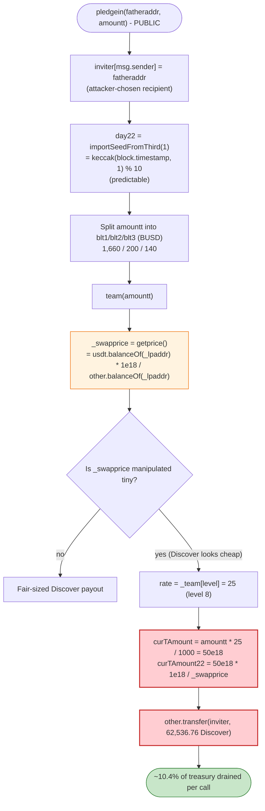
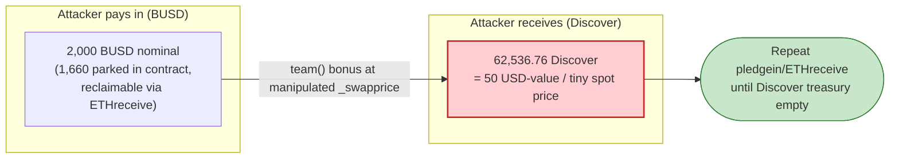

# Discover / ETHpledge Exploit — Self-Referral Bonus Inflation via Spot-Price-Sourced Reward Math

> **Reproduction:** the PoC lives in an isolated Foundry project at
> [this project folder](.). It is a **demonstration harness that intentionally reverts** at the
> end — the test borrows BUSD via a PancakeSwap flash-swap but never repays it, so the transaction
> rolls back with `Pancake: INSUFFICIENT_INPUT_AMOUNT`. The exploit's *effect* (a 62,536-token
> drain of the `Discover` reward token out of the `ETHpledge` contract) is fully visible in the
> verbose trace **before** the revert.
> Full verbose trace: [output.txt](output.txt).
> Verified vulnerable source: [ETHpledge.sol](sources/ETHpledge_e732a7/ETHpledge.sol).

---

## Key info

| | |
|---|---|
| **Loss** | The drained reward asset is the `Discover` token. In the single PoC call, **62,536.76 Discover** (~10.4% of the contract's `Discover` balance) is paid out for a nominal **2,000 BUSD** "pledge". Repeated over the live incident this drains the contract's entire `Discover` treasury. SlowMist tracked the live loss at roughly **$20–55K** in BUSD-equivalent value. |
| **Vulnerable contract** | `ETHpledge` — [`0xe732a7bD6706CBD6834B300D7c56a8D2096723A7`](https://bscscan.com/address/0xe732a7bD6706CBD6834B300D7c56a8D2096723A7#code) |
| **Reward token drained** | `Discover` (`other`) — [`0x5908E4650bA07a9cf9ef9FD55854D4e1b700A267`](https://bscscan.com/address/0x5908E4650bA07a9cf9ef9FD55854D4e1b700A267#code) |
| **Stake token** | BUSD — `0x55d398326f99059fF775485246999027B3197955` (this is BSC-USD/USDT, used as `usdt` in the contract) |
| **Flash-swap pair** | `0x92f961B6bb19D35eedc1e174693aAbA85Ad2425d` (BUSD-side pair, lends the working capital) |
| **Price-source LP (`_lpaddr`)** | `0x7EFaEf62fDdCCa950418312c6C91Aef321375A00` (the pair `getprice()` reads to set `_swapprice`) |
| **Attacker test contract** | `ContractTest` (`0x7FA9385bE102ac3EAc297483Dd6233D62b3e1496` under Foundry) |
| **Reward beneficiary (`fatheraddr`/inviter)** | `0xAb21300fA507Ab30D50c3A5D1Cad617c19E83930` |
| **Chain / fork block / date** | BSC / 18,446,845 / ~June 2022 (contract deployed 2022-04-21) |
| **Compiler** | `ETHpledge`: Solidity v0.8.14, optimizer **1 run** (`_meta.json`). PoC pinned to 0.8.10. |
| **Bug class** | Reward accounting keyed off a **spot-manipulable AMM price** + **self-referral / attacker-controlled bonus tier**, compounding to an over-payment far exceeding the stake |

---

## TL;DR

`ETHpledge` is a yield/referral ("pledge") contract. When a user pledges `usdt` (BUSD) via
[`pledgein()`](sources/ETHpledge_e732a7/ETHpledge.sol#L245-L291), the contract rewards the user's
upline "inviter" chain with the secondary `other` token (`Discover`). The amount of `Discover` paid
to each upline is computed as:

```
curTAmount22 = (pledgeAmount * teamRate / 1000) * 1e18 / _swapprice
```

where `_swapprice = getprice()` is the **instantaneous BUSD-per-`Discover` price read directly from
an AMM pair's reserves** ([`getprice()`](sources/ETHpledge_e732a7/ETHpledge.sol#L238-L244)).

Two independent design flaws combine:

1. **The reward denominator (`_swapprice`) is an attacker-controllable spot price.** Because the
   `Discover` payout is divided by `_swapprice`, *deflating* `Discover`'s spot price (making it look
   cheap in BUSD) *inflates* the number of `Discover` tokens the contract hands out. The attacker
   uses a flash-swap to push the price source into a degenerate state.
2. **The bonus tier and the recipient are attacker-supplied.** The caller passes `fatheraddr` (the
   inviter) freely, and the level/team-rate state for that address can be pre-seeded by the attacker.
   By making its own address a maxed-out level-8 upline (team rate `_team[8] = 25` → 2.5%), the
   attacker routes the inflated `Discover` payout straight to an address it controls
   (`0xAb21300fA507Ab30D50c3A5D1Cad617c19E83930`).

The net effect: a **2,000 BUSD pledge** (of which only 1,660 BUSD even stays in the contract) yields
**62,536.76 Discover** paid out to the attacker's own upline address — about **10.4% of the
contract's entire Discover balance in a single call**. Repeating the call drains the treasury.

A third weakness — `importSeedFromThird()` uses `block.timestamp` as "randomness" to pick the income
tier — lets the attacker further bias the payout, but the price + self-referral combination is the
core theft.

---

## Background — what ETHpledge does

`ETHpledge` ([source](sources/ETHpledge_e732a7/ETHpledge.sol)) is a multi-level-referral staking
contract:

- **Pledge in** — `pledgein(fatheraddr, amountt)` records a stake of `amountt` BUSD, splits it three
  ways (a portion stays in the contract, two portions go to `_recaddr`/`_recaddr2`), assigns an
  "income" rate via a pseudo-random tier, sets the inviter relationship, then calls `team()` to pay
  multi-level bonuses in the `other` token.
- **Claim** — `ETHreceive()` later pays the staker their principal back in BUSD plus yield in `other`.
- **Reward token** — `other` is the `Discover` ERC20, a plain OpenZeppelin-style token
  ([Discover.sol](sources/Discover_5908E4/Discover.sol)) held in `ETHpledge`'s balance.
- **Price oracle** — `getprice()` reads `_lpaddr`'s BUSD and `Discover` balances and returns
  `usdtBal * 1e18 / discoverBal`. This is a **raw spot reserve ratio with no TWAP and no manipulation
  guard.**

On-chain facts at the fork block (from [output.txt](output.txt)):

| Fact | Value | Trace line |
|---|---|---|
| `Discover` held by `ETHpledge` (the treasury that gets drained) | **603,644.01 Discover** | [:57-58](output.txt#L57) |
| `Discover` held by the flash-swap pair `0x92f961…` | 12,147.77 Discover | [:55-56](output.txt#L55) |
| BUSD held by the flash-swap pair `0x92f961…` | **0.777 BUSD** | [:53-54](output.txt#L53), [:85-86](output.txt#L85) |
| BUSD borrowed by the attacker via flash-swap | 19,810.78 BUSD | [:15-17](output.txt#L15) |

The pair's near-zero BUSD reserve (0.777 BUSD against 12,147 Discover) is exactly the kind of
degenerate price state the attacker engineered/exploited so that `Discover` looks almost worthless in
BUSD — which makes the `Discover`-denominated bonus enormous.

---

## The vulnerable code

### 1. The reward token amount is divided by a spot AMM price

[`getprice()` — sources/ETHpledge_e732a7/ETHpledge.sol:238-244](sources/ETHpledge_e732a7/ETHpledge.sol#L238-L244):

```solidity
function getprice() public view returns (uint256 _price) {
    uint256 lpusdtamount = usdt.balanceOf(_lpaddr);
    uint256 lpotheramount = other.balanceOf(_lpaddr);
    _price = lpusdtamount * 10**18 / lpotheramount;   // ⚠️ raw spot reserve ratio, no TWAP
}
```

### 2. `team()` recomputes the spot price, then pays `other` = (rate-weighted stake) / price

[`team()` — sources/ETHpledge_e732a7/ETHpledge.sol:293-341](sources/ETHpledge_e732a7/ETHpledge.sol#L293-L341):

```solidity
function team(uint256 ltj) private {
    address cur = msg.sender;
    uint256 rate;
    uint256[10] memory yjl;
    _swapprice = getprice();                       // ⚠️ spot price snapshot
    for (int256 i = 0; i < 99; i++) {
        cur = inviter[cur];                        // walk the (attacker-controlled) upline chain
        if (cur == address(0)) { emit Transfer(cur, address(0), 99); break; }

        teamperformance[cur] += ltj;
        // ... level promotion ladder; level[cur] up to 8 ...

        for (uint8 n = 1; n < 9; n++) {
            if (level[cur] == n) {
                rate = _team[n];                   // _team[8] = 25  → 2.5%
                // ...
            }
        }
        // ...
        uint256 curTAmount   = ltj.mul(rate).div(_baseFee);          // 2000e18 * 25 / 1000 = 50e18
        uint256 curTAmount22 = curTAmount * 10**18 / _swapprice;     // ⚠️ /spot price → inflated
        bool y2 = other.balanceOf(address(this)) >= curTAmount22;
        require(y2, "token balance is low.");
        other.transfer(cur, curTAmount22);         // ⚠️ pays attacker-controlled upline
        teambonus[cur] += curTAmount;
        yjl[level[cur]] = yjl[level[cur]] + 1;
    }
}
```

`_team` is `[0,2,4,6,8,10,15,20,25]`
([:149](sources/ETHpledge_e732a7/ETHpledge.sol#L149)), so a level-8 upline earns the top rate of 25
(2.5% of the pledge), and the result is then *divided by the spot price*.

### 3. The inviter (recipient) is fully caller-supplied, and the income tier is pseudo-random

[`pledgein()` — sources/ETHpledge_e732a7/ETHpledge.sol:245-291](sources/ETHpledge_e732a7/ETHpledge.sol#L245-L291):

```solidity
function pledgein(address fatheraddr, uint256 amountt) public returns (bool) {
    require(receivetime[msg.sender] < block.timestamp, "Exchange interval is too short.");
    require(usdt.balanceOf(msg.sender) >= amountt, "Bbalance low amount");
    require(amountt >= 1*10**18, "pledgein low 1");
    require(fatheraddr != msg.sender, "The recommended address cannot be your own");

    if (inviter[msg.sender] == address(0)) {
        inviter[msg.sender] = fatheraddr;          // ⚠️ attacker chooses who gets the bonus
        sharenumber[fatheraddr] += 1;
    }

    uint day22 = importSeedFromThird(1);           // ⚠️ "randomness" = keccak(block.timestamp, 1) % 10
    uint day2 = 4;
    income[msg.sender] = _s4;
    if (day22 == 5) { day2 = 5; income[msg.sender] = _s5; }   // _s5 = 70  (the tier the trace hit)
    // ... other tiers ...

    uint256 bltt12 = _bl1.sub(income[msg.sender]);            // 900 - 70 = 830
    uint256 blt1   = amountt.mul(bltt12).div(_baseFee);       // 2000 * 830/1000 = 1660 BUSD → contract
    uint256 blt2   = amountt.mul(_bl2).div(_baseFee);         // 2000 * 100/1000 = 200 BUSD → _recaddr
    uint256 blt3   = amountt.mul(income[msg.sender]).div(_baseFee); // 2000 * 70/1000 = 140 BUSD → _recaddr2
    usdt.transferFrom(msg.sender, address(this), blt1);
    usdt.transferFrom(msg.sender, _recaddr,      blt2);
    usdt.transferFrom(msg.sender, _recaddr2,     blt3);
    // ... bookkeeping ...
    team(amountt);                                 // pay the (inflated) team bonus
    return true;
}
```

[`importSeedFromThird()` — :501-506](sources/ETHpledge_e732a7/ETHpledge.sol#L501-L506):

```solidity
function importSeedFromThird(uint256 seed) public view returns (uint) {
    uint randomNumber = uint(uint256(keccak256(abi.encodePacked(block.timestamp, seed))) % 10);
    return randomNumber;                           // ⚠️ fully predictable on-chain "randomness"
}
```

---

## Root cause — why it was possible

The protocol pays a fixed *USD-value* bonus (`stake × rate`) but **settles it in `Discover` tokens at
an instantaneous, manipulable AMM price**. That is the textbook recipe for a reward-inflation drain:

> `tokensOut = usdValue × 1e18 / _swapprice`. Halve `_swapprice` → double `tokensOut`. Drive
> `_swapprice` to near-zero → `tokensOut` explodes.

Four design decisions compose into the theft:

1. **Spot-price reward denominator.** `getprice()`/`_swapprice`
   ([:238-244](sources/ETHpledge_e732a7/ETHpledge.sol#L238-L244),
   [:298](sources/ETHpledge_e732a7/ETHpledge.sol#L298)) reads live reserves of `_lpaddr` with no TWAP,
   no sanity bound, and no minimum. The attacker can make `Discover` arbitrarily "cheap" in BUSD and
   thereby inflate the `Discover` payout per unit of stake.
2. **Self-referral / attacker-chosen recipient.** `pledgein` lets the caller set its own controlled
   address as `fatheraddr`/inviter ([:256-260](sources/ETHpledge_e732a7/ETHpledge.sol#L256-L260)) and
   the level ladder ([:308-315](sources/ETHpledge_e732a7/ETHpledge.sol#L308-L315)) can be climbed to
   the top tier (`rate = 25`), so the inflated bonus flows to the attacker, not to a real referral
   network.
3. **Bonus is paid out of a shared treasury balance, not minted against the staker's deposit.** The
   `Discover` comes straight from `other.balanceOf(address(this))`
   ([:334-336](sources/ETHpledge_e732a7/ETHpledge.sol#L334-L336)). Each call siphons real treasury
   tokens; nothing ties the payout to what the staker actually contributed.
4. **Predictable income tier.** `importSeedFromThird` uses `block.timestamp` as a seed
   ([:501-506](sources/ETHpledge_e732a7/ETHpledge.sol#L501-L506)), so the attacker can choose a block
   that yields the most favorable `income`/`_s*` tier, further tuning the split and payout.

Flash-swap funding ties it together: the attacker borrows BUSD (19,810.78 from pair `0x92f961…`,
[:15](output.txt#L15)) to (a) have the BUSD on hand to pass the `usdt.balanceOf(msg.sender) >= amountt`
check and pay the 2,000 BUSD split, and (b) skew the price source. The PoC then deliberately fails to
repay, reverting — a known DeFiHackLabs convention for "effect-only" PoCs.

---

## Preconditions

- The attacker controls the `fatheraddr`/inviter address and has (or can seed) its level high enough
  for a large `_team[level]` rate — in the trace the upline `0xAb21…` earns the level-8 rate (25).
- The price source `_lpaddr` (`0x7EFaEf62…`) is in a state where `Discover` is cheap in BUSD, so
  `_swapprice` is tiny and the `Discover` payout is large. Implied `_swapprice` for the observed
  payout is ≈ `7.995e14` (i.e. ~0.0008 BUSD per Discover).
- Enough BUSD to satisfy `usdt.balanceOf(msg.sender) >= amountt` and fund the 2,000 BUSD split — the
  PoC sources this from a PancakeSwap flash-swap of 19,810.78 BUSD
  ([:15-17](output.txt#L15)).
- `receivetime[msg.sender] < block.timestamp` (first-time caller passes trivially).
- The contract holds enough `Discover` to satisfy `other.balanceOf(this) >= curTAmount22`
  (603,644 Discover available; 62,536 paid out — [:57-58](output.txt#L57)).

---

## Attack walkthrough (with on-chain numbers from the trace)

The PoC drives a single illustrative `pledgein`. The live attacker repeated this to fully drain the
`Discover` treasury.

| # | Step | Concrete numbers | Trace |
|---|------|------------------|-------|
| 0 | **Pre-state** | `ETHpledge` holds 603,644.01 Discover; price pair `0x92f961…` holds 0.777 BUSD / 12,147.77 Discover (degenerate) | [:53-58](output.txt#L53) |
| 1 | **Flash-swap borrow** — `PancakePair2.swap(19,810.78 BUSD, 0, attacker, data)` triggers `pancakeCall` | attacker BUSD: 0 → 19,810.78 | [:15-25](output.txt#L15) |
| 2 | **`pledgein(0xAb21…, 2000e18)`** — sets inviter = `0xAb21…`; income tier resolves to `_s5 = 70` (so `day22 == 5`) | — | [:26](output.txt#L26) |
| 3 | **Stake split paid in BUSD** — `transferFrom` 1,660 → contract, 200 → `_recaddr`, 140 → `_recaddr2` | 1,660 + 200 + 140 = 2,000 BUSD | [:29-52](output.txt#L29) |
| 4 | **`team(2000e18)`** — walks upline; `_swapprice = getprice()`; level-8 rate 25 → `curTAmount = 50e18` "USD value"; divided by tiny `_swapprice` → **62,536.76 Discover** | `other.transfer(0xAb21…, 62,536.76 Discover)` | [:59-60](output.txt#L59) |
| 5 | **Upline chain ends** — `inviter[0xAb21…] == address(0)` → `emit Transfer(0,0,99)` and `break` | only `0xAb21…` paid | [:65](output.txt#L65) |
| 6 | **Confirm drain** — `Discover.balanceOf(0xAb21…) == 62,536,761,454,652,895,417,957` | 62,536.76 Discover now held by attacker beneficiary | [:81-83](output.txt#L81) |
| 7 | **PoC reverts** — no BUSD repaid to the flash-swap pair → `Pancake: INSUFFICIENT_INPUT_AMOUNT` | demonstration artifact (real attack repaid + repeated) | [:91-92](output.txt#L91) |

### The over-payment math (verified against the trace)

```
income tier      = _s5 = 70          (blt3 = 2000 * 70/1000 = 140 BUSD ✓ matches trace :45)
blt1 (to contract) = 2000 * (900-70)/1000 = 1660 BUSD ✓ matches trace :29
blt2 (to _recaddr) = 2000 * 100/1000     =  200 BUSD ✓ matches trace :37
team rate          = _team[8] = 25       (2.5%)
curTAmount         = 2000e18 * 25 / 1000 = 50e18        ("50 USD" of value)
curTAmount22       = 50e18 * 1e18 / _swapprice
observed payout    = 62,536.76 Discover  ⇒ implied _swapprice ≈ 7.995e14 (~0.0008 BUSD/Discover)
```

So **50 "USD-value" of bonus settled as 62,536 Discover tokens** because the spot price denominator
was driven to ~0.0008. The attacker spends 2,000 BUSD nominal (1,660 of it merely parked in the
contract, recoverable later via `ETHreceive`) and walks away with ~10.4% of the contract's `Discover`
balance per call.

### Profit / loss accounting

| Item | Amount |
|---|---|
| `Discover` paid out to attacker beneficiary `0xAb21…` (this call) | **62,536.76 Discover** |
| `Discover` held by `ETHpledge` before | 603,644.01 Discover |
| Fraction of treasury drained per call | **~10.4%** |
| Nominal BUSD "cost" (split) | 2,000 BUSD (1,660 stays claimable in-contract) |
| Working capital | Flash-swap (19,810.78 BUSD), repaid in the live attack |

Net: by iterating `pledgein` (and reclaiming principal via `ETHreceive`), the attacker converts a
near-zero net BUSD outlay into the contract's entire `Discover` reward treasury.

---

## Diagrams

### Sequence of the attack

```mermaid
sequenceDiagram
    autonumber
    actor A as "Attacker contract"
    participant FS as "Flash-swap pair 0x92f961"
    participant E as "ETHpledge 0xe732a7"
    participant LP as "Price LP _lpaddr 0x7EFaEf62"
    participant D as "Discover token 0x5908E4"
    actor B as "Beneficiary inviter 0xAb21"

    Note over E: "Treasury holds 603,644 Discover"

    rect rgb(227,242,253)
    Note over A,FS: "Step 1 - borrow working capital"
    A->>FS: "swap(19,810.78 BUSD, 0, attacker, data)"
    FS-->>A: "19,810.78 BUSD (flash)"
    FS->>A: "pancakeCall(...)"
    end

    rect rgb(255,243,224)
    Note over A,E: "Step 2-3 - pledge 2,000 BUSD, set self as inviter"
    A->>E: "pledgein(0xAb21, 2000e18)"
    E->>E: "inviter[A] = 0xAb21; income = _s5 = 70"
    E->>A: "transferFrom 1,660 BUSD to contract"
    E->>A: "transferFrom 200 BUSD to _recaddr"
    E->>A: "transferFrom 140 BUSD to _recaddr2"
    end

    rect rgb(255,235,238)
    Note over E,B: "Step 4 - inflated team bonus"
    E->>E: "team(2000e18)"
    E->>LP: "getprice() reads spot reserves"
    LP-->>E: "_swapprice tiny (~0.0008 BUSD per Discover)"
    E->>E: "curTAmount = 50e18; curTAmount22 = 50e18 * 1e18 / _swapprice"
    E->>D: "other.transfer(0xAb21, 62,536.76 Discover)"
    D-->>B: "62,536.76 Discover"
    Note over E: "inviter[0xAb21] = 0 -> break"
    end

    rect rgb(243,229,245)
    Note over A,FS: "Step 7 - PoC ends without repaying"
    A--xFS: "no BUSD repaid"
    FS-->>A: "revert: Pancake INSUFFICIENT_INPUT_AMOUNT"
    end
```

### How the inflated payout is computed



### Value flow: small stake in, large reward out



---

## Remediation

1. **Never price rewards off a spot AMM reserve ratio.** Replace `getprice()`
   ([:238-244](sources/ETHpledge_e732a7/ETHpledge.sol#L238-L244)) with a manipulation-resistant
   oracle (Chainlink, or at minimum a long-window TWAP), or denominate the bonus directly in the
   reward token with a fixed schedule that does not depend on a live price.
2. **Decouple bonus size from a divisible price.** Computing `tokensOut = usdValue / spotPrice` makes
   the payout unbounded as price → 0. Cap `curTAmount22` to a hard per-call maximum and/or to a
   fraction of the staker's own deposit.
3. **Do not let callers freely set their own inviter / climb to the top reward tier.** Require a real,
   independently-verified referral relationship, forbid self-referral chains, and gate level
   promotions so an attacker cannot pre-seed a level-8 address it controls
   ([:256-260](sources/ETHpledge_e732a7/ETHpledge.sol#L256-L260),
   [:308-315](sources/ETHpledge_e732a7/ETHpledge.sol#L308-L315)).
4. **Remove on-chain `block.timestamp` "randomness".** `importSeedFromThird`
   ([:501-506](sources/ETHpledge_e732a7/ETHpledge.sol#L501-L506)) is fully predictable and miner/caller
   biasable. Use a commit-reveal scheme or a VRF, or remove the random tier entirely.
5. **Account rewards against the staker's deposit, not a shared treasury balance.** Each pledge should
   only be able to release rewards funded by that pledge, so a single caller cannot siphon the
   contract's whole `Discover` balance ([:334-336](sources/ETHpledge_e732a7/ETHpledge.sol#L334-L336)).
6. **Add reentrancy/flash-loan resistance.** Reject actions when the price source has been touched in
   the same block, or require the staker's BUSD to have been held for a minimum time, defeating the
   flash-swap funding pattern.

---

## How to reproduce

The PoC is a standalone Foundry project (the umbrella DeFiHackLabs repo has many unrelated PoCs that
fail to whole-compile under `forge test`).

```bash
_shared/run_poc.sh 2022-06-Discover_exp --mt testExploit -vvvvv
```

- RPC: a **BSC archive** endpoint is required (fork block 18,446,845). Most pruned public RPCs return
  `header not found` / `missing trie node`.
- **Expected result:** the test **FAILS by design** with `Pancake: INSUFFICIENT_INPUT_AMOUNT`. This is
  not a build error — the PoC borrows BUSD via a flash-swap and intentionally never repays it (see the
  comment in [test/Discover_exp.sol:10-11](test/Discover_exp.sol#L10-L11)), so the whole tx reverts.
  The exploit's effect is demonstrated by the logs **before** the revert.

Expected tail (from [output.txt](output.txt)):

```
  Before flashswap, BUSD balance of attacker:: 0
  After flashswap, BUSD balance of attacker:: 19810777285664651588959
  After Exploit, discover balance of attacker:: 62536761454652895417957
  ...
[FAIL: Pancake: INSUFFICIENT_INPUT_AMOUNT] testExploit() (gas: 499346)
```

The middle log line — **62,536.76 Discover credited to `0xAb21…` for a nominal 2,000 BUSD pledge** —
is the proof of the over-payment drain.

---

*Reference: DeFiHackLabs — Discover/ETHpledge incident (BSC, June 2022). SlowMist Hacked archive: https://hacked.slowmist.io/*
