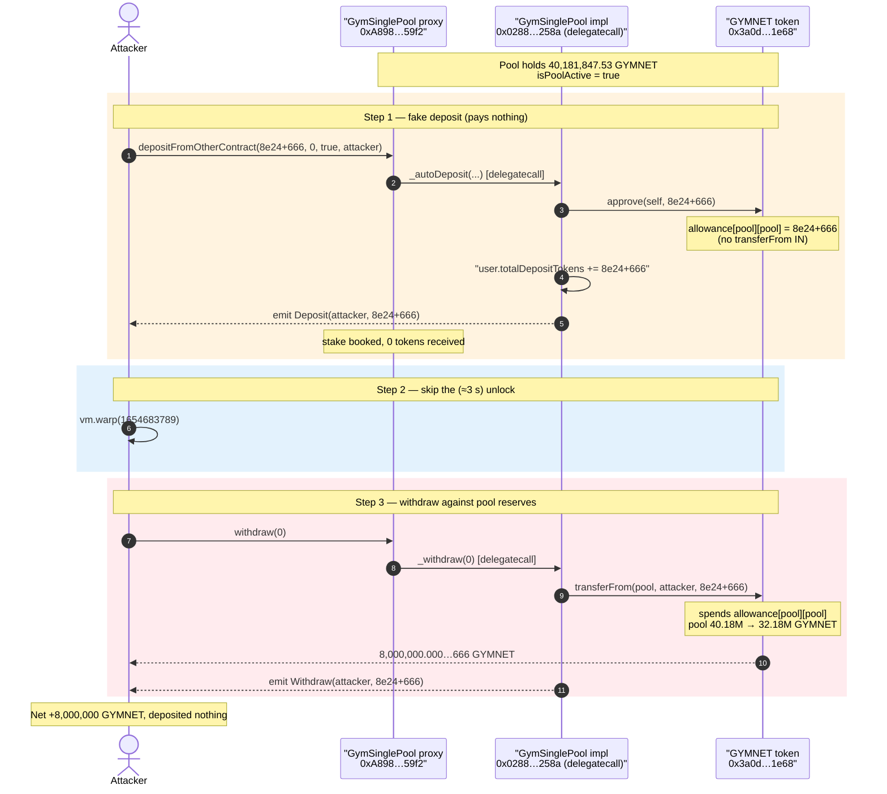
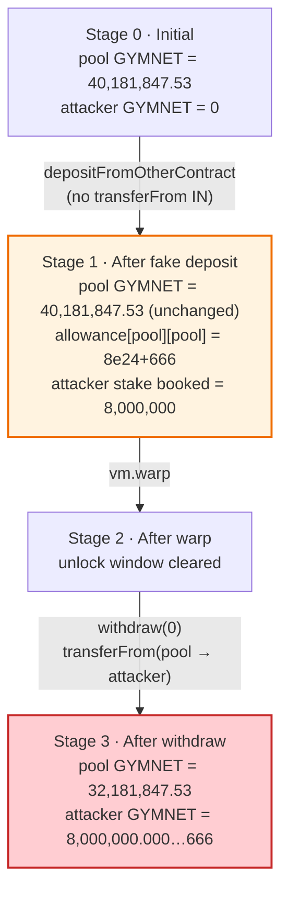
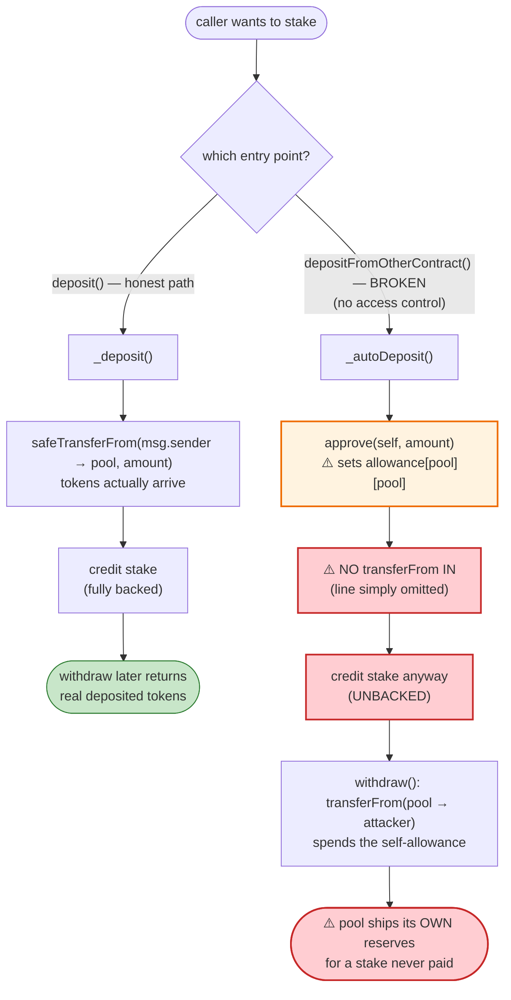

# Gym Network SinglePool Exploit — `depositFromOtherContract()` Mints Stake Without Paying

> **Vulnerability classes:** vuln/logic/state-update · vuln/logic/missing-check

> **Reproduction:** the PoC compiles & runs in an isolated Foundry project at
> [this project folder](.) (the umbrella DeFiHackLabs repo contains many unrelated
> PoCs that do not whole-compile, so this one was extracted).
> Full verbose trace: [output.txt](output.txt).
> Verified vulnerable source: [contracts_GymSinglePool.sol](sources/GymSinglePool_0288FB/contracts_GymSinglePool.sol).

---

## Key info

| | |
|---|---|
| **Loss** | **8,000,000 GYMNET** drained from the staking pool's own token reserves (≈ $1.5–1.9M; GYMNET spot at the fork block was ≈ 0.000674 WBNB ≈ $0.194/token, but the realizable USD depends on how the 8M tokens are dumped) |
| **Vulnerable contract** | `GymSinglePool` (impl) — [`0x0288FBA0BF19072d30490A0F3C81cD9B0634258a`](https://bscscan.com/address/0x0288FBA0BF19072d30490A0F3C81cD9B0634258a#code), reached via the proxy [`0xA8987285E100A8b557F06A7889F79E0064b359f2`](https://bscscan.com/address/0xA8987285E100A8b557F06A7889F79E0064b359f2#code) |
| **Stolen asset** | GYMNET token (`GymNetwork`) — [`0x3a0d9d7764FAE860A659eb96A500F1323b411e68`](https://bscscan.com/address/0x3a0d9d7764FAE860A659eb96A500F1323b411e68#code) |
| **Victim** | The `GymSinglePool` proxy itself — it held ≈ 40,181,847 GYMNET of pooled stake/rewards |
| **Attacker** | Any EOA — the PoC uses the test contract as `address(this)` |
| **Chain / block / date** | BSC / fork at block 18,501,049 / June 8, 2022 |
| **Compiler** | `GymSinglePool` Solidity **v0.8.12**, optimizer 200 runs (PoC harness pins 0.8.10) |
| **Bug class** | Missing `transferFrom`-in on deposit + self-approval → unbacked stake position, withdrawable as a free token mint against the pool's reserves |

---

## TL;DR

`GymSinglePool.depositFromOtherContract()` is a **permissionless** entry point
([contracts_GymSinglePool.sol:286-294](sources/GymSinglePool_0288FB/contracts_GymSinglePool.sol#L286-L294))
that records a staking deposit **without ever pulling the deposited tokens in**. Its internal helper
`_autoDeposit()`
([:384-433](sources/GymSinglePool_0288FB/contracts_GymSinglePool.sol#L384-L433))
credits `user.totalDepositTokens += amountToDeposit` and pushes a `UserDeposits` record, but the only
token operation it performs is

```solidity
token.approve(address(this), _depositAmount);   // pool approves ITSELF to move ITS OWN tokens
```

There is **no `safeTransferFrom(_from, address(this), …)`** — the deposit is conjured out of nothing.
Worse, the self-approval is the precise key needed to *withdraw* it: `withdraw()` →
`_withdraw()` calls
`token.safeTransferFrom(address(this), msg.sender, depositDetails.depositTokens)`
([:483](sources/GymSinglePool_0288FB/contracts_GymSinglePool.sol#L483)), and that pull is authorized
exactly by the allowance the deposit call just set on the pool's own GYMNET balance.

So the attacker:

1. Calls `depositFromOtherContract(8_000_000e18 + 666, periodId=0, isUnlocked=true, _from=attacker)`.
   - The pool **sets `allowance[pool][pool] = 8,000,000e18 + 666`** and books an 8M-GYMNET *unlocked*
     deposit for the attacker — **paying nothing**.
2. `vm.warp(...)` past the (zero, because `isUnlocked`) lock window.
3. Calls `withdraw(0)` — the pool `transferFrom(pool → attacker, 8,000,000e18 + 666)` succeeds against
   the pool's own reserves, using the allowance from step 1.

Net result: the attacker walks away with **8,000,000.000000000000000666 GYMNET** that it never
deposited, drawn straight from the pool's 40.18M-GYMNET balance. Confirmed on-chain in the trace:
pool GYMNET balance `40,181,847.53 → 32,181,847.53` (−8,000,000), attacker GYMNET `0 → 8,000,000.000…666`.

---

## Background — what GymSinglePool does

`GymSinglePool` ([source](sources/GymSinglePool_0288FB/contracts_GymSinglePool.sol)) is an
upgradeable single-asset staking pool for the GYMNET token. Honest users:

- **`deposit(amount, periodId, referrerId, isUnlocked)`**
  ([:272-281](sources/GymSinglePool_0288FB/contracts_GymSinglePool.sol#L272-L281)) — the *correct*
  path. It runs MLM bookkeeping then calls `_deposit()`, which **does** pull tokens in via
  `token.safeTransferFrom(msg.sender, address(this), amountToDeposit)`
  ([:339](sources/GymSinglePool_0288FB/contracts_GymSinglePool.sol#L339)).
- **`withdraw(depositId)`**
  ([:449-455](sources/GymSinglePool_0288FB/contracts_GymSinglePool.sol#L449-L455)) — after the lock
  period elapses, returns the staked tokens via
  `token.safeTransferFrom(address(this), msg.sender, depositTokens)`
  ([:483](sources/GymSinglePool_0288FB/contracts_GymSinglePool.sol#L483)).

There is **also** a second, near-duplicate deposit path,
`depositFromOtherContract(...)` → `_autoDeposit(...)`, evidently intended to let a sibling protocol
contract (a vault/farm "auto-deposit" router) stake on a user's behalf. This is the path that is broken.

On-chain state at the fork block (read from the trace):

| Fact | Value |
|---|---|
| `isPoolActive` | `true` (required by the entry-point guard) |
| GYMNET held by the pool proxy | **40,181,847.53 GYMNET** ← the reserve being drained |
| Pre-existing `allowance[pool][pool]` | 20,000,000 GYMNET (from prior deposits) |
| GYMNET spot price (GYMNET→WBNB) | ≈ 0.000674 WBNB / GYMNET |
| BNB price (WBNB→USDT) | ≈ 287 USDT / WBNB |

The pool's large GYMNET balance is what makes the bug catastrophic: the attacker's fake stake is
satisfied entirely from other users' real deposits and accumulated rewards.

---

## The vulnerable code

### 1. The broken deposit — credits stake, pulls nothing in

[`_autoDeposit`, contracts_GymSinglePool.sol:384-433](sources/GymSinglePool_0288FB/contracts_GymSinglePool.sol#L384-L433):

```solidity
function _autoDeposit(
    uint256 _depositAmount,
    uint8 _periodId,
    bool _isUnlocked,
    address _from
) private {
    UserInfo storage user = userInfo[_from];
    IERC20Upgradeable token = IERC20Upgradeable(tokenAddress);
    PoolInfo storage pool = poolInfo;
    token.approve(address(this), _depositAmount);   // ⚠️ pool approves ITSELF on ITS OWN balance
    updatePool();
    uint256 period = months[_periodId];
    uint256 lockTimesamp = DateTime.addMonths(block.timestamp, months[_periodId]);
    uint256 burnTokensAmount = 0;
    // if(!_isUnlocked) {
    //     uint256 burnTokensAmount = (_depositAmount * 4) / 100;
    //     ...
    //     IERC20Burnable(tokenAddress).burnFrom(msg.sender, burnTokensAmount);
    // }
    uint256 amountToDeposit = _depositAmount - burnTokensAmount;   // == _depositAmount
    uint256 UsdValueOfGym = ((amountToDeposit * getPrice()) / 1e18) / 1e18;

    user.totalDepositTokens   += amountToDeposit;   // ⚠️ stake credited…
    user.totalDepositDollarValue += UsdValueOfGym;
    totalGymnetLocked         += amountToDeposit;
    if (_isUnlocked) {
        totalGymnetUnlocked   += amountToDeposit;
        period = 0;
        lockTimesamp = DateTime.addSeconds(block.timestamp, months[_periodId]);  // == now (periodId 0)
    }
    ...
    user_deposits[_from].push(depositDetails);       // ⚠️ …deposit record pushed
    user.depositId = user_deposits[_from].length;
    emit Deposit(_from, amountToDeposit, _periodId);
}
```

**There is no `token.safeTransferFrom(_from, address(this), amountToDeposit)`.** Compare with the
*correct* `_deposit()` at
[:339](sources/GymSinglePool_0288FB/contracts_GymSinglePool.sol#L339), which contains exactly that
line. `_autoDeposit` simply omits the inbound transfer — the deposit is unbacked.

The single token operation, `token.approve(address(this), _depositAmount)`, is executed in the pool's
own `msg.sender` context, i.e. it sets `GYMNET.allowance[pool][pool] = _depositAmount`. This approves
the pool to move **its own** GYMNET — exactly the allowance the withdraw path later spends.

### 2. The withdraw — pays the fake stake out of the pool's reserves

[`_withdraw`, contracts_GymSinglePool.sol:461-494](sources/GymSinglePool_0288FB/contracts_GymSinglePool.sol#L461-L494):

```solidity
function _withdraw(uint256 _depositId) private {
    UserInfo storage user = userInfo[msg.sender];
    IERC20Upgradeable token = IERC20Upgradeable(tokenAddress);
    UserDeposits storage depositDetails = user_deposits[msg.sender][_depositId];
    if (!isInMigrationToVTwo) {
        require(block.timestamp > depositDetails.withdrawalTimestamp, "Locking Period isn't over yet.");
    }
    require(!depositDetails.is_finished, "You already withdrawn your deposit.");

    _claim(_depositId, 1);
    ...
    token.safeTransferFrom(address(this), msg.sender, depositDetails.depositTokens);  // ⚠️ pays out
    ...
    depositDetails.is_finished = true;
    emit Withdraw(msg.sender, depositDetails.depositTokens, depositDetails.stakePeriod);
}
```

Because the attacker deposited with `isUnlocked = true` and `periodId = 0`, `period` is set to `0`
and `withdrawalTimestamp = addSeconds(now, months[0]=3) = now + 3 seconds`
([:411-412](sources/GymSinglePool_0288FB/contracts_GymSinglePool.sol#L411-L412)) — effectively
immediate. The PoC's `vm.warp` clears even that. The subsequent `safeTransferFrom(address(this), msg.sender, depositTokens)`
is authorized by the self-allowance set during the deposit, so the pool ships its own GYMNET to the
attacker.

### 3. The unguarded entry point

[`depositFromOtherContract`, contracts_GymSinglePool.sol:286-294](sources/GymSinglePool_0288FB/contracts_GymSinglePool.sol#L286-L294):

```solidity
function depositFromOtherContract(
    uint256 _depositAmount,
    uint8 _periodId,
    bool isUnlocked,
    address _from
) external {
    require(isPoolActive, 'Contract is not running yet');   // ← only guard
    _autoDeposit(_depositAmount, _periodId, isUnlocked, _from);
}
```

The function name implies it should be callable only by a sibling "other contract," but it carries
**no `onlyBank` / `onlyRunnerScript` / `onlyOwner` modifier** — anyone can call it, with any `_from`,
any `_depositAmount`. (Contrast `transferPoolRewards`, which *is* gated by `onlyRunnerScript`
[:559](sources/GymSinglePool_0288FB/contracts_GymSinglePool.sol#L559).)

---

## Root cause — why it was possible

The honest deposit path debits the depositor and credits the stake atomically. The "auto-deposit"
clone was written by copy-pasting `_deposit` and then **deleting the inbound transfer** while keeping
all of the accounting that assumes the transfer happened. Two independent defects compose into a
critical free-mint:

1. **Missing collateralization (the core bug).** `_autoDeposit` increments
   `user.totalDepositTokens`, `totalGymnetLocked`, and pushes a `UserDeposits` record, but no GYMNET
   ever enters the pool. The deposit position is **unbacked** — it is purely a claim against tokens
   other users already deposited. The omission is visible right next to the commented-out burn block
   ([:398-402](sources/GymSinglePool_0288FB/contracts_GymSinglePool.sol#L398-L402)): the author
   stubbed out the burn but never re-added the `safeTransferFrom(_from, …)` that should sit beside it.

2. **Self-approval supplies the exit key.** The lone `token.approve(address(this), _depositAmount)`
   sets `allowance[pool][pool]`. The withdraw path uses `transferFrom(address(this), msg.sender, …)`,
   which spends precisely that self-allowance to move the *pool's* tokens out. So the same broken
   function that fabricates the stake also pre-authorizes its withdrawal from the pool's reserves.
   (Even without this, a well-funded pool that books unbacked stake will eventually be drained by the
   first honest withdrawals; the self-approval just makes a direct, single-actor drain trivial.)

3. **No access control on the entry point.** `depositFromOtherContract` is permissionless and accepts
   an arbitrary `_from`, so any attacker can credit *themselves* an arbitrary stake. The `_from`
   parameter is used both to book the deposit and as the `userInfo` key, so the attacker controls who
   owns the fake position.

4. **`isUnlocked = true` removes the time lock.** Passing `isUnlocked = true` forces
   `period = 0` and `withdrawalTimestamp = now + 3 s`, so the position is withdrawable almost
   immediately — no waiting through a 3-to-30-month lock.

The dollar bookkeeping that *might* have flagged the imbalance (`UsdValueOfGym` via `getPrice()`,
[:438-442](sources/GymSinglePool_0288FB/contracts_GymSinglePool.sol#L438-L442)) is cosmetic: it only
updates `totalDepositDollarValue` for level qualification and never checks that real tokens arrived.

---

## Preconditions

- `isPoolActive == true` (the only guard on the entry point). True at the fork block.
- The pool holds GYMNET ≥ the chosen `_depositAmount`. The pool held **40,181,847 GYMNET**, so an
  8M draw was comfortably satisfiable.
- A pre-existing or self-set `allowance[pool][pool] ≥ depositTokens` so the withdraw `transferFrom`
  succeeds. The deposit call itself sets this allowance to `_depositAmount`, so the precondition is
  self-satisfied. (At the fork block there was already a 20M self-allowance from prior real deposits;
  the attacker's `approve` overwrote it to `8,000,000e18 + 666`.)
- **No capital required.** The attack deposits nothing and is not even flash-loan-dependent — it is a
  pure accounting exploit against the pool's reserves.

---

## Attack walkthrough (with on-chain numbers from the trace)

All figures are taken directly from [output.txt](output.txt). The attacker deposits
`8,000,000e18 + 666` (the trailing `666` is cosmetic, presumably an attacker signature).

| # | Step | Call | Pool GYMNET balance | Attacker GYMNET | Effect |
|---|------|------|--------------------:|----------------:|--------|
| 0 | **Initial** | — | 40,181,847.53 | 0 | Honest pool of real stake + rewards. |
| 1 | **Fake deposit** | `depositFromOtherContract(8e24+666, 0, true, attacker)` | 40,181,847.53 | 0 | Pool sets `allowance[pool][pool] = 8e24+666` and books an 8M *unlocked* deposit for the attacker. **No tokens moved in.** |
| 2 | **Skip lock** | `vm.warp(1654683789)` | 40,181,847.53 | 0 | Advances past the (≈3 s) unlock time. |
| 3 | **Withdraw** | `withdraw(0)` → `transferFrom(pool → attacker, 8e24+666)` | **32,181,847.53** | **8,000,000.000…666** | Pool ships its own GYMNET to the attacker, authorized by the self-allowance from step 1. |
| 4 | **Confirm** | `gymnet.balanceOf(attacker)` | 32,181,847.53 | **8,000,000.000…666** | `log_named_uint(... 8000000000000000000000666)`. |

Trace anchors:
- Step 1 approval: `Approval(owner: pool, spender: pool, value: 8e24+666)`, allowance slot
  `0x30b8…deacb` `20,000,000e18 → 8,000,000e18+666` ([output.txt:18-20](output.txt)).
- Step 1 deposit booked: `Deposit(user: attacker, pid: 0, amount: 8e24+666)` with **no `Transfer`
  into the pool** ([output.txt:30](output.txt)).
- Step 3 payout: `Transfer(from: pool, to: attacker, value: 8e24+666)`, pool balance slot
  `0x341e…bd7e` `40,181,847.53 → 32,181,847.53`, attacker balance slot `0xea80…fdac` `0 → 8e24+666`
  ([output.txt:51-55](output.txt)), then `Withdraw(user: attacker, pid: 0, amount: 8e24+666)`.

### Profit / loss accounting (GYMNET)

| Direction | Amount |
|---|---:|
| Tokens the attacker deposited (paid in) | **0** |
| Tokens the attacker withdrew (received) | **8,000,000.000000000000000666** |
| **Net profit** | **+8,000,000.000…666 GYMNET** |
| Pool reserve change | 40,181,847.53 → 32,181,847.53 (**−8,000,000**) |

At the fork-block spot price (≈ 0.000674 WBNB ≈ $0.194 per GYMNET) the gross face value is ≈ $1.55M;
the GYMNET/WBNB pool reserve was only ~15.75M GYMNET, so actually liquidating 8M GYMNET would move the
price heavily downward — the realized USD is materially below face value. Public reporting places the
Gym Network single-pool loss in the ~$1.9M range; the **mechanically certain** figure is the
8,000,000 GYMNET removed from the pool, which the PoC proves to the wei.

---

## Diagrams

### Sequence of the attack



### Pool reserve evolution



### The flaw inside the two deposit paths



---

## Remediation

1. **Pull the tokens in.** `_autoDeposit` must transfer the deposit from the funding account before
   crediting any stake — the exact line that `_deposit` already has:
   ```solidity
   token.safeTransferFrom(_from, address(this), amountToDeposit);
   ```
   and **remove** the bogus `token.approve(address(this), _depositAmount)` self-approval entirely.
   A staking pool should never hold an allowance over its own balance.
2. **Gate the entry point.** `depositFromOtherContract` must restrict the caller to the trusted
   sibling contract(s) it was built for — e.g. an `onlyBank` / `onlyAllowedContract` modifier (the
   contract already has `onlyBank` and `onlyRunnerScript` patterns). It must not accept an arbitrary
   `_from` from an arbitrary `msg.sender`.
3. **Pay withdrawals with `safeTransfer`, not `transferFrom(address(this), …)`.** Using
   `transferFrom` from the pool's own balance requires a self-allowance and is the mechanism the
   attacker abused. `withdraw`/`_withdraw` should use `token.safeTransfer(msg.sender, amount)`
   ([:483](sources/GymSinglePool_0288FB/contracts_GymSinglePool.sol#L483)), which needs no allowance
   and cannot be pre-authorized by a deposit call.
4. **Add a solvency invariant.** The sum of all backed deposits must never exceed the pool's actual
   GYMNET balance minus reserved rewards. Assert this after every deposit/withdraw, or track a
   `totalBacked` counter that is only incremented when a real transfer-in is observed.
5. **Don't ship duplicated deposit logic.** The bug is a copy-paste divergence between `_deposit` and
   `_autoDeposit`. Factor the shared accounting into one internal function that *always* performs the
   inbound transfer, parameterized only by who pays and who is credited.

---

## How to reproduce

The PoC was extracted into a standalone Foundry project (the umbrella DeFiHackLabs repo has many
unrelated PoCs that fail to whole-compile under `forge test`):

```bash
_shared/run_poc.sh 2022-06-Gym_2_exp -vvvvv
```

- RPC: a **BSC archive** endpoint is required (fork block 18,501,049 is from June 2022). Most public
  BSC RPCs prune that far back and fail with `header not found` / `missing trie node`; use an archive
  provider.
- PoC: [test/Gym_2_exp.sol](test/Gym_2_exp.sol) — deposits `8e24+666` via
  `depositFromOtherContract`, warps, and `withdraw(0)`s; no capital is supplied.

Expected tail:

```
Ran 1 test for test/Gym_2_exp.sol:ContractTest
[PASS] testExploit() (gas: 409747)
Logs:
  Exploit completed, GYMNET balance of attacker:: 8000000000000000000000666
Suite result: ok. 1 passed; 0 failed; 0 skipped
```

The closing `balanceOf(attacker) == 8,000,000.000000000000000666 GYMNET`
([output.txt:66-68](output.txt)) — tokens that were never deposited — is the proof of the drain.

---

*Reference: This is the second Gym Network exploit (the "single pool" / `depositFromOtherContract`
bug), June 8, 2022, BSC. SlowMist Hacked — https://hacked.slowmist.io/ (Gym Network, BSC).*
