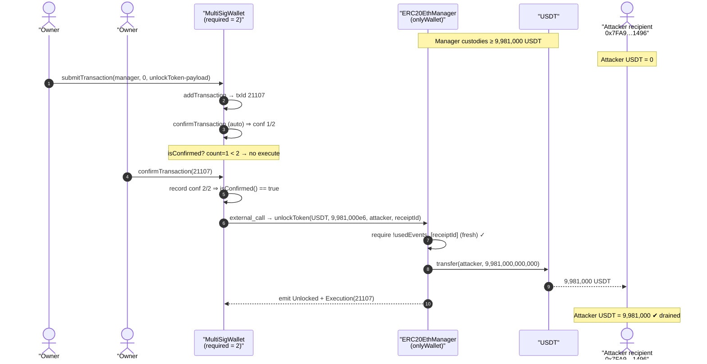
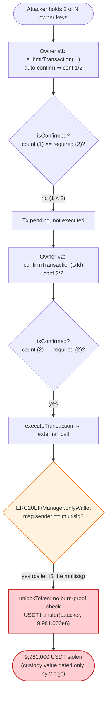
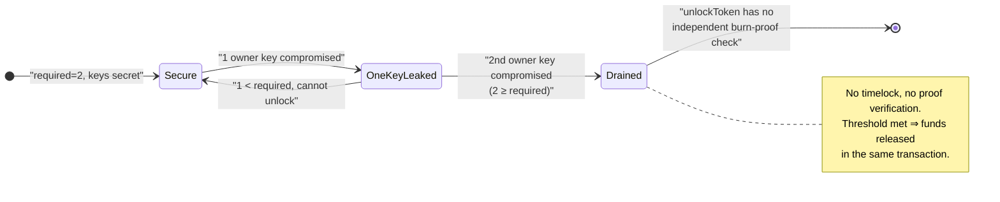

# Harmony Horizon Bridge Exploit — Compromised 2-of-5 Multisig Drains the Ethereum-Side Manager

> **Vulnerability classes:** vuln/access-control/secret-exposure · vuln/access-control/centralization

> **Reproduction:** the PoC compiles & runs in an isolated Foundry project at
> [this project folder](.) (the umbrella DeFiHackLabs repo contains several
> unrelated PoCs that fail the whole-project build, so this one was extracted).
> Full verbose trace: [output.txt](output.txt).
> Verified vulnerable sources: [MultiSigWallet.sol](sources/MultiSigWallet_715CdD/MultiSigWallet.sol)
> and [ERC20EthManager.sol](sources/ERC20EthManager_2dCCDB/ERC20EthManager.sol).

---

## Key info

| | |
|---|---|
| **Loss** | Total bridge drain ≈ **$100M** across many tokens/txs; this PoC reproduces a single USDT leg of **9,981,000 USDT** (`9,981,000,000,000` raw, 6-decimals) |
| **Vulnerable contract** | `ERC20EthManager` (Ethereum-side bridge manager) — [`0x2dCCDB493827E15a5dC8f8b72147E6c4A5620857`](https://etherscan.io/address/0x2dCCDB493827E15a5dC8f8b72147E6c4A5620857#code) |
| **Authorizing contract** | `MultiSigWallet` (2-of-5 owners) — [`0x715CdDa5e9Ad30A0cEd14940F9997EE611496De6`](https://etherscan.io/address/0x715CdDa5e9Ad30A0cEd14940F9997EE611496De6#code) |
| **Victim / drained asset** | USDT `0xdAC17F958D2ee523a2206206994597C13D831ec7` held by the manager |
| **Compromised owner #1 (submitter)** | `0xf845A7ee8477AD1FB4446651E548901a2635A915` |
| **Compromised owner #2 (confirmer)** | `0x812d8622C6F3c45959439e7ede3C580dA06f8f25` |
| **Recipient of stolen USDT** | `0x7FA9385bE102ac3EAc297483Dd6233D62b3e1496` (`address(this)` in the PoC; the live attacker EOA on the real tx) |
| **Reference attack tx (this USDT leg)** | [`0x27981c7289c372e601c9475e5b5466310be18ed10b59d1ac840145f6e7804c97`](https://etherscan.io/tx/0x27981c7289c372e601c9475e5b5466310be18ed10b59d1ac840145f6e7804c97) |
| **Chain / fork block / date** | Ethereum mainnet / 15,012,645 / June 23–24, 2022 |
| **Compiler** | Both contracts `v0.5.17+commit.d19bba13`, optimizer **1 / 200 runs** |
| **Bug class** | Private-key / signer compromise of a low-threshold multisig — **not a code logic flaw**; an operational / key-management failure compounded by a too-low `required` threshold |

---

## TL;DR

The Harmony Horizon Bridge guarded its Ethereum-side custody (`ERC20EthManager`) with a
`MultiSigWallet` configured to require only **2 confirmations** out of its owner set
(2-of-5). The bridge's "unlock" path is fully privileged: `ERC20EthManager.unlockToken(...)`
([ERC20EthManager.sol:487-501](sources/ERC20EthManager_2dCCDB/ERC20EthManager.sol#L487-L501))
is `onlyWallet`, meaning the *only* gate protecting hundreds of millions of dollars of
locked tokens is the multisig's signature threshold.

The attacker obtained the private keys of **two** of the multisig owners. With two keys in
hand, the threshold is met, and the attack is purely a matter of using the contract exactly
as designed:

1. **Signer #1** calls `submitTransaction(...)` proposing a call to
   `ERC20EthManager.unlockToken(USDT, 9,981,000 USDT, attacker, receiptId)`. `submitTransaction`
   auto-confirms on behalf of the submitter — that is **confirmation 1 of 2**.
2. **Signer #2** calls `confirmTransaction(txId)`. That is **confirmation 2 of 2**, so
   `isConfirmed()` returns true and the multisig immediately executes the proposed call.
3. The multisig (`msg.sender == wallet`) passes the `onlyWallet` check, `unlockToken` runs,
   and **9,981,000 USDT is transferred straight to the attacker**.

The PoC's `before/after` USDT balances prove the theft mechanically:
attacker USDT goes from `0` → `9,981,000,000,000` (9,981,000 USDT) in one execution
([output.txt:6-10, 67-69](output.txt)).

The root cause is the **compromise of multiple signer keys combined with a 2-signature
threshold that is far too low for ~$100M of custody**. There is no on-chain validation that
the burn event being "unlocked" actually happened on Harmony — the contract trusts the
multisig completely, so once the threshold is met the funds are gone.

---

## Background — what the Harmony Horizon Bridge does

The Harmony Horizon Bridge is a lock-and-mint bridge between Ethereum and the Harmony chain:

- **Lock side (Ethereum):** `ERC20EthManager.lockToken(...)`
  ([ERC20EthManager.sol:436-452](sources/ERC20EthManager_2dCCDB/ERC20EthManager.sol#L436-L452))
  pulls a user's ERC20 into custody and emits a `Locked` event. Off-chain relayers observe
  this and mint a wrapped representation on Harmony.
- **Unlock side (Ethereum):** when a user burns the wrapped token on Harmony, relayers are
  supposed to authorize an unlock on Ethereum. The unlock is performed by
  `ERC20EthManager.unlockToken(...)`
  ([ERC20EthManager.sol:487-501](sources/ERC20EthManager_2dCCDB/ERC20EthManager.sol#L487-L501)),
  which releases the custodied ERC20 back to a recipient.

Crucially, `unlockToken` is protected only by the `onlyWallet` modifier
([ERC20EthManager.sol:417-420](sources/ERC20EthManager_2dCCDB/ERC20EthManager.sol#L417-L420)):

```solidity
address public wallet;
modifier onlyWallet {
    require(msg.sender == wallet, "HmyManager/not-authorized");
    _;
}
```

`wallet` is the `MultiSigWallet`. So the entire security of the unlock path collapses to one
question: **can someone get the multisig to emit a call to `unlockToken`?** The multisig will
do exactly that the moment `required` confirmations are gathered. At the fork block,
`required` was **2** (read live in the trace, [output.txt:22-24](output.txt)).

On-chain parameters relevant to this PoC:

| Parameter | Value | Source |
|---|---|---|
| `MultiSigWallet.required` | **2** | [output.txt:23](output.txt) |
| `ERC20EthManager.wallet` | `0x715CdD…496De6` (the multisig) | constructor wiring |
| Unlock asset | USDT `0xdAC1…1ec7` | calldata / trace |
| Unlock amount | 9,981,000 USDT (`9,981,000,000,000` raw) | calldata `0x…0913e1f5a200` |
| Attacker USDT balance before | `0` | [output.txt:6](output.txt) |
| Attacker USDT balance after | `9,981,000,000,000` | [output.txt:10, 69](output.txt) |

---

## The vulnerable code

### 1. The unlock is fully privileged — security == multisig threshold

```solidity
// ERC20EthManager.sol:487-501
function unlockToken(
    address ethTokenAddr,
    uint256 amount,
    address recipient,
    bytes32 receiptId
) public onlyWallet {                               // ← only gate: msg.sender == multisig
    require(
        !usedEvents_[receiptId],
        "EthManager/The burn event cannot be reused"
    );
    IERC20 ethToken = IERC20(ethTokenAddr);
    usedEvents_[receiptId] = true;                  // replay guard (per-receipt only)
    ethToken.safeTransfer(recipient, amount);       // ← funds leave custody
    emit Unlocked(ethTokenAddr, amount, recipient, receiptId);
}
```

There is **no proof verification** of the Harmony-side burn: `receiptId` is just an opaque
`bytes32` the caller supplies, used only as a replay key in `usedEvents_`
([ERC20EthManager.sol:400](sources/ERC20EthManager_2dCCDB/ERC20EthManager.sol#L400)). The
`amount`, `recipient`, and `ethTokenAddr` are entirely attacker-chosen. The contract trusts
that *if the multisig said unlock, then the burn must be legitimate*. Therefore the multisig
threshold is the **sole** line of defense.

### 2. `submitTransaction` auto-confirms — so 2 keys = 1 submit + 1 confirm

```solidity
// MultiSigWallet.sol:184-204
function submitTransaction(address destination, uint256 value, bytes memory data)
    public
    returns (uint256 transactionId)
{
    transactionId = addTransaction(destination, value, data);
    confirmTransaction(transactionId);              // ← submitter is auto-confirmed (conf #1)
}

function confirmTransaction(uint256 transactionId)
    public
    ownerExists(msg.sender)                         // ← must be an owner
    transactionExists(transactionId)
    notConfirmed(transactionId, msg.sender)
{
    confirmations[transactionId][msg.sender] = true;
    emit Confirmation(msg.sender, transactionId);
    executeTransaction(transactionId);              // ← attempts execution on every confirm
}
```

`confirmTransaction` calls `executeTransaction` after recording each confirmation, and
`executeTransaction` runs `isConfirmed()`:

```solidity
// MultiSigWallet.sol:274-280
function isConfirmed(uint256 transactionId) public view returns (bool) {
    uint256 count = 0;
    for (uint256 i = 0; i < owners.length; i++) {
        if (confirmations[transactionId][owners[i]]) count += 1;
        if (count == required) return true;         // required == 2
    }
}
```

So as soon as the **second** distinct owner confirms, the count reaches `required = 2`,
`isConfirmed()` is true, and `executeTransaction`
([MultiSigWallet.sol:220-242](sources/MultiSigWallet_715CdD/MultiSigWallet.sol#L220-L242))
performs the low-level call to `ERC20EthManager.unlockToken(...)`. There is no time-lock, no
delay, no second-stage review — confirmation #2 and execution happen in the *same transaction*.

---

## Root cause — why it was possible

This was **not** a smart-contract logic bug. The contracts behaved exactly as written. The
exploit is the textbook realization of the risk that a multisig only protects funds if its
keys stay secret and its threshold is meaningful relative to the value at stake. Three factors
compose into the loss:

1. **Compromised signer keys.** The attacker controlled the private keys of two multisig
   owners (`0xf845…A915` and `0x812d…8f25`). How the keys were obtained is off-chain
   (Harmony's post-mortem attributes it to compromise of operator hot keys / signing
   infrastructure), but the on-chain consequence is unavoidable once keys leak.

2. **Threshold far too low for the custody value.** `required = 2`. A bridge holding on the
   order of **$100M** of assets was unlocked by **two** signatures. With a 2-of-N scheme, an
   attacker needs to break only 2 keys; there is no "majority of a large committee" or
   hardware-wallet quorum standing in the way.

3. **No independent on-chain validation of the bridge event.** `unlockToken` performs no
   Merkle/light-client/signature proof that the Harmony-side burn it is "releasing against"
   actually occurred ([ERC20EthManager.sol:487-501](sources/ERC20EthManager_2dCCDB/ERC20EthManager.sol#L487-L501)).
   It blindly trusts the multisig. A bridge that verified burn proofs on-chain would not be
   fully drainable by signer compromise alone — the proof would also have to be forged.

The combination is fatal: trusted-but-unverified unlock + low signature threshold + leaked
keys ⇒ unconstrained withdrawal of the entire custody balance, token by token. This PoC shows
one USDT leg; the live attack repeated the pattern across multiple assets to extract roughly
$100M.

---

## Preconditions

- Attacker controls the private keys of **at least `required` (= 2)** multisig owners. In this
  PoC reproduced via `vm.prank` of the two real compromised owners
  ([test/Harmony_multisig_exp.sol:22, 43](test/Harmony_multisig_exp.sol#L22)).
- The `ERC20EthManager` holds the target token in custody (USDT balance ≥ requested unlock
  amount). At the fork block the manager held ≥ 9,981,000 USDT; the trace shows the
  `TetherToken::transfer` succeeding ([output.txt:48-54](output.txt)).
- A fresh `receiptId` (one not already marked in `usedEvents_`) — trivially satisfied by
  choosing any unused `bytes32` ([ERC20EthManager.sol:493-498](sources/ERC20EthManager_2dCCDB/ERC20EthManager.sol#L493-L498)).

No flash loan, no price manipulation, no capital is required — only the two stolen keys.

---

## Step-by-step attack walkthrough (with on-chain numbers from the trace)

The malicious payload submitted to the multisig is an ABI-encoded call to
`unlockToken(address,uint256,address,bytes32)`:

| Field | Value | Meaning |
|---|---|---|
| selector | `0xfe7f61ea` | `unlockToken(address,uint256,address,bytes32)` |
| `ethTokenAddr` | `0xdAC17F958D2ee523a2206206994597C13D831ec7` | USDT |
| `amount` | `0x0913e1f5a200` = `9,981,000,000,000` | 9,981,000 USDT (6 dp) |
| `recipient` | `0x7FA9385bE102ac3EAc297483Dd6233D62b3e1496` | attacker (`address(this)`) |
| `receiptId` | `0xd48d952695ede26c0ac11a6028ab1be6059e9d104b55208931a84e99ef5479b6` | unused replay key |

The destination of the multisig transaction is the manager
`0x2dCCDB493827E15a5dC8f8b72147E6c4A5620857`, with `value = 0`
([test/Harmony_multisig_exp.sol:29-33](test/Harmony_multisig_exp.sol#L29-L33)).

| # | Actor / call | What happens on-chain | Evidence (output.txt) |
|---|---|---|---|
| 0 | `usdt.balanceOf(attacker)` | Attacker holds **0 USDT** | [L6, L19-21](output.txt) |
| 1 | `MultiSigWallet.required()` | Returns **2** — only 2 confirmations needed | [L22-24](output.txt) |
| 2 | **prank owner #1** `0xf845…A915` → `submitTransaction(manager, 0, payload)` | New `transactionId = 21107`; emits `Submission(21107)` **and** `Confirmation(f845…A915, 21107)` — submitter auto-confirms (**conf 1/2**). `transactionCount` 21107→21108 | [L25-40](output.txt) |
| 3 | `getConfirmations(21107)` | Returns `[0xf845…A915]` — one confirmation so far | [L41-43](output.txt) |
| 4 | **prank owner #2** `0x812d…8f25` → `confirmTransaction(21107)` | Emits `Confirmation(812d…8f25, 21107)` (**conf 2/2**) → `isConfirmed()` true → executes | [L44-47](output.txt) |
| 5 | …executes `ERC20EthManager.unlockToken(USDT, 9,981,000e6, attacker, receiptId)` | `usedEvents_[receiptId]=true`, then `USDT.transfer(attacker, 9,981,000,000,000)`; emits `Transfer` + `Unlocked` + `Execution(21107)` | [L48-63](output.txt) |
| 6 | `getConfirmations(21107)` | Returns `[0xf845…A915, 0x812d…8f25]` — both signers recorded | [L64-66](output.txt) |
| 7 | `usdt.balanceOf(attacker)` | **9,981,000,000,000** (9,981,000 USDT) — theft confirmed | [L67-69](output.txt) |

The decisive observation is steps 2 + 4: **two owner keys produce the two required
confirmations**, and confirmation #2 *atomically* triggers the unlock. The bridge manager's
`onlyWallet` check passes because the caller is the multisig itself, and the USDT leaves
custody with no further checks.

---

## Profit / loss accounting

| | USDT (raw, 6 dp) | USDT (human) |
|---|---:|---:|
| Attacker balance before | 0 | 0 |
| Unlocked to attacker | 9,981,000,000,000 | 9,981,000 |
| Attacker balance after | 9,981,000,000,000 | 9,981,000 |
| **Net gain (this leg)** | **+9,981,000,000,000** | **+9,981,000 USDT** |

Cost to the attacker for this leg: gas only (no capital, no flash loan). The full Harmony
Horizon Bridge incident summed to roughly **$100M** as the same `submit → confirm → unlock`
pattern was repeated across USDT, USDC, WBTC, ETH, and other custodied assets.

---

## Diagrams

### Sequence of the attack



### Trust / control-flow of the unlock path



### Why the threshold was the whole defense



---

## Why the multisig's other protections did not help

- **`required = 2` was satisfiable with exactly the keys stolen.** A 4-of-7 or hardware-quorum
  scheme would have forced the attacker to break more keys.
- **`notConfirmed` / per-owner confirmation** ([MultiSigWallet.sol:72-75](sources/MultiSigWallet_715CdD/MultiSigWallet.sol#L72-L75))
  only prevents the *same* owner double-counting; it does nothing against two *different*
  compromised owners.
- **The `usedEvents_[receiptId]` replay guard** ([ERC20EthManager.sol:493-498](sources/ERC20EthManager_2dCCDB/ERC20EthManager.sol#L493-L498))
  only stops re-using the *same* receipt; the attacker simply supplies fresh `bytes32` values
  for each drain.
- **No timelock between confirmation and execution.** `confirmTransaction` executes inline
  ([MultiSigWallet.sol:203](sources/MultiSigWallet_715CdD/MultiSigWallet.sol#L203)), so there is
  zero window for the legitimate owners to detect and revoke.

---

## Remediation

1. **Raise the signature threshold to match the custody value.** A bridge holding ~$100M
   should never be 2-of-5. Use a high-quorum scheme (e.g. ≥ 5-of-9) with keys on independent
   hardware/HSMs and geographically/organizationally separated signers.
2. **Add independent on-chain validation of bridge events.** `unlockToken` must verify a proof
   (Merkle proof against a Harmony block header / light-client, or an aggregated validator
   signature set) that the corresponding burn actually happened — so that signer compromise
   alone is insufficient to forge an unlock.
3. **Introduce a timelock / delay between final confirmation and execution.** A mandatory delay
   plus revoke capability ([revokeConfirmation](sources/MultiSigWallet_715CdD/MultiSigWallet.sol#L208-L216))
   and off-chain monitoring would give honest owners a window to halt an unauthorized unlock.
4. **Add a circuit breaker / rate limit.** Cap the value unlockable per time window and add a
   pausable guardian, so a single key-compromise event cannot drain the entire treasury before
   anyone reacts.
5. **Operational key hygiene.** Rotate keys, avoid hot-key signing infrastructure that can be
   compromised together, and require multiple offline approvals for large transfers. The
   on-chain code was correct; the failure was in key management and parameter choice.

---

## How to reproduce

The PoC was extracted into a standalone Foundry project (the umbrella DeFiHackLabs repo has
several unrelated PoCs that fail to compile under `forge test`'s whole-project build):

```bash
_shared/run_poc.sh 2022-06-Harmony_multisig_exp --mt testExploit -vvvvv
```

- RPC: an **Ethereum mainnet archive** endpoint is required (the fork is block `15012645`,
  June 2022). `foundry.toml` is configured with a `mainnet` fork alias; most public mainnet
  RPCs prune state this old and fail with `header not found` / `missing trie node`, so an
  archive provider is needed.
- Result: `[PASS] testExploit()` — the attacker's USDT balance goes from `0` to
  `9,981,000,000,000` (9,981,000 USDT) using two pranked owner keys.

Expected tail ([output.txt](output.txt)):

```
Ran 1 test for test/Harmony_multisig_exp.sol:ContractTest
[PASS] testExploit() (gas: 388813)
Logs:
  USDT balance of attacker before Exploit: 0
  How many approval required:: 2
  2 of 5 multisig wallet, transaction first signed by:: 0xf845A7ee8477AD1FB4446651E548901a2635A915
  2 of 5 multisig wallet, transaction second signed by:: 0x812d8622C6F3c45959439e7ede3C580dA06f8f25
  USDT balance of attacker after Exploit: 9981000000000
Suite result: ok. 1 passed; 0 failed; 0 skipped
```

---

*Reference: Harmony Horizon Bridge hack, June 2022, ~$100M. SlowMist / Harmony official
post-mortem attribute it to compromise of multisig signer keys.*
