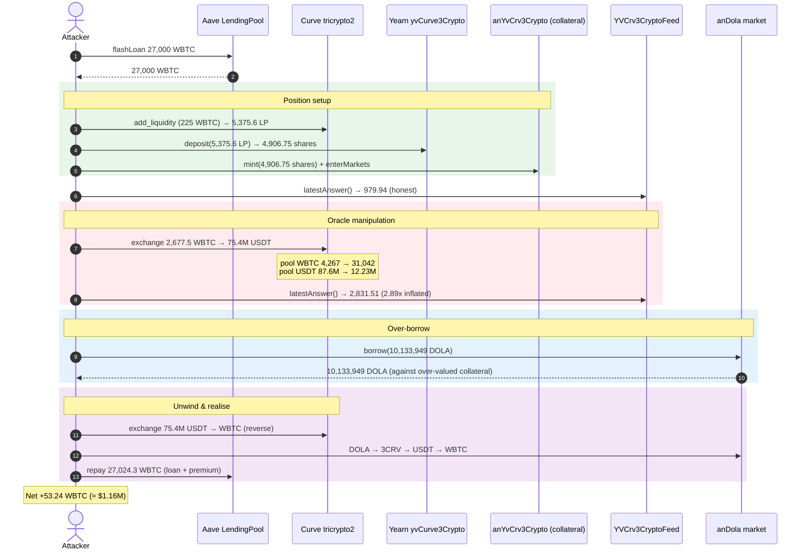
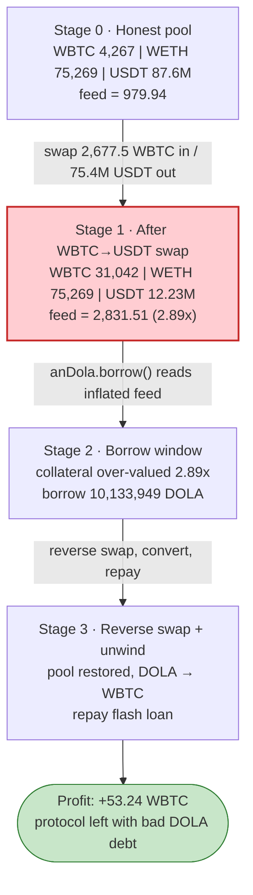
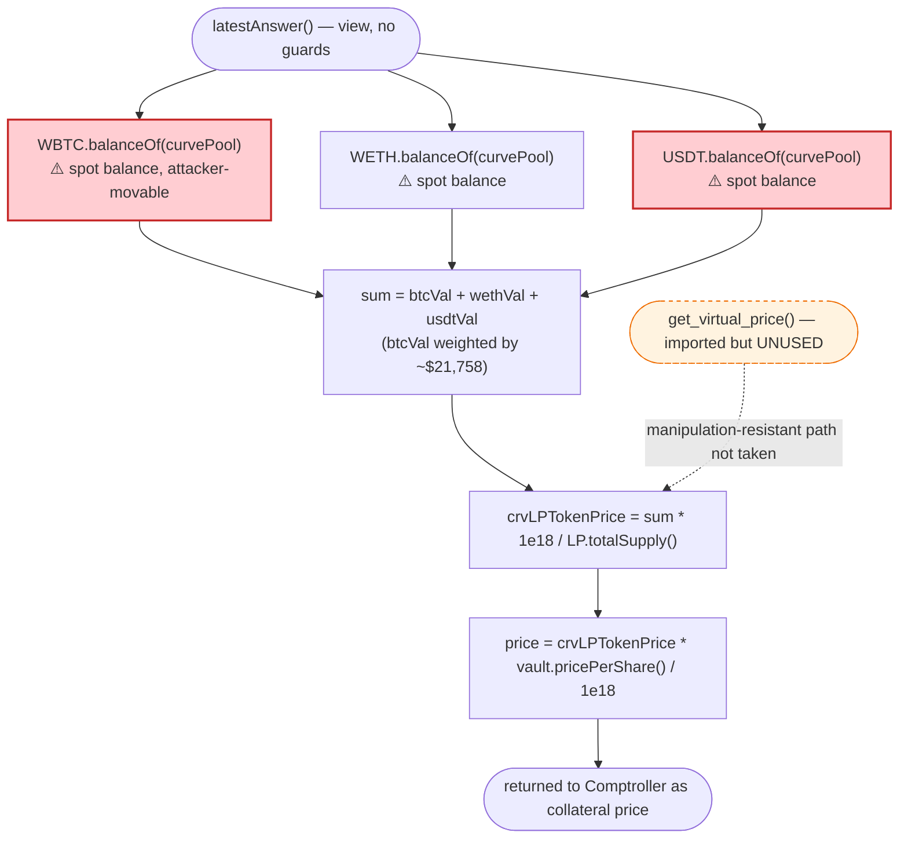

# Inverse Finance Exploit — Spot-Balance Oracle Manipulation of the `yvCurve-3Crypto` Price Feed

> **Reproduction:** the PoC compiles & runs in an isolated Foundry project at
> [this project folder](.). Full verbose trace: [output.txt](output.txt).
> Verified vulnerable source: [YVCrv3CryptoFeed.sol](sources/YVCrv3CryptoFeed_E8b3bC/YVCrv3CryptoFeed.sol).

---

## Key info

| | |
|---|---|
| **Loss** | ~$1.26M to Inverse Finance (≈53.24 WBTC profit to the attacker in this fork; the original on-chain incident was ~$1.2M total) |
| **Vulnerable contract** | `YVCrv3CryptoFeed` (price oracle) — [`0xE8b3bC58774857732C6C1147BFc9B9e5Fb6F427C`](https://etherscan.io/address/0xE8b3bC58774857732C6C1147BFc9B9e5Fb6F427C#code) |
| **Victim market** | `anYvCrv3Crypto` Frontier CErc20 — [`0x1429a930ec3bcf5Aa32EF298ccc5aB09836EF587`](https://etherscan.io/address/0x1429a930ec3bcf5Aa32EF298ccc5aB09836EF587) ; DOLA borrow market `anDola` — [`0x7Fcb7DAC61eE35b3D4a51117A7c58D53f0a8a670`](https://etherscan.io/address/0x7Fcb7DAC61eE35b3D4a51117A7c58D53f0a8a670) |
| **Manipulated pool** | Curve `tricrypto2` (CRV-3Crypto) — [`0xD51a44d3FaE010294C616388b506AcdA1bfAAE46`](https://etherscan.io/address/0xD51a44d3FaE010294C616388b506AcdA1bfAAE46) |
| **Comptroller (Unitroller)** | [`0x4dCf7407AE5C07f8681e1659f626E114A7667339`](https://etherscan.io/address/0x4dCf7407AE5C07f8681e1659f626E114A7667339) |
| **Attacker EOA** | `0xeA6ed0Fe6b818eC93C30B53Ec84bbe4Fd52F2D7c` (original incident) |
| **Attacker contract** | `0x33C1c4cF7Bd0d75E0E70f0d2b81B0F4B80B9f1E1` (original incident) |
| **Attack tx** | [`0x600373f67521324c8068cfd025f121a0843d57ec813411661b07edc5ff781842`](https://etherscan.io/tx/0x600373f67521324c8068cfd025f121a0843d57ec813411661b07edc5ff781842) |
| **Chain / block / date** | Ethereum mainnet / fork at block **14,972,418** / **June 16, 2022** |
| **Compiler** | Feed `^0.8.4`; CToken `^0.5.16` (Compound v2 fork). PoC built with Solc 0.8.34 |
| **Bug class** | Price-oracle manipulation — using **spot ERC-20 balances** of an AMM pool as the basis for a lending collateral price |

---

## TL;DR

Inverse Finance's "Frontier" money market (a Compound v2 fork) priced the
`yvCurve-3Crypto` collateral token with a custom feed, `YVCrv3CryptoFeed`. To value the
underlying Curve LP token, the feed reads the **live ERC-20 balances** that the Curve
tricrypto2 pool holds of WBTC, WETH and USDT, multiplies each by its Chainlink USD price,
sums them, and divides by the LP token's total supply
([YVCrv3CryptoFeed.sol:116-124](sources/YVCrv3CryptoFeed_E8b3bC/YVCrv3CryptoFeed.sol#L116-L124)).

Because those balances are nothing more than the result of `balanceOf(curvePool)`, an
attacker can **temporarily distort them with a single large swap** and the feed will
faithfully report the distorted value. The Curve tricrypto2 pool weights WBTC by the BTC
USD price (~$21,758 in this block) and USDT by ~$1, so swapping a large amount of WBTC
*into* the pool (and pulling USDT *out*) replaces "cheap" reserve value with "expensive"
reserve value and **inflates** the LP price.

The attack:

1. **Flash-loan 27,000 WBTC** from Aave.
2. **Mint** `yvCurve-3Crypto` collateral and deposit it into the `anYvCrv3Crypto` market,
   then `enterMarkets`.
3. **Pump the oracle**: swap **2,677.5 WBTC → 75.4M USDT** through the Curve pool. This
   drives the WBTC reserve up ~7.3× and the USDT reserve down, lifting the feed price from
   **979.94 → 2,831.51** (1e18-scaled) — a **2.89×** jump.
4. **Borrow** the maximum DOLA the now-inflated collateral allows: **10,133,949 DOLA**.
5. **Reverse the swap** to recover most of the WBTC and **convert the DOLA** (via the
   DOLA-3pool metapool → 3CRV → USDT → WBTC) into WBTC.
6. **Repay the flash loan** (27,000 WBTC + 0.09% premium) and **keep the surplus** —
   ≈53.24 WBTC profit in this fork. The DOLA debt is left unpaid against under-valued
   collateral, so the loss lands on the protocol.

---

## Background — what was being priced and how

**Inverse Finance Frontier** is a Compound v2 fork. Each listed asset is a `CErc20`
"money market" (e.g. `anDola` lends out the protocol's DOLA stablecoin; `anYvCrv3Crypto`
accepts the Yearn `yvCurve-3Crypto` vault token as collateral). The Comptroller
(`Unitroller`) gates `borrow` on whether the borrower's collateral, valued by the
protocol's oracle, covers the requested debt at the market's collateral factor.

`yvCurve-3Crypto` is the receipt token of a Yearn vault that auto-compounds Curve
**tricrypto2** LP tokens. Pricing it requires two hops:

1. price 1 Curve tricrypto2 LP token, then
2. multiply by the Yearn vault's `pricePerShare()`.

`YVCrv3CryptoFeed` performed hop (1) by **reading the pool's raw token balances** rather
than using Curve's manipulation-resistant `get_virtual_price()`. That single shortcut is
the entire vulnerability — note that the contract even *imports* an `ICurvePool` interface
exposing `get_virtual_price()` but never calls it
([YVCrv3CryptoFeed.sol:91-93](sources/YVCrv3CryptoFeed_E8b3bC/YVCrv3CryptoFeed.sol#L91-L93)).

On-chain state at the fork block (read directly from the trace):

| Quantity | Value | Source line |
|---|---|---|
| BTC/USD Chainlink (`BTCFeed`) | 2,175,882,582,458 (8-dec ≈ **$21,758.83**) | [output.txt:1796](output.txt) |
| ETH/USD Chainlink (`ETHFeed`) | 117,081,386,761 (8-dec ≈ **$1,170.81**) | [output.txt:1803](output.txt) |
| USDT/USD Chainlink (`USDTFeed`) | 99,860,000 (8-dec ≈ **$0.9986**) | [output.txt:1809](output.txt) |
| Curve pool WBTC balance (pre) | 426,705,810,117 (8-dec ≈ **4,267.06 WBTC**) | [output.txt:1798](output.txt) |
| Curve pool WETH balance | 75,269,151,943,667,682,615,597 (≈ **75,269 WETH**) | [output.txt:1805](output.txt) |
| Curve pool USDT balance (pre) | 87,636,422,228,320 (6-dec ≈ **87.64M USDT**) | [output.txt:1811](output.txt) |
| Curve LP `totalSupply` | 300,160,225,602,776,604,182,779 | [output.txt:1813](output.txt) |
| Yearn `pricePerShare()` | 1,095,550,383,646,743,201 (≈ **1.0956**) | [output.txt:1816](output.txt) |
| **Feed `latestAnswer()` (pre)** | **979,943,357,748,941,122,174** (≈ **979.94**) | [output.txt:1821](output.txt) |

---

## The vulnerable code

### The feed prices the LP token from spot pool balances

[`sources/YVCrv3CryptoFeed_E8b3bC/YVCrv3CryptoFeed.sol:116-124`](sources/YVCrv3CryptoFeed_E8b3bC/YVCrv3CryptoFeed.sol#L116-L124):

```solidity
function latestAnswer() public view returns (uint256) {
    uint256 crvPoolBtcVal  = WBTC.balanceOf(address(CRV3CRYPTO)) * uint256(BTCFeed.latestAnswer())  * 1e2;
    uint256 crvPoolWethVal = WETH.balanceOf(address(CRV3CRYPTO)) * uint256(ETHFeed.latestAnswer())  / 1e8;
    uint256 crvPoolUsdtVal = USDT.balanceOf(address(CRV3CRYPTO)) * uint256(USDTFeed.latestAnswer()) * 1e4;

    uint256 crvLPTokenPrice =
        (crvPoolBtcVal + crvPoolWethVal + crvPoolUsdtVal) * 1e18 / crv3CryptoLPToken.totalSupply();

    return (crvLPTokenPrice * vault.pricePerShare()) / 1e18;
}
```

`WBTC.balanceOf(address(CRV3CRYPTO))`, `WETH.balanceOf(...)` and
`USDT.balanceOf(...)` are **instantaneous** reads of how much of each token the Curve pool
currently holds. They move every time anyone swaps, and they can be moved by an
arbitrarily large amount inside a single transaction with no cost beyond swap fees and
slippage — both of which the attacker recovers by reversing the swap.

The dominant term is `crvPoolBtcVal`: WBTC is scaled by BTC's ~$21,758 price, so each
extra WBTC added to the pool adds ~$21,758 of "value" to the numerator. USDT is scaled by
~$1. Therefore **swapping USDT-equivalent value out and WBTC value in monotonically raises
the reported LP price**, even though the pool's true economic value is essentially
unchanged (a swap is value-neutral minus fees).

### Where the manipulated price is consumed

The Comptroller's `getHypotheticalAccountLiquidity` (Compound v2) values the borrower's
collateral via the oracle's `getUnderlyingPrice(anYvCrv3Crypto)`, which routes to
`YVCrv3CryptoFeed.latestAnswer()`. A higher feed value means more borrowing power. The
`borrow()` in `CToken` only succeeds if the Comptroller approves; with the inflated price
it approves a far larger DOLA draw than the collateral is honestly worth.

---

## Root cause — why it was possible

A constant-product / Curve invariant AMM holds reserves that **shift freely with trading
volume**. `balanceOf(pool)` is therefore an *attacker-controllable* number within one
transaction. Any price oracle built on raw pool balances inherits that controllability.

The correct, manipulation-resistant primitive for an LP token is Curve's
`get_virtual_price()` (or a fair-LP-pricing formula using Chainlink prices and the
invariant), which is anchored to the pool's invariant `D` and the LP total supply, and
does **not** move materially on a value-neutral swap. The feed had this interface available
([`ICurvePool.get_virtual_price`](sources/YVCrv3CryptoFeed_E8b3bC/YVCrv3CryptoFeed.sol#L91-L93))
but priced from spot balances instead.

Three properties compose into the exploit:

1. **Spot-balance pricing.** The numerator is a linear function of pool token balances, so
   a single large swap rewrites it.
2. **Asymmetric price weights.** WBTC is weighted by ~$21,758 and USDT by ~$1. Swapping
   WBTC *in* / USDT *out* trades "cheap weight" for "expensive weight", inflating the sum
   far beyond any slippage the attacker pays.
3. **Same-transaction borrow.** Compound's `borrow()` reads the oracle live, so the
   attacker can inflate, borrow, and revert the inflation atomically — no need to hold the
   manipulated state across blocks, making it trivially flash-loanable.

---

## Preconditions

- The attacker can take a large flash loan of WBTC (Aave v2 here, 27,000 WBTC) to fund the
  manipulating swap. The manipulation capital is fully recovered intra-transaction.
- A position in the `anYvCrv3Crypto` collateral market exists for the attacker
  (`mint` + `enterMarkets`).
- The `anDola` market has DOLA liquidity to lend (the protocol's stablecoin).
- The oracle reads the Curve pool's balances live with no TWAP, no `get_virtual_price()`,
  and no per-block staleness/deviation guard — all true at the fork block.

---

## Attack walkthrough (with on-chain numbers from the trace)

All figures are taken directly from the `log_named_*` events and call returns in
[output.txt](output.txt). WBTC has 8 decimals (so 27,000 WBTC = `2.7e12` raw); DOLA and
3CRV have 18; USDT has 6.

| # | Step | Concrete numbers | Effect |
|---|------|------------------|--------|
| 0 | **Flash-loan WBTC** from Aave | borrow **27,000 WBTC** (`2.7e12`), premium 0.09% = 2,430,000,000 ([output.txt:1648](output.txt)) | Attacker holds 27,000 WBTC. |
| 1 | **Add liquidity** to Curve tricrypto2 with **225 WBTC** (`amounts2 = [0, 22_500_000_000, 0]`) | receives **5,375.60 yvCRV-3Crypto LP** (`5.375e21`); WBTC left = 26,775 ([output.txt:1695-1698](output.txt)) | Acquires the Curve LP token to deposit. |
| 2 | **Deposit** LP into Yearn vault `yvCurve3Crypto.deposit(5_375.60e18)` | receives **4,906.75 yvCurve-3Crypto** shares (`4.906e21`) ([output.txt:1727](output.txt)) | Now holds the collateral token. |
| 3 | **Mint** `anYvCrv3Crypto` with 4,906.75 shares and `enterMarkets` | receives **24,533,773,387,519 anYvCrv3** cTokens (`2.453e13`) ([output.txt:1783](output.txt)) | Collateral posted to Frontier. |
| 4 | **Read honest price** | `YVCrv3CryptoFeed.latestAnswer() = ` **979,943,357,748,941,122,174** (≈ **979.94**) ([output.txt:1821](output.txt)) | Baseline collateral value. |
| 5 | **Manipulate**: `curveRegistry.exchange(curvePool, WBTC→USDT, 2,677.5 WBTC)` | pool WBTC **426,705,810,117 → 3,104,205,810,117** (4,267 → 31,042 WBTC, ~7.27×); pool USDT **87,636,422,228,320 → 12,233,046,021,994** (87.6M → 12.23M); attacker gets **75,403,376,206,326 USDT** ([output.txt:1827-1924](output.txt)) | One side of the pool swapped; WBTC reserve ballooned. |
| 6 | **Read inflated price** | `latestAnswer() = ` **2,831,510,989,134,333,947,252** (≈ **2,831.51**) — a **2.89×** inflation ([output.txt:1953](output.txt)) | Collateral now over-valued ~2.89×. |
| 7 | **Borrow DOLA** `anDola.borrow(10_133_949_192_393_802_606_886_848)` | **10,133,949 DOLA** drawn (`1.013e25`); `accountBorrows = totalBorrows` updated ([output.txt:2025-2040](output.txt)) | Bad debt created against inflated collateral. |
| 8 | **Reverse swap** `exchange(curvePool, USDT→WBTC, 75,403,376,186,072 USDT)` | attacker WBTC back to **26,626** WBTC ([output.txt:2111](output.txt)) | Recovers most manipulation capital; pool price relaxes. |
| 9 | **Convert DOLA → WBTC** via DOLA-3pool → 3CRV → USDT → WBTC | `dola3pool.exchange(DOLA→3CRV)` → 9,881,355 3CRV; `remove_liquidity_one_coin → USDT` 10,099,976,315,221; `exchange(USDT→WBTC)` → attacker WBTC **2,707,754,524,305** (`2.707e12`) ([output.txt:2181-2280](output.txt)) | DOLA loot realised in WBTC. |
| 10 | **Repay flash loan** approve 2,702,430,000,000 WBTC (27,000 + premium) | Aave `transferFrom` 2,702,430,000,000 WBTC; `FlashLoan` settled ([output.txt:2336-2342](output.txt)) | Loan repaid. |
| 11 | **Profit** | `WBTC.balanceOf(attacker) = ` **5,324,524,305** (`5.324e9` = **≈53.24 WBTC**) ([output.txt:2351](output.txt)) | Net gain kept by attacker. |

### Why the price moved 2.89×

The feed numerator is dominated by `crvPoolBtcVal = WBTC_bal · BTCFeed · 1e2`. Holding the
Chainlink prices and WETH balance fixed (the trace confirms BTC/ETH/USDT feeds are
identical before and after — [output.txt:1796/1925](output.txt)):

- **Before:** WBTC term ∝ 426,705,810,117 · 21,758.83; USDT term ∝ 87,636,422,228,320 · 0.9986.
- **After:** WBTC term ∝ 3,104,205,810,117 · 21,758.83 (≈ 7.27× larger); USDT term ∝ 12,233,046,021,994 · 0.9986 (≈ 7.16× smaller).

Because the WBTC term is multiplied by the BTC price (~$21.8k) and the USDT term by ~$1,
trading 75.4M USDT *out* for 2,677.5 WBTC *in* adds roughly `2,677.5 · $21,758 ≈ $58.3M`
of "expensive" value to the numerator while removing only `~$75.4M · $0.9986 ≈ $75.3M` of
"cheap" value — but the cheap value was already a small slice of the total. Net of the
divisor (LP total supply, unchanged), the reported LP price climbs from 979.94 to 2,831.51.
The pool's *true* value barely changed; only the feed's view of it did.

---

## Profit / loss accounting

| Direction | Amount (WBTC, 8-dec) |
|---|---:|
| Flash-loaned in | 27,000.00 |
| Repaid to Aave (principal + 0.09% premium) | 27,024.30 |
| **Attacker WBTC at end** | **53.24** (`5,324,524,305`) |

The attacker's ~53.24 WBTC surplus is the realised value of the 10,133,949 DOLA it minted
against collateral that was honestly worth far less. That DOLA debt was never repaid; the
shortfall (≈$1.26M at the time, since DOLA ≈ $1 / WBTC ≈ $21.8k makes 53.24 WBTC ≈ $1.16M
in this fork) is borne by Inverse Finance and DOLA holders. The original mainnet incident
netted the attacker roughly $1.2M.

---

## Diagrams

### Sequence of the attack



### Pool / oracle state evolution



### The flaw inside `latestAnswer()`



---

## Remediation

1. **Never price an AMM LP from spot reserves.** Use Curve's `get_virtual_price()` (already
   imported here) combined with Chainlink spot prices via a *fair LP pricing* formula
   (e.g. the Alpha-Homora / Chainlink minimum-product approach for tricrypto). Spot
   `balanceOf(pool)` is attacker-controllable within a single transaction and must never
   feed a lending price.
2. **Anchor to the invariant, not the balances.** `get_virtual_price()` is anchored to the
   pool invariant `D` and LP supply, so a value-neutral swap does not move it. This alone
   defeats the manipulation.
3. **Add deviation / TWAP guards.** Even with virtual price, bound the per-block movement
   of any reported price and reject readings that deviate from a time-weighted reference by
   more than a small threshold.
4. **Stale/zero protection.** The feed uses `latestAnswer()` (no `updatedAt`, no
   `answeredInRound`); migrate to `latestRoundData()` and revert on stale or non-positive
   answers.
5. **Conservative collateral factors for exotic collateral.** Reflexive collateral
   (LP/vault tokens) warrants lower LTV and borrow caps so a momentary mispricing cannot be
   turned into a full drain.

---

## How to reproduce

The PoC was extracted into a standalone Foundry project (the umbrella DeFiHackLabs repo has
several unrelated PoCs that fail to compile under a whole-project `forge test` build):

```bash
_shared/run_poc.sh 2022-06-InverseFinance_exp --mt testExploit -vvvvv
```

- RPC: an **Ethereum mainnet archive** endpoint is required (fork block 14,972,418, June 2022).
- Result: `[PASS] testExploit()`, with the final log showing the attacker's WBTC profit.

Expected tail:

```
  Manipulated YVCrv3CryptoFeed lastanswer:: 2831510989134333947252
  ...
  After flashloan repaid, profit in WBTC of attacker:: 5324524305

Suite result: ok. 1 passed; 0 failed; 0 skipped
```

(`5324524305` raw WBTC = ≈ **53.24 WBTC**; the honest feed reads `979943357748941122174`
≈ 979.94 and the manipulated feed reads `2831510989134333947252` ≈ 2,831.51 — a 2.89× lift.)

---

*Reference: Inverse Finance oracle manipulation, Ethereum mainnet, June 16 2022, ~$1.2M.
SlowMist / Rekt post-mortems. Vulnerable feed source verified at
[YVCrv3CryptoFeed.sol](sources/YVCrv3CryptoFeed_E8b3bC/YVCrv3CryptoFeed.sol).*
