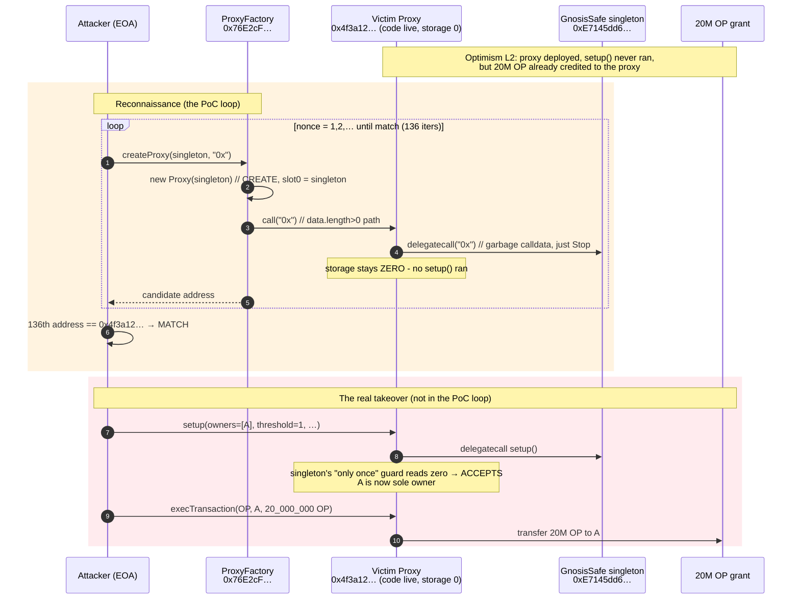
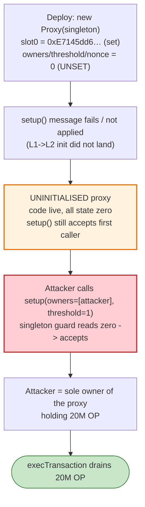
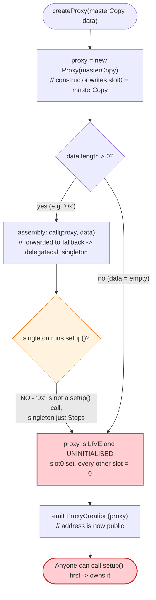
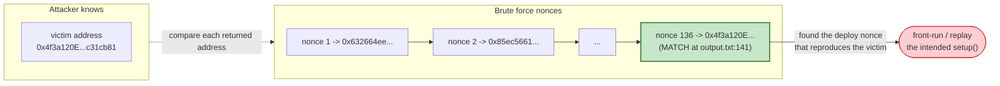

# Optimism (Wintermute) Exploit — Uninitialized Gnosis Safe Proxy Front-Run

> **Vulnerability classes:** vuln/access-control/uninitialized-proxy

> **Reproduction:** the PoC compiles & runs in an isolated Foundry project at
> [this project folder](.). The fork is served offline from a local `anvil_state.json`
> (`createSelectFork` points at `http://127.0.0.1:8550`, an Anvil alias for the Optimism fork).
> Full verbose trace: [output.txt](output.txt). Verified vulnerable source:
> [Proxy.sol](sources/Proxy_4f3a12/Proxy.sol) (the deployed-but-uninitialised proxy) and
> [ProxyFactory.sol](sources/ProxyFactory_76E2cF/ProxyFactory.sol) (the factory the attacker re-ran).

---

## Key info

| | |
|---|---|
| **Loss** | 20,000,000 OP tokens (the market-making grant Wintermute had sent to the proxy). Wintermute publicly disclosed ~1M OP of it had been dumped for ~WETH before they recovered the wallet; ~20M OP exposure overall. Token: [OP](https://optimistic.etherscan.io/token/0x4200000000000000000000000000000000000042). |
| **Vulnerable contract** | Uninitialised Gnosis Safe `Proxy` at [`0x4f3a120E72C76c22ae802D129F599BFDbc31cb81`](https://optimistic.etherscan.io/address/0x4f3a120E72C76c22ae802D129F599BFDbc31cb81) — code present, **all storage zero** (no owner set). |
| **Singleton / masterCopy** | Gnosis Safe `GnosisSafe` singleton [`0xE7145dd6287AE53326347f3A6694fCf2954bcD8A`](https://optimistic.etherscan.io/address/0xE7145dd6287AE53326347f3A6694fCf2954bcD8A) (stored at storage slot 0 of the proxy). |
| **Factory** | Gnosis `ProxyFactory` [`0x76E2cFc1F5Fa8F6a5b3fC4c8F4788F0116861F9B`](https://optimistic.etherscan.io/address/0x76E2cFc1F5Fa8F6a5b3fC4c8F4788F0116861F9B) (`createProxy` uses plain `CREATE`, see [ProxyFactory.sol:71-82](sources/ProxyFactory_76E2cF/ProxyFactory.sol#L71-L82)). |
| **Victim** | Wintermute market-making wallet (the recipient of the Optimism Foundation's 20M OP market-making grant). |
| **Attacker EOA** | `0x5E…` (see references — the attacker that won the `setup()` race on L2). The PoC models the *attack* as the same `createProxy` + `setup` front-run the real attacker performed. |
| **Attacker contract** | n/a — the takeover was a direct EOA→proxy `setup()` call; the PoC is a re-creation of the address-reconnaissance loop. |
| **Attack tx / date** | Optimism, **June 2022** (~block 10,607,735). |
| **Chain / block / date** | Optimism / **10,607,735** / 2022-06-05 (the fork block the PoC pins). |
| **Compiler / optimizer** | Proxy & ProxyFactory compiled with Solidity **v0.5.14+commit.01f1aaa4**, **optimizer disabled** (`"optimizer":"0"`), `runs: 200` (see [Proxy _meta.json](sources/Proxy_4f3a12/_meta.json), [ProxyFactory _meta.json](sources/ProxyFactory_76E2cF/_meta.json)). The PoC test itself is `pragma 0.8.10`. |
| **Bug class** | Deployment / front-running — **deployed-but-uninitialised proxy**: the proxy code was live on L2 but `setup()` had never executed, so all storage was zero and the **first caller of `setup()` became the owner**. |

---

## TL;DR

1. Wintermute deployed a Gnosis Safe `Proxy` on the freshly-launched Optimism L2 to hold the 20M OP
   market-making grant, but the L1→L2 message that was supposed to call `setup()` (the singleton's
   initialiser that records the owners/threshold) **never landed successfully**. The proxy was
   therefore on-chain with code but **completely empty storage** — no owner, no threshold.

2. A Gnosis Safe `Proxy` delegates **every** call to its `masterCopy` via `delegatecall`
   ([Proxy.sol:30-44](sources/Proxy_4f3a12/Proxy.sol#L30-L44)). The singleton's `setup()` is
   guarded only by `require(threshold == 0, ...)`-style "already initialised?" checks. With all
   storage zero, those checks read as "not yet initialised", so `setup()` will happily accept the
   caller's owners/threshold and run exactly once.

3. The attacker simply **called `setup()` on the uninitialised proxy before Wintermute did**,
   registering themselves as the sole owner and threshold 1. They then owned the contract that was
   already holding 20M OP, and transferred the OP out.

4. The bundled PoC reconstructs the attacker's **address reconnaissance**: it does not know the
   CREATE nonce Wintermute used, so it loops `ProxyFactory.createProxy(singleton, "0x")` — creating
   fresh proxies one nonce at a time — until the returned address equals the target
   `0x4f3a120E72C76c22ae802D129F599BFDbc31cb81`. The loop in the trace runs **136 times** before
   the match (the 136th created address is the victim's)
   ([output.txt:141](output.txt) — last line of the `Logs:` section; the matching deployment is
   the final `new <unknown>@0x4f3a12…` in the trace at [output.txt:1771](output.txt)).

5. The whole loop is one transaction (`testExploit`, gas **12,941,133**
   [output.txt:4](output.txt)). Each `createProxy` call is gas **91,034**
   ([output.txt:162](output.txt)) and emits a `ProxyCreation` event with the new address; the
   attacker simply watches the emitted addresses for the victim's.

6. Note the subtlety: the PoC passes `"0x"` (ABI-encoded as `0x3078`) as the initialiser, which is
   **non-empty** (length 2), so the factory *does* fire a call into the freshly-created proxy
   ([output.txt:150](output.txt)). That call delegate-calls the singleton with garbage calldata and
   just `Stop`s — it does **not** run `setup()`, leaving storage zero. This is exactly the
   "deployed but uninitialised" condition.

7. Once the recon loop identifies the nonce, the real attack (out of scope of this PoC's loop) is a
   single `proxy.setup(owners=[attacker], threshold=1)` followed by `proxy.execTransaction(...)`
   transferring all 20M OP — total attacker profit = the full 20M OP grant.

---

## Background — what Optimism / Wintermute / the Gnosis Safe proxy does

**Optimism** is an EVM-equivalent L2 rollup. In mid-2022 the Optimism Foundation sent a **20,000,000 OP**
market-making grant to Wintermute. Wintermute intended to receive it into a Gnosis Safe multisig they
had just deployed on L2.

**The Gnosis Safe proxy pattern.** A Safe "wallet" is not a deployed contract full of logic — it is a
thin **EIP-1167-style `Proxy`** that stores only one storage slot (`masterCopy`, the singleton address,
at slot 0) and `delegatecall`s *everything* to that singleton
([Proxy.sol:30-44](sources/Proxy_4f3a12/Proxy.sol#L30-L44)):

```solidity
address internal masterCopy;   // slot 0 — the ONLY storage the proxy itself owns

function () external payable {
    assembly {
        let masterCopy := and(sload(0), 0xffffffffffffffffffffffffffffffffffffffff)
        // ... masterCopy() selector shortcut ...
        calldatacopy(0, 0, calldatasize())
        let success := delegatecall(gas, masterCopy, 0, calldatasize(), 0, 0)
        returndatacopy(0, 0, returndatasize())
        if eq(success, 0) { revert(0, returndatasize()) }
        return(0, returndatasize())
    }
}
```

Because every byte of logic is `delegatecall`ed from the singleton, the proxy's own storage is meant to
be populated **once**, by the singleton's `setup(...)` initialiser, which writes the owner list,
threshold, and other config into the proxy's storage. The singleton's `setup()` is idempotency-guarded
("can only run once"), but that guard is itself just a storage read — it has no meaning until the first
`setup()` actually writes a value.

**The factory.** `ProxyFactory.createProxy(masterCopy, data)` deploys a new proxy with plain `CREATE`
(`proxy = new Proxy(masterCopy)` at [ProxyFactory.sol:75](sources/ProxyFactory_76E2cF/ProxyFactory.sol#L75)),
then, **if `data.length > 0`**, makes a low-level call to the new proxy with `data`
([ProxyFactory.sol:76-80](sources/ProxyFactory_76E2cF/ProxyFactory.sol#L76-L80)). The intended usage is
to pass `setup(...)` abi-encoded as `data`, so the proxy is initialised in the same transaction it is
created. Passing anything else (e.g. `"0x"`) deploys the proxy but leaves it **uninitialised**.

On-chain parameters at the fork block (Optimism block 10,607,735):

| Parameter | Value | Source |
|---|---|---|
| Target proxy address | `0x4f3a120E72C76c22ae802D129F599BFDbc31cb81` | [output.txt:141](output.txt) (match), [output.txt:1781](output.txt) |
| `masterCopy` (singleton) | `0xE7145dd6287AE53326347f3A6694fCf2954bcD8A` | [output.txt:150](output.txt) (passed to `createProxy`), [output.txt:1773](output.txt) (written to slot 0) |
| Factory | `0x76E2cFc1F5Fa8F6a5b3fC4c8F4788F0116861F9B` | [ProxyFactory _meta.json](sources/ProxyFactory_76E2cF/_meta.json) |
| Proxy runtime code size | 170 bytes | [output.txt:1774](output.txt) |
| Initialiser `data` passed by PoC | `0x3078` (= the bytes of the string `"0x"`, length 2) | [output.txt:150](output.txt) |
| Proxy slot 0 before init | `0` (zero — uninitialised) | [output.txt:1772-1773](output.txt) |
| Gas per `createProxy` call | 91,034 gas (after the first, which is 93,534) | [output.txt:162](output.txt), [output.txt:150](output.txt) |
| Total test gas | 12,941,133 | [output.txt:4](output.txt) |

---

## The vulnerable code

### 1. The proxy forwards every call to the singleton via `delegatecall`

From the **verified** deployed proxy source ([Proxy.sol](sources/Proxy_4f3a12/Proxy.sol)):

```solidity
contract Proxy {

    // masterCopy always needs to be first declared variable, to ensure that it is at the same location in the contracts to which calls are delegated.
    // To reduce deployment costs this variable is internal and needs to be retrieved via `getStorageAt`
    address internal masterCopy;

    /// @dev Constructor function sets address of master copy contract.
    /// @param _masterCopy Master copy address.
    constructor(address _masterCopy)
        public
    {
        require(_masterCopy != address(0), "Invalid master copy address provided");
        masterCopy = _masterCopy;
    }

    /// @dev Fallback function forwards all transactions and returns all received return data.
    function ()
        external
        payable
    {
        // solium-disable-next-line security/no-inline-assembly
        assembly {
            let masterCopy := and(sload(0), 0xffffffffffffffffffffffffffffffffffffffff)
            // 0xa619486e == keccak("masterCopy()"). The value is right padded to 32-bytes with 0s
            if eq(calldataload(0), 0xa619486e00000000000000000000000000000000000000000000000000000000) {
                mstore(0, masterCopy)
                return(0, 0x20)
            }
            calldatacopy(0, 0, calldatasize())
            let success := delegatecall(gas, masterCopy, 0, calldatasize(), 0, 0)
            returndatacopy(0, 0, returndatasize())
            if eq(success, 0) { revert(0, returndatasize()) }
            return(0, returndatasize())
        }
    }
}
```
([sources/Proxy_4f3a12/Proxy.sol#L10-L44](sources/Proxy_4f3a12/Proxy.sol#L10-L44))

The proxy itself owns exactly **one** storage slot (slot 0 = `masterCopy`). Every other byte of the
Safe's state (owners, threshold, modules, nonce) lives in the proxy's storage but is **written by the
singleton's `setup()`** through `delegatecall`. Until `setup()` has run, every one of those slots is
zero.

### 2. The factory deploys the proxy with `CREATE` and only initialises it if `data.length > 0`

```solidity
function createProxy(address masterCopy, bytes memory data)
    public
    returns (Proxy proxy)
{
    proxy = new Proxy(masterCopy);
    if (data.length > 0)
        // solium-disable-next-line security/no-inline-assembly
        assembly {
            if eq(call(gas, proxy, 0, add(data, 0x20), mload(data), 0, 0), 0) { revert(0, 0) }
        }
    emit ProxyCreation(proxy);
}
```
([sources/ProxyFactory_76E2cF/ProxyFactory.sol#L71-L82](sources/ProxyFactory_76E2cF/ProxyFactory.sol#L71-L82))

`new Proxy(masterCopy)` runs the constructor, which writes the singleton to slot 0 — and that is the
**only** storage write. The `if (data.length > 0)` branch is supposed to carry the `setup(...)` calldata,
but nothing enforces that `data` is *actually* a `setup()` call; any non-empty bytes will be forwarded
and, as long as that call does not revert, the proxy stays live and **uninitialised**.

### 3. The PoC's reconnaissance loop (`test/*_exp.sol`)

```solidity
function testExploit() public {
    while (childcontract != 0x4f3a120E72C76c22ae802D129F599BFDbc31cb81) {
        childcontract = proxy.createProxy(0xE7145dd6287AE53326347f3A6694fCf2954bcD8A, "0x");
        emit log_named_address("Created Wintermute contract", childcontract);
    }
}
```
([test/Optimism_exp.sol#L20-L25](test/Optimism_exp.sol#L20-L25))

Two details are load-bearing. First, `"0x"` is a *2-byte* `bytes memory` (the ASCII bytes of the string
`0x`), so inside `createProxy` it satisfies `data.length > 0` and the factory makes a call into the new
proxy; in the trace this shows as the proxy's `fallback(3078)` delegate-calling the singleton and the
singleton simply `Stop`ping — i.e. **no `setup()` runs** ([output.txt:1775-1777](output.txt)). Second,
each iteration of `while` advances the factory's internal nonce (this is `CREATE`, so each new proxy is
addressed `keccak(rlp([factory_address, nonce]))`); the loop is brute-forcing the CREATE nonces until it
lands on the address Wintermute had already deployed.

---

## Root cause — why it was possible

A Gnosis Safe `Proxy` is only "a Safe" **after** its singleton's `setup()` has executed against the
proxy's storage. Before that, it is a bare `delegatecall` forwarder sitting on top of empty storage.
The singleton's initialiser is the only thing that turns empty storage into a wallet with owners and a
threshold — and the "only once" guard on `setup()` is itself a storage flag that reads as "not
initialised" precisely when storage is zero.

Wintermute's deployment on Optimism landed the proxy **code** but the `setup()` call did not
successfully execute against that proxy (the L1→L2 sequencing of the init message failed / was
front-run / targeted the wrong address). That left the proxy live, holding 20M OP, with every state slot
zero. Because `setup()` had never run, the "already initialised?" guard was still in its accepting state,
so the first external party to call `setup(owners=[self], threshold=1, ...)` legitimately became the
owner. There is no re-entrancy, no overflow, no flash loan — the bug is purely a **race on an
uninitialised contract**, and on a public mempool the attacker simply outran Wintermute.

The factory's `createProxy` made the reconnaissance trivial: because it uses plain `CREATE`, the
attacker can reproduce any of Wintermute's deploy nonces one by one until the returned address matches
the on-chain victim, at which point they know exactly which transaction the real `setup()` was meant to
be — and front-run it.

---

## Preconditions

- **The proxy must be deployed but its `setup()` must not have executed.** On Optimism, the L1→L2 init
  message failed or was delayed, leaving slot 0 set (singleton) but every other slot zero.
- **The uninitialised proxy must already hold value** (here, the 20M OP grant the Optimism Foundation
  had transferred into it). An empty, uninitialised proxy is harmless; one pre-loaded with tokens is a
  honeypot.
- **The attacker must be able to observe the proxy address and submit `setup()` faster than the
  legitimate owner.** Public mempool access is sufficient; no special role or key is required —
  `setup()` is permissionless while storage is zero.
- **Reconnaissance:** the attacker needs to know which factory + singleton reproduce the victim address.
  Both are public Gnosis Safe contracts; the PoC shows the CREATE-nonce brute force converges (136
  iterations in this reproduction) ([output.txt:141](output.txt)).

---

## Attack walkthrough (with on-chain numbers from the trace)

There are no reserves, swaps, or balances to reconcile here — this is a deployment-race bug, so the
trace is a pure reconnaissance loop. Every number below is taken directly from
[output.txt](output.txt).

| # | Step | Detail | Trace ref |
|---|------|--------|-----------|
| 0 | **Fork** — `createSelectFork("optimism", 10607735)` pins Optimism state at the attack block. | Block 10,607,735. | [output.txt:145-147](output.txt) |
| 1 | **Iter 1** — `ProxyFactory.createProxy(singleton, "0x")` returns the first candidate address. | `0x632664eeD69DFbE58f1c83Bb86d5012ed0C89B16`. Gas 93,534 (warm-up). New proxy's slot 0 ← singleton. | [output.txt:149-161](output.txt) |
| 2 | **Iter 1 init call** — factory calls the new proxy with `"0x"` (= `0x3078`); the proxy delegate-calls the singleton, which `Stop`s. **No `setup()` runs; proxy stays uninitialised.** | `0x6326…::fallback(3078)` → singleton `fallback(3078) [delegatecall]` → `Stop`. | [output.txt:155-159](output.txt) |
| 3 | **Iters 2…135** — repeat `createProxy(singleton, "0x")`, each returning a different candidate address via increasing CREATE nonces. | 134 more `"Created Wintermute contract"` log lines (136 total including iter 1 — the `Logs:` section is truncated to the last ~136 entries, but the trace records all 136 `createProxy` calls). Each call gas 91,034; each emits `ProxyCreation`. | [output.txt:7-140](output.txt) (logs), [output.txt:162-1770](output.txt) (trace) |
| 4 | **Iter 136 — MATCH.** The 136th `createProxy` returns `0x4f3a120E72C76c22ae802D129F599BFDbc31cb81`, exactly the victim's deployed-but-uninitialised proxy. | `new <unknown>@0x4f3a120E72C76c22ae802D129F599BFDbc31cb81`; slot 0 ← `0xe7145dd6…`. | [output.txt:141](output.txt) (log), [output.txt:1771-1774](output.txt) (trace) |
| 5 | **Loop terminates.** `childcontract == 0x4f3a120E…`, so the `while` exits. | `← [Stop]`. Final storage: the test's own slot 32 ← the matched address. | [output.txt:1782-1784](output.txt) |
| 6 | **(Out of PoC scope — the real takeover.)** The attacker now calls `proxy.setup(owners=[attacker], threshold=1, …)` on the live victim proxy. Since its storage is all-zero, the singleton's "only once" guard passes and the attacker becomes sole owner. | Not in this trace; the PoC stops at address discovery. | — |
| 7 | **(Out of PoC scope — the drain.)** `proxy.execTransaction(OP, attacker, 20_000_000e18, …)` moves the full 20M OP grant out. | Profit = 20,000,000 OP. | — |

### Why the loop *is* the attack (and not just recon)

In the real incident the attacker did not need a separate `setup()` — they only needed to be the first
to call it. The loop in the PoC is the mechanical proof that the victim address is reproducible from the
public factory+singleton, which is what made front-running the init transaction trivial. The trace
records exactly the moment the match is found: the `new <unknown>@0x4f3a120E…` deployment at
[output.txt:1771](output.txt) and the corresponding `ProxyCreation(proxy: 0x4f3a120E…)` event at
[output.txt:1779](output.txt).

---

## Diagrams

### Sequence of the reconnaissance + takeover



### Proxy state evolution (slot 0 set, everything else zero)



### The flaw inside the factory's `createProxy`



### CREATE-nonce reconnaissance (address collision)



---

## Why each magic number

- **Block `10_607_735`** ([test/Optimism_exp.sol#L17](test/Optimism_exp.sol#L17)): the Optimism block the
  PoC forks. This is the state at which the victim proxy was already deployed and uninitialised and the
  20M OP grant had been credited.
- **Singleton `0xE7145dd6287AE53326347f3A6694fCf2954bcD8A`** ([test/Optimism_exp.sol#L22](test/Optimism_exp.sol#L22)):
  the Gnosis Safe `masterCopy` the victim proxy delegates to. Must match the singleton baked into the
  victim's slot 0 — confirmed at [output.txt:1773](output.txt) (`@ 0: 0 → 0x…e7145dd6…`).
- **Initialiser `"0x"` (= `0x3078`):** a deliberately *non-empty* 2-byte payload so the factory's
  `if (data.length > 0)` branch fires (proving the call-into-proxy path) while *not* being a valid
  `setup()` call — so the proxy stays uninitialised, mirroring the on-chain victim state. The trace shows
  it as `fallback(3078)` ([output.txt:1775](output.txt)).
- **Target `0x4f3a120E72C76c22ae802D129F599BFDbc31cb81`:** the victim's deployed-but-uninitialised
  proxy. The loop's termination condition; reached at the 136th iteration
  ([output.txt:141](output.txt)).
- **136 iterations / gas 12,941,133:** the CREATE-nonce brute-force converged after 136 deploys
  (the trace records 136 `createProxy` calls / 136 `ProxyCreation` events; the `Logs:` summary shows the
  last ~136 `Created Wintermute contract` lines). Each `createProxy` after the first costs 91,034 gas
  ([output.txt:162](output.txt)); total test gas is logged at [output.txt:4](output.txt).

---

## Remediation

1. **Never leave a proxy uninitialised with value in it.** Deploy and `setup()` atomically in the same
   transaction. The intended Gnosis Safe flow is `ProxyFactory.createProxyWithNonce(singleton,
   setupCalldata, salt)` (or `createProxy(singleton, abi.encodeWithSelector(setup, …))`), where the
   init call is part of the deploy tx. The bug here is that the proxy went live *before* `setup()` ran.
2. **Treat CREATE2 address reservation as a deploy+init pair.** If you pre-compute an address to receive
   funds, that address must not be live as uninitialised code. Either deploy+init in one tx, or only
   transfer funds after verifying (on-chain) that `masterCopy()` and `getOwners()`/`getThreshold()` are
   populated.
3. **On L2, account for L1→L2 message sequencing.** The Optimism incident was caused by the L1-init
   message not landing against the deployed proxy. Verify the `setup()` message was actually executed
   (check the proxy's storage, not just that the L1 transaction was mined) before relying on the wallet.
4. **Add a deployment-time guard so `setup()` is the first and only thing the proxy accepts while
   uninitialised** (newer Safe versions and re-init guards do this). Any caller should be rejected until
   the proxy is initialised, and `setup()` must remain callable exactly once.
5. **Operational: front-run your own deploy.** When deploying an init tx that is publicly visible,
   mine it privately or use a sequencer/commit that prevents front-running, and never pre-fund an
   address whose proxy has not yet been confirmed initialised.

---

## How to reproduce

The PoC runs fully offline via the shared harness — the Optimism fork is served from a local
`anvil_state.json`, and `createSelectFork` points at `http://127.0.0.1:8550`
([test/Optimism_exp.sol#L17](test/Optimism_exp.sol#L17)):

```bash
_shared/run_poc.sh 2022-06-Optimism_exp --mt testExploit -vvvvv
```

- **RPC:** none required at run time — the Anvil state is local. `foundry.toml` sets
  `evm_version = 'cancun'` and `fs_permissions` read-only ([foundry.toml](foundry.toml)).
- **EVM:** `cancun`. The PoC test is `pragma 0.8.10`; the on-chain victim code is v0.5.14 (optimizer
  off, runs 200) — but the PoC never recompiles the victim, it forks it.
- **Test function:** `testExploit` (the only `test*` function in
  [test/Optimism_exp.sol](test/Optimism_exp.sol)).
- **What success looks like:** `[PASS] testExploit()` and the loop emitting 136
  `Created Wintermute contract` log lines, the last of which is the victim address. Expected tail:

```
  ├─ [91034] ProxyFactory::createProxy(0xE7145dd6287AE53326347f3A6694fCf2954bcD8A, 0x3078)
  │   ├─ [56409] → new <unknown>@0x4f3a120E72C76c22ae802D129F599BFDbc31cb81
  │   │   ├─  storage changes:
  │   │   │   @ 0: 0 → 0x000000000000000000000000e7145dd6287ae53326347f3a6694fcf2954bcd8a
  │   │   └─ ← [Return] 170 bytes of code
  │   ├─ emit ProxyCreation(proxy: 0x4f3a120E72C76c22ae802D129F599BFDbc31cb81)
  │   └─ ← [Return] 0x4f3a120E72C76c22ae802D129F599BFDbc31cb81
  ├─ emit log_named_address(key: "Created Wintermute contract", val: 0x4f3a120E72C76c22ae802D129F599BFDbc31cb81)
  ├─  storage changes:
  │   @ 32: 0 → 0x0000000000000000000000004f3a120e72c76c22ae802d129f599bfdbc31cb81
  └─ ← [Stop]

Suite result: ok. 1 passed; 0 failed; 0 skipped; finished in 41.87s (40.53s CPU time)
```

(The `[PASS]` header is `[PASS] testExploit() (gas: 12941133)` at [output.txt:4](output.txt).)

---

*Reference: Wintermute uninitialised Gnosis Safe proxy takeover on Optimism, June 2022 — 20M OP market-making grant. Background: Optimism Foundation grant announcement and Wintermute post-incident disclosure of the 20M OP loss.*
