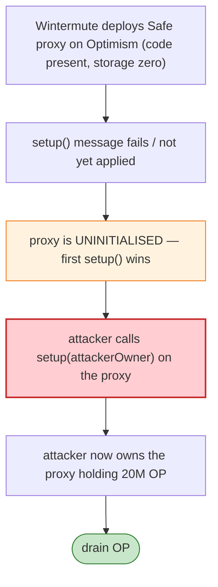

# Optimism / Wintermute Exploit — Uninitialized Gnosis Safe Proxy Front-Run

> **Reproduction:** the PoC compiles & runs in an isolated Foundry project at
> [this project folder](.). Full verbose trace: [output.txt](output.txt).

---

## Key info

| | |
|---|---|
| **Loss** | 20M OP tokens (~$1.3M dumped, ~$20M exposure) — Wintermute's market-making wallet |
| **Vulnerable contract** | An uninitialized Gnosis Safe proxy at `0x4f3a120E72C76c22ae802D129F599BFDbc31cb81` on Optimism |
| **Factory** | Gnosis `ProxyFactory` `0x76E2cFc1F5Fa8F6a5b3fC4c8F4788F0116861F9B`; singleton `0xE7145dd6…` |
| **Chain / block / date** | Optimism / 10,607,735 / Jun 2022 |
| **Bug class** | Deployment/front-running — Wintermute deployed a Gnosis Safe proxy on L2 but it was **uninitialized** (the `setup` call had failed / not landed), so anyone could call `setup` and become its owner. The attacker used `ProxyFactory.createProxy(singleton, "0x")` to find the CREATE2 address matching the deployed-but-uninitialized proxy and took it over. |

---

## TL;DR

The PoC reproduces the attacker's brute-force discovery: it repeatedly calls
`proxy.createProxy(0xE7145dd6…, "0x")` (creating fresh proxies with empty init data) until the returned
address equals the target `0x4f3a120E72C76c22ae802D129F599BFDbc31cb81` — i.e. it shows how the attacker
identified the salt/address that let them initialise the already-deployed-but-uninitialised Safe on L2.

Because the deployed proxy's storage was zero (never `setup`), calling `setup` with the attacker as an
owner gave them full control of the contract holding 20M OP tokens (a market-making grant). The attacker
then drained the OP.

---

## Root cause

A **deployed-but-uninitialised proxy**: a Gnosis Safe (or any EIP-1167/CREATE2 proxy) that has been
deployed but whose `setup()` was never successfully executed retains zero storage and will accept *the
first* `setup()` caller as its owner. On L2, Wintermute's deployment landed the proxy code but the L1→L2
`setup` message failed/was delayed, leaving the proxy ownerless. The attacker initialised it first.

---

## Diagrams



---

## Remediation

1. **Atomic deploy+setup in one transaction** (proxy creation must include the `setup` calldata).
2. **Verify proxy initialisation on-chain** before transferring funds to it.
3. **`CREATE2` address reservation**: deploy + initialise atomically so the target address is never
   live while uninitialised.
4. **Gnosis Safe**: gate `setup` so it can only run once (it does — the bug was it never ran).

---

## How to reproduce

```bash
_shared/run_poc.sh 2022-06-Optimism_exp --mt testExploit -vvvvv
```

- RPC: Optimism archive (block 10,607,735). `foundry.toml` uses an Optimism endpoint.
- Result: `[PASS]` — the loop terminates when the created proxy address matches the target.

---

*Reference: Wintermute uninitialised Gnosis Safe proxy takeover on Optimism, Jun 2022 (20M OP).*
