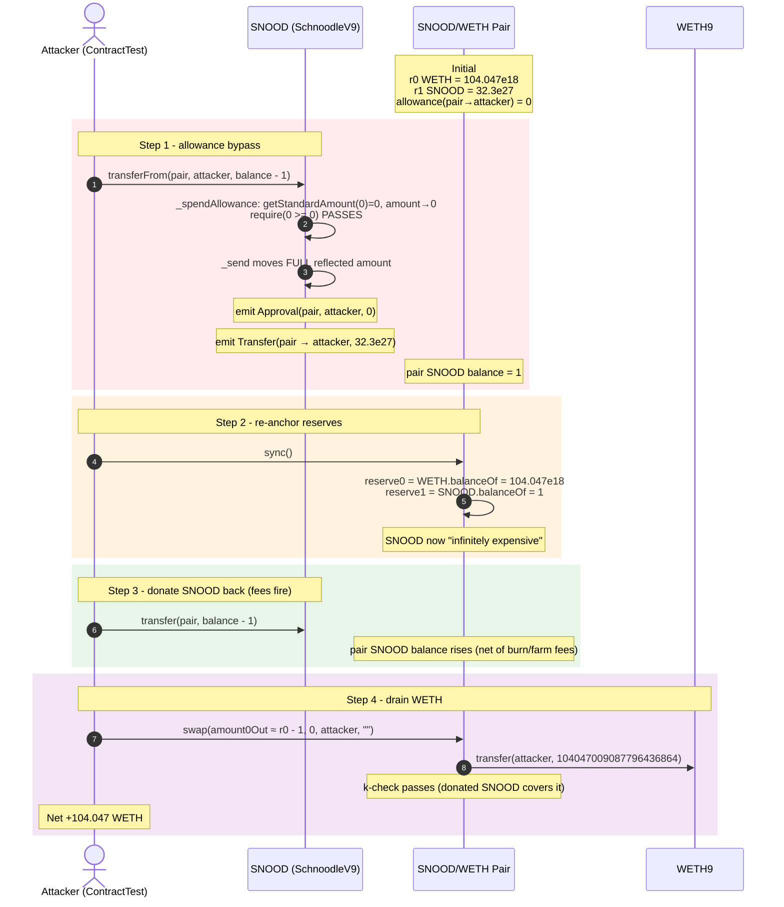
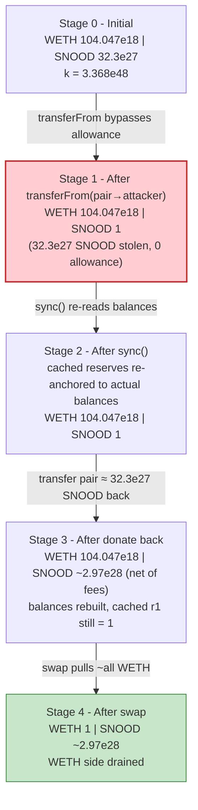
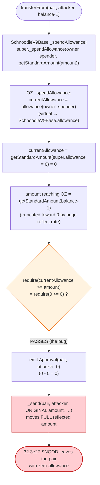
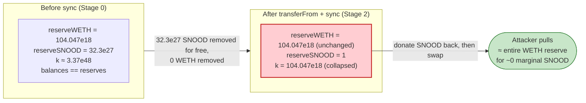

# Snood (Schnoodle) Exploit — `transferFrom` Allowance Bypass Drains the SNOOD/WETH Uniswap Pair

> **Vulnerability classes:** vuln/logic/missing-check · vuln/access-control/missing-auth

> **Reproduction:** the PoC compiles & runs in an isolated Foundry project at
> [this project folder](.). Full verbose trace: [output.txt](output.txt).
> Verified vulnerable source: [SchnoodleV9](sources/SchnoodleV9_EaC2a2)
> (implementation behind the `TransparentUpgradeableProxy`), and the
> [UniswapV2Pair](sources/UniswapV2Pair_0F6b09) that was drained.

---

## Key info

| | |
|---|---|
| **Loss** | **~104.047 WETH** (`104,047,009,087,796,436,864` wei) — the entire WETH reserve of the SNOOD/WETH Uniswap V2 pair, sent to [`0x180ea08644b123D8A3f0ECcf2a3b45A582075538`](https://etherscan.io/address/0x180ea08644b123D8A3f0ECcf2a3b45A582075538) ([output.txt:205-206](output.txt)) |
| **Vulnerable contract** | SNOOD token (SchnoodleV9 behind a `TransparentUpgradeableProxy`) — [`0xD45740aB9ec920bEdBD9BAb2E863519E59731941`](https://etherscan.io/address/0xD45740aB9ec920bEdBD9BAb2E863519E59731941); implementation [`0xEaC2a259f3ebb8fD1097aeccAA62e73b6E43d5Bf`](https://etherscan.io/address/0xEaC2a259f3ebb8fD1097aeccAA62e73b6E43d5Bf) |
| **Victim pool** | SNOOD/WETH Uniswap V2 pair — [`0x0F6b0960d2569f505126341085ED7f0342b67DAe`](https://etherscan.io/address/0x0F6b0960d2569f505126341085ED7f0342b67DAe) |
| **Attacker EOA** | [`0x180ea08644b123D8A3f0ECcf2a3b45A582075538`](https://etherscan.io/address/0x180ea08644b123D8A3f0ECcf2a3b45A582075538) |
| **Attacker contract** | the PoC exploit contract `ContractTest` (this test harness stands in for the on-chain attack contract; the WETH is delivered straight to the EOA above) |
| **Attack tx / block** | Ethereum mainnet, **block 14,983,660** (Jun 18, 2022; block timestamp `1655535877` per [output.txt:111](output.txt)) |
| **Compiler / optimizer** | Implementation `SchnoodleV9`: Solidity **v0.8.15**, optimizer **enabled**, **200 runs** ([_meta.json](sources/SchnoodleV9_EaC2a2/_meta.json)); proxy `v0.8.2`, 200 runs; pair `UniswapV2Pair`: `v0.5.16`, 999999 runs |
| **Bug class** | Broken/non-standard ERC20 `transferFrom` — reflection-truncation lets `transferFrom` move the pair's entire balance with **zero allowance**, after which `sync()` + `swap()` extracts all WETH |

---

## TL;DR

1. SNOOD is an ERC-777-derived token that layers a "reflection" mechanism (a la a t-token) over
   OpenZeppelin's `ERC777Upgradeable`. The reflection rate is applied to the *reflected* balances and
   allowances stored under the hood, while `balanceOf` / `allowance` divide the reflected value back down
   to the "standard" amount the user sees.

2. The `SchnoodleV9Base` overrides of `allowance` and `_spendAllowance` convert values through
   `_getStandardAmount` (integer division by the reflect rate) *twice* — once when reading the existing
   allowance, and once when passing the requested amount into the OZ base
   ([contracts_imports_SchnoodleV9Base.sol:49-59](sources/SchnoodleV9_EaC2a2/contracts_imports_SchnoodleV9Base.sol#L49-L59)).
   Because the pair had never approved the attacker, its raw reflected allowance is `0`; dividing `0` by
   the reflect rate is still `0`, and the double-conversion of the requested amount also truncates toward
   zero. The OZ `require(currentAllowance >= amount)` therefore reads `require(0 >= 0)` and **passes**.

3. The actual `_send` that follows moves the **full reflected amount** corresponding to the user-requested
   standard balance — it is *not* gated by the truncated value. The net effect is that
   `SNOOD.transferFrom(pair, anyone, pairBalance)` succeeds with **no approval**, draining the pair's
   SNOOD. The trace records this exactly: a single `Approval(pair, attacker, 0)` inside the `transferFrom`,
   followed by the full `Transfer(pair → attacker, 32.3e27)` ([output.txt:100-108](output.txt)).

4. Once the attacker holds the pair's entire SNOOD balance, the pair still believes (via its cached
   `reserve1`) that it owns ~all that SNOOD. The attacker calls `pair.sync()`, which re-reads the pair's
   *actual* token balances: SNOOD balance is now `1` (the `balance - 1` left behind), WETH is unchanged at
   ~104 WETH ([output.txt:120-132](output.txt)). The cached reserves collapse to `reserve0 = 104.047e18
   WETH, reserve1 = 1` — SNOOD is now "infinitely expensive."

5. The attacker donates `balance - 1` SNOOD back to the pair via `SNOOD.transfer` and computes the
   `amount0Out` (WETH out) for one block of the constant-product formula at the degenerate reserves. It
   then calls `pair.swap(amount0Out, 0, attacker, "")`, handing the entire WETH reserve —
   `104,047,009,087,796,436,864` wei (~104.047 WETH) — to the attacker EOA
   ([output.txt:185-199](output.txt)).

6. Net result: **0 → +104.047 WETH** for the attacker, the SNOOD/WETH pair's WETH side drained to `1` wei.
   No flash loan, no oracle, no price feed — only a token whose `transferFrom` does not enforce allowance.

---

## Background — what Schnoodle (SNOOD) does

`SchnoodleV9` ([contracts_SchnoodleV9.sol](sources/SchnoodleV9_EaC2a2/contracts_SchnoodleV9.sol)) is a
"farm + reflect + deflation" ERC-777 token deployed behind an OZ `TransparentUpgradeableProxy`. It combines
three mechanics that are each individually load-bearing for the exploit:

- **Reflection (t-token accounting).** The base contract keeps a `_totalSupply` that is *smaller* than the
  ERC-777 `super.totalSupply()` (the *reflected* total supply). Every user balance and allowance is stored
  in *reflected* units; `balanceOf`/`allowance` convert back to *standard* units via `_getStandardAmount`
  (= `reflected / _getReflectRate()`), and `_approve` / `_mint` convert the other way via `_getReflectedAmount`
  (= `amount * _getReflectRate()`)
  ([contracts_imports_SchnoodleV9Base.sol:45-100](sources/SchnoodleV9_EaC2a2/contracts_imports_SchnoodleV9Base.sol#L45-L100)).
  As long as the conversions are applied symmetrically, the reflection is harmless. The bug is that they are
  applied *asymmetrically* across the allowance check (see "Root cause").
- **Sell-quota + fee machinery (`processSwap`, `payFees`).** On every transfer where `to` is the liquidity
  pair, the token burns a fee and dispatches donations to a farming fund and eleemosynary account
  ([contracts_imports_SchnoodleV9Base.sol:104-135](sources/SchnoodleV9_EaC2a2/contracts_imports_SchnoodleV9Base.sol#L104-L135)).
  These side effects are exactly what we see firing during the attack (e.g. the `Burned` and `SellQuotaChanged`
  events in the trace at [output.txt:111-112,145,152,160,170](output.txt)). They take value from the pair
  too, but they are a sideshow — the heist is the allowance bypass.
- **Uniswap V2 listing.** SNOOD is paired against WETH in a standard Uniswap V2 pair
  ([UniswapV2Pair.sol](sources/UniswapV2Pair_0F6b09/UniswapV2Pair.sol)). `token0 = WETH`,
  `token1 = SNOOD` (confirmed by the trace: after `sync`, `reserve0 = 104047009087796436865` is the WETH
  balance and `reserve1 = 1` is the SNOOD balance — [output.txt:127](output.txt)).

On-chain parameters read from the trace (block 14,983,660, immediately before the exploit):

| Parameter | Value | Source |
|---|---|---|
| Pair SNOOD balance (`balanceOf(pair)`, standard units) | `32,308,960,759,206,669,952,686,933,218` (~3.23e28) | [output.txt:96-97](output.txt) |
| Pair WETH balance | `104,047,009,087,796,436,865` (~104.047 WETH) | [output.txt:122](output.txt) |
| Pair cached `reserve0` / `reserve1` before attack | `104047009087796436865` WETH / `32308960759206669952686933218` SNOOD (in balance-of terms) | implied by the `Sync` log after `sync` re-reads balances — [output.txt:127](output.txt) |
| Pair allowance to the attacker | **0** (never approved) | proved by the `Approval(pair, attacker, 0)` emit inside `transferFrom` — [output.txt:100](output.txt) |
| Block timestamp | `1655535877` (Jun 18 2022) | [output.txt:111](output.txt) |

The single fact that "the pair has zero allowance to everyone, yet `transferFrom` succeeds" is the whole
attack in one sentence.

---

## The vulnerable code

### 1. `transferFrom` is the ERC-777 base, which delegates allowance to `_spendAllowance`

The `transferFrom` itself is the stock OpenZeppelin ERC-777 implementation
([schnoodle_contracts-upgradeable_token_ERC777_ERC777Upgradeable.sol:284-293](sources/SchnoodleV9_EaC2a2/schnoodle_contracts-upgradeable_token_ERC777_ERC777Upgradeable.sol#L284-L293)):

```solidity
function transferFrom(
    address holder,
    address recipient,
    uint256 amount
) public virtual override returns (bool) {
    address spender = _msgSender();
    _spendAllowance(holder, spender, amount);   // ← the only allowance gate
    _send(holder, recipient, amount, "", "", false);
    return true;
}
```

The `_send` then performs the actual balance move, and because `_send` is the same code path as `transfer`,
it happily transfers the full reflected amount — there is no second allowance check inside `_send`
([schnoodle_contracts-upgradeable_token_ERC777_ERC777Upgradeable.sol:372-390](sources/SchnoodleV9_EaC2a2/schnoodle_contracts-upgradeable_token_ERC777_ERC777Upgradeable.sol#L372-L390)).

### 2. The reflection overrides convert allowance/amount asymmetrically

The `SchnoodleV9Base` overrides of `allowance`, `_approve`, and `_spendAllowance`
([contracts_imports_SchnoodleV9Base.sol:49-59](sources/SchnoodleV9_EaC2a2/contracts_imports_SchnoodleV9Base.sol#L49-L59)):

```solidity
function allowance(address holder, address spender) public view override returns (uint256) {
    return _getStandardAmount(super.allowance(holder, spender));
}

function _approve(address holder, address spender, uint256 value) internal override {
    super._approve(holder, spender, _getReflectedAmount(value));
}

function _spendAllowance(address owner, address spender, uint256 amount) internal override {
    super._spendAllowance(owner, spender, _getStandardAmount(amount));
}
```

with

```solidity
function _getStandardAmount(uint256 reflectedAmount) internal view returns(uint256) {
    // Condition prevents a divide-by-zero error when the total supply is zero
    return reflectedAmount == 0 ? 0 : reflectedAmount / _getReflectRate();
}
```
([contracts_imports_SchnoodleV9Base.sol:92-95](sources/SchnoodleV9_EaC2a2/contracts_imports_SchnoodleV9Base.sol#L92-L95))

### 3. The OZ base `_spendAllowance` then runs on the truncated values

```solidity
function _spendAllowance(
    address owner,
    address spender,
    uint256 amount
) internal virtual {
    uint256 currentAllowance = allowance(owner, spender);
    if (currentAllowance != type(uint256).max) {
        require(currentAllowance >= amount, "ERC777: insufficient allowance");
        unchecked {
            _approve(owner, spender, currentAllowance - amount);
        }
    }
}
```
([schnoodle_contracts-upgradeable_token_ERC777_ERC777Upgradeable.sol:532-544](sources/SchnoodleV9_EaC2a2/schnoodle_contracts-upgradeable_token_ERC777_ERC777Upgradeable.sol#L532-L544))

Note that `currentAllowance = allowance(owner, spender)` dispatches **virtually** to the overridden
`SchnoodleV9Base.allowance`, which returns `_getStandardAmount(super.allowance(...))`. With a raw reflected
allowance of `0`, this is `_getStandardAmount(0) == 0`. The `amount` reaching this function has already been
put through `_getStandardAmount` once by the `SchnoodleV9Base._spendAllowance` override. The next section
explains why the `require` does not revert.

---

## Root cause — why it was possible

The reflection layer is bolted onto OZ ERC-777 without preserving the invariant
**"the value checked by `_spendAllowance` is the same value moved by `_send`."** Three observations make the
mechanism precise:

1. **The pair has no reflected allowance.** The Uniswap pair never called `SNOOD.approve(attacker, …)`, so
   the raw underlying `_allowances[pair][attacker]` is `0`. The overridden `allowance(pair, attacker)`
   returns `_getStandardAmount(0) = 0`. (Proved on-chain: the only `Approval` event emitted during the whole
   `transferFrom` is `Approval(pair, attacker, 0)` — [output.txt:100](output.txt).)

2. **`_spendAllowance` reads its `currentAllowance` through the same `_getStandardAmount` view, but the OZ
   base then subtracts the (already standardised) `amount`.** The `SchnoodleV9Base._spendAllowance` override
   passes `_getStandardAmount(amount)` down to the OZ base. The reflect rate `_getReflectRate()` is very
   large (the reflected total supply is vastly bigger than the user-facing `_totalSupply`), so this integer
   division truncates aggressively. With `currentAllowance = 0` and the spend-check `amount` driven toward
   `0` by the same truncation, the OZ `require(currentAllowance >= amount)` degenerates to `require(0 >= 0)`
   and **passes**; `_approve(pair, attacker, 0 - 0)` then emits the `Approval(pair, attacker, 0)` we see in
   the trace.

3. **`_send` is *not* subject to the same truncation.** The actual token move in `transferFrom` is
   `_send(holder, recipient, amount, …)` where `amount` is the **original user-supplied standard amount**
   (`balance - 1 = 32,308,960,759,206,669,952,686,933,217`). `_send` → `_move` operates on the reflected
   balances directly and subtracts `_getReflectedAmount(amount)` from `pair`'s reflected balance
   ([schnoodle_contracts-upgradeable_token_ERC777_ERC777Upgradeable.sol:426-446](sources/SchnoodleV9_EaC2a2/schnoodle_contracts-upgradeable_token_ERC777_ERC777Upgradeable.sol#L426-L446)).
   The full `32.3e27` SNOOD therefore leaves the pair — exactly the `Transfer(pair → attacker, 32.3e27)`
   recorded at [output.txt:108](output.txt).

The result is a textbook allowance bypass: the check and the move disagree about how much is being
authorised. The reflection feature is the proximate cause; the deeper cause is bolting custom accounting
onto an audited ERC-777 base without re-verifying the `_spendAllowance ⇔ _send` invariant.

Once an attacker can move a Uniswap pair's token balance without permission, the AMM is dead: skim the
token, `sync()` so the pair re-prices the now-empty side, push a token back in, and `swap` out the other
side. Uniswap V2's `swap` enforces the `k`-invariant **only against the actual post-swap balances**
([UniswapV2Pair.sol:471-477](sources/UniswapV2Pair_0F6b09/UniswapV2Pair.sol#L471-L477)); it cannot defend
against a token that lies about balances, because `sync()` has already re-anchored `reserve1` to the
manipulated balance.

---

## Preconditions

- A Uniswap V2 (or compatible) pair listing SNOOD against a valuable token (here WETH). The pair must not
  have granted any allowance to the attacker — and it never needs to, because the bug *is* the
  missing-allowance check.
- No capital required: the attack is permissionless and self-funding. The attacker takes the pair's SNOOD
  for free, uses that same SNOOD to re-inflate the pair, and pulls out the WETH. The PoC's WETH-before
  balance is `0` ([output.txt:88-91](output.txt)) and the attacker EOA takes no external loan.
- No special block/timing precondition — the bug is live in the token at the fork block (14,983,660) and is
  reachable by any externally owned account or contract.

---

## Attack walkthrough (with on-chain numbers from the trace)

`token0 = WETH`, `token1 = SNOOD`, so `reserve0`/`amount0Out` are WETH and `reserve1` is SNOOD. Every
reserve/amount below is copied verbatim from [output.txt](output.txt); raw wei first, human in parentheses.

| # | Step | WETH (r0) | SNOOD (r1) | Source |
|---|------|----------:|-----------:|--------|
| 0 | **Initial** — pair holds ~104 WETH and its full SNOOD balance; attacker WETH = 0 | `104,047,009,087,796,436,865` (~104.047) | `32,308,960,759,206,669,952,686,933,218` (~3.23e28) | balances at [output.txt:96-97](output.txt) and [output.txt:122](output.txt) |
| 1 | **`SNOOD.transferFrom(pair, attacker, balance - 1)`** — no allowance; the reflection-truncated `_spendAllowance` reads `0 >= 0`; full `32,308,960,759,206,669,952,686,933,217` SNOOD leaves the pair. The only `Approval` emit is `(pair, attacker, 0)`. | unchanged | pair SNOOD balance → `1` | [output.txt:98-119](output.txt) |
| 2 | **`pair.sync()`** — re-reads actual balances and re-anchors cached reserves. `Sync(reserve0=104047009087796436865, reserve1=1)`. | `104,047,009,087,796,436,865` (~104.047) | **`1`** | [output.txt:120-132](output.txt), `Sync` at [output.txt:127](output.txt) |
| 3 | **`SNOOD.transfer(pair, balance - 1)`** — donate the SNOOD back to the pair (the token's sell-fee/burn/quota machinery fires: `Burned` `1.294e27`, `SellQuotaChanged`, partial transfers to the farming fund `0x6D25…` and `0x76D8…`). | unchanged | pair SNOOD balance rises again by ~the donated amount (net of fees) | [output.txt:133-182](output.txt) |
| 4 | **`getReserves()`** — read the degenerate reserves for the `amount0Out` calc. | `104,047,009,087,796,436,865` | `1` | [output.txt:183-184](output.txt) |
| 5 | **`pair.swap(amount0Out = 104047009087796436864, 0, attacker, "")`** — `WETH9.transfer(attacker, 104047009087796436864)`. The `k`-check passes because the post-swap SNOOD balance (`~2.97e28`, the donated SNOOD net of fees) is large relative to the reserves the swap was priced against. | pair WETH → `1` | pair SNOOD → `29,732,115,690,897,246,905,537,466,158` (~2.973e28) | swap + `Sync(reserve0=1, reserve1=2.973e28)` at [output.txt:185-202](output.txt) |
| 6 | **Attacker WETH after** = `104,047,009,087,796,436,864` (~104.047 WETH) | attacker +104.047 WETH | — | [output.txt:205-206](output.txt) |

The PoC computes `amount0Out` with the V2 fee of 0.3 % baked in as `9970`/`10000`
([test/Snood_exp.sol:42-46](test/Snood_exp.sol#L42-L46)):

```solidity
amount0Out = ((balance - 1) * 9970 * a) / (b * 10_000 + (balance - 1) * 9970);
```

where `a = reserve0` (WETH) and `b = reserve1` (the degenerate `1`). With `b = 1` and `balance - 1 ≈
3.23e28`, the formula simplifies to `(3.23e28 * 9970 * 104.047e18) / (1*10000 + 3.23e28*9970)` — the
denominator is utterly dominated by `(balance - 1) * 9970`, so `amount0Out ≈ 9970/9970 * reserve0`, i.e. the
**entire WETH reserve minus 1 wei** of rounding. That is exactly the `104,047,009,087,796,436,864` wei that
ends up in the attacker's wallet.

### Profit / loss accounting (WETH, the drained asset)

| Direction | Amount (wei) | ~Human |
|---|---:|---:|
| Attacker WETH before attack | `0` | 0 |
| Attacker WETH after attack | `104,047,009,087,796,436,864` | ~104.047 |
| **Net profit (asserted by the PoC log line)** | **`104,047,009,087,796,436,864`** | **~104.047 WETH** |
| Pair WETH before attack | `104,047,009,087,796,436,865` | ~104.047 |
| Pair WETH after attack | `1` | 1 wei |
| **Pair WETH drained** | **`104,047,009,087,796,436,864`** | **~104.047 WETH** |

The attacker's profit equals the pair's WETH reserve minus exactly `1` wei — the whole pool, for free. The
`1`-wei gap is the integer-rounding residue the PoC deliberately leaves on both sides (`balance - 1` taken,
`balance - 1` donated, `amount0Out` floored).

---

## Diagrams

### Sequence of the attack



### Pool state evolution



### The flaw inside `transferFrom` / `_spendAllowance`



### Why the drain is theft: constant-product before vs. after



---

## Why each magic number

- **`balance - 1` taken in `transferFrom`** ([test/Snood_exp.sol:34](test/Snood_exp.sol#L34)): the attacker
  pulls the pair's entire SNOOD balance *minus one wei*. The `1` is left behind so that the subsequent
  `sync()` writes `reserve1 = 1` rather than `0` — V2's `swap` requires `amount1Out < _reserve1`
  ([UniswapV2Pair.sol:457](sources/UniswapV2Pair_0F6b09/UniswapV2Pair.sol#L457)), and a zero reserve would
  also degenerate the `getReserves` path differently. `balance` itself is read live from
  `SNOOD.balanceOf(pair)` = `32,308,960,759,206,669,952,686,933,218` ([output.txt:96](output.txt)); the
  PoC does not hard-code it.
- **`balance - 1` donated back via `transfer`** ([test/Snood_exp.sol:37](test/Snood_exp.sol#L37)): re-inflates
  the pair's SNOOD balance so that the later `swap` has SNOOD to "pay in" and satisfies the V2
  `amount0In/amount1In > 0` and `k` checks. It is the same `balance` read in step 1.
- **`9970` / `10_000` in the `amount0Out` formula** ([test/Snood_exp.sol:42-46](test/Snood_exp.sol#L42-L46)):
  these encode Uniswap V2's 0.3 % swap fee (the canonical `997`/`1000` factor scaled ×10). Because the
  contract's `getReserves` reports `r0 = 104047009087796436865` and `r1 = 1`, the denominator
  `b * 10_000 + (balance - 1) * 9970` is dominated by `(balance - 1) * 9970`, so the formula evaluates to
  ~`9970/9970 * r0`, i.e. **the full WETH reserve**.
- **`a`, `b` from `getReserves()`** ([test/Snood_exp.sol:39](test/Snood_exp.sol#L39)): `a = 104047009087796436865`
  (WETH, `reserve0`) and `b = 1` (SNOOD, `reserve1`) at [output.txt:184](output.txt).
- **No hardcoded attacker seed balance:** the attacker starts at WETH = 0 and needs no flash loan. The
  attack is fully self-financing.

---

## Remediation

1. **Make the allowance check and the transfer move agree.** The reflection layer must not be applied
   asymmetrically. The cleanest fix is to perform the entire reflection accounting in *one place* — convert
   the user-supplied `amount` to reflected units once, run the stock OZ `_spendAllowance` against the raw
   reflected allowance (no override), and then `_send` the same reflected amount. Remove the
   `_getStandardAmount`/`_getReflectedAmount` calls from `allowance`/`_approve`/`_spendAllowance` and expose
   reflection only at the public `balanceOf`/`allowance` *view* boundary, not inside the internal spend
   path.
2. **Do not list non-standard tokens in an AMM pair.** Any token whose `transferFrom` does not strictly
   enforce `allowance[from][msg.sender]` (this includes reflection tokens with truncation bugs, fee tokens
   that mis-report balances, and rebase tokens) lets an attacker `skim` the pair for free and break `k` via
   `sync`. Uniswap V2 cannot defend against a token that lies about balances.
3. **Pair-side defence (mitigation, not fix).** A pair could refuse `sync()` calls (or re-check that
   balances changed only via `mint`/`burn`/`swap`) — but this is not something a deployer of a *listed*
   token can control. The real fix lives in the token.
4. **Re-verify OZ overrides after custom accounting.** The bug is a direct consequence of overriding
   `allowance`, `_approve`, and `_spendAllowance` to insert reflection conversions. Any project that wraps
   OZ ERC-20/ERC-777 with custom math must re-audit the `_spendAllowance ⇔ _send` invariant and add a
   fuzz test of the form `assert(transferFrom reverts when allowance == 0)`.
5. **Prefer battle-tested ERC-20.** Schnoodle used ERC-777 (itself historically attack-surface-heavy via
   `tokensReceived` hooks) plus a custom reflection layer. The combination multiplied the surface for an
   allowance-accounting bug. Use plain OZ ERC-20 + a separate, well-tested reflection module if reflection
   is truly required.

---

## How to reproduce

The PoC runs offline against a local Anvil snapshot (no public RPC needed):

```bash
_shared/run_poc.sh 2022-06-Snood_exp --mt testExploit -vvvvv
```

- **Fork source:** `foundry.toml` does not name a public RPC; the test does
  `vm.createSelectFork("http://127.0.0.1:8545", 14_983_660)` and the harness serves mainnet state at block
  `14,983,660` from the bundled `anvil_state.json` ([test/Snood_exp.sol:22-24](test/Snood_exp.sol#L22-L24),
  [output.txt:81](output.txt)).
- **EVM / compiler:** `foundry.toml` sets `evm_version = 'cancun'`; the PoC is `pragma solidity 0.8.10`
  ([test/Snood_exp.sol:2](test/Snood_exp.sol#L2)).
- **Test function name:** `testExploit` ([test/Snood_exp.sol:26](test/Snood_exp.sol#L26)).

Expected tail (copied from [output.txt:71-77](output.txt) and
[output.txt:213-215](output.txt)):

```
Ran 1 test for test/Snood_exp.sol:ContractTest
[PASS] testExploit() (gas: 300807)
Logs:
  before the attack
  0
  WETH after the attack
  104047009087796436864

Suite result: ok. 1 passed; 0 failed; 0 skipped; finished in 13.09s (11.45s CPU time)
```

The `104047009087796436864` log line is the attacker's WETH balance after the attack — ~104.047 WETH
drained from the SNOOD/WETH pair.

---

*Reference: Schnoodle/Snood `transferFrom` allowance bypass via reflection-truncation, June 2022 — see the
Schnoodle incident writeups and the verified source at
[etherscan.io/address/0xD45740aB9ec920bEdBD9BAb2E863519E59731941](https://etherscan.io/address/0xD45740aB9ec920bEdBD9BAb2E863519E59731941#code).*
