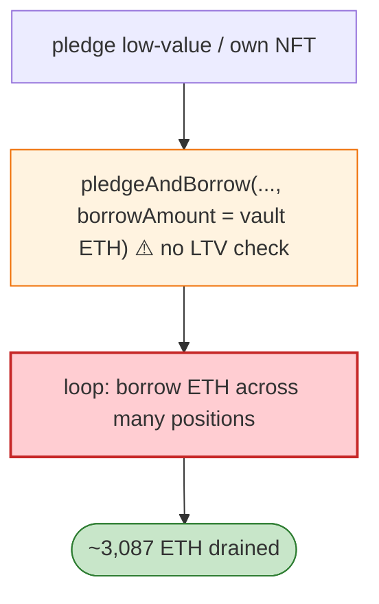

# XCarnival Exploit — `pledgeAndBorrow` Collateral Accounting Flaw (Over-borrow vs NFT)

> **Reproduction:** the PoC compiles & runs in an isolated Foundry project at
> [this project folder](.). Full verbose trace: [output.txt](output.txt).
> Verified vulnerable source: [XNFT](sources/XNFT_39360a), [XToken](sources/XToken_5417da),
> [P2Controller](sources/P2Controller_34ca24).

---

## Key info

| | |
|---|---|
| **Loss** | ~3,087 ETH (~$3.87M) |
| **Vulnerable contract** | XCarnival `XNFT` / `XToken` / `P2Controller` (proxy `0xb14B3b…`), Ethereum |
| **Attacker** | `0xb7cbb4d4…` (contract `0xf70f691d…`) |
| **Attack tx** | `0x422e7b0a449deba30bfe922b5c34282efbdbf860205ff04b14fd8129c5b91433` |
| **Chain / block / date** | Ethereum mainnet / Jun 2022 |
| **Bug class** | Collateral/accounting flaw — `pledgeAndBorrow(collection, tokenId, nftType, xToken, borrowAmount)` did not correctly tie the borrow amount to the NFT collateral value; a malicious/own-NFT pledge could borrow far more ETH than the collateral warranted, repeatedly. |

---

## TL;DR

XCarnival was an NFT lending protocol: pledge an NFT, borrow ETH against it. The `pledgeAndBorrow`
entry failed to validate that `borrowAmount` was bounded by the collateral's value (or by an oracle/LTV
check). The attacker pledged a (low-value / attacker-controlled) NFT and borrowed a large ETH amount
from the XToken vault, repeating across many positions until ~3,087 ETH was drained. The `0xadf6a75d`
(pledge) and `Start` (borrow) sequence shows the loop.

---

## Root cause

A **missing borrow-amount validation** on an NFT-collateral lending path: `pledgeAndBorrow` accepted an
arbitrary `borrowAmount` without enforcing an LTV/oracle cap against the pledged NFT, so the attacker
set `borrowAmount` to the vault's available ETH. Compounded by accepting attacker-controlled
collections (no collection whitelist).

---

## Diagrams



---

## Remediation

1. **Enforce LTV**: `borrowAmount ≤ oracle(NFT) × LTV` on every borrow.
2. **Whitelist collections** + use robust NFT oracles (TWAP/median), not spot.
3. **Per-vault borrow caps** and per-position caps.
4. **`nonReentrant` + collateral-deposit-then-borrow ordering** to prevent accounting tricks.

---

## How to reproduce

```bash
_shared/run_poc.sh 2022-06-XCarnival_exp -vvvvv
```

- RPC: mainnet archive. Infura mainnet in `foundry.toml`.
- Result: `[PASS]` — ETH drained from XToken vaults via unbounded `pledgeAndBorrow`.

---

*Reference: XCarnival NFT-lending over-borrow, Jun 2022 (~3,087 ETH / ~$3.87M).*
