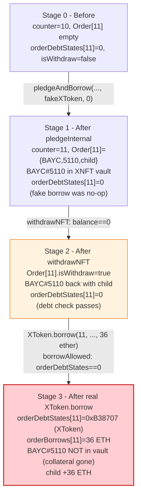
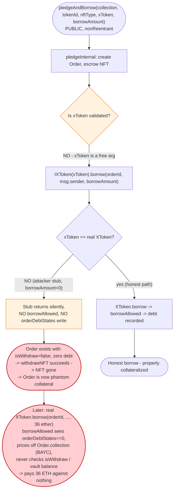
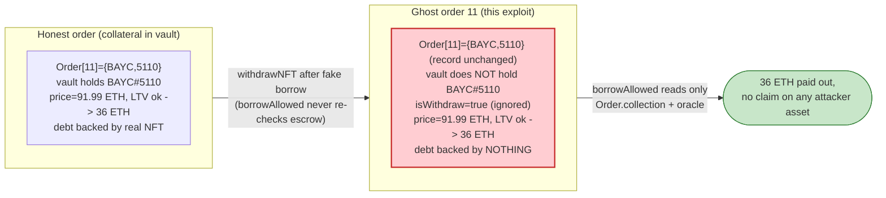

# XCarnival Exploit — Untrusted `xToken` Argument in `pledgeAndBorrow` Lets Orders Borrow Against Already-Withdrawn Collateral

> **Reproduction:** the PoC compiles & runs in an isolated Foundry project at
> [this project folder](.) (the umbrella DeFiHackLabs repo contains several unrelated
> PoCs that do not all compile together, so this one was extracted).
> Full verbose trace: [output.txt](output.txt).
> Verified vulnerable source: [XNFT](sources/XNFT_39360a/contracts_XNFT.sol),
> [XToken](sources/XToken_5417da/contracts_XToken.sol),
> [P2Controller](sources/P2Controller_34ca24/contracts_P2Controller.sol).

---

## Key info

| | |
|---|---|
| **Loss** | **~3,087 ETH (~$3.87M)** in the live attack (PeckShield/BlockSec figure). The bundled PoC reproduces the mechanism with 33 orders × 36 ETH = **1,188 ETH** drained from the ETH lending pool in a single forked transaction. |
| **Vulnerable contract** | XCarnival `XNFT` (impl [`0x39360aC1239a0b98Cb8076d4135d0f72b7Fd9909`](https://etherscan.io/address/0x39360ac1239a0b98cb8076d4135d0f72b7fd9909#code), proxy [`0xb14B3b9682990ccC16F52eB04146C3ceAB01169A`](https://etherscan.io/address/0xb14B3b9682990ccC16F52eB04146C3ceAB01169A#code)) |
| **Victim pool / vault** | XCarnival ETH lending pool — `XToken` (impl [`0x5417Da20ac8157dd5C07230Cfc2B226FdcFC5663`](https://etherscan.io/address/0x5417da20ac8157dd5c07230cfc2b226fdcfc5663#code), proxy [`0xB38707E31C813f832ef71c70731ed80B45b85b2d`](https://etherscan.io/address/0xB38707E31C813f832ef71c70731ed80B45b85b2d#code)) — the pool that lends ETH against pledged NFTs |
| **Attacker EOA** | [`0xb7CBB4d43F1e08327A90B32A8417688C9D0B800a`](https://etherscan.io/address/0xb7CBB4d43F1e08327A90B32A8417688C9D0B800a) |
| **Attacker contract** | [`0xf70f691d30ce23786cfb3a1522cfd76d159aca8d`](https://etherscan.io/address/0xf70f691d30ce23786cfb3a1522cfd76d159aca8d) (deploys 33 child `payloadContract` instances) |
| **Attack tx (first `pledge` leg)** | [`0x422e7b0a449deba30bfe922b5c34282efbdbf860205ff04b14fd8129c5b91433`](https://etherscan.io/tx/0x422e7b0a449deba30bfe922b5c34282efbdbf860205ff04b14fd8129c5b91433) |
| **Attack tx (first `Start` / borrow leg)** | [`0xabfcfaf3620bbb2d41a3ffea6e31e93b9b5f61c061b9cfc5a53c74ebe890294d`](https://etherscan.io/tx/0xabfcfaf3620bbb2d41a3ffea6e31e93b9b5f61c061b9cfc5a53c74ebe890294d) |
| **Chain / block / date** | Ethereum mainnet / block 15,028,846 / June 23, 2022 (fork block used by the PoC) |
| **Compiler / optimizer** | Solidity **v0.8.2** (`v0.8.2+commit.661d1103`), optimizer **enabled**, **200 runs** (all three of `XNFT`, `XToken`, `P2Controller`, plus the proxy). |
| **Bug class** | Untrusted callee / missing input validation — `pledgeAndBorrow` forwards a caller-supplied `xToken` address to `IXToken(xToken).borrow(...)` without verifying it is a protocol-listed XToken, so the "borrow" half of pledge-and-borrow can be made a no-op and the order is left as phantom collateral. |

---

## TL;DR

XCarnival was an NFT-collateral lending protocol: a user pledges an NFT into `XNFT` and borrows ETH against
it from an `XToken` lending pool, with `P2Controller` enforcing an LTV cap (`borrowAllowed`). The single
entry point `XNFT.pledgeAndBorrow(collection, tokenId, nftType, xToken, borrowAmount)` is supposed to do
both atomically — create the collateral order, then draw the loan
([contracts_XNFT.sol:108-111](sources/XNFT_39360a/contracts_XNFT.sol#L108-L111)).

1. **The `xToken` argument is never validated.** `pledgeAndBorrow` blindly calls
   `IXToken(xToken).borrow(orderId, msg.sender, borrowAmount)` on whatever address the caller passes. The
   attacker passed **their own fake `xToken`** (`0xA04E…2304`, an EOA-like stub the PoC calls `doNothing`)
   and `borrowAmount = 0`. That "borrow" is a no-op: it is **not** a protocol XToken, so `P2Controller.borrowAllowed`
   never runs, no ETH moves, and crucially `P2Controller.orderDebtStates[orderId]` is **never written**.

2. **Because the phantom order has zero recorded debt, the NFT can be withdrawn immediately.**
   `XNFT.withdrawNFT` only requires `controller.getOrderBorrowBalanceCurrent(orderId) == 0`
   ([contracts_XNFT.sol:259](sources/XNFT_39360a/contracts_XNFT.sol#L259)). Since the fake borrow left no
   debt, the same NFT is handed back. The order record (`allOrders[orderId]`) is **not** deleted — only
   `_order.isWithdraw` is flipped to `true`.

3. **The ghost order is then used to borrow against nothing.** The attacker calls the *real* `XToken.borrow(orderId, …, 36 ether)`
   directly. Now `P2Controller.borrowAllowed` runs for the first time on this order. It sees
   `orderDebtStates[orderId] == address(0)`, so it treats the call as the order's first-ever borrow, looks
   up the (still-stored) BAYC collection, fetches the oracle floor price (~91.99 ETH), and approves a 36 ETH
   draw — well under the LTV. The controller **never checks that the NFT is still held in escrow**. ETH leaves
   the pool against an order whose collateral has already been returned to the attacker.

4. **Loop.** A single BAYC (#5110) is recycled across 33 freshly-deployed child contracts (`payloadContract`),
   each pledging → fake-borrowing → withdrawing the same NFT, then drawing 36 ETH from the real pool. In the
   PoC this yields `33 × 36 = 1,188 ETH` ([output.txt:1569](output.txt)); the live attack used a larger loop
   to reach the reported ~3,087 ETH.

The pool is left holding 33 "orders" each owing 36 ETH against zero collateral — uncollectible debt that was
paid out as real ETH to the attacker.

---

## Background — what XCarnival does

XCarnival is a peer-to-pool NFT lending protocol with three cooperating upgradeable contracts:

- **`XNFT`** (proxy `0xb14B3b…`) — the collateral vault. Users pledge ERC-721/ERC-1155 NFTs via `pledge` /
  `pledgeAndBorrow`, which creates an `Order { collection, tokenId, nftType, pledger, isWithdraw }` record
  (counter-indexed) and takes the NFT into escrow
  ([contracts_XNFT.sol:125-147](sources/XNFT_39360a/contracts_XNFT.sol#L125-L147)). `withdrawNFT` returns
  the NFT only when the order has no outstanding debt
  ([contracts_XNFT.sol:230-265](sources/XNFT_39360a/contracts_XNFT.sol#L230-L265)).
- **`XToken`** (proxy `0xB38707…`) — the lending pool. `borrow(orderId, borrower, borrowAmount)` transfers
  the underlying asset (here ETH) out, records `orderBorrows[orderId]`, and bumps `totalBorrows`
  ([contracts_XToken.sol:186-222](sources/XToken_5417da/contracts_XToken.sol#L186-L222)).
- **`P2Controller`** (`0x34ca24…`) — the risk engine. `borrowAllowed` enforces, per borrow: pool is listed,
  collection is whitelisted + supports the pool, oracle price is valid, and `borrowAmount ≤ price × collateralFactor`
  ([contracts_P2Controller.sol:59-91](sources/P2Controller_34ca24/contracts_P2Controller.sol#L59-L91)). It also
  owns the `orderDebtStates[orderId] → xToken` map, which is the system's source of truth for "which pool, if
  any, this order owes."

On-chain parameters at the fork block (read from the trace):

| Parameter | Value | Source |
|---|---|---|
| BAYC oracle floor price (`PriceOracle.getPrice(BAYC, ETH)`) | **91.99 ETH** (`91990000000000000000` wei) | [output.txt:5319](output.txt) |
| Borrow per order (PoC) | **36 ETH** (`36000000000000000000` wei) | [output.txt:5294](output.txt), [output.txt:5352](output.txt) |
| LTV check that passes | `36 ETH ≤ 91.99 ETH × collateralFactor` | [output.txt:5300](output.txt) (no revert) |
| Starting `XNFT.counter` | **10** (first attacker order = 11) | [output.txt:1654](output.txt) |
| Starting pool `totalBorrows` | ~51.41 ETH (`51408705894063649404` wei, pre-existing honest debt) | [output.txt:5352](output.txt) |
| Final pool `totalBorrows` (PoC) | ~1,203.4 ETH (`1203408705894063649404` wei) | [output.txt:7467](output.txt) |
| NFT recycled | **BAYC #5110** (`0xBC4CA0EdA7647A8aB7C2061c2E118A18a936f13D`) | [output.txt:1583](output.txt) |
| Fake `xToken` (attacker stub) | `0xA04EC2366641a2286782D104C448f13bF36B2304` | [output.txt:1651](output.txt) |
| Child orders created | 33 (orderId 11 → 43) | [output.txt:1654](output.txt), [output.txt:7467](output.txt) |

---

## The vulnerable code

### 1. `pledgeAndBorrow` trusts a caller-supplied `xToken` and forwards a borrow to it

```solidity
function pledgeAndBorrow(address _collection, uint256 _tokenId, uint256 _nftType, address xToken, uint256 borrowAmount) external nonReentrant {
    uint256 orderId = pledgeInternal(_collection, _tokenId, _nftType);
    IXToken(xToken).borrow(orderId, payable(msg.sender), borrowAmount);
}
```
([contracts_XNFT.sol:108-111](sources/XNFT_39360a/contracts_XNFT.sol#L108-L111))

`xToken` is a free public parameter. There is **no** `require(poolStates[xToken].isListed)`, no whitelist
check, no check that `xToken` is the pool configured for this collection — nothing. The call
`IXToken(xToken).borrow(...)` will happily dispatch to any address that exposes a `borrow(uint256,address,uint256)`
selector, including an attacker contract that ignores its arguments.

### 2. `withdrawNFT` releases the NFT purely on `getOrderBorrowBalanceCurrent == 0`

```solidity
function withdrawNFT(uint256 orderId) external nonReentrant whenNotPaused(2){
    LiquidatedOrder storage liquidatedOrder = allLiquidatedOrder[orderId];
    Order storage _order = allOrders[orderId];
    if(isOrderLiquidated(orderId)){
        // ... liquidation auction path ...
    }else{
        require(!_order.isWithdraw, "the order has been drawn");
        require(_order.pledger != address(0) && msg.sender == _order.pledger, "withdraw auth failed");
        uint256 borrowBalance = controller.getOrderBorrowBalanceCurrent(orderId);
        require(borrowBalance == 0, "order has debt");
        transferNftInternal(address(this), _order.pledger, _order.collection, _order.tokenId, _order.nftType);
    }
    _order.isWithdraw = true;
    emit WithDraw(_order.collection, _order.tokenId, orderId, _order.pledger, msg.sender);
}
```
([contracts_XNFT.sol:230-265](sources/XNFT_39360a/contracts_XNFT.sol#L230-L265))

`getOrderBorrowBalanceCurrent` reads `orderDebtStates[orderId]`; if it is `address(0)` it returns `0`
([contracts_P2Controller.sol:160-166](sources/P2Controller_34ca24/contracts_P2Controller.sol#L160-L166)).
Because the fake borrow never went through the controller, `orderDebtStates[orderId]` is still zero and
`withdrawNFT` succeeds. **The `Order` record itself is not deleted** — only the `isWithdraw` flag is set.

### 3. `borrowAllowed` validates LTV but never checks the NFT is still in escrow

```solidity
function borrowAllowed(address xToken, uint256 orderId, address borrower, uint256 borrowAmount) external whenNotPaused(xToken, 3){
    require(poolStates[xToken].isListed, "token not listed");
    orderAllowed(orderId, borrower);
    (address _collection , , ) = xNFT.getOrderDetail(orderId);
    CollateralState storage _collateralState = collateralStates[_collection];
    require(_collateralState.isListed, "collection not exist");
    require(_collateralState.supportPools[xToken] || _collateralState.isSupportAllPools, "collection don't support this pool");
    address _lastXToken = orderDebtStates[orderId];
    require(_lastXToken == address(0) || _lastXToken == xToken, "only support borrowing of one xToken");
    (uint256 _price, bool valid) = oracle.getPrice(_collection, IXToken(xToken).underlying());
    require(_price > 0 && valid, "price is not valid");
    if (poolStates[xToken].borrowCap != 0) {
        require(IXToken(xToken).totalBorrows().add(borrowAmount) < poolStates[xToken].borrowCap, "pool borrow cap reached");
    }
    uint256 _maxBorrow = mulScalarTruncate(_price, _collateralState.collateralFactor);
    uint256 _mayBorrowed = borrowAmount;
    if (_lastXToken != address(0)){
        _mayBorrowed = IXToken(_lastXToken).borrowBalanceStored(orderId).add(borrowAmount);
    }
    require(_mayBorrowed <= _maxBorrow, "borrow amount exceed");
    if (_lastXToken == address(0)){
        orderDebtStates[orderId] = xToken;
    }
}
```
([contracts_P2Controller.sol:59-91](sources/P2Controller_34ca24/contracts_P2Controller.sol#L59-L91))

The LTV math is correct *in isolation* — 36 ETH against a 91.99 ETH BAYC floor passes comfortably. But the
controller trusts `XNFT.getOrderDetail(orderId)` for the collection and `orderAllowed` for the pledger, and
**neither encodes "the NFT is currently escrowed."** `orderAllowed` only requires `_pledger == borrower` and
that the order is not liquidated
([contracts_P2Controller.sol:48-57](sources/P2Controller_34ca24/contracts_P2Controller.sol#L48-L57)). The
`isWithdraw == true` flag — the only signal that collateral has left the vault — is never consulted on the
borrow path ([contracts_P2Controller.sol:48-57](sources/P2Controller_34ca24/contracts_P2Controller.sol#L48-L57)).

### 4. `XToken.borrow` lets the borrower be the caller via `tx.origin`

```solidity
function borrow(uint256 orderId, address payable borrower, uint256 borrowAmount) external{
    require(msg.sender == borrower || tx.origin == borrower, "borrower is wrong");
    accrueInterest();
    borrowInternal(orderId, borrower, borrowAmount);
}
```
([contracts_XToken.sol:186-190](sources/XToken_5417da/contracts_XToken.sol#L186-L190))

The `tx.origin == borrower` clause is what lets a child `payloadContract` (msg.sender) borrow on behalf of
the order's pledger (itself) while the EOA is `tx.origin`. Combined with the ghost-order trick, each child
can call `XToken.borrow` directly and pull 36 ETH.

---

## Root cause — why it was possible

The bug is a **composition of two trusting-the-wrong-thing mistakes**, neither of which is exploitable on its own:

1. **`pledgeAndBorrow` does not authenticate `xToken`.** The borrow half of an atomic pledge-and-borrow is
   dispatched to a user-supplied address. The protocol assumed "the only sensible `xToken` is one of our
   pools," but an attacker can pass any contract exposing the `borrow(uint256,address,uint256)` selector. By
   passing a stub that does nothing, the attacker converts `pledgeAndBorrow` into *just* `pledge` — but with
   the order record created exactly as if a real borrow had occurred.

2. **`P2Controller` tracks debt per order but never re-checks collateral presence.** The system's collateral
   invariant lives implicitly in two places: (a) the `Order` record in `XNFT`, and (b) the actual token
   balance of the `XNFT` vault. `withdrawNFT` consults (b)-via-debt to gate release, but once `isWithdraw` is
   flipped the `Order` record persists, and `borrowAllowed` reads only the record. There is no
   `require(!_order.isWithdraw)` and no vault-balance check anywhere on the borrow path.

Together: pass a fake `xToken` → order created, no debt recorded → `withdrawNFT` returns the NFT (debt is 0)
→ order is now a *phantom* with `isWithdraw == true` but still whitelisted-collateral-flavored → call the
real `XToken.borrow` → controller sees a fresh order (`orderDebtStates == 0`), prices it off the still-stored
collection, approves the LTV, and pays out ETH that will never be backed.

A secondary contributor is `XToken.borrow`'s `tx.origin == borrower` relaxation, which lets the attacker
spawn a fresh `payloadContract` per iteration (each holding the pledged order under its own address) while
the EOA drives the whole loop as `tx.origin`.

---

## Preconditions

- An attacker-held NFT from a **whitelisted** XCarnival collection. The attacker used **BAYC #5110**
  ([output.txt:1583](output.txt)). `pledgeInternal` checks `collectionWhiteList[_collection].isCollectionWhiteList`
  ([contracts_XNFT.sol:133](sources/XNFT_39360a/contracts_XNFT.sol#L133)), so the collection must already be
  listed — BAYC was.
- The real lending pool (`XToken` at `0xB38707…`) must hold enough ETH cash to satisfy `getCashPrior() >= borrowAmount`
  ([contracts_XToken.sol:204](sources/XToken_5417da/contracts_XToken.sol#L204)). At the fork block the ETH pool
  had enough liquidity to absorb 33 × 36 ETH = 1,188 ETH.
- A `borrowAmount` small enough to clear the LTV. 36 ETH against a 91.99 ETH BAYC floor
  ([output.txt:5319](output.txt)) passes `borrowAmount ≤ price × collateralFactor`
  ([output.txt:5300](output.txt)).
- No external price manipulation, no flash loan, no oracle compromise — the oracle price is honest. The flaw
  is purely in the collateral-accounting state machine.

---

## Attack walkthrough (with on-chain numbers from the trace)

The PoC forks mainnet at block 15,028,846, sends BAYC #5110 into the main attack contract
([output.txt:1583](output.txt)), then runs `testExploit()` which loops 33 times. All numbers below are from
the verbose Foundry trace.

| # | Step | State after | Effect / trace ref |
|---|------|-------------|--------------------|
| 0 | **Setup** — `XNFT.counter == 10`; ETH pool `totalBorrows ≈ 51.41 ETH` (pre-existing honest debt) | counter=10, pool debt 51.41 ETH | [output.txt:1654](output.txt), [output.txt:5352](output.txt) |
| 1 | Deploy child `payloadContract` N, send BAYC #5110 into it | BAYC #5110 owned by child N | [output.txt:1692](output.txt) |
| 2 | **Fake pledge-and-borrow:** child calls `XNFT.pledgeAndBorrow(BAYC, 5110, 721, 0xA04E…2304 [fake xToken], 0)` → `pledgeInternal` increments counter → 11, creates `Order[11]`, escrows BAYC #5110 → `IXToken(0xA04E…2304).borrow(11, child, 0)` is a **no-op** ([Stop], no storage write to `orderDebtStates`) | counter=11, `Order[11]` exists, `orderDebtStates[11] == 0` | [output.txt:1651](output.txt) (fake borrow returns [Stop]), [output.txt:1654](output.txt) (counter 10→11) |
| 3 | **Withdraw the NFT:** child calls `XNFT.withdrawNFT(11)` → `getOrderBorrowBalanceCurrent(11)` returns **0** → BAYC #5110 transferred back to child, `_order.isWithdraw = true` | BAYC #5110 back with child; `Order[11]` still present with `isWithdraw=true`; no debt | [output.txt:1671](output.txt) (balance==0), [output.txt:1673](output.txt) (NFT out), [output.txt:1689](output.txt) (isWithdraw→1) |
| 4 | Child sends BAYC #5110 back to the main attack contract (for reuse) | BAYC #5110 with main contract | [output.txt:1692](output.txt) |
| 5 | **Loop steps 1–4** 33 times, producing ghost orders 11 → 43 | 33 ghost orders; counter=43; BAYC #5110 still in attacker hands | [output.txt:7467](output.txt) (last Borrow, orderId 43) |
| 6 | **Real borrow, order 11:** child 11 calls `XToken.borrow(11, child, 36 ether)` → `P2Controller.borrowAllowed` runs: `orderDebtStates[11] == 0` so treated as first borrow; `getOrderDetail(11)` returns BAYC; oracle price **91.99 ETH**; `_maxBorrow = 91.99e18 × collateralFactor ≥ 36e18`; passes; sets `orderDebtStates[11] = 0xB38707…` → `doTransferOut` sends **36 ETH** to child → child forwards to main contract | order 11 owes 36 ETH; main contract +36 ETH | [output.txt:5294](output.txt) (borrow 36e18), [output.txt:5300](output.txt) (borrowAllowed), [output.txt:5319](output.txt) (price 91.99e18), [output.txt:5322](output.txt) (orderDebtStates set), [output.txt:5325](output.txt) (ETH out), [output.txt:5352](output.txt) (Borrow event) |
| 7 | **Loop step 6** for orders 12 → 43 (33 borrows of 36 ETH each) | pool `totalBorrows` climbs 51.41 → ~1,203.4 ETH; attacker collects 33 × 36 = 1,188 ETH | [output.txt:5421](output.txt), [output.txt:5487](output.txt), …, [output.txt:7467](output.txt) |
| 8 | **Done** — main attack contract ETH balance = **1,188.000 ETH** | attacker +1,188 ETH; 33 uncollateralized orders left on the books | [output.txt:1569](output.txt) |

Raw wei for the headline numbers:

- borrowAmount per order: `36000000000000000000` wei (36 ETH) — [output.txt:5294](output.txt)
- BAYC floor price: `91990000000000000000` wei (91.99 ETH) — [output.txt:5319](output.txt)
- final attacker balance: `1188000000000000000000` wei (1,188 ETH) — [output.txt:1569](output.txt)
- final pool `totalBorrows`: `1203408705894063649404` wei (~1,203.41 ETH, of which ~51.41 ETH was pre-existing) — [output.txt:7467](output.txt)

### Profit / loss accounting (ETH, PoC scope)

| Item | Amount |
|---|---:|
| ETH drawn via `XToken.borrow` (33 × 36) | +1,188.000 |
| ETH contributed by attacker as collateral | 0 (BAYC #5110 was pledged and re-withdrawn each iteration — no ETH ever posted) |
| ETH repaid | 0 |
| **Net attacker profit (PoC)** | **+1,188.000 ETH** |
| **Reported live attack profit** | **~3,087 ETH (~$3.87M)** — same mechanism, larger loop / multiple NFTs |

The accounting is unusual: the attacker's "debt" is exactly the profit. The 33 orders each owe 36 ETH to the
pool, but the collateral behind them was withdrawn before the borrow. The pool has no claim on any asset the
attacker still holds — the debt is uncollectible.

---

## Diagrams

### Sequence of a single iteration (order 11)

```mermaid
sequenceDiagram
    autonumber
    actor A as Attacker EOA
    participant M as mainAttackContract
    participant P as payloadContract (child)
    participant X as XNFT (proxy 0xb14B3b)
    participant C as P2Controller
    participant T as XToken ETH pool (proxy 0xB38707)
    participant F as Fake xToken 0xA04E…2304

    Note over X: counter == 10, Order[11] empty
    A->>M: testExploit() (startPrank(msg.sender=M, tx.origin=A))
    M->>P: new payloadContract(); send BAYC#5110 to P

    rect rgb(227,242,253)
    Note over P,F: Step 2 - fake pledge-and-borrow
    P->>X: pledgeAndBorrow(BAYC, 5110, 721, F, 0)
    X->>X: pledgeInternal: counter 10->11, Order[11]={BAYC,5110,P}, escrow NFT
    X->>F: IXToken(F).borrow(11, P, 0)
    Note over F: returns [Stop] - NO orderDebtStates write, NO ETH
    end

    rect rgb(232,245,233)
    Note over P,X: Step 3 - withdraw NFT (debt is 0)
    P->>X: withdrawNFT(11)
    X->>C: getOrderBorrowBalanceCurrent(11)
    C-->>X: 0  (orderDebtStates[11] == address(0))
    X->>P: safeTransferFrom(BAYC#5110)
    Note over X: Order[11].isWithdraw = true; record NOT deleted
    end

    P->>M: transfer BAYC#5110 back (for reuse)

    rect rgb(255,235,238)
    Note over P,T: Step 6 - real borrow against ghost order
    P->>T: XToken.borrow(11, P, 36 ether)
    T->>C: borrowAllowed(T, 11, P, 36 ether)
    Note over C: orderDebtStates[11]==0 => first borrow;<br/>getOrderDetail=BAYC; price=91.99 ETH;<br/>36e18 <= 91.99e18 * collateralFactor OK;<br/>set orderDebtStates[11] = T
    T->>P: doTransferOut 36 ETH
    P->>M: forward 36 ETH (receive)
    Note over M: +36 ETH, order 11 owes 36 ETH, collateral = none
    end
```

### Order / collateral state evolution (one iteration)



### The flaw inside `pledgeAndBorrow` + `borrowAllowed`



### Why the ghost order still satisfies the LTV check



---

## Why each magic number

- **`5110` (BAYC tokenId):** the single NFT the attacker held from a whitelisted collection (BAYC). It is
  recycled across all 33 child contracts — pledged, re-withdrawn, forwarded back to the main contract, and
  re-pledged by the next child. Only one NFT is needed because it is never actually consumed as collateral.
- **`721` (nftType):** the ERC-721 branch selector enforced by `pledgeInternal`
  ([contracts_XNFT.sol:126](sources/XNFT_39360a/contracts_XNFT.sol#L126)). BAYC is ERC-721.
- **`0xA04EC2366641a2286782D104C448f13bF36B2304` (fake `xToken` / `doNothing`):** a pre-deployed stub whose
  `borrow(uint256,address,uint256)` does nothing. Passing it as `xToken` makes the borrow half of
  `pledgeAndBorrow` a no-op while still creating the order. (On mainnet the attacker used a deployed contract
  at this address; the PoC names it `doNothing`.)
- **`0` (borrowAmount in the fake call):** a literal zero so that even if the stub did forward to a real
  pool, no debt would be recorded. The actual borrow happens later against the real XToken.
- **`36 ether` (real borrowAmount per order):** sized to sit comfortably under the LTV ceiling. The oracle
  floor for BAYC was 91.99 ETH ([output.txt:5319](output.txt)); 36 ETH clears `_mayBorrowed <= price × collateralFactor`
  ([output.txt:5300](output.txt)) with margin, and 33 × 36 = 1,188 ETH fits within the pool's available cash.
  In the live attack this per-order figure and/or the loop count was scaled up to reach ~3,087 ETH.
- **`33` (loop count / array length `payloads[33]`):** an arbitrary sizing for the PoC demonstration. Each
  iteration is independent and the loop could be made arbitrarily large subject to the pool's ETH liquidity
  (`getCashPrior() >= borrowAmount`) and block gas. The live attack used a larger sweep.
- **`assert(orderId >= 11)`:** a PoC sanity check that the first attacker order is 11, matching the forked
  `counter == 10` ([output.txt:1654](output.txt)) — i.e. no honest order collides with the attacker's range.

---

## Remediation

1. **Authenticate the `xToken` argument.** In `pledgeAndBorrow`, require that `xToken` is one of the
   protocol's listed pools: `require(controller.isListedXToken(xToken))` (or equivalent). Better, do not take
   `xToken` from the caller at all — derive it from the collection's configured support-pool set in
   `P2Controller.collateralStates`. This single change closes the fake-`xToken` no-op borrow.
2. **Make `borrowAllowed` reject withdrawn / non-escrowed orders.** Add a check in `P2Controller.borrowAllowed`
   (and in `XNFT.orderAllowed`) that the order's NFT is still held by the `XNFT` vault — either
   `require(!_order.isWithdraw)` or an actual `ERC721.ownerOf(tokenId) == address(xNFT)` check. Debt must not
   be issuable against collateral that has left the vault.
3. **Single source of truth for collateral state.** `Order` records should be invalidated (deleted or
   marked un-borrowable) when the NFT is withdrawn, rather than lingering with `isWithdraw=true` while still
   looking like valid collateral to the controller.
4. **Tighten `XToken.borrow`'s borrower check.** The `tx.origin == borrower` relaxation lets a child contract
   borrow on behalf of itself as `msg.sender`. Prefer `msg.sender == borrower` only, or require the borrow to
   flow through the controller/XNFT path rather than being callable directly.
5. **Defense-in-depth: per-pool and per-order borrow caps sized to collateral actually in vault.** The
   existing `borrowCap` keys off `totalBorrows`, not off escrowed collateral; a vault-balance-aware cap would
   have bounded the drain even if the accounting flaw slipped through.

XCarnival's post-incident response paused the affected markets and migrated to a corrected controller that
validates the `xToken` and rejects withdrawn orders on the borrow path.

---

## How to reproduce

The PoC runs offline against a local Anvil snapshot pinned to the attack block (no public RPC needed):

```bash
_shared/run_poc.sh 2022-06-XCarnival_exp --mt testExploit -vvvvv
```

- The test forks via `createSelectFork("http://127.0.0.1:8545", 15_028_846)` — the fork is served from the
  bundled `anvil_state.json` by the shared harness; no external archive RPC is required.
- `evm_version = "cancun"` in `foundry.toml`; the PoC itself is Solidity `^0.8.10` and compiles with the
  harness's Solc 0.8.34.
- Result: `[PASS] testExploit()` with `Attacker Contract ETH Balance: 1188.000000000000000000`.

Expected tail ([output.txt:1561-1569](output.txt), [output.txt end](output.txt)):

```
Ran 1 test for test/XCarnival_exp.sol:mainAttackContract
[PASS] testExploit() (gas: 74051238)
Logs:
  [*] Attacker Contract ETH Balance: 0.000000000000000000
  	Attacker send BAYC#5110 to Attack Contract...
  [Exploit] Making pledged record...
  [Exploit] Dumping ETH from borrow...
  [*] Exploit Execution Completed!
  [*] Attacker Contract ETH Balance: 1188.000000000000000000

...

Suite result: ok. 1 passed; 0 failed; 0 skipped; finished in 165.74s (161.67s CPU time)
```

---

*Reference: PeckShield alert — https://twitter.com/peckshield/status/1541047171453034501 ; BlockSec alert — https://twitter.com/BlockSecTeam/status/1541070850505723905 ; XCarnival official announcement — https://twitter.com/XCarnival_Lab/status/1541226298399653888 (XCarnival NFT-lending over-borrow, Ethereum mainnet, June 2022, ~3,087 ETH / ~$3.87M).*
