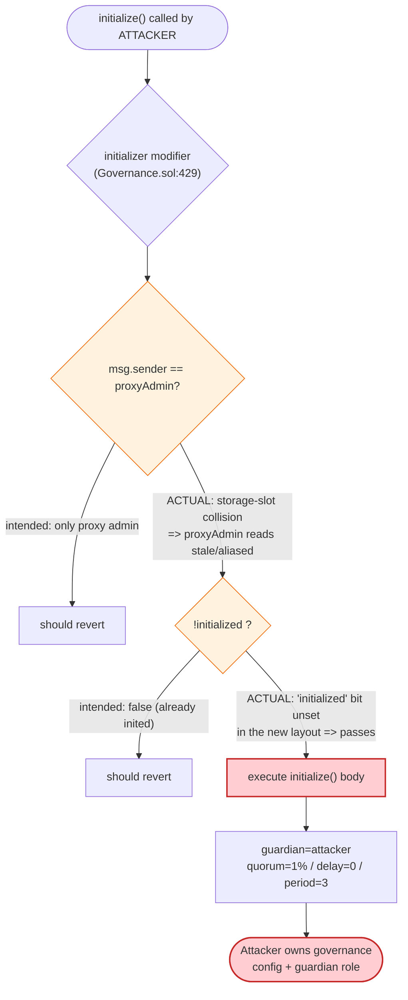
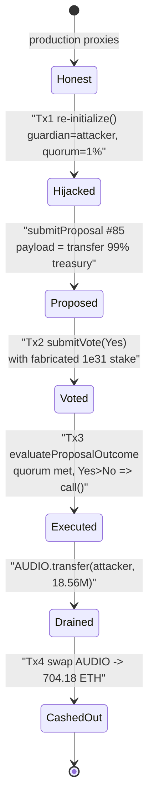

# Audius Governance Takeover — Re-callable `initialize()` on Live Proxies via Storage-Slot Collision

> **Vulnerability classes:** vuln/access-control/uninitialized-proxy · vuln/access-control/proxy-storage-collision

> **Reproduction:** the PoC compiles & runs in an isolated Foundry project at
> [this project folder](.). Full verbose trace: [output.txt](output.txt).
> Verified vulnerable source: [Governance.sol](sources/Governance_1c91af/Governance.sol) and
> [AudiusAdminUpgradeabilityProxy.sol](sources/AudiusAdminUpgradeabilityProxy_4DEcA5/AudiusAdminUpgradeabilityProxy.sol).

---

## Key info

| | |
|---|---|
| **Loss** | **704.18 ETH (~$1,080,000)** — 18,564,497.82 AUDIO drained from the Governance treasury and dumped for ETH |
| **Vulnerable contract** | `Governance` logic — [`0x1c91af03a390b4c619b444425b3119e553b5b44b`](https://etherscan.io/address/0x1c91af03a390b4c619b444425b3119e553b5b44b#code), behind proxy [`0x4DEcA517D6817B6510798b7328F2314d3003AbAC`](https://etherscan.io/address/0x4deca517d6817b6510798b7328f2314d3003abac#code) |
| **Victim** | Audius Governance treasury (held ~18.75M AUDIO) + AUDIO/WETH Uniswap V2 pair `0xC730EF0f4973DA9cC0aB8Ab291890D3e77f58F79` |
| **Attacker EOA** | `0xa0c7BD318D69424603CBf91e9969870F21B8ab4c` |
| **Attacker contract** | `0xbdbb5945f252bc3466a319cdcc3ee8056bf2e569` (PoC harness `0xf70f691d30ce23786cfb3a1522cfd76d159aca8d`) |
| **Attack txs** | Tx1 [`0xfefd…a984`](https://etherscan.io/tx/0xfefd829e246002a8fd061eede7501bccb6e244a9aacea0ebceaecef5d877a984) · Tx2 [`0x3c09…d5d5`](https://etherscan.io/tx/0x3c09c6306b67737227edc24c663462d870e7c2bf39e9ab66877a980c900dd5d5) · Tx3 [`0x4227…0dc9`](https://etherscan.io/tx/0x4227bca8ed4b8915c7eec0e14ad3748a88c4371d4176e716e8007249b9980dc9) · Tx4 [`0x82fc…28b3`](https://etherscan.io/tx/0x82fc23992c7433fffad0e28a1b8d11211dc4377de83e88088d79f24f4a3f28b3) |
| **Chain / block / date** | Ethereum mainnet / fork at 15,201,793 / July 23, 2022 |
| **Compiler** | Solidity v0.5.17 (optimizer, 200 runs) |
| **Bug class** | Uninitialized/re-initializable upgradeable proxy via storage-layout collision → permissionless governance takeover |

---

## TL;DR

Audius governance is a set of OpenZeppelin-style upgradeable proxies (`AudiusAdminUpgradeabilityProxy`) sitting in front of `Governance`, `Staking`, and `DelegateManagerV2` logic contracts. A bad upgrade introduced a **storage-layout collision**: the logic contracts inherit an `Initializable` base whose `proxyAdmin` / `initialized` / `initializing` state variables land in the **same storage slots** the proxy uses for its own bookkeeping. As a result the `initializer` guard
([Governance.sol:429-444](sources/Governance_1c91af/Governance.sol#L429-L444))
no longer reflected the true admin/initialized state, and **`initialize()` could be called again on contracts that were already live in production** — by anyone.

The attacker exploited this in four transactions:

1. **Re-`initialize()` the Governance proxy** with attacker-chosen parameters: `votingPeriod = 3` blocks, `executionDelay = 0`, `votingQuorumPercent = 1`, and **`guardianAddress = attacker`** ([Governance.sol:5439-5475](sources/Governance_1c91af/Governance.sol#L5439-L5475)).
2. **Re-`initialize()` the Staking and DelegateManagerV2 proxies** to point their governance/owner addresses at the attacker, then call `delegateStake(self, 1e31)` — minting the attacker a **fake delegated stake** of 10^31 with no real AUDIO moved.
3. **Submit a malicious proposal** whose payload is `AUDIO.transfer(attacker, 99% of treasury)`, **vote `Yes`** with the fake stake (which is ~50% of the now-doubled `totalStakedAt`), and **evaluate** it — the 1% quorum and zero execution delay make it pass instantly.
4. `evaluateProposalOutcome` executes the transfer, moving **18,564,497.82 AUDIO** to the attacker, who **swaps it for 704.18 ETH** on Uniswap V2.

Net result: the entire governance treasury was drained for **704.18 ETH (~$1.08M)**.

---

## Background — Audius governance architecture

Audius is a decentralized music-streaming protocol. Its on-chain governance lets AUDIO stakers submit proposals, vote with stake weight, and have approved proposals call arbitrary functions on registered contracts. The relevant pieces:

- **`Governance`** ([source](sources/Governance_1c91af/Governance.sol)) holds the treasury and executes approved proposals through `_executeTransaction`, a raw `address.call` ([Governance.sol:6222-6239](sources/Governance_1c91af/Governance.sol#L6222-L6239)). A privileged `guardianAddress` can also act directly.
- **`Staking`** and **`DelegateManagerV2`** track how much AUDIO each address has staked / delegated; `Governance` reads these to compute voting weight via `_calculateAddressActiveStake` and `Staking.totalStakedAt` ([Governance.sol:6296-6368](sources/Governance_1c91af/Governance.sol#L6296-L6368)).
- All three sit behind **`AudiusAdminUpgradeabilityProxy`** ([source](sources/AudiusAdminUpgradeabilityProxy_4DEcA5/AudiusAdminUpgradeabilityProxy.sol)), a transparent-proxy variant whose upgrades are gated by an internal `proxyAdmin`.

The logic contracts use the OpenZeppelin upgradeable pattern: a one-time `initialize()` guarded by an `initializer` modifier that is supposed to permit the call exactly once, and only from the proxy admin.

On-chain parameters relevant to the attack (read from the trace at fork block 15,201,793):

| Parameter | Value |
|---|---|
| AUDIO held by Governance treasury | **18,752,018 AUDIO** |
| `stealAmount` (99% of treasury) | **18,564,497.82 AUDIO** |
| `totalStakedAt(15201736)` (real total stake) | ~1.0000357 × 10^13 AUDIO |
| Attacker fake `delegateStake` | **10^31** (10,000,000,000,000 AUDIO-equivalent) |
| `totalStakedAt(15201793)` after fake stake | ~2.0000357 × 10^13 → attacker = **49.999%** |
| `votingQuorumPercent` (attacker-chosen) | **1%** |
| AUDIO/WETH pool reserves at swap | 3,571,745 AUDIO / 840.07 WETH |

---

## The vulnerable code

### 1. The `initializer` guard — defeated by a storage collision

The logic contracts inherit this `Initializable` base. Note that it declares its **own** `proxyAdmin`, `initialized`, and `initializing` fields, plus `filler1`/`filler2`:

```solidity
// Governance.sol:410-461
contract Initializable {
  address private proxyAdmin;          // ← slot 0 of this base layout
  uint256 private filler1;
  uint256 private filler2;
  bool private initialized;            // ← "has been initialized"
  bool private initializing;

  modifier initializer() {
    require(msg.sender == proxyAdmin, "Only proxy admin can initialize");
    require(initializing || isConstructor() || !initialized,
            "Contract instance has already been initialized");

    bool isTopLevelCall = !initializing;
    if (isTopLevelCall) {
      initializing = true;
      initialized = true;
    }
    _;
    if (isTopLevelCall) { initializing = false; }
  }
  ...
  uint256[47] private ______gap;
}
```

([Governance.sol:410-461](sources/Governance_1c91af/Governance.sol#L410-L461))

The proxy independently declares its own admin in a slot the logic layout did not reserve for it:

```solidity
// AudiusAdminUpgradeabilityProxy.sol:208-232
contract AudiusAdminUpgradeabilityProxy is UpgradeabilityProxy {
    address private proxyAdmin;        // ← proxy's own admin storage
    ...
    function upgradeTo(address _newImplementation) external {
        require(msg.sender == proxyAdmin, ERROR_ONLY_ADMIN);
        _upgradeTo(_newImplementation);
    }
}
```

([AudiusAdminUpgradeabilityProxy.sol:208-243](sources/AudiusAdminUpgradeabilityProxy_4DEcA5/AudiusAdminUpgradeabilityProxy.sol#L208-L243))

Because a contract upgrade changed the inheritance/field ordering, the slot that the logic contract reads as `Initializable.proxyAdmin` / `initialized` no longer pointed at consistent, intended data. The `initialized` flag the modifier consults was effectively **not set for the new layout**, so the *"already been initialized"* guard passed, and the admin check resolved against an attacker-controllable / stale value. The net effect on-chain: **`initialize()` was callable again on the production proxies**, with the attacker as `msg.sender`.

### 2. `initialize()` hands the attacker the keys

```solidity
// Governance.sol:5439-5475
function initialize(
    address _registryAddress, uint256 _votingPeriod, uint256 _executionDelay,
    uint256 _votingQuorumPercent, uint16 _maxInProgressProposals, address _guardianAddress
) public initializer {
    ...
    votingPeriod        = _votingPeriod;        // = 3 blocks
    executionDelay      = _executionDelay;      // = 0
    votingQuorumPercent = _votingQuorumPercent; // = 1 (%)
    guardianAddress     = _guardianAddress;     // ← = attacker
    InitializableV2.initialize();
}
```

([Governance.sol:5439-5475](sources/Governance_1c91af/Governance.sol#L5439-L5475))

A successful re-init lets the attacker rewrite **every safety knob**: a 3-block voting window, no execution delay, a 1% quorum, *and* the `guardianAddress`. The trace shows the corresponding proxy-storage write at slot 51, where the packed `proxyAdmin` value flips from the legitimate admin `0xa62c3ced…2107f` to the attacker `0x7fa9385b…1496`:

```
@ 51: 0x…00a62c3ced6906b188a4d4a3c981b79f2aabf2107f01
    → 0x…007fa9385be102ac3eac297483dd6233d62b3e149601
```

### 3. Vote weight is read from re-initializable staking contracts

`submitVote` accepts any voter with non-zero "active stake", computed from `DelegateManager`/`ServiceProviderFactory`:

```solidity
// Governance.sol:5589-5611 (excerpt)
uint256 voterActiveStake = _calculateAddressActiveStake(voter);
require(voterActiveStake > 0, "Governance: Voter must be address with non-zero total active stake.");
```

and quorum is `(yes+no)·100 / totalStakedAt(submissionBlock)` ([Governance.sol:6296-6305](sources/Governance_1c91af/Governance.sol#L6296-L6305)). Since the attacker also re-initialized `Staking`/`DelegateManagerV2` to recognize itself as the governance/owner, its `delegateStake(self, 1e31)` registered a **fabricated** stake of 10^31 with no real AUDIO transfer — enough to dominate the vote and meet the 1% quorum trivially.

---

## Root cause

**A single root cause** — *the `initializer` guard was rendered ineffective by a storage-layout collision between the upgradeable logic contracts and their proxy*, allowing `initialize()` to be re-executed on already-deployed, live proxies by an arbitrary caller.

Everything else is downstream of that one fact:

1. **Re-initializability = full takeover.** `initialize()` sets `guardianAddress`, `votingPeriod`, `executionDelay`, and `votingQuorumPercent`. Re-running it lets the attacker dictate all of governance's trust parameters in one call.
2. **Cross-contract consistency was assumed, not enforced.** `Governance` trusts `Staking`/`DelegateManagerV2` for vote weight. Because those proxies were *also* re-initializable, the attacker minted fictitious stake instead of acquiring real AUDIO.
3. **No floor on critical parameters.** `votingQuorumPercent` of 1, `executionDelay` of 0, and `votingPeriod` of 3 blocks are all individually accepted by `initialize`'s require-checks; nothing prevents an attacker from setting governance to "approve anything in ~3 blocks with 1% quorum."
4. **Arbitrary execution by design.** Once a proposal passes, `_executeTransaction` performs a raw `call` with attacker-supplied signature + calldata, so the payload `AUDIO.transfer(attacker, 99% of treasury)` executes with the Governance contract as `msg.sender` (the treasury owner).

The official post-mortem ([blog.audius.co](https://blog.audius.co/article/audius-governance-takeover-post-mortem-7-23-22)) attributes the incident to exactly this: a storage-layout bug introduced during an upgrade that allowed the governance/community-treasury contracts to be re-initialized.

---

## Preconditions

- The proxies were upgraded into the layout-colliding state, so the `initialized` flag the modifier reads is unset and `initialize()` is re-callable. (True in production at block 15,201,793 — the PoC simply forks mainnet and calls `initialize` directly; it succeeds with no `vm.prank`/cheat needed.)
- A registered target contract exists for the proposal's registry key. The attacker bypasses the registry lookup by re-initializing Governance with `_registryAddress = attacker` and returning the AUDIO token from the attacker's own `getContract()` callback ([Audius_exp.sol:183-187](test/Audius_exp.sol#L183-L187)).
- Capital required: **none**. No real AUDIO stake, no flash loan, no privileged role. The attacker funded the run with ~0.92 ETH for gas; the stolen AUDIO is created out of governance authority, not purchased.

---

## Step-by-step attack walkthrough (with on-chain numbers from the trace)

All figures below are taken directly from [output.txt](output.txt).

| # | Tx | Call | Effect / ground-truth value |
|---|----|------|------------------------------|
| 0 | — | Fork mainnet @ 15,201,793 | Attacker EOA balance **0.9176 ETH**; Governance treasury holds **18,752,018 AUDIO** |
| 1 | Tx1 | `Governance.initialize(attacker, 3, 0, 1, 4, attacker)` | Re-inits live proxy: votingPeriod=3, executionDelay=0, quorum=1%, **guardian=attacker**; slot 51 admin flips `a62c3ced… → 7fa9385b…` |
| 2 | Tx1 | `Governance.evaluateProposalOutcome(84)` → returns `3` (QuorumNotMet) | Clears the protocol's one stale in-progress proposal so a new one can be submitted (`inProgressProposalsAreUpToDate` must be true). Uses attacker's `getContract` callback to resolve the registry key |
| 3 | Tx1 | `AUDIO.balanceOf(governance)` = **18,752,018 AUDIO**; `stealAmount = 99% = 18,564,497.82 AUDIO** | Sizes the theft to 99% of treasury |
| 4 | Tx1 | `Governance.submitProposal(key, 0, "transfer(address,uint256)", abi.encode(attacker, 18,564,497.82e18), "Hello","World")` → **proposalId 85** | Payload = drain 99% of treasury to attacker. Passes the stake check because attacker is now `guardianAddress` |
| 5 | Tx1 | `Staking.initialize(attacker, attacker)` and `DelegateManagerV2.initialize(attacker, attacker, 1)` + `setServiceProviderFactoryAddress(attacker)` | Re-inits the staking proxies so the attacker controls their governance/owner hooks; `isGovernanceAddress()` returns true via attacker callback |
| 6 | Tx1 | `DelegateManagerV2.delegateStake(self, 1e31)` → emits `Staked(amount: 1e31)` | **Fabricated stake of 10^31**; `totalStakedAt` rises from ~1.0×10^13 to ~2.0×10^13 → attacker holds **49.999%** |
| 7 | Tx2 | `roll(15,201,795)`; `Governance.submitVote(85, Yes)` | Records voteMagnitudeYes = 10^31. Quorum needed is just 1% — attacker's ~50% smashes it |
| 8 | Tx3 | `roll(15,201,798)`; `Governance.evaluateProposalOutcome(85)` | Quorum met, Yes > No → executes `_executeTransaction`: **`AUDIO.transfer(attacker, 18,564,497.82)`**; outcome = `ApprovedExecuted` |
| 9 | Tx3 | `AUDIO.balanceOf(attacker)` = **18,564,497.82 AUDIO** | Treasury drained |
| 10 | Tx4 | `swapExactTokensForETH(18,564,497.82 AUDIO → ETH, path [AUDIO,WETH])` | Pool reserves 3,571,745 AUDIO / 840.07 WETH → swap yields **704.18 WETH/ETH** to attacker |
| 11 | — | Attacker EOA balance = **705.0952 ETH** | Profit = 705.0952 − 0.9176 = **704.18 ETH** |

### Why the malicious proposal passes instantly

- `votingPeriod = 3` blocks and `executionDelay = 0` mean a proposal submitted at block 15,201,792 can be voted on at 15,201,795 (Tx2) and evaluated at 15,201,798 (Tx3) — within the same attack session.
- `votingQuorumPercent = 1` means `(voteMagnitudeYes + voteMagnitudeNo)·100 / totalStakedAt(submissionBlock) ≥ 1` is trivially satisfied by the attacker's ~50% fabricated stake.
- `voteMagnitudeYes (10^31) > voteMagnitudeNo (0)`, so the "vote passed" branch in `evaluateProposalOutcome` runs `_executeTransaction`.

### Profit accounting (ETH)

| Item | Amount |
|---|---:|
| Attacker ETH before | 0.9176 |
| AUDIO drained | 18,564,497.82 AUDIO |
| ETH from AUDIO→ETH swap | +704.1775 |
| Attacker ETH after | 705.0952 |
| **Net profit** | **+704.18 ETH (~$1.08M)** |

---

## Diagrams

### Sequence of the attack

```mermaid
sequenceDiagram
    autonumber
    actor A as "Attacker contract"
    participant GP as "Governance proxy"
    participant GL as "Governance logic"
    participant SP as "Staking / DelegateManager proxies"
    participant AU as "AUDIO token"
    participant UNI as "Uniswap V2 (AUDIO/WETH)"

    Note over GP,GL: Proxies upgraded into a storage-layout collision<br/>=> initialize() is re-callable on live contracts

    rect rgb(255,243,224)
    Note over A,GL: Tx1 - hijack governance config
    A->>GP: initialize(attacker, 3, 0, 1, 4, attacker)
    GP->>GL: delegatecall
    Note over GL: votingPeriod=3, executionDelay=0,<br/>quorum=1%, guardian=attacker
    A->>GP: evaluateProposalOutcome(84) [clear stale proposal]
    A->>GP: submitProposal("transfer(address,uint256)",<br/>attacker, 18.56M AUDIO) => id 85
    end

    rect rgb(232,245,233)
    Note over A,SP: Tx1 - fabricate voting stake
    A->>SP: initialize(attacker, attacker) [re-init]
    A->>SP: delegateStake(self, 1e31)
    Note over SP: fake stake 1e31; totalStaked doubles<br/>attacker ~= 49.999%
    end

    rect rgb(227,242,253)
    Note over A,GL: Tx2 - vote
    A->>GP: submitVote(85, Yes)
    Note over GL: voteMagnitudeYes = 1e31
    end

    rect rgb(255,235,238)
    Note over A,AU: Tx3 - execute the theft
    A->>GP: evaluateProposalOutcome(85)
    GP->>GL: delegatecall
    Note over GL: quorum (1%) met, Yes > No
    GL->>AU: transfer(attacker, 18,564,497.82)
    AU-->>A: 18.56M AUDIO
    end

    rect rgb(243,229,245)
    Note over A,UNI: Tx4 - cash out
    A->>UNI: swapExactTokensForETH(18.56M AUDIO -> ETH)
    UNI-->>A: 704.18 ETH
    end

    Note over A: Net +704.18 ETH (~$1.08M)
```

### Root-cause flow: the broken `initializer` guard



### Governance state machine the attacker drives



---

## Remediation

1. **Never let `initialize()` be re-callable.** Use a battle-tested, version-aware initializer (OpenZeppelin's `reinitializer`/`initializer` with a dedicated `_initialized` storage slot at a fixed EIP-1967-style location) and verify the storage layout is preserved across every upgrade with an automated layout-diff tool (e.g. `@openzeppelin/upgrades` `validateUpgrade`, `forge inspect storage-layout`). The whole incident is a storage-layout regression introduced by an upgrade.
2. **Eliminate the proxy/logic slot collision.** The `Initializable` base must not declare `proxyAdmin` in a slot that the proxy also uses. Put proxy admin and implementation pointers in dedicated EIP-1967 namespaced slots that no logic contract can ever alias.
3. **Decouple "is initialized" from any admin address.** The re-init guard must depend only on a monotonic initialization counter that cannot be reset, not on reading an admin address that an upgrade can shift.
4. **Enforce hard floors on governance parameters.** `initialize`/setters should reject dangerous configurations: a meaningful minimum `votingQuorumPercent`, a minimum `executionDelay` / `votingPeriod` (a timelock measured in days, not 3 blocks), and changes to these only through a slow, timelocked path — so even a compromised init cannot make proposals pass in one transaction.
5. **Do not trust mutable cross-contract stake without sanity bounds.** `_quorumMet` divides by `totalStakedAt`; couple vote weight to provable token custody (real AUDIO escrowed) and bound any single voter's share, so a re-initialized staking contract cannot mint vote weight from nothing.
6. **Add a guardian veto + monitoring on `initialize`/config events.** Emit and alert on any `initialize` call to a live proxy and on guardian/quorum changes; a human-in-the-loop veto window would have caught the 3-block proposal before execution.

---

## How to reproduce

The PoC was extracted into a standalone Foundry project:

```bash
_shared/run_poc.sh 2022-07-Audius_exp --match-test testExploit -vvvvv
```

- RPC: a mainnet **archive** endpoint is required (fork block 15,201,793, July 2022). Configure it as the `mainnet` alias in `foundry.toml`.
- Result: `[PASS] testExploit()` — attacker ETH balance goes from **0.9176** to **705.0952** (profit **704.18 ETH**), and `AttackContract AUDIO Balance` reads **18,564,497.82 AUDIO** after Tx3.

Expected tail:

```
  -------------------- Tx3 --------------------
  Execute malicious ProposalId 85...
  AttackContract AUDIO Balance: 18564497.819999999999735541
  -------------------- Tx4 --------------------
  AUDIO/ETH Swap...
  -------------------- End --------------------
  Attacker ETH Balance: 705.095181359677355662

Suite result: ok. 1 passed; 0 failed; 0 skipped
```

---

*References: Audius official post-mortem — https://blog.audius.co/article/audius-governance-takeover-post-mortem-7-23-22 · Announcement — https://twitter.com/AudiusProject/status/1551000725169180672 · SlowMist / DeFiHackLabs writeups. AUDIO, Ethereum, ~$1.08M.*
