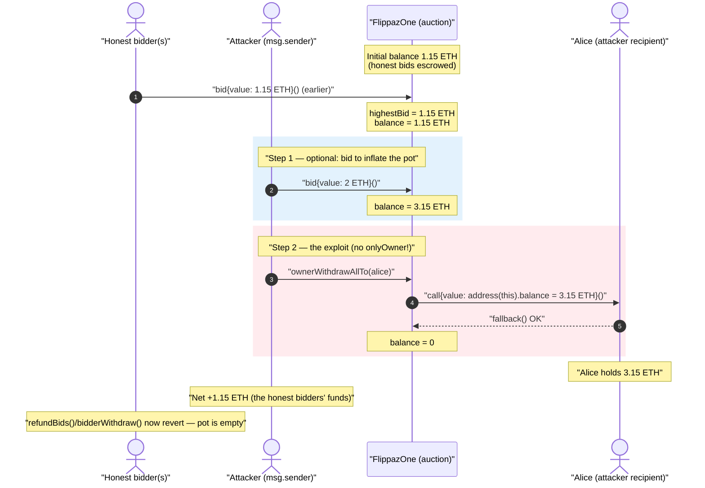
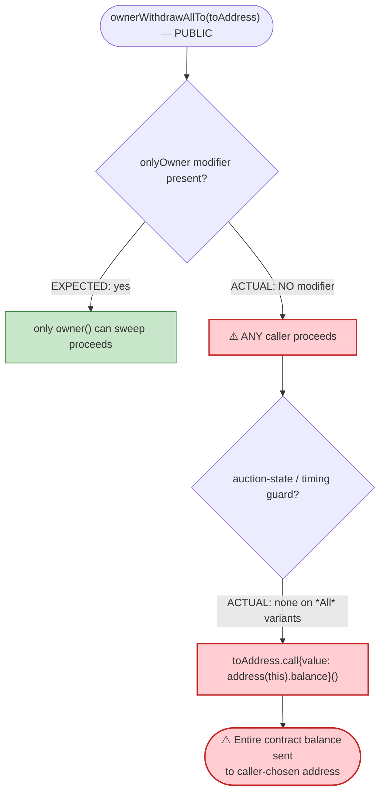
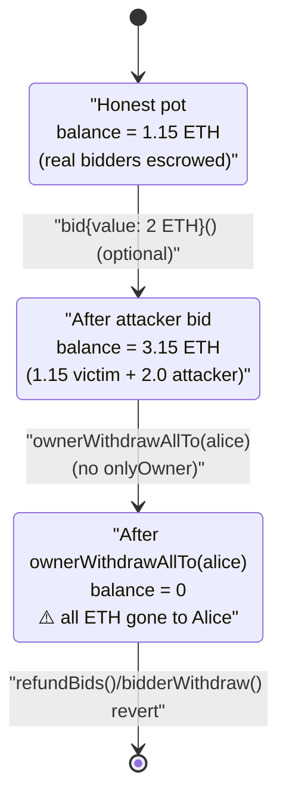

# FlippazOne Exploit — Missing `onlyOwner` on the Fund-Withdrawal Functions

> **Reproduction:** the PoC compiles & runs in an isolated Foundry project at
> [this project folder](.) (the umbrella DeFiHackLabs repo contains many unrelated
> PoCs that do not whole-compile under `forge test`, so this one was extracted).
> Full verbose trace: [output.txt](output.txt).
> Verified vulnerable source: [sources/FlippazOne_E85A08/FlippazOne.sol](sources/FlippazOne_E85A08/FlippazOne.sol).

---

## Key info

| | |
|---|---|
| **Loss** | The entire ETH balance held by the auction contract. In the forked PoC the contract held **1.15 ETH** of honest bidders' funds, and the attacker walked off with the full **3.15 ETH** balance (1.15 victim + its own 2.0 ETH bid), netting **+1.15 ETH** of other people's money. |
| **Vulnerable contract** | `FlippazOne` — [`0xE85A08Cf316F695eBE7c13736C8Cc38a7Cc3e944`](https://etherscan.io/address/0xE85A08Cf316F695eBE7c13736C8Cc38a7Cc3e944#code) |
| **Victim** | Anyone who placed a bid in the auction; their escrowed ETH sat in the contract balance with no access control protecting it. |
| **Attacker (PoC)** | `msg.sender` = `0x1804c8AB1F12E6bbf3894d4083f33e07309d1f38` (DefaultSender); withdrawal recipient `alice` = `0x7E5F4552091A69125d5DfCb7b8C2659029395Bdf` (`vm.addr(1)`) |
| **Chain / block / date** | Ethereum mainnet / **15,083,765** / ~July 2022 |
| **Compiler (deployed)** | Solidity **v0.8.15+commit.e14f2714**, optimizer enabled (200 runs) |
| **Bug class** | Broken access control — fund-moving functions missing the `onlyOwner` modifier (CWE-284 / SWC-105 unprotected withdrawal) |

---

## TL;DR

`FlippazOne` is a single-NFT (`MAX_SUPPLY = 1`) English-auction contract. Bidders send ETH via
`bid()`, and that ETH accumulates in the contract's balance until the owner withdraws the winning
proceeds. Four functions move that ETH out:

```solidity
function ownerWithdraw()                public { ... }
function ownerWithdrawTo(address)       public { ... }
function ownerWithdrawAll()             public { ... }
function ownerWithdrawAllTo(address)    public { ... }
```

Their names promise owner-only semantics, but **none of them carries the `onlyOwner` modifier**
([FlippazOne.sol:1342-1362](sources/FlippazOne_E85A08/FlippazOne.sol#L1342-L1362)). They are plain
`public` functions. `ownerWithdrawAllTo(toAddress)` simply forwards `address(this).balance` to an
arbitrary `toAddress` chosen by the caller — so **any account can drain the entire contract balance to
itself at any time**, with no preconditions.

The PoC: bid 2 ETH into a contract that already holds 1.15 ETH of honest bids, then call
`ownerWithdrawAllTo(alice)`. The contract's whole 3.15 ETH balance lands in `alice`. The attacker
recovers its own 2 ETH and pockets the 1.15 ETH of victim funds.

---

## Background — what FlippazOne does

`FlippazOne` ([source](sources/FlippazOne_E85A08/FlippazOne.sol)) is an `ERC721` + `Ownable` contract
that auctions off a single token:

- **Bidding** — `bid()` ([:1248-1267](sources/FlippazOne_E85A08/FlippazOne.sol#L1248-L1267)) is
  payable. Each bid adds `msg.value` to `bids[msg.sender]`, must beat `highestBid + minBidStep`
  (0.25 ETH), and the ETH stays in the contract. There is no per-bid escrow accounting that ties a
  specific balance to a specific bidder beyond the `bids` mapping.
- **Buy-now / end** — `buyNow()` and `endAuction()` mint the NFT to the winner and mark the auction
  ended.
- **Refunds** — `refundBids()` ([:1326-1335](sources/FlippazOne_E85A08/FlippazOne.sol#L1326-L1335))
  loops over losing bidders and returns their ETH after the auction ends. `bidderWithdraw()`
  ([:1364-1371](sources/FlippazOne_E85A08/FlippazOne.sol#L1364-L1371)) lets a non-winning bidder pull
  their own bid back.
- **Owner payout** — the four `ownerWithdraw*` functions are meant to let the project owner sweep the
  winning proceeds / leftover balance.

The contract correctly uses `onlyOwner` on its *administrative* setters — `editBaseUri`,
`editBuyNowMultipler`, `editMinBidStep`, `editDuration`, `startAuction`
([:1203-1237](sources/FlippazOne_E85A08/FlippazOne.sol#L1203-L1237)). The author clearly knew about
the modifier and applied it deliberately to the config functions. It was simply **forgotten on the
four functions that actually move money** — the highest-value functions in the contract.

State at the fork block (block 15,083,765): the auction is live, `bids` already contains
entries from real bidders, and `address(FlippazOne).balance == 1.15 ETH` (`1150000000000000000` wei,
visible in the first log line of [output.txt](output.txt)).

---

## The vulnerable code

### The four unprotected withdrawal functions

```solidity
function ownerWithdraw() public  {                                   // ← public, no onlyOwner
    require(auctionEnded || block.timestamp > auctionEndTimestamp, "Cannot withdraw until auction is ended");
    (bool success, ) = owner().call{value: highestBid}("");
    require(success, "Failed to withdraw funds.");
}

function ownerWithdrawTo(address toAddress) public  {                // ← public, no onlyOwner
    require(auctionEnded || block.timestamp > auctionEndTimestamp, "Cannot withdraw until auction is ended");
    (bool success, ) = toAddress.call{value: highestBid}("");         // arbitrary recipient
    require(success, "Failed to withdraw funds.");
}

function ownerWithdrawAll() public  {                                 // ← public, no onlyOwner
    (bool success, ) = owner().call{value: address(this).balance}("");
    require(success, "Failed to withdraw funds.");
}

function ownerWithdrawAllTo(address toAddress) public  {              // ← public, no onlyOwner
    (bool success, ) = toAddress.call{value: address(this).balance}(""); // ⚠️ ENTIRE balance → caller's choice
    require(success, "Failed to withdraw funds.");
}
```

[FlippazOne.sol:1342-1362](sources/FlippazOne_E85A08/FlippazOne.sol#L1342-L1362)

The most dangerous of the four is `ownerWithdrawAllTo`:

- It sends `address(this).balance` — i.e. **everything**, not just `highestBid`.
- It sends to a caller-supplied `toAddress` — so the caller doesn't even need to control the
  `owner()` address.
- It has **no timing precondition** — unlike `ownerWithdraw`/`ownerWithdrawTo`, it doesn't even
  require the auction to be over. It is callable at any moment of a live auction.

### Compare: the modifier *was* applied to admin setters

```solidity
function editMinBidStep(uint256 newMinBidStep) public onlyOwner{ ... }   // ← onlyOwner present
function startAuction() public onlyOwner{ ... }                          // ← onlyOwner present
```

[FlippazOne.sol:1212-1237](sources/FlippazOne_E85A08/FlippazOne.sol#L1212-L1237)

The contract inherits a fully working `Ownable` with the `onlyOwner` modifier
([:1082-1085](sources/FlippazOne_E85A08/FlippazOne.sol#L1082-L1085)). The fix was one keyword per
function; it was simply omitted on the fund-handling code.

---

## Root cause — why it was possible

Solidity functions default to the `public` visibility/permission of whatever access control you put on
them; there is no implicit "owner-only because the name starts with `owner`". The four
`ownerWithdraw*` functions encode the *intended* trust boundary purely in their **names**, and the
implementation forgot to enforce it with a modifier.

> A function called `ownerWithdrawAllTo` that forwards `address(this).balance` to an
> attacker-chosen address, with no `onlyOwner` and no auction-state precondition, is a public
> "send me all your ETH" button.

The composition of decisions that turned a naming convention into a critical bug:

1. **No `onlyOwner`.** The single missing modifier removes the entire access-control boundary.
2. **Arbitrary recipient.** `toAddress` is caller-controlled, so the attacker doesn't need to be (or
   compromise) `owner()` — it just names itself.
3. **`address(this).balance`, not `highestBid`.** The function drains the *whole* pot, including every
   other bidder's escrowed ETH, not merely the winning bid.
4. **No timing guard on the `*All*` variants.** `ownerWithdrawAll` / `ownerWithdrawAllTo` don't even
   require `auctionEnded`, so the funds can be swept while the auction is still active and bidders'
   ETH is still locked in.

The refund/escrow logic (`bids` mapping, `refundBids`, `bidderWithdraw`) is rendered meaningless: a
bidder's recorded `bids[...]` balance is just a number, while the actual ETH backing it has already
been carried off through the unprotected sweep.

---

## Preconditions

- The contract holds ETH (any `bid()` activity, or proceeds left in the contract). At the fork block
  it held **1.15 ETH** of honest bids.
- That's it. `ownerWithdrawAllTo` has **no access-control, no auction-state, and no timing
  precondition**. Any externally-owned account or contract can call it in a single transaction.
- The PoC's preliminary `bid{value: 2 ether}()` is **not required** for the exploit — it merely
  demonstrates that even the attacker's own freshly-deposited funds come straight back out, and it
  inflates the drained amount. A pure attacker could skip the bid and call `ownerWithdrawAllTo` on the
  existing 1.15 ETH directly.

---

## Attack walkthrough (with on-chain numbers from the trace)

All values are taken directly from the logs and call trace in
[output.txt](output.txt). 1 ETH = `1e18` wei.

| # | Step | Call | Contract ETH balance | Attacker / Alice gain |
|---|------|------|---------------------:|----------------------:|
| 0 | **Initial** | — | 1.15 ETH (`1.15e18`) | — |
| 1 | **Bid** (optional, inflates pot) | `FlippazOne.bid{value: 2 ETH}()` as `msg.sender` | 3.15 ETH (`3.15e18`) | attacker has 2 ETH escrowed |
| 2 | **Drain** | `FlippazOne.ownerWithdrawAllTo(alice)` | **0** | `alice` receives **3.15 ETH** via `fallback{value: 3.15e18}` |

Trace evidence (verbatim from [output.txt](output.txt)):

```
Before exploiting, ETH balance of FlippazOne Contract:: 1150000000000000000
After bidding,      ETH balance of FlippazOne Contract:: 3150000000000000000
After exploiting,   ETH balance of FlippazOne Contract:: 0
ETH balance of attacker Alice::                          3150000000000000000

├─ [98225] FlippazOne::bid{value: 2000000000000000000}()
│   └─ ← [Stop]
├─ [9816] FlippazOne::ownerWithdrawAllTo(0x7E5F4552091A69125d5DfCb7b8C2659029395Bdf)
│   ├─ [0] 0x7E5F...395Bdf::fallback{value: 3150000000000000000}()
│   │   └─ ← [Stop]
│   └─ ← [Stop]
```

Note the `bid()` call's storage diff at slot `19`
(`highestBid: 0x0ff5...0000 (1.15 ETH) → 0x1bc1...0000 (2 ETH)`) and slot `26`
(`totalBidAddresses: 1 → 2`) — confirming there was already one prior real bidder (the 1.15 ETH
`highestBid`) before the attacker arrived.

### Profit / loss accounting (ETH)

| Direction | Amount |
|---|---:|
| Attacker bid into the contract (step 1) | 2.00 |
| Attacker / Alice received from drain (step 2) | 3.15 |
| **Net to attacker** | **+1.15** |
| **Loss to honest bidder(s)** | **1.15** (their entire escrowed bid) |

The +1.15 ETH net profit equals, to the wei, the pre-existing honest-bidder balance — the attacker
simply walked off with everyone else's escrowed ETH, getting its own 2 ETH bid back in the process.
The auction contract is left with **0** ETH, so any subsequent `refundBids()` / `bidderWithdraw()`
call by a real bidder reverts on the ETH `call` (`"Failed to withdraw funds."`).

---

## Diagrams

### Sequence of the attack



### Permission decision inside `ownerWithdrawAllTo`



### Contract balance state evolution



---

## Remediation

1. **Add `onlyOwner` to every fund-moving function.** The minimal, complete fix:
   ```solidity
   function ownerWithdraw()             public onlyOwner { ... }
   function ownerWithdrawTo(address)    public onlyOwner { ... }
   function ownerWithdrawAll()          public onlyOwner { ... }
   function ownerWithdrawAllTo(address) public onlyOwner { ... }
   ```
   The contract already inherits a working `Ownable`/`onlyOwner`; this is a one-keyword-per-function
   change.
2. **Don't sweep escrowed bidder funds with `address(this).balance`.** The owner should only ever be
   able to withdraw the *settled winning proceeds* (e.g. `highestBid` after the auction has ended and
   the NFT delivered), never the full balance that still backs un-refunded losing bids. Track an
   explicit `pendingOwnerProceeds` accumulator and withdraw against that, so that `bids[...]` of losing
   bidders always remains fully collateralized.
3. **Gate withdrawals on auction state.** The `*All*` variants have no `auctionEnded` /
   `auctionEndTimestamp` precondition at all; even the owner should not be able to pull funds while the
   auction is live and bids are refundable.
4. **Adopt a pull-over-push settlement model.** Have each participant (winner pays, losers refund)
   withdraw their own balance via per-address accounting, eliminating any "withdraw the whole pot"
   surface entirely.
5. **Treat function naming as documentation, not enforcement.** A name like `ownerWithdraw*` must be
   backed by an actual modifier; add access-control unit tests asserting that calls from non-owner
   accounts revert.

---

## How to reproduce

The PoC was extracted into a standalone Foundry project (the umbrella DeFiHackLabs repo has many
unrelated PoCs that fail to whole-compile under `forge test`):

```bash
_shared/run_poc.sh 2022-07-FlippazOne_exp -vvvvv
```

- RPC: an Ethereum **mainnet archive** endpoint is required (the fork pins block 15,083,765, from
  ~July 2022). `foundry.toml` uses an Infura mainnet endpoint; any archive provider serving historical
  state at that block works. Pruned full nodes will fail with `header not found` / `missing trie node`.
- Result: `[PASS] testExploit()`.

Expected tail (from [output.txt](output.txt)):

```
Ran 1 test for test/FlippazOne_exp.sol:ContractTest
[PASS] testExploit() (gas: 137009)
Logs:
  Before exploiting, ETH balance of FlippazOne Contract:: 1150000000000000000
  After bidding, ETH balance of FlippazOne Contract:: 3150000000000000000
  After exploiting, ETH balance of FlippazOne Contract:: 0
  ETH balance of attacker Alice:: 3150000000000000000

Suite result: ok. 1 passed; 0 failed; 0 skipped
```

---

*Reference: DeFiHackLabs — FlippazOne, Ethereum, missing access control on `ownerWithdraw*`. SlowMist Hacked archive — https://hacked.slowmist.io/ .*
