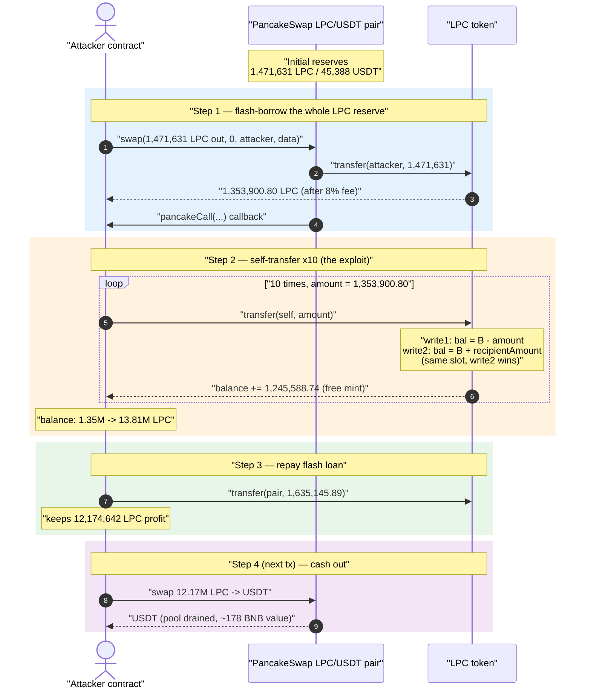
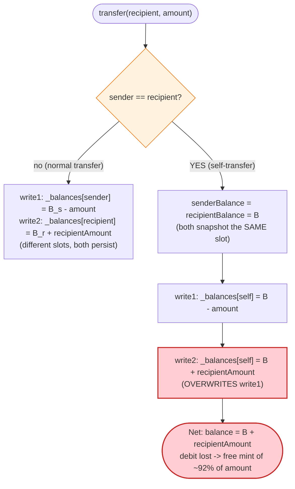
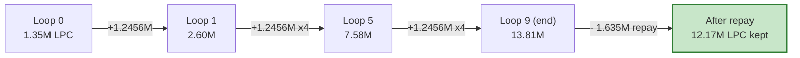

# LPC Token Exploit — Self-Transfer Balance Overwrite Mints Free Tokens

> **Reproduction:** the PoC compiles & runs in an isolated Foundry project at
> [this project folder](.). Full verbose trace: [output.txt](output.txt).
> Verified vulnerable source: [LPC.sol](sources/LPC_1E813f/LPC.sol).

---

## Key info

| | |
|---|---|
| **Loss** | ~178 BNB (≈ **$45,715**) — drained from the PancakeSwap LPC/USDT pool |
| **Vulnerable contract** | `LPC` token — [`0x1E813fA05739Bf145c1F182CB950dA7af046778d`](https://bscscan.com/address/0x1e813fa05739bf145c1f182cb950da7af046778d#code) |
| **Victim pool** | PancakeSwap LPC/USDT pair — [`0x2ecD8Ce228D534D8740617673F31b7541f6A0099`](https://bscscan.com/address/0x2ecD8Ce228D534D8740617673F31b7541f6A0099) |
| **Attacker EOA** | [`0xd9936EA91a461aA4B727a7e3661bcD6cD257481c`](https://bscscan.com/address/0xd9936EA91a461aA4B727a7e3661bcD6cD257481c) |
| **Attacker contract** | `0xcfb7909b7eb27b71fdc482a2883049351a1749d7` |
| **Attack tx** | [`0x0e970ed84424d8ea51f6460ce6105ab68441d4450a80bc8d749fdf01e504ed8c`](https://bscscan.com/tx/0x0e970ed84424d8ea51f6460ce6105ab68441d4450a80bc8d749fdf01e504ed8c) |
| **Chain / block / date** | BSC / fork at 19,852,596 / July 24, 2022 |
| **Compiler** | Solidity `^0.8.0` (token), `^0.8.10` (PoC) |
| **Bug class** | Aliased storage write in self-transfer (`_balances[sender]` debit overwritten by `_balances[recipient]` credit) → token self-minting |

---

## TL;DR

`LPC._transfer` reads the sender's and recipient's balances into **separate local variables**, then
writes them back to storage in two separate statements
([LPC.sol:1235-1236](sources/LPC_1E813f/LPC.sol#L1235-L1236)):

```solidity
_balances[sender]    = senderBalance.sub(amount);        // write 1: debit
_balances[recipient] = recipientBalance.add(recipientAmount); // write 2: credit
```

When `sender == recipient`, both refer to **the same storage slot**, and both `senderBalance` and
`recipientBalance` were snapshotted from that slot *before* either write. The second write
(`balance + recipientAmount`) silently clobbers the first (`balance − amount`). The intended debit
**never persists**. Net effect of a self-transfer of `amount`:

```
new balance = old balance + recipientAmount   (≈ old balance + 0.92·amount)
```

instead of staying flat. The attacker turned this into a money printer:

1. **Flash-borrow** essentially the entire LPC reserve of the PancakeSwap pair (≈ 1,353,900 LPC after
   the pair's own transfer fees) via `pair.swap(...)`.
2. **Self-transfer that whole balance to itself 10 times.** Each loop adds ≈ 1,245,588 LPC
   (`recipientAmount`) to its own balance for free. Balance climbs 1.35M → 13.81M LPC.
3. **Repay** the flash loan (≈ 1,635,145 LPC including the 10% Pancake flash fee), keeping
   **12,174,642 LPC** of pure profit.
4. (Per the PoC's closing log) **swap the minted LPC for USDT** in the next transaction, draining the
   pool's USDT — the realized ≈ 178 BNB loss.

The attacker is a **contract**, which matters: LPC treats contracts as non-reward-holders, so the
balance read on a contract returns the raw stored capital with no pending-reward complications,
making the overwrite math clean and deterministic.

---

## Background — what the LPC token does

`LPC` ([source](sources/LPC_1E813f/LPC.sol)) is a fee-on-transfer "social/referral" token. On every
non-whitelisted transfer it splits the amount into five fee buckets, computed in `_calcTransferFees`
([LPC.sol:1282-1296](sources/LPC_1E813f/LPC.sol#L1282-L1296)) against a `1e9` denominator. With the
constructor's `setFeeRates(2e7, 15e6, 2e7, 15e6, 1e7, 21_000_000e18)`
([LPC.sol:1055](sources/LPC_1E813f/LPC.sol#L1055), parameters
`burnRate, feeRate, holdersRate, parentRate, grandpaRate, burnStopSupply`):

| Bucket | Rate | Fraction of amount |
|---|---:|---:|
| `burnRate` | 20,000,000 | 2.0% |
| `feeRate` (to `feeTo`) | 15,000,000 | 1.5% |
| `holdersRate` (dividend) | 20,000,000 | 2.0% |
| `parentRate` (referrer) | 15,000,000 | 1.5% |
| `grandpaRate` (referrer's referrer) | 10,000,000 | 1.0% |
| **Total fees** | | **8.0%** |
| **Kept by recipient** | | **92.0%** |

The referral relationships are looked up from an external `IRlinkCore` contract via `rlink.parentOf`
([LPC.sol:1183](sources/LPC_1E813f/LPC.sol#L1183)). The attacker contract has **no parent**
(`parentOf` returns `address(0)`), so the `parent` + `grandpa` buckets are folded into the burn bucket
([LPC.sol:1213](sources/LPC_1E813f/LPC.sol#L1213)). The trace confirms this: each steady-state loop
emits a single burn `Transfer` of `60,925.53 LPC` = burn(2%) + parent(1.5%) + grandpa(1%) = 4.5%.

A second feature — a "rewardPerHolder" dividend accrual tracked in `balanceOf`
([LPC.sol:1079-1085](sources/LPC_1E813f/LPC.sol#L1079-L1085)) and `_updateBalance`
([LPC.sol:1265-1280](sources/LPC_1E813f/LPC.sol#L1265-L1280)) — only applies to **non-contract**
addresses (`_isValidRewardHolder`, [LPC.sol:1298-1300](sources/LPC_1E813f/LPC.sol#L1298-L1300)). For
the attacker contract it is inert, so it does not interfere with the core bug.

---

## The vulnerable code

### The aliased double-write in `_transfer`

```solidity
function _transfer(address sender, address recipient, uint256 amount) internal {
    ...
    (bool vs, uint senderBalance)    = _updateBalance(sender);     // reads _balances[attacker]
    (bool vr, uint recipientBalance) = _updateBalance(recipient);  // reads SAME slot (sender==recipient)
    ...
    require(senderBalance >= amount, "ERC20: transfer amount exceeds balance");

    uint recipientAmount = amount;
    if (sender != address(0) && recipient != address(0) && !isWhiteList[sender] && !isWhiteList[recipient]) {
        FeeAmounts memory feeAmounts = _calcTransferFees(amount);
        // ... deduct fee/holders/parent/grandpa/burn from recipientAmount ...
        // recipientAmount ends ≈ 92% of amount
    }

    totalHolders = totalHolders_;

    _balances[sender]    = senderBalance.sub(amount);              // (1) intended DEBIT
    _balances[recipient] = recipientBalance.add(recipientAmount);  // (2) CREDIT — overwrites (1)
    emit Transfer(sender, recipient, recipientAmount);
    ...
}
```

[LPC.sol:1144-1240](sources/LPC_1E813f/LPC.sol#L1144-L1240) — the two writes at
[LPC.sol:1235-1236](sources/LPC_1E813f/LPC.sol#L1235-L1236).

The bug is purely the **read-snapshot + dual-write to the same slot**:

- `senderBalance` and `recipientBalance` are both equal to `B` (the pre-transfer balance), because
  they are read from the same slot before any write.
- Statement (1) sets the slot to `B − amount`.
- Statement (2) immediately sets the *same* slot to `recipientBalance + recipientAmount = B + recipientAmount`.

Solidity executes them sequentially; statement (2) wins. The `−amount` debit is lost. Tokens are
created from nothing equal to `recipientAmount` per self-transfer.

A correct implementation must compute the net for the self-transfer case off the *already-updated*
slot value (e.g., `_balances[sender] = senderBalance - amount; _balances[recipient] = _balances[recipient] + recipientAmount;`),
or special-case `sender == recipient`.

---

## Root cause — why it was possible

Classic ERC20 implementations are immune to this because they perform the debit and credit against the
*live mapping*, not against two stale local snapshots:

```solidity
_balances[sender]    -= amount;          // reads current, writes back
_balances[recipient] += amount;          // reads the (now-updated) current, writes back
```

LPC instead:

1. **Snapshots both balances up front** into `senderBalance` / `recipientBalance` (so it can run the
   reward/holder bookkeeping in `_updateBalance` once per side), then
2. **Writes both back from those stale snapshots.**

For any transfer where `sender == recipient`, the snapshots are identical and the second write
overwrites the first. The debit vanishes and the recipient credit (the fee-reduced amount) becomes a
pure mint. Self-transfer is not blocked anywhere — `_transfer` only rejects the zero address
([LPC.sol:1149-1151](sources/LPC_1E813f/LPC.sol#L1149-L1151)), and `recipient == sender` is allowed.

The fee logic does *not* save the token, because fees take only ~8% while the overwrite credits ~92%
back to the same slot it forgot to debit — a strongly net-positive operation. Repeating it 10×
multiplies the attacker's balance roughly 10× over the loan amount.

---

## Preconditions

- **Self-transfer permitted.** `_transfer` does not reject `sender == recipient`.
- **A source of starting capital.** The attacker needed LPC to seed the loop; it flash-borrowed the
  pair's entire LPC reserve via `pair.swap(amount0Out, 0, to, data)` with a non-empty `data`
  payload, which triggers the `pancakeCall` flash-loan callback.
- **Attacker is a contract** (not a hard requirement for the overwrite itself, but it makes the
  reward-accrual path in `_updateBalance` inert and the arithmetic exact and predictable).
- **A liquid LPC/USDT market** to convert the minted LPC into value (the realized loss).

No admin keys, no approvals from victims, no oracle manipulation — the bug is a pure accounting flaw
in the token's own `transfer`.

---

## Attack walkthrough (with on-chain numbers from the trace)

All values are taken from [output.txt](output.txt). The PoC is
[test/LPC_exp.sol](test/LPC_exp.sol).

| # | Step | Attacker LPC balance | Notes |
|---|------|---------------------:|-------|
| 0 | **Start** | 0 | Fork block 19,852,596; pair reserves: **1,471,631.31 LPC**, **45,388.00 USDT** ([output.txt:46](output.txt)). |
| 1 | **Flash-borrow** `reserve − 1` LPC via `pair.swap(1,471,631.30…, 0, attacker, "⚡💰")` → `pancakeCall` | **1,353,900.80** | Pair's own 8% transfer fee shrinks the received amount from 1,471,631 → **1,353,900.80** LPC ([output.txt:71-73](output.txt)). |
| 2 | **Self-transfer loop, iter 0** — `transfer(self, 1,353,900.80)` | **2,599,489.54** | +`recipientAmount` 1,245,588.74; fees: feeTo 20,308.51, burn 60,925.54, dividend 27,078.02 ([output.txt:78-93](output.txt)). |
| 3 | iter 1 | **3,845,078.27** | Same constant `amount` reused each loop (captured once before the loop). |
| 4 | iter 2 | **5,090,667.01** | |
| 5 | iter 3 | **6,336,255.75** | |
| 6 | iter 4 | **7,581,844.48** | |
| 7 | iter 5 | **8,827,433.22** | |
| 8 | iter 6 | **10,073,021.96** | |
| 9 | iter 7 | **11,318,610.69** | |
| 10 | iter 8 | **12,564,199.43** | |
| 11 | iter 9 | **13,809,788.17** | After 10 loops ([output.txt:240-255](output.txt)). |
| 12 | **Repay flash loan** — `transfer(pair, 1,635,145.89)` | **12,174,642.27** | `paybackAmount = amount0/90/100*10000` covers the borrowed value + 10% Pancake flash fee ([test/LPC_exp.sol:60-61](test/LPC_exp.sol#L60-L61)); the pair credits 1,504,334.22 LPC net after fee ([output.txt:266](output.txt)). |
| 13 | **End of tx** | **12,174,642.27** | Matches `LPC balance: 12174642.273450718…` ([output.txt:25](output.txt), [output.txt:290-291](output.txt)). |
| 14 | **(Next tx)** swap 12.17M LPC → USDT | — | Console log "Next transaction will swap LPC to USDT" ([output.txt:292](output.txt)); realizes the ≈ 178 BNB loss against the pool's USDT side. |

### The per-loop arithmetic (verified against the trace)

For `amount = 1,353,900.800797… LPC`, with `parent`/`grandpa` folded into burn (attacker has no parent):

| Component | Rate | Value (LPC) | Matches trace event |
|---|---:|---:|---|
| `feeAmount` → `feeTo` | 1.5% | 20,308.512011961147238066 | `Transfer → 0xBEc3…fA7b` ✓ |
| `burn + parent + grandpa` → `0x0` | 4.5% | 60,925.536035883441714199 | burn `Transfer → 0x0` ✓ |
| `holdersAmount` (dividend pool) | 2.0% | 27,078.016015948196317422 | `DividendsPaid` amount ✓ |
| **`recipientAmount`** (credited back) | 92.0% | **1,245,588.736733617030601445** | self `Transfer` value ✓ |

Because the self-transfer writes `B + recipientAmount` (the debit is lost), each loop adds exactly
`recipientAmount`. Ten loops: `1,353,900.80 + 10 × 1,245,588.74 = 13,809,788.17`. Minus the
`1,635,145.89` repayment → **12,174,642.27 LPC**, to the wei. The mint is the difference between what
should have happened (balance roughly flat) and what did (balance grew by ~92% of `amount` each loop).

---

## Profit / loss accounting

| Item | Amount (LPC) |
|---|---:|
| Flash-borrowed (received after pair fee) | 1,353,900.80 |
| Minted by 10 self-transfers (10 × recipientAmount) | 12,455,887.37 |
| Subtotal before repayment | 13,809,788.17 |
| Flash-loan repayment (incl. 10% fee) | −1,635,145.89 |
| **Net LPC retained (free)** | **12,174,642.27** |

The 12.17M LPC of phantom tokens is then sold into the LPC/USDT pool (which held only ~45,388 USDT),
draining the pool — the reported realized loss of **~178 BNB (≈ $45,715)**. The loss is bounded by the
pool's USDT depth, not by the (much larger) amount of LPC the bug can mint.

---

## Diagrams

### Sequence of the attack



### The flaw inside `_transfer`



### Balance growth across the 10 self-transfers



---

## Why each step is sized the way it is

- **Flash-borrow `reserve − 1`:** the `−1` avoids tripping PancakeSwap's `INSUFFICIENT_LIQUIDITY`
  guard while taking the maximum possible seed capital ([test/LPC_exp.sol:39](test/LPC_exp.sol#L39)).
  More seed → more minted per loop, since each loop adds `0.92·amount`.
- **`amount` is captured once before the loop** and reused for all 10 transfers
  ([test/LPC_exp.sol:50-57](test/LPC_exp.sol#L50-L57)). Each loop therefore credits a *constant*
  `recipientAmount`, giving the clean arithmetic-progression growth in the table.
- **10 loops:** enough to inflate ~1.35M into ~13.8M while comfortably staying within block gas; the
  attacker only needed the result to exceed repayment plus the value extractable from the pool.
- **`paybackAmount = amount0/90/100*10000`:** grosses the borrowed value up by `10000/9000 ≈ 1.111×`
  to cover PancakeSwap's 10% flash-loan fee on the `swap`-based loan
  ([test/LPC_exp.sol:60-61](test/LPC_exp.sol#L60-L61)).

---

## Remediation

1. **Fix the aliased write — the core bug.** Never write both sides of a transfer from pre-read
   snapshots. Either special-case self-transfers, or apply debit then credit against the live mapping:
   ```solidity
   _balances[sender] = senderBalance - amount;            // persist debit first
   _balances[recipient] = _balances[recipient] + recipientAmount; // re-read after debit
   ```
   With this ordering a self-transfer reads `B − amount` for the credit step and nets to
   `B − amount + recipientAmount` (i.e. balance *decreases* by the fee, as intended).
2. **Reject or no-op self-transfers** explicitly: `require(sender != recipient, ...)` (or short-circuit
   to only burn the fee), removing the entire class of same-slot hazards.
3. **Add a supply invariant / unit test:** assert that `sum(_balances) + burned == totalSupply` after
   every transfer, including `transfer(self, x)`. A single self-transfer test would have caught this.
4. **Avoid fee-on-transfer arithmetic that re-reads stale balances.** If per-side bookkeeping
   (`_updateBalance`) must run before the write, recompute the slot value immediately before each
   `SSTORE` rather than from a captured local.
5. **Consider OpenZeppelin's audited ERC20 `_transfer`** as the base and layer fees on top using its
   debit-then-credit ordering, instead of a hand-rolled balance writer.

---

## How to reproduce

```bash
_shared/run_poc.sh 2022-07-LPC_exp -vvvvv
```

- RPC: a **BSC archive** endpoint is required (fork block 19,852,596 from July 2022 is long pruned by
  most public nodes; configure an archive RPC for the `bsc` alias in `foundry.toml`).
- Result: `[PASS] testExploit()` and the attacker's LPC balance grows from 0 to **12,174,642.27 LPC**.

Expected tail (see [output.txt](output.txt)):

```
  LPC balance: 12174642.273450718025425582

Next transaction will swap LPC to USDT
...
Suite result: ok. 1 passed; 0 failed; 0 skipped; finished in 9.33s
```

---

*Reference: PAnews — https://www.panewslab.com/zh_hk/articledetails/uwv4sma2.html ; Beosin Alert —
https://twitter.com/BeosinAlert/status/1551535854681718784 (LPC, BSC, ~$45.7K / 178 BNB).*
