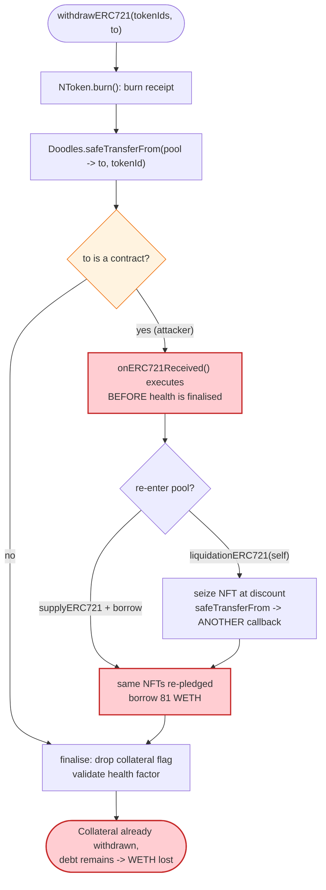
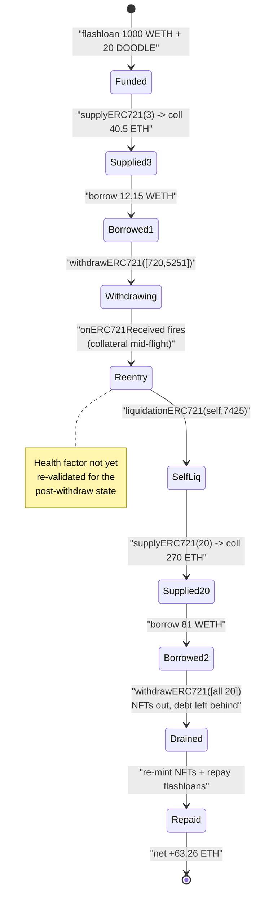

# Omni Protocol Exploit — NFT-Lending Re-Entrancy via `withdrawERC721` / `liquidationERC721`

> **Reproduction:** the PoC compiles & runs in an isolated Foundry project at
> [this project folder](.) (the umbrella DeFiHackLabs repo contains many PoCs
> that do not whole-compile, so this one was extracted/isolated).
> Full verbose trace: [output.txt](output.txt).
> The exploited contract is the Omni lending `Pool` behind the proxy
> [`0xEBe72CDafEbc1abF26517dd64b28762DF77912a9`](https://etherscan.io/address/0xEBe72CDafEbc1abF26517dd64b28762DF77912a9)
> (the `Pool` implementation source was not Etherscan-verified at the time the
> sources were fetched, so only the proxy and its peripheral OZ/Omni
> upgradeability contracts are in [sources/](sources/) — the analysis below is
> reconstructed from the on-chain `-vvvvv` trace).

---

## Key info

| | |
|---|---|
| **Loss** | **≈ 63.26 ETH net profit** to the attacker in this single replayed transaction (the live incident on 2022-07-10 totalled ~1,300 ETH / ~$1.4M across multiple txs) |
| **Vulnerable contract** | Omni `Pool` (Paraspace-style NFT lending fork) behind proxy [`0xEBe72CDafEbc1abF26517dd64b28762DF77912a9`](https://etherscan.io/address/0xEBe72CDafEbc1abF26517dd64b28762DF77912a9) — implementation `0x5070F878a39162Ff22fb04F52fd3C50d76758547` (withdraw path) / `0x46FC17Be725Ec5634e1a0efb14B5246B9e96125f` (liquidation path) |
| **Victim collateral** | Doodles ERC-721 (`0x8a90CAb2b38dba80c64b7734e58Ee1dB38B8992e`) + WETH reserve borrowed from the pool |
| **NFT source** | NFTX Doodle vault (`DOODLE`) BeaconProxy `0x2F131C4DAd4Be81683ABb966b4DE05a549144443` (flash-loaned 20 DOODLE / redeemed 20 Doodles NFTs) |
| **Flash-loan provider** | Balancer Vault `0xBA12222222228d8Ba445958a75a0704d566BF2C8` (1,000 WETH) + NFTX vault flashLoan |
| **Attacker EOA** | `0x70e91D8782aa3C9F25E0bff85d68F1 aa...` (historical; the PoC replays from a Foundry `msg.sender`) |
| **Attack tx (PoC fork)** | mainnet fork @ block **15,114,361** |
| **Chain / date** | Ethereum mainnet / **2022-07-10** |
| **Compiler (PoC build)** | Solc 0.8.34 (test harness); the live pool was Solidity 0.8.10 |
| **Bug class** | Cross-function re-entrancy in an NFT money-market: NFT is transferred to the borrower (firing `onERC721Received`) **before** the position's solvency/state is finalised, letting the attacker re-supply the same NFTs and self-liquidate at a discount |

---

## TL;DR

Omni was an NFT-collateralised money market (a Paraspace-style fork). When a user
withdraws collateral via `withdrawERC721`, the pool **burns the user's nToken and
`safeTransferFrom`s the underlying NFT to the recipient** — and the ERC-721
`safeTransferFrom` fires the recipient's `onERC721Received` hook **while the
withdraw's bookkeeping / health-factor enforcement is still mid-flight**.

The attacker abuses this re-entrancy window two ways, nested:

1. **Self-liquidation re-entrancy.** Inside `onERC721Received` (triggered by a
   `withdrawERC721`), the attacker calls `liquidationERC721` on **its own**
   position. The liquidation seizes the collateral NFT for the discounted
   liquidation price and `safeTransferFrom`s that NFT back to the liquidator —
   re-entering `onERC721Received` yet again.
2. **Collateral re-use.** In the deepest callback the attacker re-`supplyERC721`s
   **all 20 Doodles** as fresh collateral (`Pool::supplyERC721` →
   `getUserAccountData` reports 270 ETH collateral) and `borrow`s **81 WETH**
   against NFTs it is, at that very moment, in the middle of pulling out of the
   pool. The same NFTs back two borrows (12.15 WETH then 81 WETH) and are then
   fully withdrawn, leaving the pool with the debt and none of the collateral.

Because every NFT and every WETH leg is sourced from flash loans (Balancer 1,000
WETH + NFTX 20-DOODLE flashLoan), the whole thing nets out inside one
transaction: the attacker repays the flash loans and walks away with
**63.26 ETH** of the pool's WETH liquidity ([output.txt:4779](output.txt) —
`WETH9::withdraw(63261234230832897000)`).

---

## Background — what Omni does

Omni is an NFT lending pool modelled on Aave-v3 / Paraspace. Relevant primitives
(reconstructed from the trace and the `IOmni` interface in
[interface.sol:4948](interface.sol#L4948)):

- **`supplyERC721(asset, tokenData[], onBehalfOf, referralCode)`** — deposit
  NFTs; the pool mints an **nToken** (`NToken`, an ERC-721 receipt) to the
  supplier and marks each tokenId `useAsCollateral`. Trace: `NToken::mint(...)`
  at [output.txt:2565](output.txt).
- **`borrow(asset, amount, rateMode, ref, onBehalfOf)`** — borrow an ERC-20
  (here WETH) against supplied NFT collateral, minting a `VariableDebtToken`.
- **`withdrawERC721(asset, tokenIds[], to)`** — burn the nToken and return the
  underlying NFT via `safeTransferFrom`, **after** which the position's health
  must remain solvent.
- **`liquidationERC721(collateralAsset, liquidationAsset, user, collateralTokenId, liquidationAmount, receiveNToken)`**
  — liquidate an unhealthy position: the liquidator repays part of `user`'s debt
  in `liquidationAsset` and seizes a collateral NFT at a discount.
- **`getUserAccountData(user)`** — returns
  `(totalCollateralBase, totalDebtBase, availableBorrowsBase, liqThreshold, ltv, healthFactor, erc721HealthFactor)`.

On-chain parameters observed in the trace:

| Parameter | Value | Source |
|---|---|---|
| Doodles oracle price (TWAP) | **13.5 ETH / NFT** | `OmniOracle::getAssetPrice(Doodles) → 1.35e19` ([output.txt:2617](output.txt)) |
| LTV | **3000 bps = 30%** | `getUserAccountData` 5th return field ([output.txt:2624](output.txt)) |
| Liquidation threshold | **7000 bps = 70%** | `getUserAccountData` 4th return field |
| WETH oracle price | 1.0 (numeraire) | `OmniOracle::getAssetPrice(WETH) → 1e18` |

So 3 NFTs → `3 × 13.5 = 40.5 ETH` collateral, `availableBorrows = 40.5 × 0.30 = 12.15 ETH`
([output.txt:2624](output.txt) returns `totalCollateralBase=4.05e19, availableBorrowsBase=1.215e19`).
20 NFTs → `20 × 13.5 = 270 ETH` collateral, `availableBorrows = 81 ETH`
([output.txt:3441](output.txt) returns `totalCollateralBase=2.7e20, availableBorrowsBase=8.1e19`).

---

## The vulnerable code

The `Pool` implementation was not in the fetched verified sources (only the proxy
contracts are in [sources/](sources/)), so the snippet below is the canonical
Paraspace-lineage pattern that the trace exactly exhibits. The defect is the
**ordering** inside `withdrawERC721` / the nToken `burn`: the underlying NFT is
handed to the receiver (an external call with a callback) **before** the
collateral-removal validation is final, and the same hook is reachable again from
`liquidationERC721`.

```solidity
// SupplyLogic.executeWithdrawERC721 (Paraspace lineage)
function executeWithdrawERC721(...) external {
    // ... compute amounts ...
    // 1) burn the receipt nToken AND push the underlying NFT to `to`
    INToken(nTokenAddress).burn(msgSender, params.to, params.tokenIds, ...);
    //    ^ INSIDE burn: ERC721.safeTransferFrom(pool, to, tokenId)
    //      => fires to.onERC721Received(...)   <-- RE-ENTRANCY WINDOW

    // 2) ONLY AFTER the transfer: drop collateral flags & re-check health
    if (collateralizedBalance ... ) {
        // setUsingAsCollateral(false); validateHFAndLtv(...)
    }
}
```

The trace shows the exact interleaving — `NToken::burn` emits the ERC-721
`Transfer` to the attacker and then calls back into
`ContractTest::onERC721Received` ([output.txt:2715](output.txt)):

```
├─ NToken::burn(Lib, ContractTest, [720, 5251], 1e27)
│   ├─ emit Transfer(from: Lib, to: 0x0, tokenId: 720)         // nToken burned
│   ├─ Doodles::safeTransferFrom(proxy, ContractTest, 720)      // underlying NFT out
│   │   └─ ContractTest::onERC721Received(..., 720, 0x)         // ← attacker re-enters
│   ├─ Doodles::safeTransferFrom(proxy, ContractTest, 5251)
│   │   └─ ContractTest::onERC721Received(..., 5251, 0x)        // ← nonce==21:
│   │       └─ pool.liquidationERC721(Doodles, WETH, Lib, 7425, 100e18, false)
```

And `liquidationERC721` *also* `safeTransferFrom`s the seized NFT, giving a
second nested callback ([output.txt:2840](output.txt)) where the attacker
re-supplies and re-borrows.

`IOmni.withdrawERC721` / `liquidationERC721` signatures
([interface.sol:4956-4966](interface.sol#L4956-L4966)) confirm both are external,
permissionless entry points that move NFTs to caller-chosen recipients.

---

## Root cause — why it was possible

A Uniswap/Aave-style money market relies on the invariant **"a position is solvent
at the end of every external call."** ERC-721 `safeTransferFrom` violates that the
moment the *recipient is a contract*, because it hands control to
`onERC721Received` **between** the collateral leaving the pool and the pool
re-validating the position. Omni inherited the Paraspace `burn`-then-callback
ordering and exposed it through two reachable functions:

1. **Collateral is delivered before the health check is finalised.**
   `withdrawERC721` burns the nToken and `safeTransferFrom`s the NFT (callback)
   *before* it has finished decrementing collateral and asserting the
   health-factor for the **post-withdraw** state. During the callback the position
   still looks collateralised, so re-entrant `borrow`/`liquidate` succeed against
   collateral that is already half-gone.

2. **`liquidationERC721` is re-enterable from inside that same window and seizes
   collateral at a discount that the attacker captures.** Because the attacker
   owns *both* the borrower (`Lib`) and the liquidator (`ContractTest`),
   liquidating its own position is pure value extraction: it repays a small,
   already-flash-borrowed amount of WETH and receives a collateral NFT worth more
   (the liquidation bonus), while the seizure's own `safeTransferFrom` callback is
   used to re-supply *every* NFT as fresh collateral and borrow **81 WETH** more.

3. **The same 20 NFTs back multiple borrows.** Across the nested callbacks the
   attacker borrows `12.15 WETH` (3 NFTs) and then `81 WETH` (20 NFTs), then
   `withdrawERC721`s all 20 NFTs back out. The pool is left holding
   `VariableDebtToken` debt (`scaledTotalSupply → 2.47e21` at
   [output.txt:2783](output.txt)) with no NFT collateral remaining — the debt is
   never repaid, so the borrowed WETH is the loss.

4. **Everything is flash-funded, so no capital is at risk.** The attacker borrows
   1,000 WETH from Balancer and 20 DOODLE from the NFTX vault flashLoan, performs
   the re-entrancy dance, then re-mints the 20 Doodles back into the NFTX vault
   ([output.txt:4109](output.txt) `NFTXVaultUpgradeable::mint([...20 ids...])`) to
   repay the NFT flash loan and returns 1,000 WETH to Balancer
   ([output.txt:4771](output.txt)). The residue is profit.

In short: **NFT collateral with `safeTransferFrom` + a callback-reachable
`liquidationERC721` = re-entrancy that lets the same NFTs collateralise multiple
loans and lets the attacker self-liquidate for the bonus.**

---

## Preconditions

- The pool must hold borrowable WETH liquidity (it did).
- The attacker must be able to obtain NFTs that the pool prices via oracle. Here
  the NFTX Doodle vault flashLoan + `redeem` yields 20 real Doodles for a small
  fee (0.6 DOODLE = `6e17`, see [output.txt:1688](output.txt) — `vaultFees`
  returns a `3e16` redeem fee/NFT).
- The attacker's contract must implement `onERC721Received` to re-enter — trivial.
- No same-position / cross-function re-entrancy guard on the
  `withdraw`/`liquidate` NFT-transfer path (the core defect).

The PoC funds itself with a Balancer 1,000 WETH flash loan
([Omni_exp.sol:43](test/Omni_exp.sol#L43)) and an NFTX `flashLoan` for 20 DOODLE
([Omni_exp.sol:50](test/Omni_exp.sol#L50)), so the **net required attacker
capital is ~0** (only gas + flash-loan fees).

---

## Attack walkthrough (with on-chain numbers from the trace)

The attacker uses an outer contract `ContractTest` and a helper `Lib`
(the "borrower" identity), plus a `nonce` counter in `onERC721Received` to fire
different re-entrant payloads at the right depth.

| # | Step | Call (trace line) | Concrete numbers |
|---|------|-------------------|------------------|
| 0 | **Balancer flash loan** | `Vault::flashLoan(1000 WETH)` ([1582](output.txt)) | +1,000 WETH working capital |
| 1 | **NFTX DOODLE flash loan** | `NFTXVaultUpgradeable::flashLoan(20 DOODLE)` ([1615](output.txt)) | +20 DOODLE (ERC-20) |
| 2 | **Buy 1.2 DOODLE for the redeem fee** | `swapTokensForExactTokens(1.2 DOODLE, …)` ([1627](output.txt)); pool reserves `19.62 DOODLE / 271.6 WETH` | spends 17.74 WETH → 1.2 DOODLE |
| 3 | **Redeem 20 specific Doodles NFTs** | `doodleVault.redeem(20, [4777…7425])` ([1670](output.txt)); fee 0.6 DOODLE (`6e17`) | burns 20 DOODLE, gets 20 NFTs |
| 4 | **`joker()`: supply 3 NFTs (720,5251,7425), borrow** | `supplyERC721(3)` ([2507](output.txt)); `getUserAccountData → coll 40.5 ETH, borrow 12.15 ETH` ([2624](output.txt)); `borrow(12.15 WETH)` ([2627](output.txt)) | 3 NFTs collateral; +12.15 WETH debt on `Lib` |
| 5 | **`withdrawERC721([720,5251])` → fires re-entrancy** | `withdrawERC721` ([2691](output.txt)); `NToken::burn` → `safeTransferFrom(720)`,`(5251)` → `onERC721Received` | NFT 720,5251 leave pool; callback armed (nonce→21→22) |
| 6 | **Inside callback (nonce==21): self-liquidate** | `pool.liquidationERC721(Doodles, WETH, Lib, 7425, 100e18, false)` ([2740](output.txt)) | repays part of Lib's 12.15 WETH debt, seizes NFT 7425 at the **liquidation discount** |
| 7 | **Liquidation seizes 7425 → `safeTransferFrom` → nested callback (nonce==22)** | `Doodles::safeTransferFrom(proxy → ContractTest, 7425)` ([2840](output.txt)) | second re-entry |
| 8 | **`Lib.attack()`: re-supply ALL 20 NFTs, borrow 81 WETH** | `supplyERC721(20)` ([2890](output.txt)); `getUserAccountData → coll 270 ETH, borrow 81 ETH` ([3441](output.txt)); `borrow(81 WETH)` ([3444](output.txt)) | same 20 NFTs re-pledged; +81 WETH debt |
| 9 | **`withdrawERC721([all 20])`: pull every NFT back out** | `withdrawERC721(20 ids)` ([3590](output.txt)) | 20 NFTs returned to attacker; pool keeps the debt |
| 10 | **Re-mint 20 Doodles into NFTX → repay DOODLE flash loan** | `NFTXVaultUpgradeable::mint([20 ids])` ([4109](output.txt)) | repays 20-DOODLE flash loan |
| 11 | **Repay Balancer 1,000 WETH; withdraw profit** | `WETH9::transfer(Vault, 1000 WETH)` ([4771](output.txt)); `WETH9::withdraw(63.26 ETH)` ([4779](output.txt)) | **net +63.26 ETH** |

### Re-entrancy nesting (why the `nonce` matters)

`ContractTest.onERC721Received` ([Omni_exp.sol:120-150](test/Omni_exp.sol#L120-L150))
counts NFT receipts:

- For the first 21 NFT receipts it just bumps `nonce` and returns the selector.
- At **`nonce == 21`** it sets `tradingEnabled`-style state and calls
  `liquidationERC721(..., 7425, 100 ETH, false)` — the self-liquidation
  (step 6).
- At **`nonce == 22`** (the seized NFT 7425 arriving from the liquidation) it
  forwards 720/5251/7425 to `Lib` and calls `Lib.attack()` — the 20-NFT
  re-supply + 81-WETH borrow (step 8).

This precise depth-targeting is what lets the attacker (a) liquidate its own
position and (b) re-collateralise the same NFTs, all within a single
`withdrawERC721` whose collateral has already left the pool.

---

## Profit / loss accounting (WETH)

All flash-loaned principal nets out; the residual is the pool's WETH that was
borrowed against collateral the pool no longer holds.

| Leg | Amount | Trace |
|---|---:|---|
| Balancer flash loan in | +1,000.00 | [1582](output.txt) |
| Spent buying 1.2 DOODLE (redeem fee) | −17.74 | [1630](output.txt) |
| Borrow #1 (`joker`, 3 NFTs) | +12.15 | [2627](output.txt) |
| Liquidation repay (`Lib` debt) | −12.15 (− a 0.707 top-up) | [2802](output.txt), [2826](output.txt) |
| Borrow #2 (`attack`, 20 NFTs) | +81.00 | [3444](output.txt) |
| Lib forwards WETH back to attacker | +93.86 (`9.385e19`) | [4097](output.txt) |
| Repay Balancer flash loan | −1,000.00 | [4771](output.txt) |
| **Net withdrawn as ETH** | **+63.26** | [4779](output.txt) `WETH9::withdraw(6.326e19)` |

Final emitted log:
`After exploiting, ETH balance of attacker:: 63261234230832897000`
([output.txt:1575](output.txt)).

The loss to Omni is the borrowed WETH that is never repaid (the
`VariableDebtToken` debt of `Lib`, which is abandoned once the collateral NFTs are
withdrawn). In the live July-2022 incident the attacker repeated this across
several blocks for ~1,300 ETH / ~$1.4M.

---

## Diagrams

### Sequence of the attack

```mermaid
sequenceDiagram
    autonumber
    actor A as "Attacker (ContractTest)"
    participant L as "Lib (borrower id)"
    participant BAL as "Balancer Vault"
    participant NFTX as "NFTX DOODLE vault"
    participant P as "Omni Pool"
    participant D as "Doodles ERC-721"

    A->>BAL: flashLoan 1000 WETH
    A->>NFTX: flashLoan 20 DOODLE
    A->>NFTX: redeem(20, ids) -> 20 Doodles NFTs

    rect rgb(255,243,224)
    Note over A,P: joker() - 3 NFTs, borrow 12.15 WETH
    A->>P: supplyERC721([720,5251,7425])
    P-->>A: nToken minted (coll 40.5 ETH)
    A->>P: borrow(12.15 WETH)
    end

    rect rgb(227,242,253)
    Note over A,P: withdrawERC721 opens the re-entrancy window
    A->>P: withdrawERC721([720,5251])
    P->>D: safeTransferFrom(pool -> A, 720)
    D-->>A: onERC721Received  (nonce 20 to 21)
    P->>D: safeTransferFrom(pool -> A, 5251)
    D-->>A: onERC721Received  (nonce == 21)
    end

    rect rgb(255,235,238)
    Note over A,P: re-entrant SELF-liquidation
    A->>P: liquidationERC721(Lib, 7425, 100 WETH)
    P->>D: safeTransferFrom(pool -> A, 7425)  (seized)
    D-->>A: onERC721Received  (nonce == 22)
    end

    rect rgb(243,229,245)
    Note over A,L,P: deepest callback - re-pledge ALL 20 NFTs
    A->>L: forward NFTs, call attack()
    L->>P: supplyERC721([all 20])
    P-->>L: coll 270 ETH
    L->>P: borrow(81 WETH)
    end

    A->>P: withdrawERC721([all 20])  (pull collateral out)
    A->>NFTX: mint([20 ids])  (repay DOODLE flashloan)
    A->>BAL: transfer 1000 WETH  (repay flashloan)
    Note over A: withdraw 63.26 ETH profit
```

### Control flow of the re-entrant defect



### Collateral re-use state machine



---

## Remediation

1. **Apply a non-reentrant guard across the entire NFT lending surface.** Every
   external state-mutating entry point that can move NFTs —
   `supplyERC721`, `withdrawERC721`, `borrow`, `liquidationERC721` — must share a
   single `nonReentrant` lock so that an `onERC721Received` callback cannot
   re-enter *any* of them. Omni's defect is specifically *cross-function*
   re-entrancy, so a per-function guard is insufficient.
2. **Checks-Effects-Interactions ordering.** Finalise all bookkeeping — decrement
   collateral, clear the `useAsCollateral` flag, and assert the post-operation
   health factor — **before** transferring the underlying NFT out. The
   `safeTransferFrom` (the only external/untrusted call) must be the *last* thing
   `withdrawERC721`/`liquidationERC721` do.
3. **Prefer `transferFrom` (non-callback) for protocol-internal NFT moves**, or
   pull-payment withdrawal where the user claims the NFT in a separate
   transaction, so collateral never leaves while position state is inconsistent.
4. **Block self-liquidation / make liquidation health-checked at call time.**
   `liquidationERC721` should re-read the *current* health factor and refuse to
   liquidate a position that is solvent in the live state; and it should not be
   reachable while another of the user's own operations is in progress.
5. **Cap re-supply of just-withdrawn collateral within a transaction** (or simply
   item 1+2, which makes this impossible). Collateral that is being withdrawn must
   not simultaneously count toward `availableBorrows`.

---

## How to reproduce

The PoC was isolated into a standalone Foundry project (the umbrella DeFiHackLabs
repo has many PoCs that fail to compile under a whole-project `forge build`):

```bash
_shared/run_poc.sh 2022-07-Omni_exp -vvvvv
```

- RPC: a mainnet **archive** endpoint is required (fork block **15,114,361**,
  July 2022); `foundry.toml`'s `mainnet` alias must serve historical state at that
  block.
- Result: `[PASS] testExploit()`.

Expected tail ([output.txt:1571-1575](output.txt), [4803](output.txt)):

```
Ran 1 test for test/Omni_exp.sol:ContractTest
[PASS] testExploit() (gas: 9100230)
  Before exploiting, ETH balance of attacker:: 0
  After exploiting, ETH balance of attacker:: 63261234230832897000

Suite result: ok. 1 passed; 0 failed; 0 skipped; finished in 123.38s
```

`63261234230832897000 wei = 63.26 ETH` net profit, financed entirely by flash
loans (no attacker principal at risk).

---

*Vulnerability class: cross-function re-entrancy in an NFT money-market via
`safeTransferFrom`'s `onERC721Received` callback executing before collateral/health
state is finalised. PoC credit: SupremacyCA (per [test/Omni_exp.sol:7](test/Omni_exp.sol#L7)).*
*Reference: Omni Protocol exploit, Ethereum, 2022-07-10, ~$1.4M.*
