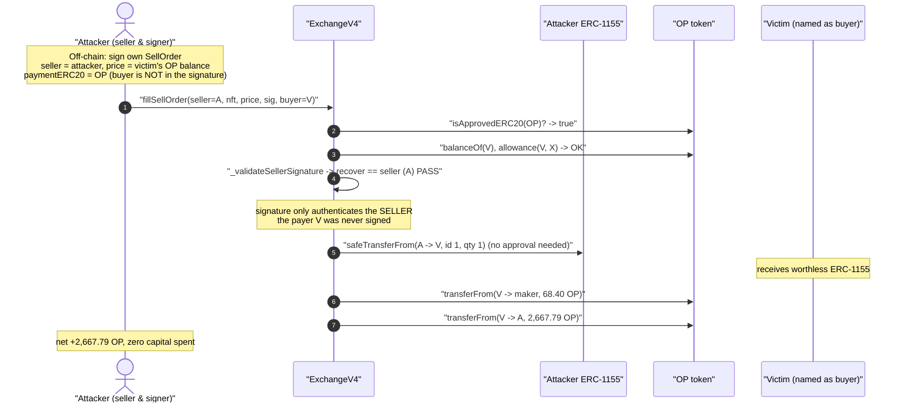
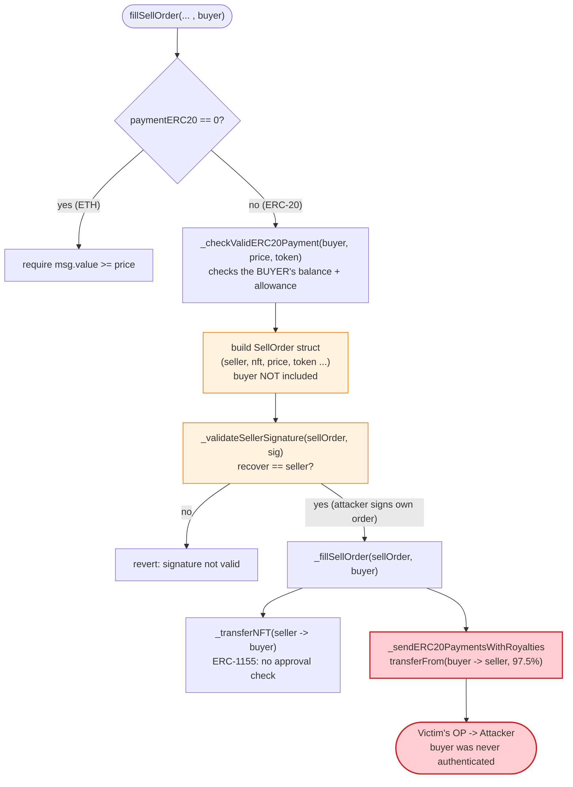
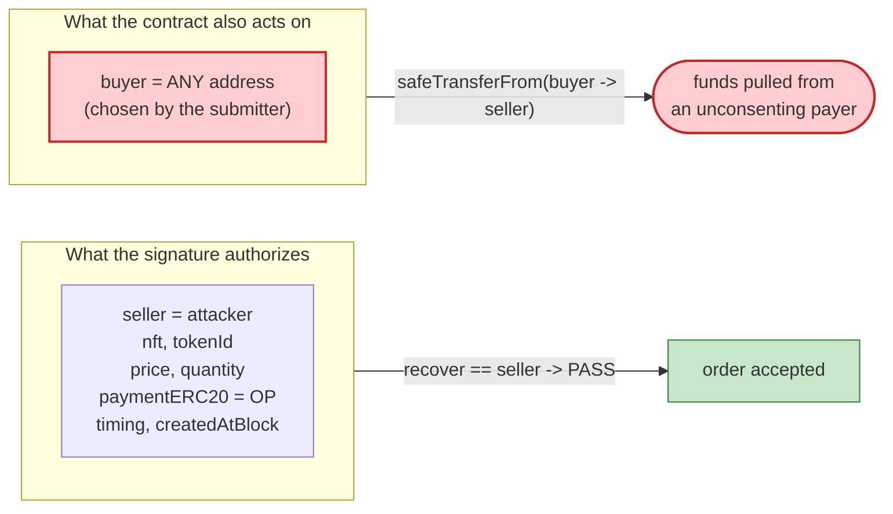

# Quixotic (Optimism NFT Marketplace) Exploit — Unsigned `buyer` Parameter Drains Any Approved ERC-20 Allowance

> **Reproduction:** the PoC compiles & runs in an isolated Foundry project at
> [this project folder](.) (the umbrella DeFiHackLabs repo contains many unrelated
> PoCs that do not whole-compile, so this one was extracted).
> Full verbose trace: [output.txt](output.txt).
> Verified vulnerable source: [ExchangeV4.sol](sources/ExchangeV4_065e8A/ExchangeV4.sol).

---

## Key info

| | |
|---|---|
| **Loss (this PoC, single victim)** | **2,667.79 OP** drained from one victim that had approved the marketplace (≈ \$2.7K at the time). The wider campaign drained many approved wallets for a reported ≈ **\$1M** total. |
| **Vulnerable contract** | `ExchangeV4` (Quixotic / Optimistic NFT marketplace) — [`0x065e8A87b8F11aED6fAcf9447aBe5E8C5D7502b6`](https://optimistic.etherscan.io/address/0x065e8A87b8F11aED6fAcf9447aBe5E8C5D7502b6#code) |
| **Victim (this PoC)** | `0x4D9618239044A2aB2581f0Cc954D28873AFA4D7B` — had a 1,999,995 OP allowance to the exchange and held 2,736.19 OP |
| **Payment token drained** | OP (`0x4200000000000000000000000000000000000042`) |
| **Attacker EOA / order signer** | `0x0A0805082EA0fc8bfdCc6218a986efda6704eFE5` |
| **Dummy NFT used** | attacker-controlled ERC-1155 `0xbe81eabDBD437CbA43E4c1c330C63022772C2520`, tokenId 1 |
| **Maker-fee recipient** | `0xeC1557A67d4980C948cD473075293204F4D280fd` (got 68.40 OP = 2.5% maker fee) |
| **Chain / fork block / date** | Optimism / 13,591,383 / **July 2022** |
| **Compiler** | Solidity `v0.8.9+commit.e5eed63a`, optimizer **10000 runs** |
| **Bug class** | Incomplete signature coverage — a value-bearing parameter (`buyer`) is outside the signed struct, enabling allowance theft / signature-scope confusion |

---

## TL;DR

Quixotic's `fillSellOrder(...)` lets a caller settle a *signed* NFT sell order as a meta-transaction.
The order's authenticity is checked by `_validateSellerSignature`, which recovers a signer from an
EIP-712 hash of the **`SellOrder` struct** and requires `recovered == sellOrder.seller`
([ExchangeV4.sol:1998-2021](sources/ExchangeV4_065e8A/ExchangeV4.sol#L1998-L2021)).

But the **payer** of the order — the `buyer` address whose ERC-20 is pulled — is a *separate function
argument that is **not part of the signed struct*** and is never validated against the signature
([:1626-1638](sources/ExchangeV4_065e8A/ExchangeV4.sol#L1626-L1638),
[:1953-1974](sources/ExchangeV4_065e8A/ExchangeV4.sol#L1953-L1974)).

So an attacker:

1. **Signs their own sell order** for a worthless, attacker-owned ERC-1155, with `seller = attacker`,
   `paymentERC20 = OP`, and `price = the victim's entire OP balance`.
2. **Names the victim as `buyer`** — any address that had ever approved the exchange to spend OP.
3. Calls `fillSellOrder`. The signature check passes (it only validates the *seller*, who is the
   attacker). The exchange then `safeTransferFrom`s `price` OP **out of the victim** and pays the bulk
   of it **to the attacker**, while shipping the attacker's junk ERC-1155 to the victim.

Net for this PoC: the attacker's OP balance goes from **199,556.99 → 202,224.78 OP**, a profit of
**2,667.79 OP** taken directly from the victim's wallet. There was no actual buyer, no consent from the
victim, and no real NFT sale — just an allowance drain dressed up as a marketplace fill.

---

## Background — what `ExchangeV4` does

`ExchangeV4` is the on-chain settlement contract for the Quixotic (later "Optimistic") NFT marketplace
on Optimism. Orders are signed off-chain (EIP-712 meta-transactions) and submitted on-chain by anyone:

- **Sell orders** (`fillSellOrder`): a seller signs an offer to sell an NFT at `price`; a buyer
  (or a relayer) submits it and pays.
- **Buy orders / Dutch auctions**: analogous flows with their own validators.

Payment can be native ETH or an **approved ERC-20** (OP was approved —
trace `isApprovedERC20(OP) → 1`, [output.txt:22-23](output.txt)). When paying with an ERC-20, the
exchange pulls the funds from the `buyer` via `safeTransferFrom`, which means **the buyer must have
granted the exchange an ERC-20 allowance in advance**. Thousands of users had standing OP allowances to
this marketplace — which is exactly the pool of victims this bug unlocks.

On-chain facts at the fork block (from the trace):

| Fact | Value | Trace |
|---|---|---|
| Victim OP balance | 2,736.19 OP (`2736191871050436050944`) | [output.txt:25](output.txt) |
| Victim → exchange OP allowance | 1,999,995 OP (`1999995000000000000000000`) | [output.txt:26-27](output.txt) |
| OP is an approved payment token | `true` | [output.txt:22-23](output.txt) |
| Royalty rate for the dummy NFT | 0 | [output.txt:51-52](output.txt) |
| Maker fee | 2.5% (`_makerFeePerMille = 25`) | [:1505](sources/ExchangeV4_065e8A/ExchangeV4.sol#L1505) |

---

## The vulnerable code

### 1. `fillSellOrder` — the order struct is built from arguments; `buyer` is *not* in it

```solidity
function fillSellOrder(
    address payable seller,
    address contractAddress,
    uint256 tokenId,
    uint256 startTime,
    uint256 expiration,
    uint256 price,
    uint256 quantity,
    uint256 createdAtBlockNumber,
    address paymentERC20,
    bytes memory signature,
    address payable buyer            // ⚠️ value-bearing, attacker-chosen, NOT signed
) external payable whenNotPaused nonReentrant {
    if (paymentERC20 == address(0)) {
        require(msg.value >= price, "...");
    } else {
        _checkValidERC20Payment(buyer, price, paymentERC20);   // checks the VICTIM's balance/allowance
    }

    SellOrder memory sellOrder = SellOrder(
        seller, contractAddress, tokenId, startTime, expiration,
        price, quantity, createdAtBlockNumber, paymentERC20      // ⚠️ buyer is absent here
    );

    require(
        cancellationRegistry.getSellOrderCancellationBlockNumber(seller, contractAddress, tokenId)
            < createdAtBlockNumber, "This order has been cancelled."
    );

    require(_validateSellerSignature(sellOrder, signature), "Signature is not valid for SellOrder.");
    require((block.timestamp > startTime), "...");
    require((block.timestamp < expiration), "...");

    _fillSellOrder(sellOrder, buyer);                            // buyer flows in only here
}
```
[ExchangeV4.sol:1626-1675](sources/ExchangeV4_065e8A/ExchangeV4.sol#L1626-L1675)

### 2. `_validateSellerSignature` — recovers the **seller**, ignores the buyer entirely

```solidity
function _validateSellerSignature(SellOrder memory sellOrder, bytes memory signature)
    internal view returns (bool)
{
    bytes32 SELLORDER_TYPEHASH = keccak256(
        "SellOrder(address seller,address contractAddress,uint256 tokenId,uint256 startTime,"
        "uint256 expiration,uint256 price,uint256 quantity,uint256 createdAtBlockNumber,"
        "address paymentERC20)"                                  // ⚠️ no `buyer` field
    );
    bytes32 structHash = keccak256(abi.encode(
        SELLORDER_TYPEHASH, sellOrder.seller, sellOrder.contractAddress, sellOrder.tokenId,
        sellOrder.startTime, sellOrder.expiration, sellOrder.price, sellOrder.quantity,
        sellOrder.createdAtBlockNumber, sellOrder.paymentERC20
    ));
    bytes32 digest = ECDSA.toTypedDataHash(DOMAIN_SEPARATOR, structHash);
    address recoveredAddress = ECDSA.recover(digest, signature);
    return recoveredAddress == sellOrder.seller;                // ⚠️ only the seller is authenticated
}
```
[ExchangeV4.sol:1998-2021](sources/ExchangeV4_065e8A/ExchangeV4.sol#L1998-L2021)

### 3. `_sendERC20PaymentsWithRoyalties` — pulls funds *from the buyer*, pays the seller

```solidity
function _sendERC20PaymentsWithRoyalties(
    address contractAddress, address seller, address buyer, uint256 price, address paymentERC20
) internal {
    uint256 royaltyPayout   = (royaltyRegistry.getRoyaltyPayoutRate(contractAddress) * price) / 1000; // 0
    uint256 makerPayout     = (_makerFeePerMille * price) / 1000;                                     // 2.5%
    uint256 remainingPayout = price - royaltyPayout - makerPayout;                                    // 97.5%

    if (royaltyPayout > 0) {
        IERC20(paymentERC20).safeTransferFrom(buyer, royaltyRegistry.getRoyaltyPayoutAddress(...), royaltyPayout);
    }
    IERC20(paymentERC20).safeTransferFrom(buyer, _makerWallet, makerPayout);   // 68.40 OP → maker
    IERC20(paymentERC20).safeTransferFrom(buyer, seller, remainingPayout);     // 2,667.79 OP → ATTACKER
}
```
[ExchangeV4.sol:1953-1974](sources/ExchangeV4_065e8A/ExchangeV4.sol#L1953-L1974)

The funds (`safeTransferFrom(buyer, …)`) come from `buyer` — an **arbitrary, unsigned input** — and the
remaining 97.5% goes to `seller`, which is the **attacker**.

### 4. The ERC-1155 transfer path requires *no approval* from the seller

```solidity
function _transferNFT(address contractAddress, uint256 tokenId, address seller, address buyer, uint256 quantity) internal {
    if (contractAddress.supportsInterface(InterfaceId_ERC721)) {
        IERC721 erc721 = IERC721(contractAddress);
        require(erc721.isApprovedForAll(seller, address(this)), "...");   // ERC721 path HAS a check
        erc721.transferFrom(seller, buyer, tokenId);
    } else if (contractAddress.supportsInterface(InterfaceId_ERC1155)) { // 0xd9b67a26
        IERC1155 erc1155 = IERC1155(contractAddress);
        erc1155.safeTransferFrom(seller, buyer, tokenId, quantity, "");   // ⚠️ NO approval check
    } else {
        revert("...");
    }
}
```
[ExchangeV4.sol:2140-2163](sources/ExchangeV4_065e8A/ExchangeV4.sol#L2140-L2163)

Because the attacker *is* the seller and uses their own ERC-1155, the NFT leg trivially succeeds; the
ERC-1155 branch doesn't even require approval-for-all (unlike ERC-721).

---

## Root cause — why it was possible

EIP-712 only protects the fields it hashes. The `SellOrder` typehash and struct enumerate the seller,
the NFT, timing, price, quantity, block number, and payment token — but **not the counterparty who
pays**. The settlement code, however, *does* use a counterparty: it pulls ERC-20 from a `buyer` address
that is supplied as a bare function argument and never bound to the signature.

> The seller's signature authorizes "I will sell *this* NFT for *this* price in *this* token." It says
> **nothing** about *who* pays. The contract then lets the **submitter** name any payer with a standing
> allowance — turning a meta-transaction "fill" into "charge an arbitrary approved wallet and pay me."

Three design facts compose into the critical bug:

1. **Unsigned payer.** `buyer` is outside the EIP-712 struct, so the *caller* — not the order author —
   chooses who is charged. The attacker authors and signs their own order, then names the victim.
2. **Attacker controls both the priced asset and the seller.** Using a worthless attacker-owned
   ERC-1155 means `price` is pure extraction; the "NFT" delivered to the victim is junk. The ERC-1155
   path requires no seller approval, so nothing blocks the NFT leg.
3. **Funds are pulled from the unsigned payer and paid to the (attacker) seller.**
   `safeTransferFrom(buyer, seller, remainingPayout)` moves the victim's OP to the attacker. The only
   gate is that the victim previously approved the exchange for OP — a condition satisfied by every
   honest user of the marketplace.

The PoC even annotates the fix the team later applied
([test/Quixotic_exp.sol:55-56](test/Quixotic_exp.sol#L55-L56)): *"issues was only check seller
signature"* — the buyer side was never authenticated.

---

## Preconditions

- **A victim with a standing ERC-20 allowance to the exchange.** Here the victim had approved
  1,999,995 OP ([output.txt:26-27](output.txt)). Every wallet that ever bought with OP on the
  marketplace qualifies.
- **The payment ERC-20 is "approved"** in `paymentERC20Registry` (`isApprovedERC20(OP) → true`).
- **A valid seller signature where the attacker is the seller.** Trivially satisfied: the attacker signs
  their own order; `ecrecover → 0x0A08…eFE5 == seller` ([output.txt:30-31](output.txt)).
- **An order that isn't "cancelled."** The attacker sets `createdAtBlockNumber = 2^256 − 2`, far above
  the registry's stored value (`0xcf6355`), so the check passes
  ([output.txt:28-29](output.txt), [:1660-1663](sources/ExchangeV4_065e8A/ExchangeV4.sol#L1660-L1663)).
- **`startTime`/`expiration` window open.** Attacker uses `startTime = 0` and
  `expiration = 2^256 − 2`.

No capital, no flash loan: the attacker pays nothing and receives the victim's tokens.

---

## Attack walkthrough (with on-chain numbers from the trace)

The single call is `quixotic.fillSellOrder(seller=attacker, nft=0xbe81…2520, tokenId=1, startTime=0,
expiration=MAX-1, price=2736.19 OP, quantity=1, createdAtBlockNumber=MAX-1, paymentERC20=OP,
signature=…, buyer=victim)`.

| # | On-chain step | Value / address | Effect |
|---|---|---|---|
| 0 | **Read victim OP balance** | 2,736.19 OP | Attacker had already chosen `price` = victim's full balance. |
| 1 | `isApprovedERC20(OP)` | `true` | OP is an accepted payment token. |
| 2 | `balanceOf(buyer=victim)` ≥ price, `allowance(victim, exchange)` = 1,999,995 OP | passes | `_checkValidERC20Payment` clears using the **victim's** balance/allowance. |
| 3 | `getSellOrderCancellationBlockNumber` = `0xcf6355` < `createdAtBlockNumber` (MAX-1) | passes | Order not "cancelled." |
| 4 | `ECDSA.recover(digest, sig)` → `0x0A08…eFE5` | == `seller` | **Seller signature valid — but it's the attacker's own.** |
| 5 | `cancelPreviousSellOrders(attacker, nft, 1)` | nonce bump `cf6355→cf6357` | Finalize bookkeeping. |
| 6 | ERC-1155 `safeTransferFrom(attacker → victim, id 1, qty 1)` | junk NFT | Victim receives the attacker's worthless token. |
| 7 | `getRoyaltyPayoutRate(nft)` = 0 | royalty = 0 | No royalty diverted. |
| 8 | `OP.transferFrom(victim → maker 0xeC15…80fd, 68.40 OP)` | `68404796776260901273` | 2.5% maker fee, paid by the **victim**. |
| 9 | `OP.transferFrom(victim → attacker, 2,667.79 OP)` | `2667787074274175149671` | **97.5% of the price lands on the attacker.** |
| 10 | **Read victim/attacker balances after** | attacker 202,224.78 OP | Attacker gained 2,667.79 OP. |

Arithmetic check against the trace:
- `makerPayout = 25 × 2736191871050436050944 / 1000 = 68404796776260901273` ✓ ([output.txt:53](output.txt))
- `remainingPayout = price − 0 − 68404796776260901273 = 2667787074274175149671` ✓ ([output.txt:67](output.txt))
- attacker balance `199556990343113309559543 → 202224777417387484709214`, Δ = `2667787074274175149671` ✓
  ([output.txt:19,79](output.txt))

### Profit / loss accounting (OP)

| Direction | Amount (OP) |
|---|---:|
| Victim debited (price) | 2,736.19 |
| → Maker fee (`0xeC15…80fd`) | 68.40 |
| → **Attacker (seller payout)** | **2,667.79** |
| Attacker capital spent | 0 |
| **Attacker net profit** | **+2,667.79** |

The victim's loss equals `price`; the attacker keeps everything except the 2.5% protocol fee, all for
the cost of delivering a worthless ERC-1155. Repeated against every approved wallet, this is the
≈ \$1M campaign.

---

## Diagrams

### Sequence of the attack



### Where the trust gap lives



### Signed vs. actual authority



---

## Remediation

1. **Bind the buyer into the signed order.** The party who *pays* must be authenticated. Either add
   `buyer` to the `SellOrder` typehash/struct so the seller's signature commits to a specific
   counterparty, or — better for a marketplace — require the **buyer to sign** a matching buy
   authorization, and settle only when both signatures agree on `(nft, tokenId, price, paymentERC20,
   counterparties)`. A fill where one side is signed and the other side is a free function argument is
   never safe when that argument controls fund movement.
2. **Never charge an address that hasn't authorized *this* trade.** A standing ERC-20 allowance is
   consent to the marketplace contract, not consent to be the buyer of an arbitrary order. Treat the
   payer as untrusted input and require explicit, signature-bound authorization for each fill.
3. **Use a single canonical settlement path with symmetric checks.** The ERC-721 leg required
   `isApprovedForAll(seller, exchange)` but the ERC-1155 leg did not; asymmetric checks across paths are
   a recurring source of bugs. Make both legs require equivalent authorization, and make the *payment*
   leg require equivalent authorization from the payer.
4. **Don't let the order author pick who is charged.** The attacker authored the order, signed it as
   seller, and chose the victim as buyer — three roles that should never collapse into one actor.
   Cross-validate that `buyer != seller` and that `buyer` is the entity whose signature (or on-chain
   action) initiated the purchase.

---

## How to reproduce

The PoC was extracted into a standalone Foundry project (the umbrella DeFiHackLabs repo has many
unrelated PoCs that fail to compile under a whole-project `forge test`):

```bash
_shared/run_poc.sh 2022-07-Quixotic_exp --mt testExploit -vvvvv
```

- RPC: an **Optimism archive** endpoint is required to serve historical state at fork block
  13,591,383. `setUp()` does `createSelectFork("optimism", 13_591_383)`.
- The test pranks the attacker EOA, reads its OP balance, issues the single malicious `fillSellOrder`,
  and reads the balance again.

Expected tail:

```
Ran 1 test for test/Quixotic_exp.sol:ContractTest
[PASS] testExploit() (gas: 204588)
Logs:
  Before exploiting, attacker OP Balance:: 199556990343113309559543
  After exploiting, attacker OP Balance:: 202224777417387484709214
```

The +2,667,787,074,274,175,149,671 wei (2,667.79 OP) delta is the victim's stolen allowance, less the
2.5% maker fee — confirming the unsigned-`buyer` allowance drain.

---

*Reference: Quixotic / Optimistic NFT marketplace exploit, Optimism, July 2022 (~\$1M across approved
wallets). Root cause: the marketplace authenticated only the seller's signature, leaving the `buyer`
(payer) an unsigned, attacker-controlled function argument.*
