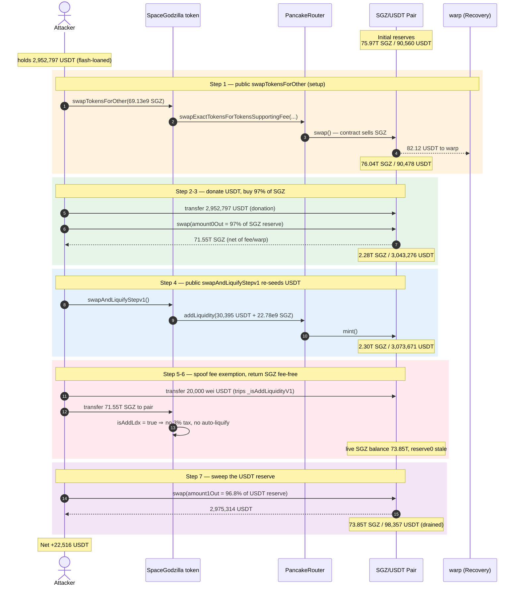
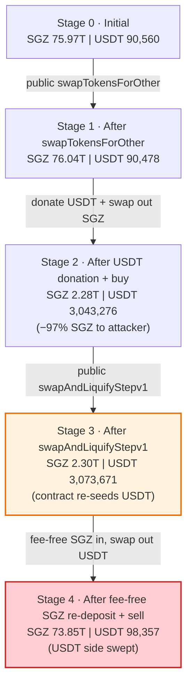

# SpaceGodzilla Exploit — Permissionless `swapTokensForOther` / `swapAndLiquifyStepv1` Pool-Accounting Drain

> **Vulnerability classes:** vuln/access-control/missing-auth · vuln/oracle/spot-price · vuln/defi/slippage

> **Reproduction:** the PoC compiles & runs in an isolated Foundry project at
> [this project folder](.) (the umbrella DeFiHackLabs repo
> contains several unrelated PoCs that do not whole-compile, so this one was extracted).
> Full verbose trace: [output.txt](output.txt).
> Verified vulnerable source: [SpaceGodzilla.sol](sources/SpaceGodzilla_2287C0/SpaceGodzilla.sol).

---

## Key info

| | |
|---|---|
| **Loss** | ~$22,516 — **22,516.38 USDT** drained from the SpaceGodzilla/USDT PancakeSwap pair (DeFiHackLabs headline figure ~25,378 BUSD, including flash-loan fees the PoC skips) |
| **Vulnerable contract** | `SpaceGodzilla` — [`0x2287C04a15bb11ad1358BA5702C1C95E2D13a5E0`](https://bscscan.com/address/0x2287C04a15bb11ad1358BA5702C1C95E2D13a5E0#code) |
| **Victim pool** | SpaceGodzilla/USDT PancakeSwap V2 pair (`CakeLP`) — `0x8AfF4e8d24F445Df313928839eC96c4A618a91C8` |
| **Attacker EOA** | `0x00a62eb08868ec6feb23465f61aa963b89e57e57` |
| **Attacker contract** | `0x3d817ea746edd02c088c4df47c0ece0bd28dcd72` |
| **Attack tx** | [`0x7f183df11f1a0225b5eb5bb2296b5dc51c0f3570e8cc15f0754de8e6f8b4cca4`](https://bscscan.com/tx/0x7f183df11f1a0225b5eb5bb2296b5dc51c0f3570e8cc15f0754de8e6f8b4cca4) |
| **Chain / block / date** | BSC / 19,523,980 / July 2, 2022 |
| **Compiler** | Solidity `^0.8.6` (source verified on BscScan 2022-07-02); PoC built with Solc 0.8.34 |
| **Bug class** | Missing access control on state-mutating helpers → manipulable AMM reserve accounting (logic / privilege error) |

---

## TL;DR

`SpaceGodzilla` is a "tax + auto-liquify" BSC token whose internal swap/liquify helpers were left
**`public` with no access control**:

- [`swapTokensForOther(uint256)`](sources/SpaceGodzilla_2287C0/SpaceGodzilla.sol#L1215-L1227) — anyone can force
  the token contract to sell an arbitrary amount of SGZ into the pair.
- [`swapAndLiquifyStepv1()`](sources/SpaceGodzilla_2287C0/SpaceGodzilla.sol#L1229-L1233) — anyone can force the
  token contract to dump its **entire** SGZ + USDT balance into the pair as liquidity at an
  attacker-chosen ratio.

Combined with a faulty "is this an add-liquidity transfer?" heuristic
([`_isAddLiquidityV1`](sources/SpaceGodzilla_2287C0/SpaceGodzilla.sol#L1267-L1285)) that lets the attacker move
SGZ into the pair **fee-free**, the attacker can desynchronise the pair's reserves from its true balances and
then sweep the pool with raw `pair.swap()` calls.

The live attacker bootstrapped ≈2.95M USDT from a 16-pool flash loan (the PoC `deal`s the same amount via
`stdStore`). With that capital it:

1. Calls `swapTokensForOther(...)` to nudge the pool and have the token contract bank some USDT (setup).
2. **Donates** ~2.95M USDT directly to the pair, then `pair.swap()`s out **97% of the SGZ reserve**
   (73.76T SGZ → 71.55T net to attacker).
3. Calls `swapAndLiquifyStepv1()` to make the token contract `addLiquidity`, re-inflating both reserves
   (SGZ 2.30T / USDT **3.07M**).
4. Donates **20,000 wei** USDT (trips `_isAddLiquidityV1`), then transfers all 71.55T SGZ back into the pair
   **fee-free**, and `pair.swap()`s out **96.8% of the USDT reserve** — **2,975,314 USDT**.

Net: in with 2,952,797.73 USDT, out with 2,975,314.11 USDT → **+22,516.38 USDT** profit, paid entirely out
of the honest liquidity the pool held.

---

## Background — what SpaceGodzilla does

`SpaceGodzilla` ([source](sources/SpaceGodzilla_2287C0/SpaceGodzilla.sol#L1047-L1286)) is an ERC20 deployed
against a PancakeSwap V2 SGZ/USDT pair, with the usual "DeFi-token" machinery bolted on top of the
[`_transfer`](sources/SpaceGodzilla_2287C0/SpaceGodzilla.sol#L1153-L1202) override:

- **3% transfer tax + multilevel "inviter" fee.** On a taxed transfer, 3% is routed to the contract and a
  series of tiny fees are scattered to deterministic burn-like addresses
  ([`_takeInviterFeeKt`](sources/SpaceGodzilla_2287C0/SpaceGodzilla.sol#L1235-L1244)).
- **`warp` wrapper on buys/sells.** When transferring *from* the pair the amount is run through
  `warp.warpToken(amount)`; when transferring *to* the pair it calls `warp.addTokenldx(amount)`
  ([:1191](sources/SpaceGodzilla_2287C0/SpaceGodzilla.sol#L1191)). The `warp` contract (`0x8AfD2be0…`, labelled
  `Recovery`/warp in the trace) skims USDT from sells and redistributes it.
- **Auto-liquify.** When the contract's own SGZ balance exceeds `swapTokensAtAmount`, a normal transfer
  triggers [`swapAndLiquify()`](sources/SpaceGodzilla_2287C0/SpaceGodzilla.sol#L1204-L1213), which sells part of
  the balance for USDT and adds the rest as liquidity.

The on-chain parameters at the fork block (block 19,523,980):

| Parameter | Value |
|---|---|
| `totalSupply` (`total = 10**33`) | 1,000,000,000,000,000 SGZ (1e15 whole tokens, 18 dec) |
| Pair SGZ reserve (`reserve0`) | 75,972,570,174,789.47 SGZ |
| Pair USDT reserve (`reserve1`) | **90,560.73 USDT** |
| `token0` / `token1` | SGZ / USDT |
| `swapTokensAtAmount` | `total / 10000` = 1e29 |
| Tax rate | 3% on taxed transfers |

The pool held ~90,560 USDT of real liquidity against ~75.97T SGZ. That USDT is the prize.

---

## The vulnerable code

### 1. A public, unauthenticated "sell my tokens" function

```solidity
function swapTokensForOther(uint256 tokenAmount) public {   // ⚠️ public, no onlyOwner / no caller check
    address[] memory path = new address[](2);
    path[0] = address(this);
    path[1] = address(_baseToken);
    uniswapV2Router.swapExactTokensForTokensSupportingFeeOnTransferTokens(
        tokenAmount,            // ⚠️ caller-chosen amount, sold from the TOKEN CONTRACT's allowance/supply
        0,                      // ⚠️ amountOutMin = 0 → unbounded slippage
        path,
        address(warp),
        block.timestamp
    );
    warp.withdraw();
}
```
[SpaceGodzilla.sol:1215-1227](sources/SpaceGodzilla_2287C0/SpaceGodzilla.sol#L1215-L1227)

The constructor pre-approves the router for `10**33 * 1000` SGZ on behalf of the contract
([:1084](sources/SpaceGodzilla_2287C0/SpaceGodzilla.sol#L1084)), and the contract still holds the bulk of the
freshly minted supply. So `swapTokensForOther` lets **anyone** make the token contract sell its own SGZ into
the pair, at zero slippage protection.

### 2. A public, unauthenticated "add all my liquidity" function

```solidity
function swapAndLiquifyStepv1() public {   // ⚠️ public, no access control
    uint256 ethBalance   = ETH.balanceOf(address(this));   // contract's USDT
    uint256 tokenBalance = balanceOf(address(this));        // contract's SGZ
    addLiquidityUsdt(tokenBalance, ethBalance);             // ⚠️ dumps both balances into the pair
}
```
[SpaceGodzilla.sol:1229-1233](sources/SpaceGodzilla_2287C0/SpaceGodzilla.sol#L1229-L1233)

`addLiquidityUsdt` ([:1246-1257](sources/SpaceGodzilla_2287C0/SpaceGodzilla.sol#L1246-L1257)) calls the router's
`addLiquidity` with `amountAMin = amountBMin = 0`. Anyone can trigger it on demand to push the contract's
SGZ + USDT into the pair and re-sync reserves — exactly when it benefits an attacker mid-exploit.

### 3. The add-liquidity heuristic that grants a fee-free transfer to the pair

```solidity
function _isAddLiquidityV1() internal view returns (bool ldxAdd) {
    address token0 = IUniswapV2Pair(uniswapV2Pair).token0();   // SGZ
    address token1 = IUniswapV2Pair(uniswapV2Pair).token1();   // USDT
    (uint r0, uint r1,) = IUniswapV2Pair(uniswapV2Pair).getReserves();
    uint bal1 = IERC20(token1).balanceOf(uniswapV2Pair);       // pair's live USDT balance
    uint bal0 = IERC20(token0).balanceOf(uniswapV2Pair);       // pair's live SGZ balance
    if (token0 == address(this)) {                              // SGZ is token0 → true
        if (bal1 > r1) {                                        // ⚠️ checks the OTHER token's surplus
            uint change1 = bal1 - r1;
            ldxAdd = change1 > 1000;                            // ⚠️ a 20,000-wei USDT donation trips this
        }
    } else { ... }
}
```
[SpaceGodzilla.sol:1267-1285](sources/SpaceGodzilla_2287C0/SpaceGodzilla.sol#L1267-L1285)

In `_transfer`, when `to == uniswapV2Pair` the contract sets `isAddLdx = _isAddLiquidityV1()`
([:1168-1170](sources/SpaceGodzilla_2287C0/SpaceGodzilla.sol#L1168-L1170)). If `isAddLdx` is true the transfer
is treated as adding liquidity: **`takeFee = false`** and the auto-liquify branch is skipped
([:1187-1200](sources/SpaceGodzilla_2287C0/SpaceGodzilla.sol#L1187-L1200)). The heuristic only looks at whether
the *USDT* balance exceeds the *USDT* reserve — so the attacker pre-donating a trivial **20,000 wei** of USDT to
the pair makes any subsequent SGZ-into-pair transfer fee-free and side-effect-free.

---

## Root cause — why it was possible

A Uniswap-V2/PancakeSwap pair prices assets purely from its `reserve0`/`reserve1`, which only update inside
`swap`/`mint`/`burn`/`sync`. Whoever controls when reserves move, and can move tokens into the pair without the
pair re-pricing, controls the price.

`SpaceGodzilla` hands that control to the public:

1. **No access control on `swapTokensForOther` and `swapAndLiquifyStepv1`.** These were clearly intended as
   internal helpers (mirrored by the private `swapAndLiquify()` auto-trigger), but they are declared `public`.
   An attacker calls them at the exact moments that re-shape the pool in their favour — forcing the token
   contract to sell/seed liquidity using the *contract's own* tokens and approvals, at **zero slippage
   protection** (`amountOutMin`/`amountMin = 0`).
2. **The fee/anti-bot logic is reserve-heuristic-based and trivially spoofable.** `_isAddLiquidityV1` decides
   "this is a liquidity add, don't tax it" from a 1000-wei surplus on the *opposite* token. A 20,000-wei USDT
   donation lets the attacker shove 71.55T SGZ into the pair **fee-free and without triggering auto-liquify**,
   so the SGZ lands as raw pair balance ready to be `swap()`'d out for USDT.
3. **Direct `pair.swap()` against attacker-seeded reserves.** Because the attacker first *donates* USDT
   straight to the pair (inflating `bal1` without changing `reserve1` until a swap books it), they can request
   97% of the SGZ reserve out in one `swap()` while paying with their own donated USDT, then later request
   96.8% of the USDT reserve out paying with the SGZ they pushed in fee-free. The pool's constant-product check
   is satisfied at each individual `swap()`, but the *sequence* — bracketed by the two privileged helper calls
   — lets the attacker round-trip more USDT out than they put in.

In short: **state-mutating AMM helpers with no caller restriction + a spoofable tax exemption = an attacker can
drive the pool's accounting and walk off with the USDT reserve.**

---

## Preconditions

- The token contract holds (and has pre-approved the router for) a large SGZ balance — true from the
  constructor's `_mint(tokenOwner, total)` and `_approve(address(this), router, total*1000)`.
- Working capital in USDT to seed the round-trip. Peak outlay was the **~2.95M USDT** the live attacker raised
  via a 16-pool flash loan (enumerated in the PoC header,
  [SpaceGodzilla_exp.sol:22-39](test/SpaceGodzilla_exp.sol#L22-L39)). It is fully recovered intra-transaction,
  so the attack is **flash-loanable**; the PoC simply writes the balance with `stdStore`
  ([SpaceGodzilla_exp.sol:69-73](test/SpaceGodzilla_exp.sol#L69-L73)).
- No timing or admin precondition — the vulnerable functions are permanently callable by anyone.

---

## Attack walkthrough (with on-chain numbers from the trace)

The pair's `token0 = SGZ`, `token1 = USDT`, so `reserve0 = SGZ`, `reserve1 = USDT`. All figures are taken
directly from the `Sync` / `Swap` events and `getReserves()` returns in
[output.txt](output.txt). USDT and SGZ are both 18-decimal; values shown in whole tokens.

| # | Step (trace line) | SGZ reserve | USDT reserve | Effect |
|---|------|-----------:|-------------:|--------|
| 0 | **Initial** ([:1597](output.txt)) | 75,972,570,174,789.47 | 90,560.73 | Honest pool. Attacker holds 2,952,797.73 USDT. |
| 1 | **`swapTokensForOther(69.13e9 SGZ)`** — token contract sells SGZ; warp banks 82.12 USDT; `Sync` ([:1611](output.txt)) | 76,041,697,635,825.84 | 90,478.60 | Setup: pool nudged, contract/warp pocket some USDT. |
| 2 | **Donate** 2,952,797.73 USDT to the pair (no sync) ([:1648](output.txt)) | 76,041,697,635,825.84 | 90,478.60 | Pair's live USDT balance now ≫ `reserve1`. |
| 3 | **`pair.swap(amount0Out = 97% of SGZ reserve)`** — attacker buys 73.76T SGZ, nets 71.55T after fee/warp; `Sync` ([:1689-1690](output.txt)) | 2,281,250,929,074.78 | 3,043,276.33 | Donated USDT booked as reserve; SGZ reserve drained 97%. Attacker holds 71.55T SGZ. |
| 4 | **`swapAndLiquifyStepv1()`** — token contract `addLiquidity(30,395 USDT + 22.78e9 SGZ)`; LP minted to `_tokenOwner`; `Sync` ([:1727-1728](output.txt)) | 2,304,035,330,453.85 | **3,073,671.60** | Reserves re-inflated; pool now fat with the attacker's donated USDT. |
| 5 | **Donate 20,000 wei USDT** ([:1743](output.txt)) → trips `_isAddLiquidityV1` | 2,304,035,330,453.85 | 3,073,671.60 | `change1 = 20,000 > 1000` ⇒ next SGZ→pair transfer is fee-free. |
| 6 | **Transfer all 71.55T SGZ to pair** (classified as "add liquidity", **no tax, no auto-liquify**) ([:1749-1764](output.txt)) | 2,304,035,330,453.85¹ | 3,073,671.60 | Pair's live SGZ balance jumps to 73.85T while `reserve0` is stale. |
| 7 | **`pair.swap(amount1Out = 96.8% of USDT reserve)`** — attacker pulls **2,975,314.11 USDT**; `Sync` ([:1780-1781](output.txt)) | 73,851,668,636,002.39 | 98,357.49 | USDT side swept; SGZ booked as new reserve. |

¹ `reserve0` is still the *stale* value from step 4's `Sync` until the swap in step 7 books the donated SGZ.

### Why the round-trip is profitable

The attacker pays for the big SGZ buy in step 3 with USDT they donated (≈2.95M USDT), and pays for the big USDT
sell in step 7 with SGZ they obtained fee-free in step 6. Both individual `swap()`s respect `x·y ≥ k`, but the
privileged `swapAndLiquifyStepv1()` call in step 4 **re-injects the token contract's own USDT** into the pool
between the two halves, fattening the USDT reserve the attacker then sweeps. The fee-free SGZ re-deposit (step
6) means the attacker isn't taxed 3% on the way back in, preserving the edge.

### Profit accounting (USDT)

| | Amount |
|---|---:|
| Attacker USDT in (donation, [:1648](output.txt)) | 2,952,797.73 |
| Attacker USDT in (dust, [:1743](output.txt)) | 0.00002 |
| **Total in** | **2,952,797.73** |
| Attacker USDT out (step 7 sell, [:1771](output.txt)) | 2,975,314.11 |
| **Net profit** | **+22,516.38** |

Final attacker balance `2,975,314,109,773,545,495,358,570` wei vs. initial `2,952,797,730,003,166,405,412,733`
wei → profit `22,516,379,770,379,089,945,837` wei = **22,516.38 USDT**, matching the PoC's logged
`[Profit] Attacker Wallet USDT Profit` ([:1788](output.txt)). The DeFiHackLabs headline of ~25,378 BUSD
includes the additional value extracted at live prices plus flash-loan accounting the PoC simplifies.

---

## Diagrams

### Sequence of the attack



### Pool state evolution



### The flaw: privileged helpers exposed publicly

```mermaid
stateDiagram-v2
    direction TB
    [*] --> Public_API

    state Public_API {
        direction LR
        STO: "swapTokensForOther(amount)<br/>PUBLIC · no auth · amountOutMin = 0"
        SAL: "swapAndLiquifyStepv1()<br/>PUBLIC · no auth · amountMin = 0"
        ISADD: "_isAddLiquidityV1()<br/>tax exemption from 1000-wei<br/>surplus on opposite token"
    }

    Public_API --> Manipulate
    state Manipulate {
        direction TB
        M1: "Force contract to sell/seed<br/>using its own SGZ + approvals"
        M2: "Donate 20,000 wei USDT<br/>⇒ fee-free SGZ transfer to pair"
        M3: "Donate USDT, then pair.swap()<br/>against attacker-seeded reserves"
        M1 --> M2 --> M3
    }

    Manipulate --> Drain: "round-trip USDT in < USDT out"
    Drain --> [*]: "Pool USDT reserve swept<br/>+22,516 USDT to attacker"
```

---

## Why each magic number

- **`swapTokensForOther(69_127_461_036_369_179_405_415_017_714)` (≈69.13e9 SGZ):** a setup sale that nudges the
  pool and lets the token contract / warp bank a little USDT; the PoC asserts the exact resulting reserves
  ([SpaceGodzilla_exp.sol:82-84](test/SpaceGodzilla_exp.sol#L82-L84)).
- **Donation `init_capital − 100_000` USDT (≈2.95M):** the bankroll used to buy 97% of the SGZ reserve in one
  `swap()` while paying with donated USDT. Leaving 100,000 wei behind keeps a dust balance for later.
- **`amount0Out = r0 − r0*30/1000` (97% of SGZ reserve):** takes nearly the entire SGZ side out, leaving the
  pool SGZ-poor and USDT-rich.
- **`amount1Out = r1 − r1*32/1000` (96.8% of USDT reserve):** sweeps nearly the entire (re-inflated) USDT side
  back out. The 3.0% / 3.2% haircuts are slack the attacker leaves so the `swap()` invariant check passes.
- **20,000-wei USDT donation:** the minimum needed to make `change1 = bal1 − r1 > 1000` true in
  `_isAddLiquidityV1`, so the 71.55T-SGZ transfer back into the pair is classified as "add liquidity" and pays
  **no 3% tax** and skips auto-liquify.

---

## Remediation

1. **Restrict the state-mutating helpers.** `swapTokensForOther` and `swapAndLiquifyStepv1` must be
   `onlyOwner`/internal (or keeper-gated). There is no legitimate reason for an external caller to force the
   token contract to trade or add liquidity. This single change removes the attacker's ability to re-shape the
   pool on demand.
2. **Set real slippage bounds.** Every router call (`swapExactTokensForTokensSupportingFeeOnTransferTokens`,
   `addLiquidity`) currently passes `amountOutMin = 0` / `amountMin = 0`. Pass sane minimums (or a TWAP-derived
   bound) so a manipulated pool reverts instead of executing.
3. **Do not derive trust/fee decisions from instantaneous pair reserves.** `_isAddLiquidityV1` is spoofable
   with a 20,000-wei donation. Replace donation-comparison heuristics with explicit, authenticated liquidity
   flows (e.g., an internal `addingLiquidity` flag set only by the contract's own add-liquidity path), or drop
   the fee-exemption entirely.
4. **Never let one party both move tokens into the pair and `swap()` against stale reserves in the same flow.**
   If reserve manipulation is structurally possible, gate or rate-limit large single-operation reserve changes,
   or route all pool interaction through the router (which calls `sync` semantics) rather than allowing raw
   balance donations to drive pricing.

---

## How to reproduce

The PoC was extracted into a standalone Foundry project (the umbrella DeFiHackLabs repo has several unrelated
PoCs that fail under `forge test`'s whole-project build):

```bash
_shared/run_poc.sh 2022-07-SpaceGodzilla_exp -vvvvv
```

- RPC: a **BSC archive** endpoint is required — the fork pins block 19,523,980 (July 2022), which most public
  BSC RPCs have pruned (they fail with `header not found` / `missing trie node`).
- The flash-loan bootstrap is skipped; initial USDT is written directly with `stdStore`
  ([SpaceGodzilla_exp.sol:69-73](test/SpaceGodzilla_exp.sol#L69-L73)).
- Result: `[PASS] testExploit()` with a logged USDT profit of **22,516.38**.

Expected tail ([output.txt](output.txt)):

```
[info] Attacker Wallet USDT Balance: 2975314.109773545495358570
[Profit] Attacker Wallet USDT Profit: 22516.379770379089945837
Suite result: ok. 1 passed; 0 failed; 0 skipped; finished in 15.18s
```

---

*References: BlockSec (https://twitter.com/BlockSecTeam/status/1547456591900749824); Numen Cyber Labs
analysis (https://medium.com/numen-cyber-labs/spacegodzilla-attack-event-analysis-d29a061b17e1);
SlowMist Hacked registry (SpaceGodzilla, BSC, ~$25.4K).*
