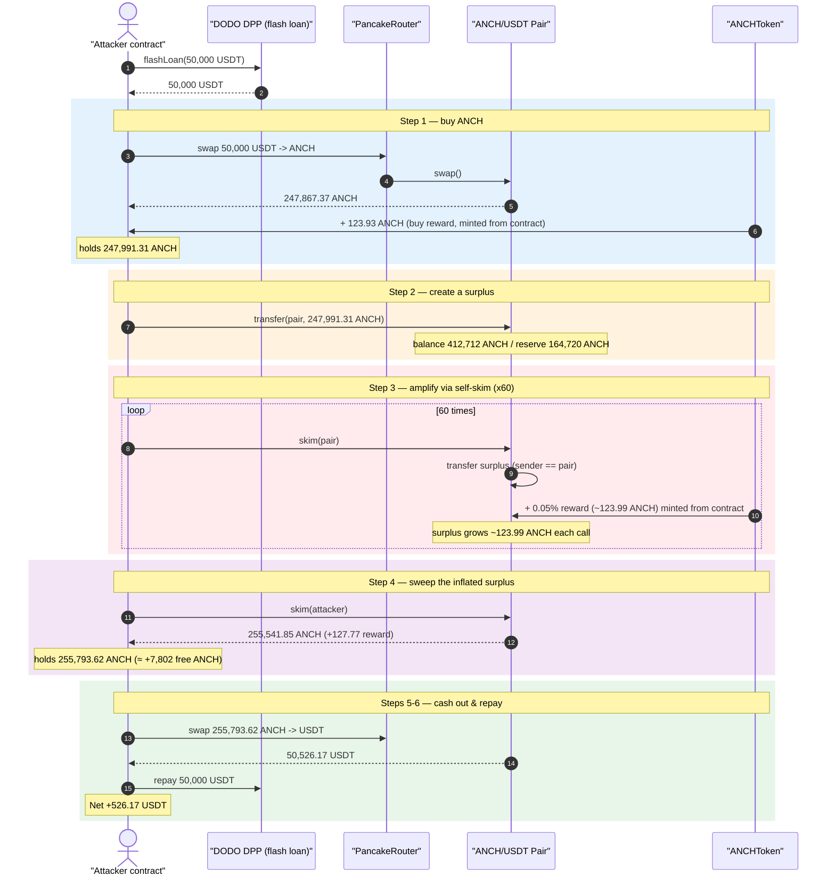
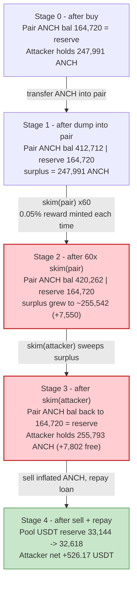
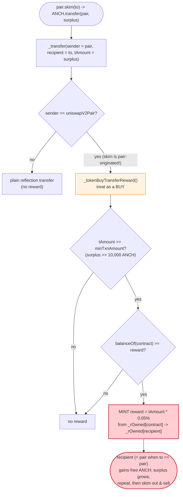
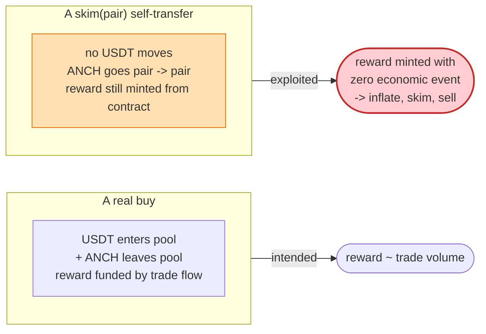

# ANCH Token Exploit — Reflection Reward Minted on Pair-to-Self `skim()` Transfers

> **Vulnerability classes:** vuln/logic/missing-check · vuln/defi/slippage

> **Reproduction:** the PoC compiles & runs in an isolated Foundry project at
> [this project folder](.) (the umbrella DeFiHackLabs repo
> contains several unrelated PoCs that do not whole-compile, so this one was extracted).
> Full verbose trace: [output.txt](output.txt).
> Verified vulnerable source: [ANCHToken.sol](sources/ANCHToken_A4f5d4/ANCHToken.sol).

---

## Key info

| | |
|---|---|
| **Loss** | **526.17 USDT** drained from the ANCH/USDT PancakeSwap pair in this single PoC tx (the live campaign repeated the pattern; SlowMist lists ~$10K total) |
| **Vulnerable contract** | `ANCHToken` (ANCH) — [`0xA4f5d4aFd6b9226b3004dD276A9F778EB75f2e9e`](https://bscscan.com/address/0xa4f5d4afd6b9226b3004dd276a9f778eb75f2e9e#code) |
| **Victim pool** | ANCH/USDT PancakeSwap V2 pair — [`0xaD0dA05b9C20fa541012eE2e89AC99A864CC68Bb`](https://bscscan.com/address/0xaD0dA05b9C20fa541012eE2e89AC99A864CC68Bb) |
| **Quote / liquidity asset** | USDT (BSC) — `0x55d398326f99059fF775485246999027B3197955` |
| **Flash-loan source** | DODO DPP pool `0xDa26Dd3c1B917Fbf733226e9e71189ABb4919E3f` |
| **Attacker** | EOA / contract per AnciliaInc disclosure (see Background) |
| **Disclosure** | https://twitter.com/AnciliaInc/status/1557846766682140672 |
| **Chain / block / date** | BSC / 20,302,534 / Aug 11, 2022 |
| **Compiler** | Solidity v0.8.15, optimizer 200 runs |
| **Bug class** | Reflection-token accounting flaw — reward minted on AMM-pair transfers; abusable via `pair.skim()` self-transfers |

---

## TL;DR

`ANCHToken` is a reflection ("rOwned") token that pays a **0.05% "transaction reward"** on every
buy and sell larger than `minTxnAmount` (10,000 ANCH). The reward is minted to the *counterparty* of
the AMM trade out of the token contract's own reflection holdings
([ANCHToken.sol:787-843](sources/ANCHToken_A4f5d4/ANCHToken.sol#L787-L843)).

The fatal mistake: the reward is gated **only** on *who one side of the transfer is*
(`sender == uniswapV2Pair` ⇒ "this is a buy", `recipient == uniswapV2Pair` ⇒ "this is a sell"),
never on whether real value actually changed hands. A PancakeSwap pair's `skim(to)` performs an
ERC-20 `transfer` **from the pair**, so it satisfies the `sender == uniswapV2Pair` branch and triggers
a reward — even when the destination `to` is the pair itself and **no swap or liquidity event
occurred at all**.

The attacker:

1. Flash-loans 50,000 USDT from DODO and buys 247,867 ANCH from the pair.
2. Transfers all the ANCH **back into the pair**, creating a large "surplus" (pair balance > reserve).
3. Calls `pair.skim(pair)` **60 times in a loop**. Each `skim` transfers the surplus from the pair to
   the pair (`sender == uniswapV2Pair`), so the token mints a **0.05% reward of the surplus to the
   pair** out of the contract's reflection pool. The pair's ANCH balance ratchets up ~123.99 ANCH per
   call while its reserve never changes.
4. Calls `pair.skim(attacker)` once to sweep the entire inflated surplus
   (**255,541 ANCH**, ~7,802 ANCH more than was deposited) to itself.
5. Sells the inflated ANCH back to the pair for **50,526.17 USDT**, repays the 50,000 USDT flash loan,
   and keeps **526.17 USDT** profit.

The profit comes 1:1 out of the pool's USDT reserve (it dropped by exactly 526.17 USDT), funded
ultimately by the new ANCH the token minted out of its own reflection balance for free.

---

## Background — what ANCHToken does

`ANCHToken` ([source](sources/ANCHToken_A4f5d4/ANCHToken.sol)) is a classic
SafeMath-era reflection token (`_rOwned`/`_tOwned`, `MAX = ~uint256(0)`, `_getRate()`):

- **Reflection balances.** `balanceOf(account)` is computed as `tokenFromReflection(_rOwned[account])`
  ([:635-637](sources/ANCHToken_A4f5d4/ANCHToken.sol#L635-L637)), i.e. each holder owns a slice of a
  reflected supply. The contract address (`address(this)`) holds a reflection balance that the
  reward logic draws from.
- **Trade reward.** On a transfer where one party is the pair, ANCH mints a `rewardRate` (= **5**) /
  `percent` (= **10000**) → **0.05%** bonus to the trade counterparty, *if* the trade amount is
  ≥ `minTxnAmount` (10,000 ANCH) and the contract holds enough reflection balance
  ([:800-812](sources/ANCHToken_A4f5d4/ANCHToken.sol#L800-L812),
  [:829-841](sources/ANCHToken_A4f5d4/ANCHToken.sol#L829-L841)).

The intended behaviour is "reward big buyers and sellers." The flaw is that the reward fires on any
transfer where the pair is one party — including the pair transferring tokens **to itself** via
`skim()`.

The on-chain parameters at the fork block:

| Parameter | Value |
|---|---|
| `rewardRate` / `percent` | 5 / 10000 = **0.05% reward** |
| `minTxnAmount` | 10,000 ANCH |
| ANCH/USDT pair address | `0xaD0dA05b9C20fa541012eE2e89AC99A864CC68Bb` |
| Pair `token0` / `token1` | USDT / **ANCH** |
| Initial pair reserves | reserve0 = 33,144.54 USDT, reserve1 = 164,720.82 ANCH ⟶ *(see note)* |
| Contract's own ANCH reflection balance | large enough to fund every reward |

> *Note on reserves:* `getReserves()` at the very start of the tx returned `reserve0 = 33,144.54e18`
> (USDT) and `reserve1 = 412,588.20e18`. The first thing the router does in the buy is pull in the
> attacker's 50,000 USDT, after which `sync` records `reserve0 = 83,144.54 USDT`,
> `reserve1 = 164,720.82 ANCH`. The 164,720.82 ANCH figure is the reserve that the subsequent `skim`
> calls compare against. All numbers below are taken directly from the `Transfer`/`Sync`/`Swap`
> events in [output.txt](output.txt).

---

## The vulnerable code

### 1. Routing: any transfer touching the pair is treated as a rewardable trade

```solidity
function _transfer(address sender, address recipient, uint256 tAmount) private {
    require(sender != address(0), "ERC20: transfer from the zero address");
    require(recipient != address(0), "ERC20: transfer to the zero address");
    require(tAmount > 0, "Transfer amount must be greater than zero");

    if (sender == uniswapV2Pair) {                  // ← "this is a BUY"  (skim sender is the pair!)
        _tokenBuyTransferReward(sender, recipient, tAmount);
    } else if (recipient == uniswapV2Pair) {        // ← "this is a SELL"
        _tokenSellTransferReward(sender, recipient, tAmount);
    } else {
        /* plain reflection transfer, no reward */
    }
}
```

[ANCHToken.sol:760-785](sources/ANCHToken_A4f5d4/ANCHToken.sol#L760-L785)

### 2. The reward: minted to the counterparty out of the contract's reflection balance

```solidity
function _tokenBuyTransferReward(address sender, address recipient, uint256 tAmount) private {
    uint256 currentRate = _getRate();
    uint256 rAmount = tAmount.mul(currentRate);
    _rOwned[sender]    = _rOwned[sender].sub(rAmount);     // pair -> ... (move the surplus)
    _rOwned[recipient] = _rOwned[recipient].add(rAmount);  // ... -> recipient
    emit Transfer(sender, recipient, tAmount);

    if (tAmount >= minTxnAmount) {                         // 247,991 ANCH ≫ 10,000 ✓
        uint256 rewardAmount = tAmount.mul(rewardRate).div(percent);   // 0.05% of tAmount
        if (balanceOf(address(this)) >= rewardAmount) {                // contract holds enough ✓
            uint256 rRewardAmount = rewardAmount.mul(currentRate);
            _rOwned[address(this)] = _rOwned[address(this)].sub(rRewardAmount); // ⚠️ minted from contract
            _rOwned[recipient]     = _rOwned[recipient].add(rRewardAmount);     // ⚠️ to the recipient
            txReward[recipient]    = txReward[recipient].add(rewardAmount);
            emit Transfer(address(this), recipient, rewardAmount);             // ⚠️ free ANCH
        }
    }
}
```

[ANCHToken.sol:787-815](sources/ANCHToken_A4f5d4/ANCHToken.sol#L787-L815)

`_tokenSellTransferReward` ([:817-843](sources/ANCHToken_A4f5d4/ANCHToken.sol#L817-L843)) is the
mirror image for `recipient == uniswapV2Pair`.

### Why `skim` triggers branch 1

PancakeSwap's `skim(to)` reads the pair's *actual* token balance, subtracts the stored reserve, and
**`transfer`s the surplus from the pair to `to`**. That transfer originates from the pair, so inside
ANCH it lands in the `sender == uniswapV2Pair` branch and is treated as a "buy" of size = surplus.
When `to == pair`, the surplus is sent right back into the pair, **and** the 0.05% reward is *also*
sent to the pair — so the pair's ANCH balance is now strictly larger than before the `skim`, while
its reserve is untouched. The surplus has *grown*. Repeat.

---

## Root cause — why it was possible

A reflection token's reward must be funded by a *real* economic event (an actual buy/sell that moves
the counter-asset). ANCH instead keys the reward on the **identity of one transfer endpoint**:

> "If the pair is the sender, the counterparty just bought — pay them a reward."

But "the pair is the sender" is true for **any** pair-originated ERC-20 `transfer`, including the
internal transfers performed by `skim()` (and by `sync`/liquidity ops). `skim` moves no value — it
just reconciles balance vs. reserve — yet ANCH treats it as a rewardable trade and **mints fresh ANCH
from its own reflection pool**.

Three design decisions compose into the bug:

1. **Reward gated on endpoint identity, not on a value transfer.** The contract cannot tell a swap
   apart from a `skim`/`sync` housekeeping transfer; both look like "the pair sent tokens."
2. **`skim(to)` is permissionless and repeatable.** Anyone can create a surplus (by dumping tokens
   into the pair) and then call `skim` arbitrarily many times. Each call mints another 0.05% reward.
3. **`skim(pair)` is self-amplifying.** Skimming *to the pair itself* returns the surplus AND adds the
   reward, so the surplus monotonically increases. Sixty iterations compounded the contract's
   reflection balance into the pair, then a single `skim(attacker)` swept the whole inflated amount
   out.

Net effect: the attacker manufactured **~7,802 ANCH out of nothing** (out of the token's reflection
balance) and converted it to 526.17 USDT of real pool liquidity.

---

## Preconditions

- A reflection token whose reward fires on `sender == uniswapV2Pair` / `recipient == uniswapV2Pair`
  transfers, with no check that the transfer is a genuine swap.
- The token contract holds a non-trivial reflection balance to fund the reward
  (`balanceOf(address(this)) >= rewardAmount` at [:802](sources/ANCHToken_A4f5d4/ANCHToken.sol#L802)).
- A live ANCH/USDT pair with skimmable surplus. The attacker creates the surplus by buying ANCH and
  transferring it back into the pair.
- Working capital in USDT to do the initial buy. Fully recovered intra-transaction, hence
  **flash-loanable** — the PoC sources it from a DODO DPP flash loan of 50,000 USDT
  ([ANCH_exp.sol:28](test/ANCH_exp.sol#L28)).

---

## Attack walkthrough (with on-chain numbers from the trace)

The pair's `token0 = USDT`, `token1 = ANCH`. All ANCH/USDT figures are from
[output.txt](output.txt).

| # | Step | Pair ANCH balance | Pair ANCH reserve | Effect |
|---|------|------------------:|------------------:|--------|
| 0 | **Flash loan** 50,000 USDT from DODO ([:28](test/ANCH_exp.sol#L28)) | — | — | Working capital acquired. |
| 1 | **Buy** — swap 50,000 USDT → ANCH; attacker receives **247,991.31 ANCH** (247,867.37 base + **123.93 buy reward**) | 164,720.82 | 164,720.82 | Reserve synced; attacker holds the bought ANCH. |
| 2 | **Dump** — `ANCH.transfer(pair, 247,991.31)` ([:37](test/ANCH_exp.sol#L37)) | 412,712.13 | 164,720.82 | Surplus = 247,991.31 ANCH (balance ≫ reserve). |
| 3 | **`skim(pair)` × 60** ([:38-40](test/ANCH_exp.sol#L38-L40)) — each transfers the surplus pair→pair (`sender == pair`), minting **+123.99 ANCH reward** to the pair | 412,712.13 → 420,262.67 | 164,720.82 | Surplus ratchets up ~123.99 ANCH/call from the contract's reflection pool. |
| 4 | **`skim(attacker)`** ([:41](test/ANCH_exp.sol#L41)) — sweep entire surplus to attacker: **255,541.85 ANCH** (+127.77 reward = 255,793.62 held) | 164,720.82 | 164,720.82 | Attacker now holds **7,802 ANCH more** than it deposited in step 2. |
| 5 | **Sell** — swap 255,793.62 ANCH → **50,526.17 USDT** ([:42-44, sellANCH](test/ANCH_exp.sol#L56-L63)) | 420,514.44 | — | Pool USDT reserve falls 33,144.54 → 32,618.37 USDT. |
| 6 | **Repay** 50,000 USDT to DODO ([:44](test/ANCH_exp.sol#L44)) | — | — | Flash loan closed; **526.17 USDT** profit retained. |

**Per-skim reward math (verified against the trace):**
`rewardAmount = tAmount × 5 / 10000`. With `tAmount = 247,991.31 ANCH`, that is `123.9957 ANCH`, which
matches the first reward `Transfer(contract → pair, 123.9957 ANCH)` exactly. The next skim's surplus
is `247,991.31 + 123.9957 = 248,115.30 ANCH`, again matching the trace — confirming the surplus (and
therefore each subsequent reward) grows by precisely the previous reward.

### Profit accounting (USDT)

| Direction | Amount (USDT) |
|---|---:|
| Flash-loaned in | 50,000.000000 |
| Spent — buy ANCH | (50,000.000000) |
| Received — sell inflated ANCH | 50,526.171498 |
| Repaid — flash loan | (50,000.000000) |
| **Net profit** | **+526.171498** |

The pool's USDT reserve dropped from 33,144.54 → 32,618.37 USDT, a delta of **526.171498 USDT** — to
the wei equal to the attacker's profit, confirming the loss was funded entirely by the pool's
liquidity (final attacker USDT balance reported by the PoC: `526.171498270843915629`).

---

## Diagrams

### Sequence of the attack



### Pool / attacker state evolution



### The flaw inside `_transfer` / reward logic



### Why the reward is free money: value vs. accounting



---

## Why each step / magic number

- **Flash loan 50,000 USDT:** sized to buy enough ANCH (247,991) that the surplus dwarfs
  `minTxnAmount` (10,000 ANCH), so the reward branch fires on every `skim`. Capital is fully recovered
  by the sell, so any amount above the threshold works.
- **Dump the bought ANCH back into the pair:** creates the `balance − reserve` surplus that `skim`
  operates on. The surplus *is* the `tAmount` the reward is computed from.
- **`skim(pair)` × 60:** each call mints `surplus × 0.05% ≈ 123.99 ANCH` of fresh ANCH into the pair.
  Sixty iterations compound ~7,550 ANCH into the surplus (the final `skim(attacker)` adds one more
  reward, total ≈ 7,802 ANCH). More iterations ⇒ more profit, bounded by the contract's reflection
  balance and gas.
- **`skim(attacker)`:** sweeps the entire (inflated) surplus to the attacker — converting the
  minted-from-thin-air ANCH into spendable balance.
- **Sell 255,793 ANCH:** the attacker dumps strictly more ANCH than it ever paid for, so the extra
  ANCH is pure profit extracted as USDT from the pool's reserve.

---

## Remediation

1. **Never pay rewards on pair housekeeping transfers.** Distinguish a genuine swap from a
   `skim`/`sync` transfer. Keying reward logic on `sender == pair` / `recipient == pair` is unsafe
   because the pair performs internal transfers (skim, fee mint) that move no economic value.
2. **Fund rewards from realized trade flow, not from a free contract balance.** Minting reward tokens
   out of `_rOwned[address(this)]` on every pair-touching transfer lets an attacker repeatedly drain
   that pool with zero-value transfers. If a reward is desired, take it as a fee out of the trade
   amount itself, so the books always balance.
3. **Make reward emission idempotent per real trade.** A `skim` should never be eligible for a reward.
   At minimum, exclude the pair as a *recipient* of rewards (`recipient != uniswapV2Pair`) and ignore
   transfers where `sender == recipient`.
4. **Do not let `balanceOf(address(this))` gate value creation.** The check
   `balanceOf(address(this)) >= rewardAmount` ([:802](sources/ANCHToken_A4f5d4/ANCHToken.sol#L802))
   only stops underflow — it does not stop repeated free minting while the pool lasts.
5. **Add a reentrancy/loop guard or per-block reward cap** so a single transaction cannot harvest the
   reward dozens of times.

---

## How to reproduce

The PoC was extracted into a standalone Foundry project (the umbrella DeFiHackLabs repo has several
unrelated PoCs that fail to compile under `forge test`'s whole-project build):

```bash
_shared/run_poc.sh 2022-08-ANCH_exp --mt testExploit -vvvvv
```

- RPC: a **BSC archive** endpoint is required (fork block 20,302,534, Aug 2022). `foundry.toml` uses
  `https://bsc-mainnet.public.blastapi.io`, which serves historical state at that block; most pruned
  public BSC RPCs fail with `header not found` / `missing trie node`.
- Result: `[PASS] testExploit()` with the attacker holding **526.17 USDT** profit.

Expected tail:

```
Ran 1 test for test/ANCH_exp.sol:ContractTest
[PASS] testExploit() (gas: 1738973)
Logs:
  [End] Attacker USDT balance after exploit: 526.171498270843915629

Suite result: ok. 1 passed; 0 failed; 0 skipped
```

---

*Reference: AnciliaInc disclosure — https://twitter.com/AnciliaInc/status/1557846766682140672 ·
SlowMist Hacked — https://hacked.slowmist.io/ (ANCH, BSC).*
