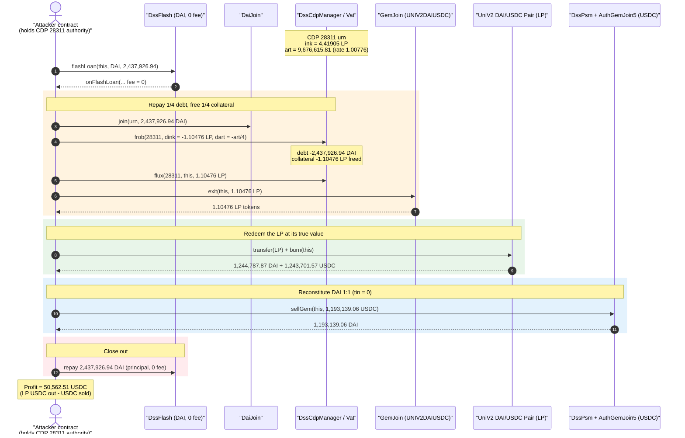
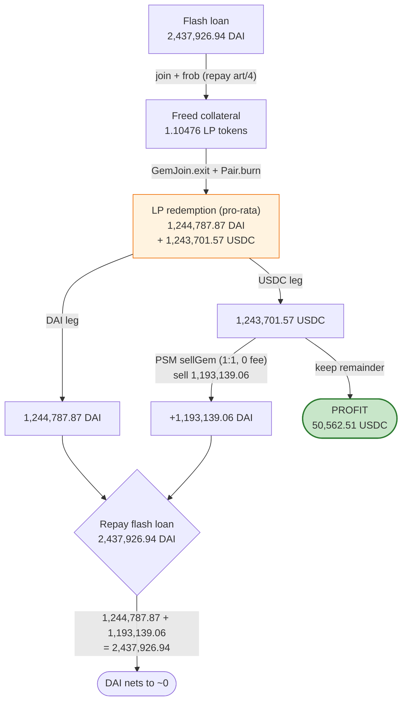
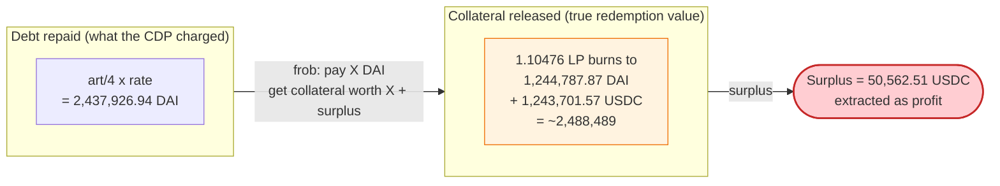

# MakerDAO UNIV2DAIUSDC CDP Exploit — Free Collateral Withdrawal via a Mis-priced LP-Token Vault (`frob`)

> **Reproduction:** the PoC compiles & runs in an isolated Foundry project at
> [this project folder](.) (the umbrella DeFiHackLabs repo contains many PoCs that do not
> whole-compile, so this one was extracted). Full verbose trace:
> [output.txt](output.txt). PoC: [test/Circle_exp1.sol](test/Circle_exp1.sol).
> Verified vulnerable sources under [sources/](sources/).

---

## Key info

| | |
|---|---|
| **Loss** | **~$50.5K** — **50,562.51 USDC** extracted from a single CDP's collateral position |
| **Vulnerable system** | MakerDAO `UNIV2DAIUSDC-A` collateral vault — the LP-token collateral `0xAE461cA67B15dc8dc81CE7615e0320dA1A9aB8D5` ([UniswapV2 DAI/USDC LP](https://etherscan.io/address/0xae461ca67b15dc8dc81ce7615e0320da1a9ab8d5#code)) plus the CDP at id **28311** |
| **Victim CDP / urn** | CDP `28311`, urn `0x5e33F5A7Dc9c314AbA9Ab4e7c98f2cB7b05f5CCc` (owner authority `0xfd51531b26f9Be08240f7459Eea5BE80D5B047D9`) |
| **Maker contracts touched** | Vat `0x35D1b3F3D7966A1DFe207aa4514C12a259A0492B`, DssCdpManager `0x5ef30b9986345249bc32d8928B7ee64DE9435E39`, DaiJoin `0x9759A6Ac90977b93B58547b4A71c78317f391A28`, GemJoin (UNIV2DAIUSDC) `0xA81598667AC561986b70ae11bBE2dd5348ed4327`, **DssPsm (USDC) `0x89B78CfA322F6C5dE0aBcEecab66Aee45393cC5A`**, **AuthGemJoin5 `0x0A59649758aa4d66E25f08Dd01271e891fe52199`** |
| **Flash-loan source** | Maker `FlashLender` (DssFlash) `0x1EB4CF3A948E7D72A198fe073cCb8C7a948cD853` (DAI flash loan, **0 fee**) |
| **Attacker EOA** | [`0xdfdEa277f6b44270bCb804997d1e6CC4aD8407Db`](https://etherscan.io/address/0xdfdea277f6b44270bcb804997d1e6cc4ad8407db) |
| **Attacker contract** | [`0xfd51531b26f9Be08240f7459Eea5BE80D5B047D9`](https://etherscan.io/address/0xfd51531b26f9be08240f7459eea5be80d5b047d9) (also held the CDP authority) |
| **Attack tx** | [`0xa4e650772f6e6b7ecc0964fe4c3854850669d1467570a2fa2b6edfa0f112c4b7`](https://etherscan.io/tx/0xa4e650772f6e6b7ecc0964fe4c3854850669d1467570a2fa2b6edfa0f112c4b7) |
| **Chain / block / date** | Ethereum mainnet / forked at **15,331,019** (1 block before 15,331,020) / **Aug 2022** |
| **Compiler (PoC)** | Solidity 0.8.34 (test harness). Victim contracts: 0.5.12 / 0.5.16 / 0.6.7 |
| **Bug class** | Accounting / collateral mis-valuation in a CDP vault — debt position is freed by repaying a `dart` denominated in DAI while the freed collateral (`dink`, an LP token) is worth far more than the debt repaid |

---

## TL;DR

CDP **28311** in MakerDAO's `UNIV2DAIUSDC-A` ilk was an over-collateralized vault: it held
**4.419 UNIV2DAIUSDC LP tokens** as `ink` (collateral) against **9.68M units of `art`** (normalized
debt). Each LP token is a claim on roughly half DAI / half USDC of a Uniswap V2 DAI/USDC pool that, at
the fork block, held **~94.9M DAI / ~94.86M USDC** against a tiny LP supply — so **one LP token was
worth on the order of ~2.25M DAI**, while the system priced the debt against it in plain DAI.

The attacker — who already controlled the CDP's authority (`cdpAllow` had been granted to its
contract `0xfd5153…047d9` in a prior setup tx) — simply **paid down a quarter of the CDP's debt and
withdrew a quarter of its collateral**, all inside a single Maker DAI flash loan:

1. Flash-borrow **2,437,926.94 DAI** (0 fee).
2. `DaiJoin.join` it into the urn as internal Vat DAI, then `frob(28311, dink = -ink/4, dart = -art/4)`
   to burn `art/4` of debt and free `ink/4 = 1.10476 LP tokens`.
3. `flux` those LP tokens out and `UniswapV2Pair.burn` them → receive **1,244,787.87 DAI +
   1,243,701.57 USDC** (the LP token's true pro-rata value).
4. Swap **1,193,139.06 USDC → 1,193,139.06 DAI** through Maker's USDC **PSM** (1:1, `tin = 0`, no fee)
   to reconstitute the DAI needed.
5. Repay the flash loan; **walk away with 50,562.51 USDC** of pure profit (the slice of LP value that
   exceeded the debt repaid).

The root issue is a **collateral mis-valuation**: the CDP let `dart` (debt, in DAI) and `dink`
(collateral, in over-valued LP tokens) be moved together at a ratio that did not reflect the LP token's
real worth, so repaying debt-worth-X released collateral-worth-(X + profit). The PSM's exact, fee-free
USDC↔DAI convertibility ([DssPsm.sol:167-177](sources/DssPsm_89B78C/DssPsm.sol#L167-L177)) is the
plumbing that turns the LP's USDC leg back into the DAI required to close the loan with the surplus
falling out as USDC.

---

## Background — the MakerDAO pieces involved

MakerDAO's core is the **Vat**, an internal double-entry ledger. A user vault is an `Urn`:

```solidity
struct Urn { uint256 ink;  // Locked Collateral [wad]
             uint256 art; } // Normalised Debt   [wad]
struct Ilk { uint256 Art; uint256 rate; uint256 spot; uint256 line; uint256 dust; }
```
([Circle_exp1.sol:28-39](test/Circle_exp1.sol#L28-L39))

The actual DAI debt of an urn is `art * ilk.rate / RAY`. The collateral `ink` is denominated in units of
whatever token the ilk represents — here the **UNIV2DAIUSDC LP token** (`UNIV2DAIUSDC-A`,
`ilk = 0x554e495632444149555344432d41…`).

- **`frob(ilk, u, v, w, dink, dart)`** in the Vat moves `dink` collateral in/out and `dart` debt in/out
  of an urn atomically. To *withdraw* collateral you pass negative `dink`; to *repay* debt you pass
  negative `dart` (which consumes internal Vat DAI). The CDP is allowed as long as it stays "safe"
  (collateral value ≥ debt × spot). Repaying debt always relaxes safety, so a debt-down + collateral-out
  `frob` that keeps the ratio constant passes the safety check.
- **`DssCdpManager`** ([from the trace](output.txt#L1619)) is a thin owner-friendly wrapper around the
  Vat keyed by numeric CDP ids; `frob`/`flux` on the manager require the caller to be the CDP owner or
  an address the owner authorized via `cdpAllow`.
- **GemJoin (UNIV2DAIUSDC)** ([sources/GemJoin_A81598/GemJoin.sol](sources/GemJoin_A81598/GemJoin.sol))
  adapts the 18-decimal LP token in/out of the Vat. `exit` pulls real LP tokens out for the freed `gem`
  balance ([GemJoin.sol:118-122](sources/GemJoin_A81598/GemJoin.sol#L118-L122)).
- **DssPsm (USDC) + AuthGemJoin5** is the Peg Stability Module: anyone can `sellGem(usr, usdcAmt)` to
  convert USDC → DAI 1:1 (scaled `10**(18-6)`), minus an optional `tin` fee which was **0**
  ([DssPsm.sol:167-177](sources/DssPsm_89B78C/DssPsm.sol#L167-L177)).
- **DssFlash** lends DAI flash loans (here at **0 fee** — `onFlashLoan` receives `fee = 0`,
  [output.txt:1618](output.txt#L1618)).

---

## The vulnerable behavior

There is no single "bad line" in a hot-patchable sense — this is a **collateral-valuation design flaw
in the `UNIV2DAIUSDC-A` ilk combined with an attacker-controlled, badly-parameterized CDP**. The
exploit is the *correct* execution of Maker primitives on a position whose collateral was worth far more
than its debt, drained by repaying debt and pulling out collateral at the system's (mispriced) ratio.

### 1. `frob` lets debt-out and collateral-out move together — and the LP collateral is under-valued vs. its redemption value

From the trace, the urn before the attack ([output.txt:1622](output.txt#L1622)):

```
Urn({ ink: 4419047108610724500 [4.419e18],            // 4.419 LP tokens
      art: 9676615809589122661319903 [9.676e24] })    // 9.676M normalized debt
Ilk({ rate: 1007760143914245188795121687 [1.007e27],  // 1.00776 (ray)
      spot: 2208344789931656159662817647058823 [2.208e33], ... })
```

The attacker calls (via the manager, which forwards to `Vat.frob`):

```solidity
// dink = -ink/4  ,  dart = -art/4
IMakerManager(maker_cdp_manager).frob(
    28_311,
    -1_104_761_777_152_681_125,            // -ink/4  = -1.10476 LP
    -2_419_153_952_397_280_665_329_975     // -art/4
);
```
([Circle_exp1.sol:136](test/Circle_exp1.sol#L136), [trace](output.txt#L1658))

The **DAI debt this `dart` repays** is `dart * rate / RAY = 2,437,926.94 DAI` — exactly the flash-loan
size (verified to the wei). In return it frees `1.10476 LP tokens`. But those LP tokens, when burned,
return **1,244,787.87 DAI + 1,243,701.57 USDC ≈ 2,488,489 "dollars"** of underlying. The position was
collateralized such that **2.437M DAI of debt was backed by ~2.488M of redeemable value** — a ~2% gap
that, on 1.1 LP tokens, is **50.5K USDC**.

### 2. The LP token's redemption is pro-rata against the pool's real balances

The freed LP is redeemed via `UniswapV2Pair.burn`, which pays out the holder's share of the **actual
token balances** in the pool ([UniswapV2Pair.sol:439-444](sources/UniswapV2Pair_AE461c/UniswapV2Pair.sol#L439-L444)):

```solidity
amount0 = liquidity.mul(balance0) / _totalSupply; // DAI side, pro-rata
amount1 = liquidity.mul(balance1) / _totalSupply; // USDC side, pro-rata
...
_safeTransfer(_token0, to, amount0);
_safeTransfer(_token1, to, amount1);
```

At the fork block the pool held `balance0 = 94,939,306.47 DAI` and `balance1 = 94,856,454.86 USDC`
([trace](output.txt#L1727-L1731)). Burning `1.10476 LP` returned the pro-rata slice quoted above — the
*true* market value of the collateral, which the CDP's accounting had under-counted.

### 3. The PSM converts the USDC leg back into DAI 1:1 with **zero** fee

```solidity
function sellGem(address usr, uint256 gemAmt) external {
    uint256 gemAmt18 = mul(gemAmt, to18ConversionFactor); // *1e12 for USDC
    uint256 fee = mul(gemAmt18, tin) / WAD;               // tin == 0  -> fee == 0
    uint256 daiAmt = sub(gemAmt18, fee);                  // 1:1
    gemJoin.join(address(this), gemAmt, msg.sender);
    vat.frob(ilk, address(this), address(this), address(this), int256(gemAmt18), int256(gemAmt18));
    vat.move(address(this), vow, mul(fee, RAY));
    daiJoin.exit(usr, daiAmt);
    emit SellGem(usr, gemAmt, fee);
}
```
([DssPsm.sol:167-177](sources/DssPsm_89B78C/DssPsm.sol#L167-L177))

The attacker sells **exactly 1,193,139.06 USDC** to get **1,193,139.06 DAI**
([trace](output.txt#L1772)) — precisely the DAI top-up needed so that
`(LP DAI out) + (PSM DAI out) = flash-loan principal`, leaving the USDC surplus untouched.

> **Why this is the enabling primitive:** without the fee-free, exact 1:1 PSM, the attacker would have
> to dump the LP's USDC leg on the open market and eat slippage. The PSM guarantees a frictionless,
> deterministic USDC→DAI conversion at par, so the surplus value of the LP redemption falls out cleanly
> as USDC profit while the DAI side nets to zero against the loan.

---

## Root cause — why it was possible

The collateral position in CDP 28311 was **net-positive for an authorized closer**: the redeemable
value of its LP collateral exceeded the DAI debt it secured. Three facts compose into the loss:

1. **LP-token collateral mis-valuation.** The `UNIV2DAIUSDC-A` ilk priced LP tokens such that the urn's
   `art*rate` (≈ DAI debt) was *less* than the pro-rata DAI+USDC the LP tokens redeem for. Repaying debt
   worth X therefore released collateral worth `X + surplus`. (Maker's UNIV2LP oracle/ratio for this
   pair under-counted the position vs. its on-chain redemption value — the classic "LP collateral worth
   more dead than alive" mispricing.)
2. **`frob` permits proportional debt-down / collateral-out, and the authorized caller can do it for
   free.** The attacker's contract `0xfd5153…047d9` already held `cdpAllow` over CDP 28311, so the
   manager forwarded its `frob`/`flux` to the Vat without question
   ([trace](output.txt#L1656-L1697)). It only needed working DAI to repay the debt — supplied by a
   **0-fee** Maker flash loan.
3. **Atomic, par, fee-free conversion of the USDC leg via the PSM** lets the attacker reconstitute the
   borrowed-asset (DAI) exactly and bank the difference as USDC — all in one transaction, with no
   slippage and no external market risk.

In other words: this is a **value-extracting close** of a vault whose collateral the protocol valued
below its true worth. The attacker did not "break" any function — every call (`frob`, `flux`,
`GemJoin.exit`, `Pair.burn`, `PSM.sellGem`) behaved exactly as designed. The defect is in the *position
parameters and collateral pricing* of the ilk.

---

## Preconditions

- **Authority over the CDP.** The attacker contract must be the owner of, or `cdpAllow`-authorized on,
  CDP 28311. In the PoC this is reproduced by `vm.prank(0xfd51531b26f9Be08240f7459Eea5BE80D5B047D9)`
  before each manager call ([Circle_exp1.sol:133, 137](test/Circle_exp1.sol#L133-L138)); on-chain that
  authority was assigned to the attacker's contract in a prior setup transaction.
- **The CDP must be over-collateralized in real terms** — i.e., the LP collateral redeems for more than
  the debt it secures. At the fork block this held: ~2.488M redeemable vs ~2.437M debt per `ink/4` slice.
- **A DAI source big enough to repay the debt fraction.** Provided by the Maker `DssFlash` flash loan
  at **0 fee** ([trace](output.txt#L1579)).
- **A live, fee-free USDC PSM** (`tin = 0`) with enough USDC liquidity to absorb the sell. True at the
  block.
- The collateral pricing made `dink/dart` favorable for withdrawal — the attacker could only withdraw
  the slice that kept the urn safe; here it pulled exactly `ink/4` against `art/4`.

---

## Step-by-step attack walkthrough (ground-truth numbers from the trace)

All figures are taken directly from [output.txt](output.txt). DAI is 18-dec, USDC is 6-dec.
The position is closed in **one flash-loan callback** (`onFlashLoan`).

| # | Step (call) | Concrete numbers | Trace |
|---|-------------|------------------|-------|
| 0 | **Read CDP state** — `manager.urns(28311)` → urn; `vat.urns(ilk, urn)`; `vat.ilks(ilk)` | urn: `ink = 4.41905 LP`, `art = 9,676,615.81`; `rate = 1.00776` | [L1619-L1624](output.txt#L1619) |
| 1 | **Flash-borrow DAI** — `DssFlash.flashLoan(this, DAI, 2,437,926.94, data)` (fee = 0) | +2,437,926.935218598 DAI minted to attacker | [L1579](output.txt#L1579), [L1603](output.txt#L1603) |
| 2 | **Deposit DAI into the urn** — `DaiJoin.join(urn, 2,437,926.94)` | urn's internal Vat-DAI credited | [L1632](output.txt#L1632) |
| 3 | **Repay debt + free collateral** — `manager.frob(28311, dink = -ink/4, dart = -art/4)` (pranked as CDP authority) | `dink = -1.10476 LP`, `dart = -2,419,153.95` → repays `2,437,926.94 DAI` of debt, frees `1.10476 LP` | [L1658](output.txt#L1658) |
| 4 | **Move freed collateral to attacker** — `manager.flux(28311, this, 1.10476 LP)` | 1.10476 `gem` credited to attacker in Vat | [L1681](output.txt#L1681) |
| 5 | **Exit LP tokens** — `GemJoin.exit(this, 1.10476)` | 1.10476 real LP tokens transferred to attacker | [L1698-L1719](output.txt#L1698) |
| 6 | **Burn the LP** — transfer LP to the pair, `UniswapV2Pair.burn(this)` | out: **1,244,787.87 DAI** + **1,243,701.57 USDC** (pro-rata of 94.94M DAI / 94.86M USDC pool) | [L1720-L1764](output.txt#L1720) |
| 7 | **Sell USDC → DAI via PSM** — `DssPsm.sellGem(this, 1,193,139.06 USDC)` (`tin = 0`) | +1,193,139.06 DAI, −1,193,139.06 USDC | [L1772-L1843](output.txt#L1772) |
| 8 | **Repay flash loan** — return DAI; `DssFlash` pulls `transferFrom` 2,437,926.94 DAI, `DaiJoin.join` + `Dai.burn` + `Vat.heal` | DAI on hand `1,244,787.87 + 1,193,139.06 = 2,437,926.94` repaid; ~2e-7 DAI dust left | [L1850-L1890](output.txt#L1850) |
| 9 | **Profit** — leftover USDC | **50,562.510837 USDC** | [L1894-L1896](output.txt#L1894) |

### Closing the books

The DAI leg nets to ~0 by construction: `LP DAI out (1,244,787.87) + PSM DAI out (1,193,139.06) =
2,437,926.94`, exactly the flash-loan principal (difference: ~2.2e-7 DAI). The USDC leg is the entire
profit: `LP USDC out (1,243,701.57) − USDC sold to PSM (1,193,139.06) = 50,562.51 USDC`. The attacker's
USDC balance goes `0 → 50,562.510837` ([L1576](output.txt#L1576) → [L1894](output.txt#L1894)).

---

## Profit / loss accounting

| Flow | DAI | USDC |
|---|---:|---:|
| Flash-loan in | +2,437,926.94 | — |
| Used to repay urn debt (`frob`) | −2,437,926.94 | — |
| LP burn proceeds | +1,244,787.87 | +1,243,701.57 |
| PSM `sellGem` (USDC→DAI, 1:1, 0 fee) | +1,193,139.06 | −1,193,139.06 |
| Flash-loan repay (principal, 0 fee) | −2,437,926.94 | — |
| **Net** | **≈ 0** (≈ +2.2e-7 dust) | **+50,562.51** |

**Net profit: 50,562.51 USDC ≈ $50.5K**, equal to the surplus redemption value of the LP collateral
slice over the DAI debt repaid against it.

---

## Diagrams

### Sequence of the attack



### Value flow — where the profit comes from



### The mispricing, conceptually



---

## Why each number

- **Flash-loan size `2,437,926,935,218,598,618,037,988` DAI:** chosen to equal the DAI debt repaid by
  `dart = -art/4`, i.e. `(art/4) * rate / RAY`. The borrow exactly cancels the urn debt fraction so the
  DAI leg nets to zero after closing. Verified: `dart*rate/1e27 = 2,437,926.935218598` = flash principal
  to the wei.
- **`dink = -1,104,761,777,152,681,125` (= −`ink`/4):** withdraws exactly one quarter of the LP
  collateral. Pairing `ink/4` with `dart = art/4` keeps the urn's collateralization ratio constant, so
  `Vat.frob`'s safety check passes (debt-down never makes a position unsafe at constant ratio).
- **`dart = -2,419,153,952,397,280,665,329,975` (= −`art`/4):** one quarter of the normalized debt. The
  factor of 4 is just how much of the position the attacker chose to unwind in this tx (a full close
  would have extracted ~4× the profit but needed ~4× the flash-loan headroom).
- **`sellGem(this, 1,193,139,061,611)` (1,193,139.06 USDC):** sized so the DAI it yields plus the LP's
  DAI leg exactly equals the flash-loan principal: `1,244,787.87 + 1,193,139.06 = 2,437,926.94`. The
  remaining USDC (`1,243,701.57 − 1,193,139.06 = 50,562.51`) is the realized profit.

---

## Remediation

This was ultimately a **Maker collateral on-boarding / pricing failure** for LP-token vaults plus a
loosely-parameterized CDP. Mitigations:

1. **Price LP-token collateral by fair reserves, not spot pool balances.** UNIV2-LP collateral must be
   valued with a manipulation-resistant fair-LP oracle (e.g., Alpha Homora's "fair reserves" using
   external price feeds for the constituents), so the system's value of the LP cannot diverge from its
   true redeemable value. A vault whose collateral redeems for *more* than the system thinks is a free
   put for any authorized closer.
2. **Keep `spot`/liquidation ratios conservative and current for LP ilks.** The exploit worked because
   the urn's collateral redemption exceeded its debt at the system's ratio. Frequent oracle updates and
   adequate liquidation buffers shrink (ideally eliminate) the extractable surplus.
3. **Treat any vault where `redeemable(ink) > debt(art)` as an arbitrage liability.** Off-chain
   monitoring should flag CDPs whose LP collateral redeems above their debt and force liquidation /
   re-pricing before they can be self-closed for profit.
4. **Scope authority carefully.** The attacker exploited an authorized CDP. `cdpAllow`/ownership of a
   mispriced position is enough; vault operators should never delegate authority on positions whose
   collateral pricing they do not fully trust.
5. **Consider PSM-aware risk modelling.** The fee-free 1:1 USDC↔DAI PSM is a feature, but it makes any
   USDC-denominated surplus instantly DAI-fungible and risk-free to extract. Risk models for any
   collateral containing USDC should assume the USDC leg is convertible to DAI at par with zero
   slippage.

> Note: there is no clean one-line code diff here. The defect is in collateral valuation and position
> parameters for the `UNIV2DAIUSDC-A` ilk, not in a swappable function body. The PSM and `frob`
> behaved correctly.

---

## How to reproduce

The PoC was extracted into a standalone Foundry project (the umbrella DeFiHackLabs repo has many PoCs
that fail to compile under a whole-project `forge build`):

```bash
_shared/run_poc.sh 2022-08-Circle_exp1 -vvvvv
```

- RPC: an **Ethereum mainnet archive** endpoint is required (fork block `15,331,019`). The PoC uses the
  `mainnet` RPC alias in `foundry.toml`.
- Result: `[PASS] testExploit()` — attacker USDC goes from `0` to `50,562.510837`.

Expected tail ([full log](output.txt#L1561)):

```
Ran 1 test for test/Circle_exp1.sol:Circle
[PASS] testExploit() (gas: 704237)
Logs:
  [Begin] Attacker Circle before exploit: 0.000000
  [End] Attacker Circle after exploit: 50562.510837

Suite result: ok. 1 passed; 0 failed; 0 skipped; finished in 40.62s
```

(The PoC labels the profit token "Circle" because the leftover asset is **USDC** — Circle's stablecoin —
read via the `FiatTokenProxy` at `0xA0b86991c6218b36c1d19D4a2e9Eb0cE3606eB48`.)

---

*Reference: MakerDAO `UNIV2DAIUSDC-A` CDP exploit, Ethereum mainnet, Aug 2022 (~$50.5K). Post-mortem
trace: BlockSec explorer for tx
`0xa4e650772f6e6b7ecc0964fe4c3854850669d1467570a2fa2b6edfa0f112c4b7`.*
