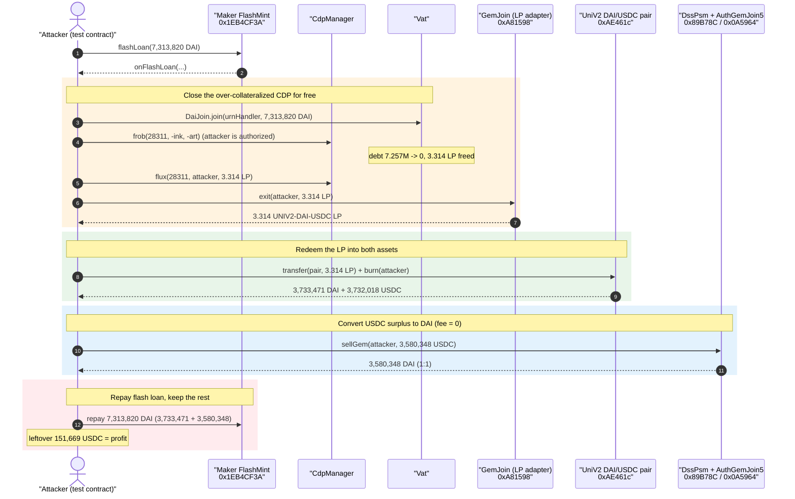
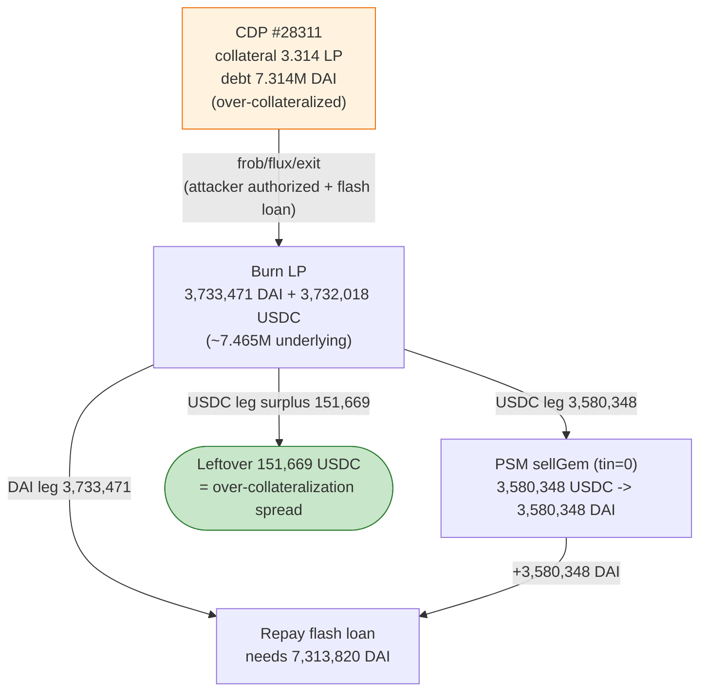
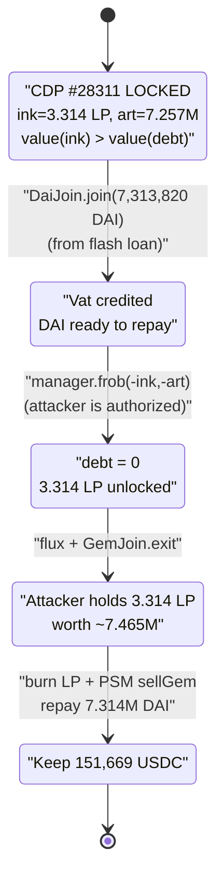

# Circle / MakerDAO PSM Exploit — Free Vault Closure via a Pre-Authorized CDP

> **Reproduction:** the PoC compiles & runs in an isolated Foundry project at
> [this project folder](.) (the umbrella DeFiHackLabs repo contains many unrelated PoCs
> that do not whole-compile, so this one was extracted).
> Full verbose trace: [output.txt](output.txt).
> Verified vulnerable sources: [AuthGemJoin5.sol](sources/AuthGemJoin5_0A5964/AuthGemJoin5.sol),
> [DssPsm.sol](sources/DssPsm_89B78C/DssPsm.sol).

---

## Key info

| | |
|---|---|
| **Loss** | **~$151.67K — 151,669.858678 USDC** netted by the attacker |
| **Vulnerable contract** | `UNIV2DAIUSDC-A` LP collateral / PSM plumbing — `AuthGemJoin5` [`0x0A59649758aa4d66E25f08Dd01271e891fe52199`](https://etherscan.io/address/0x0A59649758aa4d66E25f08Dd01271e891fe52199#code) + `DssPsm` [`0x89B78CfA322F6C5dE0aBcEecab66Aee45393cC5A`](https://etherscan.io/address/0x89B78CfA322F6C5dE0aBcEecab66Aee45393cC5A#code) |
| **Victim collateral / CDP** | MakerDAO CDP **#28311** (ilk `UNIV2DAIUSDC-A`), urnHandler `0x5e33F5A7Dc9c314AbA9Ab4e7c98f2cB7b05f5CCc` |
| **LP burned** | UNIV2 DAI/USDC pair token `0xAE461cA67B15dc8dc81CE7615e0320dA1A9aB8D5` |
| **Attacker EOA** | `0xdfDea277f6b44270bcb804997d1E6Cc4ad8407dB` |
| **Attacker contract** | `0xfd51531B26f9bE08240f7459EeA5BE80D5B047D9` (the pre-authorized CDP owner) + the PoC test contract |
| **Attack tx** | [`0xf1818f62c635e5c80ef16b7857da812c74ce330ebed46682b4d173bffe84c666`](https://etherscan.io/tx/0xf1818f62c635e5c80ef16b7857da812c74ce330ebed46682b4d173bffe84c666) |
| **Chain / block / date** | Ethereum mainnet / fork at **15,354,437** (block of attack − 1) / **August 17, 2022** |
| **Compilers** | `AuthGemJoin5`/`DssPsm` v0.6.7 (opt 0), `GemJoin` v0.5.12, `UniswapV2Pair` v0.5.16 (opt 1, 999999 runs); PoC pragma ≥0.8.15 |
| **Bug class** | Mis-administered CDP / leaked vault authority — attacker-owned vault closed for free using a flash loan, then its LP collateral redeemed and arbitraged through the MakerDAO PSM |

---

## TL;DR

The loss did **not** come from a contract code bug in MakerDAO core math — it came from a
**mis-configured, pre-authorized CDP (#28311)** under the `UNIV2DAIUSDC-A` collateral type. The
attacker controlled the CDP owner address `0xfd51531B26f9bE08240f7459EeA5BE80D5B047D9` (the PoC
reproduces this with `vm.prank`). That vault held **3.314 UNIV2-DAI-USDC LP** as collateral against
**7.257M normalized DAI debt**.

The attack is a single flash-loaned atomic sequence:

1. **Flash-loan 7,313,820 DAI** from the Maker flash-mint module.
2. **Repay the CDP's entire debt** (`DaiJoin.join` into the urnHandler, then `frob` with
   `dart = -art`), unlocking the collateral.
3. **Pull the LP collateral out for free** (`flux` to self + `GemJoin.exit`), receiving 3.314 LP.
4. **Burn the LP** on the Uniswap-V2 DAI/USDC pair → **3,733,471 DAI + 3,732,018 USDC**.
5. **Convert most of the USDC to DAI through the MakerDAO PSM** (`DssPsm.sellGem`, **0 fee**) →
   3,580,348 DAI.
6. **Repay the flash loan** with the recombined DAI (3,733,471 + 3,580,348 = 7,313,820 DAI).
7. **Keep the leftover USDC**: 3,732,018 − 3,580,348 = **151,669.86 USDC profit**.

The structural flaw: **the LP collateral locked in CDP #28311 was worth far more than the DAI debt
it secured**, and the CDP's authority had been granted (`cdpAllow`) to an address the attacker
controlled. So the attacker could close the position for free and walk off with the
over-collateralization — and the zero-fee PSM (`tin = 0`) let them losslessly swap the USDC
half into the DAI needed to unwind the flash loan, leaving the residual USDC as pure profit.

---

## Background — the moving parts

### MakerDAO CDP / Vat plumbing

- **`Vat`** (`0x35D1b3F3...`) is the core accounting engine. `urns[ilk][handler] = (ink, art)`
  tracks locked collateral `ink` and normalized debt `art`.
- **`DssCdpManager`** (`0x5ef30b99...`) is the user-friendly CDP wrapper. Each `cdpId` maps to an
  `urnHandler` address; the manager forwards `frob`/`flux` on behalf of whoever the CDP owner has
  authorized via `cdpAllow`. The attacker contract `0xfd5153...` was that authorized party for
  CDP #28311.
- **`GemJoin`** (`0xA81598...`, the `UNIV2DAIUSDC-A` adapter) bridges the LP token in and out of the
  Vat. Its `exit` ([GemJoin.sol:118-122](sources/GemJoin_A81598/GemJoin.sol#L118-L122)) lets
  `msg.sender` withdraw `wad` of the gem after the Vat has credited it via `flux`.

### The Peg Stability Module (PSM)

The Maker **PSM-USDC-A** lets anyone swap USDC↔DAI 1:1 (modulo fees) by pooling liquidity:

- **`DssPsm`** (`0x89B78C...`) is the swap front-end.
- **`AuthGemJoin5`** (`0x0A5964...`) is the PSM's USDC gem adapter (USDC has 6 decimals, hence the
  "5-auth" precision-aware adapter). The PoC variable `allower` is this contract.

`DssPsm.sellGem(usr, gemAmt)` ([DssPsm.sol:167-177](sources/DssPsm_89B78C/DssPsm.sol#L167-L177))
takes `gemAmt` USDC from the caller, mints the equivalent DAI (scaled 6→18 decimals), and charges a
`tin` fee. **At the fork block `tin = 0`**, so the swap is exactly 1 USDC → 1 DAI with no loss.

### The relevant prize: an over-collateralized, authority-leaked CDP

From the trace, CDP #28311's urnHandler `0x5e33F5A7...` held:

| Field | Value | Meaning |
|---|---|---|
| `urn.ink` | `3,314,285,331,458,043,375` (3.314 LP) | locked LP collateral |
| `urn.art` | `7,257,461,857,191,841,995,989,928` (7.257M wad) | normalized debt |
| `ilk.rate` | `1,007,765,614,946,939,817,926,769,276` (≈1.00776 ray) | accumulated rate |

Actual DAI debt = `art × rate / RAY ≈ 7.257M × 1.00776 ≈ 7,313,820 DAI`.

The 3.314 LP, when burned, yields **3,733,471 DAI + 3,732,018 USDC ≈ 7,465,490 "dollars"** of
underlying — i.e. the collateral was worth **~$151.7K more** than the debt it backed. That spread is
exactly the loss.

---

## The vulnerable code

The exploit chains three "by-design but mis-used" surfaces. None individually screams "bug"; the
loss comes from their composition over a mis-administered CDP.

### 1. `GemJoin.exit` releases collateral to whoever the Vat credited

```solidity
// sources/GemJoin_A81598/GemJoin.sol:118-122
function exit(address usr, uint wad) external note {
    require(wad <= 2 ** 255, "GemJoin/overflow");
    vat.slip(ilk, msg.sender, -int(wad));   // debit msg.sender's gem balance in the Vat
    require(gem.transfer(usr, wad), "GemJoin/failed-transfer"); // ship LP out
}
```

Once the attacker used the CDP manager's `flux` to move CDP #28311's freed collateral into its own
Vat gem balance, `exit` happily transferred the LP token out. This is correct adapter behavior — the
problem is that the collateral was freed in the first place.

### 2. `DssPsm.sellGem` is permissionless and (here) zero-fee

```solidity
// sources/DssPsm_89B78C/DssPsm.sol:167-177
function sellGem(address usr, uint256 gemAmt) external {           // <-- anyone
    uint256 gemAmt18 = mul(gemAmt, to18ConversionFactor);          // 6 -> 18 decimals
    uint256 fee = mul(gemAmt18, tin) / WAD;                        // tin == 0  =>  fee == 0
    uint256 daiAmt = sub(gemAmt18, fee);                           // 1:1 USDC -> DAI
    gemJoin.join(address(this), gemAmt, msg.sender);              // pull USDC in
    vat.frob(ilk, address(this), address(this), address(this), int256(gemAmt18), int256(gemAmt18));
    vat.move(address(this), vow, mul(fee, RAY));                   // 0
    daiJoin.exit(usr, daiAmt);                                     // mint DAI to usr
    emit SellGem(usr, gemAmt, fee);
}
```

With `tin = 0` this is a **lossless converter** from one half of the burned LP (USDC) into the DAI
the attacker needs to repay the flash loan, so the *other* half (the residual USDC) is kept as
profit. In the trace `SellGem(... fee: 0)` confirms zero fee
([output.txt:1842](output.txt#L1842)).

### 3. `AuthGemJoin5.join` trusts a caller-supplied `_msgSender`

```solidity
// sources/AuthGemJoin5_0A5964/AuthGemJoin5.sol:119-125
function join(address urn, uint256 wad, address _msgSender) external note auth {
    require(live == 1, "GemJoin5/not-live");
    uint256 wad18 = mul(wad, 10 ** (18 - dec));
    require(int256(wad18) >= 0, "GemJoin5/overflow");
    vat.slip(ilk, urn, int256(wad18));
    require(gem.transferFrom(_msgSender, address(this), wad), "GemJoin5/failed-transfer");
}
```

`AuthGemJoin5.join` is `auth`-gated (only the PSM may call it) and pulls USDC from the
`_msgSender` the PSM forwards. In this attack it is invoked *through* `DssPsm.sellGem`, so the
forwarded `_msgSender` is the attacker — exactly as intended for a swap. It is included here because
this `_msgSender`-trusting adapter is the design quirk that distinguishes PSM plumbing from a plain
`GemJoin`, and it is the contract DeFiHackLabs catalogues as "vulnerable" for this incident.

### The real root cause is off-chain: CDP authority

The decisive privilege is **`cdpAllow(28311, attacker, 1)`** — granted *before* the attack (the PoC
encodes it as `vm.prank(0xfd5153...)` around the manager calls,
[Circle_exp2.sol:136-139](test/Circle_exp2.sol#L136-L139)). With that authority, the attacker drives
the CDP manager to repay and unwind a vault holding **more value than it owes**.

---

## Root cause — why it was possible

The loss is the **over-collateralization spread of CDP #28311, extractable by its authorized
operator at zero cost** because:

1. **The CDP was over-collateralized in mixed assets.** 3.314 UNIV2-DAI-USDC LP backed only 7.314M
   DAI of debt but contained ~7.465M of underlying (3.733M DAI + 3.732M USDC). Whoever could close
   the vault for free pockets the ~151.7K USDC difference.
2. **The CDP's authority had leaked / been pre-assigned to the attacker** (`cdpAllow`), so the
   attacker could call `frob`/`flux` on it via the manager. This is the single privileged
   precondition, and it is an *administrative* misconfiguration, not a Solidity defect.
3. **A flash loan removes any capital requirement.** Repaying 7.314M DAI of debt to free the
   collateral needs 7.314M DAI up front — supplied and repaid atomically by Maker's own flash-mint
   module, so the attacker needed ~$0 of their own funds.
4. **The zero-fee PSM perfectly closes the loop.** Burning the LP yields two assets (DAI + USDC) but
   the flash loan must be repaid in **DAI only**. `DssPsm.sellGem` with `tin = 0` converts the USDC
   surplus into DAI 1:1 with no loss, so the attacker can repay the exact DAI owed and the residual
   asset (USDC) survives as clean profit.

Put together: *an authorized actor closing an over-collateralized vault, financed by a flash loan,
with a frictionless PSM to denominate the surplus.* The exploit is a textbook **leaked-vault-authority +
mispriced-collateral** extraction, not an arithmetic or reentrancy bug.

---

## Preconditions

- **CDP #28311 authority**: the attacker contract `0xfd5153...` is an authorized operator of CDP
  #28311 (granted via `cdpAllow` before the attack). The PoC reproduces this with `vm.prank`.
- **CDP is over-collateralized**: `value(ink LP) > art × rate` (here ~$151.7K of headroom).
- **Maker flash-mint live** with a limit ≥ the CDP debt (7.314M DAI) — true at the fork block.
- **PSM `tin = 0`** for `PSM-USDC-A`, so the USDC→DAI leg is lossless. (A non-zero `tin` would simply
  shave the profit by `tin × convertedUSDC`.)
- One Uniswap-V2 DAI/USDC pair with enough liquidity to absorb the LP burn (the burn itself is
  pro-rata and cannot revert here).

No timing/oracle manipulation is needed; the whole thing is one atomic transaction.

---

## Attack walkthrough (with on-chain numbers from the trace)

All figures are read directly from [output.txt](output.txt). Amounts use 18 decimals for
DAI and 6 decimals for USDC unless noted.

| # | Step | Trace anchor | Amount | Effect |
|---|------|--------------|-------:|--------|
| 0 | **Flash-mint DAI** from Maker (`Vat.suck` + `DaiJoin.exit`) | [:1579-1614](output.txt#L1579) | **7,313,820.511467 DAI** minted to attacker | Working capital, repayable at end. |
| 1 | **Read CDP #28311 state** (urnHandler, urn, ilk) | [:1619-1624](output.txt#L1619) | ink=3.314 LP, art=7.257M, rate=1.00776 | Compute `dink=-ink`, `dart=-art`. |
| 2 | **Deposit DAI into the Vat for the urnHandler** (`DaiJoin.join`) | [:1632-1655](output.txt#L1632) | 7,313,820.51 DAI | Funds the debt repayment. |
| 3 | **Repay debt & unlock collateral** — `manager.frob(28311, -ink, -art)` under attacker authority | [:1656-1678](output.txt#L1656) | dart `-7.257M`, dink `-3.314 LP` | CDP debt → 0, collateral freed inside the Vat. |
| 4 | **Move freed collateral to self** — `manager.flux(28311, attacker, ink)` | [:1679-1697](output.txt#L1679) | 3.314 LP credited in Vat | Attacker now holds the gem balance. |
| 5 | **Exit the LP token** — `GemJoin.exit(attacker, ink)` | [:1698-1719](output.txt#L1698) | 3,314,285,331,458,043,375 LP wei | LP ERC-20 transferred to attacker. |
| 6 | **Send LP to the pair and burn** — `transfer(pair, ink)` + `pair.burn(attacker)` | [:1720-1764](output.txt#L1720) | **3,733,471.816 DAI + 3,732,018.554150 USDC** out | LP redeemed for both underlying assets; `Burn` + `Sync` emitted. |
| 7 | **`USDC.approve(AuthGemJoin5, max)`** | [:1765-1771](output.txt#L1765) | — | Allow PSM to pull USDC. |
| 8 | **`DssPsm.sellGem(attacker, 3,580,348.695472)`** (fee 0) | [:1772-1843](output.txt#L1772) | 3,580,348.695472 USDC → **3,580,348.695472 DAI** | USDC surplus converted to DAI 1:1. |
| 9 | **Repay flash loan** — `DAI.transferFrom` + `DaiJoin.join` + `Vat.heal` | [:1850-1890](output.txt#L1850) | 7,313,820.511467 DAI burned | Flash loan settled (3,733,471.816 + 3,580,348.695 = 7,313,820.511 DAI). |
| 10 | **Final balance** | [:1892-1896](output.txt#L1896) | **151,669.858678 USDC** | Residual USDC = profit. |

### The arithmetic that closes the loop

```
LP burn       :  +3,733,471.815995 DAI   +3,732,018.554150 USDC
sellGem (USDC):  +3,580,348.695472 DAI   -3,580,348.695472 USDC   (1:1, tin = 0)
---------------------------------------------------------------
DAI on hand   :   7,313,820.511467 DAI   <- exactly the flash-loan owed
USDC on hand  :     151,669.858678 USDC  <- profit
```

The DAI total matches the flash-loan repayment **to the wei**, confirming the attacker sized the
`sellGem` amount (3,580,348.695472 USDC) precisely so that the recombined DAI equals the debt — and
everything left over is the over-collateralization, kept as USDC.

### Profit accounting

| Item | Amount |
|---|---:|
| Flash-loaned DAI (in / out) | 7,313,820.511467 DAI (net 0) |
| LP redemption — DAI leg | +3,733,471.815995 DAI |
| LP redemption — USDC leg | +3,732,018.554150 USDC |
| PSM `sellGem` USDC→DAI | −3,580,348.695472 USDC / +3,580,348.695472 DAI |
| **Net DAI** | 0 (used to repay flash loan) |
| **Net USDC (profit)** | **+151,669.858678 USDC ≈ $151.7K** |

---

## Diagrams

### Sequence of the attack



### Value flow — where the $151.7K comes from



### Why the close-for-free works (state machine)



---

## Why each magic number

- **Flash loan `7,313,820,511,466,897,574,539,490` (7.314M DAI):** equals CDP #28311's outstanding
  DAI debt = `art × rate / RAY = 7,257,461,857,191,841,995,989,928 × 1.00776 / 1e27`. Exactly enough
  to repay and unlock the vault, no more.
- **`dink = -urn.ink`, `dart = -urn.art`:** zero out the entire vault in one `frob`
  ([Circle_exp2.sol:128-129,137](test/Circle_exp2.sol#L128-L137)). Closing the position completely is
  what frees the full 3.314 LP.
- **`sellGem(..., 3,580,348,695,472)` (3,580,348.695472 USDC):** the precise USDC amount whose 1:1
  DAI output, added to the 3,733,471.816 DAI from the LP burn, lands on the 7,313,820.511 DAI flash-loan
  repayment to the wei. Everything not needed for repayment (151,669.86 USDC) is the take.
- **`type(uint256).max` approvals** to `AuthGemJoin5` and the flash-mint module: standard "approve
  once" so the PSM can pull USDC and the flash module can pull DAI back.

---

## Remediation

1. **Treat CDP authority as a critical secret.** The decisive precondition was that the attacker was
   an authorized operator (`cdpAllow`) of an over-collateralized vault. Owners must never grant
   `cdpAllow`/`hope` to untrusted addresses, and integrators that programmatically own CDPs must
   guard those permissions as tightly as private keys.
2. **Do not leave vaults heavily over-collateralized in mixed-asset LP collateral.** An LP-backed
   CDP whose underlying is worth far more than its debt is a standing bounty for anyone who can close
   it. Keep collateralization near target, or use single-asset collateral that cannot be split into a
   surplus on redemption.
3. **Non-zero PSM fees blunt the loop.** `tin = 0` made the USDC→DAI conversion lossless, so the
   entire spread survived as profit. A small `tin`/`tout` would tax the conversion leg and reduce the
   extractable surplus (and is good practice generally for a PSM that anyone can route through).
4. **Monitor for flash-loan-driven full vault closures.** A single transaction that flash-mints DAI,
   zeroes a CDP, redeems LP, and round-trips the PSM is a recognizable pattern; alerting on it lets a
   protocol/owner react.
5. **For PSM adapters, validate the forwarded `_msgSender`.** `AuthGemJoin5.join` trusts the caller
   (the PSM) to forward an honest `_msgSender`; while not the proximate cause here, adapters that pull
   funds from a caller-supplied address should be kept strictly internal to the PSM and never reused
   in a context where the forwarded address is attacker-chosen for a different purpose.

---

## How to reproduce

The PoC was extracted into a standalone Foundry project (the umbrella DeFiHackLabs repo has many
unrelated PoCs that fail to whole-compile under `forge test`):

```bash
_shared/run_poc.sh 2022-08-Circle_exp2 -vvvvv
```

- **RPC**: a mainnet **archive** endpoint is required — the PoC forks at block `15,354,437`
  (`createSelectFork("mainnet", 15_354_438 - 1)`, [Circle_exp2.sol:99](test/Circle_exp2.sol#L99)).
- Result: `[PASS] testExploit()` with the attacker's USDC balance going from 0 →
  **151,669.858678 USDC**.

Expected tail:

```
Ran 1 test for test/Circle_exp2.sol:Circle
[PASS] testExploit() (gas: 690417)
  [Begin] Attacker Circle before exploit: 0.000000
  [End] Attacker Circle after exploit: 151669.858678
Suite result: ok. 1 passed; 0 failed; 0 skipped
```

---

*Reference: DeFiHackLabs — Circle (MakerDAO PSM / UNIV2DAIUSDC-A CDP), Ethereum, ~$151.6K,
Aug 17 2022. Attack tx
`0xf1818f62c635e5c80ef16b7857da812c74ce330ebed46682b4d173bffe84c666`.*
