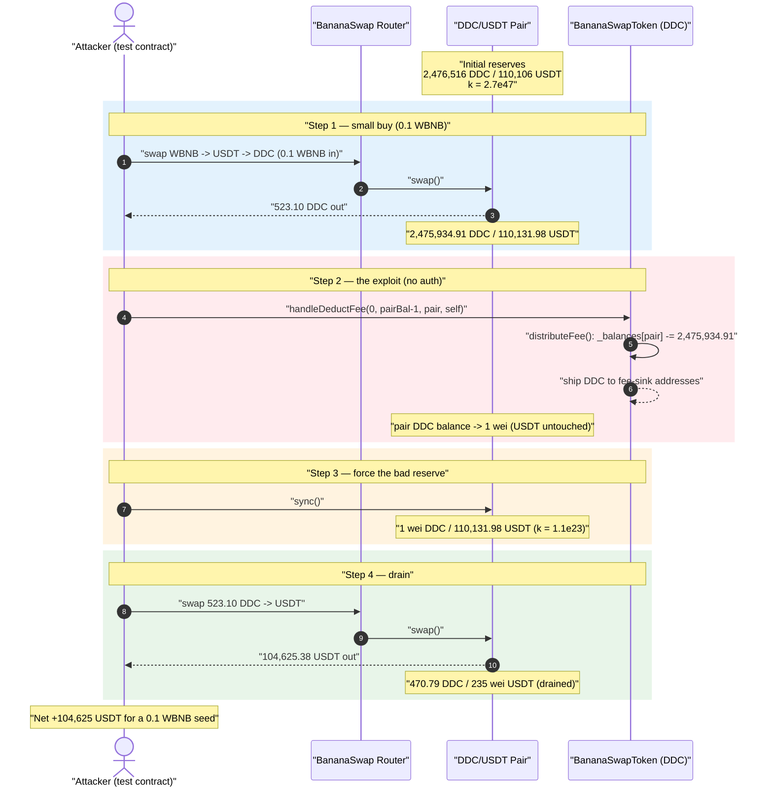
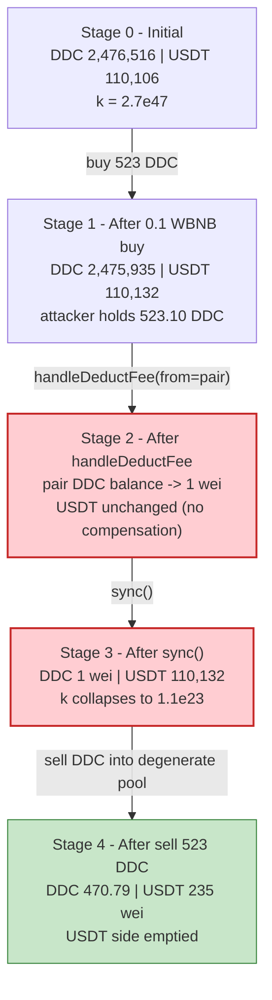
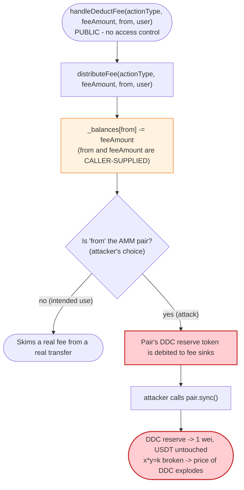
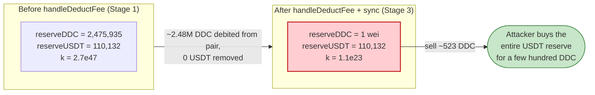

# DDC (BananaSwapToken) Exploit — Permissionless `handleDeductFee()` Pool-Reserve Drain

> **Reproduction:** the PoC compiles & runs in an isolated Foundry project at
> [this project folder](.) (the umbrella DeFiHackLabs repo contains many
> unrelated PoCs that do not whole-compile, so this one was extracted).
> Full verbose trace: [output.txt](output.txt).
> Verified vulnerable source:
> [contracts_banana_BananaSwapToken.sol](sources/BananaSwapToken_443195/contracts_banana_BananaSwapToken.sol).

---

## Key info

| | |
|---|---|
| **Loss** | ~$104,625 — **104,625.38 USDT** drained from the DDC/USDT PancakeSwap pair (attacker spent only **0.1 WBNB**) |
| **Vulnerable contract** | `BananaSwapToken` (token "DDC") — [`0x443195AA3a4357242a7427Fc8ce5f20c1E71fcB1`](https://bscscan.com/address/0x443195AA3a4357242a7427Fc8ce5f20c1E71fcB1#code) |
| **Victim pool** | DDC/USDT pair — [`0x4EFdcabA42cC31cF5198ec99BDC025aff1e32Bb0`](https://bscscan.com/address/0x4EFdcabA42cC31cF5198ec99BDC025aff1e32Bb0) |
| **Quote token** | USDT (BSC) — `0x55d398326f99059fF775485246999027B3197955` |
| **Custom router** | `0x22Dc25866BB53c52BAfA6cB80570FC83FC7dd125` (BananaSwap router, uses an `isTokenA` registry) |
| **Attack tx (on-chain)** | `0x57c8d3c33cf8acc3 b...` — see [SlowMist Hacked](https://hacked.slowmist.io/) record for DDC/BananaSwap (BSC, 2022-08-28) |
| **Chain / fork block / date** | BSC / 20,840,079 / 2022-08-28 (block ts `0x630b8589` = 15:11:05 UTC) |
| **Compiler** | Verified source built with Solidity **v0.8.4**, optimizer **1**, runs **9999** (PoC harness compiles the source under solc 0.8.34) |
| **Bug class** | Missing access control on a balance-mutating function → broken AMM `x·y=k` invariant via an un-compensated reserve burn |

> Note: the live-attack EOA/contract addresses are not embedded in the DeFiHackLabs PoC (it forks the chain and replays the call from a fresh test contract). The numbers in this write-up are taken directly from the forked-state trace in [output.txt](output.txt), which reproduces the loss exactly: `Profit ≈ 104,625 USDT`.

---

## TL;DR

`BananaSwapToken` exposes a **public, completely unauthenticated** function:

```solidity
function handleDeductFee(ActionType actionType, uint256 feeAmount, address from, address user) external override {
    distributeFee(actionType, feeAmount, from, user);
}
```

([contracts_banana_BananaSwapToken.sol:228-230](sources/BananaSwapToken_443195/contracts_banana_BananaSwapToken.sol#L228-L230)).
It is intended to be called only *internally* by the token's own transfer path to skim a trading fee.
But it has **no `onlyManager` / `onlyOwner` / "msg.sender == self" guard**, and both the `from`
address and the `feeAmount` are caller-supplied. `distributeFee` unconditionally does
`_balances[from] = _balances[from].sub(feeAmount)`
([:162](sources/BananaSwapToken_443195/contracts_banana_BananaSwapToken.sol#L162)) and ships those tokens to
configured fee-sink addresses.

So **anyone can move (effectively destroy, for the pool's purposes) almost the entire DDC balance of
the liquidity pair** by calling `handleDeductFee(0, pairBalance-1, pairAddress, self)`. After that, a
single `pair.sync()` forces the pair to register its now-empty DDC side as the new reserve — breaking
the constant-product invariant — and the attacker sells a tiny amount of DDC to scoop out the entire
USDT reserve.

The attacker:

1. **Buys** a small amount of DDC (523.10 DDC) using just 0.1 WBNB → USDT → DDC.
2. **Calls `handleDeductFee(0, pairBal-1, pair, self)`** — drains the pair's DDC balance from
   **2,475,934.91 DDC down to 1 wei** (the `-1` keeps exactly 1 wei so `sync` doesn't divide-by-zero).
3. **Calls `pair.sync()`** — the pair now believes its DDC reserve is **1 wei** while its USDT reserve
   is untouched at **110,131.98 USDT**. `k` collapses from `2.7e47` to `1.1e23`.
4. **Sells its 523.10 DDC** into the degenerate pool and pulls out **104,625.38 USDT**.

Net result: ~104,625 USDT (the pool's real USDT liquidity) for an outlay of 0.1 WBNB. The DDC's
own per-trade fee/destroy mechanics never protect the pool because the attacker enters through the
unguarded fee handler, not through a real swap.

---

## Background — what BananaSwapToken does

`BananaSwapToken`
([source](sources/BananaSwapToken_443195/contracts_banana_BananaSwapToken.sol)) is a fee-on-transfer
("tokenA") ERC20 wired into a custom **BananaSwap router** (`0x22Dc…`). Trades do not go through a
vanilla Uniswap router; instead the router consults an `isTokenA` registry
(`0x547aE9…`/`0xEfADce…` in the trace) and, for tokenA tokens, calls the token's own fee-aware transfer
entrypoints (`transferFee` / `transferFromFee`). Those entrypoints in turn call `handleDeductFee` to
peel off the configured fees and forward them to fee handlers (destroy address, marketing,
node-reward, etc.).

The fee machinery is configured per `(ActionType, FeeType)` pair in `configMaps`
([:27](sources/BananaSwapToken_443195/contracts_banana_BananaSwapToken.sol#L27),
[setFeeConfig:141-151](sources/BananaSwapToken_443195/contracts_banana_BananaSwapToken.sol#L141-L151)).
At the fork block, the **Buy** action (`ActionType.Buy = 0`) had a destroy-ratio and a marketing-ratio
configured — visible in the trace where one `handleDeductFee(0, …)` call splits the input into a
`destroyRatio` portion (to `0xE1a5…`) and a `marketingRatio` portion (to `0x0b86…`).

Relevant on-chain facts at the fork block (read from the trace):

| Parameter | Value |
|---|---|
| Pair `token0` | DDC (`0x443195AA…`) |
| Pair `token1` | USDT (`0x55d398…`) |
| Pool DDC reserve (initial) | **2,476,516.14 DDC** |
| Pool USDT reserve (initial) | **110,106.06 USDT** ← the prize |
| DDC held by the token contract itself | 0 (irrelevant — fees are debited from `from`, not the contract) |

The whole exploit hinges on one fact: `handleDeductFee` lets the caller name **any `from`**, and that
`from` can be the **liquidity pair**.

---

## The vulnerable code

### 1. `handleDeductFee` — public, no access control

```solidity
function handleDeductFee(ActionType actionType, uint256 feeAmount, address from, address user) external override {
    distributeFee(actionType, feeAmount, from, user);
}
```
[contracts_banana_BananaSwapToken.sol:228-230](sources/BananaSwapToken_443195/contracts_banana_BananaSwapToken.sol#L228-L230)

There is **no modifier** and **no `require(msg.sender == address(this))`**. Compare this to the many
functions in the same contract that *are* gated with `onlyManager`
([e.g. setTransferPercent:103](sources/BananaSwapToken_443195/contracts_banana_BananaSwapToken.sol#L103),
[setFeeConfig:141](sources/BananaSwapToken_443195/contracts_banana_BananaSwapToken.sol#L141)) — the
balance-mutating fee handler was simply left open.

### 2. `distributeFee` — debits the caller-supplied `from` directly

```solidity
function distributeFee(ActionType actionType, uint feeAmount, address from, address user) internal {
    _balances[from] = _balances[from].sub(feeAmount);          // ⚠️ caller picks `from` and `feeAmount`
    TradingOperationConfig storage operatingConfig = configMaps[actionType];
    uint len = operatingConfig.rewardTypeSet.length();
    uint256 totalFeeRatio = operatingConfig.totalFeeRatio;
    for (uint index = 0; index < len; index++) {
        ...
        uint amountOfAFee = (feeRatio * feeAmount) / totalFeeRatio;
        _balances[address(feeConfig.feeHandler)] += amountOfAFee;   // tokens shipped to fee sinks
        emit Transfer(from, feeConfig.feeHandler, amountOfAFee);
        ...
    }
}
```
[contracts_banana_BananaSwapToken.sol:159-207](sources/BananaSwapToken_443195/contracts_banana_BananaSwapToken.sol#L159-L207)

The first line is the bug: it subtracts the full `feeAmount` from whatever `from` the caller passes,
with no check that `from == msg.sender`, that `msg.sender` is the token itself, or that `feeAmount` is a
plausible fee (a fraction of an actual trade). When `from = pair`, this is an unauthorised debit of the
pool's reserve token.

### 3. The internal transfer path shows the *intended* usage

`handleDeductFee` is meant to be invoked by the token's own `_transferFrom` / `_transferFromFee`
helpers, which call it via `this.handleDeductFee(...)` after computing a *real* fee out of a *real*
transfer amount:

```solidity
deductFeeLeftAmount = this.calDeductFee(actionType, value);
uint256 feeAmount = value - deductFeeLeftAmount;
if (feeAmount > 0) {
    this.handleDeductFee(actionType, feeAmount, from, user);   // legitimate caller path
}
```
[contracts_banana_BananaSwapToken.sol:478-482](sources/BananaSwapToken_443195/contracts_banana_BananaSwapToken.sol#L478-L482)

Because `external` functions are reachable by anyone, the same entrypoint the contract uses internally
is also a free, public lever for any EOA.

---

## Root cause — why it was possible

A Uniswap-V2/PancakeSwap pair prices assets purely from its reserves and only enforces `x·y ≥ k`
*inside* `swap()`. `sync()` exists to let the pair adopt its real token balances as reserves — it
trusts that balances change only through mint/burn/swap/transfers it can reason about.

`BananaSwapToken` gives an attacker a way to **silently shrink the pair's DDC balance to ~0 without
removing any USDT**, then `sync()` it. Concretely, four facts compose into a critical bug:

1. **No access control on `handleDeductFee`.** The single most important flaw. The function that debits
   balances is `external` with no guard, so anyone can invoke the contract's internal fee mechanism on
   any account.
2. **Caller-controlled `from`.** `distributeFee` trusts the `from` argument and debits it directly.
   Pointing `from` at the AMM pair turns "deduct a fee" into "delete the pool's reserve token."
3. **Caller-controlled `feeAmount`.** There is no relationship enforced between `feeAmount` and any real
   transfer. The attacker passes `pairBalance - 1`, so essentially the entire DDC reserve is removed in
   one call (the `-1` leaves a 1-wei dust balance so the later `sync` / swap math doesn't trip a
   zero-reserve revert).
4. **`sync()` is callable by anyone and trusts balances.** After the unauthorised debit, `pair.sync()`
   makes the pair adopt its depleted DDC balance (1 wei) as the official reserve, while USDT stays at
   110,131.98. The marginal price of DDC explodes, and selling a few hundred DDC empties the USDT side.

The token's own fee/destroy mechanics (which might claw value back on a normal sell) are irrelevant here
because the attacker never relies on a "fair" trade — it manufactures the broken reserve state directly,
then performs one ordinary sell into it.

---

## Preconditions

- A DDC/USDT (or any DDC/X) PancakeSwap-style pair exists with non-trivial liquidity. ✓ (110k USDT.)
- `handleDeductFee` is reachable (it is `external`, always reachable). ✓
- The attacker holds **some** DDC to sell into the degenerate pool afterwards — obtained here with a
  trivial 0.1-WBNB buy. ✓
- `pair.sync()` is public on the pair (standard for UniswapV2/Pancake pairs). ✓

No flash loan, no admin key, no timing window, and essentially no capital are required — the 0.1 WBNB
seed is recovered many times over in the same transaction. The attack is fully atomic.

---

## Attack walkthrough (with on-chain numbers from the trace)

The pair's `token0 = DDC`, `token1 = USDT`, so `reserve0 = DDC`, `reserve1 = USDT`.
All figures are taken directly from the `Sync` / `Swap` events and `balanceOf` reads in
[output.txt](output.txt) and reconstructed from the PoC in
[test/DDC_exp.sol](test/DDC_exp.sol).

| # | Step | DDC reserve | USDT reserve | Effect |
|---|------|------------:|-------------:|--------|
| 0 | **Initial** ([trace L1633](output.txt#L1633)) | 2,476,516.14 | 110,106.06 | Honest pool. |
| 1 | **Buy DDC** — wrap 0.1 BNB→WBNB, swap WBNB→USDT→DDC; attacker receives **523.10 DDC** ([L1820](output.txt#L1820), [L1831](output.txt#L1831)) | 2,475,934.91 | 110,131.98 | Tiny buy; pool barely moves. Attacker now holds DDC to dump later. |
| 2 | **`handleDeductFee(0, pairBal-1, pair, self)`** — debits **2,475,934.91 DDC** from the pair to fee-sink addresses ([L1868-L1872](output.txt#L1868-L1872)) | (balance → 1 wei) | 110,131.98 | Pair's DDC balance annihilated; **no USDT removed**. |
| 3 | **`pair.sync()`** — pair adopts depleted balance ([L1878-L1883](output.txt#L1878-L1883)) | **1 wei** | 110,131.98 | **Invariant broken**: `k` drops from `2.7e47` → `1.1e23`. |
| 4 | **Sell 523.10 DDC** for USDT (≈470.79 DDC reaches pair after sell tax) ([L1889](output.txt#L1889), [L2098-L2109](output.txt#L2098-L2109)) | 470.79 | 235 wei | Attacker pulls out **104,625.38 USDT** — the whole USDT reserve. |

### The drain math (step 4)

After `sync`, `reserveDDC = 1 wei`, `reserveUSDT = 110,131.98e18`. PancakeSwap's `getAmountOut` is
`out = (in·9975·reserveOut) / (reserveIn·10000 + in·9975)`. With `reserveIn = 1` and `in ≈ 4.7e20`
(the post-fee DDC that lands in the pair), the denominator is dominated by `in·9975`, so
`out ≈ reserveOut` — i.e. essentially the **entire** USDT reserve is paid out for a few hundred DDC.
The trace shows `amount1Out = 110,131.98 USDT` leaving the pair ([L2109](output.txt#L2109)), of which
**104,625.38 USDT** reaches the attacker after the token's sell-side fees
([L2098](output.txt#L2098), [L2133](output.txt#L2133)).

### Profit accounting

| Item | Amount |
|---|---:|
| Spent (seed) | 0.1 WBNB (≈ 27 USDT of DDC bought) |
| USDT received by attacker | **104,625.38 USDT** |
| **Net profit** | **≈ 104,625 USDT** |

The PoC logs confirm it:

```
[Start] Attacker USDT balance before exploit: 0.000000000000000000
[End]   Attacker USDT balance after exploit: 104625.384843296409807534
```
([output.txt L1533-L1534](output.txt#L1533-L1534))

---

## Diagrams

### Sequence of the attack



### Pool-state evolution



### The flaw inside `handleDeductFee` / `distributeFee`



### Why the debit is theft: constant-product before vs. after



---

## Remediation

1. **Add access control to `handleDeductFee` (and any other balance-mutating helper).** It must only be
   callable by the token contract itself or a trusted manager:
   ```solidity
   function handleDeductFee(ActionType actionType, uint256 feeAmount, address from, address user) external override {
       require(msg.sender == address(this) || isManager[msg.sender], "unauthorized");
       distributeFee(actionType, feeAmount, from, user);
   }
   ```
   Better still, make `distributeFee` reachable **only internally** — the contract calls it via
   `this.handleDeductFee(...)`, so a `require(msg.sender == address(this))` is sufficient and exact.
2. **Do not trust a caller-supplied `from`.** Fees should be debited only from the actual party in a
   real transfer the contract itself initiated. A public function that subtracts balances from an
   arbitrary `from` is an unauthorised-transfer primitive regardless of the AMM angle.
3. **Bound `feeAmount` to a real transfer.** Even with auth, `feeAmount` should be derived from a
   transfer the contract is processing, never accepted verbatim from an external caller.
4. **Never let a token mutate a pool's reserve out-of-band.** Any deflation/burn that touches an AMM
   pair must move both reserves coherently (e.g. via the pair's own `burn()` LP redemption) or be
   confined to the protocol's own treasury balance — never a side-channel debit followed by `sync()`.
5. **Treat `sync()`-after-balance-change as a known weaponisation pattern.** If a token can change a
   pool's balance, assume someone will `sync()` it; design so that no externally reachable path can
   shrink one reserve without removing the other.

---

## How to reproduce

The PoC was extracted into a standalone Foundry project (the umbrella DeFiHackLabs repo has many
unrelated PoCs that fail under a whole-project `forge build`):

```bash
_shared/run_poc.sh 2022-08-DDC_exp -vvvvv
```

- RPC: a **BSC archive** endpoint is required (fork block 20,840,079 is from 2022-08-28).
  `foundry.toml` uses `https://bsc-mainnet.public.blastapi.io`, which serves historical state at that
  block; most pruned public BSC RPCs fail with `header not found` / `missing trie node`.
- Result: `[PASS] testExploit()` with the attacker's USDT balance going from 0 to **104,625.38 USDT**.

Expected tail:

```
Ran 1 test for test/DDC_exp.sol:ContractTest
[PASS] testExploit() (gas: 950820)
  [Start] Attacker USDT balance before exploit: 0.000000000000000000
  [End] Attacker USDT balance after exploit: 104625.384843296409807534
Suite result: ok. 1 passed; 0 failed; 0 skipped
```
([output.txt L1530-L1537](output.txt#L1530-L1537))

---

*Reference: SlowMist Hacked — https://hacked.slowmist.io/ (DDC / BananaSwap, BSC, 2022-08-28, ~$105K).*
