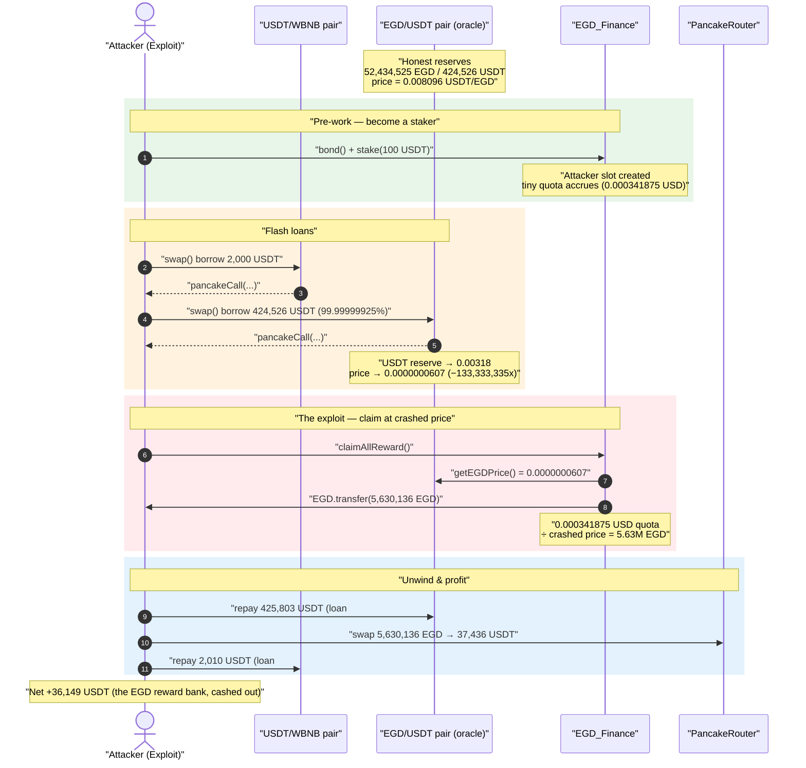
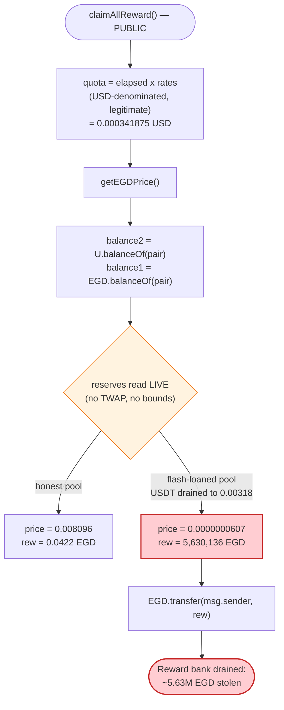
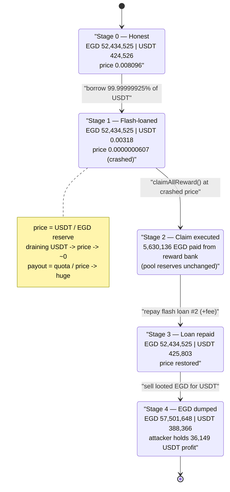

# EGD Finance Exploit — Flash-Loan Spot-Price Oracle Manipulation Inflates Staking Rewards

> **Vulnerability classes:** vuln/oracle/spot-price · vuln/governance/flash-loan-attack

> **Reproduction:** the PoC compiles & runs in an isolated Foundry project at
> [this project folder](.). Full verbose trace:
> [output.txt](output.txt). Verified vulnerable source:
> [contracts_contrtact_EGD_Defi.sol](sources/EGD_Finance_93c175/contracts_contrtact_EGD_Defi.sol).

---

## Key info

| | |
|---|---|
| **Loss** | ~$36,044 — attacker walked off with **36,149.42 USDT** (≈ the entire EGD token reserve of the pool, sold for USDT) |
| **Vulnerable contract** | `EGD_Finance` logic — [`0x93c175439726797DcEe24D08e4ac9164E88e7Aee`](https://bscscan.com/address/0x93c175439726797dcee24d08e4ac9164e88e7aee#code) (behind proxy [`0x34Bd6Dba456Bc31c2b3393e499fa10bED32a9370`](https://bscscan.com/address/0x34bd6dba456bc31c2b3393e499fa10bed32a9370)) |
| **Victim pool / oracle source** | EGD/USDT PancakeSwap pair — [`0xa361433E409Adac1f87CDF133127585F8a93c67d`](https://bscscan.com/address/0xa361433e409adac1f87cdf133127585f8a93c67d) |
| **Flash-loan source** | USDT/WBNB pair `0x16b9a82891338f9bA80E2D6970FddA79D1eb0daE` (2,000 USDT) + the EGD/USDT pair itself (424,526 USDT) |
| **Attacker EOA** | `0xee0221d76504aec40f63ad7e36855eebf5ea5edd` |
| **Attacker contract** | `0xc30808d9373093fbfcec9e026457c6a9dab706a7` |
| **Attack tx** | [`0x50da0b1b6e34bce59769157df769eb45fa11efc7d0e292900d6b0a86ae66a2b3`](https://bscscan.com/tx/0x50da0b1b6e34bce59769157df769eb45fa11efc7d0e292900d6b0a86ae66a2b3) |
| **Chain / block / date** | BSC / 20,245,522 / 2022-08-07 |
| **Compiler** | Solidity v0.8.4, optimizer 200 runs |
| **Bug class** | Spot-price (`balanceOf`-based) DEX oracle manipulated via flash loan |

---

## TL;DR

`EGD_Finance` is a USDT staking protocol that pays rewards **in EGD tokens**. A staker accrues a
USD-denominated reward "quota" over time; at claim, the contract converts that USD quota into an EGD
amount by dividing by the **current EGD price**. That price comes straight from the spot balances of
the EGD/USDT PancakeSwap pair:

```solidity
function getEGDPrice() public view returns (uint){
    uint balance1 = EGD.balanceOf(pair);   // EGD in the pool
    uint balance2 = U.balanceOf(pair);     // USDT in the pool
    return (balance2 * 1e18 / balance1);   // USDT per EGD, spot, no TWAP, no sanity check
}
```
([contracts_contrtact_EGD_Defi.sol:111-115](sources/EGD_Finance_93c175/contracts_contrtact_EGD_Defi.sol#L111-L115))

The reward conversion divides by that number:

```solidity
rew += quota * 1e18 / getEGDPrice();   // EGD owed = USD owed / EGD price
```
([:254](sources/EGD_Finance_93c175/contracts_contrtact_EGD_Defi.sol#L254))

The attacker:

1. Becomes a tiny staker (100 USDT) so it has a (negligible) reward quota of **0.000341875 USDT**.
2. **Flash-borrows 99.99999925% of the USDT** out of the EGD/USDT pair, collapsing `balance2` from
   **424,526 USDT → 0.00318 USDT** and crashing `getEGDPrice()` from
   **0.008096 → 0.0000000607** USDT/EGD — a **133,333,335×** drop.
3. Calls `claimAllReward()` *inside* the flash-loan callback. The same tiny USD quota, divided by the
   crashed price, mints an EGD payout of **5,630,136 EGD** instead of the honest **0.0422 EGD** —
   the same **133,333,335×** inflation.
4. Repays the flash loans, dumps the 5.63M EGD into the pool for **38,159 USDT**, and nets
   **36,149 USDT** profit.

Root cause: a manipulable spot-balance price feed used as the divisor in a value-conferring payout.

---

## Background — what EGD Finance does

`EGD_Finance` ([source](sources/EGD_Finance_93c175/contracts_contrtact_EGD_Defi.sol)) is an
upgradeable staking contract:

- **Stake** USDT (`stake`, [:163-189](sources/EGD_Finance_93c175/contracts_contrtact_EGD_Defi.sol#L163-L189)).
  70% of the staked USDT is auto-swapped into EGD ("re-buy"), 10% to a wallet, 20% to referrers. A
  per-stake `UserSlot` is created with a `leftQuota` (a USD-denominated reward cap) and a `rates`
  (USD reward accrued per second).
- **Accrue** rewards linearly: `calculateReward` returns
  `(block.timestamp - claimTime) * rates`, capped at `leftQuota`
  ([:191-201](sources/EGD_Finance_93c175/contracts_contrtact_EGD_Defi.sol#L191-L201)). This number is
  **denominated in USD**, not EGD.
- **Claim** via `claimAllReward` ([:240-270](sources/EGD_Finance_93c175/contracts_contrtact_EGD_Defi.sol#L240-L270)).
  For each slot it computes the USD `quota` owed and converts to EGD with
  `quota * 1e18 / getEGDPrice()`, then `EGD.transfer(msg.sender, rew)`.

The only oracle in the system is `getEGDPrice()`, which reads the **live balances** of the EGD/USDT
pair — a number anyone can move within a single transaction.

On-chain parameters at the fork block (read from the trace):

| Parameter | Value | Source |
|---|---|---|
| EGD reserve in EGD/USDT pair | 52,434,525.79 EGD | trace L264-265 |
| USDT reserve in EGD/USDT pair | 424,526.22 USDT | trace L266-267 |
| `getEGDPrice()` (honest) | 0.008096310933284567 USDT/EGD | trace L268 |
| Attacker's accrued reward quota | 0.000341874999999972 USDT-equiv | trace L273 |
| EGD held by the EGD_Finance contract (reward bank) | 5,678,872.40 EGD | trace L191 |

That last fact is the prize: the contract is sitting on **~5.68M EGD** earmarked to pay rewards.
The bug lets the attacker drain essentially all of it.

---

## The vulnerable code

### 1. Spot-balance price oracle (no TWAP, no bounds)

```solidity
function getEGDPrice() public view returns (uint){
    uint balance1 = EGD.balanceOf(pair);
    uint balance2 = U.balanceOf(pair);
    return (balance2 * 1e18 / balance1);
}
```
[contracts_contrtact_EGD_Defi.sol:111-115](sources/EGD_Finance_93c175/contracts_contrtact_EGD_Defi.sol#L111-L115)

`balanceOf(pair)` reflects the pool's **instantaneous** token balances. A flash loan that pulls USDT
out of the pair drops `balance2` to near zero, so the returned price collapses. There is no
time-weighting, no comparison against a second source, and no floor on the result.

### 2. The reward payout divides by that price

```solidity
function claimAllReward() external {
    ...
    uint quota = (block.timestamp - info.claimTime) * info.rates;   // USD-denominated
    if (quota >= info.leftQuota) { quota = info.leftQuota; }
    rew += quota * 1e18 / getEGDPrice();                            // ⚠️ divide by manipulable price
    info.claimTime = block.timestamp;
    info.leftQuota -= quota;
    ...
    EGD.transfer(msg.sender, rew);                                  // ⚠️ pays inflated EGD
}
```
[:250-267](sources/EGD_Finance_93c175/contracts_contrtact_EGD_Defi.sol#L250-L267)

The USD quota is fixed and legitimate (it represents tiny real rewards). Because `getEGDPrice()` is
the **divisor**, driving the price toward zero drives the EGD payout toward infinity (bounded only by
the contract's EGD balance and the slot's `leftQuota`).

---

## Root cause — why it was possible

A Uniswap-V2/PancakeSwap pair's instantaneous reserves are not a safe price source: any actor can
borrow one side of the pool inside a single transaction, read the now-skewed reserves, and unwind —
all atomically. `getEGDPrice()` uses exactly those instantaneous reserves, and `claimAllReward()`
uses that number as the denominator that converts a USD reward into a token payout.

Three design decisions compose into the bug:

1. **Spot price as oracle.** `getEGDPrice()` = `usdtBalance / egdBalance`, read live. It can be moved
   to any value within one tx by a flash loan, with no TWAP/averaging and no second source to
   cross-check.
2. **Price used as a divisor in a payout.** `rew = quota / price` means *lower price ⇒ more tokens
   paid*. Pushing the price down by 8 orders of magnitude inflates the payout by the same factor.
3. **No claim-time guardrails.** No slippage cap, no maximum-EGD-per-claim, no check that the EGD
   value being paid out roughly equals the USD quota owed. The contract blindly trusts the conversion.

The attacker's reward entitlement was genuinely worth a fraction of a cent
(0.000341875 USDT). The price manipulation didn't change *what was owed*; it changed *how many EGD
that debt converted into*, turning $0.00034 of rewards into 5.63M EGD ≈ the entire reward bank.

---

## Preconditions

- The attacker must be a staker with at least *some* accrued reward quota, so it has a non-zero
  `quota` for `claimAllReward` to convert. The PoC stakes 100 USDT in a pre-work step
  ([EGD_Finance_exp.sol:73-81](test/EGD_Finance_exp.sol#L73-L81)) and warps time forward so a small
  quota accrues ([:49](test/EGD_Finance_exp.sol#L49)).
- A flash-loan source large enough to drain the EGD/USDT pair's USDT. The PoC uses the EGD/USDT pair
  *itself* as the flash source (borrowing 99.99999925% of its USDT), bootstrapped by a 2,000-USDT
  flash loan from the USDT/WBNB pair to cover the PancakeSwap fee
  ([:91-126](test/EGD_Finance_exp.sol#L91-L126)).
- The claim must happen **while the price is manipulated**, i.e. inside the flash-loan callback. The
  PoC calls `claimAllReward()` from `pancakeCall` ([:119](test/EGD_Finance_exp.sol#L119)).
- The contract must hold enough EGD to satisfy the inflated payout (it held ~5.68M EGD).

No special privileges are required — `stake`, `bond`, and `claimAllReward` are all permissionless.

---

## Attack walkthrough (with on-chain numbers from the trace)

The EGD/USDT pair has `token0 = EGD`, `token1 = USDT`, so `reserve0 = EGD`, `reserve1 = USDT`.
All figures are taken from [output.txt](output.txt).

| # | Step | EGD reserve | USDT reserve | `getEGDPrice()` | Effect |
|---|------|------------:|-------------:|----------------:|--------|
| 0 | **Pre-work: stake 100 USDT** (separate tx, replicated in PoC) | 52,434,525.79 | 424,526.22 | 0.008096310933 | Attacker now has a slot; quota begins accruing. (trace L264-268) |
| 1 | **Flash-loan #1** — borrow 2,000 USDT from USDT/WBNB pair | — | — | — | Working capital to pay the 0.25% Pancake fee. (trace L281-283) |
| 2 | **Flash-loan #2** — borrow **424,526.22 USDT** (99.99999925% of reserve) from EGD/USDT pair | 52,434,525.79 | **0.00318** | **0.0000000607** | USDT reserve all but emptied → price collapses **133,333,335×**. (trace L295-311) |
| 3 | **`claimAllReward()`** inside the callback — `rew = 0.000341875 / price` | (unchanged; paid from contract balance, not pool) | 0.00318 | 0.0000000607 | Mints **5,630,136.30 EGD** to the attacker instead of 0.0422 EGD. (trace L316-367) |
| 4 | **Repay flash-loan #2** — return 425,803.63 USDT (borrowed + 0.3% fee) to the pair | 52,434,525.79 | 425,803.64 | restored | Pool USDT restored; price normal again. (trace L385-396) |
| 5 | **Dump 5,630,136.30 EGD** into the pool via router | 57,501,648.46 | 388,366.80 | — | Receives **37,436.83 USDT** for the looted EGD. (trace L414-451) |
| 6 | **Repay flash-loan #1** — return 2,010 USDT to USDT/WBNB pair | — | — | — | (trace L458-472) |
| 7 | **Withdraw profit** — transfer remaining USDT to attacker EOA | — | — | — | **36,149.42 USDT** net profit. (trace L480-495) |

### The inflation, exactly

The USD quota that `claimAllReward` converted is **0.000341874999999972 USDT-equivalent** — identical
to the honest `calculateAll` snapshot (the warp froze further accrual). The conversion is
`rew = quota * 1e18 / price`:

| | Honest price | Manipulated price |
|---|---:|---:|
| `getEGDPrice()` | 0.008096310933284567 | 0.000000060722331 |
| EGD paid for 0.000341875 USD quota | **0.0422 EGD** (≈ $0.00034) | **5,630,136.30 EGD** |
| Ratio | 1× | **133,333,335×** |

The inflation factor (133,333,335) equals the price-drop factor to the digit — confirming the payout
scales inversely with the manipulated price.

### Profit accounting (USDT)

| Direction | Amount (USDT) |
|---|---:|
| Flash-loan #1 borrowed | 2,000.00 |
| Flash-loan #2 borrowed | 424,526.22 |
| Flash-loan #2 repaid (incl. fee) | −425,803.63 |
| Flash-loan #1 repaid (incl. fee) | −2,010.00 |
| Proceeds from selling 5.63M EGD | +37,436.83 |
| **Attacker EOA USDT after** | **36,149.42** |

The 5.63M EGD came essentially for free — it was minted out of the contract's reward bank by the
inflated conversion — so the entire ~36.1k USDT (≈ $36,044) is pure profit, equal to the market value
of the looted EGD net of slippage and flash-loan fees.

---

## Diagrams

### Sequence of the attack



### Reward-conversion data flow (the flaw)



### Pool / price state evolution



---

## Why each magic number

- **Flash-loan #2 = 424,526.22 USDT (99.99999925% of the pool's USDT):** sized to remove essentially
  all USDT, driving `getEGDPrice()` as low as possible. The remaining 0.00318 USDT keeps `balance2`
  non-zero (avoiding division weirdness) while pushing the price to 0.0000000607 — an 8-orders-of-
  magnitude drop. (trace L295, L310)
- **Flash-loan #1 = 2,000 USDT from USDT/WBNB:** working capital to cover PancakeSwap's 0.25% swap
  fee on the giant EGD/USDT borrow, since the attacker starts with 0 USDT. Repaid with a 2,010-USDT
  transfer (>0.25% buffer). (trace L281, L458)
- **Quota = 0.000341875 USD:** the attacker's genuine, tiny accrued reward — the *only* legitimate
  input. The exploit multiplies it by 133,333,335 purely through the price divisor. (trace L273)
- **5,630,136.30 EGD paid out:** `0.000341875 USD ÷ 0.0000000607 price`. Bounded by the contract's
  ~5.68M EGD reward bank, so the attack drains nearly the whole reserve. (trace L322, L367)

---

## Remediation

1. **Do not use spot DEX balances as a price oracle.** Replace `getEGDPrice()` with a manipulation-
   resistant source: a Chainlink feed, a Uniswap-V2 cumulative-price **TWAP** sampled over a window,
   or a price computed from `getReserves()` with a multi-block time-weighting. Spot
   `balanceOf(pair)` is trivially flash-loanable.
2. **Sanity-bound the conversion.** Even with a better oracle, cap the EGD paid per claim against the
   USD quota: revert if the implied price deviates more than a small percentage from a reference, or
   cap EGD-out per slot. A claim that converts $0.00034 into 5.6M tokens should be impossible.
3. **Make rewards path-independent of instantaneous pool state.** Denominate and pay rewards in EGD
   directly (fixed EGD-per-second), or settle the USD↔EGD conversion using an averaged price snapshot
   taken at stake time / over the accrual window, not at the manipulable instant of claim.
4. **Add reentrancy / flash-loan context guards.** While the core fix is the oracle, gating value-
   transferring functions so they cannot execute inside an attacker-controlled callback (or checking
   that pool reserves are within expected bounds) provides defense in depth.
5. **Cross-check against a second venue.** If only a single thin pool exists, the protocol should not
   key payouts off it at all without external price validation.

---

## How to reproduce

The PoC runs in a standalone Foundry project (the umbrella DeFiHackLabs repo has many unrelated PoCs
that fail to compile under a whole-project build, so this one was isolated):

```bash
_shared/run_poc.sh 2022-08-EGD_Finance_exp -vvvvv
```

- RPC: a **BSC archive** endpoint is required (fork block 20,245,522). Most public BSC RPCs prune
  state this old and fail with `header not found` / `missing trie node`.
- Result: `[PASS] testExploit()`.

Expected tail (see [output.txt](output.txt)):

```
  [INFO] EGD/USDT Price before price manipulation: 0.008096310933284567
  [INFO] Current earned reward (EGD token): 0.000341874999999972
  ...
  [INFO] EGD/USDT Price after price manipulation: 0.000000000060722331
  [INFO] Get reward (EGD token): 5630136.300267721935770000
  -------------------------------- End Exploit ----------------------------------
  [End] Attacker USDT Balance: 36149.420145779809942475

Suite result: ok. 1 passed; 0 failed; 0 skipped
```

---

*Reference: BlockSec (https://twitter.com/BlockSecTeam/status/1556483435388350464) and PeckShield
(https://twitter.com/PeckShieldAlert/status/1556486817406283776), EGD Finance, BSC, ~$36K.*
