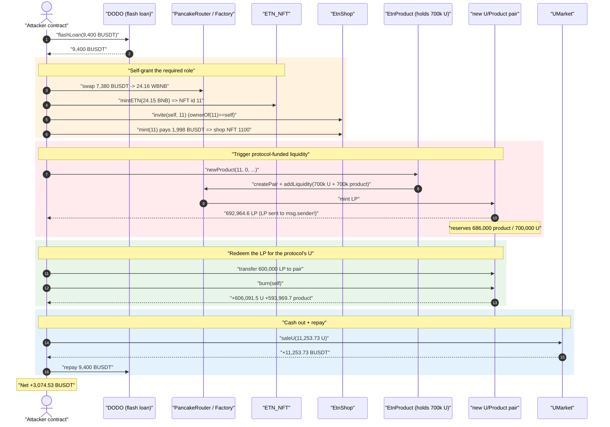
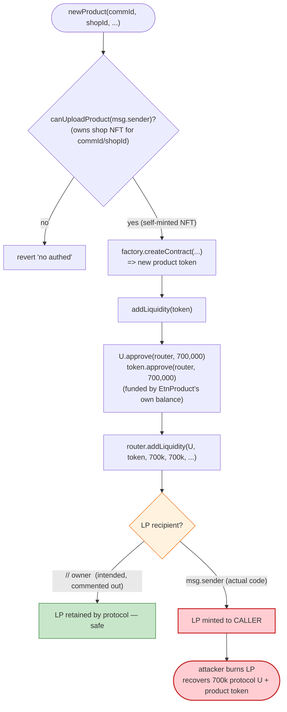
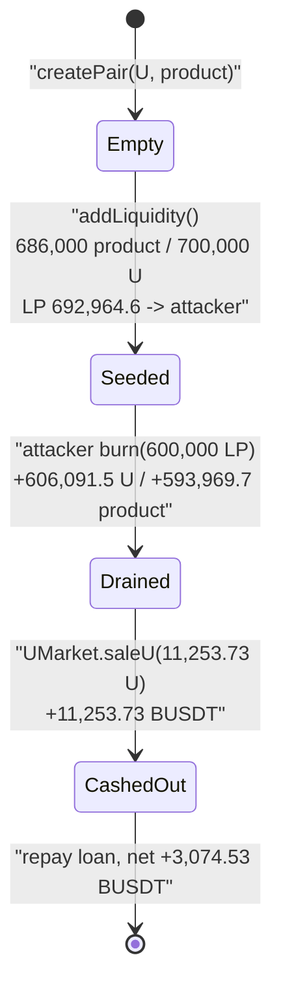

# ETN / EtnProduct Exploit — Protocol-Funded Liquidity Sent to the Caller (`addLiquidity → msg.sender`)

> **Reproduction:** the PoC compiles & runs in an isolated Foundry project at
> [this project folder](.) (the umbrella DeFiHackLabs repo contains several unrelated
> PoCs that do not compile under a whole-project build, so this one was extracted).
> Full verbose trace: [output.txt](output.txt).
> Verified vulnerable source: [EtnProduct.sol](sources/EtnProduct_129226/EtnProduct.sol).

---

## Key info

| | |
|---|---|
| **Loss** | ~$3,074 — net **3,074.53 BUSDT** profit; the attacker drained ~606,091 `U` tokens of protocol-seeded liquidity |
| **Vulnerable contract** | `EtnProduct` — [`0x1292267f726e6F313972ec4e14578735473e1649`](https://bscscan.com/address/0x1292267f726e6F313972ec4e14578735473e1649#code) |
| **Victim asset** | `U` token — [`0xaa33085e8Fa2CB903157324603E4601299E5dA06`](https://bscscan.com/address/0xaa33085e8Fa2CB903157324603E4601299E5dA06) (sold for BUSDT via `UMarket`) |
| **Cash-out venue** | `UMarket` — [`0xc0e8D30D2ead2C324b3f1A8386992Ba1Be534CbF`](https://bscscan.com/address/0xc0e8D30D2ead2C324b3f1A8386992Ba1Be534CbF) |
| **Attacker EOA** | [`0xde703797fe9219b0485fb31eda627aa182b1601e`](https://bscscan.com/address/0xde703797fe9219b0485fb31eda627aa182b1601e) |
| **Attack contract** | [`0x178bf96e303fb31aef1b586271a63acd33e4eaf7`](https://bscscan.com/address/0x178bf96e303fb31aef1b586271a63acd33e4eaf7) |
| **Attack tx** | [`0x72321a3b50bb68ac3b46b0ab973b0e87b6c48ab73d23c4ba2cb73527f978d995`](https://app.blocksec.com/explorer/tx/bsc/0x72321a3b50bb68ac3b46b0ab973b0e87b6c48ab73d23c4ba2cb73527f978d995) |
| **Chain / block / date** | BSC / 20,147,974 / ~Aug 2, 2022 |
| **Compiler** | `EtnProduct` Solidity v0.8.1, optimizer **off** (runs 200) |
| **Bug class** | Access-controlled-but-self-grantable role + LP minted to `msg.sender` (protocol funds the pool, caller keeps the LP) |

---

## TL;DR

`EtnProduct.newProduct()` is the protocol's "list a product" function. For every new product it:

1. creates a brand-new ERC20 "product token", and
2. **seeds a Uniswap/Pancake pair with `700,000 U` taken from `EtnProduct`'s own `U` balance** plus
   `700,000` of the freshly-minted (worthless) product token.

The fatal flaw: the LP tokens minted by `addLiquidity` are sent to **`msg.sender`**, not to the
protocol owner ([EtnProduct.sol:133](sources/EtnProduct_129226/EtnProduct.sol#L133) — the commented-out
`// owner,` directly above it betrays the original intent). So whoever calls `newProduct()` ends up
owning a pool that the protocol just funded with **700k of real `U`**.

The only thing standing in the way is an authorization check (`canUploadProduct`), but that check is
keyed on NFT ownership the attacker can **buy for themselves in the same transaction**:

- mint ETN-NFT #11 (cheap) → become "owner of community 11",
- `EtnShop.invite(self, 11)` then `EtnShop.mint(11, …)` (cost 1,998 BUSDT) → become "owner of shop 1100",
- which makes `canUploadProduct(self, 11, 0) == true`.

The attacker then calls `newProduct(11, 0, …)`, receives the freshly-minted LP, immediately
`burn()`s it back, recovers **~606,091 `U` + ~593,969 product token**, and dumps the `U` into
`UMarket.saleU()` for BUSDT. Everything is wrapped in a 0-fee DODO flash loan to cover the up-front
swap/mint costs. Net profit: **3,074.53 BUSDT**.

---

## Background — the ETN product/shop stack

The ETN system is a chain of NFT-gated roles culminating in a token-launch function:

- **`ETN_NFT`** ([source](sources/ETN_NFT_48835A/ETN_NFT.sol)) — an ERC721 used as the
  "community" (`commNft`) registry. `mintETN()` is a permissionless payable mint
  ([ETN_NFT.sol:739-751](sources/ETN_NFT_48835A/ETN_NFT.sol#L739-L751)); the token id is just
  `totalSupply()`, so the *next* NFT minted gets the next sequential id.
- **`EtnShop`** ([source](sources/EtnShop_BceF29/EtnShop.sol)) — registers "shops" under a community.
  `invite()` lets a community owner whitelist an address ([EtnShop.sol:128-132](sources/EtnShop_BceF29/EtnShop.sol#L128-L132));
  `mint()` then mints a shop NFT (cost `1998 USDT`) and is the gate for product uploads
  ([EtnShop.sol:135-163](sources/EtnShop_BceF29/EtnShop.sol#L135-L163)). `canUploadProduct()` returns
  true iff the caller owns the shop NFT for `(commId, shopId)`
  ([EtnShop.sol:216-219](sources/EtnShop_BceF29/EtnShop.sol#L216-L219)).
- **`EtnProduct`** ([source](sources/EtnProduct_129226/EtnProduct.sol)) — the launch contract. It holds
  a large balance of `U` and, on each `newProduct()`, spends `swapAmount = 700,000 U`
  ([EtnProduct.sol:79](sources/EtnProduct_129226/EtnProduct.sol#L79)) to bootstrap a pool for the new
  product token.
- **`U`** ([source](sources/U_aa3308/U.sol)) — a deflationary ERC20 (0.6% burn-on-transfer for
  non-whitelisted transfers).
- **`UMarket`** ([source](sources/UMarket_c0e8D3/UMarket.sol)) — an OTC desk that buys `U` back for
  BUSDT via `saleU()` ([UMarket.sol:149-164](sources/UMarket_c0e8D3/UMarket.sol#L149-L164)). This is
  where the stolen `U` is converted to cash.

On-chain facts at the fork block (from the trace):

| Fact | Value |
|---|---|
| `EtnProduct.swapAmount` (U seeded per product) | **700,000 U** |
| `EtnShop.mintCost` | **1,998 BUSDT** |
| `ETN_NFT.totalSupply()` just before the attack | **11** → next minted id = **11** |
| LP recipient in `addLiquidity` | **`msg.sender`** (the caller) |

That last row is the whole game.

---

## The vulnerable code

### 1. `newProduct()` — gated only by self-grantable NFT ownership

```solidity
// EtnProduct.sol:102-116
function newProduct(uint commId, uint shopId, uint price, string memory name, string memory video ) public {
    bool authed = etnShop.canUploadProduct(msg.sender, commId, shopId);
    require(authed, "no authed");
    uint shopTokenId = etnShop.getTokenId(commId,shopId);
    ...
    address erc20Addr = factory.createContract( name,  name, bytes32(shopTokenId));
    ...
    addLiquidity(erc20Addr);          // ← seeds a pool with 700k of the PROTOCOL's U
    emit NewToken(erc20Addr);
}
```

`canUploadProduct` only checks `shopNft.ownerOf(getTokenId(commId,shopId)) == msg.sender`
([EtnShop.sol:216-219](sources/EtnShop_BceF29/EtnShop.sol#L216-L219)). There is no restriction on *who*
can become that owner — the role is mintable on demand.

### 2. `addLiquidity()` — protocol pays, **caller** receives the LP

```solidity
// EtnProduct.sol:118-136
function addLiquidity(address token) private {
    if(address(uniswapV2Router) == address (0)){ return; }
    U.approve(address(uniswapV2Router), swapAmount);                 // 700,000 U of the PROTOCOL's balance
    IERC20(token).approve( address(uniswapV2Router), swapAmount);

    uniswapV2Router.addLiquidity(
        address (U),
        token,
        swapAmount,      // 700,000 U
        swapAmount,      // 700,000 product token
        swapAmount,
        swapAmount,
//            owner,     // ⚠️ intended recipient, commented out
        msg.sender,      // ⚠️⚠️ LP minted to the CALLER instead
        block.timestamp
    );
}
```

The `U` and the new product token both come from `EtnProduct`'s own balances/approvals, but the
liquidity-provider position (the LP tokens) is handed to `msg.sender`. Burning that LP returns both
underlying tokens — including the protocol's 700k `U` — to the attacker.

### 3. `UMarket.saleU()` — converts the stolen `U` into BUSDT

```solidity
// UMarket.sol:149-164
function saleU(uint256 _amount) public {
    require(_amount > 0, "!zero input");
    uint cost = getSaleCost(_amount);
    ...
    U.transferFrom(msg.sender,address(this), cost);
    uint usdtBalanced = usdt.balanceOf(address(this));
    require(usdtBalanced >= _amount, "!market balanced");
    usdt.transfer( msg.sender,_amount);   // pays out _amount of BUSDT
    SaleU(msg.sender, _amount, cost);
}
```

The desk simply buys `U` back for BUSDT, so the recovered `U` is liquid.

---

## Root cause

> **Protocol-owned value is provisioned into a pool, but the claim on that value (the LP token) is
> assigned to the untrusted caller.** Combined with an authorization gate (`canUploadProduct`) whose
> required role is permissionlessly mintable, this lets anyone trigger a 700,000-`U` "donation" to a
> pool they exclusively own, then reclaim it via `pair.burn()`.

Two design errors compose into the exploit:

1. **Wrong LP recipient (the core bug).** `addLiquidity` passes `msg.sender` to the router. The
   commented-out `// owner,` immediately above it shows the LP was meant to be retained by the
   protocol. Because the seed tokens are the protocol's, the LP token *is* a bearer claim on protocol
   funds — and it is handed to the caller. The `min` amounts are set equal to the desired amounts, so
   the call cannot silently re-price/short the attacker; they reliably mint the full position.
2. **Self-grantable authorization.** `newProduct`'s only guard is shop-NFT ownership. The full role
   chain (community NFT → invite → shop NFT) is reachable by any address in a single transaction for
   `1,998 BUSDT` + a cheap NFT mint. Sequential NFT ids (`tokenId = totalSupply()`) made it trivial to
   grab "community 11" — exactly the id the attacker chose for `commId`.

Neither error alone is catastrophic; together, "anyone may, for a small fee, cause the protocol to
fund a pool and then walk off with the LP" is a direct drain of `EtnProduct`'s `U` treasury, one
700k-`U` block per call.

---

## Preconditions

- `EtnProduct` holds ≥ `swapAmount` (700,000) `U` and has a non-zero router configured (true at the
  fork block — the `U.transferFrom(EtnProduct → pair, 700,000)` succeeds in the trace).
- The attacker can obtain the shop-NFT role for some `(commId, shopId)`. With sequential NFT ids and a
  permissionless `mintETN`, the attacker mints the next community NFT (id 11), self-invites, and mints
  the shop NFT — all permissionless given the mint fees.
- Working capital for the up-front fees (NFT mint value + 1,998 BUSDT shop fee + a swap). All of it is
  recovered intra-transaction, so the attack is **flash-loanable** — the PoC borrows 9,400 BUSDT from
  DODO at 0 fee.

---

## Attack walkthrough (with on-chain numbers from the trace)

Driver: [test/EtnProduct_exp.sol](test/EtnProduct_exp.sol). All figures are taken directly from the
events / return values in [output.txt](output.txt). The new product token is
`0x7Af5…2BD3`; its pair with `U` is `0xc905…5a71` (`token0 = product`, `token1 = U`).

| # | Step (trace ref) | Effect | Key numbers |
|---|------------------|--------|-------------|
| 0 | **Flash loan** 9,400 BUSDT from DODO ([output.txt:1604](output.txt)) | Working capital | +9,400 BUSDT |
| 1 | **Swap** 7,380 BUSDT → WBNB ([output.txt:1638](output.txt)) | Buys the BNB used to mint the NFT | 7,380 BUSDT → 24.16 WBNB |
| 2 | **`mintETN`** (24.15 BNB) ([output.txt:1674](output.txt)) | Mints ETN-NFT **id 11** to attacker → "owner of community 11" | NFT #11 → attacker |
| 3 | **`EtnShop.invite(self, 11)`** ([output.txt:1689](output.txt)) | Passes `commNft.ownerOf(11)==self`; whitelists attacker for community 11 | inviteMap[11][self]=true |
| 4 | **`EtnShop.mint(11,…)`** ([output.txt:1730](output.txt)) | Pays 1,998 BUSDT, mints **shop NFT 1100** to attacker | −1,998 BUSDT |
| 5 | **`newProduct(11, 0, …)`** ([output.txt:1749](output.txt)) | `canUploadProduct` passes; creates product token; **`addLiquidity` mints pool from 700k protocol `U` + 700k product token, LP → attacker** | pool: 686,000 product / 700,000 U; LP **692,964.6** → attacker |
| 6 | **`Pair.transfer(pair, 600,000 LP)`** ([output.txt:1859](output.txt)) | Sends LP back to the pair to redeem | 600,000 LP queued |
| 7 | **`Pair.burn(self)`** ([output.txt:1859](output.txt)) | Redeems LP: returns underlying to attacker; pool drained ~87% | **+606,091.5 U** and +593,969.7 product token |
| 8 | **`U.approve(UMarket, 9.999e24)` + `UMarket.saleU(11,253.73)`** ([output.txt:1899](output.txt)) | Sells recovered `U` for BUSDT 1:1 | −11,253.73 U, **+11,253.73 BUSDT** |
| 9 | **Repay flash loan** 9,400 BUSDT ([output.txt:1924](output.txt)) | Closes the DODO loan (0 fee) | −9,400 BUSDT |
| — | **End balance** ([output.txt:1947](output.txt)) | | **3,074.53 BUSDT** |

Notes on the pool numbers:

- At `Pair.mint` the reserves are recorded as `Sync(reserve0 = 686,000 product, reserve1 = 700,000 U)`
  ([output.txt:1830](output.txt)) — the product token is fee-on-transfer (2% to dead), so 700,000 sent
  becomes 686,000 received; the `U` side arrives whole because the pair path is `U`-whitelisted (the
  trace shows `U.transferFrom(EtnProduct → pair, 700,000)` with no burn).
- The attacker received **692,964.6 LP** ([output.txt:1831](output.txt)), transferred 600,000 of it
  back and burned, recovering **593,969.7 product token** and **606,091.5 U**
  (`Burn(amount0 = 593,969.7, amount1 = 606,091.5)`, [output.txt:1886](output.txt)). The residual LP
  (~92,964) and the leftover product token are dust the attacker ignores — the prize is the `U`.

The entire `U` recovery (606,091) far exceeds what is needed; the attacker only sells 11,253.73 `U`
through `UMarket` because that is what nets the round profit after repaying the loan and fees.

### Profit accounting (BUSDT)

| Direction | Amount |
|---|---:|
| Borrowed (DODO, 0 fee) | +9,400.00 |
| Spent — swap to BNB for NFT mint | −7,380.00 |
| Spent — shop mint fee | −1,998.00 |
| Received — `UMarket.saleU` payout | +11,253.73 |
| Repaid — DODO flash loan | −9,400.00 |
| **Net profit** | **+3,074.53** |

The `3,074.53 BUSDT` end balance is confirmed by the final `log_named_decimal_uint("[End] …")`
returning `3074534856316884358000` ([output.txt:1947](output.txt)). Economically the attacker
extracted ~606k `U` of protocol liquidity and converted the profitable slice to ~$3,074; the value
lost by the protocol is the 700k `U` it seeded into a pool it no longer controls.

---

## Diagrams

### Sequence of the attack



### Where the value leaks (`newProduct` / `addLiquidity`)



### Pool lifecycle: created by the protocol, drained by the caller



---

## Why each magic number

- **9,400 BUSDT flash loan** — just enough to cover the 7,380-BUSDT swap (for NFT-mint BNB) plus the
  1,998-BUSDT shop fee with headroom, all repaid at the end (DODO charges 0 fee here).
- **24.15 BNB into `mintETN`** — well above `mintPrice` (1.82 BNB); the only requirement is `msg.value
  >= mintPrice` and `totalSupply()+1 <= MAX_SUPPLY`. Overpaying is harmless; it simply mints NFT id 11.
- **`commId = 11`** — equals `ETN_NFT.totalSupply()` at the fork block, so the attacker's fresh mint
  *is* community 11; `invite` then passes `commNft.ownerOf(11)==self`.
- **`shopId = 0`** — first shop in community 11; `getTokenId(11,0) = 11*100+0 = 1100`, the shop NFT id
  the attacker receives from `EtnShop.mint`.
- **700,000** — `EtnProduct.swapAmount`, the fixed `U` (and product) amount seeded per pool; this is
  exactly the protocol value the attacker reclaims.
- **600,000 LP burned** — most of the 692,964.6 LP received; enough to extract the bulk of the 700k `U`
  while leaving dust behind (precision is irrelevant — the attacker only needs to recover more `U` than
  it sells).
- **11,253.73 U sold via `saleU`** — sized so the BUSDT payout (1:1 at the observed `salePrice`),
  minus the loan repayment and fees, lands the round +3,074.53 BUSDT profit.

---

## Remediation

1. **Send LP to the protocol, not the caller.** The one-line fix: pass `owner` (or a dedicated
   treasury) instead of `msg.sender` to `router.addLiquidity`
   ([EtnProduct.sol:133](sources/EtnProduct_129226/EtnProduct.sol#L133)). The commented `// owner,`
   above it is the intended behavior. This alone neutralizes the drain — the caller can list a product
   but never owns a claim on the protocol-seeded liquidity.
2. **Don't fund pools from caller-triggerable functions, or charge for the seed.** If product listing
   must bootstrap liquidity from protocol funds, the listing fee should cover (or exceed) the seeded
   value, and/or the seeded `U` should come from the *lister*, not the protocol's treasury.
3. **Harden the authorization chain.** `newProduct` trusts a role (`shopNft` ownership) that any
   address can mint for a small fee. Gate product creation behind a vetted/allow-listed lister, a
   meaningful economic stake, or owner approval — not a freely mintable NFT.
4. **Avoid sequential, predictable NFT ids for trust decisions.** Keying "community owner" off
   `tokenId = totalSupply()` lets an attacker grab any soon-to-be id by minting at the right moment.
   Decouple community membership from raw mint order.
5. **Cap / monitor per-call treasury outflow.** A single function that moves 700,000 `U` of protocol
   funds per invocation, with no rate limit and no retained claim, is a standing liability; add a cap
   and emit auditable accounting of every seeded pool.

---

## How to reproduce

The PoC was extracted into a standalone Foundry project (the umbrella DeFiHackLabs repo has several
unrelated PoCs that fail to compile under `forge test`'s whole-project build):

```bash
_shared/run_poc.sh 2022-08-EtnProduct_exp -vvvvv
```

- RPC: a **BSC archive** endpoint is required (fork block 20,147,974). The PoC selects the `bsc`
  endpoint from `foundry.toml`; most public BSC RPCs prune state this old and fail with
  `header not found` / `missing trie node` — use an archive provider.
- Result: `[PASS] testExploit()` with `[End] Attacker BUSDT after exploit: ~3074.53`.

Expected tail (from [output.txt](output.txt)):

```
    ├─ emit log_named_decimal_uint(key: "[End] Attacker BUSDT after exploit", val: 3074534856316884358000 [3.074e21], decimals: 18)
    └─ ← [Stop]

Suite result: ok. 1 passed; 0 failed; 0 skipped; finished in 29.27s
Ran 1 test suite: 1 tests passed, 0 failed, 0 skipped (1 total tests)
```

---

*Reference: BeosinAlert — https://x.com/BeosinAlert/status/1555439220474642432 (ETN, BSC, ~$3K).*
