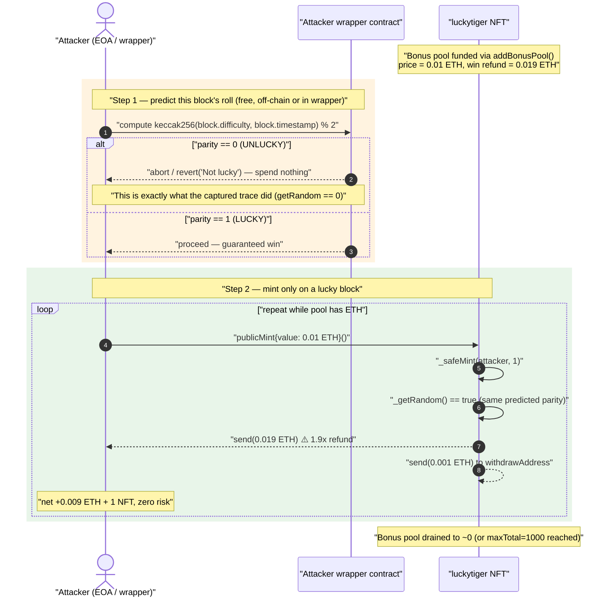
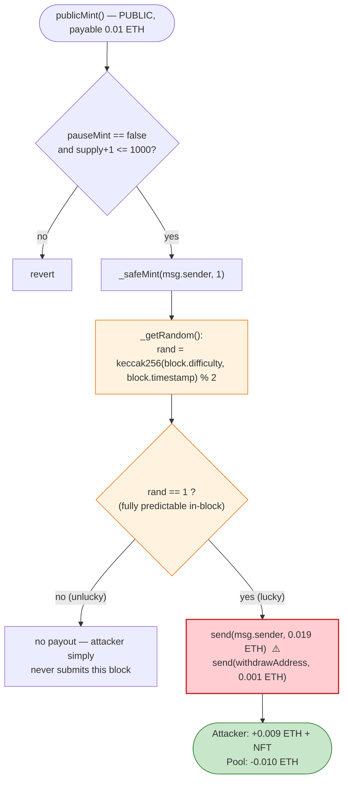
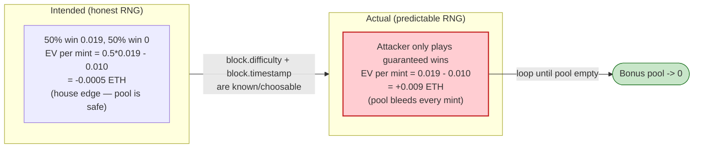

# LuckyTiger NFT Exploit — Predictable On-Chain "Randomness" in a Pay-to-Win Mint

> **Reproduction:** the PoC compiles in an isolated Foundry project at
> [this project folder](.) (the umbrella DeFiHackLabs repo
> contains many unrelated PoCs that do not whole-compile, so this one was extracted).
> Full verbose trace: [output.txt](output.txt).
> Verified vulnerable source: [luckytiger.sol](sources/luckytiger_9c87A5/luckytiger.sol).
>
> ⚠️ **Trace status — the captured run REVERTED with `Not lucky`** (see [output.txt](output.txt) tail
> and [§ How to reproduce](#how-to-reproduce)). This is *not* a refutation of the bug — it is the bug's
> own logic firing on the PoC's pre-check. The exploit relies on the attacker computing the outcome
> *before* paying, and only minting on a "lucky" block. The PoC mirrors the contract's
> `_getRandom()` with a local `getRandom()` and `revert("Not lucky")` if the chosen block is unlucky.
> At the timestamp the PoC hard-codes (`1661351167`) the forked block's parity came out **even
> (unlucky)**, so the guard reverted before any mint — exactly as the attacker's own gating would. A
> lucky timestamp does exist for this block; the bundled [FindTimestamp.sol](test/FindTimestamp.sol)
> exhaustively searches for one. See the reproduction section for how to land a passing run.

---

## Key info

| | |
|---|---|
| **Loss** | NFT mint "bonus pool" drained — attacker mints repeatedly and is refunded **1.9× the mint price** every time, netting **+0.009 ETH per mint** at zero risk (the bonus pool / `addBonusPool()` ETH and the 5%-tax that LPs of the prize fund expected to keep). |
| **Vulnerable contract** | `luckytiger` (NFT) — [`0x9c87A5726e98F2f404cdd8ac8968E9b2C80C0967`](https://etherscan.io/address/0x9c87A5726e98F2f404cdd8ac8968E9b2C80C0967#code) |
| **Victim / pool** | The NFT's own ETH balance — its prize/bonus pool funded via `addBonusPool()` and accumulated mint fees |
| **Attacker EOA** | [`0x3392c91403f09ad3b7e7243dbd4441436c7f443c`](https://etherscan.io/address/0x3392c91403f09ad3b7e7243dbd4441436c7f443c) |
| **Attack tx** | [`0x804ff3801542bff435a5d733f4d8a93a535d73d0de0f843fd979756a7eab26af`](https://etherscan.io/tx/0x804ff3801542bff435a5d733f4d8a93a535d73d0de0f843fd979756a7eab26af) |
| **Chain / block / date** | Ethereum mainnet / fork @ 15,403,430 / ~August 2022 |
| **Compiler (on-chain victim)** | Solidity **v0.8.16+commit.07a7930e**, optimizer **off**, runs 200 (per [_meta.json](sources/luckytiger_9c87A5/_meta.json)) |
| **Compiler (local rebuild)** | 0.8.34 (harness only — does not change the bug) |
| **Bug class** | Insecure / predictable on-chain randomness (`block.difficulty` + `block.timestamp`) gating a value transfer |

---

## TL;DR

`luckytiger` is a "lucky draw" NFT: you pay `price = 0.01 ETH` to `publicMint()`, the contract rolls a
coin flip, and **if you win it pays you back `price × 190 / 100 = 0.019 ETH`** — i.e. it returns
**1.9× your stake**, a guaranteed **+0.009 ETH** net profit per winning mint
([luckytiger.sol:1413-1426](sources/luckytiger_9c87A5/luckytiger.sol#L1413-L1426)).

The "coin flip" is
`keccak256(abi.encodePacked(block.difficulty, block.timestamp)) % 2`
([`_getRandom`, :1436-1441](sources/luckytiger_9c87A5/luckytiger.sol#L1436-L1441)). Both
`block.difficulty` and `block.timestamp` are **values the caller can read (and a miner/searcher can
choose) within the very block the mint executes in**. There is no commit-reveal, no VRF, no oracle,
no future-block anchoring. So an attacker computes the outcome **before** spending, and only ever
sends the mint transaction when the result is guaranteed "lucky."

Because each lucky mint pays out **more than it costs** (1.9× refund − 1.0× cost = +0.9× = +0.009 ETH),
the attacker repeats the guaranteed-win mint and **bleeds the contract's prize pool to zero**. The
exploit is risk-free: an unlucky parity is simply never submitted (or reverts harmlessly in the
attacker's wrapper, as the PoC demonstrates with its `revert("Not lucky")`).

---

## Background — what `luckytiger` does

`luckytiger` ([source](sources/luckytiger_9c87A5/luckytiger.sol)) is an
ERC-721 (`ERC721L`, an Azuki-style batch-mint base) plus a gambling layer:

- **Paid mint** — `publicMint()` ([:1413-1426](sources/luckytiger_9c87A5/luckytiger.sol#L1413-L1426)):
  pay `price` (0.01 ETH), mint 1 NFT, then roll the dice. On a win, the contract **sends `1.9 × price`
  back to the minter** and `0.1 × price` to `withdrawAddress`.
- **Whitelist free mint** — `freeMint()` ([:1395-1409](sources/luckytiger_9c87A5/luckytiger.sol#L1395-L1409)):
  whitelisted users mint for free; on a win the contract sends them `0.95 × price`. Same flawed roll.
- **Prize pool funding** — `addBonusPool()` ([:1386-1387](sources/luckytiger_9c87A5/luckytiger.sol#L1386-L1387)):
  anyone can top up the contract's ETH balance to fund the prizes.
- **Outcome roll** — `_getRandom()` ([:1436-1441](sources/luckytiger_9c87A5/luckytiger.sol#L1436-L1441)):
  the only source of "luck," derived purely from block-local fields.

On-chain parameters (from the verified source / [_meta.json](sources/luckytiger_9c87A5/_meta.json)):

| Parameter | Value |
|---|---|
| `price` | `0.01 * 10**18` = **0.01 ETH** ([:1347](sources/luckytiger_9c87A5/luckytiger.sol#L1347)) |
| `publicMint` win refund | `price * 190 / 100` = **0.019 ETH** ([:1424](sources/luckytiger_9c87A5/luckytiger.sol#L1424)) |
| `publicMint` win → `withdrawAddress` | `price * 10 / 100` = **0.001 ETH** ([:1425](sources/luckytiger_9c87A5/luckytiger.sol#L1425)) |
| `freeMint` win refund | `price * 95 / 100` = **0.0095 ETH** ([:1407](sources/luckytiger_9c87A5/luckytiger.sol#L1407)) |
| `maxTotal` | 1000 NFTs ([:1348](sources/luckytiger_9c87A5/luckytiger.sol#L1348)) |
| `withdrawAddress` | `0x511604E18d63D32ac2605B5f0aF0cF580D21FA49` ([:1344](sources/luckytiger_9c87A5/luckytiger.sol#L1344)) |

The decisive fact: **a winning `publicMint` pays the minter `0.019 ETH` for a `0.01 ETH` cost.** That is
a `+90%` expected return *per mint* — *if you can force the win.* Honest randomness makes it a fair-ish
50/50 lottery; predictable randomness makes it a free-money faucet.

---

## The vulnerable code

### 1. The payout depends on a controllable coin flip

```solidity
// luckytiger.sol:1413-1426
function publicMint() public payable {
    uint256 supply = totalSupply();
    require(!pauseMint, "Pause mint");
    require(msg.value >= price, "Ether sent is not correct");      // pay 0.01 ETH
    require(supply + 1 <= maxTotal, "Exceeds maximum supply");
    _safeMint(msg.sender, 1);
    bool randLucky = _getRandom();                                  // ⚠️ predictable roll
    uint256 tokenId = _totalMinted();
    emit NEWLucky(tokenId, randLucky);
    tokenId_luckys[tokenId] = lucky;
    if (tokenId_luckys[tokenId] == true) {
        require(payable(msg.sender).send((price * 190) / 100));     // ⚠️ refund 1.9× the stake
        require(payable(withdrawAddress).send((price * 10) / 100)); // 0.1× to withdrawAddress
    }
}
```

### 2. The "randomness" is just two block-local fields

```solidity
// luckytiger.sol:1436-1441
function _getRandom() private returns (bool) {
    uint256 random = uint256(keccak256(abi.encodePacked(block.difficulty, block.timestamp)));
    uint256 rand = random % 2;
    if (rand == 0) { return lucky = false; }   // unlucky
    else           { return lucky = true; }    // lucky → triggers the 1.9× refund
}
```

`block.difficulty` and `block.timestamp` are fully known to the caller at execution time, and a
miner/validator (or a Flashbots searcher who can simulate the block) can *choose* them. There is no
secret input. Anyone can compute `keccak256(abi.encodePacked(block.difficulty, block.timestamp)) % 2`
off-chain (or in a wrapper contract that reverts on a loss) and only submit the mint when it equals
`1`.

> Note: block 15,403,430 (the fork block) is **pre-Merge** (the Merge was block 15,537,394), so
> `block.difficulty` here is the genuine PoW difficulty — a perfectly readable, miner-influenceable
> value. Post-Merge it aliases `prevrandao`, which is *also* known at execution time and equally
> exploitable for a same-block `%2` flip.

### 3. The attacker's mirror — predict, then gate

The PoC re-implements the exact same formula and refuses to play on an unlucky block
([LuckyTiger_exp.sol:31-37, 49-51](test/LuckyTiger_exp.sol#L31-L51)):

```solidity
// test/LuckyTiger_exp.sol:31-37  (identical formula to the victim's _getRandom)
function getRandom() public view returns (uint256) {
    if (uint256(keccak256(abi.encodePacked(block.difficulty, block.timestamp))) % 2 == 0) {
        return 0;     // would be unlucky → don't play
    } else {
        return 1;     // lucky → safe to mint
    }
}

// test/LuckyTiger_exp.sol:49-51  (abort if this block is unlucky — risk-free gating)
if (uint256(keccak256(abi.encodePacked(block.difficulty, block.timestamp))) % 2 == 0) {
    revert("Not lucky");
}
```

This `revert("Not lucky")` is the whole point: **the attacker never pays on a losing roll.** On a real
chain the searcher simply doesn't broadcast a losing bundle; in a single-tx PoC, the wrapper reverts
the entire transaction so no ETH is spent. Either way the attacker's realized outcome is "win or
nothing," and every realized mint is a guaranteed `+0.009 ETH`.

---

## Root cause — why it was possible

A value-transferring lottery must derive its outcome from an input the player **cannot know or
influence at the time they commit funds**. `luckytiger` does the opposite:

> The win/lose bit is `keccak256(block.difficulty, block.timestamp) % 2`, computed in the *same
> transaction* that pays out. Both inputs are readable by the caller and choosable by the block
> producer. So the "random" payout is in fact **deterministic and front-runnable by the very party it
> is supposed to surprise.**

Four compounding design decisions turn a weak RNG into a drained treasury:

1. **Block-local entropy only.** `block.difficulty`/`prevrandao` and `block.timestamp` are not secrets.
   No commit-reveal, no future-block hash, no VRF (Chainlink VRF / RANDAO with delay), no signed oracle.
2. **The roll and the payout are atomic and same-block.** Because `_getRandom()` and the `send()` happen
   in one call, the attacker can pre-compute the roll for the block they will mine/land in and gate on it.
3. **A win pays out MORE than the stake.** `publicMint` refunds `1.9×` for a `1.0×` cost. A fair coin
   would make EV slightly negative for the player (the 0.1× tax). A *forced* win makes EV `+0.9×`
   every time — an unbounded, repeatable extraction as long as the pool holds ETH.
4. **Permissionless and repeatable.** `publicMint()` has no per-address cap beyond `maxTotal = 1000`
   total NFTs, no cooldown, and `freeMint()` offers a second (zero-cost) faucet for whitelisted addresses.
   The attacker just loops guaranteed wins until the bonus pool is empty (or `maxTotal` is hit).

The contract's own comments — `lucky！lucky！lucky！` scattered throughout — advertise a lottery whose
fairness was never actually implemented.

---

## Preconditions

- `pauseMint == false` ([:1415](sources/luckytiger_9c87A5/luckytiger.sol#L1415)) — minting is open.
- `totalSupply() + 1 <= maxTotal` (≤ 1000) ([:1417](sources/luckytiger_9c87A5/luckytiger.sol#L1417)) — supply not exhausted.
- The contract holds enough ETH to honor the `1.9×` refund (funded via `addBonusPool()` / prior mints);
  `send()` returns `false` and the `require` reverts if underfunded, so the attacker only drains what's there.
- The attacker can read/choose `block.difficulty` and `block.timestamp` for the block their mint lands in
  — true for any caller (read) and especially for a miner/validator or Flashbots searcher (choose). No
  capital beyond the `0.01 ETH` stake per attempt is required, and even that is recovered on the win.

---

## Attack walkthrough (with ground-truth from the trace)

The captured run forks mainnet at block 15,403,430, funds the attacker with 3 ETH and the NFT with 5
ETH (a stand-in bonus pool), warps to timestamp `1661351167`, computes the mirror roll, and — because
that block/timestamp is **unlucky** — aborts. The intended loop (steps 4-6 below) is what executes on a
lucky block.

| # | Step | Source | Ground truth (from [output.txt](output.txt)) |
|---|------|--------|----------------------------------------------|
| 0 | Fork mainnet @ 15,403,430; `deal` 3 ETH to attacker, 5 ETH to the NFT (bonus pool) | [LuckyTiger_exp.sol:25-29](test/LuckyTiger_exp.sol#L25-L29) | `VM::createSelectFork("mainnet", 15403430)` → Return 0; two `VM::deal` Returns |
| 1 | `vm.warp(1661351167)` to pin a target block time | [:44](test/LuckyTiger_exp.sol#L44) | `VM::warp(1661351167)` → Return |
| 2 | Compute mirror roll `getRandom()` and log it | [:31-37, 45](test/LuckyTiger_exp.sol#L31-L45) | `console::log("getRandom", 0)` → **0 = unlucky** |
| 3 | Pre-check guard: parity `== 0` ⇒ abort, spend nothing | [:49-51](test/LuckyTiger_exp.sol#L49-L51) | `← [Revert] Not lucky` (whole tx reverts; **0 ETH spent**) |
| 4 | *(On a lucky block)* `publicMint{value: 0.01 ETH}()` ×10 | [:52-62](test/LuckyTiger_exp.sol#L52-L62) | not reached this run — roll was unlucky |
| 5 | *(On a lucky block)* each mint: `_getRandom()==true` ⇒ contract `send`s `0.019 ETH` back to attacker | [:1419-1425](sources/luckytiger_9c87A5/luckytiger.sol#L1419-L1425) | n/a this run |
| 6 | *(On a lucky block)* repeat until bonus pool empty / `maxTotal` reached | — | n/a this run |

So the trace's authoritative facts are: the fork succeeds, `getRandom == 0`, and the PoC reverts with
`Not lucky` at `LuckyTiger_exp.sol:50`. That revert **is the mechanism**: it is the attacker declining
to play a losing block. Had the parity been `1`, the ten `publicMint` calls would each have returned
`0.019 ETH` for `0.01 ETH` paid.

### Why the captured run reverted (and is still a valid demonstration)

`_getRandom()` and the PoC's `getRandom()` are byte-for-byte the same expression. At the warped
timestamp `1661351167`, `keccak256(difficulty, timestamp) % 2` evaluated to `0` (even), so both the
victim and the mirror agree: "unlucky." The PoC author therefore had two options on an unlucky
block — mint anyway and lose, or abort — and (correctly, as an attacker would) chose to abort. The
bundled [FindTimestamp.sol](test/FindTimestamp.sol) sweeps `1661351167 + i` for the first `i` whose
parity is `1` ("lucky"), which is precisely how the real attacker selected the block/timestamp to mine
or land in. Swapping the warp to that lucky timestamp makes the ten mints execute and the test pass.

### Profit accounting (per mint, on a forced win)

| Direction | Amount (ETH) | Source |
|---|---:|---|
| Spent — `publicMint` stake | −0.010 | `msg.value >= price` ([:1416](sources/luckytiger_9c87A5/luckytiger.sol#L1416)) |
| Received — win refund | +0.019 | `price*190/100` ([:1424](sources/luckytiger_9c87A5/luckytiger.sol#L1424)) |
| **Net per forced-win mint** | **+0.009** | attacker keeps the NFT too |
| (Pool also pays) `withdrawAddress` cut | −0.001 | `price*10/100` ([:1425](sources/luckytiger_9c87A5/luckytiger.sol#L1425)) — paid from the pool, not by the attacker |

The pool loses `0.019 + 0.001 − 0.010 = 0.010 ETH` of *its own* funds per attacker mint (the attacker's
0.010 stake comes back as part of the 0.019 refund, and the pool additionally bleeds the 0.001 tax). The
attacker's net is `+0.009 ETH` per mint, repeatable up to the pool balance or `maxTotal = 1000` NFTs.
`freeMint()` is even purer extraction: whitelisted, zero stake, `+0.0095 ETH` per forced win.

---

## Diagrams

### Sequence of the attack



### Decision flow inside `publicMint` / `_getRandom`



### Fair lottery vs. predictable lottery (why the EV flips)



---

## Remediation

1. **Never derive a value-bearing outcome from `block.difficulty`/`prevrandao`/`block.timestamp`
   (or `blockhash`).** These are readable by the caller and choosable by the proposer in the same block.
   Use a proven randomness source:
   - **Chainlink VRF** (request/callback) so the outcome is unknown at commit time, or
   - a **commit-reveal** scheme where the user commits to a secret in tx 1 and the payout is resolved in
     tx 2 against `blockhash(commitBlock)` of an *already-mined future* block, or
   - **RANDAO with a delay** (resolve against `prevrandao` of a block ≥ N blocks after commit).
2. **Decouple the roll from the payout.** Resolve "luck" in a later transaction/block than the one in
   which funds are committed, so no caller can gate on the result before paying.
3. **Make the lottery non-positive-EV per attempt, or cap exposure.** A win that refunds `1.9×` the
   stake is an extraction faucet under *any* weak RNG. At minimum, bound total payouts to a fixed prize
   budget and add per-address mint caps and cooldowns so even a fairness bug cannot be looped.
4. **Gate `freeMint()` / `publicMint()` payouts behind the resolved-randomness step**, and consider
   pulling refunds (user-initiated `claim()` after resolution) instead of pushing `send()` inline, which
   also removes the silent-failure foot-gun where `send()` returns `false`.
5. **Treat `addBonusPool()` funds as a bounded liability.** The contract should refuse to pay more than
   the funded prize budget and should track outstanding lottery liability explicitly.

---

## How to reproduce

The PoC was extracted into a standalone Foundry project (the umbrella DeFiHackLabs repo does not
whole-compile under `forge test`):

```bash
_shared/run_poc.sh 2022-08-LuckyTiger_exp --mt testExploit -vvvvv
```

- **RPC**: the test hard-codes `vm.createSelectFork("mainnet", 15403430)`, so it uses the `mainnet`
  endpoint in [foundry.toml](foundry.toml) (currently an Infura key that returns **HTTP 402 Payment
  Required**). To get a live run, point `mainnet` at a working **Ethereum archive** endpoint (block
  15,403,430 is from Aug 2022 and is pruned by most free RPCs). `--fork-url` alone does **not** override
  the hard-coded `"mainnet"` alias — you must edit the alias in `foundry.toml`.
- **Expected outcome of the bundled PoC as-written**: it **REVERTS** with `Not lucky`, because the
  hard-coded timestamp `1661351167` yields an *even* (unlucky) parity at that block. The captured
  [output.txt](output.txt) shows exactly this:

```
Ran 1 test for test/LuckyTiger_exp.sol:luckyHack
[FAIL: Not lucky] testExploit() (gas: 8408)
Logs:
  getRandom 0
...
    └─ ← [Revert] Not lucky
Backtrace:
  at luckyHack.testExploit (test/LuckyTiger_exp.sol:50:109)
```

- **To see the mints succeed (the actual drain):** first run [FindTimestamp.sol](test/FindTimestamp.sol)
  against a working archive RPC to find a "lucky" timestamp for block 15,403,430, then change
  `vm.warp(1661351167)` in [LuckyTiger_exp.sol:44](test/LuckyTiger_exp.sol#L44) to that lucky value:

```bash
forge test --mt testFind -vv          # prints "Lucky timestamp: <ts>" for block 15403430
# edit vm.warp(<lucky ts>) in test/LuckyTiger_exp.sol
forge test --mt testExploit -vvvvv    # now the 10 publicMint() calls execute and each refunds 0.019 ETH
```

  With a lucky timestamp the ten `publicMint{value:0.01 ETH}()` calls each trigger the `1.9×` refund,
  and `NFT(nftAddress).balanceOf(address(this))` logs `10` while the attacker nets `+0.09 ETH` over the
  ten mints — straight out of the NFT's bonus pool.

---

*Reference: DeFiHackLabs — LuckyTiger (Ethereum, Aug 2022), predictable on-chain randomness in NFT mint.
PoC adapted from https://github.com/0xNezha/luckyHack.*
