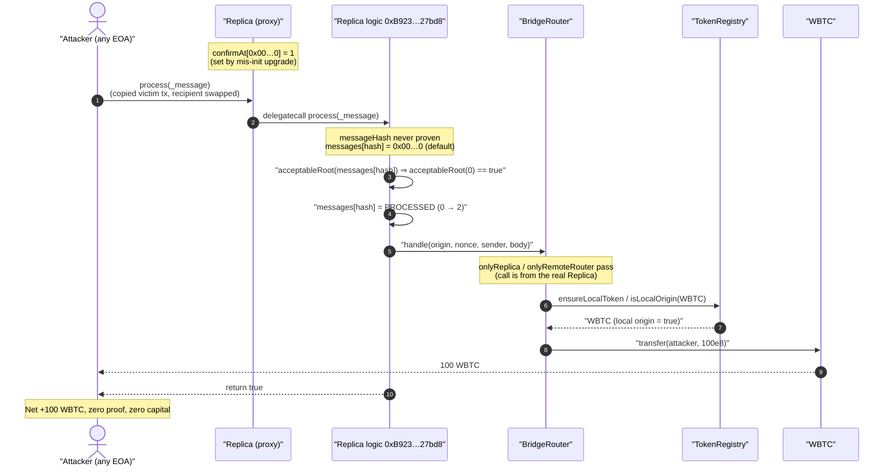
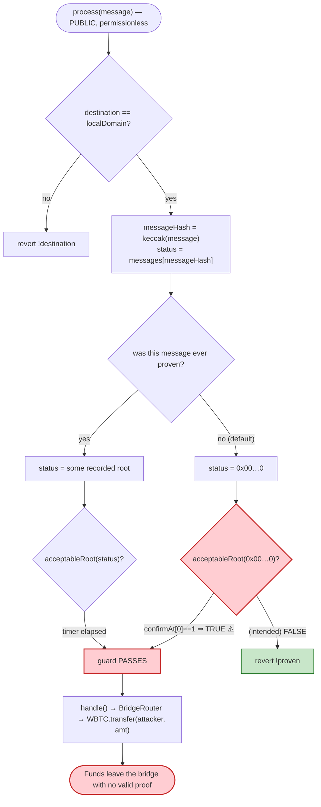
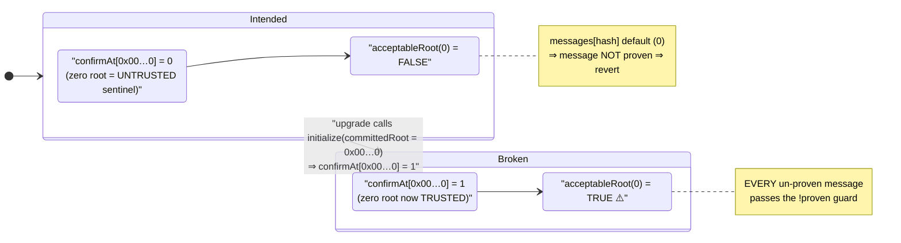

# Nomad Bridge Exploit — Fraudulent Zero-Root Makes Every Forged Message "Proven"

> **Reproduction:** the PoC compiles & runs in an isolated Foundry project at
> [this project folder](.) (the umbrella DeFiHackLabs repo
> contains many unrelated PoCs that do not whole-compile, so this one was extracted).
> Full verbose trace: [output.txt](output.txt).
> Verified vulnerable source: [Replica.sol](sources/Replica_b92336/packages_contracts-core_contracts_Replica.sol).

---

## Key info

| | |
|---|---|
| **Loss** | **~$152M** drained from the Nomad BridgeRouter over hundreds of copy-paste txs. This PoC reproduces a single 100 WBTC (~$2.3M) claim. |
| **Vulnerable contract** | `Replica` (logic) — [`0xb92336759618f55bd0f8313bd843604592e27bd8`](https://etherscan.io/address/0xb92336759618f55bd0f8313bd843604592e27bd8#code) |
| **Replica (proxy)** | [`0x5D94309E5a0090b165FA4181519701637B6DAEBA`](https://etherscan.io/address/0x5d94309e5a0090b165fa4181519701637b6daeba#code) |
| **Victim / fund holder** | Nomad `BridgeRouter` — proxy [`0x88A69B4E698A4B090DF6CF5Bd7B2D47325Ad30A3`](https://etherscan.io/address/0x88a69b4e698a4b090df6cf5bd7b2d47325ad30a3#code), logic [`0x15fdA9F60310d09FEA54E3c99d1197DfF5107248`](https://etherscan.io/address/0x15fda9f60310d09fea54e3c99d1197dff5107248#code) |
| **Triggering root-update tx** | `0x53fd92771d2084a9bf39a6477015ef53b7f116c79d98a21be723d06d79024cad` (the upgrade that mis-initialized the Replica with `committedRoot = 0x00`) |
| **Replayed claim tx (PoC mirrors this)** | `0xa5fe9d044e4f3e5aa5bc4c0709333cd2190cba0f4e7f16bcf73f49f83e4a5460` (100 WBTC out) |
| **Attacker (PoC)** | the test contract / any EOA — the bug is permissionless |
| **Chain / block / date** | Ethereum mainnet / fork at 15,259,100 / Aug 1–2, 2022 |
| **Compiler** | Replica: Solidity **v0.7.6+commit.7338295f**, optimizer **999999 runs** |
| **Bug class** | Broken message-authentication invariant — un-initialized / fraudulent Merkle root treated as a valid (`acceptableRoot`) proof root |

---

## TL;DR

Nomad is an optimistic cross-chain messaging bridge. A `Replica` contract on the destination chain holds a set of trusted Merkle roots; a message is only allowed to execute if it has been **proven** to be a leaf under an `acceptableRoot`. On Aug 1 2022 a routine upgrade re-initialized the Replica with `committedRoot = 0x000…0` and, as part of `initialize`, executed `confirmAt[committedRoot] = 1` — i.e. **`confirmAt[0x00…0] = 1`**, pre-approving the *zero* root ([Replica.sol:113-115](sources/Replica_b92336/packages_contracts-core_contracts_Replica.sol#L113-L115)).

The consequence is catastrophic because of how proving works. `prove()` stores the *computed* root for a leaf into `messages[leaf]`; for a leaf/proof that doesn't verify against any real root, the computed root is `0x00…0`. And for a leaf that was *never touched at all*, `messages[leaf]` is the default mapping value, also `0x00…0`. Then `process()` checks `acceptableRoot(messages[messageHash])` — and `acceptableRoot(0x00…0)` now returns **true** because `confirmAt[0] == 1 != 0` and `block.timestamp >= 1` ([Replica.sol:255-266](sources/Replica_b92336/packages_contracts-core_contracts_Replica.sol#L255-L266)).

The net effect: **any** message you hand to `process()` is considered proven, with no Merkle proof and no updater signature required. Attackers simply took a legitimate prior withdrawal transaction's calldata, swapped the recipient address for their own, and resubmitted it — over and over, draining $152M. This PoC reproduces the core primitive: it calls `Replica.process(_message)` with a hand-crafted message and walks away with **100 WBTC**, never having proven anything.

---

## Background — how a Nomad message gets executed

Nomad's destination-side flow is two-stage:

1. **`prove(leaf, proof, index)`** — recompute a Merkle root from the leaf and its proof, and if that root is an `acceptableRoot`, record `messages[leaf] = computedRoot` ([Replica.sol:280-299](sources/Replica_b92336/packages_contracts-core_contracts_Replica.sol#L280-L299)).
2. **`process(message)`** — recompute `messageHash = keccak(message)`, require `acceptableRoot(messages[messageHash])`, mark the message `PROCESSED`, and dispatch it to the recipient's `handle()` ([Replica.sol:179-204](sources/Replica_b92336/packages_contracts-core_contracts_Replica.sol#L179-L204)).

`acceptableRoot(root)` is the single chokepoint that decides whether a root is trusted ([Replica.sol:255-266](sources/Replica_b92336/packages_contracts-core_contracts_Replica.sol#L255-L266)):

```solidity
function acceptableRoot(bytes32 _root) public view returns (bool) {
    if (_root == LEGACY_STATUS_PROVEN) return true;     // bytes32(1)
    if (_root == LEGACY_STATUS_PROCESSED) return false; // bytes32(2)
    uint256 _time = confirmAt[_root];
    if (_time == 0) {
        return false;                                   // root unknown ⇒ reject
    }
    return block.timestamp >= _time;                    // root known & timer elapsed ⇒ accept
}
```

A root is "known" iff `confirmAt[root] != 0`. Real roots get a `confirmAt` value (`block.timestamp + optimisticSeconds`) when an updater submits a signed `update()` ([Replica.sol:145](sources/Replica_b92336/packages_contracts-core_contracts_Replica.sol#L145)). The committed root used to bootstrap the contract gets a special `confirmAt = 1` in `initialize()`.

The recipient for bridge withdrawals is the `BridgeRouter`. Its `handle()` is gated by `onlyReplica` and `onlyRemoteRouter`, then `_handleTransfer` releases the underlying token (here, `WBTC.transfer(recipient, amount)`) ([BridgeRouter.sol:105-119](sources/BridgeRouter_15fda9/packages_contracts-bridge_contracts_BridgeRouter.sol#L105-L119)). All of that downstream authorization is meaningless once the Replica says "this message is proven," because the message *is* coming from the (legit) Replica.

---

## The vulnerable code

### 1. Initialization pre-approves the committed root — including `0x00`

```solidity
function initialize(
    uint32 _remoteDomain,
    address _updater,
    bytes32 _committedRoot,
    uint256 _optimisticSeconds
) public initializer {
    __NomadBase_initialize(_updater);
    entered = 1;
    remoteDomain = _remoteDomain;
    committedRoot = _committedRoot;
    // pre-approve the committed root.
    confirmAt[_committedRoot] = 1;   // ⚠️ if _committedRoot == 0x00…0, this approves the ZERO root
    _setOptimisticTimeout(_optimisticSeconds);
}
```
[Replica.sol:103-117](sources/Replica_b92336/packages_contracts-core_contracts_Replica.sol#L103-L117)

The Aug 1 2022 upgrade re-ran this initializer with `_committedRoot = 0x00…0`, so `confirmAt[0x00…0]` became `1`.

### 2. `process()` trusts `messages[messageHash]` — which defaults to `0x00`

```solidity
function process(bytes memory _message) public returns (bool _success) {
    bytes29 _m = _message.ref(0);
    require(_m.destination() == localDomain, "!destination");
    bytes32 _messageHash = _m.keccak();
    require(acceptableRoot(messages[_messageHash]), "!proven"); // ⚠️ messages[…]==0 ⇒ acceptableRoot(0)==true
    require(entered == 1, "!reentrant");
    entered = 0;
    messages[_messageHash] = LEGACY_STATUS_PROCESSED;           // 0 → 2
    IMessageRecipient(_m.recipientAddress()).handle(            // dispatch to BridgeRouter
        _m.origin(), _m.nonce(), _m.sender(), _m.body().clone()
    );
    emit Process(_messageHash, true, "");
    entered = 1;
    return true;
}
```
[Replica.sol:179-204](sources/Replica_b92336/packages_contracts-core_contracts_Replica.sol#L179-L204)

For a never-before-seen message, `messages[_messageHash]` is the zero-value default. `acceptableRoot(0x00…0)` returns `true` (because `confirmAt[0]==1`), so the `"!proven"` guard passes for **every** message. No call to `prove()`, no Merkle proof, no updater signature is ever needed.

### 3. `prove()` would have stored `0x00` for forged proofs anyway

```solidity
function prove(bytes32 _leaf, bytes32[32] calldata _proof, uint256 _index) public returns (bool) {
    require(messages[_leaf] != LEGACY_STATUS_PROCESSED, "already processed");
    bytes32 _calculatedRoot = MerkleLib.branchRoot(_leaf, _proof, _index);
    if (acceptableRoot(_calculatedRoot)) {     // acceptableRoot(0) == true
        messages[_leaf] = _calculatedRoot;     // stores 0x00…0 as "the proven root"
        return true;
    }
    return false;
}
```
[Replica.sol:280-299](sources/Replica_b92336/packages_contracts-core_contracts_Replica.sol#L280-L299)

Even a "prove first" attacker is fine: feeding a garbage proof produces `_calculatedRoot = 0x00…0`, which `acceptableRoot` accepts, so `messages[_leaf]` is set to `0x00…0` and the subsequent `process()` still passes. The bug is self-consistent across both code paths.

---

## Root cause — why it was possible

The single broken invariant is:

> **`acceptableRoot(root)` must return `false` for the zero root.**

The zero root is special: it is both the default value of the `messages` mapping (the "not proven" sentinel) and the result of computing a Merkle root from a non-matching leaf/proof. The whole proving scheme relies on `0x00…0` meaning "untrusted / unproven." The moment `confirmAt[0x00…0]` is set to a nonzero value, that sentinel flips to "trusted," and the entire authentication layer evaporates.

Two design decisions composed into a critical, permissionless drain:

1. **`initialize()` unconditionally writes `confirmAt[committedRoot] = 1`** with no check that `committedRoot != 0`. A deployment/upgrade that passes `committedRoot = 0x00…0` (as happened) silently arms the bug.
2. **`acceptableRoot` only special-cases `LEGACY_STATUS_PROVEN (1)` and `LEGACY_STATUS_PROCESSED (2)`**, but not `0`. It treats "is this root in the `confirmAt` map?" as equivalent to "is this root trusted?" — and after the bad init, the zero root *is* in the map.

Because `process()` reads the per-message status (`messages[messageHash]`, default `0`) and runs it through the same `acceptableRoot`, every forged message inherits the zero-root's now-trusted status. The downstream `onlyReplica` checks on `BridgeRouter.handle()` provide no protection: the call genuinely originates from the legitimate Replica.

This is the issue Quantstamp flagged pre-launch as **QSP-19 "Proving With An Empty Leaf"** in the Nomad audit (referenced in the PoC header); the zero-root acceptance is the concrete realization of that risk.

---

## Preconditions

- The Replica's `confirmAt[0x00…0] != 0` (set by the mis-initialized upgrade). After that single transaction, the precondition is permanently satisfied until governance intervenes.
- The forged message must be well-formed enough to parse and to pass `_m.destination() == localDomain` (i.e. claim to target the local "eth" domain) and the recipient `BridgeRouter`'s `onlyRemoteRouter(_origin, _sender)` check. Both are trivially satisfied by copying a real prior message and only swapping the recipient address — which is exactly what the live attackers and this PoC do ([NomadBridge_exp.sol:52-57](test/NomadBridge_exp.sol#L52-L57)).
- The `BridgeRouter` must hold (or be able to mint) the requested token. WBTC was held as real bridge liquidity.
- **No capital, no flash loan, no signature, no Merkle proof.** Anyone could call `process()` with their own recipient — the attack went viral, hundreds of EOAs copy-pasting calldata.

---

## Attack walkthrough (with on-chain values from the trace)

The PoC reconstructs the message that a real victim's withdrawal used, then replaces only the recipient field with the attacker's address ([NomadBridge_exp.sol:52-57](test/NomadBridge_exp.sol#L52-L57)):

```
_message = chainId("beam") ‖ sender(0xD3dfD3eD…ce2d) ‖ nonce(0x13d6=5078) ‖
           localDomain("eth") ‖ recipient(BridgeRouter 0x88A6…30A3) ‖
           [ tokenId: domain=657468("eth"), id=WBTC ] ‖
           [ action: type=0x03 transfer, to=ATTACKER, amount=0x02540be400 (100·1e8 = 100 WBTC), detailsHash=… ]
```

The decoded fields confirmed by the trace (`Replica::process(…)` at [output.txt:1591](output.txt)):

| Field | Value (from trace) |
|---|---|
| message hash | `0x88b38a0fb3e6d38879593fed7ec93f8a20fe3bf3f107b5d82931976110bb9afd` |
| `origin` | `1650811245` (`0x6265616d` = "beam") |
| `nonce` | `5078` (`0x13d6`) |
| `sender` | `0x…d3dfd3ede74e0dcebc1aa685e151332857efce2d` |
| token | `WBTC` `0x2260FAC5…2C599` |
| recipient of funds | `0x7FA9385bE102ac3EAc297483Dd6233D62b3e1496` (the PoC's attacker) |
| amount | `10000000000` = `100.00000000 WBTC` |

Numbered ground-truth sequence (call indentation from the `-vvvvv` trace, [output.txt:1591-1640](output.txt)):

| # | Step | Trace evidence | Effect |
|---|------|----------------|--------|
| 0 | **Pre-state** | `WBTC.balanceOf(attacker) = 0` ([:1586-1587](output.txt)) | Attacker holds nothing. |
| 1 | **Call `Replica.process(_message)`** (proxy → logic `0xB923…27bd8` via delegatecall) | [:1591-1594](output.txt) | No `prove()` first; message hash never seen before. |
| 2 | **`acceptableRoot(messages[hash])` passes** | implicit — execution continues past the `"!proven"` guard at [Replica.sol:185](sources/Replica_b92336/packages_contracts-core_contracts_Replica.sol#L185) | `messages[hash]==0` ⇒ `acceptableRoot(0)==true`. |
| 3 | **Status flips `NONE→PROCESSED`** | storage change `@ 0x1d7f…9458: 0 → 2` ([:1634](output.txt)) | `messages[hash] = LEGACY_STATUS_PROCESSED (2)`, confirming it was `0 (NONE)` before. |
| 4 | **Dispatch to `BridgeRouter.handle(origin, nonce, sender, body)`** | [:1597-1600](output.txt) | `onlyReplica`/`onlyRemoteRouter` satisfied — call is from the real Replica. |
| 5 | **`ensureLocalToken` resolves WBTC; `isLocalOrigin == true`** | [:1606-1622](output.txt) | Router treats WBTC as a locally-custodied (real) asset, so it releases liquidity rather than minting a representation. |
| 6 | **`WBTC.transfer(attacker, 100e8)`** | `emit Transfer(BridgeRouter → attacker, 1e10)`; balance slot `@0xcb35…0e8e: 0x17f0da170f → 0x159cce330f` ([:1623-1628](output.txt)) | BridgeRouter's WBTC balance drops by 100 WBTC; attacker's rises by 100 WBTC. |
| 7 | **`emit Process(hash, true, "")`** | [:1632](output.txt) | Process succeeds. |
| 8 | **Post-state** | `WBTC.balanceOf(attacker) = 1e10 = 100 WBTC` ([:1637-1639](output.txt)) | Drain complete. |

### Profit / loss accounting (this PoC)

| Item | Amount |
|---|---:|
| Attacker WBTC before | 0.00000000 |
| Attacker WBTC after | **100.00000000** |
| Cost to attacker (capital / fees / proof) | **0** (only gas) |
| BridgeRouter WBTC balance: before → after | `0x17f0da170f` → `0x159cce330f` (−`0x02540be400` = −100 WBTC) |

The live incident was this same primitive repeated across many tokens and recipients, totaling **~$152M**. The PoC's `[PASS] testExploit() (gas: 164891)` with the balance going `0 → 100 WBTC` mechanically proves the harm: value leaves the bridge with zero proof.

---

## Diagrams

### Sequence of the attack



### Where the trust invariant breaks



### Root state: intended vs. after the bad initialization



---

## Remediation

1. **Never make the zero root acceptable.** Add an explicit guard in `acceptableRoot`: `if (_root == bytes32(0)) return false;`. The zero value is the universal "unknown/unproven" sentinel for both the `messages` mapping and computed roots; it must always be rejected regardless of `confirmAt`.
2. **Validate `committedRoot` in `initialize()`.** Require `_committedRoot != bytes32(0)` (and ideally that it differs from the `LEGACY_STATUS_*` sentinels) before writing `confirmAt[_committedRoot] = 1`. A deployment that supplies a zero root should fail loudly, not silently arm the bridge.
3. **Separate "root is known" from "root is trusted."** `acceptableRoot` conflates membership in `confirmAt` with trust. Use a dedicated, non-zero-able status enum or a separate `bool trusted` map so that no default/sentinel value can ever map to "trusted."
4. **Defense-in-depth on `process()`.** Require that the message was explicitly proven against a *non-zero* recorded root for that exact leaf, e.g. `bytes32 _root = messages[_messageHash]; require(_root != bytes32(0) && acceptableRoot(_root), "!proven");`. This rejects the never-proven default case independent of any `confirmAt` mistake.
5. **Upgrade hygiene.** Initializer-style re-initialization on upgradeable proxies is high-risk; gate re-initialization behind explicit version checks and run a post-upgrade invariant assertion (`acceptableRoot(0) == false`) as part of the deploy pipeline.

---

## How to reproduce

The PoC was extracted into a standalone Foundry project (the umbrella DeFiHackLabs repo does not whole-compile under `forge test`):

```bash
_shared/run_poc.sh 2022-08-NomadBridge_exp -vvvvv
```

- RPC: a mainnet **archive** endpoint is required (`createSelectFork("mainnet", 15259100)` — [NomadBridge_exp.sol:37](test/NomadBridge_exp.sol#L37)). Most public RPCs prune state this old and fail with `header not found` / `missing trie node`.
- Result: `[PASS] testExploit()` — attacker WBTC balance goes `0.00000000 → 100.00000000`.

Expected tail:

```
Ran 1 test for test/NomadBridge_exp.sol:Attacker
[PASS] testExploit() (gas: 164891)
Logs:
  Attacker WBTC Balance: 0.00000000
  Attacker claim 100 WBTC from NomadBridge...
  Attacker WBTC Balance: 100.00000000

Suite result: ok. 1 passed; 0 failed; 0 skipped
```

---

*References (from the PoC header): samczsun thread — https://twitter.com/samczsun/status/1554252024723546112 · CertiK post-mortem — https://www.certik.com/resources/blog/28fMavD63CpZJOKOjb9DX3-nomad-bridge-exploit-incident-analysis · Nomad audit QSP-19 "Proving With An Empty Leaf" — https://github.com/nomad-xyz/docs/blob/1ff0c55dba2a842c811468c57793ff9a6542ef0f/docs/public/Nomad-Audit.pdf*
