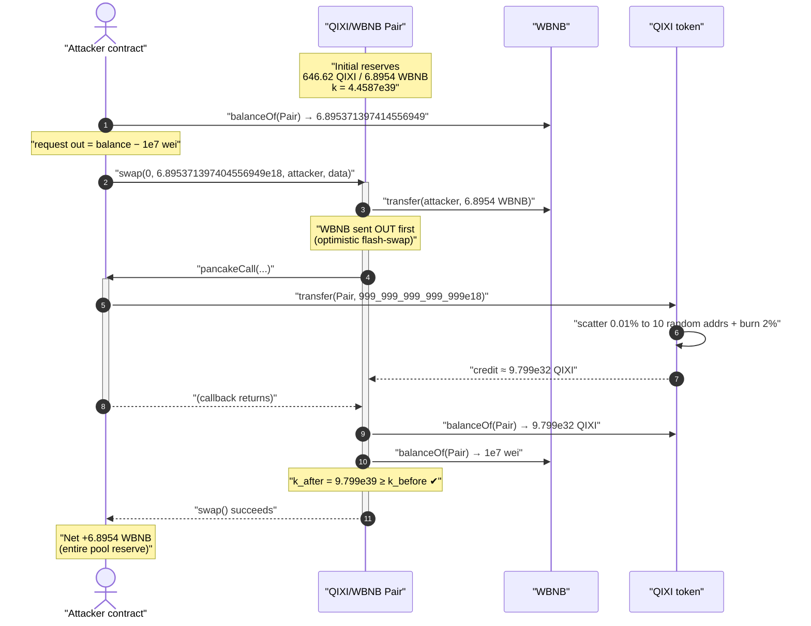
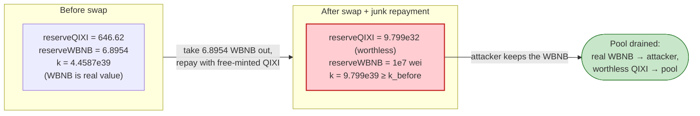
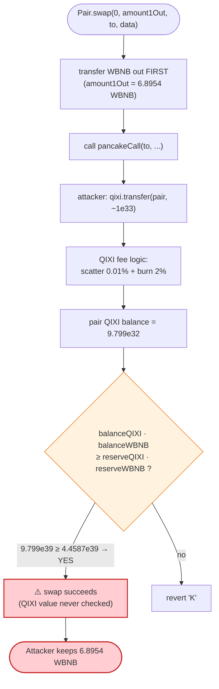

# QIXI Token Exploit — Flash-Swap Repaid With a Free-to-Mint / Fee-Skimming Token

> **Vulnerability classes:** vuln/oracle/spot-price · vuln/defi/slippage

> **Reproduction:** the PoC compiles & runs in an isolated Foundry project at
> [this project folder](.) (the umbrella DeFiHackLabs repo contains several unrelated
> PoCs that do not whole-compile, so this one was extracted).
> Full verbose trace: [output.txt](output.txt).
> Verified vulnerable source: [Token.sol](sources/Token_65F11B/Token.sol).

---

## Key info

| | |
|---|---|
| **Loss** | ~**6.895 WBNB** (≈ the entire WBNB reserve of the QIXI/WBNB pair) |
| **Vulnerable contract** | `QIXI` token — [`0x65F11B2de17c4af7A8f70858D6CcB63AAC215697`](https://bscscan.com/address/0x65F11B2de17c4af7A8f70858D6CcB63AAC215697#code) |
| **Victim pool** | QIXI/WBNB PancakePair — [`0x88fF4f62A75733C0f5afe58672121568a680DE84`](https://bscscan.com/address/0x88fF4f62A75733C0f5afe58672121568a680DE84) |
| **Attacker EOA** | [`0x2723e1f6a9a3cd003fd395cc46882e4573cb249f`](https://bscscan.com/address/0x2723e1f6a9a3cd003fd395cc46882e4573cb249f) |
| **Attacker contract** | [`0xb7b0fe129fefa222efd4eb1f6bef9de339339bbb`](https://bscscan.com/address/0xb7b0fe129fefa222efd4eb1f6bef9de339339bbb) |
| **Attack tx** | [`0x16be4fe1c8fcab578fcb999cbc40885ba0d4ba9f3782a67bd215fb56dc579062`](https://app.blocksec.com/explorer/tx/bsc/0x16be4fe1c8fcab578fcb999cbc40885ba0d4ba9f3782a67bd215fb56dc579062) |
| **Chain / block / date** | BSC / fork at block **20,120,884** / August 2022 |
| **Compiler** | Token: `v0.4.25+commit.59dbf8f1` (optimizer, 200 runs); Pair: `v0.5.16` |
| **Bug class** | Mintable / fee-skimming token used to repay a Uniswap-V2 flash-swap (broken `x·y=k` accounting) |

---

## TL;DR

The QIXI/WBNB PancakeSwap pair priced its WBNB against the **QIXI token's reported balance**.
QIXI is a trash ERC20 whose owner can mint an unbounded amount (`mmm`,
[Token.sol:186-194](sources/Token_65F11B/Token.sol#L186-L194); `MAXSupply` is `1e51` tokens,
[:79](sources/Token_65F11B/Token.sol#L79)) and which the attacker already held in astronomical
quantity (~**1.15e59 QIXI** at the fork block).

A Uniswap-V2 `swap()` only enforces the constant-product invariant
`reserveQIXI · reserveWBNB ≥ k`. It does **not** care *which* token tops up the QIXI side, nor
whether that token has any value. So the attack is a single line:

```solidity
Pair.swap(0, WBNB.balanceOf(Pair) - 1e7, attacker, data);   // take ~all the WBNB out
// inside pancakeCall callback:
qixi.transfer(Pair, 999_999_999_999_999e18);                 // repay with worthless QIXI
```

The pair optimistically sends out **6.895371397404556949 WBNB** (everything but a `1e7`-wei dust),
then calls the attacker's `pancakeCall`. The attacker repays by transferring an absurd amount of
QIXI it minted for free. Even after QIXI's fee-on-transfer logic skims ~10% to random addresses and
burns 2%, the pair still receives **≈9.799 × 10³² QIXI** — vastly more than the **646.62 QIXI** the
pair started with — so `k` is satisfied (`k_after ≈ 2.2 × k_before`) and the swap succeeds. The
attacker keeps the 6.895 WBNB; the pair is left holding a mountain of worthless QIXI and **1e7 wei of
WBNB**.

This is the canonical "the pool trusted a worthless token's balance" rug: the token is the
vulnerability, the pair is just the cash register.

---

## Background — what QIXI is

`QIXI` ([source](sources/Token_65F11B/Token.sol)) is a Solidity **0.4.25** token deployed with the
obfuscated, scam-flavored boilerplate typical of BSC "tax tokens." Two of its properties matter:

1. **The owner can mint arbitrarily.** `mmm(target, edAmount)`
   ([:186-194](sources/Token_65F11B/Token.sol#L186-L194)) adds `edAmount` directly to any balance and
   to `totalSupply`, bounded only by `MAXSupply = 1e51 * 1e18`
   ([:79](sources/Token_65F11B/Token.sol#L79)) — effectively unbounded. The initial `totalSupply` is
   only `1777e18` ([:77](sources/Token_65F11B/Token.sol#L77)), but at the fork block the attacker's
   address already held **~1.15 × 10⁵⁹ QIXI** (visible in the trace as the attacker's balance-slot
   value, [output.txt:50](output.txt)). In other words, the supply was pre-inflated and the attacker
   sat on essentially all of it.

2. **Transfers are fee-on-transfer with random-address skimming.** `_transfer`
   ([:102-143](sources/Token_65F11B/Token.sol#L102-L143)), for any sender/recipient *not* excluded
   from fees, peels off `value/10000` ("freeToken") and scatters it across 10 pseudo-random addresses,
   then applies a `_burnfew = 2%` burn ([:91](sources/Token_65F11B/Token.sol#L91),
   [:202-206](sources/Token_65F11B/Token.sol#L202-L206)). The amount that actually lands at the
   recipient is `value − freeToken − burn`. This *reduces* what the pair receives — but because the
   attacker overpays by ~30 orders of magnitude, the haircut is irrelevant.

The QIXI/WBNB pair at the fork block held only:

| Reserve | Amount |
|---|---|
| QIXI (`reserve0`) | **646.6233663289966 QIXI** |
| WBNB (`reserve1`) | **6.895371397414556949 WBNB** ← the prize |

(Decoded from the pair's packed reserve slot in [output.txt:66](output.txt).)

---

## The vulnerable code

### 1. The token can be paid out for free, in any quantity

```solidity
// Token.sol
uint256 public constant MAXSupply = 1000000000000000000000000000000000000000000000000000 * 10 ** uint256(decimals);
// ...
function mmm(address target, uint256 edAmount) public onlyowneres {
    require (totalSupply + edAmount <= MAXSupply);
    balanceOf[target] = balanceOf[target].add(edAmount);
    totalSupply = totalSupply.add(edAmount);
    emit Transfer(0, this, edAmount);
    emit Transfer(this, target, edAmount);
}
```

[Token.sol:79](sources/Token_65F11B/Token.sol#L79),
[Token.sol:186-194](sources/Token_65F11B/Token.sol#L186-L194).
The cap is `1e51` whole tokens — for any practical purpose, infinite. The token therefore has **no
defensible market value**: whoever controls the owner key can print as much as they want.

### 2. The transfer that repays the flash-swap

```solidity
function _transfer(address from, address to, uint value) internal {
    require(to != address(0), "is 0 address");
    require(!_lkck[from], "is lkck");

    if(!_isExcludedFromfew[from] && !_isExcludedFromfew[to]){
        address ad;
        uint256 freeToken = value/10000;                 // 0.01% scattered...
        for(int i=0;i <=9;i++){
            ad = address(uint160(uint(keccak256(abi.encodePacked(i, value, block.timestamp)))));
            _basicTransfer(from, ad, freeToken/10);      // ...to 10 random addresses
        }
        value -= freeToken;
    }
    // _taxfew = 0, _burnfew = 2  →  burn = value * 2 / 100
    uint256 few  = calculateTaxfew(value);               // 0
    uint256 burn = calculateBurnfew(value);              // 2% to dEaD

    balanceOf[from] = balanceOf[from].sub(value);
    balanceOf[to]   = balanceOf[to].add(value).sub(few).sub(burn);  // ← pair credited (value - burn)
    // ...
}
```

[Token.sol:102-143](sources/Token_65F11B/Token.sol#L102-L143). The pair receives
`value − burn` QIXI. With `value ≈ 9.999e32`, the pair is credited **9.799 × 10³² QIXI** — five
orders of magnitude above what it needs.

### 3. The pair only checks `k` (PancakePair, V2 logic)

The pair's `swap()` (`PancakePair`, [sources/PancakePair_88fF4f/PancakePair.sol](sources/PancakePair_88fF4f/PancakePair.sol))
sends the requested output out **first**, invokes `pancakeCall` on the recipient, then re-reads its own
token balances and asserts (modulo the 0.25% fee)
`balance0Adjusted · balance1Adjusted ≥ reserve0 · reserve1`. It has no notion of whether `token0`
(QIXI) is worth anything — only that *enough of it showed up*.

---

## Root cause — why it was possible

A constant-product AMM is only as honest as the two tokens it holds. The invariant
`reserveQIXI · reserveWBNB ≥ k` protects WBNB **only if QIXI is scarce and hard to obtain at scale.**
QIXI fails both conditions:

> The attacker can produce essentially unlimited QIXI at zero cost (owner-mint, `MAXSupply = 1e51`),
> and the pair will accept that QIXI as full repayment for a flash-swap that drains real WBNB. The
> pair's `k` check is trivially satisfied by overpaying with a worthless asset.

The bug is not in the PancakePair — it behaves exactly as Uniswap-V2 intends. The bug is **listing /
pooling a token whose supply is attacker-controlled** against a real asset (WBNB). The flash-swap
mechanism just makes the theft a single atomic transaction with no up-front capital: take the WBNB
*before* repaying, and repay in the junk token.

Contributing factors:

1. **Owner-controlled infinite mint (`mmm`).** No timelock, no cap that matters, `onlyowneres`. The
   token's "value" is fictional.
2. **Flash-swap repayment in `token0`.** `swap()` lets you take `token1` (WBNB) out and repay in
   `token0` (QIXI). Since QIXI is free, the WBNB side is free to drain.
3. **Fee-on-transfer is a red herring here.** The 0.01% scatter + 2% burn reduce what the pair
   receives, but the attacker simply sends `~1e33` QIXI so the post-fee amount still dwarfs the
   required `k`. (In a *value*-bearing token this skimming would itself be a separate accounting
   hazard with the AMM; here it is immaterial.)

---

## Preconditions

- A QIXI/WBNB pair exists holding real WBNB (here **6.8954 WBNB**) against a small QIXI reserve
  (**646.62 QIXI**).
- The attacker holds (or can mint) QIXI far in excess of the QIXI reserve — satisfied trivially:
  the attacker held **~1.15e59 QIXI** at the fork block ([output.txt:50](output.txt)), and the owner
  could mint more via `mmm` regardless.
- QIXI does not block transfers from the attacker (`_lkck[attacker] == false`).

No flash loan and no working capital are required: the WBNB is taken *first* via the flash-swap, and
the repayment is in free QIXI.

---

## Attack walkthrough (with on-chain numbers from the trace)

The pair's `token0 = QIXI` (`reserve0`), `token1 = WBNB` (`reserve1`). All figures are taken directly
from [output.txt](output.txt).

| # | Step | Call / event | QIXI side | WBNB side |
|---|------|------|----------:|----------:|
| 0 | **Initial reserves** | decoded from packed slot, [output.txt:66](output.txt) | 646.6233663289966 QIXI | 6.895371397414556949 WBNB |
| 1 | Read pair WBNB balance | `WBNB.balanceOf(Pair)` → `6.895371397414556949` ([output.txt:20](output.txt)) | — | — |
| 2 | **Flash-swap out** | `Pair.swap(0, 6.895371397404556949e18, attacker, "0x123")` ([output.txt:21](output.txt)); pair `transfer`s the WBNB to attacker *before* repayment ([output.txt:22-23](output.txt)) | 646.62 QIXI | **leaves only 1e7 wei** in pair |
| 3 | **Callback repays in junk** | `pancakeCall` → `qixi.transfer(Pair, 999_999_999_999_999e18)` ([test/Qixi_exp.sol:28-30](test/Qixi_exp.sol#L28-L30), [output.txt:29](output.txt)) | scatter 10×`9.99999999e27` to random addrs ([output.txt:30-39](output.txt)); burn `1.9998e31` to dEaD ([output.txt:40](output.txt)); pair credited **9.799e32 QIXI** ([output.txt:41,59](output.txt)) | — |
| 4 | **`k` re-check passes** | pair reads `balanceOf(QIXI)=9.799e32`, `balanceOf(WBNB)=1e7` ([output.txt:58-61](output.txt)); `Sync` / `Swap` emitted ([output.txt:62-63](output.txt)) | reserve0 = **979,902,000,000,645.6 QIXI** | reserve1 = **1e7 wei WBNB** |
| 5 | **Attacker holds the WBNB** | `WBNB.balanceOf(attacker) = 6.895371397404556949` ([output.txt:69-71](output.txt)) | — | attacker walks off with **6.8954 WBNB** |

**`k` arithmetic** (verified):

```
k_before = 646.62 QIXI (646623366328996596407 wei) × 6.8954 WBNB (6895371397414556949 wei)
         = 4.4587e39
k_after  = 9.799e32 QIXI (979902000000645643464328996596407 wei) × 1e7 wei WBNB
         = 9.7990e39
k_after / k_before ≈ 2.20   →  invariant satisfied (≥ 1), swap allowed.
```

The `Swap` event records `amount0In = 979,901,999,999,999,020,098,000,000,000,000` QIXI
([output.txt:63](output.txt)) — exactly the `value − burn` credited to the pair — and
`amount1Out = 6,895,371,397,404,556,949` WBNB, i.e. the entire reserve minus the `1e7`-wei dust.

### Profit / loss accounting

| | Amount |
|---|---:|
| WBNB attacker held before | 0 |
| WBNB attacker held after | **6.895371397404556949 WBNB** ([output.txt:7](output.txt)) |
| **Net profit** | **+6.895371397404556949 WBNB** |
| Cost to attacker | ~gas + worthless self-minted QIXI (≈ free) |
| Loss to QIXI/WBNB LPs | the pair's entire **6.8954 WBNB** reserve (left with `1e7` wei = `1e-11` WBNB) |

The attacker's WBNB-in is `0`; WBNB-out is the full pool. The "payment" was QIXI the attacker conjured
for nothing.

---

## Diagrams

### Sequence of the attack



### Why the swap is theft: reserves before vs. after



### Decision flow inside the pair's `k` check



---

## Remediation

1. **Do not pool a token with an attacker-controlled supply against a real asset.** This is the core
   failure. A token whose owner can `mmm`-mint up to `1e51` has no value floor; any AMM pairing it
   with WBNB is a free-WBNB faucet. Liquidity providers / aggregators must reject tokens with
   unbounded owner mint, no renounced ownership, and obfuscated fee logic.
2. **Remove the unbounded mint.** If QIXI were a real project, `mmm` would need a hard, sane cap and a
   timelock/multisig (or renounced ownership), so that the circulating supply cannot be inflated to
   overwhelm a pool's `k`.
3. **There is no fix on the AMM side** — PancakePair behaved correctly. Constant-product AMMs
   *inherently* trust the two tokens' balances; the only defense is curation of which tokens are
   listed and how much real liquidity is exposed to them.
4. **For LPs:** never provide meaningful WBNB liquidity against a low-cap, mintable, fee-on-transfer
   token. The WBNB side is fully exposed to the value of the *other* token, which here is zero.

---

## How to reproduce

The PoC was extracted into a standalone Foundry project (the umbrella DeFiHackLabs repo has several
unrelated PoCs that fail to compile under `forge test`'s whole-project build):

```bash
_shared/run_poc.sh 2022-08-Qixi_exp -vvvvv
```

- RPC: a **BSC archive** endpoint is required (fork block **20,120,884**). Most public BSC RPCs prune
  state that old and fail with `header not found` / `missing trie node`.
- Result: `[PASS] testExploit()`.

Expected tail:

```
Ran 1 test for test/Qixi_exp.sol:Exploit
[PASS] testExploit() (gas: 396413)
Logs:
  [Begin] Attacker WBNB before exploit: 0.000000000000000000
  [End] Attacker WBNB after exploit: 6.895371397404556949

Suite result: ok. 1 passed; 0 failed; 0 skipped
```

---

*Reference: GuyInTweet — https://x.com/8olidity/status/1555366421693345792 (QIXI, BSC, ~6.8 BNB).*
