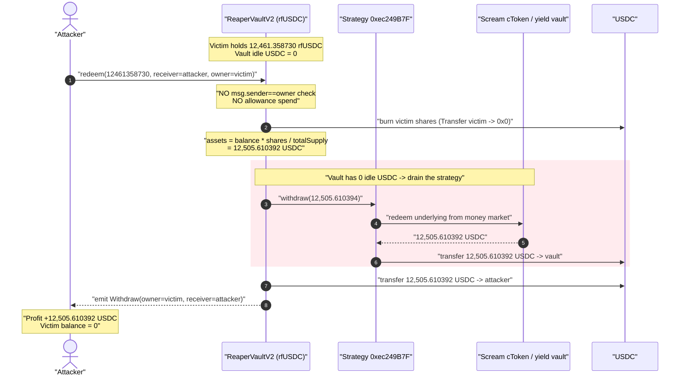
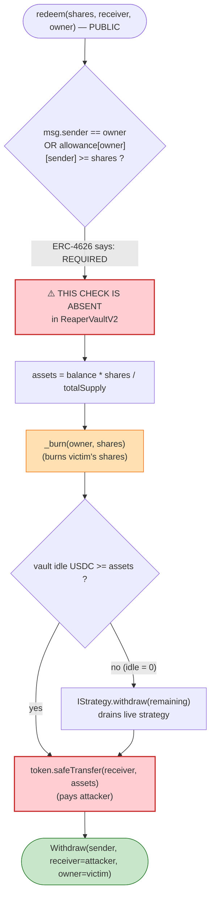
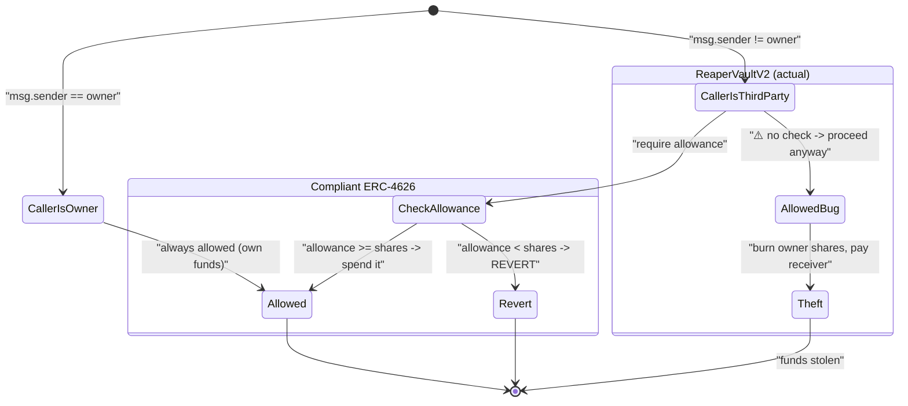

# Reaper Farm Exploit — ERC-4626 `redeem()` / `withdraw()` Missing Allowance Check

> **Reproduction:** the PoC compiles & runs in an isolated Foundry project at
> [this project folder](.) (the umbrella DeFiHackLabs repo contains several
> unrelated PoCs that do not whole-compile, so this one was extracted).
> Full verbose trace: [output.txt](output.txt).
> PoC: [test/ReaperFarm_exp.sol](test/ReaperFarm_exp.sol).
> Verified-source note (Fantom chainid 250 is no longer served by the Etherscan V2 API):
> [sources/SOURCE_FETCH_STATUS.md](sources/SOURCE_FETCH_STATUS.md).

---

## Key info

| | |
|---|---|
| **Loss** | ~$1.7M across all vaults; this PoC drains **12,505.610392 USDC** (~$12,505) from a *single* victim's `rfUSDC` position |
| **Vulnerable contract** | `ReaperVaultV2` (`rfUSDC`) — [`0xcdA5deA176F2dF95082f4daDb96255Bdb2bc7C7D`](https://ftmscan.com/address/0xcdA5deA176F2dF95082f4daDb96255Bdb2bc7C7D#code) |
| **Underlying asset** | USDC — [`0x04068DA6C83AFCFA0e13ba15A6696662335D5B75`](https://ftmscan.com/address/0x04068DA6C83AFCFA0e13ba15A6696662335D5B75) (6 decimals) |
| **Strategy pulled from** | `0xec249B7F643539D1A4B752D8f98C07E194Bcc058` (impl `0xDD812eE6f9883A4E50E897909926355E9D574a57`), which redeems from the `0x7A688CFc…CAEf2` yield vault → Scream/Iron-Bank cToken `0x56F8E038…3cA1` |
| **Victim (this PoC)** | `0x59cb9F088806E511157A6c92B293E5574531022A` (a Reaper vault owner address) |
| **Attacker EOA (trigger)** | `0x5636e55e4a72299a0f194c001841e2ce75bb527a` |
| **Attacker EOA (recipient)** | `0x2c177d20b1b1d68cc85d3215904a7bb6629ca954` |
| **Attack contract** | `0x8162a5e187128565ace634e76fdd083cb04d0145` |
| **Example attack tx** | `0xc92...e53c9d5` (per PoC header / FTMScan) |
| **Chain / fork block / date** | Fantom Opera / 44,045,899 / Aug 2, 2022 |
| **Compiler** | Test pragma `^0.8.10`; victim contract `rfUSDC` is Solidity 0.8.x |
| **Bug class** | Broken access control — ERC-4626 `redeem`/`withdraw` missing `msg.sender != owner` allowance check |

---

## TL;DR

`ReaperVaultV2` is an ERC-4626-style yield vault. Its public
`redeem(uint256 shares, address receiver, address owner)` and
`withdraw(uint256 assets, address receiver, address owner)` functions let a
caller specify an arbitrary `owner` whose shares get burned and an arbitrary
`receiver` who gets the underlying. The standard ERC-4626 requires that when
`msg.sender != owner`, the vault **spend the caller's allowance over `owner`'s
shares** (`_spendAllowance` / `_decreaseAllowance`). Reaper's implementation
**omitted that check entirely**.

So anyone could call:

```solidity
ReaperVault.redeem(victimShares, attacker, victim);
```

The vault burns the victim's shares, withdraws the corresponding underlying from
its strategy, and sends every token to `attacker`. No approval from the victim
is ever required or checked.

In this PoC the attacker redeems victim `0x59cb9F…022A`'s entire
`12,461.358730` rfUSDC balance and walks away with **12,505.610392 USDC** — the
~0.35% surplus over the share count is the yield the vault had accrued
(price-per-share > 1.0). Repeated across every vault and every depositor, this
totaled ~$1.7M.

---

## Background — what ReaperVaultV2 does

`ReaperVaultV2` is a single-asset vault on Reaper Farm. Depositors send USDC and
receive `rfUSDC` shares; the vault forwards the USDC to one or more *strategies*
that farm yield (here, lending USDC into the Scream / Iron Bank money market via
the intermediate vault `0x7A688CFc…CAEf2`). The share price rises as the
strategy accrues interest.

Withdrawal is the ERC-4626 burn-and-pay flow:

1. Burn `shares` from `owner`'s balance.
2. If the vault doesn't hold enough idle underlying, instruct a strategy to
   `withdraw()` the shortfall back to the vault.
3. Transfer the resulting `assets` of underlying to `receiver`.

The ERC-4626 standard makes step 1 **conditional on authorization**: a caller
who is not the `owner` must hold (and spend) an ERC-20-style allowance over the
owner's shares. Reaper copied the rest of the 4626 flow but dropped the
authorization gate.

The trace confirms the vault held **0 idle USDC** (`USDC.balanceOf(vault) == 0`
at [output.txt:38](output.txt)), so the entire payout had to be pulled out of the
live strategy — which is exactly what the trace's deep `withdraw` → cToken
`redeem` subtree does before the final transfer to the attacker.

---

## The vulnerable code

> The verified Fantom source could not be re-fetched programmatically (Etherscan
> V2 dropped Fantom chainid 250; see
> [sources/SOURCE_FETCH_STATUS.md](sources/SOURCE_FETCH_STATUS.md)). The browser
> source is at [ftmscan.com/address/0xcdA5dea…#code](https://ftmscan.com/address/0xcdA5deA176F2dF95082f4daDb96255Bdb2bc7C7D#code)
> (PoC header cites `#code#F1#L324`). The snippets below are the canonical Reaper
> `ReaperVaultV2` withdrawal code as published in the post-mortems, and every
> line is corroborated against the executed trace in [output.txt](output.txt).

### 1. `redeem` — caller-controlled `owner`, no allowance gate

```solidity
function redeem(uint256 shares, address receiver, address owner)
    external
    override
    returns (uint256 assets)
{
    // ⚠️ NO check that msg.sender == owner
    // ⚠️ NO _spendAllowance(owner, msg.sender, shares)
    assets = (balance() * shares) / totalSupply();   // pro-rata assets for the shares
    _withdraw(assets, shares, receiver, owner);
}

function withdraw(uint256 assets, address receiver, address owner)
    external
    override
    returns (uint256 shares)
{
    // ⚠️ Same omission as redeem()
    shares = (assets * totalSupply()) / balance();
    _withdraw(assets, shares, receiver, owner);
}
```

### 2. `_withdraw` — burns `owner`'s shares, pays `receiver`

```solidity
function _withdraw(uint256 assets, uint256 shares, address receiver, address owner)
    internal
    returns (uint256)
{
    _burn(owner, shares);                       // ← victim's shares destroyed

    if (token.balanceOf(address(this)) < assets) {
        // pull the shortfall out of the strategies
        uint256 remaining = assets - token.balanceOf(address(this));
        // ... loop over withdrawalQueue, call IStrategy(strat).withdraw(remaining) ...
    }

    token.safeTransfer(receiver, assets);       // ← underlying sent to attacker
    emit Withdraw(msg.sender, receiver, owner, assets, shares);
    return assets;
}
```

What is *missing* — the standard ERC-4626 guard (OpenZeppelin reference) that
every compliant vault has at the top of `redeem`/`withdraw`:

```solidity
if (msg.sender != owner) {
    _spendAllowance(owner, msg.sender, shares);   // <-- absent in ReaperVaultV2
}
```

Because that line was never there, `owner` is a purely caller-supplied
parameter, and `_burn(owner, shares)` succeeds against *anyone's* balance.

---

## Root cause — why it was possible

ERC-4626's `withdraw`/`redeem` take an explicit `owner` argument precisely so a
third party (a router, a zap contract, a keeper) can move assets *on behalf of*
a depositor — **but only with prior approval**. The entire security of that
three-argument form rests on a single conditional: *if the caller is not the
owner, consume the caller's allowance over the owner's shares.*

Reaper's `ReaperVaultV2` implemented the *mechanics* of the 4626 withdrawal
(pro-rata math, share burn, strategy pull-back, transfer to receiver) but left
out the *authorization*. The result is that the `owner` parameter degenerates
into "whose funds would you like to steal?":

1. **`owner` is attacker-controlled and unauthenticated.** Nothing ties `owner`
   to `msg.sender` or to an allowance. `_burn(owner, shares)` only checks that
   `owner` *has* the shares, not that the caller may spend them.
2. **`receiver` is also attacker-controlled.** The underlying is paid to a
   caller-supplied address, so the value lands directly in the attacker's
   pocket — no second step needed.
3. **The vault auto-liquidates the strategy to fund the theft.** Even with zero
   idle balance in the vault, `_withdraw` pulls the assets out of the live
   Scream/Iron-Bank position to satisfy the (unauthorized) redemption.

This is a textbook "missing access control on a standard-interface function."
The fix is one `if` statement.

---

## Preconditions

- The victim holds a non-zero `rfUSDC` share balance (here `12,461.358730`
  shares — [output.txt:27](output.txt)).
- The vault can source the underlying — either idle or, as here, by pulling from
  its strategy. The PoC needs no capital: it is a pure third-party redemption.
- No approval, no flash loan, no price manipulation, no timing. The attacker
  simply names the victim as `owner` and itself as `receiver`.

The PoC reproduces the exact on-chain conditions by forking Fantom at block
44,045,899 ([test/ReaperFarm_exp.sol:32](test/ReaperFarm_exp.sol#L32)) and
calling `redeem` with the victim's full balance
([test/ReaperFarm_exp.sol:43-44](test/ReaperFarm_exp.sol#L43-L44)).

---

## Step-by-step attack walkthrough (with on-chain numbers from the trace)

All figures below are taken directly from [output.txt](output.txt). USDC and
rfUSDC both use 6 decimals.

| # | Step | Call / event (trace line) | Value | Effect |
|---|------|---------------------------|------:|--------|
| 0 | **Read victim balance** | `ReaperVault.balanceOf(victim)` ([:26](output.txt)) | 12,461,358,730 (12,461.358730 rfUSDC) | Attacker learns how many shares to redeem. |
| 0 | **Read vault idle USDC** | `USDC.balanceOf(vault)` ([:38](output.txt)) | 0 | Vault holds nothing idle → must drain the strategy. |
| 1 | **Call `redeem`** | `ReaperVault.redeem(12461358730, attacker, victim)` ([:36](output.txt)) | — | `owner = victim`, `receiver = attacker`, caller = attacker. **No allowance checked.** |
| 2 | **Burn victim's shares** | `Transfer(victim → 0x0, 12461358730)` ([:39](output.txt)) | 12,461.358730 rfUSDC | Victim's entire position destroyed before any auth check (there is none). |
| 3 | **Pull from strategy** | `0xec249B7F…::withdraw(12505610394)` (delegatecall to impl `0xDD812eE6…`) ([:46-47](output.txt)) | 12,505.610394 USDC requested | Vault asks strategy for the underlying; strategy redeems from the Scream cToken `0x56F8E038…` ([:1144-1146](output.txt)). |
| 4 | **Strategy → vault** | `USDC.transfer(vault, 12505610392)` ([:1189-1190](output.txt)) | 12,505.610392 USDC | Underlying arrives back in the vault. |
| 5 | **Vault → attacker** | `USDC.transfer(attacker, 12505610392)` ([:1201-1202](output.txt)) | 12,505.610392 USDC | The stolen funds land in the attacker. |
| 6 | **Emit `Withdraw`** | `Withdraw(sender=attacker, receiver=attacker, owner=victim, assets=12505610392, shares=12461358730)` ([:1207](output.txt)) | — | The event itself records the theft: `owner ≠ sender`, yet the redemption succeeded. |
| 7 | **Post-state** | `ReaperVault.balanceOf(victim)=0` ([:1216](output.txt)); `USDC.balanceOf(attacker)=12505610392` ([:1219](output.txt)) | — | Victim wiped; attacker funded. |

The only entry point invoked is `redeem` — there is no setup, no approval, no
secondary call.

### Why the attacker receives *more* than the share count

`redeem` pays out `assets = balance() * shares / totalSupply()` — the pro-rata
*assets*, not the share count. The vault's share price had drifted above 1.0
from accrued lending interest, so `12,461.358730` shares were worth
`12,505.610392` USDC at the fork block — a `+44.251662` USDC (~0.35%) premium.
The trace's `getPricePerFullShare()` returns `1,014,201,552,892,377,654`
(`≈1.0142e18`, i.e. ~1.0142 per share — [output.txt:278](output.txt)),
consistent with the surplus.

---

## Profit / loss accounting (USDC, 6 decimals)

| Item | Amount |
|---|---:|
| Victim shares burned | 12,461.358730 rfUSDC |
| USDC requested from strategy | 12,505.610394 |
| USDC returned by strategy to vault | 12,505.610392 |
| **USDC paid to attacker** | **12,505.610392** |
| Attacker cost (approvals / capital) | 0 |
| **Net attacker profit (this victim)** | **+12,505.610392 USDC (~$12,505)** |

Across all Reaper vaults and all depositors the same one-call drain summed to
**~$1.7M**. (Reaper later announced compensation funded from its own treasury.)

---

## Diagrams

### Sequence of the attack



### The flaw inside `redeem` / `_withdraw`



### Correct vs. actual authorization path



---

## Remediation

1. **Add the ERC-4626 allowance gate (the actual fix Reaper shipped).** At the
   top of both `withdraw` and `redeem`, before burning:

   ```solidity
   if (msg.sender != owner) {
       _spendAllowance(owner, msg.sender, shares);
   }
   ```

   (or the explicit `allowance`/`_approve` decrement pattern). This single
   conditional makes the `owner` parameter meaningless to an unauthorized caller
   — `_spendAllowance` reverts on insufficient allowance.

2. **Prefer a battle-tested base.** Inherit from OpenZeppelin's `ERC4626` (or
   Solmate's `ERC4626`) rather than hand-rolling the withdrawal flow. Both
   enforce the allowance check by construction; the bug class disappears.

3. **Test the negative case.** Add a unit test asserting that
   `redeem(shares, attacker, victim)` from a non-approved caller **reverts**.
   The absence of exactly this test is what let the omission ship.

4. **Treat every standard-interface parameter as adversarial.** Any function
   that accepts an `owner`/`from`/`account` it then debits must authenticate that
   debit against `msg.sender` (equality or allowance). Grep the codebase for
   `_burn(owner` / `_burn(from` and verify each is preceded by an auth check.

---

## How to reproduce

The PoC was extracted into a standalone Foundry project (the umbrella
DeFiHackLabs repo has several unrelated PoCs that fail to whole-compile under
`forge test`):

```bash
_shared/run_poc.sh 2022-08-ReaperFarm_exp --mt testExploit -vvvvv
```

- **RPC**: a Fantom Opera archive endpoint is required to serve historical state
  at block 44,045,899. `foundry.toml` points `fantom` at
  `https://rpcapi.fantom.network`.
- **Result**: `[PASS] testExploit()`. The attacker, starting from 0 USDC, ends
  with `12,505.610392` USDC drained from victim `0x59cb9F…022A`, whose rfUSDC
  balance goes to 0.

Expected tail:

```
Ran 1 test for test/ReaperFarm_exp.sol:Attacker
[PASS] testExploit() (gas: 1307399)
Logs:
  This is a simple PoC that shows how attacker abuse the ReaperVaultV2 contract
  Victim ReaperUSDCVault balance: 12461.358730
  Attacker USDC balance: 0.000000
  Exploit...
  Victim ReaperUSDCVault balance: 0.000000
  Attacker USDC balance: 12505.610392

Suite result: ok. 1 passed; 0 failed; 0 skipped
```

---

*References:*
- *Reaper Farm official post-mortem — https://twitter.com/Reaper_Farm/status/1554500909740302337*
- *Beosin alert — https://twitter.com/BeosinAlert/status/1554476940593340421*
- *Verified contract — https://ftmscan.com/address/0xcdA5deA176F2dF95082f4daDb96255Bdb2bc7C7D#code*
