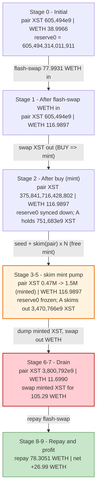
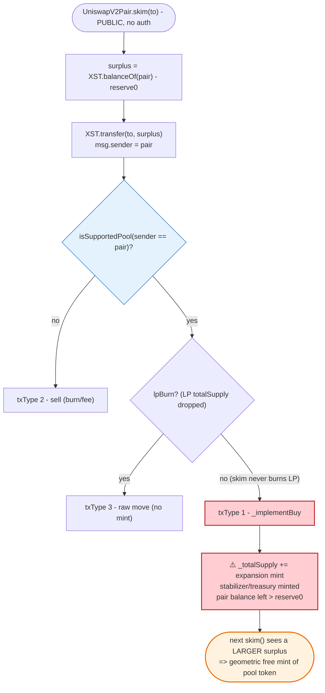

# XSTABLE.PROTOCOL (XST) Exploit — `skim()`-driven elastic-supply mint that re-inflates the pool's own token reserve

> **Reproduction:** the PoC compiles & runs in an isolated Foundry project at
> [this project folder](.) (the umbrella DeFiHackLabs repo
> contains many unrelated PoCs that do not whole-compile, so this one was extracted).
> Full verbose trace: [output.txt](output.txt).
> Verified vulnerable source: [XST2.sol](sources/XStable2_b27664/C_Crypto_Projects_xstable_contracts_XST2.sol),
> [Setters2.sol](sources/XStable2_b27664/C_Crypto_Projects_xstable_contracts_Setters2.sol).

---

## Key info

| | |
|---|---|
| **Loss** | ~**27 WETH** net profit in this reproduction (≈ **$43K** at the Aug-2022 ETH price ~$1.6K); publicly reported in the ~$27K–$45K range |
| **Vulnerable contract** | `XStable2` (impl) — [`0xb276647E70CB3b81a1cA302Cf8DE280fF0cE5799`](https://etherscan.io/address/0xb276647E70CB3b81a1cA302Cf8DE280fF0cE5799#code), served via proxy `XST` [`0x91383A15C391c142b80045D8b4730C1c37ac0378`](https://etherscan.io/address/0x91383A15C391c142b80045D8b4730C1c37ac0378) |
| **Victim pool** | Uniswap V2 `XST/WETH` pair — [`0x694f8F9E0ec188f528d6354fdd0e47DcA79B6f2C`](https://etherscan.io/address/0x694f8F9E0ec188f528d6354fdd0e47DcA79B6f2C) |
| **Flash-loan source** | Uniswap V2 `WETH/USDT` pair — `0x0d4a11d5EEaaC28EC3F61d100daF4d40471f1852` |
| **Attacker tx** | `0x873f7c77d5489c1990f701e9bb312c103c5ebcdcf0a472db726730814bfd55f3` |
| **Chain / block / date** | Ethereum mainnet / fork **15,310,016** / ~Aug 8, 2022 |
| **Compiler** | impl `v0.6.12+commit.27d51765`, optimizer **2000 runs**; pair `v0.5.16`, optimizer **999999 runs** |
| **Bug class** | Fee/mint-on-transfer interacting with `UniswapV2Pair.skim()` → permissionless re-minting of the pool's own token reserve, breaking constant-product `k` |

---

## TL;DR

`XStable2` is an elastic-supply ("rebase"-style) token. Its `_transfer`
([XST2.sol:127-165](sources/XStable2_b27664/C_Crypto_Projects_xstable_contracts_XST2.sol#L127-L165))
classifies every transfer into one of three tax regimes by **looking at the
sender/recipient address**, not at the actual direction of value:

- if the **sender is a registered AMM pool**, the transfer is treated as a *buy*
  (`txType == 1`) and runs `_implementBuy`, which **mints fresh XST** (a +1%
  "expansion" to total supply, plus a stabilizer/treasury fee) and credits the
  full transferred amount to the recipient
  ([XST2.sol:167-184](sources/XStable2_b27664/C_Crypto_Projects_xstable_contracts_XST2.sol#L167-L184)).

The Uniswap V2 pair's `skim(to)` function calls
`token0.transfer(to, balanceOf(pair) − reserve0)`
([UniswapV2Pair.sol:485-490](sources/UniswapV2Pair_694f8F/UniswapV2Pair.sol#L485-L490)).
Because `token0 = XST` and the **`msg.sender` of that transfer is the pair
itself**, every `skim()` is seen by `XStable2` as *"a supported pool is
sending XST"* → a **buy** → a **mint**. When the skim destination is the pair
(`skim(pair)`), the freshly-credited amount lands right back in the pair's
balance, **above `reserve0`**, so the next `skim()` finds an even larger
surplus and mints again. Iterating `skim()` 15× lets the attacker pump the
pair's XST token balance from ~0.47M to ~1.5M XST **out of thin air**, while the
pair's stored `reserve0` never moves.

The attacker then `transfer`s all of that minted XST into the pair as input and
calls `swap(0, reserveWETH·9/10, …)`, pulling almost the entire WETH reserve out
against XST that the protocol minted for free. The whole thing is bankrolled by
a Uniswap flash-swap, so the attacker needs ~0 capital.

---

## Background — what XStable2 does

`XStable2` ([XST2.sol](sources/XStable2_b27664/C_Crypto_Projects_xstable_contracts_XST2.sol))
is "XSTABLE.PROTOCOL", an algorithmic elastic-supply token (9 decimals) deployed
behind an `AdminUpgradeabilityProxy`. Balances are stored in a *large* unit
space (`_largeBalances`) and divided by a global `getFactor()` to produce the
user-facing balance
([Getters2.sol:74-92](sources/XStable2_b27664/C_Crypto_Projects_xstable_contracts_XST2.sol)).
On every transfer it does one of three things, keyed purely off the addresses
involved ([XST2.sol:138-165](sources/XStable2_b27664/C_Crypto_Projects_xstable_contracts_XST2.sol#L138-L165)):

| txType | Condition | Handler | Effect |
|--------|-----------|---------|--------|
| 1 (buy) | `sender` is a supported pool, no LP burn detected | `_implementBuy` | **mints** ~1% expansion + stabilizer/treasury fee; credits recipient |
| 2 (sell) | default (e.g. user → pool) | `_implementSell` | burns + utility fee + "pot" |
| 3 (raw) | taxless tx, or `sender == router`, or LP-burn detected | direct move | no fee, no mint |

The direction is inferred from `_getTxType`
([XST2.sol:208-220](sources/XStable2_b27664/C_Crypto_Projects_xstable_contracts_XST2.sol#L208-L220)):

```solidity
function _getTxType(address sender, address recipient, bool lpBurn) private returns(uint256) {
    uint256 txType = 2;
    if (isSupportedPool(sender)) {
        if (lpBurn) { txType = 3; }     // LP being removed → no mint
        else        { txType = 1; }     // ← otherwise, ANY transfer FROM a pool = "buy" = MINT
    } else if (sender == Constants.getRouterAdd()) {
        txType = 3;
    }
    return txType;
}
```

On-chain parameters at the fork block (from `Constants2.sol`):

| Parameter | Value |
|---|---|
| `decimals` | 9 |
| `_baseExpansionFactor` | 100 bps = **+1% mint per buy** |
| `_stabilizerFee` / `_treasuryFee` | 250 / 250 bps of the minted amount |
| `_baseContractionFactor` | 100 bps (sell burn) |
| Stabilizer address | `0x16a17E12031Db06932cD3b2Eb7450112B7c91289` |
| Treasury address | `0x3363Defd7447f14b7f696c0843AA96516Bc04808` |
| Pair `reserve0`/`reserve1` (XST/WETH) before attack | `605,494,314,011,911` XST (≈ 605,494 XST) / `38.9966` WETH |

That last row is the starting point: a thin pool with ~605K XST and ~39 WETH.

---

## The vulnerable code

### 1. A transfer *from* a pool is unconditionally treated as a buy → mint

```solidity
// XST2.sol
function _transfer(address sender, address recipient, uint256 amount) private pausable {
    ...
    bool lpBurn;
    if (isSupportedPool(sender)) {
        lpBurn = syncPair(sender);          // ← updates cached pool counters; lpBurn only if LP totalSupply dropped
    } else if (isSupportedPool(recipient)){
        silentSyncPair(recipient);
    } else {
        silentSyncPair(_mainPool);
    }
    txType = _getTxType(sender, recipient, lpBurn);
    ...
    if (txType == 1) { _implementBuy(sender, recipient, amount, largeAmount, currentFactor); }  // MINTS
    ...
}
```
[XST2.sol:141-153](sources/XStable2_b27664/C_Crypto_Projects_xstable_contracts_XST2.sol#L141-L153)

```solidity
function _implementBuy(address sender, address recipient, uint256 amount, uint256 largeAmount, uint256 currentFactor) private {
    (uint256 stabilizerMint, uint256 treasuryMint, uint256 totalMint, uint256 incentive) = getMintValue(sender, amount);
    _largeBalances[sender]    = _largeBalances[sender].sub(largeAmount);     // pool loses `amount`
    _largeBalances[recipient] = _largeBalances[recipient].add(largeAmount);  // recipient gains `amount`
    _largeBalances[getStabilizer()]            = _largeBalances[getStabilizer()].add(stabilizerMint.mul(currentFactor));
    _largeBalances[Constants.getTreasuryAdd()] = _largeBalances[Constants.getTreasuryAdd()].add(treasuryMint.mul(currentFactor));
    _totalSupply = _totalSupply.add(totalMint);   // ← NEW SUPPLY CREATED
    ...
    emit Transfer(address(0), getStabilizer(), stabilizerMint);
    emit Transfer(address(0), Constants.getTreasuryAdd(), treasuryMint);
}
```
[XST2.sol:167-184](sources/XStable2_b27664/C_Crypto_Projects_xstable_contracts_XST2.sol#L167-L184)

When `recipient == sender == pair` (the `skim(pair)` case), the
`sub`/`add` on the pool balance cancel, but the **mint side effect still runs**:
new XST is created for the stabilizer/treasury and, crucially, the pair's balance
is left *above* its stored `reserve0`, priming the next skim.

### 2. `UniswapV2Pair.skim()` hands the surplus back as a fee-on-transfer transfer

```solidity
// UniswapV2Pair.sol
function skim(address to) external lock {
    address _token0 = token0; // XST
    address _token1 = token1; // WETH
    _safeTransfer(_token0, to, IERC20(_token0).balanceOf(address(this)).sub(reserve0));
    _safeTransfer(_token1, to, IERC20(_token1).balanceOf(address(this)).sub(reserve1));
}
```
[UniswapV2Pair.sol:485-490](sources/UniswapV2Pair_694f8F/UniswapV2Pair.sol#L485-L490)

`_safeTransfer` → `XStable2.transfer(to, surplus)` is executed **with the pair as
`msg.sender`**. So from XST's point of view, "a supported pool is transferring
XST" → `txType == 1` → mint. The pair's own balance check (`balanceOf − reserve0`)
ignores `reserve0` going stale relative to the inflated balance, so the surplus
keeps growing skim after skim.

### 3. The LP-burn guard does not fire

`syncPair` only returns `lpBurn = true` when the pair's **LP-token total supply**
shrank since the last sync
([Setters2.sol:33-40](sources/XStable2_b27664/C_Crypto_Projects_xstable_contracts_XST2.sol)).
During the skim loop no LP is minted or burned, so `lpBurn` stays `false`, and
every skim stays on the `txType == 1` mint path.

---

## Root cause

A Uniswap V2 pair assumes its tokens are *inert*: balances change only through
`mint`/`burn`/`swap`/plain transfers it can reason about, and `skim()`/`sync()`
exist precisely to reconcile balance vs. `reserve`. `XStable2` violates that
assumption in two compounding ways:

1. **Direction is inferred from the address, not the value flow.** Any transfer
   whose `msg.sender` is a registered pool is classified as a *buy* and **mints
   new tokens** — even when the "transfer" is the pair skimming its own surplus
   back to itself. There is no check that value (WETH) actually entered the pool.

2. **`skim()` becomes a free mint pump.** Because the mint leaves the pair's XST
   balance above `reserve0`, the surplus that the *next* `skim()` reads is larger
   than the previous one. Repeated permissionless `skim(pair)` calls therefore
   inflate the pair's XST holdings geometrically while `reserve0` is frozen. The
   attacker can then dump this minted XST for the pool's WETH at the stale price.

In short: **fee/mint-on-transfer + a pool-address-based buy classifier + the
public `skim()` reconciliation hook = a permissionless mint of the pool's own
reserve token.** No privileged role, no oracle, no special timing is required.

---

## Preconditions

- The XST/WETH pair is a *supported pool* in `XStable2` (it is `_mainPool`), so
  transfers from it route through the mint path.
- `isPresaleDone()` is true (so transfers are allowed) and the contract is not
  paused — both true at the fork block.
- A thin pool so the WETH side is cheap to corner; the attack scales with how
  much XST can be minted vs. the WETH reserve.
- Working WETH to seed the swap; fully recovered intra-transaction, hence
  **flash-loanable** — the PoC borrows it from the WETH/USDT pair via a
  flash-swap and repays with a 0.4% fee.

---

## Attack walkthrough (with on-chain numbers from the trace)

For the XST/WETH pair, `token0 = XST` (`reserve0`), `token1 = WETH` (`reserve1`).
All XST figures are raw (9 decimals); divide by `1e9` for whole XST. WETH figures
are raw 18-decimal wei. Numbers are taken directly from the `Sync`/`Swap` events
and balance reads in [output.txt](output.txt).

| # | Step (trace ref) | Pair XST balance | Pair WETH balance | Effect |
|---|------------------|----------------:|------------------:|--------|
| 0 | **Initial** ([:41](output.txt)) | 605,494,314,011,911 | 38.9966 WETH | Honest thin pool. `reserve0 = 605,494,314,011,911`. |
| 1 | **Flash-swap** 77.9931 WETH out of WETH/USDT pair `0x0d4a` ([:22](output.txt)), forwarded into XST pair ([:32-39](output.txt)) | 605,494,314,011,911 | 116.9897 WETH | Pair now holds 116.99 WETH; reserves not yet synced. |
| 2 | **Swap** XST out: `swap(403,662,876,007,940, 0, attacker)` ([:46](output.txt)); buy-mint path runs | 375,841,716,428,802 | 116.9897 WETH | Attacker XST balance = `751,683,432,857,598` ([:99](output.txt)). `sync()` sets `reserve0 = 375,841,716,428,802`, `reserve1 = 116.99 WETH` ([:95](output.txt)). |
| 3 | **Seed**: attacker `transfer(pair, b1/8 = 93,960,429,107,199)` ([:107-128](output.txt)) — sell path, leaves pair balance > reserve0 | 468,392,739,099,395 | 116.9897 WETH | Creates the first skim surplus. |
| 4 | **`skim(pair)` ×N** ([:129-593](output.txt)) — each skim transfers `balance−reserve0` back to the pair, which XST treats as a **buy → mint** | 555,928,663,215,417 → 673,254,730,705,998 → 798,761,537,551,945 → 917,612,787,761,093 → 1,023,230,859,931,782 → … | 116.9897 WETH (unchanged) | Pair XST balance climbs geometrically; stabilizer (`0x16a1…`) and treasury (`0x3363…`) receive fresh mints each skim ([:58-59,:145-146,…](output.txt)). |
| 5 | **`skim(attacker)`** ([:594-626](output.txt)) — final skim sends accumulated surplus to the attacker | — | 116.9897 WETH | Attacker XST balance grows to `3,470,766,087,099,226` ([:629](output.txt)). |
| 6 | **Dump**: attacker `transfer(pair, 3,470,766,087,099,226)` ([:631-651](output.txt)) → pair balance `382,088,276,660,357`; `getReserves` ([:653](output.txt)) | 382,088,276,660,357 | 116.9897 WETH | Loads the pair with minted XST as swap input. |
| 7 | **Drain**: `swap(0, 105,290,709,049,849,600,449, attacker)` ([:655-674](output.txt)) | 3,800,792,872,453,095 | **11.6990 WETH** | Pulls **105.29 WETH** out (≈ 90% of the 116.99 WETH reserve) against the minted XST. `Sync(reserve0=3.8e15, reserve1=11.699 WETH)`. |
| 8 | **Repay** flash-swap: `transfer(0x0d4a, 78,305,090,285,962,221,370)` ([:681-686](output.txt)) | — | — | Returns 78.305 WETH (77.993 principal + 0.4% fee). |
| 9 | **Profit**: attacker WETH balance `26,985,618,763,887,379,079` ([:700](output.txt)), then `WETH.withdraw` ([:703-708](output.txt)) | — | — | **Net ≈ 26.99 WETH**; log prints `now my weth num: 26`. |

### Why the skim loop mints geometrically

Each `skim(pair)` calls `XST.transfer(pair, balance − reserve0)` with the pair as
sender. XST runs `_implementBuy`: the `sub`/`add` on the pair cancel (sender ==
recipient), but `_totalSupply` grows by the expansion mint and the pair's balance
is left unchanged *and still above the stale `reserve0`*. Because the seeding sell
in step 3 first pushed `balance > reserve0`, each subsequent skim reads a non-zero
surplus, transfers it back (minting along the way), and the resulting balance is
again `> reserve0`. The trace shows the pair's XST balance ratcheting up every
skim (468e12 → 555e12 → 673e12 → 798e12 → 917e12 → 1023e12 → …) with the WETH
reserve frozen at 116.99 — a one-sided inflation of the constant-product curve in
the attacker's favor.

### Profit accounting (WETH)

| Direction | Amount (WETH) |
|---|---:|
| Flash-swap borrowed (cost basis) | 77.9931 |
| Drained from XST pair (step 7) | 105.2907 |
| Flash-swap repayment (principal + 0.4% fee) | −78.3051 |
| **Net profit** | **≈ +26.99** |

The attacker walks off with ~27 WETH — most of the XST/WETH pool's real WETH
liquidity — having supplied essentially no capital of their own.

---

## Diagrams

### Sequence of the attack

```mermaid
sequenceDiagram
    autonumber
    actor A as "Attacker contract"
    participant FL as "WETH/USDT pair (0x0d4a)"
    participant P as "XST/WETH pair (0x694f)"
    participant T as "XStable2 (XST token)"

    Note over P: "Initial: 605,494 XST / 38.9966 WETH<br/>reserve0 frozen at 605,494,314,011,911"

    rect rgb(255,243,224)
    Note over A,FL: "Step 1 - flash-swap WETH"
    A->>FL: "swap(77.9931 WETH out, 0, A, data)"
    FL-->>A: "uniswapV2Call() callback"
    A->>P: "transfer 77.9931 WETH into the pair"
    end

    rect rgb(227,242,253)
    Note over A,T: "Step 2 - buy XST (mint path)"
    A->>P: "swap(403,662,876,007,940 XST out, 0, A)"
    P->>T: "transfer(A, XST)  (sender = pool => BUY => mint)"
    P->>P: "sync() -> reserve0=375,841,716,428,802 / reserve1=116.99 WETH"
    Note over A: "A holds 751,683,432,857,598 XST"
    end

    rect rgb(243,229,245)
    Note over A,T: "Step 3-5 - skim mint pump"
    A->>P: "transfer(pair, b1/8) seed surplus"
    loop "skim(pair) x N"
        A->>P: "skim(pair)"
        P->>T: "transfer(pair, balance-reserve0)  => BUY => mint"
        Note over P: "pair XST balance ratchets up;<br/>reserve0 stays frozen"
    end
    A->>P: "skim(attacker)"
    Note over A: "A holds 3,470,766,087,099,226 XST"
    end

    rect rgb(255,235,238)
    Note over A,T: "Step 6-7 - drain WETH"
    A->>P: "transfer(pair, 3,470,766,087,099,226 XST)"
    A->>P: "swap(0, 105.29 WETH out, A)"
    P-->>A: "105.2907 WETH"
    Note over P: "reserve1 collapses 116.99 -> 11.699 WETH"
    end

    A->>FL: "repay 78.3051 WETH (principal + 0.4% fee)"
    Note over A: "Net +26.99 WETH"
```

### Pool / supply state evolution



### The flaw inside `_transfer` / `skim`



---

## Remediation

1. **Do not infer trade direction from `msg.sender`.** Classifying every
   transfer *from* a pool as a "buy that mints" is the core flaw. A pool can move
   its own tokens for reasons that are not a buy (`skim`, `sync`, donations,
   internal accounting). Direction/expansion must be derived from an actual,
   verified change in the *paired* asset reserve, not from an address check.
2. **Never mint as a side effect of an arbitrary transfer.** Expansion/rebase
   logic should be a discrete, access-controlled or oracle-gated operation —
   not something any external `skim()`/`transfer()` can trigger.
3. **Treat `skim()`/`sync()` as adversarial.** Any token that hooks logic into
   `transfer` must be safe when the AMM pair calls `transfer` on itself. At
   minimum, exclude self-transfers (`sender == recipient`) and pair-initiated
   reconciliation from the mint path.
4. **Bound single-operation supply impact.** A transfer that can inflate total
   supply (and the pool's own reserve) without bound is a red flag; cap or rate-
   limit expansion and require it to be reserve-proportional.
5. **Avoid fee/mint-on-transfer tokens in standard Uniswap V2 pools.** Their
   balances are mutable in ways the constant-product invariant cannot police;
   pair them only via wrappers that neutralize transfer-side effects, or use
   AMMs designed for elastic-supply tokens.

---

## How to reproduce

The PoC was extracted into a standalone Foundry project (the umbrella
DeFiHackLabs repo does not whole-compile under `forge test`):

```bash
_shared/run_poc.sh 2022-08-XST_exp -vvvvv
```

- RPC: an **Ethereum archive** endpoint is required (fork block 15,310,016 is from
  Aug 2022). `foundry.toml` points `mainnet` at an Infura archive endpoint.
- Result: `[PASS] testExploit()`.

Expected tail:

```
Ran 1 test for test/XST_exp.sol:XSTExpTest
[PASS] testExploit() (gas: 959148)
Logs:
  Reserve amount 605494314011911
  Swap xst 403662876007940
  My xst balance: 751683432857598, uniswp xst: 375841716428802
  my weth balance: 105290709049849600449
  Refund 78305090285962221370:
  now my weth num: 26

Suite result: ok. 1 passed; 0 failed; 0 skipped; finished in 12.73s
```

---

*References: DeFiHackLabs — XSTABLE.PROTOCOL (XST), Ethereum, Aug 2022.
Attack tx `0x873f7c77d5489c1990f701e9bb312c103c5ebcdcf0a472db726730814bfd55f3`.*
