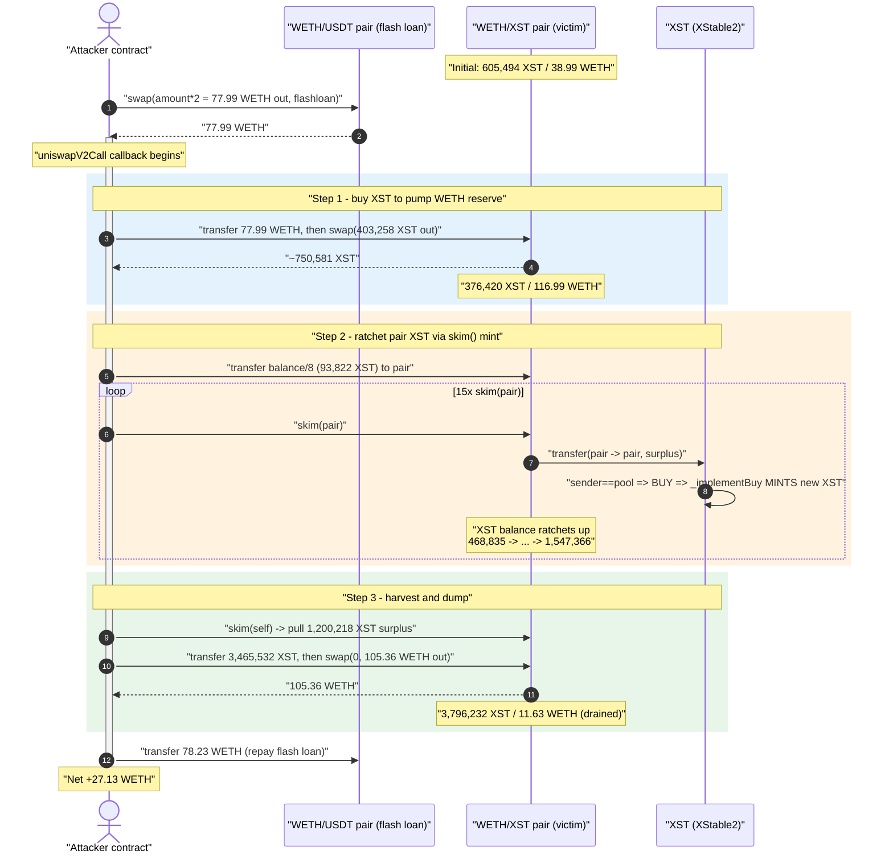
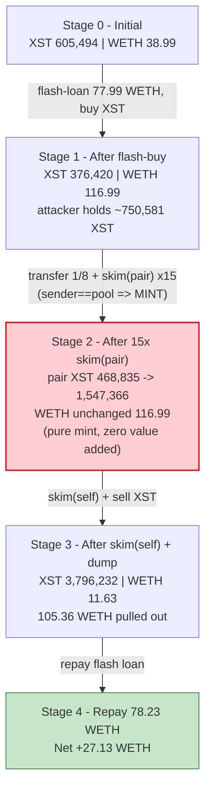
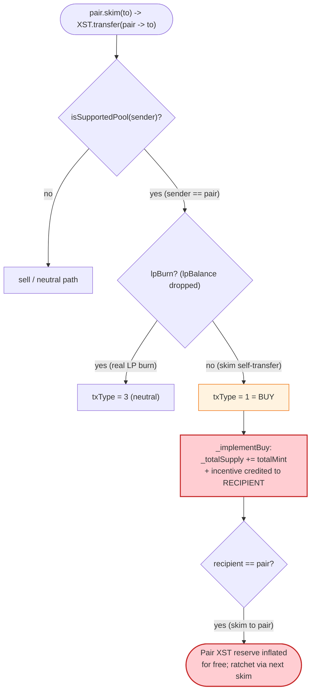

# XSTABLE.PROTOCOL (XST) Exploit — `skim()`-Driven Rebase Mint Inflates Pool Reserves

> **Reproduction:** the PoC compiles & runs in an isolated Foundry project at
> [this project folder](.) (the umbrella DeFiHackLabs repo contains many
> unrelated PoCs that do not whole-compile, so this one was extracted).
> Full verbose trace: [output.txt](output.txt).
> Verified vulnerable source (proxy implementation `XStable2`):
> [C_Crypto_Projects_xstable_contracts_XST2.sol](sources/XStable2_b27664/C_Crypto_Projects_xstable_contracts_XST2.sol).

---

## Key info

| | |
|---|---|
| **Loss** | **27.13 WETH** profit to the attacker in this PoC (the historical incident drained the full WETH/XST pool; SlowMist tracks it at ~$26K) |
| **Vulnerable contract** | `XStable2` (logic) — [`0xb276647e70cb3b81a1ca302cf8de280ff0ce5799`](https://etherscan.io/address/0xb276647e70cb3b81a1ca302cf8de280ff0ce5799#code) |
| **Proxy (XST token)** | `XST` — [`0x91383A15C391c142b80045D8b4730C1c37ac0378`](https://etherscan.io/address/0x91383A15C391c142b80045D8b4730C1c37ac0378) |
| **Victim pool** | UniswapV2 WETH/XST pair — `0x694f8F9E0ec188f528d6354fdd0e47DcA79B6f2C` |
| **Flash-loan source** | UniswapV2 WETH/USDT pair — `0x0d4a11d5EEaaC28EC3F61d100daF4d40471f1852` |
| **Attacker (PoC test contract)** | `0x7FA9385bE102ac3EAc297483Dd6233D62b3e1496` |
| **Reference tx** | `0x873f7c77d5489c1990f701e9bb312c103c5ebcdcf0a472db726730814bfd55f3` |
| **Chain / fork block / date** | Ethereum mainnet / 15,310,016 / Aug 2022 |
| **Compiler** | `XStable2` built with Solidity v0.6.12, optimizer 2000 runs (PoC harness compiles under 0.8.x) |
| **Bug class** | Elastic-supply (rebase) accounting abuse — pool-side balance inflation via `skim()` re-classified as a "buy" that **mints** new tokens |

---

## TL;DR

`XST` is an "elastic supply" / algorithmic-stablecoin token. Its `_transfer`
([XST2.sol:127-165](sources/XStable2_b27664/C_Crypto_Projects_xstable_contracts_XST2.sol#L127-L165))
applies special accounting whenever a *supported pool* (the Uniswap pair) is the **sender** of a
transfer: it treats that flow as a **buy** (`txType == 1`) and **mints fresh supply** to a stabilizer
and a treasury, plus an "incentive" credited *to the recipient*
(`_implementBuy`, [:167-184](sources/XStable2_b27664/C_Crypto_Projects_xstable_contracts_XST2.sol#L167-L184)).

The attacker abuses Uniswap's permissionless `pair.skim()`. `skim()` makes the pair **transfer its
own surplus token balance back to a recipient** — and the attacker points the recipient *at the pair
itself*. Each `skim(pair)` therefore fires `XST.transfer(pair → pair)` where the **sender is the
supported pool**, so XST runs its buy/expansion branch and **mints new XST into the pair's own
balance**. Repeating `skim()` 15 times ratchets the pair's XST balance up from **605,494 XST to
1,576,638 XST** without the attacker spending anything.

The attacker then `skim`s the inflated surplus to itself and dumps the cheaply-obtained XST back into
the pool, pulling out **105.36 WETH** against a pool that only held 116.99 WETH. The whole thing is
wrapped in a flash loan (77.99 WETH borrowed from the WETH/USDT pair, 78.23 WETH repaid), netting a
clean **+27.13 WETH**.

---

## Background — what XStable2 does

`XStable2` ([source](sources/XStable2_b27664/C_Crypto_Projects_xstable_contracts_XST2.sol)) is the
implementation behind the `XST` upgradeable proxy. It is an *elastic / rebasing* ERC20 with an
algorithmic expand-and-contract mechanism keyed off the reserves of its Uniswap pools:

- **Large-balance / factor accounting.** Internal balances are stored "large" (`_largeBalances`),
  scaled by a `getFactor()` derived from `_largeTotal / _totalSupply`
  ([Getters2.sol:86-92](sources/XStable2_b27664/C_Crypto_Projects_xstable_contracts_Getters2.sol#L86-L92)).
- **Buy = expansion (mint).** When a *supported pool* is the **sender** of a transfer, the protocol
  reads it as someone buying XST out of the pool. It runs `_implementBuy`, which **mints** new XST to
  the stabilizer and treasury (`_totalSupply.add(totalMint)`), and may credit an "incentive" to the
  recipient ([XST2.sol:167-184](sources/XStable2_b27664/C_Crypto_Projects_xstable_contracts_XST2.sol#L167-L184)).
- **Sell = contraction (burn + fees).** A transfer *to* a supported pool (or any non-pool transfer)
  is read as a sell: it burns part of the amount, skims a pot/utility fee, and is **fee-on-transfer**
  (`_implementSell`, [:186-206](sources/XStable2_b27664/C_Crypto_Projects_xstable_contracts_XST2.sol#L186-L206)).
- **Pool bookkeeping mirrors.** `_poolCounters` caches each pool's `(tokenBalance, pairTokenBalance,
  lpBalance, …)`. `syncPair` / `silentSyncPair` refresh that cache from live balances on every
  transfer ([Setters2.sol:33-46](sources/XStable2_b27664/C_Crypto_Projects_xstable_contracts_Setters2.sol#L33-L46)).

On-chain parameters at the fork block:

| Parameter | Value | Source |
|---|---|---|
| `decimals` | **9** | [Constants2.sol:45](sources/XStable2_b27664/C_Crypto_Projects_xstable_contracts_Constants2.sol#L45) |
| `_baseExpansionFactor` | 100 bps | [Constants2.sol:13](sources/XStable2_b27664/C_Crypto_Projects_xstable_contracts_Constants2.sol#L13) |
| `_baseContractionFactor` | 100 bps | [Constants2.sol:14](sources/XStable2_b27664/C_Crypto_Projects_xstable_contracts_Constants2.sol#L14) |
| `_stabilizerFee` / `_treasuryFee` | 250 / 250 bps of mint | [Constants2.sol:19,26](sources/XStable2_b27664/C_Crypto_Projects_xstable_contracts_Constants2.sol#L19) |
| `_incentivePot` | 50% of burn | [Constants2.sol:15](sources/XStable2_b27664/C_Crypto_Projects_xstable_contracts_Constants2.sol#L15) |
| Pair XST reserve (token0) | **605,494 XST** | trace L1595 |
| Pair WETH reserve (token1) | **38.99 WETH** | trace L1582/L1595 |

Because XST has only **9 decimals** and the WETH/XST pool was thin (≈39 WETH against ≈605k XST), every
mechanism that adds XST to the pool moves the price dramatically.

---

## The vulnerable code

### 1. A transfer *from* a supported pool is treated as a buy and **mints**

```solidity
function _transfer(address sender, address recipient, uint256 amount) private pausable {
    ...
    if (isTaxLess()) {
        txType = 3;
    } else {
        bool lpBurn;
        if (isSupportedPool(sender)) {
            lpBurn = syncPair(sender);          // ← pool is the SENDER
        } else if (isSupportedPool(recipient)){
            silentSyncPair(recipient);
        } else {
            silentSyncPair(_mainPool);
        }
        txType = _getTxType(sender, recipient, lpBurn);
    }
    if (txType == 1) {
        _implementBuy(sender, recipient, amount, largeAmount, currentFactor);   // ← MINTS
    } else if (txType == 2) {
        _implementSell(sender, recipient, amount, largeAmount, currentFactor);  // burn + fee
    } else if (txType == 3) { /* plain transfer */ }
}
```
[XST2.sol:127-165](sources/XStable2_b27664/C_Crypto_Projects_xstable_contracts_XST2.sol#L127-L165)

```solidity
function _getTxType(address sender, address recipient, bool lpBurn) private returns(uint256) {
    uint256 txType = 2;
    if (isSupportedPool(sender)) {
        if (lpBurn) { txType = 3; }   // genuine LP burn → neutral
        else { txType = 1; }          // ← otherwise: BUY (expansion / mint)
    } else if (sender == Constants.getRouterAdd()) {
        txType = 3;
    }
    return txType;
}
```
[XST2.sol:208-220](sources/XStable2_b27664/C_Crypto_Projects_xstable_contracts_XST2.sol#L208-L220)

```solidity
function _implementBuy(...) private {
    (uint256 stabilizerMint, uint256 treasuryMint, uint256 totalMint, uint256 incentive)
        = getMintValue(sender, amount);
    _largeBalances[sender] = _largeBalances[sender].sub(largeAmount);
    _largeBalances[recipient] = _largeBalances[recipient].add(largeAmount);
    _largeBalances[getStabilizer()]            = ...add(stabilizerMint.mul(currentFactor));
    _largeBalances[Constants.getTreasuryAdd()] = ...add(treasuryMint.mul(currentFactor));
    _totalSupply = _totalSupply.add(totalMint);              // ← NEW SUPPLY MINTED
    if (incentive > 0) {
        _largeBalances[recipient] = _largeBalances[recipient].add(incentive.mul(currentFactor)); // ← extra credit to recipient
        ...
    }
    ...
}
```
[XST2.sol:167-184](sources/XStable2_b27664/C_Crypto_Projects_xstable_contracts_XST2.sol#L167-L184)

### 2. `skim()` makes the pool the *sender* of a self-transfer

Uniswap-V2's `skim(to)` sends `balanceOf(pair) - reserve` of each token to `to`. When `to == pair`,
this becomes `XST.transfer(pair, pair, surplus)`. Inside XST, `sender == pair == supportedPool`, so
the call lands in the **buy/expansion branch** above — minting new supply and crediting an incentive
to the recipient (also the pair). The pair's XST balance therefore *grows* with every `skim()`, which
in turn enlarges the surplus available to the *next* `skim()`.

In the trace, each `skim(pair)` mints two equal chunks from `address(0)` to the stabilizer
`0x16a17E12031Db06932cD3b2Eb7450112B7c91289` and treasury `0x3363Defd7447f14b7f696c0843AA96516Bc04808`
(e.g. `2 × 80,047,801,377,386` wei on the first skim, trace L1614-L1615), and the pair's XST balance
climbs monotonically.

---

## Root cause — why it was possible

The protocol conflates **"a supported pool is the sender of a transfer"** with **"a user is buying
XST out of the pool, so we should expand supply."** That assumption holds for a real swap (the pair
pushes tokens to a buyer during `swap()`), but it is **not** the only way a pool can be the sender:

> Uniswap's `skim()` lets *anyone* trigger a transfer **from the pair to an arbitrary recipient** —
> including back to the pair itself. XST has no way to distinguish a swap-out from a skim, so it runs
> its expansion/mint logic on a flow that adds **zero** value to the system, and even credits an
> "incentive" *to the pair*.

Four design decisions compose into the bug:

1. **Sender-identity is used as transaction-type oracle.** `_getTxType` decides buy-vs-sell purely
   from *who* the sender is, not from any economically meaningful signal. `skim()` lets the attacker
   forge the "sender == pool" condition at will.
2. **The expansion branch mints into / credits the recipient.** Pointing the skim recipient at the
   pair means the freshly minted incentive lands in the pair's own balance, directly inflating its XST
   reserve.
3. **`skim()` is permissionless and the surplus is self-reinforcing.** Each skim increases the pair's
   balance above its cached reserve, which becomes the surplus for the next skim — a ratchet
   (605,494 → 1,576,638 XST over 15 iterations).
4. **Thin pool + 9-decimal token.** With only ~39 WETH backing the pool, the inflated XST sells out
   the entire WETH side for a large profit even after fee-on-transfer burns.

The supposed defenses — burn/fee on sells (`_implementSell`) and the `_poolCounters` "contraction
factor" — do not stop this, because the inflation happens on the **buy/mint path**, and the attacker
realises profit with a single large sell at the end where the pool is already mispriced in its favor.

---

## Preconditions

- The XST/WETH pair is a **registered supported pool** (`isSupportedPool(pair) == true`) so that
  transfers from it hit the expansion branch. (It was, by construction — the pool was created via
  `createTokenPool` / `addSupportedPool`.)
- `isPresaleDone() == true` and contract not paused (normal post-launch state).
- A thin pool so that minting a few hundred thousand XST and then dumping them meaningfully moves the
  WETH side. The historical pool held ≈39 WETH / 605k XST.
- Working capital, obtained here via a flash loan from the WETH/USDT pair — the entire attack is
  intra-transaction and self-funding, so it is flash-loanable.

---

## Attack walkthrough (with on-chain numbers from the trace)

In the WETH/XST pair, `token0 = XST` (9 dec), `token1 = WETH` (18 dec), so `reserve0 = XST`,
`reserve1 = WETH`. The attack runs entirely inside `uniswapV2Call`
([test/XST_exp2.sol:34-61](test/XST_exp2.sol#L34-L61)), the flash-loan callback.

| # | Step | Pair XST balance | Pair WETH balance | Effect |
|---|------|-----------------:|------------------:|--------|
| 0 | **Initial** (trace L1595) | 605,494 | 38.99 | Honest, thin pool. |
| 1 | **Flash-loan** 77.99 WETH from WETH/USDT pair (`Pair1.swap(amount*2,…)`) | — | — | `amount = 38.99 WETH` (pool's WETH), borrow `2×` = 77.99 WETH. |
| 2 | **Buy XST**: send 77.99 WETH to pair, `Pair2.swap(403,258 XST out)` (trace L1602, L1635) | 376,420 | 116.99 | Attacker now holds ≈750,581 XST; WETH reserve pumped to 116.99. |
| 3 | **Seed**: `XST.transfer(pair, balance/8 = 93,822 XST)` (trace L1646) | 468,835 | 116.99 | Surplus parked in the pair to seed the ratchet. |
| 4 | **`skim(pair)` × 15** (trace L1668–L2102) — each fires `transfer(pair→pair)` = **buy/mint** | 468,835 → **1,547,366** | 116.99 (unchanged) | Each skim mints fresh XST (e.g. 2×80,047,801,377,386 wei to stabilizer+treasury, L1614-15) and credits the pair; balance ratchets up. |
| 5 | **`skim(self)`** (trace L2133) | 1,576,638 → 382,682 | 116.99 | Pulls 1,200,218 XST surplus to the attacker. |
| 6 | **Dump**: `XST.transfer(pair, 3,465,532 XST)` then `Pair2.swap(0, 105.36 WETH out)` (trace L2170, L2198, L2211) | 3,796,232 | **11.63** | Attacker sells its huge XST stack; pulls 105.36 WETH out of a pool that held 116.99. |
| 7 | **Repay** flash loan: `WETH.transfer(Pair1, 78.23 WETH)` (trace L2218) | — | — | `flashloan×1000/997 + 1000 = 78.23 WETH`. |

Skim-by-skim pair XST balance (trace, 9-dec units): 468,835 → 556,366 → 673,766 → 799,421 → 918,463
→ 1,024,283 → 1,117,923 → 1,199,546 → 1,270,949 → 1,332,561 → 1,387,609 → 1,434,890 → 1,477,037 →
1,513,463 → 1,547,366 → (skim-to-self) 1,576,638. The pair's **WETH balance never moves** — only XST
is conjured.

### Profit accounting (WETH)

| Flow | Amount (WETH) | Trace |
|---|---:|---|
| Flash-loan borrowed (cost basis) | 77.993118 | L1584 |
| WETH pulled out by final XST sell | **105.357983** | L2199/L2216 |
| Flash-loan repaid (`×1000/997 + 1000`) | 78.227801 | L2218 |
| **Net profit** = 105.357983 − 78.227801 | **+27.130182** | L2237 |

Final assertion in the trace:
`Attacker WETH profit after exploit: 27.130181656842120567` (trace L2238). The pool's WETH reserve was
left at 11.63 WETH (trace L2211) — drained from 116.99.

---

## Diagrams

### Sequence of the attack



### Pool / supply state evolution



### The flaw inside `_transfer` / `_getTxType`



---

## Why each magic number

- **`amount * 2` flash loan (77.99 WETH):** `amount` is read as the pool's *current* WETH balance
  (38.99 WETH); borrowing double gives enough headroom to both pump the pool's WETH reserve to ~117
  and still have working capital, all repaid from the final sell.
- **`balance / 8` seed (≈93,822 XST):** a small surplus parked in the pair to bootstrap the skim
  ratchet — large enough that the first `skim(pair)` produces a meaningful mint, small enough not to
  waste the attacker's bought XST.
- **15 `skim(pair)` iterations:** each skim mints a diminishing increment (expansion factor of 100 bps
  on a shrinking marginal base), so ~15 iterations are where the pair's XST balance saturates near
  1.5M before the marginal gain per skim no longer justifies the gas.
- **Final `swap(0, 105.36 WETH out)`:** the attacker computes `amountOutWETH` from the live (now
  XST-heavy, WETH-rich) reserves and extracts essentially the whole WETH side, leaving the pool with
  only 11.63 WETH.

---

## Remediation

1. **Do not derive transaction type from sender identity alone.** Treating *any* transfer whose sender
   is a pool as a "buy that mints" is unsafe because `skim()` (and donations) let anyone make the pool
   the sender. Drive expand/contract decisions off verifiable swap state, not off `msg.sender`/`from`.
2. **Never mint or credit the pool on a pool-originated transfer to itself.** Reject or no-op transfers
   where `sender == recipient`, or where `sender` and `recipient` are both the pool — there is no
   economic event to reward.
3. **Make rebase/expansion immune to `skim()`/donations.** Base supply changes on cached reserves
   updated only by genuine `swap`/`mint`/`burn` semantics, and detect `skim` by comparing actual vs.
   cached reserve deltas; an increase in the pool's token balance with **no** paired token movement is
   a donation/skim, not a buy.
4. **Block reentrant pool callbacks during sync.** The whole sequence runs inside a single
   `uniswapV2Call`; a transfer-time reentrancy guard plus refusing to act on `skim`-shaped balance
   changes would have broken the ratchet.
5. **Avoid 9-decimal elastic tokens in thin pools.** Low decimals + thin liquidity magnify every
   accounting error into a price oracle for free; deeper, decimal-aligned pools raise the cost of any
   such manipulation.

---

## How to reproduce

The PoC was extracted into a standalone Foundry project (the umbrella DeFiHackLabs repo has many
unrelated PoCs that fail to compile under `forge test`'s whole-project build):

```bash
_shared/run_poc.sh 2022-08-XST_exp2 -vvvvv
```

- RPC: an **Ethereum archive** endpoint is required (fork block 15,310,016, Aug 2022). Most public
  mainnet RPCs prune that far back; use an archive provider.
- Result: `[PASS] testExploit()` with `Attacker WETH profit after exploit: 27.13…`.

Expected tail ([output.txt](output.txt)):

```
Ran 1 test for test/XST_exp2.sol:ContractTest
[PASS] testExploit() (gas: 995445)

  Attacker WETH profit before exploit: 0.000000000000000000
  Attacker WETH profit after exploit: 27.130181656842120567

Suite result: ok. 1 passed; 0 failed; 0 skipped
```

---

*Reference: SlowMist Hacked — https://hacked.slowmist.io/ (XSTABLE.PROTOCOL / XST, Ethereum).
BlockSec tx explorer: https://tools.blocksec.com/tx/eth/0x873f7c77d5489c1990f701e9bb312c103c5ebcdcf0a472db726730814bfd55f3*
