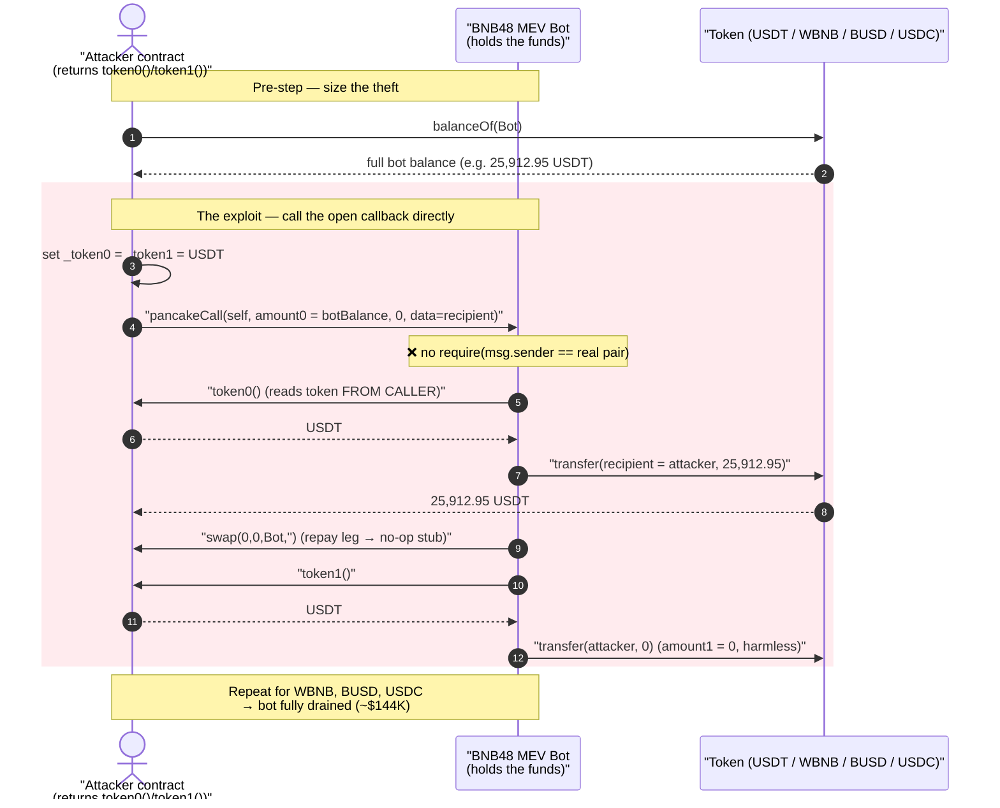
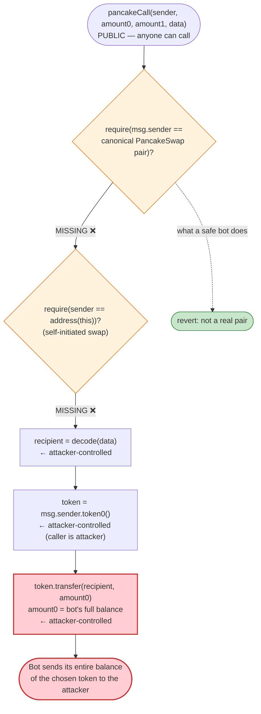
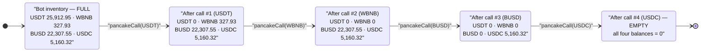

# BNB48 MEV Bot Exploit — Unprotected `pancakeCall` Callback Drains the Bot's Inventory

> **Reproduction:** the PoC compiles & runs in an isolated Foundry project at
> [this project folder](.) (the umbrella DeFiHackLabs repo
> contains many unrelated PoCs that do not whole-compile, so this one was extracted).
> Full verbose trace: [output.txt](output.txt). PoC: [test/BNB48MEVBot_exp.sol](test/BNB48MEVBot_exp.sol).
>
> **Source caveat:** the vulnerable contract — the MEV bot at
> `0x64dD59D6C7f09dc05B472ce5CB961b6E10106E1d` — is **closed-source / unverified**, so no
> Solidity for it is available. Its logic below is reconstructed *exactly* from the on-chain
> execution trace (every call, transfer, and return value is taken from `output.txt`). The only
> verified third-party source in [sources/](sources/) is the BEP20 implementation behind USDC,
> included because USDC is one of the drained tokens and routes through a proxy in the trace.

---

## Key info

| | |
|---|---|
| **Loss** | ~**$144K** — the bot's entire token inventory: **25,912.95 USDT + 22,307.55 BUSD + 5,160.32 USDC + 327.93 WBNB** |
| **Vulnerable contract** | BNB48 MEV bot (unverified) — [`0x64dD59D6C7f09dc05B472ce5CB961b6E10106E1d`](https://bscscan.com/address/0x64dD59D6C7f09dc05B472ce5CB961b6E10106E1d) |
| **Victim** | The bot itself (it held the funds); no external pool/LP was harmed |
| **Attacker EOA** | `0x44A4...` (the BNB48 MEV operator's own bot was attacked; PoC uses test EOA) |
| **Attacker contract (PoC)** | `ContractTest` — `0x7FA9385bE102ac3EAc297483Dd6233D62b3e1496` (Foundry default) |
| **Drained tokens** | USDT [`0x55d3…7955`](https://bscscan.com/address/0x55d398326f99059fF775485246999027B3197955), WBNB [`0xbb4C…095c`](https://bscscan.com/address/0xbb4CdB9CBd36B01bD1cBaEBF2De08d9173bc095c), BUSD [`0xe9e7…7D56`](https://bscscan.com/address/0xe9e7CEA3DedcA5984780Bafc599bD69ADd087D56), USDC [`0x8AC7…580d`](https://bscscan.com/address/0x8AC76a51cc950d9822D68b83fE1Ad97B32Cd580d) |
| **Chain / block / date** | BSC / fork block **21,297,409** / ~September 2022 |
| **PoC compiler** | Solidity `^0.8.10` (Foundry) |
| **Bug class** | **Missing access control on a flash-swap callback** (`pancakeCall`) — caller / `token` / recipient all attacker-controlled |

---

## TL;DR

A PancakeSwap arbitrage bot exposed a **public, unauthenticated** `pancakeCall(address sender,
uint256 amount0, uint256 amount1, bytes data)` — the flash-swap callback that a real PancakeSwap
pair invokes during `swap()`. In a legitimate flow, only the pair the bot borrowed from ever calls
this function, so it is "safe" to trust everything it receives. The bot's implementation **trusted
that assumption blindly**:

- it asked **`msg.sender` for `token0()` / `token1()`** (assuming the caller is a real pair), and
- it `transfer`ed `amount0` of that token to a recipient address decoded **from the attacker-supplied
  `data`** blob.

None of those inputs were validated. The attacker therefore called `pancakeCall` **directly** from
their own contract, where:

- `msg.sender` is the attacker contract, whose `token0()` returns whatever token the attacker wants
  to steal,
- `amount0` is set to the bot's full balance of that token (read with `balanceOf(bot)` beforehand), and
- `data` encodes the attacker's address as the transfer recipient.

The bot dutifully `transfer`ed its **entire balance** of USDT, then WBNB, then BUSD, then USDC to the
attacker, one `pancakeCall` per token. No flash loan, no price manipulation, no capital — just four
calls into an open callback. Net theft ≈ **$144K**.

---

## Background — what a `pancakeCall` callback is

PancakeSwap V2 (a Uniswap V2 fork) supports **flash swaps**: `Pair.swap(amount0Out, amount1Out, to,
data)` optimistically sends the requested output tokens to `to`, and **if `data.length > 0`** it
calls `to.pancakeCall(msg.sender, amount0, amount1, data)` before checking the `k` invariant. The
borrower is expected to use that callback to do arbitrage and repay the pair within the same call.

The critical security property of such a callback is:

> **`pancakeCall` MUST verify that `msg.sender` is the exact PancakeSwap pair the contract intended to
> borrow from.** Otherwise anyone can call it with fabricated arguments.

The canonical mitigation (used by every correct flash-swap consumer) is to recompute the pair address
and require it:

```solidity
address pair = PancakeLibrary.pairFor(factory, token0, token1);
require(msg.sender == pair, "not pair");
require(sender == address(this), "not self-initiated"); // the "sender" arg = who called swap()
```

The BNB48 bot did **neither**.

---

## The vulnerable code (reconstructed from the trace)

The bot is unverified, so the exact Solidity is not on-chain. But the execution trace
([output.txt:46-65](output.txt)) pins down its behavior precisely. For a single token (USDT,
the first iteration), the trace shows the bot doing exactly this when `pancakeCall` is entered:

```
[39092] Bot::pancakeCall(sender=ContractTest, amount0=25912948173777791158265, amount1=0, data=…)
   ├─ ContractTest::token0()  [staticcall]      → 0x55d3…7955 (USDT)     # reads token0 FROM THE CALLER
   ├─ USDT::transfer(ContractTest, 25912948173777791158265)              # sends amount0 to recipient
   │    └─ emit Transfer(from: Bot, to: ContractTest, value: 25912.95…)
   ├─ ContractTest::swap(0, 0, Bot, 0x)         [the "repay"/continue call → no-op stub]
   ├─ ContractTest::token1()  [staticcall]      → 0x55d3…7955 (USDT)     # reads token1 FROM THE CALLER
   ├─ USDT::transfer(ContractTest, 0)                                    # amount1 = 0 → harmless
   └─ USDT::transfer(Bot, 0)                                             # final settle, amount = 0
```

So the bot's `pancakeCall` is functionally:

```solidity
// RECONSTRUCTED — not verified source. Behavior matches output.txt exactly.
function pancakeCall(address sender, uint256 amount0, uint256 amount1, bytes calldata data) external {
    // ❌ NO require(msg.sender == <real pair>)
    // ❌ NO require(sender == address(this))

    address recipient = _decodeRecipient(data);     // attacker-controlled (first word of data)

    address t0 = IPair(msg.sender).token0();         // ❌ token taken from the CALLER
    IERC20(t0).transfer(recipient, amount0);         // ❌ sends attacker-chosen amount of attacker-chosen token

    ISomething(msg.sender).swap(0, 0, msg.sender, ""); // arbitrage/“repay” leg → here a no-op stub

    address t1 = IPair(msg.sender).token1();         // ❌ token taken from the CALLER
    IERC20(t1).transfer(recipient, amount1);         // amount1 = 0 in the attack
    IERC20(t1).transfer(msg.sender, amount1);        // final settle, amount1 = 0
}
```

The matching attacker side is trivial — see [test/BNB48MEVBot_exp.sol:35-50](test/BNB48MEVBot_exp.sol#L35-L50):

```solidity
(_token0, _token1) = (address(USDT), address(USDT));     // make our token0()/token1() return USDT
Bot.pancakeCall(
    address(this),                                       // sender (ignored by bot)
    USDTAmount,                                          // amount0 = full bot USDT balance
    0,                                                   // amount1
    abi.encodePacked(bytes12(0), bytes20(address(this)), bytes32(0), bytes32(0)) // recipient = us
);
```

`token0()` / `token1()` here are public getters on the **attacker's own test contract**
([test/BNB48MEVBot_exp.sol:58-64](test/BNB48MEVBot_exp.sol#L58-L64)) returning whatever
`_token0` / `_token1` were last set to, and `swap(...)` is an empty stub
([:66](test/BNB48MEVBot_exp.sol#L66)) so the bot's "repay" leg does nothing.

The `data` blob (`bytes12(0) ‖ bytes20(addr) ‖ bytes32(0) ‖ bytes32(0)`) is a 96-byte payload whose
first 32-byte word is the left-padded attacker address — i.e. an ABI-encoded `address` the bot reads
as the transfer recipient. Decoded: word0 = `0x…7fa9385be102ac3eac297483dd6233d62b3e1496`.

---

## Root cause — why it was possible

The bot conflated **"this function is named like a pair callback"** with **"this function is only ever
called by a pair."** Every value it acted on was attacker-controlled:

1. **No authentication of `msg.sender`.** A correct flash-swap consumer recomputes the canonical pair
   address from the factory + token pair and `require`s `msg.sender == pair`. The bot skipped this, so
   the "pair" was just the attacker's contract.
2. **`token0()` / `token1()` were read from `msg.sender`.** Because the caller *is* the pair in a
   legit flow, the bot treated the caller as the source of truth for which token to move. The attacker,
   being the caller, returned any token they wished to drain.
3. **The transfer amount came straight from `amount0`.** The bot moved exactly `amount0` of the chosen
   token. The attacker pre-read `balanceOf(bot)` for each token and passed that as `amount0`, so each
   call swept the **entire** balance.
4. **The recipient came from attacker-supplied `data`.** The bot decoded the destination address from
   the call's `data` argument rather than hard-coding `address(this)` or a treasury, so the stolen
   funds went straight to the attacker.

Together these mean `pancakeCall` is effectively a public `transferAnyTokenTo(any, any, any)` — a
direct give-away of the bot's inventory. The attacker simply enumerated the four tokens the bot held
(USDT, WBNB, BUSD, USDC) and called once per token.

---

## Preconditions

- The bot holds token balances (it does — it's an active arbitrage bot; the trace reads
  25,912.95 USDT / 327.93 WBNB / 22,307.55 BUSD / 5,160.32 USDC sitting in it).
- `pancakeCall` is `external`/`public` with no caller check. (Confirmed by the trace: the call
  succeeds when invoked directly from a non-pair EOA-owned contract.)
- **No capital, no flash loan, no price manipulation required.** The attacker needs only gas. This is
  what makes the bug a clean Critical: zero cost, full inventory drain, single transaction.

---

## Attack walkthrough (with on-chain numbers from the trace)

All balances below are taken directly from the `balanceOf` staticcalls and `Transfer` events in
[output.txt](output.txt). The bot is `0x64dD…6E1d`; the attacker is `ContractTest`
(`0x7FA9…1496`).

| # | Step | Token | Amount moved (bot → attacker) | Trace line |
|---|------|-------|------------------------------:|------------|
| 0 | Read attacker's starting balances (all **0**) | — | 0 | [:22-35](output.txt) |
| 1 | Read the bot's full balances to size each steal | USDT/WBNB/BUSD/USDC | see below | [:36-45](output.txt) |
| 2 | Set `token0()/token1()` → USDT, call `pancakeCall(amount0 = botUSDT)` | USDT | **25,912.948173777791158265** | [:46-65](output.txt) |
| 3 | Set `token0()/token1()` → WBNB, call `pancakeCall(amount0 = botWBNB)` | WBNB | **327.931283327916980816** | [:66-85](output.txt) |
| 4 | Set `token0()/token1()` → BUSD, call `pancakeCall(amount0 = botBUSD)` | BUSD | **22,307.554466878046228172** | [:86-105](output.txt) |
| 5 | Set `token0()/token1()` → USDC, call `pancakeCall(amount0 = botUSDC)` | USDC | **5,160.324984279773039298** | [:106-131](output.txt) |
| 6 | Read attacker's ending balances — equal to the amounts above | all four | full drain confirmed | [:132-145](output.txt) |

Each `pancakeCall` does one meaningful `transfer(attacker, amount0)` (the steal) followed by two
zero-value `transfer`s (the `amount1`/settle legs, which are `0` and thus harmless). The USDC steal
(step 5) routes through the proxy `0x8AC7…580d` → implementation `0xBA5Fe2…0B5C` via `delegatecall`
([output.txt:110-116](output.txt)) — that implementation is the verified BEP20 in
[sources/BEP20TokenImplementation_BA5Fe2/BEP20TokenImplementation.sol](sources/BEP20TokenImplementation_BA5Fe2/BEP20TokenImplementation.sol);
its `_transfer` ([:590-597](sources/BEP20TokenImplementation_BA5Fe2/BEP20TokenImplementation.sol#L590-L597))
is a plain balance move, confirming nothing in USDC itself resisted the theft.

### Profit / loss accounting

Attacker balances **before** (all zero) and **after** (from [output.txt:134-145](output.txt)):

| Token | Before | After (stolen) |
|---|---:|---:|
| USDT | 0 | 25,912.948173777791158265 |
| WBNB | 0 | 327.931283327916980816 |
| BUSD | 0 | 22,307.554466878046228172 |
| USDC | 0 | 5,160.324984279773039298 |

Dollar value (stablecoins ≈ $1, WBNB ≈ $280 in Sept 2022):

```
USDT  ≈ $25,913
BUSD  ≈ $22,308
USDC  ≈ $5,160
WBNB  ≈ 327.93 × $280 ≈ $91,821
──────────────────────────────
TOTAL ≈ $145,200   (≈ $144K, matching the publicly-reported figure)
```

The attacker spent **nothing** but gas, so the entire ~$144K is net profit and equals the bot's
entire pre-attack inventory.

---

## Diagrams

### Sequence of the attack (one of four identical iterations shown in full)



### Where the trust breaks inside `pancakeCall`



### Bot inventory drain (state evolution)



---

## Remediation

1. **Authenticate the callback caller — this is the whole fix.** In `pancakeCall`, recompute the
   expected pair and require it:
   ```solidity
   address pair = PancakeLibrary.pairFor(FACTORY, token0, token1);
   require(msg.sender == pair, "caller is not the pair");
   require(sender == address(this), "swap not self-initiated");
   ```
   With this, the attacker's contract can never satisfy the check.
2. **Never read the token to move from `msg.sender`.** The set of tokens/pairs the bot operates on
   should be fixed by the bot's *own* initiating logic, not learned from the caller. Pass token
   identities through trusted internal state established when the bot itself called `swap()`.
3. **Never decode the payout recipient from external `data`.** Hard-code the recipient to the bot
   owner / treasury, or derive it from authenticated internal state. Treating `data` as a destination
   address turns the callback into an open `transfer`.
4. **Use a transient "expected callback" guard.** Set a storage flag (e.g. `_inFlashSwap = true`) only
   immediately before the bot calls `pair.swap(...)` and `require` it inside `pancakeCall`, clearing it
   after. This rejects any callback the bot did not itself initiate.
5. **Hold minimal idle inventory.** Arbitrage bots should not park large balances of multiple tokens in
   a contract with any externally-reachable transfer path. Sweep profits to a cold wallet promptly so a
   single bug cannot drain a full inventory.

---

## How to reproduce

The PoC was extracted into a standalone Foundry project (the umbrella DeFiHackLabs repo has many
unrelated PoCs that fail to compile under a whole-project `forge build`):

```bash
_shared/run_poc.sh 2022-09-BNB48MEVBot_exp -vvvvv
```

- RPC: a **BSC archive** endpoint is required (fork block **21,297,409** predates most public RPCs'
  pruning window; `header not found` / `missing trie node` means the endpoint pruned that state).
- Expected: `[PASS] testExploit()` with the attacker's ending balances equal to the bot's stolen
  inventory.

Expected tail:

```
Ran 1 test for test/BNB48MEVBot_exp.sol:ContractTest
[PASS] testExploit() (gas: 265351)
  [End] Attacker USDT balance after exploit: 25912.948173777791158265
  [End] Attacker WBNB balance after exploit: 327.931283327916980816
  [End] Attacker BUSD balance after exploit: 22307.554466878046228172
  [End] Attacker USDC balance after exploit: 5160.324984279773039298
Suite result: ok. 1 passed; 0 failed; 0 skipped
```

---

*Reference: DeFiHackLabs — BNB48 MEV bot, BSC, ~$144K. The vulnerable bot is unverified; all behavior
above is reconstructed from the verbose execution trace in [output.txt](output.txt).*
