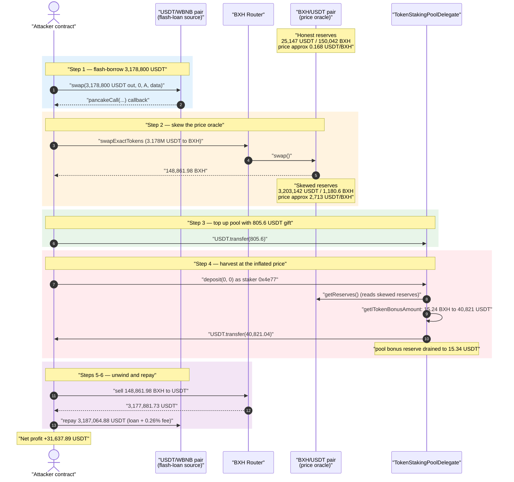
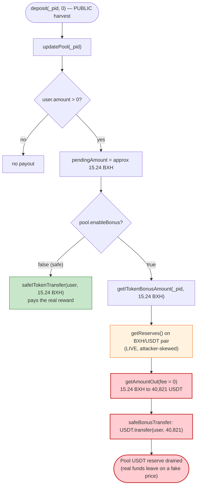
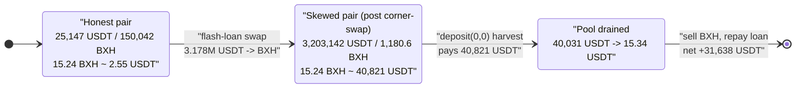

# BXH Exploit — Spot-Price Bonus Payout Manipulated via Flash-Loan

> **One-line summary:** A staking pool values its reward "bonus" payout in USDT using the
> *instantaneous* reserves of the BXH/USDT AMM pair, so a flash-loan that skews that pair lets an
> attacker convert a ~15 BXH reward into ~40,821 USDT (a ~16,000× inflation), draining the pool's
> entire bonus reserve.

> **Reproduction:** the PoC compiles & runs in an isolated Foundry project at
> [this project folder](.) (the umbrella DeFiHackLabs repo contains many unrelated PoCs that do not
> whole-compile, so this one was extracted). Full verbose trace:
> [output.txt](output.txt). Verified vulnerable source:
> [TokenStakingPoolDelegate.sol](sources/TokenStakingPoolDelegate_27539B/TokenStakingPoolDelegate.sol).

---

## Key info

| | |
|---|---|
| **Loss** | **~31,638 USDT** net attacker profit (≈40,015 USDT of bonus reserve drained from the staking pool; header comment cites ~40,085 USDT gross) |
| **Vulnerable contract** | `TokenStakingPoolDelegate` — [`0x27539B1DEe647b38e1B987c41C5336b1A8DcE663`](https://bscscan.com/address/0x27539B1DEe647b38e1B987c41C5336b1A8DcE663#code) |
| **Victim asset** | USDT bonus reserve held by the staking pool ([`0x55d398...7955`](https://bscscan.com/address/0x55d398326f99059fF775485246999027B3197955)) |
| **Manipulated pool** | BXH/USDT PancakeSwap-style pair — `0x919964B7f12A742E3D33176D7aF9094EA4152e6f` |
| **iToken (reward token)** | `BXH` — [`0x6D1B7b59e3fab85B7d3a3d86e505Dd8e349EA7F3`](https://bscscan.com/address/0x6D1B7b59e3fab85B7d3a3d86e505Dd8e349EA7F3) |
| **Flash-loan source** | USDT/WBNB pair `0x16b9a82891338f9bA80E2D6970FddA79D1eb0daE` (PancakeSwap `swap()` + `pancakeCall`) |
| **Attacker EOA** | `0x81C63d821b7CdF70C61009A81FeF8Db5949AC0C9` |
| **Attacker / staker contract** | `0x4e77DF7b9cDcECeC4115e59546F3EAcBA095a89f` (the pre-existing depositor whose tiny reward is inflated) |
| **Attack tx** | `0xa13c8c7a0c97093dba3096c88044273c29cebeee109e23622cd412dcca8f50f4` |
| **Chain / fork block / date** | BSC / 21,727,289 / Sept 2022 |
| **Compiler** | Staking pool `v0.8.7` (optimizer 1 run); BXH token `v0.6.12` |
| **Bug class** | Spot-price (AMM reserve) oracle manipulation → reward over-valuation |

---

## TL;DR

`TokenStakingPoolDelegate` is a MasterChef-style staking pool. When a pool has `enableBonus == true`,
it pays accrued rewards not in the native reward token (`iToken` = BXH) but in a **bonus token**
(here USDT), converting the BXH reward amount into a USDT amount using the *current* reserves of a
configured `swapPairAddress` (the BXH/USDT pair). That conversion happens through
[`getITokenBonusAmount` → `getAmountOut`](sources/TokenStakingPoolDelegate_27539B/TokenStakingPoolDelegate.sol#L1602-L1627),
which reads `getReserves()` **live** and applies **zero fee** (`feeFactor = 0`).

The attacker:

1. **Flash-borrows** 3,178,800 USDT from the USDT/WBNB pair (PancakeSwap `swap()` with a
   `pancakeCall` callback — borrow now, repay at end of the same call).
2. **Skews the BXH/USDT pair** by swapping ~3.178M USDT → BXH on the BXH router. This drains BXH out
   of the pair, leaving the pair holding **3,203,142 USDT / 1,180.6 BXH** instead of the honest
   **25,147 USDT / 150,042 BXH** — so the pool now prices each BXH at ~2,714 USDT instead of ~0.168 USDT.
3. **Tops up** the staking contract with a small 805.6 USDT "gift" so it has enough USDT on hand to
   pay the inflated bonus.
4. **Calls `deposit(0, 0)`** as the pre-existing staker `0x4e77…`. A deposit of amount `0` is a pure
   reward-harvest. The staker's *real* pending reward is only **~15.24 BXH**, but
   `getITokenBonusAmount` values those 15.24 BXH at the manipulated price → **40,821 USDT**, which the
   contract transfers out. That is essentially the pool's entire USDT bonus reserve.
5. **Unwinds**: sells the 148,862 BXH it bought in step 2 back to USDT (recovering most of the corner
   capital), repays the flash loan + 0.26% fee, and walks away with **31,637.89 USDT**.

The single broken assumption: **a manipulable spot reserve was used as a price oracle for paying out
real funds.**

---

## Background — what `TokenStakingPoolDelegate` does

The contract ([source](sources/TokenStakingPoolDelegate_27539B/TokenStakingPoolDelegate.sol)) is a
standard MasterChef-style farm with a "bonus token" twist:

- **Pools** (`PoolInfo`, [:1441-1458](sources/TokenStakingPoolDelegate_27539B/TokenStakingPoolDelegate.sol#L1441-L1458))
  accrue `accITokenPerShare` per block. A user's pending reward is denominated in `iToken` (BXH).
- **Bonus payout** — if `pool.enableBonus == true`, instead of paying the pending BXH directly, the
  contract converts the pending BXH into an equivalent amount of `pool.bonusToken` (here USDT) and pays
  that out. The conversion uses the configured `pool.swapPairAddress`
  (the BXH/USDT pair) as a price source.
- **Harvest by zero-deposit** — `deposit(_pid, 0)` and `withdraw(_pid, 0)` are the canonical
  MasterChef harvest pattern: depositing `0` skips the LP transfer and just pays out accrued rewards
  ([:1953-1992](sources/TokenStakingPoolDelegate_27539B/TokenStakingPoolDelegate.sol#L1953-L1992)).

On-chain facts at the fork block (from the trace):

| Fact | Value |
|---|---|
| BXH/USDT pair reserves (honest) | **25,147.47 USDT / 150,042.58 BXH** ([output.txt:68](output.txt)) |
| Staking pool USDT (bonus) reserve | **≈ 40,031 USDT** ([output.txt:102](output.txt)) |
| Pool 0 `enableBonus` | `true`, `bonusToken = USDT`, `swapPairAddress = BXH/USDT pair` |
| Staker `0x4e77…` real pending reward | **≈ 15.24 BXH** (≈ 2.55 USDT at honest price) |

That mismatch — a ~2.55-USDT reward against a ~40,000-USDT reserve, priced by a manipulable pair — is
the whole game.

---

## The vulnerable code

### 1. Bonus value is read from live AMM reserves with zero fee

```solidity
function getITokenBonusAmount( uint256 _pid, uint256 _amountInToken ) public view returns (uint256){
    PoolInfo storage pool = poolInfo[_pid];

    (uint112 _reserve0, uint112 _reserve1, ) = IUniswapV2Pair(pool.swapPairAddress).getReserves(); // ⚠️ spot reserves
    uint256 amountTokenOut = 0;
    uint256 _fee = 0;                                                       // ⚠️ no swap fee applied
    if(IUniswapV2Pair(pool.swapPairAddress).token0() == address(iToken)){
        amountTokenOut = getAmountOut( _amountInToken , _reserve0, _reserve1, _fee);
    } else {
        amountTokenOut = getAmountOut( _amountInToken , _reserve1, _reserve0, _fee);
    }
    return amountTokenOut;
}
```
[TokenStakingPoolDelegate.sol:1602-1614](sources/TokenStakingPoolDelegate_27539B/TokenStakingPoolDelegate.sol#L1602-L1614)

```solidity
function getAmountOut(uint amountIn, uint reserveIn, uint reserveOut, uint256 feeFactor) private pure returns (uint ) {
    ...
    uint256 feeBase = 10000;
    uint amountInWithFee = amountIn.mul(feeBase.sub(feeFactor));           // feeFactor = 0 → no fee
    uint numerator = amountInWithFee.mul(reserveOut);
    uint denominator = reserveIn.mul(feeBase).add(amountInWithFee);
    uint amountOut = numerator / denominator;
    return amountOut;
}
```
[TokenStakingPoolDelegate.sol:1616-1627](sources/TokenStakingPoolDelegate_27539B/TokenStakingPoolDelegate.sol#L1616-L1627)

### 2. The harvest path pays the bonus out, in real USDT

```solidity
function deposit(uint256 _pid, uint256 _amount) public notPause {
    PoolInfo storage pool = poolInfo[_pid];
    require( _amount == 0 || (_amount >= pool.depositMin && _amount <= pool.depositMax) , "deposit amount need in range");
    depositIToken(_pid, _amount, msg.sender);   // ← amount 0 ⇒ pure reward harvest
}

function depositIToken(uint256 _pid, uint256 _amount, address _user) private {
    PoolInfo storage pool = poolInfo[_pid];
    UserInfo storage user = userInfo[_pid][_user];
    updatePool(_pid);
    if (user.amount > 0) {
        uint256 pendingAmount = user.amount.mul(pool.accITokenPerShare).div(1e12).sub(user.rewardDebt); // ≈ 15.24 BXH
        if (pendingAmount > 0) {
            if( pool.enableBonus == false ){
                safeITokenTransfer(_user, pendingAmount);
            } else {
                pendingAmount = getITokenBonusAmount(_pid, pendingAmount);  // ⚠️ 15.24 BXH → 40,821 USDT at manipulated price
                safeBonusTransfer(_pid, _user, pendingAmount);              // ⚠️ pays 40,821 USDT out
            }
            ...
        }
    }
    ...
}
```
[TokenStakingPoolDelegate.sol:1953-1992](sources/TokenStakingPoolDelegate_27539B/TokenStakingPoolDelegate.sol#L1953-L1992),
`safeBonusTransfer` at
[:2119-2123](sources/TokenStakingPoolDelegate_27539B/TokenStakingPoolDelegate.sol#L2119-L2123).

`deposit()` is permissionless and the harvest path runs for `msg.sender`'s own stake — so the attacker
simply needed *any* pre-existing stake in pool 0 (the `0x4e77…` contract held one). In the PoC this is
reached via `vm.startPrank(0x4e77…); deposit(0, 0)` ([test/BXH_exp.sol:89-90](test/BXH_exp.sol#L89-L90)).

---

## Root cause

The bonus payout treats the **BXH/USDT pair's current reserve ratio as a trustworthy price oracle**.
Three compounding decisions make this fatal:

1. **Spot reserves, not a TWAP/oracle.** `getITokenBonusAmount` reads `getReserves()` at the exact
   moment of the call ([:1605](sources/TokenStakingPoolDelegate_27539B/TokenStakingPoolDelegate.sol#L1605)).
   Anyone who can move those reserves within a transaction controls the payout price. A flash loan moves
   them for free for one transaction.
2. **The "convert reward → bonus token" valuation pays out real funds.** The contract literally
   transfers `getITokenBonusAmount(...)` units of USDT
   ([safeBonusTransfer](sources/TokenStakingPoolDelegate_27539B/TokenStakingPoolDelegate.sol#L2119-L2123)).
   A wrong price is therefore an immediate, withdrawable loss — not just a cosmetic mispricing.
3. **Fee set to zero in the conversion.** `feeFactor = 0`
   ([:1607](sources/TokenStakingPoolDelegate_27539B/TokenStakingPoolDelegate.sol#L1607)) makes the
   internal price strictly more generous than an actual swap, removing the small friction that would
   otherwise slightly disfavor the attacker.

Because BXH is `token1` of the pair (USDT is `token0`), the `else` branch values BXH using
`getAmountOut(pendingBXH, reserveBXH, reserveUSDT, 0)`. After the attacker emptied BXH out of the pair,
`reserveBXH` is tiny and `reserveUSDT` is huge, so even a few BXH map to tens of thousands of USDT.

---

## Preconditions

- **A bonus-enabled pool whose `swapPairAddress` is a low-liquidity, externally manipulable pair.** Pool
  0 used the BXH/USDT pair, which held only ~25k USDT / 150k BXH — cheap to skew.
- **A pre-existing stake with nonzero pending reward** so the `if (user.amount > 0)` /
  `if (pendingAmount > 0)` branches fire. The attacker controlled `0x4e77…`, an existing staker. (Even a
  small genuine stake suffices — the *price*, not the reward size, is what's exploited.)
- **The staking contract holds enough bonus token (USDT) to satisfy the inflated payout.** The pool held
  ~40k USDT; the attacker topped it up by 805.6 USDT so the full 40,821 USDT transfer would succeed.
- **Working capital to skew the pair**, supplied entirely by a flash loan (3,178,800 USDT borrowed from
  the USDT/WBNB pair and repaid in the same transaction) — so the attack is **capital-free** beyond gas
  and the ~8,265 USDT flash-loan fee.

---

## Attack walkthrough (with on-chain numbers from the trace)

The BXH/USDT pair has `token0 = USDT`, `token1 = BXH`, so `reserve0 = USDT`, `reserve1 = BXH`. All
figures are taken directly from the `Sync`/`getReserves`/`Transfer` lines in [output.txt](output.txt).

| # | Step | Effect on BXH/USDT pair | Attacker / pool USDT |
|---|------|---|---|
| 0 | **Initial** ([output.txt:68](output.txt)) | 25,147.47 USDT / 150,042.58 BXH (price ≈ 0.168 USDT/BXH) | pool bonus reserve ≈ 40,031 USDT |
| 1 | **Flash-borrow** 3,178,800 USDT from USDT/WBNB pair via `swap()`→`pancakeCall` ([output.txt:39-46](output.txt)) | — | attacker holds 3,178,800 USDT |
| 2 | **Corner-swap** 3,177,994.39 USDT → 148,861.98 BXH on BXH router ([output.txt:56-88](output.txt)) | **3,203,141.85 USDT / 1,180.60 BXH** (price ≈ 2,713 USDT/BXH) | attacker holds 148,861.98 BXH |
| 3 | **Gift** 805.61 USDT to the staking contract ([output.txt:95](output.txt)) | — | pool reserve → 40,836.38 USDT |
| 4 | **`deposit(0,0)`** pranked as `0x4e77…` ([output.txt:106-126](output.txt)) | reserves read live (skewed) | 15.24 BXH reward valued at **40,821.04 USDT**, transferred to `0x4e77…` → forwarded to attacker; pool left with **15.34 USDT** |
| 5 | **Sell** 148,861.98 BXH → 3,177,881.73 USDT on BXH router ([output.txt:150-180](output.txt)) | reserves back to 25,260 USDT / 150,042 BXH | attacker USDT → 3,218,702.77 |
| 6 | **Repay** flash loan 3,178,800 USDT + 0.26% fee = 3,187,064.88 USDT ([output.txt:187-199](output.txt)) | — | **attacker keeps 31,637.89 USDT** ([output.txt:204](output.txt)) |

### The price-inflation math

`getITokenBonusAmount` (else branch, fee = 0) computes
`out_USDT = pendingBXH · reserveUSDT / (reserveBXH + pendingBXH)`.

| Quantity | Honest reserves | Manipulated reserves |
|---|---|---|
| `reserveUSDT` | 25,147.47 | 3,203,141.85 |
| `reserveBXH` | 150,042.58 | 1,180.60 |
| `pendingBXH` | 15.24 | 15.24 |
| **payout (USDT)** | **≈ 2.55** | **≈ 40,821.04** |

Inflation factor ≈ **15,983×**. The reward itself never changed; only the price the pool used to value
it did. (Solving the manipulated-reserve formula for the observed 40,821.04 USDT payout yields
`pendingBXH ≈ 15.24` BXH, confirming the trace.)

### Profit / loss accounting (USDT)

| Item | Amount |
|---|---:|
| Flash loan borrowed | 3,178,800.00 |
| Corner-swap (USDT → BXH) | −3,177,994.39 |
| Gift to staking pool | −805.61 |
| **Bonus payout drained from pool** | **+40,821.04** |
| BXH sold back (BXH → USDT) | +3,177,881.73 |
| Flash-loan repayment (incl. 0.26% fee) | −3,187,064.88 |
| **Net attacker profit** | **+31,637.89** |

The pool's USDT bonus reserve went from ~40,031 USDT to **15.34 USDT** — effectively fully drained. The
~9,000 USDT gap between the 40,015 drained and the 31,638 net profit is consumed by the flash-loan fee
(~8,265 USDT) and the 805.6 USDT gift.

---

## Diagrams

### Sequence of the attack



### Bonus-valuation flaw (control flow)



### Why the skew explodes the payout (price state)



---

## Why each magic number

- **3,178,800 USDT flash loan:** sized to dump enough USDT into the BXH/USDT pair to collapse its BXH
  reserve from 150,042 → ~1,180 BXH, i.e. to push the per-BXH price up by ~16,000×. The bought BXH is
  not discarded — it's sold back in step 5 to recover almost all of this capital.
- **805.61 USDT gift:** the pool held only ~40,031 USDT but the inflated payout was 40,821 USDT; the gift
  tops the pool's USDT balance to 40,836 so `safeBonusTransfer` does not revert on insufficient balance.
  It is a tiny, recoverable cost folded into the profit math.
- **`deposit(0, 0)`:** depositing amount `0` is the MasterChef harvest idiom — it skips the LP
  `safeTransferFrom` and only triggers the reward (bonus) payout, which is the exploited path.
- **0.26% flash-loan fee (`amount0 * 26 / 10000`):** the BXH-router pair charges a 0.26% fee, repaid as
  part of `amount0 + swapfee` to the USDT/WBNB pair.

---

## Remediation

1. **Do not use spot AMM reserves as a price oracle for paying out funds.** Replace
   `getITokenBonusAmount`'s `getReserves()` read with a manipulation-resistant source: a Uniswap-V2 TWAP
   (`price0CumulativeLast`/`price1CumulativeLast` sampled over time), a Chainlink feed, or an
   admin-set price. Any value that can be moved within a single transaction must never gate a transfer.
2. **Separate "reward accounting" from "reward valuation."** If the pool intends to pay rewards in a
   different token, fix the exchange rate at accrual time (or use an oracle TWAP), not at the moment of
   the harvest call where an attacker controls the surrounding transaction.
3. **Apply the real swap fee and slippage limits.** The `feeFactor = 0` makes the internal valuation
   strictly more generous than the market; at minimum use the pair's actual fee, and bound payouts to a
   sane fraction of the pool's bonus reserve per call.
4. **Add reentrancy/flash-loan-awareness guards on harvest.** While the core flaw is the oracle, gating
   harvest behind a block-delayed or commit-style mechanism (and a `nonReentrant` guard, which `deposit`
   currently lacks) raises the cost of single-transaction price manipulation.
5. **Cap single-call payouts.** A harvest that pays out tens of thousands of USDT for a ~2.5-USDT reward
   should be impossible: enforce `payout <= k * recentPendingValue` so a 16,000× discrepancy reverts.

---

## How to reproduce

The PoC was extracted into a standalone Foundry project (the umbrella DeFiHackLabs repo has many
unrelated PoCs that fail to whole-compile under `forge test`):

```bash
_shared/run_poc.sh 2022-09-BXH_exp -vvvvv
```

- RPC: a **BSC archive** endpoint is required (fork block 21,727,289). `foundry.toml` uses
  `https://bsc-mainnet.public.blastapi.io`, which serves historical state at that block; most public BSC
  RPCs prune it and fail with `header not found` / `missing trie node`.
- Result: `[PASS] testExploit()`.

Expected tail:

```
Ran 1 test for test/BXH_exp.sol:Attacker
[PASS] testExploit() (gas: 418702)
Logs:
  [Start] BXH-USDT  Pair USDT Balance is :: 25147.468936549224419158
  [Flashloan] received
  [Flashloan] now Hacker BXH balance is :: 148861.981685343581363723
  [Flashloan] now bxh contract USDT balance is :: 40836.379864906450436248
  [Flashloan] Hacker USDT Balance is :: 40821.040948267171511016
  [Flashloan] bxh contract USDT Balance is :: 15.338916639278925232
  [Flashloan] Hacker USDT Balance is :: 3218702.774825529910277592
  [Over] Hacker USDT Balance is :: 31637.894825529910277592

Suite result: ok. 1 passed; 0 failed; 0 skipped
```

The final `[Over]` balance of **31,637.89 USDT** is the net profit (the staking pool's USDT bonus reserve
was drained from ~40,031 USDT down to 15.34 USDT).

---

*Reference: BXH was exploited multiple times in 2021–2022; this PoC reconstructs the September 2022
bonus-price-manipulation drain of the `TokenStakingPoolDelegate` pool. See SlowMist Hacked —
https://hacked.slowmist.io/.*
