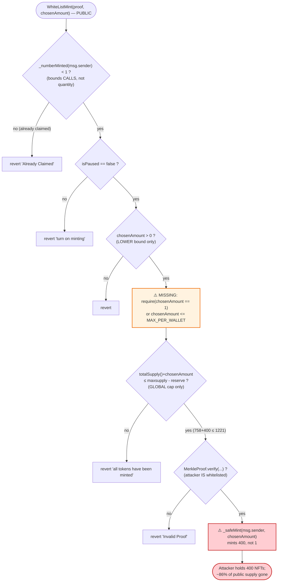
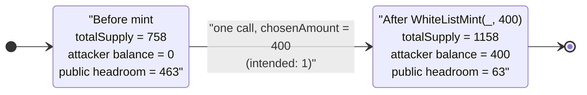

# Bad Guys by RPF Exploit — Unbounded `chosenAmount` in `WhiteListMint()` (Per-Wallet Mint Limit Bypass)

> **Vulnerability classes:** vuln/logic/missing-check · vuln/input-validation/boundary

> **Reproduction:** the PoC compiles & runs in an isolated Foundry project at
> [this project folder](.) (the umbrella DeFiHackLabs repo contains many
> unrelated PoCs that do not whole-compile, so this one was extracted).
> Full verbose trace: [output.txt](output.txt).
> Verified vulnerable source: [Bad_Guys_by_RPF.sol](sources/Bad_Guys_by_RPF_B84CBA/Bad_Guys_by_RPF.sol).

---

## Key info

| | |
|---|---|
| **Loss** | ~400 NFTs minted in a single tx by one address that should have been capped at 1 — the entire remaining public supply was siphoned by a single whitelisted wallet, denying the rest of the whitelist and crashing the floor on the secondary market. |
| **Vulnerable contract** | `Bad_Guys_by_RPF` — [`0xB84CBAF116eb90fD445Dd5AeAdfab3e807D2CBaC`](https://etherscan.io/address/0xB84CBAF116eb90fD445Dd5AeAdfab3e807D2CBaC#code) |
| **Victim** | The Bad Guys by RPF collection and its whitelisted minters (every other whitelist member who expected 1 NFT each) |
| **Attacker EOA** | `0xBD8A137E79C90063cd5C0DB3Dbabd5CA2eC7e83e` (a *legitimately* whitelisted address) |
| **Attack tx** | [`0xb613c68b00c532fe9b28a50a91c021d61a98d907d0217ab9b44cd8d6ae441d9f`](https://etherscan.io/tx/0xb613c68b00c532fe9b28a50a91c021d61a98d907d0217ab9b44cd8d6ae441d9f) |
| **Chain / block / date** | Ethereum mainnet / 15,460,094 (PoC forks 15,460,093) / Sept 2022 |
| **Compiler** | Solidity `v0.8.7+commit.e28d00a7`, optimizer **off** (`runs=200` field is unused) — per [`_meta.json`](sources/Bad_Guys_by_RPF_B84CBA/_meta.json) |
| **Bug class** | Business-logic flaw — missing per-mint / per-wallet quantity cap (the `chosenAmount` parameter is fully attacker-controlled and only bounded by the *global* supply limit) |

---

## TL;DR

`WhiteListMint(bytes32[] _merkleProof, uint256 chosenAmount)` is meant to let each whitelisted
address claim **one** NFT. It enforces "one mint per wallet" with `require(_numberMinted(msg.sender) < 1, "Already Claimed")`,
but it then **passes the caller-supplied `chosenAmount` straight into `_safeMint`** with no
per-call or per-wallet quantity cap
([Bad_Guys_by_RPF.sol:1186-1205](sources/Bad_Guys_by_RPF_B84CBA/Bad_Guys_by_RPF.sol#L1186-L1205)).

The only quantity ceiling is the **global** one:
`require(totalSupply() + chosenAmount <= maxsupply - reserve)`. At the fork block the live state was
`maxsupply = 1221`, `reserve = 0`, `totalSupply = 758`, so the headroom was `1221 - 758 = 463` NFTs.

A genuinely whitelisted attacker simply called `WhiteListMint(validProof, 400)` **once**, passed the
"Already Claimed" check (their `numberMinted` was 0), passed the Merkle check (they really were on the
list), and minted **400 NFTs in a single transaction** — token IDs 758 through 1157 — instead of the
intended 1.

The Merkle proof was never the weakness; it verified correctly. The weakness is that "whitelisted"
gates only *whether* you may mint, never *how many* — and `chosenAmount` is the attacker's to choose.

---

## Background — what the contract is

`Bad_Guys_by_RPF` ([source](sources/Bad_Guys_by_RPF_B84CBA/Bad_Guys_by_RPF.sol)) is a standard
`ERC721A`-based PFP NFT collection (the gas-optimized batch-mint ERC-721 from Azuki). It has the
usual owner controls plus a Merkle-tree allowlist mint:

- **`maxsupply`** = 1221, **`reserve`** = 100 by default (carved out for the team via `mintReservedTokens`).
- **`isPaused`** gates whether public minting is open; the owner flips it with `flipPauseMinting()`.
- **`rootHash`** is the Merkle root of the whitelist; `WhiteListMint` verifies `keccak256(msg.sender)`
  against it.
- **`_numberMinted(addr)`** (from `ERC721A`) tracks how many tokens an address has *ever* minted; the
  allowlist mint uses it as a one-shot "already claimed" guard.

The **intended** mint flow is: a whitelisted address calls `WhiteListMint` once, proves membership,
and receives exactly **one** NFT.

The live on-chain parameters at the fork block (queried with `cast call … --block 15460093` against a
BSC-/ETH-archive endpoint):

| Parameter | Value at block 15,460,093 | Note |
|---|---|---|
| `maxsupply` | **1221** | hard cap |
| `reserve` | **0** | owner had already set this to 0 via `setReserve()` (constructor default was 100) |
| `totalSupply` | **758** | `_currentIndex` — 758 already minted before the attack |
| `isPaused` | **true** | minting was still paused at this exact block; it went live one block later (15,460,094). The PoC force-flips it with `prank(owner)` to reproduce at 15,460,093. |

The `reserve = 0` matters: it means the global headroom was `maxsupply - reserve - totalSupply =
1221 - 0 - 758 = 463`, which is what let a single caller request a 400-NFT batch and still pass the
supply check.

---

## The vulnerable code

### The allowlist mint trusts the caller's `chosenAmount`

```solidity
function WhiteListMint(bytes32[] calldata _merkleProof, uint256 chosenAmount)
    public
{
    require(_numberMinted(msg.sender) < 1, "Already Claimed");          // (1) one mint per wallet
    require(isPaused == false, "turn on minting");
    require(
        chosenAmount > 0,
        "Number Of Tokens Can Not Be Less Than Or Equal To 0"
    );                                                                  // (2) only a LOWER bound on chosenAmount
    require(
        totalSupply() + chosenAmount <= maxsupply - reserve,            // (3) only the GLOBAL cap bounds it
        "all tokens have been minted"
    );
    bytes32 leaf = keccak256(abi.encodePacked(msg.sender));
    require(
        MerkleProof.verify(_merkleProof, rootHash, leaf),               // (4) membership check (passes!)
        "Invalid Proof"
    );
    _safeMint(msg.sender, chosenAmount);                                // (5) mints chosenAmount, NOT 1
}
```

[Bad_Guys_by_RPF.sol:1186-1205](sources/Bad_Guys_by_RPF_B84CBA/Bad_Guys_by_RPF.sol#L1186-L1205)

Look at what each `require` actually constrains:

1. **`_numberMinted(msg.sender) < 1`** — bounds the number of *calls* (one batch per wallet), **not**
   the number of NFTs per batch.
2. **`chosenAmount > 0`** — a *lower* bound only. There is no matching `chosenAmount <= 1` (or
   `<= MAX_PER_WALLET`) upper bound.
3. **`totalSupply() + chosenAmount <= maxsupply - reserve`** — the only ceiling, and it is **global**:
   it stops the collection from overminting past 1221, but happily lets *one* address consume the
   entire remaining 463-NFT supply in a single call.
4. **`MerkleProof.verify(...)`** — confirms `msg.sender` is on the list. The attacker *was* on the
   list, so this passes legitimately.
5. **`_safeMint(msg.sender, chosenAmount)`** — mints the full attacker-chosen quantity.

### `_safeMint` faithfully batch-mints whatever it is handed

`ERC721A._mint` loops `chosenAmount` times, emitting one `Transfer` per token and advancing
`_currentIndex`:

```solidity
for (uint256 i; i < quantity; i++) {
    emit Transfer(address(0), to, updatedIndex);
    ...
    updatedIndex++;
}
_currentIndex = updatedIndex;
```

[Bad_Guys_by_RPF.sol:837-849](sources/Bad_Guys_by_RPF_B84CBA/Bad_Guys_by_RPF.sol#L837-L849)

`ERC721A` is doing exactly its job — efficient batch mints. The flaw is entirely in the *caller*
(`WhiteListMint`) handing it a 400 it never sanity-checked.

---

## Root cause — why it was possible

The contract conflates two different limits and only enforces one of them:

> **"Is this address allowed to mint?"** is answered (Merkle proof + `_numberMinted < 1`).
> **"How many is this address allowed to mint?"** is *never* answered against a per-wallet limit.

`chosenAmount` is a plain `uint256` calldata parameter under full control of the caller, and the
function uses it both as "how many to mint" and as the thing the global supply check is run against.
The author's mental model was clearly *one NFT per whitelisted wallet* — that is what the
`_numberMinted(msg.sender) < 1` guard and the "Already Claimed" string imply. But that guard only
prevents a *second* call; it does nothing about the *first* call requesting an arbitrary quantity.

The missing line is a single per-wallet cap, e.g. `require(chosenAmount == 1)` (or
`require(chosenAmount <= MAX_PER_WALLET)`). Without it, the "whitelist" degrades from
*"each member gets one"* to *"the first member to transact gets everything that's left."*

Two on-chain conditions turned a latent design flaw into a live exploit:

1. **`reserve` had been set to 0**, raising the global headroom from `1221 - 100 - 758 = 363` to
   `1221 - 0 - 758 = 463`, leaving plenty of supply for one wallet to vacuum up.
2. **Minting was open** (one block after this fork point in the real incident), so the
   `isPaused == false` and Merkle checks were satisfiable by any genuine whitelist member.

This is not a Merkle-proof forgery, signature-replay, or access-control bug — the attacker used
*valid* credentials. It is a pure quantity-validation gap.

---

## Preconditions

- The attacker address is **genuinely on the whitelist** (its `keccak256(addr)` leaf verifies against
  `rootHash`). The PoC supplies the attacker's real 15-element Merkle proof
  ([test/BadGuysbyRPF_exp.sol:32-46](test/BadGuysbyRPF_exp.sol#L32-L46)).
- The attacker has **not minted before** (`_numberMinted(msg.sender) == 0`), so the one-shot guard
  passes.
- **Minting is unpaused** (`isPaused == false`). In the real incident the mint had just gone live at
  block 15,460,094; the PoC forks one block earlier (15,460,093) and force-flips the flag with
  `cheats.prank(owner); RPFContract.flipPauseMinting();`
  ([test/BadGuysbyRPF_exp.sol:52-53](test/BadGuysbyRPF_exp.sol#L52-L53)).
- **Global headroom ≥ `chosenAmount`**: `totalSupply() + chosenAmount <= maxsupply - reserve`, i.e.
  `758 + 400 = 1158 <= 1221 - 0 = 1221` ✓.

No flash loan, no capital, no contract deployment, and no special role are required — the entire
exploit is a single normal-looking call from a normal whitelisted EOA.

---

## Attack walkthrough (with on-chain numbers from the trace)

All figures are taken directly from [output.txt](output.txt). The PoC EOA is the real attacker
`0xBD8A…e83e`.

| # | Step | Trace evidence | Effect |
|---|------|----------------|--------|
| 0 | **Initial state** | `maxsupply=1221, reserve=0, totalSupply=758` (read via `cast`); `balanceOf(attacker)=0` ([output.txt:79-81](output.txt)) | Attacker holds 0 NFTs; 463 NFTs of public headroom remain. |
| 1 | **Unpause minting** (real mint was live; PoC reproduces it) | `flipPauseMinting()` flips storage `@10: 1 → 0` ([output.txt:75-78](output.txt)) | `isPaused = false`. |
| 2 | **Call `WhiteListMint(proof, 400)`** as the whitelisted attacker | single call, gas `978366` ([output.txt:85](output.txt)) | Passes "Already Claimed" (numberMinted 0), `chosenAmount>0`, supply check `758+400 ≤ 1221`, and Merkle proof (attacker is on the list). |
| 3 | **`_safeMint(attacker, 400)`** batch-mints | 400 `Transfer(0x0 → attacker, tokenId 758..1157)` events ([output.txt:86-485](output.txt)) | 400 brand-new NFTs minted to the attacker in one tx. |
| 4 | **State after** | `_currentIndex` (slot `@0`) `758 → 1158`; `_addressData[attacker]` packs `balance=0x190` & `numberMinted=0x190` (i.e. `400`/`400`) at slot `0xe616…be40 = 0x…190…190` ([output.txt:486-489](output.txt)) | `totalSupply` is now 1158; attacker owns 400 NFTs. |
| 5 | **Confirm** | `balanceOf(attacker) = 400` ([output.txt:491-492](output.txt)); test log `[After WhiteListMint] … 400` | Exploit succeeds — one wallet took 400 of the 463 public NFTs. |

Note the packed `AddressData` at slot `0xe616…be40`: the value
`0x0000…0000019000000000000000000000000000000190` decodes to
`balance = 0x190 = 400` and `numberMinted = 0x190 = 400` — both fields confirm a single batch of 400.

### "Profit"/impact accounting

There is no token/ETH transfer to tally here; the damage is in NFT supply distribution:

| Quantity | Value |
|---|---:|
| NFTs the attacker *should* have been able to mint | **1** |
| NFTs the attacker actually minted | **400** |
| Public headroom that existed (`maxsupply - reserve - totalSupply`) | **463** |
| Share of remaining public supply captured by one wallet | **~86%** (400 / 463) |
| `totalSupply` before → after | **758 → 1158** |

The economic loss is borne by (a) every other whitelisted member who was entitled to a mint and now
finds the supply nearly exhausted, and (b) all holders, as a single address dumping 400 NFTs collapses
the secondary-market floor price. The attacker can immediately list the 400 NFTs for profit.

---

## Diagrams

### Sequence of the attack

```mermaid
sequenceDiagram
    autonumber
    actor A as "Attacker (whitelisted EOA)"
    participant O as "Owner"
    participant C as "Bad_Guys_by_RPF (ERC721A)"

    Note over C: "Initial: maxsupply=1221, reserve=0,<br/>totalSupply=758, isPaused=true,<br/>balanceOf(attacker)=0"

    rect rgb(232,245,233)
    Note over O,C: "Mint goes live (PoC force-flips at block 15,460,093)"
    O->>C: flipPauseMinting()
    C-->>C: "storage @10: 1 -> 0  (isPaused = false)"
    end

    rect rgb(255,235,238)
    Note over A,C: "The exploit: one call, chosenAmount = 400"
    A->>C: "WhiteListMint(validProof, 400)"
    C->>C: "require(_numberMinted(A) < 1)  -> 0, OK"
    C->>C: "require(chosenAmount > 0)  -> 400, OK"
    C->>C: "require(758 + 400 <= 1221 - 0)  -> 1158 <= 1221, OK"
    C->>C: "MerkleProof.verify(proof, root, keccak256(A))  -> true"
    C->>C: "_safeMint(A, 400)"
    loop "i = 0 .. 399  (token ids 758..1157)"
        C-->>A: "emit Transfer(0x0 -> A, tokenId)"
    end
    C-->>C: "_currentIndex 758 -> 1158;<br/>balance=400, numberMinted=400"
    end

    A->>C: "balanceOf(A)"
    C-->>A: "400"
    Note over A: "One wallet captured 400 of 463 remaining NFTs (~86%)"
```

### Where the validation gap sits



### Supply state transition



---

## Why each number

- **`chosenAmount = 400`** — chosen to be large yet still under the global headroom of
  `1221 - 0 - 758 = 463`. The attacker grabbed 400 (≈86% of what was left) rather than the full 463,
  comfortably clearing the `758 + 400 = 1158 <= 1221` supply check while leaving zero margin for error.
- **Token IDs `758 … 1157`** — `ERC721A` mints sequentially from the current `_currentIndex` (758), so
  the 400 new tokens are exactly `[758, 1157]`, ending `_currentIndex` at 1158 (the 400 IDs are
  758..1157 inclusive).
- **`reserve = 0`** — the owner had previously zeroed the team reserve, which *increased* the public
  headroom and made a 400-batch feasible (with the constructor default `reserve = 100`, headroom would
  have been 363 and a 400 batch would have reverted on the supply check).
- **Block 15,460,093 vs. 15,460,094** — the real mint went live at `…094`; the PoC forks at `…093`
  and force-enables minting via `prank(owner); flipPauseMinting()` to reproduce the identical state one
  block early (see the PoC header comment in [test/BadGuysbyRPF_exp.sol:50-51](test/BadGuysbyRPF_exp.sol#L50-L51)).

---

## Remediation

1. **Add a per-wallet / per-call quantity cap.** This is the one-line fix:
   ```solidity
   // intended "one per whitelisted wallet":
   require(chosenAmount == 1, "Only one NFT per wallet");
   // or, if batches are intended:
   require(chosenAmount <= MAX_PER_WALLET, "Exceeds per-wallet limit");
   require(_numberMinted(msg.sender) + chosenAmount <= MAX_PER_WALLET, "Exceeds per-wallet limit");
   ```
   Crucially, the per-wallet check must be expressed in terms of `chosenAmount` (the quantity), not
   just the number of prior calls.
2. **Do not let a caller-supplied amount be the only thing the supply check guards.** Treat
   `chosenAmount` as untrusted input and validate it against *both* a per-wallet cap *and* the global
   cap before minting.
3. **Make the "one mint per wallet" intent explicit and total.** If the allowlist truly grants exactly
   one NFT per address, hard-code the minted quantity to `1` and drop `chosenAmount` from the signature
   entirely — there is then nothing for an attacker to inflate.
4. **Add invariant tests / fuzzing** over `WhiteListMint(proof, chosenAmount)` asserting that no single
   address can ever end with `balanceOf > MAX_PER_WALLET`, with `chosenAmount` fuzzed across `1 … type(uint256).max`.

The general lesson: an allowlist answers *who* may act; it must be paired with an independent check on
*how much* they may do. Authentication is not authorization-of-amount.

---

## How to reproduce

The PoC was extracted into a standalone Foundry project (the umbrella DeFiHackLabs repo has many
unrelated PoCs that fail to compile under `forge test`'s whole-project build):

```bash
_shared/run_poc.sh 2022-09-BadGuysbyRPF_exp --mt testExploit -vvvvv
```

- RPC: an **Ethereum archive** endpoint is required (fork block 15,460,093, Sept 2022). The PoC forks
  the `mainnet` alias in [`foundry.toml`](foundry.toml); any archive RPC serving historical state at
  that block works (the on-chain `maxsupply/reserve/totalSupply/isPaused` were re-verified with
  `cast call … --block 15460093` against `https://eth-mainnet.public.blastapi.io`).
- Result: `[PASS] testExploit()`, with the attacker's balance going from 0 to 400.

Expected tail:

```
Ran 1 test for test/BadGuysbyRPF_exp.sol:BadGuysbyRPFExploit
[PASS] testExploit() (gas: 1048667)
Logs:
  [Before WhiteListMint] Attacker's Bad Guys by RPF NFT Balance:  0
  [After WhiteListMint]  Attacker's Bad Guys by RPF NFT Balance:  400

Suite result: ok. 1 passed; 0 failed; 0 skipped
```

---

*Reference: original PoC tx [`0xb613c68b…441d9f`](https://etherscan.io/tx/0xb613c68b00c532fe9b28a50a91c021d61a98d907d0217ab9b44cd8d6ae441d9f) (Ethereum, Bad Guys by RPF, Sept 2022) — DeFiHackLabs.*
