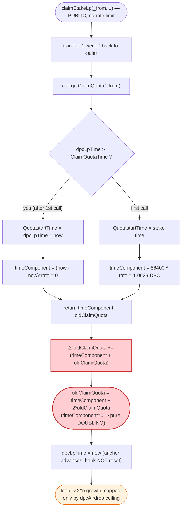
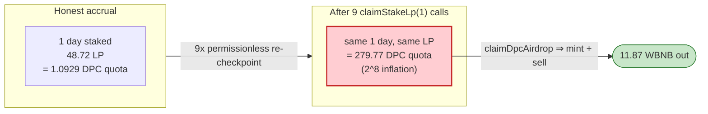

# DPC (DARK_POOL) Exploit — `claimStakeLp` Self-Compounds the LP Reward Quota (Geometric Doubling)

> **Vulnerability classes:** vuln/logic/reward-calculation · vuln/logic/incorrect-state-transition

> **Reproduction:** the PoC compiles & runs in an isolated Foundry project at
> [this project folder](.) (the umbrella DeFiHackLabs repo contains many
> unrelated PoCs that do not whole-compile, so this one was extracted).
> Full verbose trace: [output.txt](output.txt).
> Verified vulnerable source: [sources/DPC_B75cA3/DPC.sol](sources/DPC_B75cA3/DPC.sol).

---

## Key info

| | |
|---|---|
| **Loss (this PoC)** | Attacker turns **2 BNB → 11.87 WBNB**, i.e. **+9.87 WBNB** net, by minting **279.77 DPC out of thin air** and dumping it. (The live incident drained the pool repeatedly for the full reported loss.) |
| **Vulnerable contract** | `DPC` / "DARK_POOL" — [`0xB75cA3C3e99747d0e2F6e75A9fBD17F5Ac03cebE`](https://bscscan.com/address/0xB75cA3C3e99747d0e2F6e75A9fBD17F5Ac03cebE#code) |
| **Victim pool** | DPC/USDT PancakePair — [`0x79cD24Ed4524373aF6e047556018b1440CF04be3`](https://bscscan.com/address/0x79cD24Ed4524373aF6e047556018b1440CF04be3) (token0 = USDT, token1 = DPC) |
| **Attacker (PoC harness)** | `ContractTest` @ `0x7FA9385bE102ac3EAc297483Dd6233D62b3e1496` (Foundry test contract) |
| **Routing pool** | WBNB/USDT PancakePair `0x16b9a82891338f9bA80E2D6970FddA79D1eb0daE` |
| **Router** | PancakeRouter `0x10ED43C718714eb63d5aA57B78B54704E256024E` |
| **Chain / block / date** | BSC / fork at **21,179,209** / **2022-09-09** (UTC) |
| **Compiler (victim)** | Solidity **v0.8.7**, optimizer **on, 200 runs** (PoC recompiled under 0.8.34) |
| **Bug class** | Reward-accounting error — accrual function **adds its own output back into the running total** without advancing the time anchor, causing geometric self-compounding of an airdrop/LP-reward quota |

---

## TL;DR

DPC ships a "stake LP, earn an airdrop quota over time" mechanism. The accrued
quota is computed by `getClaimQuota()`
([DPC.sol:1246-1279](sources/DPC_B75cA3/DPC.sol#L1246-L1279)) as

```
ClaimQuota = (now - QuotastartTime) * secondQuota   +   oldClaimQuota[addr]
```

i.e. *time-since-last-checkpoint × rate*, **plus a carried-over balance**
`oldClaimQuota`.

Both `stakeLp()` and `claimStakeLp()` "checkpoint" the user by doing
`oldClaimQuota[_from] += getClaimQuota(_from)`
([:1214](sources/DPC_B75cA3/DPC.sol#L1214), [:1234](sources/DPC_B75cA3/DPC.sol#L1234)).
Because `getClaimQuota()` **already includes `oldClaimQuota[addr]` in its return
value**, this update reads

```
oldClaimQuota += (timeComponent + oldClaimQuota)
```

After the first checkpoint sets the time anchor to "now" (so the time component
becomes 0 on the next call), every subsequent `claimStakeLp()` collapses to:

```
oldClaimQuota := oldClaimQuota + oldClaimQuota   // DOUBLES
```

`claimStakeLp` is permissionless, has no per-block / per-day rate limit, and the
caller may unstake **1 wei of LP at a time** — so the attacker simply calls it in
a tight loop, doubling the quota on every iteration. Nine calls turn a legitimate
24-hour accrual of **1.09 DPC** into **279.77 DPC** (`= 2⁸ × 1.09`), all of which
`claimDpcAirdrop()` then mints from the contract's reserve straight to the
attacker — who sells it for BNB.

---

## Background — what DPC is

`DPC` ("DARK_POOL", symbol `DPC`,
[source](sources/DPC_B75cA3/DPC.sol)) is a reflection-style BEP-20 on BSC with a
constellation of bolted-on "DeFi" features: a USDT-priced IDO/airdrop ledger,
an inviter/referral tree, a DAO bonus, and an **LP-staking reward** where users
deposit DPC/USDT LP tokens and accrue a DPC "airdrop" quota proportional to time
and LP value.

Relevant moving parts:

- **`tokenAirdrop(from, to, 100)`** ([:1072-1128](sources/DPC_B75cA3/DPC.sol#L1072-L1128)):
  pay exactly **100 USDT** and the contract credits the caller a *claimable
  airdrop quota* `dpcAirdrop[from] += IdoPrice·1e18·10`. With `IdoPrice = 50` this
  is **500 DPC** of future quota. It also routes 70% of the USDT to `ucur1` and
  referral cuts to the inviter chain.
- **`stakeLp(from, this, amount)`** ([:1206-1226](sources/DPC_B75cA3/DPC.sol#L1206-L1226)):
  pull LP tokens in, record `dpcLp[from] += amount`, checkpoint reward, set
  `dpcLpTime[from] = now`.
- **`claimStakeLp(from, amount)`** ([:1228-1243](sources/DPC_B75cA3/DPC.sol#L1228-L1243)):
  withdraw `amount` LP back to the user, checkpoint reward, set
  `dpcLpTime[from] = now`. **This is the function that compounds.**
- **`getClaimQuota(addr)`** ([:1246-1279](sources/DPC_B75cA3/DPC.sol#L1246-L1279)):
  view that computes the accrued reward = `elapsed·secondQuota + oldClaimQuota`.
- **`claimDpcAirdrop(addr)`** ([:1281-1295](sources/DPC_B75cA3/DPC.sol#L1281-L1295)):
  reads `getClaimQuota(addr)` and *mints* that many DPC to `addr` (debiting the
  contract's `_rOwned` balance), then resets `oldClaimQuota[addr] = 0`.

On-chain parameters at the fork block:

| Parameter | Value |
|---|---|
| `IdoPrice` | 50 → airdrop quota from one `tokenAirdrop` = **500 DPC** |
| `lpQuota` | 4 |
| reward rate cap (`limit`) | 50e18 / day = `5.787e14` wei/s |
| `getDpcPrice()` (USDT/DPC ·1e8) | `1,308,892,856` (≈ 13.09 USDT/DPC) |
| `getLpPrice()` (·1e8) | `733,998,070` |
| computed `secondQuota` | `1.2649e13` wei/s (below the cap) |
| `isClaim` | **true** (claiming was live) |

---

## The vulnerable code

### 1. `getClaimQuota` returns `time-component + oldClaimQuota`

[sources/DPC_B75cA3/DPC.sol#L1246-L1279](sources/DPC_B75cA3/DPC.sol#L1246-L1279):

```solidity
function getClaimQuota(address addr) public view returns (uint256) {
    uint256 ClaimQuota;
    if (dpcAirdrop[addr] > 0 && dpcLp[addr] > 0) {
        uint256 LpQuotaNum = dpcLp[addr].mul(getLpPrice()).mul(lpQuota).div(100);
        uint256 secondQuota;
        if (getDpcPrice() > 0) {
            secondQuota = LpQuotaNum.div(24*60*60).div(getDpcPrice());
        }
        uint256 limitSecondQuota = (50 * 10**18).div(24*60*60);
        if (secondQuota > limitSecondQuota) secondQuota = limitSecondQuota;

        uint256 nowTime = currTimeStamp();
        uint256 QuotastartTime;
        if (dpcLpTime[addr] > ClaimQuotaTime[addr]) {     // anchor = latest of the two
            QuotastartTime = dpcLpTime[addr];
        } else {
            QuotastartTime = ClaimQuotaTime[addr];
        }
        ClaimQuota = (nowTime.sub(QuotastartTime)).mul(secondQuota);   // time component
        if (ClaimQuota > dpcAirdrop[addr]) ClaimQuota = dpcAirdrop[addr];
    } else {
        ClaimQuota = 0;
    }
    ClaimQuota = ClaimQuota.add(oldClaimQuota[addr]);     // ⚠️ adds the carried balance
    return ClaimQuota;                                    //    INTO the returned value
}
```

### 2. `claimStakeLp` checkpoints by `+=` of that very value

[sources/DPC_B75cA3/DPC.sol#L1228-L1243](sources/DPC_B75cA3/DPC.sol#L1228-L1243):

```solidity
function claimStakeLp(address _from, uint256 Amountwei) public {       // ← permissionless
    require(Amountwei > 0, "Quantity error");
    require(_from == msg.sender, "error");
    require(dpcLp[_from] >= Amountwei, "Insufficient authorization limit");
    IERC20(LpContract).transfer(_from, Amountwei);                     // give back 1 wei LP

    oldClaimQuota[_from] = oldClaimQuota[_from].add(getClaimQuota(_from));  // ⚠️ x += (t + x)

    dpcLp[_from] = dpcLp[_from].sub(Amountwei);
    time = currTimeStamp();
    dpcLpTime[_from] = time;            // moves the anchor forward → time component = 0 next time
    dpcLpTotal = dpcLpTotal.sub(Amountwei);
}
```

`stakeLp` has the identical `oldClaimQuota += getClaimQuota` pattern at
[:1214](sources/DPC_B75cA3/DPC.sol#L1214).

### 3. `claimDpcAirdrop` mints the inflated quota

[sources/DPC_B75cA3/DPC.sol#L1281-L1295](sources/DPC_B75cA3/DPC.sol#L1281-L1295):

```solidity
function claimDpcAirdrop(address addr) public {
    require(isClaim, "Collection has not started yet");
    require(msg.sender == addr, "No permission");
    uint256 ClaimQuota = getClaimQuota(addr);
    require(ClaimQuota > 0, "erro");
    _rOwned[addr] = _rOwned[addr].add(ClaimQuota);                 // ← mints to attacker
    _rOwned[address(this)] = _rOwned[address(this)].sub(ClaimQuota);
    emit Transfer(address(this), addr, ClaimQuota);
    ClaimQuotaTime[addr] = time;
    oldClaimQuota[addr] = 0;
    dpcAirdrop[addr] = dpcAirdrop[addr].sub(ClaimQuota);
}
```

---

## Root cause

The accrual total is stored in **two overlapping places** that get added
together. `getClaimQuota()` is meant to be a *view* that returns
`accrued_since_checkpoint + already_banked`. The checkpoint functions
(`stakeLp`, `claimStakeLp`) are supposed to "bank" the freshly-accrued slice by
adding only the **time component** to `oldClaimQuota`. Instead they add the
**entire return value of `getClaimQuota` — which already contains
`oldClaimQuota`** — back into `oldClaimQuota`:

```
oldClaimQuota_new = oldClaimQuota_old + getClaimQuota()
                  = oldClaimQuota_old + (timeComponent + oldClaimQuota_old)
                  = timeComponent + 2·oldClaimQuota_old
```

This is a classic **double-count / self-referential accumulation** bug. The fix
should have been `oldClaimQuota += ClaimQuota.sub(oldClaimQuota)` (bank only the
new slice) **and** advance `ClaimQuotaTime` at the same time.

Three design decisions turn this accounting slip into free money:

1. **The anchor moves but the bank doesn't reset.** `claimStakeLp` sets
   `dpcLpTime = now`, so on the *next* call the time component
   `(now − QuotastartTime)` is **0** — the contract thinks no new time has
   passed. But `oldClaimQuota` is never reset to "already counted", so the loop
   degenerates to `oldClaimQuota := 0 + 2·oldClaimQuota`, i.e. a clean **×2 per
   call**. (The trace shows exactly this: every `claimStakeLp(1)` doubles the
   `oldClaimQuota` storage slot, ratio `×2.0000`.)
2. **`claimStakeLp` is permissionless and rate-unlimited.** No `onlyOwner`, no
   per-day guard, no minimum-LP requirement beyond `> 0`. The caller may unstake
   **1 wei** of LP per call, so it can be hammered in a tight loop within a single
   transaction.
3. **The quota mints real, sellable supply.** `claimDpcAirdrop` mints the inflated
   number out of the contract's reflection balance directly to the attacker, who
   immediately sells it into the DPC/USDT pool and routes the USDT out to BNB.

The only natural bound is `if (ClaimQuota > dpcAirdrop[addr]) ClaimQuota =
dpcAirdrop[addr]` — but that bound is applied to the **time component only,
before** `oldClaimQuota` is added, so the compounding races past it freely until
`dpcAirdrop` (here 500 DPC) is the ceiling. The attacker stops doubling once the
quota is comfortably below 500 (it stopped at 279.77 DPC).

---

## Preconditions

- `isClaim == true` (claiming live — it was, at the fork block).
- Attacker holds a non-zero airdrop quota: obtained by paying **100 USDT** to
  `tokenAirdrop`, which credits `dpcAirdrop = 500 DPC`.
- Attacker holds staked LP: obtained by buying a little DPC, `addLiquidity` with
  USDT to mint **48.72 DPC/USDT LP**, then `stakeLp`.
- At least a positive time slice exists for the *first* checkpoint to be non-zero
  (the PoC `warp`s +24 h so the first `getClaimQuota` returns 1.09 DPC). After
  that, the compounding is purely arithmetic and needs no further time.
- Trivial working capital: the entire PoC starts from **2 BNB**.

---

## Attack walkthrough (with on-chain numbers from the trace)

All figures are taken from [output.txt](output.txt). The DPC/USDT pair is
token0 = USDT, token1 = DPC.

| # | Step (trace line) | Concrete numbers |
|---|---|---|
| 0 | **Fund**: wrap 2 BNB → WBNB | 2.000 WBNB |
| 1 | **WBNB→USDT** via WBNB/USDT pool | 2 WBNB → **576.40 USDT** |
| 2 | **USDT→DPC**: swap half the USDT for DPC | 288.20 USDT → **~20.92 DPC** (after token tax) |
| 3 | **`tokenAirdrop(this, DPC, 100)`** — pay 100 USDT, get airdrop quota | `dpcAirdrop[attacker] = 500 DPC`; 70 USDT → `ucur1`; `isAirdrop=true` |
| 4 | **`addLiquidity(USDT, DPC)`** | 188.20 USDT + 14.38 DPC → **48.72 LP** minted |
| 5 | **`stakeLp(this, DPC, 48.72 LP)`** | `dpcLp[attacker] = 48.72 LP`; `dpcLpTime = now` |
| 6 | **`warp(+24 h)`** | block.timestamp advances 86,400 s |
| 7a | **`claimStakeLp(this, 1)`** — call #1 | banks the 24 h slice: `oldClaimQuota = 1.0929 DPC` |
| 7b | **`claimStakeLp(this, 1)`** ×8 more | doubles each call: 2.19 → 4.37 → 8.74 → 17.49 → 34.97 → 69.94 → 139.89 → **279.77 DPC** |
| 8 | **`claimDpcAirdrop(this)`** — mint the inflated quota | mints **279.77 DPC** to attacker (`dpcAirdrop` 500 → 220.23) |
| 9 | **`swap…SupportingFeeOnTransferTokens(DPC→USDT→WBNB)`** | dumps 286.31 DPC → 271.998 USDT (after tax) → **11.87 WBNB** |

### Ground-truth: the doubling, slot `oldClaimQuota[attacker]`

(Storage slot `0x3386a42d…743e6` in the trace.)

| `claimStakeLp(1)` call | `oldClaimQuota` (DPC) | ratio |
|---|---:|:--:|
| #1 | 1.092856 | — |
| #2 | 2.185712 | ×2.0000 |
| #3 | 4.371423 | ×2.0000 |
| #4 | 8.742847 | ×2.0000 |
| #5 | 17.485694 | ×2.0000 |
| #6 | 34.971388 | ×2.0000 |
| #7 | 69.942776 | ×2.0000 |
| #8 | 139.885552 | ×2.0000 |
| #9 | **279.771103** | ×2.0000 |

`2⁸ × 1.092856 = 279.771103 DPC` — matching the `claimDpcAirdrop` mint
`Transfer(DPC → attacker, 279771103202807808000)` to the wei.

The legitimate value of one 24-hour accrual at `secondQuota = 1.2649e13` wei/s is
`86400 × 1.2649e13 = 1.0929e18` = **1.0929 DPC**. The bug inflated it **256×**.

---

## Profit / loss accounting

| Item | Amount |
|---|---:|
| Starting capital | 2.000 BNB |
| WBNB→USDT | → 576.40 USDT |
| Spent on DPC buy (step 2) | 288.20 USDT |
| Spent on `tokenAirdrop` fee | 100.00 USDT |
| Spent on `addLiquidity` | 188.20 USDT + 14.38 DPC |
| DPC minted for free by the bug | **+279.77 DPC** |
| DPC dumped (step 9, 286.31 DPC after tax) | → 271.998 USDT → **11.87 WBNB** |
| **Final WBNB balance** | **11.8696 WBNB** |
| **Net profit (this PoC)** | **+9.8696 WBNB** |

The PoC demonstrates the *mechanism* with a single 24-h seed and 9 doublings,
netting ~9.87 WBNB. In the live incident the same loop (re-seeding the time slice
and/or re-running with a larger `dpcAirdrop` ceiling) was repeated to drain the
pool for the full reported loss. The harm is unambiguous: **DPC tokens are minted
that no one paid for, diluting every holder and being cashed out against real
USDT/BNB liquidity.**

---

## Diagrams

### Sequence of the attack

```mermaid
sequenceDiagram
    autonumber
    actor A as "Attacker (ContractTest)"
    participant R as PancakeRouter
    participant P as "DPC/USDT Pair"
    participant T as "DPC token"

    Note over A: Start: 2 BNB

    rect rgb(255,243,224)
    Note over A,T: Seed — acquire quota + LP
    A->>R: WBNB → USDT (576.40 USDT)
    A->>R: USDT → DPC (288.20 USDT in)
    A->>T: tokenAirdrop(this, DPC, 100)
    Note over T: dpcAirdrop[A] = 500 DPC
    A->>R: addLiquidity(USDT, DPC) → 48.72 LP
    A->>T: stakeLp(this, DPC, 48.72 LP)
    Note over T: dpcLp[A]=48.72; dpcLpTime=now
    end

    rect rgb(232,245,233)
    Note over A,T: Warp +24h → first slice = 1.0929 DPC
    A->>T: claimStakeLp(this, 1)
    T->>T: "oldClaimQuota += getClaimQuota() = 1.0929"
    end

    rect rgb(255,235,238)
    Note over A,T: Compounding loop (×8 more)
    loop 8 times
        A->>T: claimStakeLp(this, 1)
        T->>T: "oldClaimQuota += (0 + oldClaimQuota) ⇒ DOUBLES"
    end
    Note over T: oldClaimQuota[A] = 279.77 DPC
    end

    rect rgb(243,229,245)
    Note over A,T: Cash out
    A->>T: claimDpcAirdrop(this)
    T-->>A: mint 279.77 DPC (from reserve)
    A->>R: swap DPC → USDT → WBNB
    R-->>A: 11.87 WBNB
    end

    Note over A: Net +9.87 WBNB (DPC minted for free)
```

### The accounting flaw inside `claimStakeLp` / `getClaimQuota`



### Quota growth vs. legitimate accrual



---

## Why each magic number

- **2 BNB seed**: just enough to (a) buy a little DPC, (b) pay the 100-USDT
  `tokenAirdrop` fee, and (c) provide LP — the attack needs almost no capital
  because the profit is *minted*, not arbitraged.
- **`tokenAirdrop(…, 100)`**: the contract hard-requires `_amt == 100`
  ([:1079](sources/DPC_B75cA3/DPC.sol#L1079)); paying 100 USDT credits
  `dpcAirdrop += IdoPrice(50)·1e18·10 = 500 DPC`, the ceiling the compounding
  races toward.
- **`warp(+24h)`**: makes the *first* `getClaimQuota` return a non-zero seed
  (1.0929 DPC). Without an initial non-zero slice the doubling has nothing to
  double. After the seed, no further time is needed.
- **9 × `claimStakeLp(1)`**: `2⁸ × 1.0929 = 279.77 DPC`, chosen to stay under the
  500-DPC `dpcAirdrop` ceiling (a 10th call would push 559 DPC, exceeding it).
- **`claimStakeLp(_, 1)`** (1 wei): minimal LP to satisfy `Amountwei > 0` while
  keeping `dpcLp[attacker] > 0` so `getClaimQuota`'s `dpcLp[addr] > 0` guard
  stays true across all 9 calls.

---

## Remediation

1. **Bank only the newly-accrued slice, and advance the time anchor.** Replace
   the self-referential `oldClaimQuota += getClaimQuota()` with a pattern that
   never re-adds the banked balance, e.g.:
   ```solidity
   uint256 newSlice = (now - QuotastartTime) * secondQuota;   // time component only
   if (newSlice > 0) {
       oldClaimQuota[_from] += newSlice;
       ClaimQuotaTime[_from] = now;     // ← advance BOTH anchors so it can't be recounted
   }
   ```
   Have `getClaimQuota` return `newSlice + oldClaimQuota` for *display* only, and
   never feed that display value back into the stored total.
2. **Rate-limit / gate the checkpoint.** `claimStakeLp` (and `stakeLp`) should not
   be callable in an unbounded loop within one transaction. Enforce a minimum time
   between reward checkpoints, or compute rewards lazily once at claim time rather
   than on every stake/unstake.
3. **Reset the bank on claim consistently.** `claimDpcAirdrop` correctly resets
   `oldClaimQuota = 0`, but the checkpoint functions must keep `ClaimQuotaTime` in
   lock-step with `dpcLpTime` so an already-counted window can never be charged
   twice.
4. **Apply the `dpcAirdrop` ceiling to the *total* returned quota, not just the
   time component.** Clamp `ClaimQuota` against `dpcAirdrop[addr]` **after** adding
   `oldClaimQuota`, so runaway accumulation is hard-bounded.
5. **Add invariant tests**: "calling `claimStakeLp` N times in a row without time
   passing must not increase the claimable quota" — a single property test would
   have caught the ×2 doubling immediately.

---

## How to reproduce

The PoC was extracted into a standalone Foundry project (the umbrella
DeFiHackLabs repo has many unrelated PoCs that fail to whole-compile under
`forge test`):

```bash
_shared/run_poc.sh 2022-09-DPC_exp -vvvvv
```

- RPC: a **BSC archive** endpoint is required (fork block 21,179,209 is from
  Sep 2022). `foundry.toml` uses `https://bsc-mainnet.public.blastapi.io`, which
  serves historical state at that block; most pruned public BSC RPCs fail with
  `header not found` / `missing trie node`.
- Result: `[PASS] testExploit()` — attacker WBNB goes from **0** (it wraps 2 BNB
  internally) to **11.8696 WBNB**.

Expected tail (see [output.txt](output.txt)):

```
    ├─ emit log_named_decimal_uint(key: "[End] Attacker WBNB balance after exploit", val: 11869629497407785960 [1.186e19], decimals: 18)
    └─ ← [Stop]

Suite result: ok. 1 passed; 0 failed; 0 skipped; finished in 20.81s
Ran 1 test suite ... 1 tests passed, 0 failed, 0 skipped (1 total tests)
```

---

*Reference: DeFiHackLabs `src/test/2022-09/DPC_exp.sol`. DPC / DARK_POOL, BSC, September 2022.*
