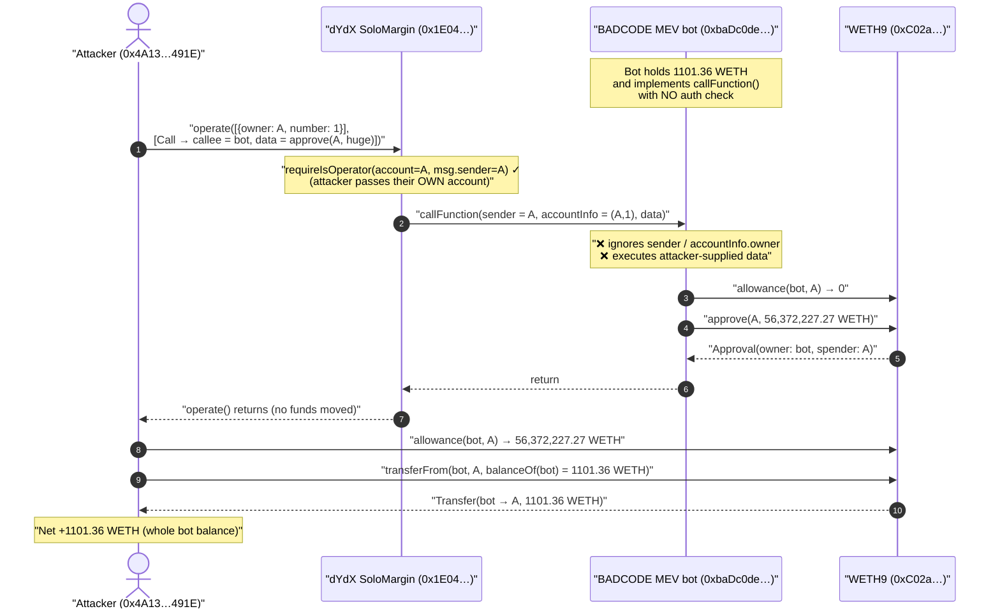
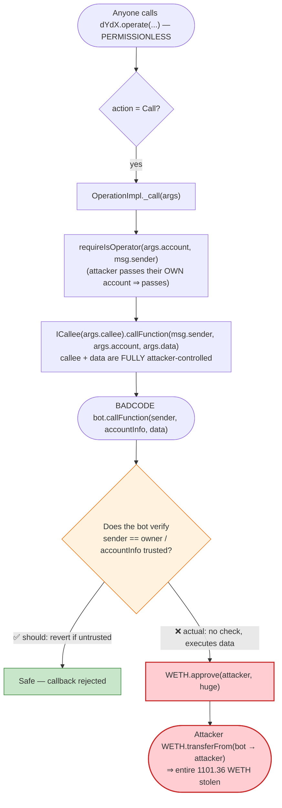
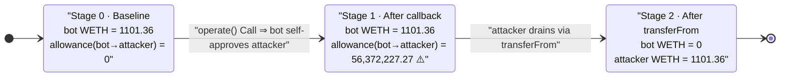

# BADCODE MEV Bot Exploit — Unauthenticated dYdX `callFunction` Callback Drained to a Max Approval

> **Reproduction:** the PoC compiles & runs in an isolated Foundry project at
> [this project folder](.) (the umbrella DeFiHackLabs repo contains many
> unrelated PoCs that do not whole-compile under `forge test`, so this one was
> extracted standalone).
> Full verbose trace: [output.txt](output.txt).
> Verified vector source (dYdX SoloMargin): [sources/SoloMargin_1E0447/SoloMargin.sol](sources/SoloMargin_1E0447/SoloMargin.sol).
> Verified token source (WETH9): [sources/WETH9_C02aaA/WETH9.sol](sources/WETH9_C02aaA/WETH9.sol).

---

## Key info

| | |
|---|---|
| **Loss** | **1101.359974579155257683 WETH** (≈ $1.45M at the ~$1,320/ETH price of Sep 2022) drained from the BADCODE MEV bot |
| **Vulnerable contract** | The **BADCODE MEV bot** — proxy [`0xbaDc0dEfAfCF6d4239BDF0b66da4D7Bd36fCF05A`](https://etherscan.io/address/0xbaDc0dEfAfCF6d4239BDF0b66da4D7Bd36fCF05A) → logic [`0xDd6Bd08c29fF3EF8780bF6A10D8b620A93AC5705`](https://etherscan.io/address/0xDd6Bd08c29fF3EF8780bF6A10D8b620A93AC5705) (its `callFunction` handler) |
| **Attack vector / callback router** | dYdX **SoloMargin** — proxy [`0x1E0447b19BB6EcFdAe1e4AE1694b0C3659614e4e`](https://etherscan.io/address/0x1E0447b19BB6EcFdAe1e4AE1694b0C3659614e4e) → impl `OperationImpl` `0x56e7d4520abfecf10b38368b00723d9bd3c21ee1` |
| **Victim asset** | WETH9 [`0xC02aaA39b223FE8D0A0e5C4F27eAD9083C756Cc2`](https://etherscan.io/address/0xC02aaA39b223FE8D0A0e5C4F27eAD9083C756Cc2) |
| **Attacker (PoC EOA)** | `0x4A130A95fB6EAdDFBaBB718D263cA0E4732d491E` (= `vm.addr(31337)`) |
| **Chain / block / date** | Ethereum mainnet / fork block **15,625,424** / ~September 27, 2022 |
| **Compiler** | SoloMargin `v0.5.7+commit.6da8b019` (opt 10000); WETH9 `v0.4.19`; PoC `0.8.10` |
| **Bug class** | Unauthenticated callback / missing `msg.sender` & account-owner validation on an `ICallee.callFunction` handler → arbitrary `approve` |

---

## TL;DR

The BADCODE MEV bot implemented dYdX's `ICallee.callFunction(address sender, Account.Info accountInfo, bytes data)`
hook so it could receive dYdX flash-style callbacks. dYdX's `OperationImpl._call`
([SoloMargin.sol:5441-5456](sources/SoloMargin_1E0447/SoloMargin.sol#L5441-L5456))
will route a `Call` action to **any** `otherAddress` the caller names — it only
checks that the caller is an operator *of the dYdX account being passed in*, not
of the callee. So anyone can make dYdX invoke the bot's `callFunction` with
attacker-chosen `data`.

The bot's `callFunction` handler **did not authenticate the call**: it neither
checked that `sender` (the original dYdX caller) was the bot's owner, nor that
`accountInfo.owner` was trusted, nor that it was genuinely mid-operation. It
simply decoded the attacker-supplied `data` and executed it — performing
`WETH.approve(attacker, 56_372_227.27e18)` against itself.

Once the bot had granted a near-infinite WETH allowance to the attacker, the
attacker called `WETH.transferFrom(bot, attackerEOA, bot's entire 1101.36 WETH
balance)` and walked away with the lot — in a single transaction, with **zero
capital** (no flash loan, no collateral; the dYdX `Call` action moves no funds).

---

## Background — the two contracts involved

There are two distinct pieces here, and it is important not to conflate them:

1. **dYdX SoloMargin (the router, NOT the bug).** SoloMargin is a margin/lending
   protocol whose single entry point `operate(Info[] accounts, ActionArgs[]
   actions)` ([SoloMargin.sol:4666-4699](sources/SoloMargin_1E0447/SoloMargin.sol#L4666-L4699))
   processes a batch of actions. One action type is `Call` — "send arbitrary
   data to an address" ([Actions enum :3643-3653](sources/SoloMargin_1E0447/SoloMargin.sol#L3643-L3653)).
   It exists so that integrators can run custom logic inside a dYdX operation
   (e.g. flash-loan-style atomic strategies). dYdX faithfully forwards the call.

2. **The BADCODE MEV bot (the actual victim).** A privately-deployed MEV bot
   (proxy `0xbaDc0dE…`, logic `0xDd6Bd08c…`) that integrated with dYdX by
   implementing `callFunction`. Its source is **not verified** on Etherscan, but
   the on-chain trace shows exactly what its handler did when called: it parsed
   the inbound `data` and executed an arbitrary `WETH.approve`. That missing
   authentication is the vulnerability. (DeFiHackLabs files this incident under
   "BADCODE" / the bot's `0xbaDc0de` vanity address.)

### dYdX's `Call` plumbing (faithful, by design)

```solidity
// contracts/protocol/interfaces/ICallee.sol  (:3608-3625)
contract ICallee {
    function callFunction(
        address sender,            // the msg.sender that called dYdX.operate
        Account.Info memory accountInfo,
        bytes memory data          // arbitrary, attacker-controlled
    ) public;
}
```

```solidity
// contracts/protocol/impl/OperationImpl.sol  (:5441-5456)
function _call(Storage.State storage state, Actions.CallArgs memory args) private {
    state.requireIsOperator(args.account, msg.sender);     // ← only authorizes the dYdX *account*
    ICallee(args.callee).callFunction(                     // ← args.callee = ANY address the caller named
        msg.sender,
        args.account,
        args.data
    );
    Events.logCall(args);
}
```

The `Call` action's `callee` is taken verbatim from `args.otherAddress`
([parseCallArgs :4004-4018](sources/SoloMargin_1E0447/SoloMargin.sol#L4004-L4018)),
and `requireIsOperator(args.account, msg.sender)`
([Storage.requireIsOperator :2017-2036](sources/SoloMargin_1E0447/SoloMargin.sol#L2017-L2036))
is trivially satisfied because `msg.sender == account.owner` — the attacker
simply passes *their own* dYdX account as `accounts[0]`. dYdX never checks any
relationship between the attacker and the `callee`. **This is correct dYdX
behavior**: it is the integrator's job to authenticate the callback.

In the PoC the attacker's `Info` is `{owner: address(this), number: 1}`
([test/MEVbadc0de_exp.sol:100-101](test/MEVbadc0de_exp.sol#L100-L101)) and the
`callee` (`otherAddress`) is the MEV bot
([:124-125](test/MEVbadc0de_exp.sol#L124-L125)).

---

## The vulnerable code (the MEV bot's `callFunction`)

The bot's logic is unverified, so we reconstruct its behavior from the trace.
The relevant call chain in [output.txt:23-42](output.txt#L23-L42):

```
operate([{owner: attacker, number: 1}], [Call → otherAddress = 0xbaDc0de…(bot)])
  └─ OperationImpl._call → ICallee(bot).callFunction(attacker, (attacker,1), data)
       ├─ bot proxy 0xbaDc0de… .callFunction(attacker, (attacker,1), data)
       │    └─ delegatecall → bot logic 0xDd6Bd08c… .callFunction(attacker, (attacker,1), data)
       │         ├─ WETH9.allowance(bot, attacker) → 0
       │         ├─ WETH9.approve(attacker, 56372227272130782805279000)   ← ⚠️ the bug
       │         │     emit Approval(owner: bot, spender: attacker, value: 5.637e25)
       │         └─ bot.fallback( 0x…4798ce5b… )   ← a benign no-op selector the decoder hit
```

The bot's handler effectively does (decompiled intent):

```solidity
// BADCODE MEV bot logic 0xDd6Bd08c… — NO authentication
function callFunction(address sender, Account.Info memory accountInfo, bytes memory data) public {
    // ❌ NO check that sender == owner
    // ❌ NO check that accountInfo.owner is trusted
    // ❌ NO check that we are inside a self-initiated dYdX operation
    // It decodes `data` into (target, calldata) and EXECUTES it against `target`:
    //   target = WETH;  calldata = approve(attacker, ~uint?)   → bot grants attacker an allowance
    ...
}
```

The attacker-controlled `data` is hand-encoded in
[test/MEVbadc0de_exp.sol:131-161](test/MEVbadc0de_exp.sol#L131-L161). It carries
the WETH target (`address(weth)`), the spender (`address(this)` = attacker), and
an `approve`-shaped payload; the exact framing is whatever the bot's bespoke
decoder expected. The mechanical proof is the `Approval` event in the trace
([output.txt:31](output.txt#L31)) and the resulting allowance read-back of
`56372227272130782805279000` ([output.txt:46-48](output.txt#L46-L48)).

### WETH9 behaves exactly as a correct ERC-20 should

WETH9 is not at fault. `approve` and `transferFrom`
([WETH9.sol — standard Allowance pattern](sources/WETH9_C02aaA/WETH9.sol)) only
enforce that the *owner of the funds* authorized the spender. Here the owner
(the bot) "authorized" the attacker — because the bot's callback let the
attacker dictate that approval. WETH then correctly honored the `transferFrom`
([output.txt:51-57](output.txt#L51-L57)).

---

## Root cause — why it was possible

The bot exposed `callFunction` as a **public, unauthenticated** entry point that
**executes attacker-supplied instructions against itself**. dYdX's `Call` action
is a *general-purpose, permissionless* way to invoke `callFunction(sender,
accountInfo, data)` on any address with any `data`. Combining the two:

> Anyone can call `dYdX.operate([myAccount], [Call → bot, data=approve(me, max)])`.
> dYdX dutifully calls `bot.callFunction(me, (me,1), approve-payload)`. The bot
> trusts the payload and approves the attacker. The attacker then `transferFrom`s
> the bot's entire WETH balance.

Three decisions compose into the critical bug:

1. **No `sender` / owner check in the callback.** A `callFunction` handler MUST
   verify that the original caller (`sender`) and/or `accountInfo.owner` is the
   bot's own owner/operator before acting. dYdX even documents `sender` as "The
   msg.sender to Solo" precisely so integrators can authenticate it
   ([ICallee :3612-3624](sources/SoloMargin_1E0447/SoloMargin.sol#L3612-L3624)).
   The bot ignored it.
2. **The callback executes arbitrary, data-driven actions on the bot's own
   assets.** A safe handler would only run a fixed, pre-committed strategy; this
   one let `data` choose the target and calldata (here: `WETH.approve`).
3. **The privileged action it could be coerced into is a token approval.** A
   single `approve(attacker, huge)` converts "I can make the bot run code" into
   "I own the bot's tokens," redeemable later via `transferFrom`.

dYdX's contract is *not* the vulnerability; it is the (publicly callable)
delivery mechanism. The same class of bug bit several MEV bots and integrators
that wired up `callFunction` (and similar Aave/Uniswap/Balancer flash callbacks)
without authenticating the caller.

---

## Preconditions

- The victim implements `ICallee.callFunction` and performs **state-changing,
  data-controlled actions** in it (here: an `approve`) **without authenticating
  `sender`/`accountInfo.owner`**. ✓ (the BADCODE bot).
- The victim holds value the action can hand over — here **1101.36 WETH**
  ([output.txt:6,20-21](output.txt#L20-L21)).
- dYdX SoloMargin's `Call` action is permissionless (it is). The attacker passes
  their own account as `accounts[0]`, satisfying `requireIsOperator`.
- **No capital required.** The `Call` action moves no tokens; the attacker needs
  only gas. No flash loan, no collateral.

---

## Step-by-step attack walkthrough (with ground-truth numbers from the trace)

All values are taken directly from [output.txt](output.txt).

| # | Step | Call / event | Observed value | Effect |
|---|------|--------------|---------------:|--------|
| 0 | **Baseline** | `WETH.balanceOf(bot)` ([:20-21](output.txt#L20-L21)) | 1101.359974579155257683 WETH | The prize sits in the bot. |
| 1 | **Trigger the callback** | `dYdX.operate([{attacker,1}], [Call → bot, data])` ([:23](output.txt#L23)) | — | Permissionless; attacker is operator of their *own* account. |
| 2 | **dYdX forwards** | `OperationImpl._call` → `bot.callFunction(attacker,(attacker,1),data)` ([:24-27](output.txt#L24-L27)) | — | Faithful dYdX forwarding (delegatecalled impl). |
| 3 | **Bot reads its allowance** | `WETH.allowance(bot, attacker)` ([:28-29](output.txt#L28-L29)) | 0 | Pre-attack: attacker has no allowance. |
| 4 | **⚠️ Bot self-approves attacker** | `WETH.approve(attacker, …)`; `emit Approval(bot→attacker)` ([:30-34](output.txt#L30-L34)) | **56,372,227.272130782805279 WETH** | Unauthenticated callback grants a (vastly over-sized) allowance. |
| 5 | **Decoder no-op** | `bot.fallback(0x…4798ce5b…)` ([:35-36](output.txt#L35-L36)) | — | Trailing bytes hit a benign selector / fallback; harmless. |
| 6 | **operate returns** | storage `@12: 666711 → 666712` ([:43-45](output.txt#L43-L45)) | — | dYdX bumps an internal counter; nothing else changed. |
| 7 | **Confirm allowance** | `WETH.allowance(bot, attacker)` ([:46-48](output.txt#L46-L48)) | 56,372,227.27 WETH | Allowance now live. |
| 8 | **Drain** | `WETH.transferFrom(bot, attackerEOA, balanceOf(bot))`; `emit Transfer(bot→attacker, …)` ([:49-57](output.txt#L49-L57)) | **1101.359974579155257683 WETH** | Entire bot balance moved to attacker. |
| 9 | **Verify** | `WETH.balanceOf(bot)=0`, `balanceOf(attacker)=1101.36`, `assertEq(0,0)` ([:58-67](output.txt#L58-L67)) | bot 0 / attacker 1101.36 | Bot fully drained. |

### Why the allowance is 56.37M WETH but the loss is "only" 1101 WETH

The bot approved `56372227272130782805279000` wei — an absurd figure dwarfing
its 1101.36 WETH balance. The cap is irrelevant; any allowance ≥ the balance
suffices. The actual theft is bounded by what the bot held, so the loss equals
its full **1101.36 WETH** balance, transferred in step 8.

---

## Profit / loss accounting

| Item | WETH |
|---|---:|
| Attacker capital in (gas only; `Call` moves no funds) | 0 |
| Allowance the bot granted the attacker | 56,372,227.272130782805279 (cap, not realized) |
| WETH `transferFrom`'d out of the bot | **1101.359974579155257683** |
| Bot WETH balance after | 0 |
| **Attacker net profit** | **+1101.359974579155257683 WETH** |

The PoC's closing assertions match the trace to the wei: `MEV Bot WETH balance
After exploit: 0`, `Exploiter WETH balance After exploit:
1101.359974579155257683` ([output.txt:8-9, 60-63](output.txt#L60-L63)).

---

## Diagrams

### Sequence of the attack



### Trust / control flow — where the check was missing



### State evolution of the bot's WETH



---

## Remediation

The fix belongs entirely in the **integrator's callback**, not in dYdX or WETH.

1. **Authenticate every flash/`callFunction` callback.** In `callFunction`,
   require that the call originated from a trusted operation:
   - `require(msg.sender == address(dYdXSoloMargin), "not dydx")` — the immediate
     caller must be the expected protocol, and
   - `require(sender == owner() || isTrusted[sender], "untrusted initiator")` —
     the original `operate` caller (`sender`) must be the bot's own
     owner/operator, and/or `accountInfo.owner` must be whitelisted.
   The same rule applies to `executeOperation` (Aave), `uniswapV2Call`,
   `receiveFlashLoan` (Balancer), etc.
2. **Never let callback `data` choose arbitrary targets/calldata.** A callback
   should run a fixed, pre-committed strategy. If the bot must execute encoded
   instructions, gate them behind owner authentication AND a target/selector
   allowlist; never permit `approve`/`transfer`/`transferFrom` of the bot's own
   funds to a caller-supplied address.
3. **Use a transient "operation in progress" latch.** Set a one-shot flag before
   calling `dYdX.operate` from the bot and require it inside `callFunction`, so a
   callback that the bot did not itself initiate reverts.
4. **Minimize standing approvals and asset custody.** Don't leave large idle WETH
   balances in a contract that also exposes generic callbacks; sweep profits to a
   cold address.

---

## How to reproduce

The PoC was extracted into a standalone Foundry project (the umbrella
DeFiHackLabs repo has many unrelated PoCs that fail the whole-project build under
`forge test`):

```bash
_shared/run_poc.sh 2022-09-MEVbadc0de_exp -vvvvv
```

- RPC: an **Ethereum mainnet archive** endpoint is required (fork block
  15,625,424, Sep 2022). `foundry.toml` points `mainnet` at an Infura endpoint;
  any archive node serving historical state at that block works.
- Result: `[PASS] testExploit()`.

Expected tail:

```
Ran 1 test for test/MEVbadc0de_exp.sol:ContractTest
[PASS] testExploit() (gas: 168322)
Logs:
  MEV Bot balance before exploit:: 1101.359974579155257683
  Contract BADCODE WETH Allowance: 56372227.272130782805279000
  MEV Bot WETH balance After exploit:: 0.000000000000000000
  Exploiter WETH balance After exploit:: 1101.359974579155257683

Suite result: ok. 1 passed; 0 failed; 0 skipped
```

---

*PoC credits: [@kayaba2002](https://twitter.com/kayaba2002) and
[@eugenioclrc](https://twitter.com/eugenioclrc) (see
[test/MEVbadc0de_exp.sol:7-11](test/MEVbadc0de_exp.sol#L7-L11)).
Reference: DeFiHackLabs / SlowMist Hacked — BADCODE MEV bot, Ethereum, Sep 2022.*
