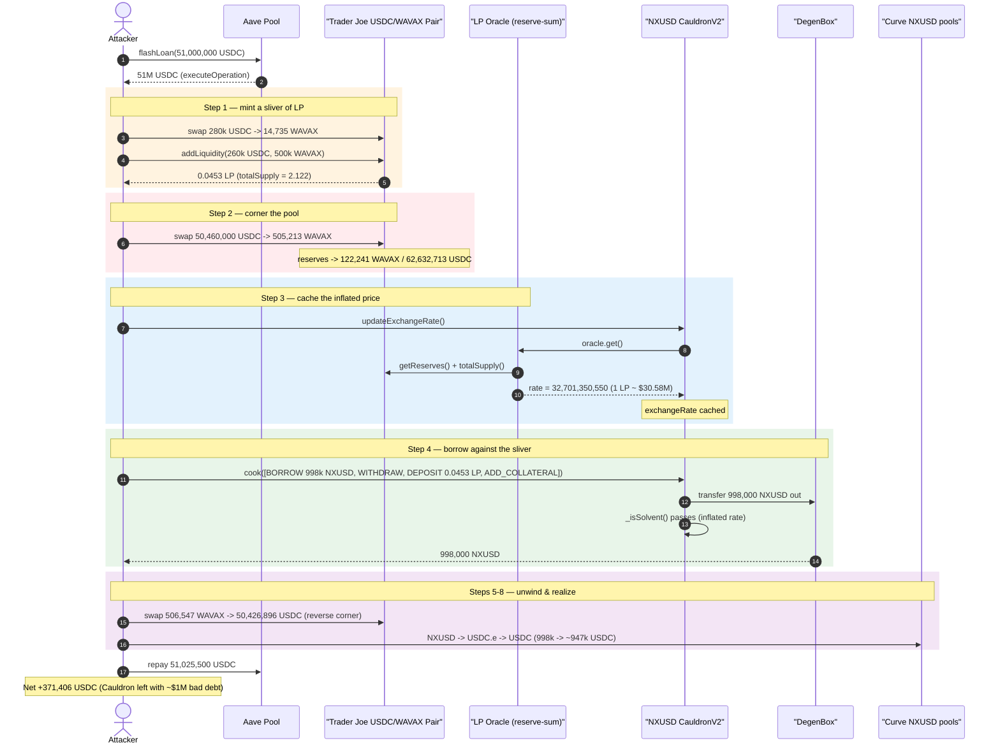
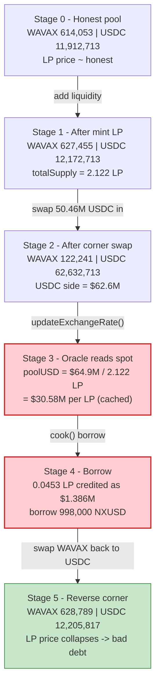
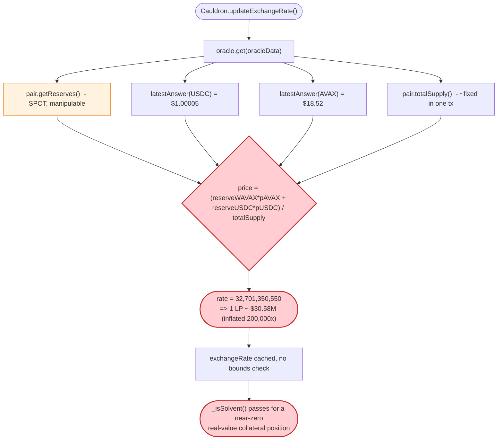
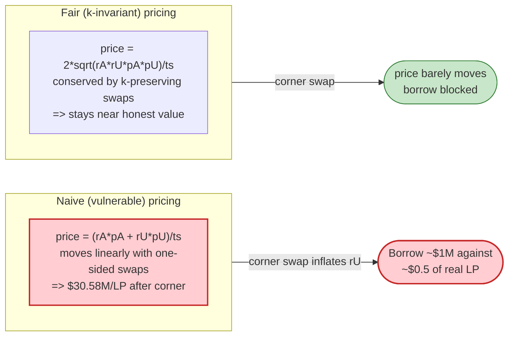

# NXUSD / Nereus Protocol Exploit — LP-Token Oracle Manipulation Drains a Cauldron Lending Market

> **Vulnerability classes:** vuln/oracle/price-manipulation · vuln/governance/flash-loan-attack

> **Reproduction:** the PoC compiles & runs in an isolated Foundry project at
> [this project folder](.) (the umbrella DeFiHackLabs repo contains many unrelated
> PoCs that do not whole-compile, so this one was extracted).
> Full verbose trace: [output.txt](output.txt).
> Verified vulnerable source: [contracts_CauldronV2.sol](sources/CauldronV2_C0A7a7/contracts_CauldronV2.sol).

---

## Key info

| | |
|---|---|
| **Loss** | ~**$371,406** (net flash-loan profit, paid out in native USDC) drained from the NXUSD `DegenBox`/`Cauldron` reserve |
| **Vulnerable contract** | `CauldronV2` clone (NXUSD single-collateral market) — [`0xC0A7a7F141b6A5Bce3EC1B81823c8AFA456B6930`](https://snowtrace.io/address/0xC0A7a7F141b6A5Bce3EC1B81823c8AFA456B6930) (master impl [`0xE767C6C3Bf42f550A5A258A379713322B6c4c060`](https://snowtrace.io/address/0xE767C6C3Bf42f550A5A258A379713322B6c4c060)) |
| **Root-cause contract** | the market's price oracle [`0xf955a6694C6F5629f5Ecd514094B3bd450b59000`](https://snowtrace.io/address/0xf955a6694C6F5629f5Ecd514094B3bd450b59000) — a naive (reserve-sum / `totalSupply`) LP-token fair-value oracle |
| **Victim pool** | NXUSD `DegenBox` [`0x0B1F9C2211F77Ec3Fa2719671c5646cf6e59B775`](https://snowtrace.io/address/0x0B1F9C2211F77Ec3Fa2719671c5646cf6e59B775); collateral = Trader Joe **USDC/WAVAX** LP [`0xf4003F4efBE8691B60249E6afbD307aBE7758adb`](https://snowtrace.io/address/0xf4003F4efBE8691B60249E6afbD307aBE7758adb) |
| **Attacker EOA** | `0xdebfd7E879d4Bc4D3A75D5046dC9d2b5e0AB6b35` (per Nereus post-mortem) |
| **Attacker contract (PoC harness)** | `ContractTest` @ `0x7FA9385bE102ac3EAc297483Dd6233D62b3e1496` |
| **Attack tx** | `0x0ab12913f9232b27b0664cd2d50e482ad6aa896aeb811b53081712f42d54c026` (Tenderly: ava) |
| **Chain / block / date** | Avalanche C-Chain / 19,613,451 / **2022-09-06** (block timestamp `1662492396`) |
| **Compiler** | Cauldron/NXUSD: Solidity `v0.6.12`, optimizer 200 runs; Curve pools: Vyper `0.2.15/0.2.16` |
| **Bug class** | Price-oracle manipulation — instantaneous (single-block, flash-loan-funded) inflation of a Uniswap-V2-style LP token used as lending collateral |

---

## TL;DR

The NXUSD market is an Abracadabra/`MIM`-style **`CauldronV2`** clone running on a `DegenBox` (BentoBox fork).
It lets a user post a Trader Joe **USDC/WAVAX LP token** as collateral and borrow the NXUSD stablecoin
against it. The amount you can borrow is governed by the cached `exchangeRate`
([CauldronV2.sol:913-923](sources/CauldronV2_C0A7a7/contracts_CauldronV2.sol#L913-L923)), which the
Cauldron reads from an external oracle.

That oracle priced the LP token **naively**: it took the pool's *current* `getReserves()`, valued each
side with a Chainlink USD price, summed them, and divided by `pair.totalSupply()`. This formula is
trivially manipulable in a single transaction — a flash-loan-funded swap can balloon one reserve so each
LP token appears to be worth tens of millions of dollars.

The attacker:

1. **Flash-loaned 51,000,000 USDC** from Aave on Avalanche.
2. **Minted a sliver of the USDC/WAVAX LP** (added ~$0.5M liquidity → 0.0453 LP) so it would hold a tiny
   collateral position whose unit value it could then inflate.
3. **Dumped ~50.46M USDC into the Trader Joe pool** (swap USDC→WAVAX), pushing the pool's USDC reserve to
   **62.6M** while `totalSupply` stayed at only **2.122 LP**. The naive oracle now valued **1 LP ≈ $30.58M**.
4. **Called `cook()`** on the Cauldron to borrow **998,000 NXUSD** against the 0.0453 LP it had deposited
   (which the oracle now valued at ~$1.39M — comfortably over-collateralized at the market's
   collateralization ratio).
5. **Unwound everything**: reversed the WAVAX swap to recover the USDC it injected, routed the 998k NXUSD
   through two Curve metapools (NXUSD→USDC.e→USDC) to realize the borrowed value as hard USDC, and repaid
   the flash loan.

Net result: the attacker walked away with **$371,406 of real USDC** — the bad debt it created in the NXUSD
market by borrowing against collateral that was, in reality, worth a few hundred dollars.

---

## Background — Cauldron / DegenBox lending

`CauldronV2` is the Abracadabra "Cauldron" lending engine. Each *clone* is a single-collateral /
single-asset market:

- **Collateral**: an ERC-20 (here, the Trader Joe USDC/WAVAX LP token).
- **Asset**: the protocol's own stablecoin, **NXUSD** ([contracts_NXUSD.sol](sources/NXUSD_F14f4C/contracts_NXUSD.sol)).
- **`DegenBox`** ([contracts_DegenBox.sol](sources/DegenBox_0B1F9C/contracts_DegenBox.sol)) is the BentoBox
  fork that custodies tokens as *shares* and is the vault the Cauldron transfers in/out of.

Borrowing power is decided by `_isSolvent`
([CauldronV2.sol:884-901](sources/CauldronV2_C0A7a7/contracts_CauldronV2.sol#L884-L901)):

```solidity
return
    bentoBox.toAmount(
        collateral,
        collateralShare.mul(EXCHANGE_RATE_PRECISION / COLLATERIZATION_RATE_PRECISION).mul(COLLATERIZATION_RATE),
        false
    ) >=
    borrowPart.mul(_totalBorrow.elastic).mul(_exchangeRate) / _totalBorrow.base;
```

The whole solvency check hinges on `_exchangeRate` — "how much collateral to buy 1e18 asset", i.e. the
**price of the LP collateral**. That value is fetched and cached by `updateExchangeRate()`
([CauldronV2.sol:913-923](sources/CauldronV2_C0A7a7/contracts_CauldronV2.sol#L913-L923)) from the
market's external `IOracle`
([CauldronV2.sol:700-737](sources/CauldronV2_C0A7a7/contracts_CauldronV2.sol#L700-L737)):

```solidity
function updateExchangeRate() public virtual returns (bool updated, uint256 rate) {
    (updated, rate) = oracle.get(oracleData);
    if (updated) { exchangeRate = rate; emit LogExchangeRate(rate); }
    else { rate = exchangeRate; }   // fall back to cached
}
```

`cook()` lets a caller batch actions atomically. The PoC submits
`actions = [5, 21, 20, 10]` — `ACTION_BORROW`, `ACTION_BENTO_WITHDRAW`, `ACTION_BENTO_DEPOSIT`,
`ACTION_ADD_COLLATERAL`
([CauldronV2.sol:1126-1190](sources/CauldronV2_C0A7a7/contracts_CauldronV2.sol#L1126-L1190)) — and the
final per-iteration `needsSolvencyCheck` runs `_isSolvent` against the freshly-cached, *inflated*
`exchangeRate`.

---

## The vulnerable code

### 1. The Cauldron blindly trusts the oracle's instantaneous price

The Cauldron has no notion of *how* the price was produced — TWAP, spot, manipulation-resistant or not.
It simply caches whatever `oracle.get()` returns and uses it as ground truth in the solvency check:

```solidity
// CauldronV2.sol:913-923
function updateExchangeRate() public virtual returns (bool updated, uint256 rate) {
    (updated, rate) = oracle.get(oracleData);   // ← whatever the oracle says, no sanity bounds
    if (updated) { exchangeRate = rate; emit LogExchangeRate(rate); }
    ...
}
```

### 2. The oracle prices the LP token from *current* reserves (the real flaw)

The Cauldron's oracle (`0xf955…000`) is the actual root cause. We see its behaviour directly in the trace
([output.txt:1734-1748](output.txt)):

```
[40205] 0xf955…000::get(0x00)                                  ← oracle.get()
  ├─ 0xF09687…23B9::latestAnswer()  → 100005077        (USDC = $1.00005077, Chainlink, 1e8)
  ├─ 0x0A7723…6156::latestAnswer()  → 1852000000       (AVAX = $18.52,       Chainlink, 1e8)
  ├─ 0xf4003F…58adb::getReserves()  → (122241.92 WAVAX, 62,632,713 USDC, ts)  ← CURRENT spot reserves
  ├─ 0xf4003F…58adb::totalSupply()  → 2122311556331869083                     (= 2.122 LP)
  └─ ← rate = 0x…079d270296
emit LogExchangeRate(: 32701350550)                            ← 3.27e10
```

The returned `exchangeRate = 32,701,350,550` decodes exactly to the **naive reserve-sum LP price**:

```
poolUSD   = reserveWAVAX·priceAVAX + reserveUSDC·priceUSDC
          = 122,241.92 · $18.52  +  62,632,713 · $1.00005
          = $64,899,813
pricePerLP = poolUSD / totalSupply = $64,899,813 / 2.122 = $30,579,776.77 per LP
```

and `1e18 / exchangeRate = 1e18 / 32,701,350,550 = 30,579,776.77` — **matching the per-LP USD price to the
cent**. That confirms the oracle is the classic Alpha-Homora-era *buggy* LP valuation
(`(Σ reserveᵢ·priceᵢ) / totalSupply`) using raw `getReserves()`, with no use of the manipulation-resistant
`k = reserve0·reserve1` invariant and no TWAP.

### 3. Why that is exploitable

A Uniswap-V2/Trader Joe pair's `getReserves()` is **spot state** — a single swap moves it. With
`totalSupply` essentially fixed inside one transaction, dumping value into one reserve raises the numerator
without raising the denominator, so the per-LP price scales ~linearly with however much capital the
attacker temporarily parks in the pool. A flash loan supplies that capital for free.

---

## Root cause

> **The NXUSD Cauldron market priced its USDC/WAVAX LP collateral from the pool's *instantaneous*
> reserves (`getReserves()` + `totalSupply`) valued by spot Chainlink prices — a formula that any swap can
> move within a single block. There was no use of the constant-product invariant `sqrt(k)`, no TWAP, and no
> sanity bound on the cached `exchangeRate`. A flash-loan-funded swap inflated the LP unit price ~200,000×,
> letting the attacker borrow ~$1M of NXUSD against ~$0.5 of true collateral.**

Three composing decisions:

1. **Manipulable oracle formula.** `(reserveWAVAX·pAVAX + reserveUSDC·pUSDC) / totalSupply` reads spot
   reserves. The correct fair-LP price uses the invariant: `2·sqrt(reserveWAVAX·reserveUSDC·pAVAX·pUSDC)/totalSupply`,
   which is *insensitive* to balance-shifting swaps (the geometric mean is conserved by trades that preserve
   `k`).
2. **Spot, not time-weighted.** Even the price *inputs* were instantaneous. A TWAP over even a few blocks
   would have made the single-tx inflation impossible.
3. **No cached-rate bounds.** `updateExchangeRate()` accepts any value the oracle returns; the Cauldron has
   no "max % move per update" guard, so a 200,000× jump in the LP price sailed straight into the solvency
   math.

---

## Preconditions

- A `CauldronV2` market whose **collateral is an AMM LP token priced by a reserve-sum oracle** (NXUSD's
  USDC/WAVAX market).
- The collateral LP pool must be **thin relative to available flash-loan liquidity** — here `totalSupply`
  was only 2.122 LP and the pool held ~$11.9M USDC + ~$11.4M WAVAX, while the attacker could borrow 51M USDC
  from Aave to dwarf it.
- The Cauldron must have **enough NXUSD mintable/available** in the `DegenBox` to satisfy the borrow (998k).
- Liquidity to **realize the borrowed NXUSD** (Curve NXUSD/3pool metapools existed:
  `0x6BF6fc…A96D` underlying and the `0x3a43A5…1577` USDC.e/USDC pool).
- Capital: fully flash-loanable. Peak outlay (the 51M USDC flash loan) is recovered within the same
  transaction.

---

## Attack walkthrough (with on-chain numbers from the trace)

The Trader Joe pair `0xf4003F…58adb` has `token0 = WAVAX` (18 dp), `token1 = USDC` (6 dp), so
`reserve0 = WAVAX`, `reserve1 = USDC`. All reserve figures are taken directly from `Sync`/`getReserves`
in [output.txt](output.txt). USDC amounts are 6-dp, WAVAX 18-dp, NXUSD/LP 18-dp.

| # | Step ([trace](output.txt)) | Pool reserves (WAVAX / USDC) | Effect |
|---|------|---:|--------|
| 0 | **Aave flash loan** 51,000,000 USDC (fee 25,500) ([:1590](output.txt)) | 614,053.7 / 11,912,713 | Working capital obtained. |
| 1 | **Buy WAVAX + add LP** — swap 280,000 USDC→14,735.96 WAVAX, then `addLiquidity(260k USDC, 500k WAVAX)` ([:1610-1672](output.txt)) | 627,455.7 / 12,172,713 | Attacker mints **0.0453 LP** (`totalSupply` now 2.122). |
| 2 | **Corner swap** — swap 50,460,000 USDC → 505,213.75 WAVAX ([:1686-1716](output.txt)) | **122,241.9 / 62,632,713** | USDC reserve ballooned to **$62.6M**; WAVAX drained out. |
| 3 | **`updateExchangeRate()`** — oracle reads spot reserves + Chainlink → `LogExchangeRate(32701350550)` ⇒ **1 LP ≈ $30.58M** ([:1732-1752](output.txt)) | (unchanged) | Inflated price now **cached** in the Cauldron. |
| 4 | **`cook([5,21,20,10])`** — borrow 998,000 NXUSD, withdraw it, deposit 0.0453 LP as collateral, enter market ([:1753-1811](output.txt)) | (unchanged) | Borrowed **998,000 NXUSD** against 0.0453 LP the oracle values at **~$1.386M**; solvency check passes. |
| 5 | **Unwind the corner** — swap 506,547.73 WAVAX → 50,426,896 USDC ([:1814-1843](output.txt)) | 628,789.6 / 12,205,817 | Recovers the USDC injected in step 2 (pool ~restored). |
| 6 | **NXUSD → USDC.e** via Curve `exchange_underlying(0,2, 998,000)` ([:1844-1860](output.txt)) | — | Receives **977,269.74 USDC.e**. |
| 7 | **USDC.e → USDC** via Curve `exchange(0,1, 800,000)` → 796,772.35 USDC ([:2216-2270](output.txt)) | — | Bulk of borrowed value converted to native USDC. |
| 8 | **USDC.e remainder → USDC** via Trader Joe (177,269.74 in → 173,238.05 out) ([:2259-2285](output.txt)) | 8,920,840 / 8,570,424 | Tail conversion. |
| 9 | **Repay Aave** 51,025,500 USDC ([:1590 return](output.txt)) | — | Flash loan + 0.05% fee repaid. |
| 10 | **Profit** ([:2354](output.txt)) | — | `profit in USDC: 371406` ⇒ **+$371,406 USDC**. |

### Why the borrow succeeded against near-worthless collateral

In the inflated state the oracle reported **$30.58M per LP**, so the 0.0453 LP the attacker deposited was
credited as **~$1.386M of collateral** (`0.0453 × $30.58M`). Borrowing 998,000 NXUSD (≈ $1.0M) against that
is comfortably over-collateralized under the market's collateralization ratio, so `_isSolvent`
([CauldronV2.sol:884-901](sources/CauldronV2_C0A7a7/contracts_CauldronV2.sol#L884-L901)) passes.

The honest value of that 0.0453 LP is tiny. With the pool at its restored reserves
(~12.2M USDC + ~628k WAVAX ≈ $23.8M of liquidity across `totalSupply` ≈ 2.122 LP), one LP is genuinely worth
on the order of `$23.8M / 2.122 ≈ $11.2M` — but the attacker only *held* 0.0453 of those LP tokens, and it
minted them with ~$0.5M of its own (flash-loaned) liquidity, all of which it pulls back out when it reverses
the corner swap (step 5). The instant the corner is unwound, the collateral backing the loan reverts to its
true value while the 998,000 NXUSD debt remains, leaving the Cauldron holding **~$1M of bad debt** — which the
attacker has already converted to **$371,406** of hard USDC and carried off.

---

## Profit / loss accounting (USDC, 6-dp)

| Direction | Amount (USDC) |
|---|---:|
| Flash loan received | 51,000,000.00 |
| Flash loan repayment (incl. 0.05% fee) | −51,025,500.00 |
| NXUSD → USDC.e (Curve, 998,000 NXUSD) | +977,269.74 (as USDC.e) |
| USDC.e → USDC (Curve 800k) | +796,772.35 |
| USDC.e → USDC (Trader Joe, 177,269.74) | +173,238.05 |
| Net USDC injected into / recovered from the corner swap | ≈ net-zero (reversed in step 5) |
| **Final attacker USDC balance (profit)** | **+371,406.64** |

The protocol's loss = the bad debt minted against worthless collateral, realized by the attacker as the
**$371,406** of hard USDC it carried away after repaying the flash loan and round-tripping the corner swap.

---

## Diagrams

### Sequence of the attack



### Pool / oracle state evolution



### The flaw inside the LP oracle



### Why reserve-sum pricing is wrong: naive vs. fair LP value



---

## Remediation

1. **Never price an AMM LP token from spot reserves.** Use the **fair / `k`-invariant** valuation
   `2·sqrt(reserve0·reserve1·price0·price1) / totalSupply` (Alpha Homora's fair-LP formula). It is invariant
   to balance-shifting swaps, so a flash-loan corner cannot move it.
2. **Use manipulation-resistant price inputs.** Even the per-token USD prices should be TWAP'd (or use
   Chainlink feeds *and* the invariant), and the LP reserve component must come from a time-weighted source,
   not a single `getReserves()` read.
3. **Bound the cached `exchangeRate`.** `updateExchangeRate()`
   ([CauldronV2.sol:913-923](sources/CauldronV2_C0A7a7/contracts_CauldronV2.sol#L913-L923)) should reject
   updates that move the rate by more than a small percentage per interval, or require multiple confirming
   observations before a large move is accepted.
4. **Require a settling period / two-block confirmation for large collateral deposits + borrows**, so a
   borrow cannot be opened in the same block the collateral was deposited at a freshly-spiked price.
5. **Conservative LTV / debt caps on volatile LP collateral.** A 200,000× single-block price move should be
   structurally impossible to monetize; per-market borrow caps and circuit breakers limit blast radius even
   if an oracle misbehaves.

---

## How to reproduce

The PoC was extracted into a standalone Foundry project (the umbrella DeFiHackLabs repo has many unrelated
PoCs that fail to compile under a whole-project `forge build`):

```bash
_shared/run_poc.sh 2022-09-NXUSD_exp -vvvvv
```

- RPC: an **Avalanche C-Chain archive** endpoint is required (fork block 19,613,451, ~2022-09-06). Most
  public Avalanche RPCs prune that far back; use an archive provider.
- Result: `[PASS] testExploit()` with the profit log.

Expected tail:

```
  After exploit repaid, profit in USDC of attacker:: 371406
Suite result: ok. 1 passed; 0 failed; 0 skipped
```

---

*References:*
- *Nereus Protocol post-mortem — https://medium.com/nereus-protocol/post-mortem-flash-loan-exploit-in-single-nxusd-market-343fa32f0c6*
- *Attack tx (Tenderly, ava): `0x0ab12913f9232b27b0664cd2d50e482ad6aa896aeb811b53081712f42d54c026`*
- *PoC origin: kedao/exploitDefiLabs `Nxusd_exp.sol`.*
