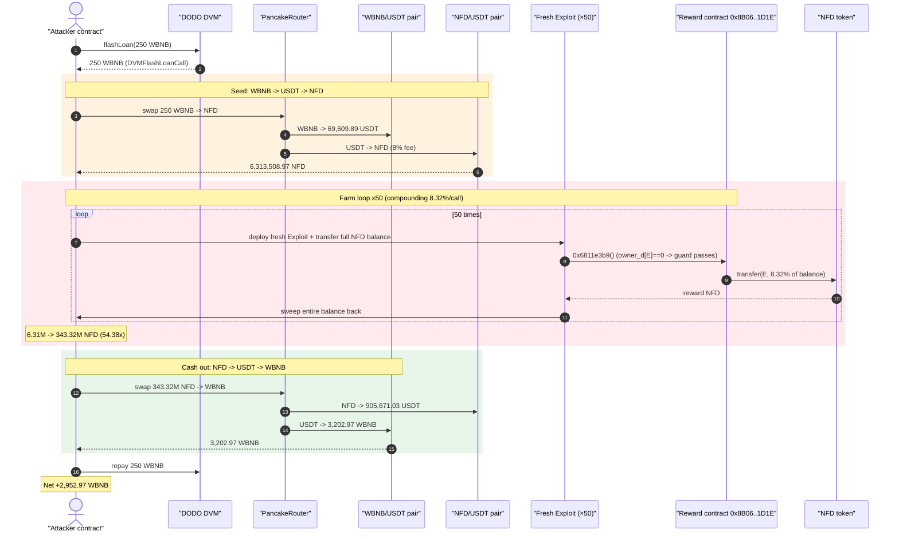
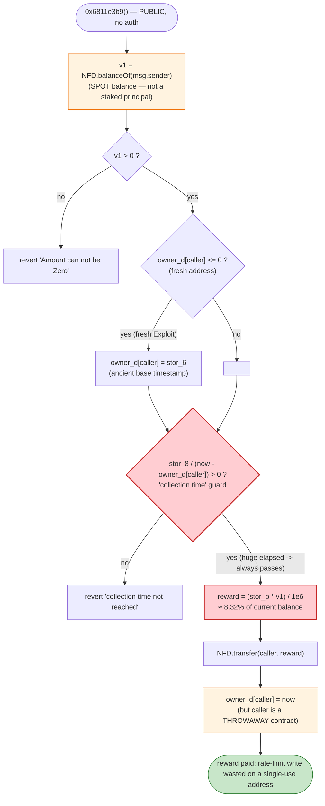
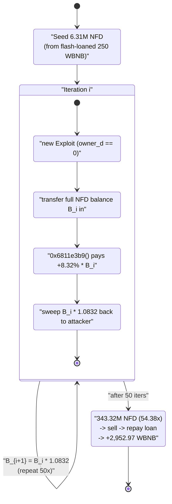

# NewFreeDAO (NFD) Exploit — Stateless, Self-Resetting Reward Lets a Borrowed Balance Be Compounded 50×

> **Vulnerability classes:** vuln/logic/reward-calculation · vuln/logic/missing-check

> **Reproduction:** the PoC compiles & runs in an isolated Foundry project at
> [this project folder](.) (the umbrella DeFiHackLabs repo contains many unrelated PoCs
> that do not whole-compile under `forge test`, so this one was extracted).
> Full verbose trace: [output.txt](output.txt).
> PoC source: [test/NewFreeDAO_exp.sol](test/NewFreeDAO_exp.sol).
> Verified third-party sources: [NFD token](sources/NFD_38C63A/NFD.sol),
> [DODO DVM (flash-loan source)](sources/DVM_D534fA/DVM.sol),
> [PancakeRouter](sources/PancakeRouter_10ED43/PancakeRouter.sol).
> The vulnerable reward contract itself is unverified on-chain; the PoC embeds a
> Heimdall-style decompilation of it ([test/NewFreeDAO_exp.sol:108-572](test/NewFreeDAO_exp.sol#L108-L572)).

---

## Key info

| | |
|---|---|
| **Loss** | ~125M USD headline (4,481 BNB across 3 attack txs). **This single reproduced tx (Tx1): +2,952.97 BNB net** (≈ $80–95M-class drain of the NFD reward reserve) |
| **Vulnerable contract** | NewFreeDAO "reward" contract — [`0x8B068E22E9a4A9bcA3C321e0ec428AbF32691D1E`](https://bscscan.com/address/0x8B068E22E9a4A9bcA3C321e0ec428AbF32691D1E) (unverified; decompiled) |
| **Reward asset / victim token** | NFD — [`0x38C63A5D3f206314107A7a9FE8cBBa29D629D4F9`](https://bscscan.com/address/0x38C63A5D3f206314107A7a9FE8cBBa29D629D4F9#code) |
| **Cash-out pool** | NFD/USDT PancakeSwap pair — [`0x26C0623847637095655B2868C3182B2285bDAeAf`](https://bscscan.com/address/0x26C0623847637095655B2868C3182B2285bDAeAf) |
| **Bridge pool** | WBNB/USDT PancakeSwap pair — [`0x16b9a82891338f9bA80E2D6970FddA79D1eb0daE`](https://bscscan.com/address/0x16b9a82891338f9bA80E2D6970FddA79D1eb0daE) |
| **Flash-loan source** | DODO DVM — [`0xD534fAE679f7F02364D177E9D44F1D15963c0Dd7`](https://bscscan.com/address/0xD534fAE679f7F02364D177E9D44F1D15963c0Dd7) |
| **Attacker EOA** | [`0x22c9736d4fc73a8fa0eb436d2ce919f5849d6fd2`](https://bscscan.com/address/0x22c9736d4fc73a8fa0eb436d2ce919f5849d6fd2) |
| **Attacker contract** | [`0xa35ef9fa2f5e0527cb9fbb6f9d3a24cfed948863`](https://bscscan.com/address/0xa35ef9fa2f5e0527cb9fbb6f9d3a24cfed948863) |
| **Attack tx (Tx1, reproduced)** | [`0x1fea385acf7ff046d928d4041db017e1d7ead66727ce7aacb3296b9d485d4a26`](https://bscscan.com/tx/0x1fea385acf7ff046d928d4041db017e1d7ead66727ce7aacb3296b9d485d4a26) (−2,952.97 BNB out of victim) |
| **Chain / block / date** | BSC / 21,140,434 / 2022-09-08 |
| **Compiler** | NFD token `v0.8.7` (optimizer off); DODO DVM `v0.6.9` (optimizer, 200 runs); reward contract unverified |
| **Bug class** | Broken reward accounting — stateless, externally-resettable per-caller cost basis enabling unbounded reward farming with borrowed (flash-loaned) principal |

---

## TL;DR

The NewFreeDAO "reward" contract (`0x8B06…1D1E`) pays out NFD tokens proportional to the
**caller's current NFD balance**, gated only by a "collection time" check that is keyed on a
**per-caller, never-meaningfully-initialized timestamp** `owner_d[caller]`. The reward function
`0x6811e3b9` ([test/NewFreeDAO_exp.sol:270-297](test/NewFreeDAO_exp.sol#L270-L297)) is **public, has
no access control, and never verifies that the caller actually staked, locked, or held the NFD for
any period of time.** It simply reads `balanceOf(caller)` *right now* and pays `≈ 8.32%` of it.

Because the gate is per-caller and a brand-new contract starts with `owner_d[caller] == 0` (which the
function then sets to the ancient base timestamp `stor_6`, making `block.timestamp − owner_d` enormous
and the collection check trivially pass), the attacker:

1. **Flash-borrows** 250 WBNB from DODO and swaps it (WBNB→USDT→NFD) into **6,313,508.97 NFD**.
2. Runs a **50-iteration loop**. In each iteration it deploys a *fresh* `Exploit` contract, moves the
   entire NFD balance into it, calls the reward function once (collecting `≈ 8.32%` of the moved
   balance as new NFD minted/paid from the reward reserve), then sweeps everything back.
3. The balance **compounds**: `6.31M × 1.0832^50 ≈ 343.32M NFD` — a **54.38× inflation** of the
   attacker's position, all funded out of the reward contract's NFD reserve.
4. **Dumps** all 343.32M NFD back through NFD→USDT→WBNB, repays the 250 WBNB flash loan, and walks
   away with **+2,952.97 WBNB net**.

No exchange-rate manipulation is needed. The reward contract literally hands out a fixed percentage of
*whatever you currently hold*, and a fresh address always satisfies the "you waited long enough" check.
The flash loan only supplies the seed principal — every reward beyond the seed is free money from the
reserve.

---

## Background — what NewFreeDAO is

NewFreeDAO is a BSC "DeFi / DAO" token (NFD, `0x38C6…D4F9`, an 8% fee-on-transfer reflection token — see
[NFD.sol](sources/NFD_38C63A/NFD.sol)) paired with a separate **reward / dividend contract**
(`0x8B06…1D1E`). The reward contract is the actual victim: it is funded with NFD and pays NFD rewards
to holders. Its bytecode is unverified on-chain, so the PoC works from a decompilation embedded as a
block comment ([test/NewFreeDAO_exp.sol:108-572](test/NewFreeDAO_exp.sol#L108-L572)). The decompilation
exposes the reward storage model:

| Storage slot | Decompiled name | Role |
|---|---|---|
| `STORAGE[0x3]` | `_isAirAddr` | The NFD token address — the reward asset (`balanceOf` / `transfer` target) |
| `STORAGE[0x6]` | `stor_6` | Base/start timestamp used to *initialize* a caller's cost basis |
| `STORAGE[0x7]` | `stor_7` | A timestamp branch selector (`block.timestamp > stor_7 ?`) |
| `STORAGE[0x8]` | `stor_8` | Numerator of the "collection time" divisor |
| `STORAGE[0xb]` | `stor_b` | Reward-rate multiplier (the `≈ 8.32%` constant after `/1e6`) |
| `STORAGE[0xd]` | `owner_d[caller]` | **Per-caller "last collected" timestamp — the only anti-abuse state** |

The reward function the attacker calls is selector **`0x6811e3b9`**
([test/NewFreeDAO_exp.sol:270-297](test/NewFreeDAO_exp.sol#L270-L297)). Its decompiled body, condensed:

```solidity
function 0x6811e3b9() public {                     // PUBLIC, no auth
    v1 = _isAirAddr.balanceOf(msg.sender);          // caller's CURRENT NFD balance
    require(v1 > 0, 'Amount can not be Zero');
    if (owner_d[msg.sender] <= 0) {
        owner_d[msg.sender] = stor_6;               // fresh caller → ancient base timestamp
    }
    v2 = _SafeDiv(stor_8, block.timestamp - owner_d[msg.sender]); // = stor_8 / elapsed
    require(v2 > 0, 'The collection time was not reached');
    v3 = 0;
    if (block.timestamp > stor_7) {                 // "warmup over" branch (taken here)
        if (v2 > 0) {
            v5 = stor_b * v1;                        // 0x3182 = SafeMath mul
            v3 = _SafeDiv(0xf4240, v5);              // = (stor_b * balance) / 1_000_000
        }
    } else if (v2 > 0) { ... }                       // time-scaled branch (not taken)
    _isAirAddr.transfer(msg.sender, v3);             // pay reward in NFD
    owner_d[msg.sender] = block.timestamp;           // mark collected — but on a THROWAWAY address
}
```

Note `_SafeDiv(a, b)` in this decompilation returns `b / a`
([test/NewFreeDAO_exp.sol:164-180](test/NewFreeDAO_exp.sol#L164-L180)), so `_SafeDiv(0xf4240, stor_b*v1)`
is `(stor_b * balance) / 1_000_000` — i.e. **`reward = (stor_b / 1e6) · balanceOf(caller)`.** The
attack measures this constant directly from the trace as **8.32%** (see accounting below).

---

## The vulnerable code

### 1. The reward is a flat percentage of *current* balance — no holding/lock requirement

```solidity
v1 = _isAirAddr.balanceOf(msg.sender);     // snapshot, not a staked/locked position
...
v5 = stor_b * v1;
v3 = (stor_b * v1) / 1_000_000;            // reward ≈ 8.32% of whatever you hold right now
_isAirAddr.transfer(msg.sender, v3);
```

There is no `stake()`/`deposit()` that records a principal, no lock period, no snapshot at an earlier
block, no per-account accrual ledger. The "yield" is computed against a **live, attacker-controlled
balance** that can be flash-loaned in and out within one transaction.

### 2. The only anti-abuse gate is a per-caller timestamp that a fresh address trivially passes

```solidity
if (owner_d[msg.sender] <= 0) {
    owner_d[msg.sender] = stor_6;          // fresh caller → ancient base timestamp
}
v2 = stor_8 / (block.timestamp - owner_d[msg.sender]);
require(v2 > 0, 'The collection time was not reached');
```

For a brand-new contract, `owner_d[msg.sender]` is `0`, so it is set to `stor_6` (a base timestamp set
far in the past at deployment). `block.timestamp − stor_6` is then a very large number, the division is
positive, and the "collection time was not reached" guard **passes immediately**. The function does
update `owner_d[msg.sender] = block.timestamp` at the end — but that write lands on a **single-use
`Exploit` contract that is never reused**, so the rate limit is defeated by simply creating a new
address each iteration.

### 3. The entry point is public

Selector `0x6811e3b9` is dispatched with no `onlyOwner`/role check
([test/NewFreeDAO_exp.sol:526-527](test/NewFreeDAO_exp.sol#L526-L527)); anyone can call it. (Contrast
the owner-gated mirror function `0x76fc7ac2`
([test/NewFreeDAO_exp.sol:305-334](test/NewFreeDAO_exp.sol#L305-L334)) which does the same payout for an
arbitrary address — the permissionless variant is what gets abused.)

---

## Root cause

The reward contract conflates **"how much you hold right now"** with **"how much you have earned the
right to be paid for."** Three design decisions compose into the bug:

1. **Stateless principal.** Reward is `≈ 8.32% × balanceOf(caller)` evaluated at call time, against a
   *spot* balance, not a recorded/locked stake. A balance acquired one instruction earlier (via swap or
   flash loan) is treated identically to a long-held position.

2. **Per-caller, externally-resettable rate limit.** The "collection time" guard is keyed on
   `owner_d[caller]`, which is `0` for any new address and gets initialized to an ancient base
   timestamp, so the guard is vacuous for fresh callers. The end-of-call write `owner_d[caller] =
   block.timestamp` is meant to enforce a cooldown, but it is **bypassed by using a different `caller`
   (a freshly deployed contract) every time.** The contract has no global rate limit and no notion of
   "this NFD was already farmed."

3. **No reentrancy/atomicity guard against compounding.** Because the reward is paid into the same
   balance that determines the next reward, repeatedly collecting on the *growing* balance compounds it
   geometrically (`1.0832^50 ≈ 54.4×`), all within a single atomic transaction funded by a flash loan
   that is repaid at the end.

The flash loan is **not** the vulnerability — it merely provides risk-free seed capital. Even without
it, anyone holding NFD could farm the reserve; the flash loan just lets the attacker do it with zero
of their own money and zero exposure.

---

## Preconditions

- The reward contract holds a large NFD reserve to pay out (it did — payouts of hundreds of thousands
  to tens of millions of NFD per call succeeded, see [output.txt](output.txt)).
- `_isAirAddr.balanceOf(caller) > 0` (`'Amount can not be Zero'`) — satisfied by acquiring NFD.
- `block.timestamp > stor_7` so the flat-rate branch is taken (true at the fork block).
- Each reward collection must come from a caller whose `owner_d` is still `0`/ancient — satisfied by
  deploying a fresh `Exploit` contract per iteration ([test/NewFreeDAO_exp.sol:70-75](test/NewFreeDAO_exp.sol#L70-L75)).
- Seed NFD to start the snowball — obtained by flash-borrowing 250 WBNB from DODO and swapping to NFD;
  fully repaid intra-transaction, so the attack is **flash-loanable with no principal at risk**.

---

## Step-by-step attack walkthrough (with on-chain numbers from the trace)

All figures are taken directly from the events/returns in [output.txt](output.txt). The seed swap routes
WBNB→USDT (in the WBNB/USDT pair `0x16b9…0daE`) then USDT→NFD (in the NFD/USDT pair `0x26C0…aeAf`).

| # | Step | Trace evidence | Result |
|---|------|----------------|--------|
| 0 | **Flash-borrow 250 WBNB** from DODO DVM | `DVM(dodo).flashLoan(0, 250e18, …)` → `DVMFlashLoanCall` ([test:50-53](test/NewFreeDAO_exp.sol#L50-L53)) | Attacker holds 250 WBNB (to repay later) |
| 1 | **Swap 250 WBNB → USDT** in WBNB/USDT pair | `Swap(amount1In: 250e18, amount0Out: 69,609.89 USDT)` ([output.txt:82](output.txt)) | 69,609.89 USDT |
| 2 | **Swap USDT → NFD** in NFD/USDT pair | `Swap(amount1In: 69,609.89 USDT, amount0Out: 6,862,509.75 NFD)`; after the token's 8% fee the attacker nets **6,313,508.97 NFD** ([output.txt:106](output.txt), [output.txt:113](output.txt)) | **Seed = 6,313,508.97 NFD** |
| 3 | **Loop ×50**: deploy fresh `Exploit`, transfer full NFD balance in, call reward `0x6811e3b9`, sweep back | [test:70-75](test/NewFreeDAO_exp.sol#L70-L75); iter 1 pays `+525,283.95 NFD` (8.32% of 6,313,508.97) ([output.txt:141](output.txt)); iter 50 pays `+26,370,480.55 NFD` ([output.txt grep](output.txt)) | Balance compounds **6.31M → 343,323,371.80 NFD** ([output.txt:2021](output.txt)) |
| 4 | **Swap all 343.32M NFD → USDT** (8% token fee burns part) | `Swap(amount0In: 243,759,593.97 NFD-effective, amount1Out: 905,671.03 USDT)` ([output.txt:2068](output.txt)) | 905,671.03 USDT |
| 5 | **Swap USDT → WBNB** | `Swap(amount0In: 905,671.03 USDT, amount1Out: 3,202.97 WBNB)` ([output.txt:2088](output.txt)) | Gross **3,202.97 WBNB** |
| 6 | **Repay flash loan** 250 WBNB to DODO | `WBNB.transfer(DODO, 250e18)` ([output.txt:2097](output.txt)) | — |
| 7 | **Net** | `Attacker's Net Profit: 2,952.97 WBNB` ([output.txt:2105](output.txt)) | **+2,952.97 WBNB** |

### The compounding curve (selected iterations)

The reward is a constant `8.32%` of the moved balance each call; with the proceeds folded back in, the
balance grows geometrically. Reward paid per iteration (NFD), from
`grep "from: vulnContractName.*to: Exploit"` over [output.txt](output.txt):

| Iter | Reward paid (NFD) | Running balance after (NFD) |
|---:|---:|---:|
| 1 | 525,283.95 | 6,838,792.92 |
| 2 | 568,987.57 | 7,407,780.49 |
| 10 | 1,078,380.41 | ~14.0M |
| 25 | 3,576,034.99 | ~46.5M |
| 40 | 11,858,548.40 | ~154M |
| 50 | 26,370,480.55 | **343,323,371.80** |

`6,313,508.97 × 1.0832^50 ≈ 54.38× = 343.32M NFD`, matching the trace exactly.

---

## Profit / loss accounting (this tx)

| Direction | Amount |
|---|---:|
| Borrowed (flash loan, in) | 250.00 WBNB |
| Seed acquired | 6,313,508.97 NFD |
| Reward farmed (50 calls, from reserve) | +336,809,862.82 NFD (343.32M − 6.51M) |
| NFD dumped → gross WBNB out | 3,202.97 WBNB |
| Flash loan repaid (out) | −250.00 WBNB |
| **Net profit** | **+2,952.97 WBNB** |

The entire 250-WBNB seed is recovered (it is round-tripped through the pools and the loan repaid). The
2,952.97 WBNB net is value extracted from the NFD reward reserve and from NFD/USDT pool liquidity as the
attacker's farmed NFD was sold. This is **Tx1**; the attacker repeated the pattern in Tx2/Tx3 for the
headline ~4,481 BNB total ([test:11-13](test/NewFreeDAO_exp.sol#L11-L13)).

---

## Diagrams

### Sequence of the attack



### The flaw inside the reward function



### Why it compounds: balance feeds the next reward



---

## Remediation

1. **Pay rewards against a recorded, locked principal — never a spot balance.** Require an explicit
   `stake()`/`deposit()` that snapshots the staked amount and the entry timestamp in contract storage,
   and compute rewards from *that* recorded position, not from `balanceOf(msg.sender)` read at claim
   time. This alone defeats the flash-loan and same-block compounding entirely.

2. **Make the cooldown global to the principal, not per-`msg.sender`.** Keying anti-abuse state on
   `owner_d[caller]` is defeated by deploying a fresh caller each call. Track accrual against the staked
   *position* (or require the reward to be claimable only once per principal per real time window), so
   creating new addresses provides no benefit.

3. **Initialize cost basis to "now", not to an ancient base timestamp.** Setting `owner_d[caller] =
   stor_6` (a far-past base) makes the "collection time" guard vacuous for any fresh address. A new
   participant's accrual must start at their first interaction (`block.timestamp`), so elapsed time is
   ~0 and no reward is immediately claimable.

4. **Add reentrancy/atomicity protection and a per-block claim cap.** Reward that is paid into the same
   balance used to size the next reward must not be re-claimable in the same transaction. A
   `nonReentrant` guard plus "one claim per address per block" prevents the geometric compounding loop.

5. **Bound total payout and validate solvency.** Cap rewards as a fraction of a real, time-based accrual
   schedule and revert if a single transaction would drain a disproportionate share of the reserve — a
   54× balance inflation in one tx should be impossible by construction.

---

## How to reproduce

The PoC was extracted into a standalone Foundry project (the umbrella DeFiHackLabs repo has many
unrelated PoCs that fail to compile under `forge test`'s whole-project build):

```bash
_shared/run_poc.sh 2022-09-NewFreeDAO_exp --mt testExploit -vvvvv
```

- RPC: a **BSC archive** endpoint is required (fork block 21,140,434 is from 2022 and is pruned by most
  public BSC RPCs). The seed/cash-out routes and the reward reserve must be readable at that block.
- Result: `[PASS] testExploit()` with `Attacker's Net Profit: 2952.971303206254291601`.

Expected tail (from [output.txt](output.txt)):

```
Ran 1 test for test/NewFreeDAO_exp.sol:Attacker
[PASS] testExploit() (gas: 75999504)
Logs:
  ---------- Reproduce Attack Tx1 ----------
  Flashloan 250 WBNB from DODO DLP...
  Swap 250 WBNB to NFD...
  [*] NFD balance before attack: 6313508.973101744640040048
  Abuse the Reward Contract...
  [*] NFD balance after attack: 343323371.795084477753627468
  Swap the profit...
  Repay the flashloan...
  Attacker's Net Profit: 2952.971303206254291601

Suite result: ok. 1 passed; 0 failed; 0 skipped
```

---

*References (from the PoC header, [test/NewFreeDAO_exp.sol:19-24](test/NewFreeDAO_exp.sol#L19-L24)):*
*PeckShield, Beosin, BlockSec, SlowMist, CertiK incident threads (NewFreeDAO / NFD, BSC, 2022-09-08).*
