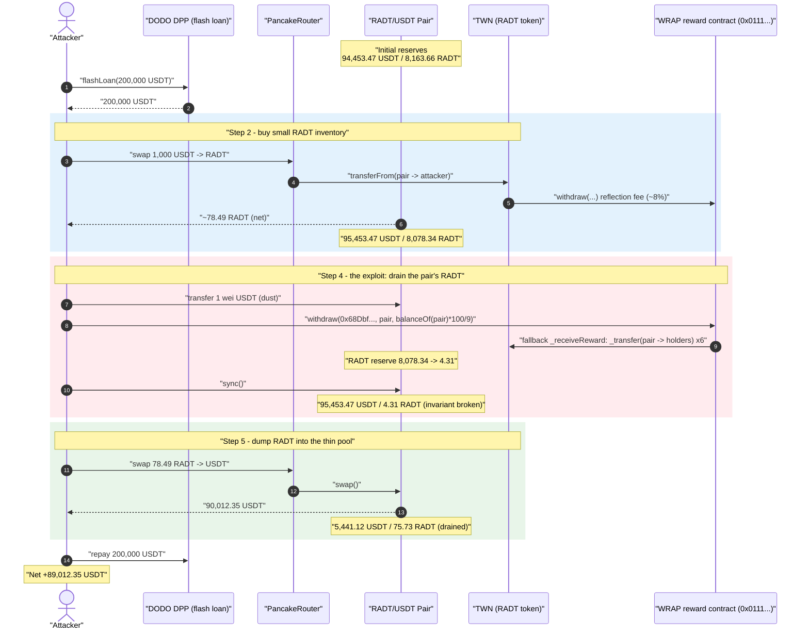
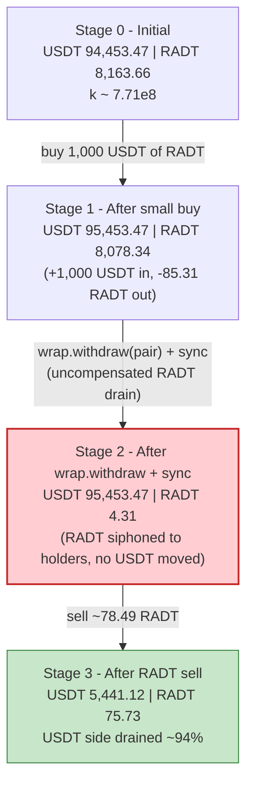
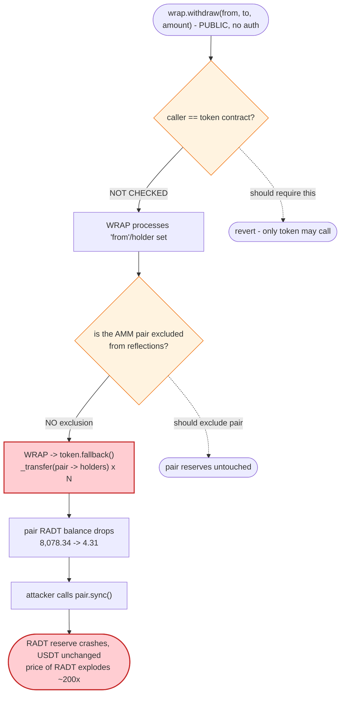

# RADT (RADT-DAO / "Dream plan" TWN) Exploit — Permissionless Reward `withdraw()` Drains the LP Pair's Token Reserve

> **Vulnerability classes:** vuln/access-control/missing-auth · vuln/defi/slippage

> **Reproduction:** the PoC compiles & runs in an isolated Foundry project at
> [this project folder](.) (the umbrella DeFiHackLabs repo bundles many unrelated
> PoCs that do not whole-compile under `forge test`, so this one was extracted).
> Full verbose trace: [output.txt](output.txt).
> Verified vulnerable source: [sources/TWN_DC8Cb9/TWN.sol](sources/TWN_DC8Cb9/TWN.sol).

---

## Key info

| | |
|---|---|
| **Loss** | ~$89,012 — **89,012.35 USDT** extracted from the RADT/USDT PancakeSwap pair (net of the 200,000 USDT flash-loan repayment) |
| **Vulnerable contract** | `TWN` (token `RADT-DAO`) — [`0xDC8Cb92AA6FC7277E3EC32e3f00ad7b8437AE883`](https://bscscan.com/address/0xDC8Cb92AA6FC7277E3EC32e3f00ad7b8437AE883#code) |
| **Reward "WRAP" contract abused** | proxy [`0x01112eA0679110cbc0ddeA567b51ec36825aeF9b`](https://bscscan.com/address/0x01112eA0679110cbc0ddeA567b51ec36825aeF9b) → impl `0x9122191d7B2CCF11a2600de4eafD6b8cD3D03a62` |
| **Victim pool** | RADT/USDT PancakeSwap V2 pair — [`0xaF8fb60f310DCd8E488e4fa10C48907B7abf115e`](https://bscscan.com/address/0xaF8fb60f310DCd8E488e4fa10C48907B7abf115e) |
| **Flash-loan source** | DODO DPP pool `DPPAdvanced` — `0xDa26Dd3c1B917Fbf733226e9e71189ABb4919E3f` (200,000 USDT, fee-free) |
| **Attacker (PoC test contract)** | `0x7FA9385bE102ac3EAc297483Dd6233D62b3e1496` |
| **Holder address fed to `withdraw`** | `0x68Dbf1c787e3f4C85bF3a0fd1D18418eFb1fb0BE` |
| **Chain / fork block / date** | BSC / 21,572,418 / Sep 2022 |
| **Compiler (token)** | Solidity v0.8.15, optimizer **1 run** |
| **Bug class** | Permissionless external "reflection/reward" hook that can move *any* holder's balance — used to drain the LP pair's reserve (broken AMM invariant) |

---

## TL;DR

`TWN` (the `RADT-DAO` token) is a reflection-style token. Every `transfer` / `transferFrom`
hands control to an **external, permissionless reward contract** via
`_wrap.withdraw(from, to, amount)`
([sources/TWN_DC8Cb9/TWN.sol:152-168](sources/TWN_DC8Cb9/TWN.sol#L152-L168)). That
`WRAP` contract (`0x0111…`) is the thing that actually performs the fee-on-transfer / reward
redistribution by moving RADT around between holders.

The fatal flaw is that **`WRAP.withdraw(from, to, amount)` is callable directly by anyone with
arbitrary arguments.** Nothing restricts the caller to the token contract, and nothing prevents
`from`/`to` from being the AMM pair. The attacker calls
`wrap.withdraw(<any holder>, <the RADT/USDT pair>, amount)` with a deliberately oversized `amount`
(`amount = RADT.balanceOf(pair) * 100 / 9`), and the WRAP responds by **transferring the pair's RADT
balance out to other holders as "rewards"** — an *un-compensated* deletion of one side of the pool.
A subsequent `pair.sync()` bakes the depleted RADT reserve in as ground truth.

The attacker:

1. Flash-borrows **200,000 USDT** from a DODO DPP pool (no fee).
2. Buys a small amount of RADT (1,000 USDT → ~78.49 RADT after the 8% reflection fee) to hold inventory.
3. Sends **1 wei USDT** to the pair (dust, to nudge balances).
4. Calls **`wrap.withdraw(0x68Dbf…, pair, RADT.balanceOf(pair)*100/9)`** — this drains the pair's RADT
   reserve from **8,078.34 RADT → 4.31 RADT** by redistributing it to holders. Then calls `pair.sync()`.
5. **Sells its ~78.49 RADT** into the now-degenerate pool. With the RADT reserve crushed to ~4.31
   (then ~75.73 after the inbound sell), the pool pays out **90,012.35 USDT**.
6. Repays the 200,000 USDT flash loan and keeps **89,012.35 USDT** profit.

---

## Background — what `TWN` / RADT does

`TWN` ([sources/TWN_DC8Cb9/TWN.sol](sources/TWN_DC8Cb9/TWN.sol)) is a minimal ERC-20 with one unusual
design choice: it externalizes its reflection/reward logic to a separate "WRAP" contract held in the
private immutable-ish field `_wrap`:

```solidity
IWRAP private _wrap = IWRAP(0x01112eA0679110cbc0ddeA567b51ec36825aeF9b);
```
([sources/TWN_DC8Cb9/TWN.sol:42](sources/TWN_DC8Cb9/TWN.sol#L42))

On **every** balance movement the token calls into that WRAP:

```solidity
function transfer(address to, uint256 amount) public returns (bool) {
    address owner = _msgSender();
    _transfer(owner, to, amount);
    _wrap.withdraw(owner, to, amount);   // ← external reward hook on every transfer
    return true;
}

function transferFrom(address from, address to, uint256 amount) public returns (bool) {
    address spender = _msgSender();
    _spendAllowance(from, spender, amount);
    _transfer(from, to, amount);
    _wrap.withdraw(from, to, amount);    // ← same hook
    return true;
}
```
([sources/TWN_DC8Cb9/TWN.sol:152-168](sources/TWN_DC8Cb9/TWN.sol#L152-L168))

The WRAP contract performs the actual "reflection" — when an account transfers, the WRAP redistributes
some RADT among holders (the trace shows ~8% being skimmed and spread across several holder addresses on
each transfer). To do that the WRAP must be able to move RADT out of arbitrary accounts, so the token
exposes a privileged callback path: the WRAP can re-enter the token through its `fallback()` using two
magic function selectors and move balances directly via `_transfer`:

```solidity
function _receiveReward() internal {
    bytes4 funcSign; address f; address t; uint a;
    assembly {
        funcSign := calldataload(0)
        f := calldataload(4)
        t := calldataload(36)
        a := calldataload(68)
    }
    if (funcSign == 0x8987a46b || funcSign == 0x4f8f4dab) {
        _transfer(f, t, a);              // ← WRAP can move ANY (f → t) balance
    }
}

fallback() external {
    require(address(_wrap) == _msgSender());   // only the WRAP may call back
    _receiveReward();
}
```
([sources/TWN_DC8Cb9/TWN.sol:170-198](sources/TWN_DC8Cb9/TWN.sol#L170-L198))

(The selector `0x4f8f4dab` is also the one that *suppresses* the `Transfer` event in `_transfer`, line
104 — these are the silent "reflection" moves you see as `unsafeTransfer` in the trace.)

On-chain state at the fork block (read from the trace's `getReserves`/`balanceOf` calls):

| Parameter | Value | Source |
|---|---|---|
| Pair `token0` | **USDT** `0x55d3…` | reserve0 moves with USDT |
| Pair `token1` | **RADT** `0xDC8C…` | reserve1 moves with RADT |
| Pool reserve0 (USDT) | **94,453.47 USDT** | [output.txt:50](output.txt#L50) |
| Pool reserve1 (RADT) | **8,163.66 RADT** | [output.txt:50](output.txt#L50) |
| RADT reflection fee | **~8%** per transfer | [output.txt:54-77](output.txt#L54-L77) |
| Flash-loan size | **200,000 USDT** (fee-free DODO) | [output.txt:29](output.txt#L29) |

The pool is small (~94k USDT / 8.1k RADT) — but it is the entire prize, because the attacker can make the
RADT side of it disappear on demand.

---

## The vulnerable code

There are two cooperating defects.

### 1. The reward move is permissionless and target-agnostic

`WRAP.withdraw(from, to, amount)` (proxy `0x0111…` → impl `0x9122…`) has **no access control**. It does
not check that its caller is the token contract, and it does not exclude the AMM pair from being treated
as a "holder" whose balance gets redistributed. Anyone can invoke it with any `(from, to, amount)`. In the
trace the attacker calls it directly:

```solidity
// inside the flash-loan callback (test/RADT_exp.sol)
uint256 amount = RADT.balanceOf(address(pair)) * 100 / 9;
wrap.withdraw(address(0x68Dbf1c787e3f4C85bF3a0fd1D18418eFb1fb0BE), address(pair), amount);
pair.sync();
```
([test/RADT_exp.sol:42-44](test/RADT_exp.sol#L42-L44))

When invoked, the WRAP loops over its holder set and **moves RADT out of the pair** (the `from`/processed
account) into the other holders via the silent `_transfer` callback. The trace shows six
`TWN::unsafeTransfer(from: pair → holder)` events ([output.txt:129-164](output.txt#L129-L164)), each one
strictly *reducing the pair's RADT balance*, none of them touching the pair's USDT side.

### 2. The token trusts the WRAP to move balances arbitrarily

The token's `fallback()` lets the WRAP call `_transfer(f, t, a)` for **any** `f` and `t`
([sources/TWN_DC8Cb9/TWN.sol:181-183](sources/TWN_DC8Cb9/TWN.sol#L181-L183)). So once the attacker has
control of the WRAP's externally-callable `withdraw`, the WRAP becomes a fully-authorized mover of
*everyone's* RADT — including the liquidity pool's. There is no notion of "the pool is special; never
redistribute its reserves."

The result, as recorded by the pair's own `Sync` events:

```
Sync(reserve0: 95,453.47 USDT, reserve1: 8,078.34 RADT)   // after the small buy   [output.txt:95]
...withdraw drains RADT out of the pair...
Sync(reserve0: 95,453.47 USDT, reserve1:     4.31 RADT)   // after withdraw+sync   [output.txt:175]
```

USDT untouched, RADT annihilated — `x·y = k` collapses in the attacker's favor.

---

## Root cause — why it was possible

A reflection token must, by design, be able to move balances *on behalf of* holders to pay out
reflections. RADT implemented that by (a) routing every transfer through an external WRAP contract and
(b) giving that WRAP an unrestricted `_transfer(from, to, amount)` callback into the token. The two
together would only be safe if the WRAP itself were tightly controlled. It was not:

> **`WRAP.withdraw(from, to, amount)` is a public function with no caller check and no exclusion of the
> AMM pair.** An attacker calls it directly, names the RADT/USDT pair as the account to "process," and the
> WRAP dutifully redistributes the pair's RADT reserve to other holders — for free.

Concretely, the design decisions that compose into a critical bug:

1. **Externalized, permissionless reward logic.** `WRAP.withdraw` can be called by anyone, not just by the
   token during a legitimate transfer. The attacker, not the protocol, chooses *when* and *on whom* a
   redistribution fires.
2. **No LP-pair exclusion.** Reflection tokens normally exclude the AMM pair from reflections precisely so
   that reflections cannot silently change pool reserves. RADT's WRAP did not — so the pair was a valid
   redistribution victim.
3. **Unbounded `amount`, attacker-chosen.** `amount = balanceOf(pair) * 100 / 9` is sized to push the
   WRAP's redistribution to skim essentially the *entire* RADT balance of the pair (8,078 → 4.31).
4. **`sync()` makes the theft permanent.** After the off-book RADT drain, `pair.sync()` records the new
   (tiny) RADT reserve as truth, so the next swap prices RADT astronomically and pays out the full USDT
   side. AMM pairs enforce `x·y ≥ k` only inside `swap()`; `sync()` blindly trusts current balances.

The 8% reflection fee — which might have clawed value back on the attacker's own buy/sell — is negligible
relative to the ~200x mispricing the reserve drain creates, so it is just a rounding cost.

---

## Preconditions

- The RADT/USDT PancakeSwap pair holds meaningful USDT liquidity (here ~94.5k USDT) and RADT
  (~8.1k RADT) — the USDT side is the prize.
- The WRAP contract (`0x0111…`) is live and its `withdraw(from, to, amount)` is externally callable
  by anyone. (It is — the PoC calls it directly with no special privileges.)
- Working USDT capital to (a) buy a little RADT inventory and (b) provide the swap input. Both are
  supplied by a **fee-free 200,000 USDT flash loan** from a DODO DPP pool
  ([test/RADT_exp.sol:34](test/RADT_exp.sol#L34)), fully repaid in the same transaction — so the attack
  needs **zero starting capital**.

---

## Attack walkthrough (with on-chain numbers from the trace)

The pair's `token0 = USDT`, `token1 = RADT`, so `reserve0 = USDT`, `reserve1 = RADT`. All figures below
come directly from the `getReserves` / `Sync` / `Swap` events in [output.txt](output.txt).

| # | Step | Pair USDT | Pair RADT | Effect |
|---|------|----------:|----------:|--------|
| 0 | **Initial** ([:50](output.txt#L50)) | 94,453.47 | 8,163.66 | Honest pool. |
| 1 | **Flash-borrow** 200,000 USDT from DODO ([:29](output.txt#L29)) | 94,453.47 | 8,163.66 | Attacker now holds 200k USDT; pool unchanged. |
| 2 | **Buy** 1,000 USDT → 78.49 RADT (8% reflection fee; gross 85.31) ([:53-96](output.txt#L53-L96)) | 95,453.47 | 8,078.34 | Attacker holds ~78.49 RADT inventory. |
| 3 | **Dust** transfer 1 wei USDT → pair ([:105](output.txt#L105)) | 95,453.47 (+1 wei) | 8,078.34 | Nudges pair USDT balance. |
| 4 | **`wrap.withdraw(0x68Dbf…, pair, 89,759.38)`** → redistributes pair's RADT to holders ([:113-168](output.txt#L113-L168)); then `sync()` ([:170-175](output.txt#L170-L175)) | 95,453.47 | **4.31** | **Invariant broken:** RADT reserve drained ~99.95%, USDT untouched. |
| 5 | **Sell** 78.49 RADT into the thin pool ([:181-245](output.txt#L181-L245)); pair RADT rises to 75.73 on the way in, pays out USDT | **5,441.12** | 75.73 | Pool pays **90,012.35 USDT** out. |
| 6 | **Repay** 200,000 USDT to DODO ([:252](output.txt#L252)) | — | — | Loan cleared. |

**Why the sell pays ~90k USDT for ~78 RADT:** after step 4 the pool prices RADT against a reserve of only
~4.31 RADT while still holding ~95.5k USDT. PancakeSwap's `getAmountOut` is
`out = (in·9975·reserveOut)/(reserveIn·10000 + in·9975)`. With `reserveOut = 95,453 USDT` and a tiny
`reserveIn`, even ~71.4 RADT of effective input (after fee) sweeps **~94%** of the USDT reserve out
(90,012 of 95,453). The reserve drain in step 4 is what makes RADT effectively priceless and the USDT
free for the taking.

### Profit accounting (USDT)

| Direction | Amount |
|---|---:|
| Borrowed (DODO flash loan) | 200,000.00 |
| Spent — buy RADT inventory | 1,000.00 |
| Spent — dust to pair | 0.000000000000000001 |
| Received — final RADT sell | 90,012.35 |
| Repaid — DODO flash loan | 200,000.00 |
| **Net profit** | **+89,012.35** |

Confirmed by the test logs: attacker USDT `0 → 89,012.349392513312896021`
([output.txt:7-8, 274-275](output.txt#L274-L275)).

---

## Diagrams

### Sequence of the attack



### Pool state evolution



### The flaw: how a public reward call moves the pool's reserve



---

## Why each magic number

- **`flashLoan(0, 200_000e18)` (DODO):** free working capital. Only ~1,000 USDT is actually spent on the
  buy; the rest is headroom and is repaid in full.
- **Buy `1000 * 1e18` USDT:** acquires a small RADT inventory (~78.49 RADT net of the 8% reflection fee)
  to dump after the reserve is crushed. It needs only to be large enough to receive a meaningful USDT
  payout against the post-drain reserve.
- **`USDT.transfer(pair, 1)` (1 wei):** a dust nudge to the pair's USDT balance ahead of `sync()`; it has
  no economic effect but keeps the reserve bookkeeping consistent.
- **`amount = RADT.balanceOf(pair) * 100 / 9`:** an over-large redistribution target. Because the WRAP
  pays reflections proportionally, asking it to process ~11.1x the pair's RADT balance forces it to skim
  essentially the entire RADT reserve (8,078.34 → 4.31), maximizing the price dislocation. The exact
  `100/9` factor is tuned to the WRAP's distribution formula.

---

## Remediation

1. **Restrict the reward hook to the token.** `WRAP.withdraw(from, to, amount)` must verify
   `msg.sender == tokenAddress` (or be `internal`/role-gated). A reflection mover that anyone can call on
   anyone's balance is a universal theft primitive.
2. **Exclude the AMM pair (and other protocol-critical accounts) from reflections.** Standard reflection
   tokens maintain an `isExcludedFromRewards` set and never redistribute LP-pair balances — precisely so
   reflections cannot mutate pool reserves out from under `x·y = k`.
3. **Do not expose an unrestricted `_transfer(from, to, amount)` callback.** The token's
   `fallback()/_receiveReward()` path lets the WRAP move *any* account's balance. Even with caller checks
   on the token side, the privilege should be scoped (e.g., only move the *sender's* balance for the
   in-flight transfer, never an arbitrary third party such as the pair).
4. **Never let off-book balance changes + `sync()` reprice a pool.** Any mechanism that can change a
   pair's token balance outside of `mint`/`burn`/`swap` is dangerous: an attacker can drain a reserve and
   then `sync()` to lock in the mispricing. If "reflections reach the pool" is a product requirement,
   implement it so both reserves move together (via the pair's own `burn()`), preserving `k`.
5. **Cap single-operation reserve impact.** A reflection move that wipes ~99.95% of one side of a pool in
   a single call should be impossible; bound per-call redistribution to a small fraction of any single
   holder's balance.

---

## How to reproduce

The PoC was extracted into a standalone Foundry project (the umbrella DeFiHackLabs repo bundles several
unrelated PoCs that fail to whole-compile under `forge test`):

```bash
_shared/run_poc.sh 2022-09-RADT_exp --mt testExploit -vvvvv
```

- RPC: a **BSC archive** endpoint is required (fork block 21,572,418 is old). `foundry.toml` uses
  `https://bsc-mainnet.public.blastapi.io`, which serves historical state at that block; most public BSC
  RPCs prune it and fail with `header not found` / `missing trie node`.
- Result: `[PASS] testExploit()` with the attacker's USDT balance going from `0` to
  `89,012.349392513312896021`.

Expected tail:

```
Ran 1 test for test/RADT_exp.sol:ContractTest
[PASS] testExploit() (gas: 645039)
Logs:
  [Start] Attacker USDT balance before exploit: 0.000000000000000000
  [End] Attacker USDT balance after exploit: 89012.349392513312896021

Suite result: ok. 1 passed; 0 failed; 0 skipped
```

---

*Reference: SlowMist Hacked / DeFiHackLabs — RADT (RADT-DAO, BSC), ~$89K, September 2022. Root cause: a
permissionless external reflection/reward `withdraw()` that could redistribute the LP pair's token reserve.*
