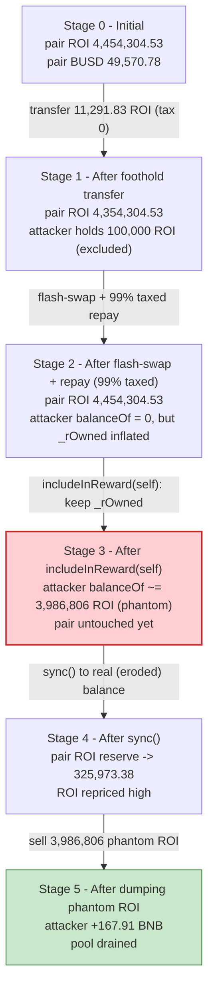
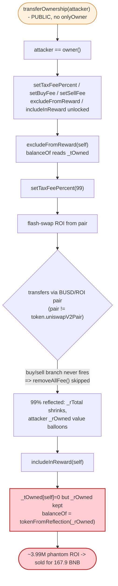

# ROI Token Exploit — Missing `onlyOwner` on `transferOwnership` → Reflection-Accounting Mint

> **Reproduction:** the PoC compiles & runs in an isolated Foundry project at
> [this project folder](.) (the umbrella DeFiHackLabs repo contains many unrelated
> PoCs that fail to whole-compile, so this one was extracted).
> Full verbose trace: [output.txt](output.txt).
> Verified vulnerable source: [ROIToken.sol](sources/ROIToken_E48b75/ROIToken.sol).

---

## Key info

| | |
|---|---|
| **Loss** | ~157.98 BNB (~$44,000) — gross attacker balance delta in the PoC: **+163.33 BNB** (5 → 168.33 BNB) |
| **Vulnerable contract** | `ROIToken` — [`0xE48b75dc1b131fd3A8364b0580f76eFD04cF6e9c`](https://bscscan.com/address/0xE48b75dc1b131fd3A8364b0580f76eFD04cF6e9c#code) |
| **Victim pool** | BUSD/ROI PancakeSwap pair — [`0x745D6Dd206906dd32b3f35E00533AD0963805124`](https://bscscan.com/address/0x745D6Dd206906dd32b3f35E00533AD0963805124) |
| **Attacker EOA** | [`0x91b7f203ed71c5eccf83b40563e409d2f3531114`](https://bscscan.com/address/0x91b7f203ed71c5eccf83b40563e409d2f3531114) |
| **Attacker contract** | [`0x158af3d23d96e3104bcc65b76d1a6f53d0f74ed0`](https://bscscan.com/address/0x158af3d23d96e3104bcc65b76d1a6f53d0f74ed0) |
| **Attack tx** | [`0x0e14cb7eabeeb2a819c52f313c986a877c1fa19824e899d1b91875c11ba053b0`](https://bscscan.com/tx/0x0e14cb7eabeeb2a819c52f313c986a877c1fa19824e899d1b91875c11ba053b0) |
| **Chain / block / date** | BSC / fork at 21,143,795 / Sept 8, 2022 |
| **Compiler** | Solidity v0.8.4, optimizer **enabled (200 runs)** |
| **Bug class** | Broken access control (un-guarded `transferOwnership`) chained with a reflection-token (RFI) accounting flaw |

---

## TL;DR

`ROIToken` is a SafeMoon-style "reflection" (RFI) token. Its `Ownable.transferOwnership()`
is **missing the `onlyOwner` modifier** ([ROIToken.sol:181-185](sources/ROIToken_E48b75/ROIToken.sol#L181-L185)),
so **anyone can become owner** of the token. As owner the attacker gains full control of the
fee parameters (`setTaxFeePercent`, `setBuyFee`, `setSellFee`) and of the reward-exclusion lists
(`excludeFromReward` / `includeInReward`).

The attacker then weaponizes the token's own reflection bookkeeping. In RFI tokens a holder's
balance is stored two different ways depending on whether the holder is "excluded from reward":

- **Excluded** → balance read from `_tOwned[account]` (a raw token amount).
- **Included** → balance read from `tokenFromReflection(_rOwned[account])` (a *reflected* amount that
  is divided by a global rate).

`includeInReward()` flips an account back to "included" but **zeroes only `_tOwned`, leaving the
inflated `_rOwned` untouched** ([ROIToken.sol:655-666](sources/ROIToken_E48b75/ROIToken.sol#L655-L666)).
By being excluded while paying a 99 % "tax" on a flash-loaned amount — which credits the attacker's
`_rOwned` with a huge reflected balance — and then calling `includeInReward(self)`, the attacker
makes `balanceOf(self)` jump from **0** back up to **~3.99 M ROI conjured out of the reflection
ledger**. Those phantom tokens are sold into the pool for 167.9 BNB.

Net result: starting with 5 BNB, the attacker walks away with **168.33 BNB** — draining ~158 BNB
of real liquidity from the BUSD/ROI pool.

---

## Background — what ROIToken does

`ROIToken` ([source](sources/ROIToken_E48b75/ROIToken.sol)) is a fork of the SafeMoon "reflection"
token family with extra buy-back / auto-LP machinery bolted on. The relevant mechanics:

- **Dual balance representation.** Total supply is mirrored in a hugely-scaled "reflection" space.
  `_rTotal = (MAX - (MAX % _tTotal))` ([:437](sources/ROIToken_E48b75/ROIToken.sol#L437)), and each
  holder's reflected balance lives in `_rOwned`. The conversion rate
  `_getRate() = rSupply / tSupply` shrinks every time fees are reflected, so an *unchanged* `_rOwned`
  represents *more* tokens over time. Excluded accounts are carved out of this and tracked in raw
  `_tOwned` instead ([balanceOf, :567-570](sources/ROIToken_E48b75/ROIToken.sol#L567-L570)).
- **Configurable fees.** A base `_taxFee` plus separate buy/sell tax & liquidity fees. The owner can
  set all of them at will (`setTaxFeePercent`, `setBuyFee`, `setSellFee`, `setLiquidityFeePercent`).
- **Reward exclusion lists.** `excludeFromReward` / `includeInReward` move an account between the
  reflected and raw accounting modes.

On-chain parameters at the fork block:

| Parameter | Value |
|---|---|
| `_decimals` | 9 |
| `_tTotal` (total supply) | 50,000,000 ROI |
| `_taxFee` (base, before attack) | 2 % |
| Token's configured `uniswapV2Pair` | the **ROI/WBNB** pair (created against WETH at construction, [:537-538](sources/ROIToken_E48b75/ROIToken.sol#L537-L538)) |
| BUSD/ROI pair reserves (the victim) | ≈ 4,454,304 ROI / 49,570 BUSD |

A subtle but load-bearing fact: the token's `uniswapV2Pair` is the **ROI/WBNB** pair, but the
attacker operates against the **BUSD/ROI** pair. Because the buy/sell fee branches in `_transfer`
only trigger when `from`/`to == uniswapV2Pair` ([:755-765](sources/ROIToken_E48b75/ROIToken.sol#L755-L765)),
no transfer through the BUSD/ROI pair ever hits `removeAllFee()` — so the global `_taxFee` the
attacker sets to **99** applies to those transfers verbatim.

---

## The vulnerable code

### 1. `transferOwnership` is missing `onlyOwner`

```solidity
// ROIToken.sol:176-185
function renounceOwnership() public virtual onlyOwner {       // ← guarded
    emit OwnershipTransferred(_owner, address(0));
    _owner = address(0);
}

function transferOwnership(address newOwner) public virtual { // ⚠️ NO onlyOwner!
    require(newOwner != address(0), "Ownable: new owner is the zero address");
    emit OwnershipTransferred(_owner, newOwner);
    _owner = newOwner;                                        // ← anyone can seize ownership
}
```

`renounceOwnership`, `lock`, and every setter carry `onlyOwner`. `transferOwnership` does not.
This single missing modifier hands the entire admin surface to any caller.

### 2. `includeInReward` zeroes `_tOwned` but keeps the inflated `_rOwned`

```solidity
// ROIToken.sol:655-666
function includeInReward(address account) external onlyOwner() {
    require(_isExcluded[account], "Account is not excluded");
    for (uint256 i = 0; i < _excluded.length; i++) {
        if (_excluded[i] == account) {
            _excluded[i] = _excluded[_excluded.length - 1];
            _tOwned[account] = 0;          // ⚠️ raw balance wiped...
            _isExcluded[account] = false;  // ⚠️ ...but balanceOf now reads _rOwned!
            _excluded.pop();
            break;
        }
    }
}
```

```solidity
// ROIToken.sol:567-570  — the balance switch
function balanceOf(address account) public view override returns (uint256) {
    if (_isExcluded[account]) return _tOwned[account];
    return tokenFromReflection(_rOwned[account]);   // ← reads the *kept* _rOwned
}
```

While an account is excluded its `_rOwned` is irrelevant to `balanceOf`. `includeInReward` flips
`_isExcluded` to `false` *and* discards `_tOwned`, so the account's balance instantly becomes
`tokenFromReflection(_rOwned)`. If `_rOwned` was inflated while the account was excluded, that
inflation materializes as spendable tokens the moment it is re-included.

### 3. The 99 % "tax" credits `_rOwned` via reflection

When the attacker (excluded sender, the pair as recipient — neither equal to the token's
`uniswapV2Pair`) transfers ROI with `_taxFee = 99`, `_getTValues` computes `tFee = 99 %` and only
1 % is delivered. `_getRValues` multiplies through by the current rate, and `_reflectFee` shrinks
`_rTotal` ([:923-947](sources/ROIToken_E48b75/ROIToken.sol#L923-L947)). Shrinking `_rTotal`
*raises the value of every remaining `_rOwned`* — including the attacker's, which (because it was
credited the full flash-loaned `_rOwned` on receipt and only debited 1 % on send) is left enormous.

---

## Root cause — why it was possible

Two independent flaws compose into a clean drain:

1. **Broken access control (primary).** `transferOwnership` lacks `onlyOwner`. Ownership of a live
   token is a single `transferOwnership(attacker)` call away. Once owner, the attacker can rewrite
   every fee and toggle every account's reward-exclusion state.

2. **Asymmetric reflection bookkeeping (the amplifier).** The standard SafeMoon-derived
   `excludeFromReward`/`includeInReward` pair never reconciles `_rOwned` against `_tOwned` on
   *re-inclusion*. `excludeFromReward` snapshots `_tOwned = tokenFromReflection(_rOwned)`, but
   `includeInReward` just sets `_tOwned = 0` and trusts the stale `_rOwned`. The accounting is
   therefore path-dependent: an account that accrues reflection while excluded "double-counts" it
   on the way back in.

The attacker bridges these with a PancakeSwap **flash swap** so that no real capital is at risk:
borrow ROI from the BUSD/ROI pair, route it so the attacker's `_rOwned` balloons under a 99 % tax,
repay the loan with the 1 %-delivered remainder, then `includeInReward(self)` to convert the
ballooned `_rOwned` into ~4 M ROI of phantom balance, and dump it for BNB.

---

## Preconditions

- `transferOwnership` callable by anyone (no `onlyOwner`) — always true for this contract.
- Owner-only setters (`setTaxFeePercent`, `setBuyFee`, `setSellFee`, `excludeFromReward`,
  `includeInReward`) — reachable once ownership is seized.
- A pool to flash-loan ROI from and to dump phantom ROI into (the BUSD/ROI pair).
- Working capital: only **5 BNB** of seed (to buy the initial 100 k ROI used as a foothold). The
  ROI used to balloon `_rOwned` is **flash-loaned** and repaid in the same transaction, so the
  attack is effectively self-funded.

---

## Attack walkthrough (with on-chain numbers from the trace)

All figures are read directly from [output.txt](output.txt). ROI has 9 decimals; BUSD/WBNB have 18.
The PancakeSwap `Attacker` contract is `0x7FA9385b…` in the PoC (the historical attacker contract
was `0x158af3…`). The BUSD/ROI pair is `reserve0 = ROI`, `reserve1 = BUSD`.

| # | Step | Trace ref | ROI / BUSD effect |
|---|------|-----------|-------------------|
| 0 | **Seed buy.** Swap 5 BNB → BUSD → ROI, receiving **111,291.83 ROI**. | [output.txt:1619-1671](output.txt) | Attacker now holds 111,291.83 ROI; spent ~4.575 BNB. |
| 1 | **Seize ownership.** `ROI.transferOwnership(attacker)`. | [output.txt:1680-1684](output.txt) | `_owner` ← attacker (owner was `0x231aADf4…`). |
| 2 | **Neutralize fees & seed exclusions.** `setTaxFeePercent(0)`, `setBuyFee(0,0)`, `setSellFee(0,0)`, `setLiquidityFeePercent(0)`, then `excludeFromReward(...)` 12 LP-holders + the token + **self**. | [output.txt:1685-1790](output.txt) | Attacker is now **excluded from reward**; `balanceOf(self)` reads `_tOwned`. |
| 3 | **Plant a foothold in the pool.** Transfer `balanceOf − 100,000` = **11,291.83 ROI** to the pair (tax = 0), withholding exactly **100,000 ROI**. | [output.txt:1795-1801](output.txt) | Pair ROI: 4,343,012.69 → **4,354,304.53**; attacker holds 100,000 ROI. |
| 4 | **Arm the 99 % tax.** `setTaxFeePercent(99)`. | [output.txt:1818-1821](output.txt) | Global `_taxFee` ← 99. |
| 5 | **Flash-swap 4,343,012.69 ROI** from the pair (`swap(amount0Out, 0, attacker, "3030")`). The pair sends ROI to the attacker — but because this transfer is taxed 99 %, the attacker only *receives* 43,430.13 ROI on-balance, while its `_rOwned` is credited as if it received the full amount. | [output.txt:1822-1853](output.txt) | Disbursement Transfer event shows **43,430.13** delivered (1 % of 4,343,012.69). |
| 6 | **Repay in `pancakeCall`.** Attacker transfers its entire `balanceOf` (143,430.13 ROI = 100,000 foothold + 43,430.13) back to the pair; 99 % is taxed again so only **1,434.30 ROI** lands, yet that satisfies the flash-swap's `k` check (the borrowed ROI was almost entirely "burned" into reflections, not removed). | [output.txt:1832-1844](output.txt) | Repay Transfer event shows **1,434.30** delivered (1 % of 143,430.13). Pair ROI synced to 4,454,304.53. |
| 7 | **Re-include self.** `setTaxFeePercent(0)` then `includeInReward(self)` → `_tOwned[self]=0`, `_isExcluded[self]=false`, but `_rOwned[self]` (massively inflated by the two 99 % reflections) is kept. `balanceOf(self) = tokenFromReflection(_rOwned)` now ≈ **3,986,806 ROI** of phantom balance. | [output.txt:1868-1877](output.txt) | Attacker balance jumps from 0 → ~3.99 M ROI. |
| 8 | **Re-sync the pool.** `pair.sync()` updates `reserve0` to the pair's *actual* ROI balance (which the reflection math has eroded to **325,973.38 ROI**), pricing ROI very high. | [output.txt:1878-1886](output.txt) | Pair ROI reserve: 4,454,304.53 → **325,973.38**. |
| 9 | **Dump the phantom ROI.** `swapExactTokensForETHSupportingFeeOnTransferTokens(3,986,806.27 ROI → BNB)` through ROI → BUSD → WBNB. | [output.txt:1892-1952](output.txt) | Attacker receives **167.91 WBNB**, withdrawn to BNB. |

### Why the 99 % "tax" is the mint

The attacker is **excluded** during steps 5–6, so the receive (step 5) credits its `_rOwned` with
the *full* flash-loaned reflection amount, but the corresponding `_tOwned` increase is what the
1 %-delivered tokens reflect. On the send (step 6) only 1 % leaves. The other 99 % is "reflected"
via `_reflectFee` — which *shrinks `_rTotal`* and thereby *increases the token-value of the
attacker's surviving `_rOwned`*. When `includeInReward` then discards `_tOwned` and switches
`balanceOf` to read `_rOwned`, that inflated reflected balance becomes ~3.99 M real, sellable ROI —
none of which corresponds to tokens the attacker actually paid for.

---

## Profit / loss accounting (BNB)

| Item | Amount (BNB) |
|---|---:|
| Start balance | 5.0000 |
| Spent on seed ROI buy (step 0) | −4.5752 |
| Balance after seed buy | 0.4248 |
| Received from final ROI dump (step 9) | +167.9069 |
| **End balance** | **168.3317** |
| **Gross profit vs. start** | **+163.3317** |

The widely-reported headline loss is **157.98 BNB (~$44K)** (the value extracted from victim
liquidity, net of routing through two pools and fees). The PoC's own balance delta is the cleaner
mechanical figure: **+163.33 BNB**, of which ~167.9 BNB came straight out of the BUSD/ROI pool's
real reserves in exchange for tokens conjured from the reflection ledger.

---

## Diagrams

### Sequence of the attack

```mermaid
sequenceDiagram
    autonumber
    actor A as "Attacker"
    participant R as "PancakeRouter"
    participant P as "BUSD/ROI Pair"
    participant T as "ROIToken"

    Note over T: "transferOwnership() has NO onlyOwner"

    rect rgb(255,243,224)
    Note over A,T: "Step 0 — seed: 5 BNB -> 111,291.83 ROI"
    A->>R: "swap 5 BNB -> BUSD -> ROI"
    R-->>A: "111,291.83 ROI"
    end

    rect rgb(255,235,238)
    Note over A,T: "Steps 1-2 — seize ownership, zero fees, exclude self"
    A->>T: "transferOwnership(self)  [unguarded]"
    A->>T: "setTaxFeePercent(0) / setBuyFee(0,0) / setSellFee(0,0)"
    A->>T: "excludeFromReward(self) + 12 LP holders + token"
    Note over A: "balanceOf(self) now reads _tOwned"
    end

    rect rgb(232,245,233)
    Note over A,T: "Step 3 — plant foothold, withhold 100,000 ROI"
    A->>P: "transfer 11,291.83 ROI (tax 0)"
    Note over P: "pair ROI 4,354,304.53"
    end

    rect rgb(227,242,253)
    Note over A,T: "Steps 4-6 — arm 99% tax, flash-swap, repay"
    A->>T: "setTaxFeePercent(99)"
    A->>P: "swap(4,343,012.69 ROI out, data='3030')"
    P->>T: "transfer pair->attacker (99% taxed: only 43,430.13 lands)"
    T->>A: "pancakeCall(...)"
    A->>P: "repay: transfer 143,430.13 ROI (99% taxed: only 1,434.30 lands)"
    Note over A,T: "attacker _rOwned ballooned via reflections"
    end

    rect rgb(243,229,245)
    Note over A,T: "Steps 7-8 — re-include self, mint phantom balance, re-sync"
    A->>T: "setTaxFeePercent(0); includeInReward(self)"
    Note over T: "_tOwned[self]=0 but _rOwned kept -> balanceOf ~= 3,986,806 ROI"
    A->>P: "sync()"
    Note over P: "pair ROI reserve -> 325,973.38 (ROI now scarce/expensive)"
    end

    rect rgb(255,243,224)
    Note over A,T: "Step 9 — dump phantom ROI"
    A->>R: "swapExactTokensForETH(3,986,806.27 ROI -> BNB)"
    R-->>A: "167.91 BNB"
    end

    Note over A: "5 BNB in -> 168.33 BNB out (+163.33 BNB)"
```

### State evolution (BUSD/ROI pool ROI reserve)



### The flaw chain: access control + reflection bookkeeping



---

## Remediation

1. **Restore the `onlyOwner` modifier on `transferOwnership`.** This is the single change that
   prevents the whole attack:
   ```solidity
   function transferOwnership(address newOwner) public virtual onlyOwner {
       require(newOwner != address(0), "Ownable: new owner is the zero address");
       emit OwnershipTransferred(_owner, newOwner);
       _owner = newOwner;
   }
   ```
   Prefer inheriting OpenZeppelin's audited `Ownable` rather than a hand-rolled copy that can drop
   modifiers.
2. **Reconcile `_rOwned` on re-inclusion.** `includeInReward` must recompute and *keep* a consistent
   balance, not silently discard `_tOwned`. The correct SafeMoon-era fix recomputes
   `_rOwned[account] = _tOwned[account] * _getRate()` *before* clearing `_tOwned`, so the holder's
   real balance is preserved exactly across the exclude→include round-trip and no phantom tokens can
   be conjured.
3. **Make reward-exclusion changes admin-gated behind a timelock**, and never allow the same actor to
   flip exclusion state and execute a large self-transfer in the same transaction.
4. **Decouple fee/branch logic from a single hard-coded pair.** Maintain a set of recognized pairs (or
   detect AMM pairs generically) so fee-exemption logic cannot be sidestepped simply by routing
   through a *different* pool than the token's configured `uniswapV2Pair`.
5. **Bound `setTaxFeePercent`.** A 99 % reflection tax is never a legitimate operating value; cap the
   fee (e.g. `require(taxFee <= 25)`) so reflection accounting cannot be weaponized even by a
   compromised admin.

---

## How to reproduce

The PoC was extracted into a standalone Foundry project (the umbrella DeFiHackLabs repo has many
unrelated PoCs that fail under `forge test`'s whole-project build):

```bash
_shared/run_poc.sh 2022-09-ROI_exp -vvvvv
```

- RPC: a **BSC archive** endpoint is required (fork block 21,143,795 is from Sept 2022). Most public
  BSC RPCs prune that state; use an archive provider.
- Result: `[PASS] testExploit()`; the attacker's BNB balance goes from 5 → 168.33 BNB.

Expected tail:

```
[End] Attacker BNB Balance:: 168.331704163647122410

Suite result: ok. 1 passed; 0 failed; 0 skipped; finished in 26.24s
Ran 1 test suite ... 1 tests passed, 0 failed, 0 skipped (1 total tests)
```

---

*References:*
- *BlockSec — https://twitter.com/BlockSecTeam/status/1567746825616236544*
- *CertiKAlert — https://twitter.com/CertiKAlert/status/1567754904663429123*
- *QuillAudits — "Decoding Ragnarok ($ROI) $44K Exploit" — https://medium.com/quillhash/decoding-ragnarok-online-invasion-44k-exploit-quillaudits-261b7e23b55*
