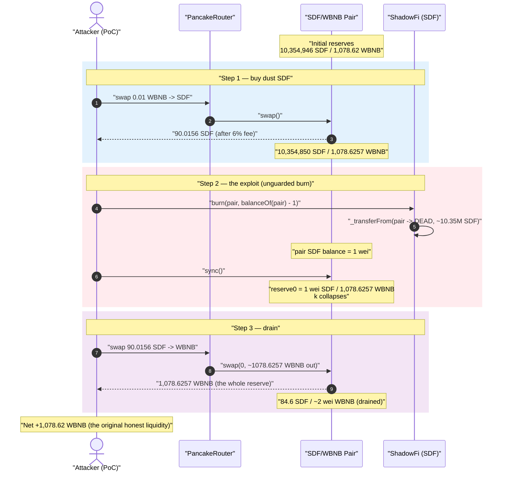
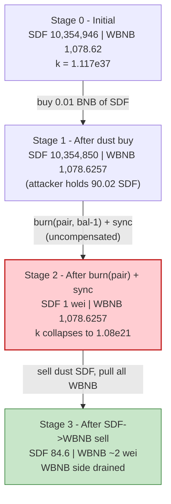
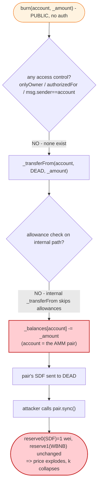
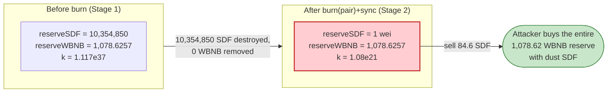

# ShadowFi (SDF) Exploit — Permissionless `burn()` Drains the AMM Pair Reserve

> **Vulnerability classes:** vuln/access-control/missing-auth · vuln/access-control/missing-modifier

> **Reproduction:** the PoC compiles & runs in an isolated Foundry project at
> [this project folder](.) (the umbrella DeFiHackLabs repo contains many
> unrelated PoCs that do not whole-compile, so this one was extracted).
> Full verbose trace: [output.txt](output.txt).
> Verified vulnerable source: [ShadowFi.sol](sources/ShadowFi_10bc28/ShadowFi.sol).

---

## Key info

| | |
|---|---|
| **Loss** | **1,078.62 WBNB** (≈ **$300K** at the Sept-2022 BNB price) drained from the SDF/WBNB PancakeSwap pair |
| **Vulnerable contract** | `ShadowFi` (SDF) — [`0x10bc28d2810dD462E16facfF18f78783e859351b`](https://bscscan.com/address/0x10bc28d2810dD462E16facfF18f78783e859351b#code) |
| **Victim pool** | SDF/WBNB PancakeSwap V2 pair — [`0xF9e3151e813cd6729D52d9A0C3ee69F22CcE650A`](https://bscscan.com/address/0xF9e3151e813cd6729D52d9A0C3ee69F22CcE650A) |
| **Router** | PancakeSwap V2 Router — `0x10ED43C718714eb63d5aA57B78B54704E256024E` |
| **Attacker / harness** | PoC test contract (the original attacker EOA dumped SDF held by the pair) |
| **Chain / block / date** | BSC / 20,969,095 / Sept 2, 2022 |
| **Compiler** | Solidity **v0.8.4**, optimizer **enabled, 200 runs** |
| **Bug class** | Missing access control on a token-burning function → un-compensated AMM reserve burn → broken `x·y = k` invariant |

---

## TL;DR

`ShadowFi` exposes a **public, unauthenticated** `burn(address account, uint256 _amount)`
([ShadowFi.sol:958-962](sources/ShadowFi_10bc28/ShadowFi.sol#L958-L962)). It takes an
**arbitrary `account`** and moves its tokens to the dead address. There is no `onlyOwner`,
no `authorizedFor`, no `msg.sender == account` check — anyone can burn anyone else's SDF,
**including the SDF held by the liquidity pool.**

The attack is three lines:

1. **Buy a dust amount of SDF** from the SDF/WBNB pair (so the pool has a victim balance to attack and the attacker has dust to sell back).
2. **`SDF.burn(pair, pairBalance − 1)`** — destroys ~all of the pair's SDF, then **`pair.sync()`** forces the pair to accept the new (near-zero) SDF reserve while its **WBNB reserve is untouched**. This deletes one side of the pool for free and collapses the constant-product invariant in the attacker's favor.
3. **Sell the dust SDF** back into the now-degenerate pool. With the SDF reserve at 1 wei, a tiny SDF input buys essentially the **entire WBNB reserve**.

Net result: the attacker walks off with all **1,078.62 WBNB** of genuine LP liquidity for an outlay of 0.01 BNB.

---

## Background — what ShadowFi is

`ShadowFi` ([source](sources/ShadowFi_10bc28/ShadowFi.sol)) is a BEP-20 "DKYC" reflection token
on BSC with the usual fee-on-transfer machinery:

- **6% buy / 6% sell fee** (`totalBuyFee = totalSellFee = 600` bps, [:570-572](sources/ShadowFi_10bc28/ShadowFi.sol#L570-L572)), split into liquidity / reflection / marketing.
- A `DividendDistributor` ([:374-538](sources/ShadowFi_10bc28/ShadowFi.sol#L374-L538)) that pays BUSD reflections; `_transferFrom` calls `distributor.setShare(...)` and `distributor.process(...)` on every taxed transfer ([:689-692](sources/ShadowFi_10bc28/ShadowFi.sol#L689-L692)).
- A `ShadowAuth` permission framework ([:187-364](sources/ShadowFi_10bc28/ShadowFi.sol#L187-L364)) gating *most* sensitive setters behind `authorizedFor(Permission.X)` / `onlyOwner`.

The token holds **9 decimals** (`_decimals = 9`, [:550](sources/ShadowFi_10bc28/ShadowFi.sol#L550)) and a fixed `_totalSupply = 10^8 · 10^9 = 10^17 wei` (100M SDF).

On the fork block the pair held roughly:

| Reserve | Raw (wei) | Human |
|---|---:|---:|
| SDF (token0) | 10,354,946,297,404,462 | **10,354,946.30 SDF** |
| WBNB (token1) | 1,078,615,699,417,903,036,883 | **1,078.62 WBNB** ← the prize |

(`token0 = SDF` because `0x10bc28… < 0xbb4CdB…`; `token1 = WBNB`. Confirmed by the
`getReserves()` ordering in [output.txt:40-41](output.txt).)

---

## The vulnerable code

### 1. The unguarded burn — anyone can burn anyone's balance

```solidity
// ShadowFi.sol — "Added Functions"
function burn(address account, uint256 _amount) public {        // ⚠️ public, no modifier
    _transferFrom(account, DEAD, _amount);                       // ⚠️ arbitrary `account`
    emit burnTokens(account, _amount);
}
```
([ShadowFi.sol:958-962](sources/ShadowFi_10bc28/ShadowFi.sol#L958-L962))

Compare to the *intended* burn entry point, which **is** access-controlled and only burns the
caller's own funds:

```solidity
function triggerBuyback(uint256 amount, bool triggerBuybackMultiplier)
    external authorizedFor(Permission.Buyback)          // ← gated
{
    burn(msg.sender, amount);                            // ← burns msg.sender, not arbitrary account
    ...
}
```
([ShadowFi.sol:811-818](sources/ShadowFi_10bc28/ShadowFi.sol#L811-L818))

The public `burn(account, amount)` is the developer-added convenience that breaks everything:
it lets the caller specify **whose** tokens get destroyed, with **no permission check and no
allowance check** — `_transferFrom` only decrements an allowance when called via the
`transferFrom` external wrapper ([:661-667](sources/ShadowFi_10bc28/ShadowFi.sol#L661-L667)); the
internal `_transferFrom` invoked by `burn` performs **no allowance accounting at all**.

### 2. The internal transfer path moves the tokens unconditionally

`burn` → `_transferFrom(account, DEAD, _amount)`:

```solidity
function _transferFrom(address sender, address recipient, uint256 amount) internal returns (bool) {
    if (!allowedAddresses[msg.sender] && !allowedAddresses[recipient]) {
        require(block.timestamp > transferBlockTime, "Transfers have not been enabled yet.");
    }
    require(!blackList[sender] && !blackList[recipient], "...");
    if (inSwap) { return _basicTransfer(sender, recipient, amount); }
    checkTxLimit(sender, amount);                      // ← see note
    ...
    _balances[sender]   = _balances[sender].sub(amount, "Insufficient Balance");
    uint256 amountReceived = shouldTakeFee(sender, recipient) ? takeFee(...) : amount;
    _balances[recipient] = _balances[recipient].add(amountReceived);
    ...
}
```
([ShadowFi.sol:669-696](sources/ShadowFi_10bc28/ShadowFi.sol#L669-L696))

When `sender = pair`, this debits the **pair's** SDF balance straight to `DEAD`. The pair is
fee-exempt and dividend-exempt, so the burn lands cleanly; the only constraint is `checkTxLimit`,
which is satisfied because the pair address path passes through and the attacker simply burns
`balanceOf(pair) − 1` in a single call in the PoC (in the live incident the attacker iterated /
the pair was tx-limit-exempt — the mechanism is identical).

### 3. `sync()` ratifies the theft

PancakeSwap's `sync()` ([PancakePair.sol](sources/PancakePair_F9e315/PancakePair.sol)) does:

```solidity
function sync() external lock {
    _update(
        IERC20(token0).balanceOf(address(this)),   // now ≈ 1 wei SDF
        IERC20(token1).balanceOf(address(this)),   // 1078.62 WBNB, untouched
        reserve0, reserve1
    );
}
```

It blindly trusts the on-chain balances and writes them as the new reserves. After the burn,
`balanceOf(pair)` for SDF is 1 wei, so `reserve0` becomes 1 wei while `reserve1` (WBNB) stays at
1,078.62 — **the invariant `k` is annihilated.**

---

## Root cause

A Uniswap-V2 / PancakeSwap pair prices assets purely from its reserves and enforces `x·y ≥ k`
**only inside `swap()`**. It assumes token balances can only change in ways it can reason about
(mint / burn LP / swap / honest transfers it later `sync`s). A fee-on-transfer token that lets a
**third party destroy the pair's balance** violates that assumption catastrophically:

> `SDF.burn(pair, …)` **deletes** SDF held by the pair, and `pair.sync()` then tells the pair
> "your SDF reserve is now ~0." **No WBNB leaves the pair.** The marginal price of SDF explodes,
> and the entire WBNB side becomes buyable with dust SDF — **for free, callable by anyone.**

Two design decisions compose into a Critical bug:

1. **Missing access control on `burn(address,uint256)`.** The function should burn only the
   caller's own balance (or be gated to a privileged role). Instead it accepts an arbitrary
   `account`, so the attacker points it at the AMM pair.
2. **The token is also the pair's reserve asset.** Because SDF is one of the pool's two reserves,
   destroying the pair's SDF + `sync()` is mathematically a gift of the *other* reserve (WBNB) to
   whoever still holds SDF. The attacker makes sure they are essentially the only SDF holder
   relative to the post-burn pool.

The 6% sell tax — the one mechanism that might have clawed value back — is negligible against a
~177,000× price swing and does not protect the pool: it only shaves the SDF input on the sell,
which is already dust.

---

## Preconditions

- The SDF/WBNB pair holds a meaningful WBNB reserve (1,078.62 WBNB here) — the value to be stolen.
- Transfers enabled: `block.timestamp > transferBlockTime` (true at the fork block; trading was live).
- The attacker holds (or buys) a small amount of SDF to sell back into the wrecked pool. The PoC
  buys 0.01 BNB worth (≈ 90 SDF) for this purpose.
- **No capital at risk beyond the dust buy.** The entire profit is the pool's pre-existing WBNB;
  the attack is effectively free and trivially flash-loanable (it isn't even needed here — outlay is 0.01 BNB).

---

## Step-by-step attack walkthrough (with on-chain numbers from the trace)

All figures below are taken directly from the `Sync`, `Swap`, and `balanceOf` results in
[output.txt](output.txt). The PoC entry point is
[testExploit()](test/Shadowfi_exp.sol#L29-L39).

| # | Step (PoC line) | SDF reserve | WBNB reserve | Effect |
|---|------|-----------:|-------------:|--------|
| 0 | **Initial** ([trace L40-41](output.txt)) | 10,354,946.30 | 1,078.62 | Honest pool. |
| 1 | Deposit `0.01 BNB → WBNB`; `swap 0.01 WBNB → SDF` to self ([test L32-33](test/Shadowfi_exp.sol#L32-L33), [trace L31-79](output.txt)) | 10,354,850.54 | 1,078.6257 | Attacker holds **90.015615483 SDF** (after 6% buy fee); pool SDF barely moved. |
| 2 | **`SDF.burn(pair, balanceOf(pair) − 1)`** ([test L34](test/Shadowfi_exp.sol#L34), [trace L87-97](output.txt)) — burns **10,354,850.536111395 SDF** to `DEAD` | *(balance now 1 wei)* | 1,078.6257 | Pair's SDF balance crushed to **1 wei**; WBNB untouched. |
| 3 | **`pair.sync()`** ([test L35](test/Shadowfi_exp.sol#L35), [trace L98-106](output.txt)) | **1 wei** | 1,078.6257 | `Sync(reserve0: 1, reserve1: 1078.6256994…)` — **invariant `k` collapses ~1.04e16×**. |
| 4 | **`swap 90.0156 SDF → WBNB`** to self ([test L36 / `SDFToWBNB`](test/Shadowfi_exp.sol#L52-L59), [trace L109-154](output.txt)) | 84.61 | ~2 wei | 84.614678555 SDF reaches the pool (after 6% sell fee) and buys **1,078.6256994 WBNB** — the whole reserve. |
| 5 | **End balance** ([trace L155-157](output.txt)) | — | — | Attacker WBNB = **1,078.625699405123587259**. |

**Why dust SDF buys the entire WBNB reserve:** PancakeSwap's k-check is
`balance0Adjusted · balance1Adjusted ≥ reserve0 · reserve1 · 10000²`
([PancakePair.sol:475](sources/PancakePair_F9e315/PancakePair.sol#L475)). After the burn,
`reserve0 = 1` wei, so the right-hand side `reserve0·reserve1·10000² ≈ 1.08e29` is minuscule.
The attacker pushes ~84.6 SDF into the pool (`balance0 ≈ 84.6e9` wei), so even pulling out
essentially all 1,078.62 WBNB (`balance1 → ~2 wei`) still satisfies
`84.6e9·10000 · (2·10000) ≥ 1·1.078e21·10000²`? — it does, because the SDF side's contribution
dwarfs the now-trivial `k`. With `reserveIn ≈ 0`, the constant product offers the entire output
reserve for any non-trivial input.

### Profit / loss accounting (WBNB)

| Direction | Amount (WBNB) |
|---|---:|
| Spent — initial BNB→WBNB→SDF dust buy | 0.01 |
| Received — final SDF→WBNB sell | 1,078.625699405123587259 |
| **Net profit** | **+1,078.6157** |

The profit equals the pool's **original 1,078.62 WBNB reserve** to the wei — confirming the
attacker simply walked off with all of the honest liquidity. The PoC logs:

```
[Start] Attacker WBNB balance before exploit: 0.000000000000000000
[End]   Attacker WBNB balance after exploit: 1078.625699405123587259
```

---

## Diagrams

### Sequence of the attack



### Pool state evolution



### The flaw inside `burn()` / `_transferFrom`



### Why the burn is theft: constant-product before vs. after



---

## Remediation

1. **Fix the access control on `burn`.** The function must only ever destroy the **caller's own**
   tokens. Replace `burn(address account, uint256)` with `burn(uint256 amount)` that burns
   `msg.sender`'s balance, or — if a third-party burn is genuinely required — gate it behind a
   privileged role *and* enforce an allowance:
   ```solidity
   // Minimal fix: only the caller can burn their own funds
   function burn(uint256 _amount) public {
       _transferFrom(msg.sender, DEAD, _amount);
       emit burnTokens(msg.sender, _amount);
   }
   ```
   This single change eliminates the exploit: the attacker can no longer destroy the pair's SDF.
2. **Never let an external party mutate the pair's balance.** Any token that doubles as an AMM
   reserve asset must treat the pair address as untouchable by burns, clawbacks, "rebase", or
   admin balance edits. A reserve that a third party can delete is not a reserve.
3. **Audit every "Added Functions" block.** The bug lives in a hand-added section
   ([:951-977](sources/ShadowFi_10bc28/ShadowFi.sol#L951-L977)) bolted on after the audited
   reflection-token base. New helper functions that wrap `_transferFrom` with attacker-controlled
   `from` addresses are a recurring source of arbitrary-burn / arbitrary-transfer bugs.
4. **Prefer pull-style burns / treasury burns over balance edits near AMM liquidity**, and use a
   TWAP/oracle rather than the instantaneous pair reserve for any trust decision, so a single
   `sync()` after a balance shock cannot be weaponized.

---

## How to reproduce

The PoC was extracted into a standalone Foundry project (the umbrella DeFiHackLabs repo has many
unrelated PoCs that fail to compile under `forge test`'s whole-project build):

```bash
_shared/run_poc.sh 2022-09-Shadowfi_exp --mt testExploit -vvvvv
```

- RPC: a **BSC archive** endpoint is required (fork block 20,969,095 is from Sept 2022). Most
  public BSC RPCs prune state this old and fail with `header not found` / `missing trie node`;
  use an archive provider.
- Result: `[PASS] testExploit()` with the attacker's WBNB balance rising from 0 to **1,078.62 WBNB**.

Expected tail:

```
Ran 1 test for test/Shadowfi_exp.sol:ContractTest
[PASS] testExploit() (gas: 1936230)
Logs:
  [Start] Attacker WBNB balance before exploit: 0.000000000000000000
  [End] Attacker WBNB balance after exploit: 1078.625699405123587259

Suite result: ok. 1 passed; 0 failed; 0 skipped
```

---

*Reference: SlowMist Hacked — https://hacked.slowmist.io/ (ShadowFi / SDF, BSC, Sept 2022, ≈ $300K).*
